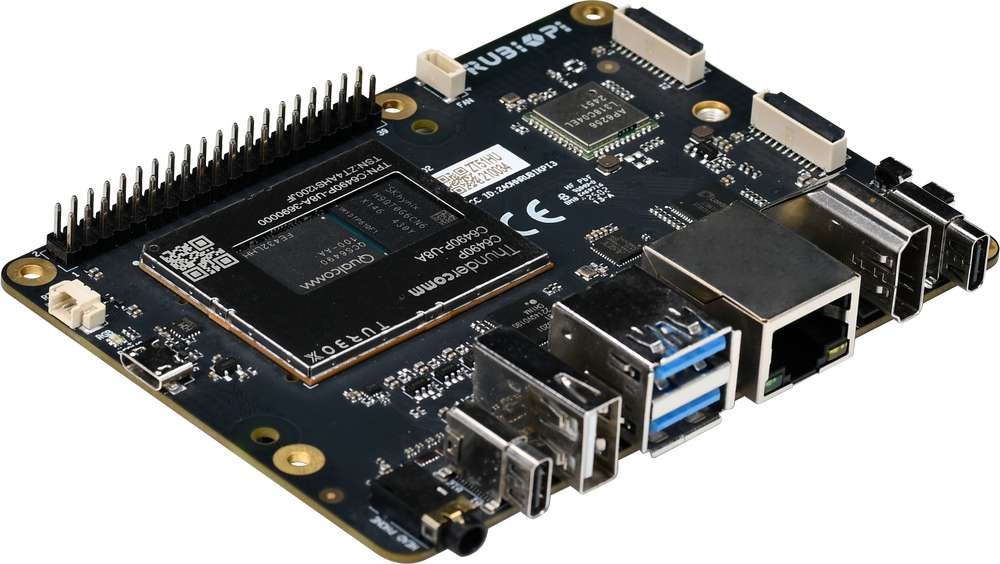
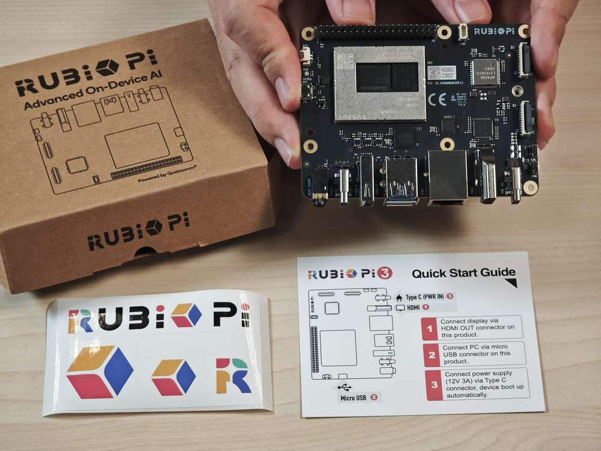
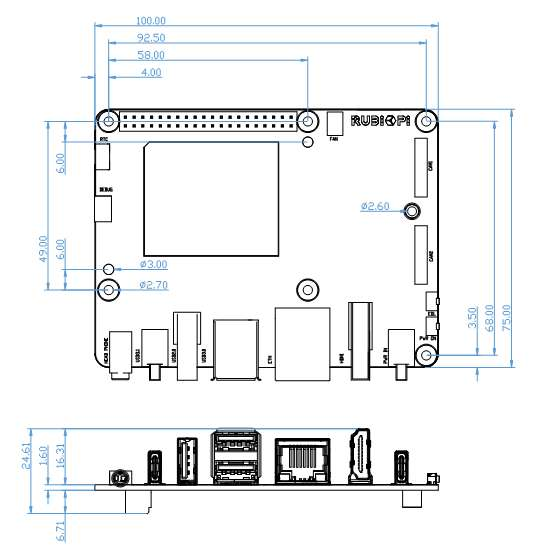

import Tabs from '@theme/Tabs';
import TabItem from '@theme/TabItem';

# Device Specifications

The **RUBIK Pi 3**, powered by the **Qualcomm® QCS6490** SoC, is engineered for high-performance computing and seamless integration with modern development workflows. This guide walks you through setting up your board with **Android 15**, enabling you to explore and prototype end-to-end AI and multimedia applications.  
At its core, the RUBIK Pi 3 features:  
-- **Qualcomm® Kryo™ 670**  
-- **Qualcomm® Hexagon™ Processor** with fused AI-accelerator architecture  
-- **12 TOPS** of AI performance for real-time inference and machine learning workloads  

Designed with versatility in mind, the RUBIK Pi 3 includes a wide array of interfaces:  
-- **USB, Camera, DisplayPort, HDMI**  
-- **Ethernet, 3.5mm headphone jack**  
-- **Wi-Fi, Bluetooth**  
-- **M.2 connector, Fan, RTC**  
-- **40-pin LS connector**  
These features support a wide range of development scenarios, enabling rapid prototyping and efficient debugging.      

-----------

### Packaging

* RUBIK Pi 3
* RUBIK Pi sticker
* Quick Start Guide

### Mechanical specification

*All dimensions are in millimeters.

### Introduction to the board

| No. | Interface                      | No. | Interface                    |
|-----|--------------------------------|-----|------------------------------|
| 1   | RTC battery connector          | 10  | Power Delivery over Type-C   |
| 2   | Micro USB (UART debug)         | 11  | PWR button                   |
| 3   | TurboX C6490P SOM              | 12  | EDL button                   |
| 4   | 3.5mm headphone jack           | 13  | Camera connector 2           |
| 5   | USB Type-C with DP (USB 3.1)   | 14  | Camera connector 1           |
| 6   | USB Type-A (USB 2.0)           | 15  | Wi-Fi/Bluetooth module       |
| 7   | 2 x USB Type-A (USB 3.0)       | 16  | Fan connector                |
| 8   | 1000M Ethernet                 | 17  | 40-pin connector             |
| 9   | HDMI OUT                       | 18  | M.2 Key M connector          |

### Required components for setup

| Component | Required |
|-----------|--------------|
| Power Supply (12V, 3A) | Yes |
| USB Type-C to USB Type-A or a Type-C cable | Yes (Flashing and ADB debugging) |
| Micro USB cable | Yes (Serial prompt access) |
| HDMI cable | Yes (Display) |
| USB Mouse and Keyboard | Optional (Single Board Computer) |
| IMX219 and IMX477 | Optional (Testing CSI camera features) |
| USB camera | Optional (Testing USB camera features) |

