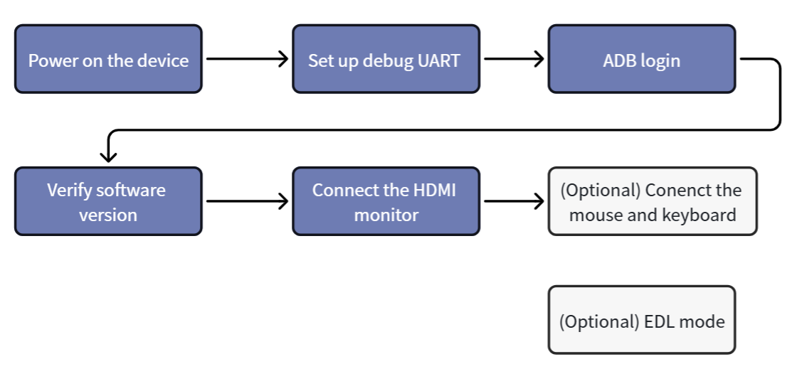
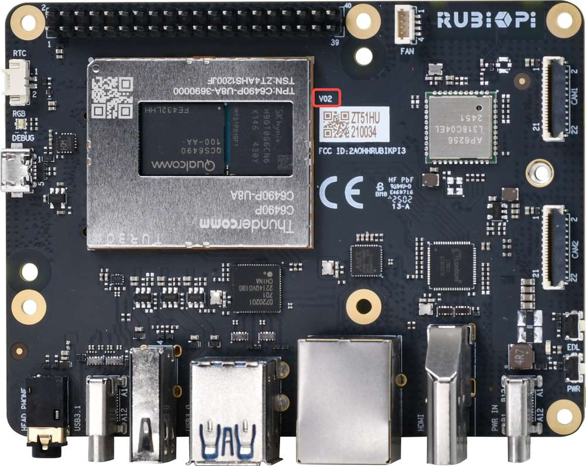
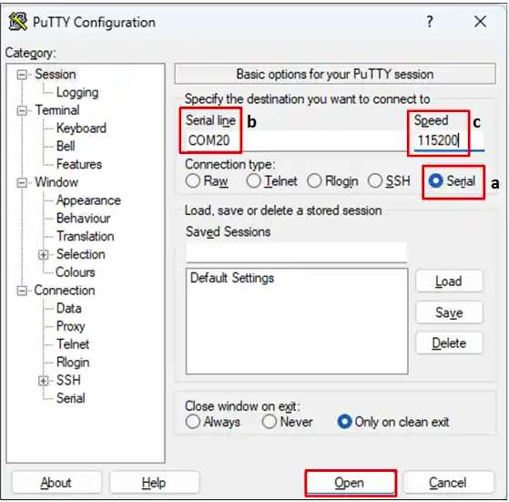
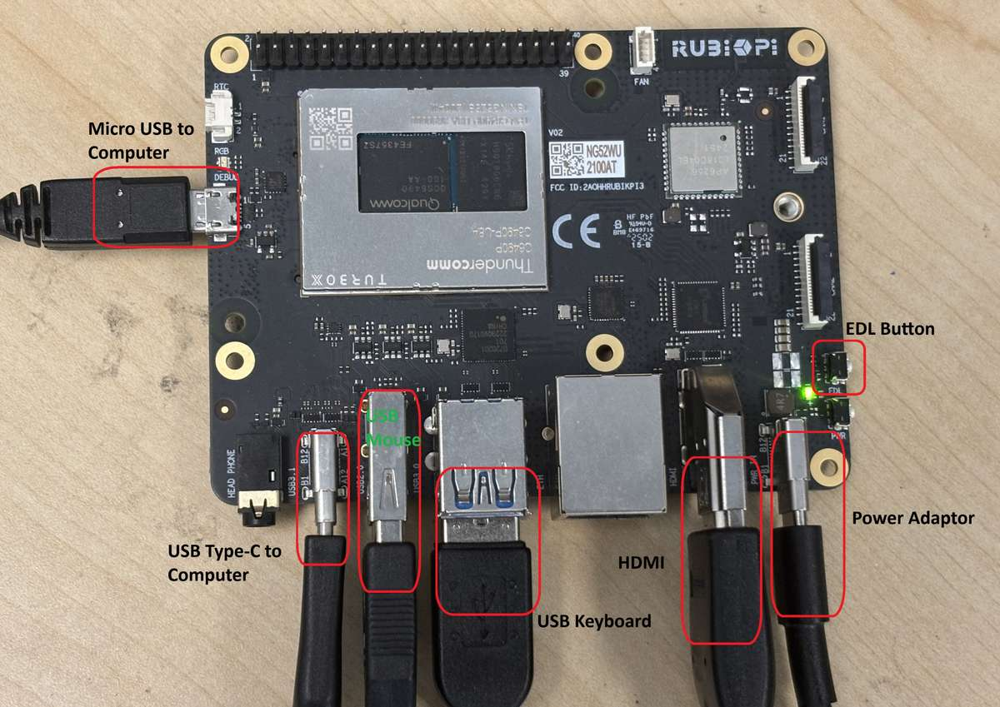
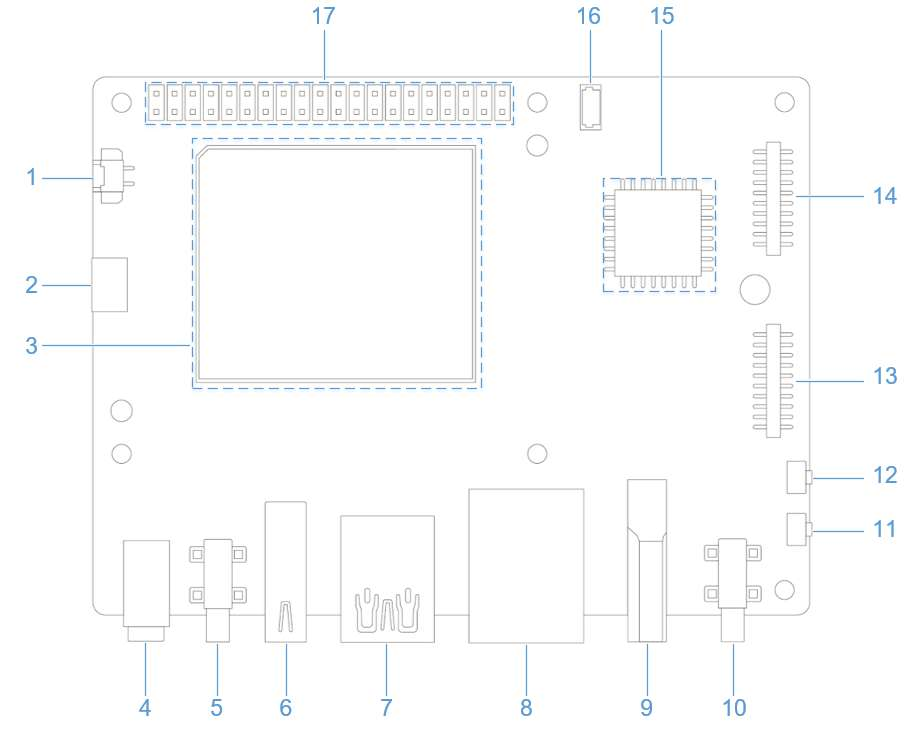
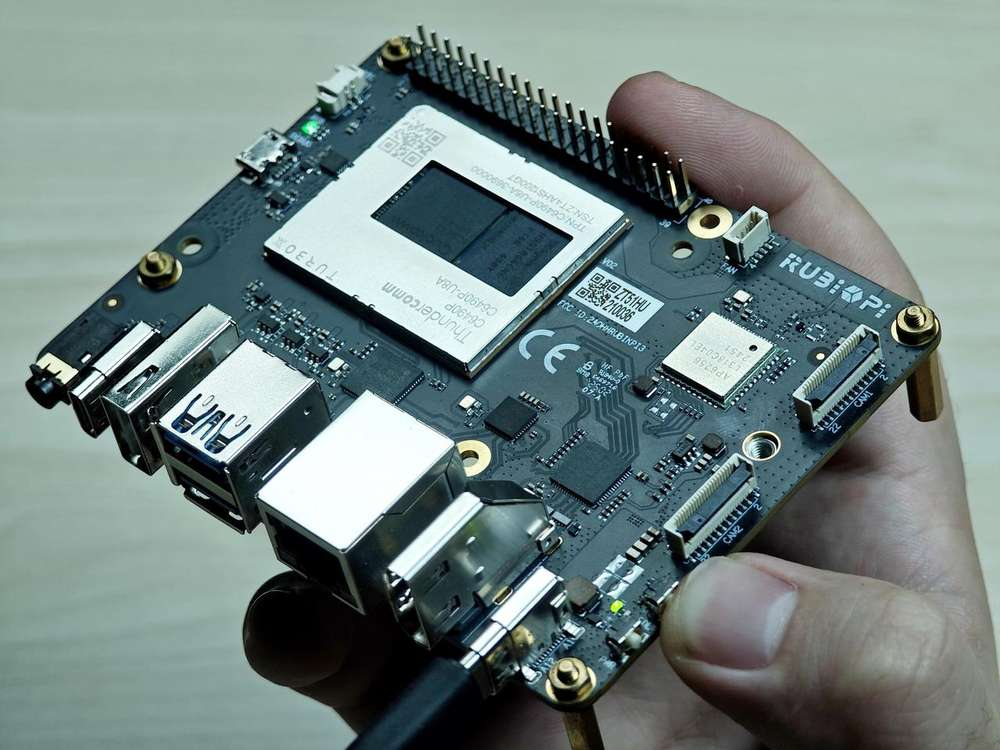

import Tabs from '@theme/Tabs';
import TabItem from '@theme/TabItem';

# Set Up Your Device

This chapter describes the basic setup workflow for **RUBIK Pi 3** running **Android 15**. Complete power-on, debug UART setup, ADB login, software version verification, HDMI monitor connection, mouse and keyboard connection, and EDL mode setup in the following order.

### Let's Get Started



<a id="poweron"></a>

## Power on the device

Connect a 12 V/3 A USB Type-C power adapter.

:::warning
RUBIK Pi 3 supports Power Delivery (PD) 3.0 power input. **A Type-C 12V 3A power adapter compliant with PD 3.0 is required for input power.** Refer to [Peripheral Compatibility List](https://www.thundercomm.com/rubik-pi-3/en/docs/peripheral-compatibility-list) for the verified accessories.

The power indicator LED near the power port will turn on if the power adapter meets requirements and power negotiation succeeds. If the adapter does not meet requirements, the LED will remain off and the device will not boot.
:::

:::note
Connect a USB Type-C to USB Type-A or a Type-C cable for ADB debugging and flashing.
:::

Board versions v02 and later support automatic power-on after the power adapter is connected. You can check the hardware version number at the following location on the board. In the example below, the hardware version is V02.



:::note
If the blue LED on the board is constantly lit, it indicates that the power button was pressed for too long, and the board is in fastboot mode. Please refer to [FAQ](https://www.thundercomm.com/rubik-pi-3/en/docs/rubik-pi-3-user-manual/1.0.0-u/Troubleshooting/troubleshooting#how-do-i-exit-fastboot-mode-on-the-rubik-pi-3) to exit the fastboot mode.
:::

<a id="setUART"></a>

## Set up the debug UART

The debug UART displays diagnostic messages and provides access to the device via a UART shell.

1. Connect a Micro-USB cable to the Micro-USB port on your RUBIK Pi 3.

   

2. Connect the other end of the Micro-USB cable to the host. Follow one of the following instructions based on the host operating system.

<Tabs>
<TabItem value="Ubuntuhost" label="Ubuntu host">

1. Run the following commands to install screen for accessing the UART console.
   ```shell
   sudo apt update
   sudo apt install screen
   ```

2. Run the following command to check the USB port:
    ```shell
   ls /dev/ttyACM*
   ```

    Sample output

    ```shell
    /dev/ttyACM0
    ```

3. Run the following command to open the debug UART session.
   ```shell
   sudo screen <serial_port> 115200
   ```

    Example:
    ```shell
    sudo screen /dev/ttyACM0 115200
    ```

</TabItem>
<TabItem value="winhost" label="Windows host">

1. Download and install [PuTTY](https://www.chiark.greenend.org.uk/~sgtatham/putty/) for your Windows host.
2. Open the PuTTY application from the list of installed programs in the **Start** menu.
3. In the PuTTY Configuration dialog box, select **Serial**.
4. Specify the serial line based on the UART port detected in Windows Device Manager.
5. Set the baud rate to `115200`.
6. Click **Open** to start the PuTTY session.

   

:::note
If the UART port is not detected, download the driver and update it using Windows Device Manager:

* On x86 systems: [USB to UART serial driver](https://ftdichip.com/wp-content/uploads/2023/09/CDM-v2.12.36.4-WHQL-Certified.zip).
* On Arm(®) systems: Visit https://oemdrivers.com/usb-ft232r-usb-uart-arm64 and download **FTDI CDM VCP Drivers**.
:::

</TabItem>
<TabItem value="machost" label="macOS host">

1. Run the following command to check the serial device connected to the macOS host.
   ```shell
   ls /dev/cu.*
   ```

2. Find your device in the list of serial devices.

   

3. Run the following command to open the serial device.

   ```shell
   screen <serial_device_node> 115200
   ```

   Example:

   ```shell
   screen /dev/cu.usbserial-DM03SDQQ 115200
   ```

</TabItem>
</Tabs>

:::tip
If no serial log or shell prompt appears, check the Micro USB connection and reconnect the cable.
:::

<a id="adbLogin"></a>

## ADB login

Android Debug Bridge (ADB) is used to establish a debugging connection between the host and the RUBIK Pi 3 Android 15 system. Connect the host to the USB Type-C port on RUBIK Pi 3 with a USB Type-C data cable.

:::note
The following commands apply to Android userdebug images. User images may not support `adb root`.
:::

<Tabs>
<TabItem value="winhost" label="Windows host">

### Preparation

1. Download and extract ADB and Fastboot from https://developer.android.google.cn/tools/releases/platform-tools.
2. Add the `platform-tools` directory to the Windows `Path` environment variable.
3. Press **Win** + **R** and enter `cmd` to open a Windows terminal.

### Login

Run the following commands in the terminal to log in to RUBIK Pi 3:

```shell
adb devices
adb root
adb shell
```

</TabItem>
<TabItem value="ubuntuhost" label="Ubuntu host">

### Preparation

1. Install ADB and Fastboot:

    ```shell
    sudo apt update
    sudo apt install git android-tools-adb android-tools-fastboot wget
    ```

2. Update the udev rules file:

    ```shell
    sudo vi /etc/udev/rules.d/51-qcom-usb.rules
    ```

3. Add the following line to the file if it does not already exist:

    ```shell
    SUBSYSTEMS=="usb", ATTRS{idVendor}=="05c6", ATTRS{idProduct}=="9008", MODE="0666", GROUP="plugdev"
    ```

4. Restart `udev`:

    ```shell
    sudo systemctl restart udev
    ```

:::note
If RUBIK Pi 3 is already connected to the host, reconnect the USB cable for the updated rule to take effect.
:::

### Login

Run the following commands in the terminal to log in to RUBIK Pi 3:

```shell
adb devices
adb root
adb shell
```

</TabItem>
</Tabs>

After successful login to RUBIK Pi 3, the terminal enters the Android shell, where you can run debugging commands such as `getprop`, `logcat`, and `dmesg`.

## Verify the software version

After setup, run the following commands on the host to verify the Android version:

```shell
adb shell getprop ro.product.model
adb shell getprop ro.build.version.release
adb shell getprop ro.build.id
adb shell getprop ro.build.display.id
adb shell getprop ro.build.fingerprint
```

Sample output:

```shell
Thundercomm Rubik Pi 3
15
AQ3A.250612.001
qssi-userdebug 15 AQ3A.250612.001 45468 test-keys
Thundercomm/rubikpi/rubikpi:15/AQ3A.250612.001/45468:userdebug/test-keys
```

You can also choose **Settings** > **About phone** in the Android graphical interface to view device information.


:::note
The sample output is from an Android 15 userdebug build. Build number, fingerprint, and build type may differ between release packages.
:::

<a id="conHDMI"></a>

## Connect an HDMI monitor

To view the Android graphical interface, perform the following steps to connect an HDMI monitor:

1. Connect one end of the HDMI cable to the HDMI OUT port on RUBIK Pi 3.
2. Connect the other end to the monitor.

   

3. Power on the device and wait until Android 15 boots.
4. If there is no display output, confirm that the monitor input source is set to the correct HDMI port and that the power adapter supports 12 V/3 A PD 3.0.

## Connect a mouse and keyboard

Connect a USB keyboard and mouse to the Type-A ports.


Once connected, you can complete Wi-Fi configuration, check settings, and manage application operations within the Android GUI.

## Port connections


## Enter EDL mode

Emergency Download (EDL) mode is used by Qualcomm Device Loader (QDL) to flash firmware and system images to RUBIK Pi 3. If the device has already been flashed and can boot normally, skip this section during initial setup.

<a id="enterEDL"></a>



<Tabs>
<TabItem value="method1" label="Method 1: EDL button">

1. Disconnect the power from port 10 and unplug the Type-C cable from port 5.
2. Press and hold the **EDL** button (No.12 in the figure above).
   
3. While holding down the **EDL** button, connect the power cable to port 10.
   
4. While holding down the **EDL** button, connect the Type-C cable to port 5 and wait for 3 seconds to enter 9008 mode.
   
5. Release the **EDL** button.

</TabItem>
<TabItem value="method2" label="Method 2: ADB command">

If Android 15 is running and ADB is available, run:

```shell
adb shell reboot edl
```
:::note
Before running this command, ensure that the device is connected to the host computer via a USB Type-C data cable and that the device is visible when executing `adb devices`.
:::

</TabItem>
</Tabs>