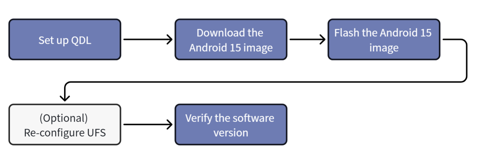
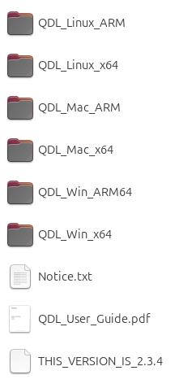
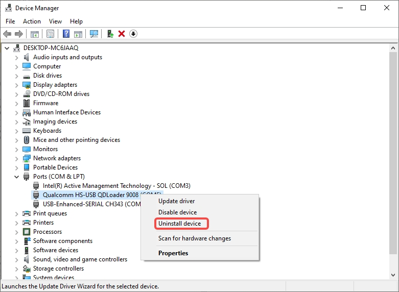
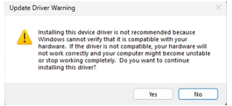
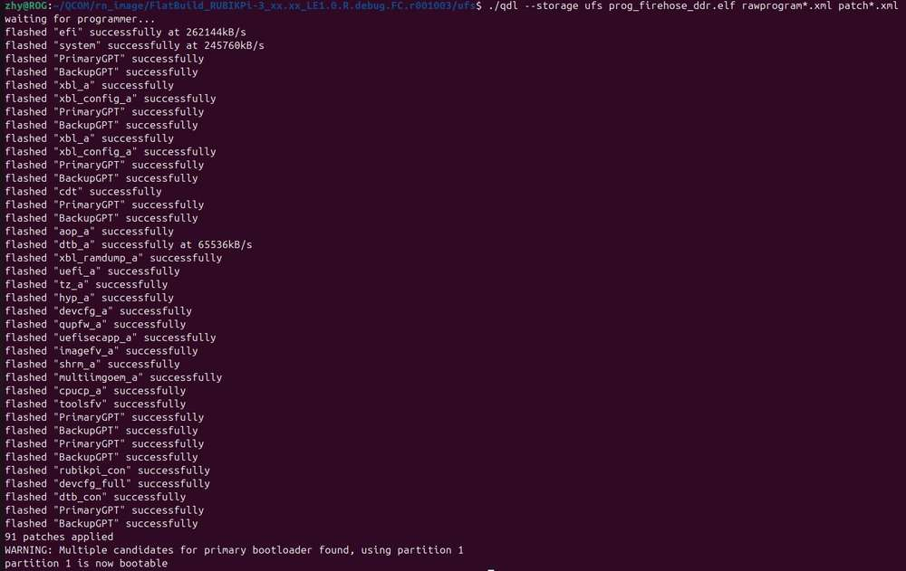
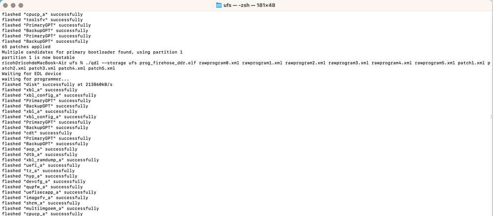
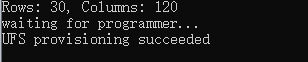
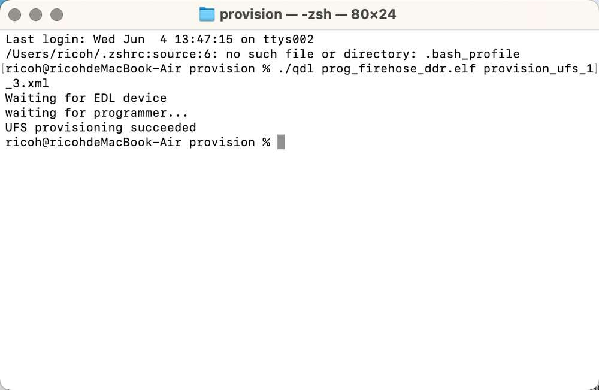

import Tabs from '@theme/Tabs';
import TabItem from '@theme/TabItem';

# Flash Images

This chapter describes how to flash an Android 15 image to RUBIK Pi 3 by using **Qualcomm Device Loader (QDL)**.

Before flashing, check the current software version. If your device is currently running Android, Qualcomm Linux (QLI), Ubuntu, or another system, follow this section to flash Android 15 by using **QDL**. This operation can be performed from an Ubuntu, Windows, or macOS host.

If the device is running Android 15, run:

```shell
adb shell getprop ro.build.version.release
adb shell getprop ro.build.display.id
adb shell getprop ro.build.fingerprint
```

Sample output:

```shell
15
qssi-userdebug 15 AQ3A.250612.001 45468 test-keys
Thundercomm/rubikpi/rubikpi:15/AQ3A.250612.001/45468:userdebug/test-keys
```

:::warning
Flashing the Android 15 image erases system data on the device. Back up important files before continuing, and make sure the image package matches your RUBIK Pi 3 hardware.
:::

:::info
- Before starting, complete the power-on and cable connection steps in [Set Up Your Device](./2.set-up-your-device.md#lets-get-started).
- The device must enter [EDL mode](./2.set-up-your-device.md#enter-edl-mode) before flashing.
- Android 15 images are usually provided as a FlatBuild package. Run the flashing command in the *ufs* directory of the image package.
:::

### Get Started



## 1. Set up QDL

**Qualcomm Device Loader (QDL)** is a cross-platform flashing tool. It loads a firehose programmer and flashes software images to Qualcomm® USB devices on **Windows**, **Ubuntu/Linux**, and **macOS** hosts.

1. Download QDL from [QDL tool](https://softwarecenter.qualcomm.com/catalog/item/Qualcomm_Device_Loader).
2. Extract the QDL package.
3. Complete the host preparation steps below.



<a id="flashQDL"></a>

<Tabs>
<TabItem value="uhost" label="Ubuntu host">

Execute the following command to install libusb and libxml2. If they are already installed, please skip this step.

```shell
sudo apt-get install libxml2-dev libudev-dev libusb-1.0-0-dev
```

</TabItem>
<TabItem value="whost" label="Windows host">

Install the WinUSB driver.

1. Open **Device Manager** and verify that the Qualcomm USB Driver (QUD) or any other conflicting drivers are not installed.
2. If the device appears under COM ports, right-click the device and select **Uninstall device**.

   

3. Check **Delete the driver software for this device.**

   

4. Power off the device and re-enter EDL mode.
5. In **Device Manager**, right-click the USB port of RUBIK Pi and select **Update driver**.

   

6. Select **Browse my computer for drivers**.

   

7. Under Universal Serial Bus devices, select **WinUsb Device**.

   

8. Click **Yes** to complete the driver update.

   

:::note
If `install_driver.bat` is included in the QDL toolkit, you can also run this script directly within the QDL folder to install the driver.
:::

</TabItem>
<TabItem value="mhost" label="macOS host">

Use the following method to install Homebrew. If it is already installed, please skip this step.

```shell
/bin/bash -c "$(curl -fsSL https://raw.githubusercontent.com/Homebrew/install/HEAD/install.sh)"
```

Run the following commands to install libusb and libxml2.

```shell
brew install libusb
brew install libxml2
```

</TabItem>
</Tabs>

## 2. Prepare the Android 15 image

1. Download the Android 15 image from RUBIK Pi 3 [System Image](https://www.thundercomm.com/rubik-pi-3/en/docs/image) page.
2. Extract the Android 15 FlatBuild package.
3. Go to the *ufs* directory.
4. Copy the QDL executable in [Step1](#1-set-up-qdl) for your host architecture to the *ufs* directory.

:::note
- On Windows, copy the QDL executable and required DLL files to the *ufs* directory.
- On Ubuntu, use the `qdl` from *QDL_Linux_x64* or *QDL_Linux_ARM*.
- On macOS, use the `qdl` from *QDL_Mac_x64* or *QDL_Mac_ARM*.
:::

## 3. Flash the Android 15 image

After confirming that the device is in EDL/9008 mode, run the flashing command in the *ufs* directory of the Android 15 FlatBuild package.

<Tabs>
<TabItem value="uhost" label="Ubuntu host">

Run the following command to flash the Android 15 image:

```shell
./qdl --storage ufs prog_firehose_ddr.elf rawprogram*.xml patch*.xml
```


</TabItem>
<TabItem value="whost" label="Windows host">

Run the following command to flash the Android 15 image:

```shell
<pathToQDL>\QDL.exe prog_firehose_ddr.elf rawprogram_unsparse0.xml rawprogram1.xml rawprogram2.xml rawprogram3.xml rawprogram4.xml rawprogram5.xml patch0.xml patch1.xml patch2.xml patch3.xml patch4.xml patch5.xml
```


Replace `<pathToQDL>` with the actual path of the *QDL_Win_x64* or *QDL_Win_ARM64* directory.

:::note
- Program filenames do not support wildcards. Each image file must be listed explicitly in Windows commands.
- Replace `<pathToQDL>` with the actual path to *QDL_Win_x64* or *QDL_Win_ARM64* directory.
- If the number of `rawprogram*.xml` or `patch*.xml` files in your Android 15 image package differs, please use the exact files provided in the package.
:::

</TabItem>
<TabItem value="mhost" label="macOS host">

Run the following command to flash the Android 15 image:

```shell
./qdl --storage ufs prog_firehose_ddr.elf rawprogram*.xml patch*.xml
```



</TabItem>
</Tabs>

:::tip
If flashing fails, disconnect and reconnect the power and USB data cable, enter EDL mode again, and rerun the flashing command.
:::

## 4. (Optional) Re-configure UFS 

If the device cannot boot after flashing, you can try reconfiguring UFS from the *provision* directory in the FlatBuild package.

:::warning
Provisioning may erase information stored in UFS, such as serial number and Ethernet MAC address. Run this step only when the device cannot boot after flashing or when UFS provisioning is explicitly required.
:::

<Tabs>
<TabItem value="uhost" label="Ubuntu host">

Copy `qdl` from *QDL_Linux_x64* or *QDL_Linux_ARM* to the *provision* directory and run:

```shell
./qdl prog_firehose_ddr.elf provision_ufs_1_3.xml
```


</TabItem>
<TabItem value="whost" label="Windows host">

Copy the QDL executable and required DLL files to the *provision* directory and run:

```shell
<pathToQDL>\QDL.exe prog_firehose_ddr.elf provision_ufs_1_3.xml
```



</TabItem>
<TabItem value="mhost" label="macOS host">

Copy `qdl` from *QDL_Mac_x64* or *QDL_Mac_ARM* to the *provision* directory and run:

```shell
./qdl prog_firehose_ddr.elf provision_ufs_1_3.xml
```



</TabItem>
</Tabs>

:::warning
After provisioning, manually reconnect the power cable and USB data cable to reboot the device, then flash the Android 15 image again.
:::

## 5. Verify the software version

After flashing completes, the device reboots automatically. Wait until Android 15 boots, connect the host with a USB Type-C data cable, and run the following command to check that the device is online:

```shell
adb devices -l
```
Run the following commands to check the Android version:

```shell
adb shell getprop ro.build.version.release
adb shell getprop ro.build.display.id
adb shell getprop ro.build.fingerprint
```

Sample output:

```shell
15
qssi-userdebug 15 AQ3A.250612.001 45468 test-keys
Thundercomm/rubikpi/rubikpi:15/AQ3A.250612.001/45468:userdebug/test-keys
```

Alternatively, you can verify the software version via the Android GUI. After connecting an HDMI monitor, a mouse, and a keyboard, navigate to **Settings** > **About phone**. On this page, you can view system information such as the device name, Android version, and build number; if the version fields are not visible on the current page, scroll down to view them.


:::note
The **About phone** page provides a quick way to confirm that the current system has successfully booted into Android 15, while the ADB command output can be used to record more comprehensive build ID and fingerprint data.
:::

---
> **Subsequent Steps**
> 
> After flashing the image, refer to [Set Up Your Device](2.set-up-your-device.md) to complete ADB login, software version verification, HDMI monitor connection, and mouse and keyboard connection.
