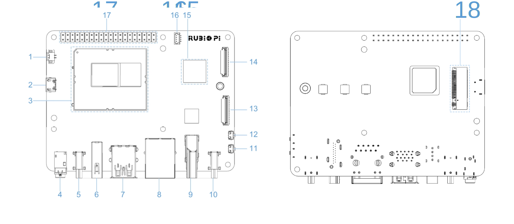
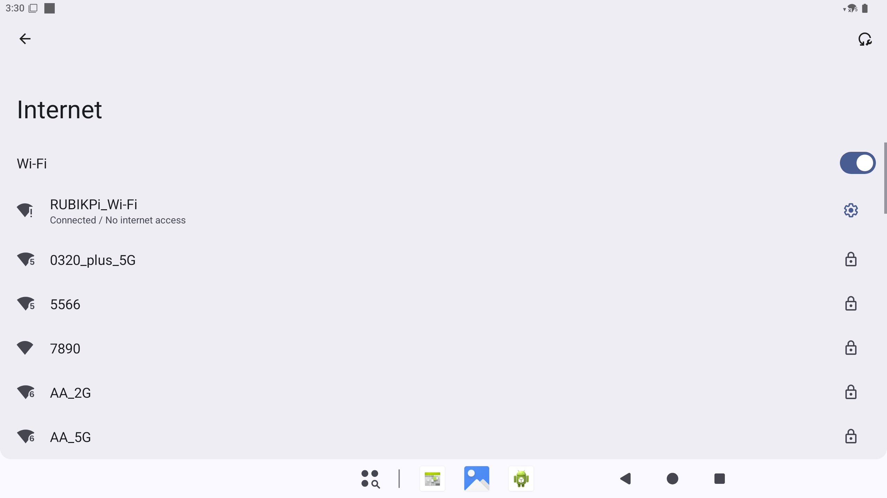

# Peripherals and Interfaces

This chapter describes how to verify common peripherals and interfaces of RUBIK Pi 3 running Android 15.

:::note
Before running commands, connect the host to RUBIK Pi 3 with a USB Type-C data cable and confirm that `adb devices` can detect the device.
:::

## Hardware resource diagram



| No. | Interface                      | No. | Interface                    |
|-----|--------------------------------|-----|------------------------------|
| 1   | RTC battery connector          | 10  | Power Delivery over Type-C   |
| 2   | Micro USB (UART debug)         | 11  | PWR button                   |
| 3   | TurboX C6490P SOM              | 12  | EDL button                   |
| 4   | 3.5mm headphone jack           | 13  | Camera connector 2           |
| 5   | USB Type-C with DP (USB 3.1)   | 14  | Camera connector 1           |
| 6   | USB Type-A (USB 2.0)           | 15  | Wi-Fi/Bluetooth module       |
| 7   | 2 x USB Type-A (USB 3.0)       | 16  | Fan connector                |
| 8   | 1000M Ethernet                 | 17  | 40-pin connector             |
| 9   | HDMI OUT                       | 18  | M.2 Key M connector          |


## USB

RUBIK Pi 3 provides two USB 3.0 Type-A ports, one USB 2.0 Type-A port, and one USB Type-C port. On Android 15, you can verify USB storage devices, USB audio devices, and ADB connection.

### USB storage device

1. Insert a USB flash drive into a USB Type-A port.
2. Open the **Files** app in the Android graphical interface.
3. If the external USB storage device appears and files can be browsed, USB storage is working normally.

:::warning
In the current Android 15 image, USB flash drives do not appear in the **Files** app. This is a known issue and will be fixed in a later release. Use the following ADB commands to verify whether the USB flash drive is detected by the system.
:::

Run ADB commands to check if the system detects the storage device:

```shell
adb shell sm list-volumes all
adb shell ls /mnt/media_rw
adb shell lsusb
adb shell cat /proc/partitions | grep -E "sd[a-z]|nvme"
```

In the current version, the USB flash drive is detected as a USB and block device, but it is not mounted as an Android public volume. Sample output:

```shell
private mounted null
emulated;0 mounted null
Bus 004 Device 005: ID 346d:5678
   8       96  122880000 sdg
   8       97  122879424 sdg1
```

After this issue is fixed in a later release, `sm list-volumes all` should show a new public volume and `/mnt/media_rw` should contain the corresponding mount directory.

### USB audio device

1. Connect a USB audio device to a USB Type-A port.
2. Play audio or video in the Android GUI.
3. If sound is output from the USB audio device, USB audio playback works normally.
4. If the USB audio device has a microphone, use a recording app to verify recording.

Run the following commands to check USB device enumeration:

```shell
adb shell lsusb
adb shell cat /proc/asound/cards
adb shell cat /proc/asound/card1/stream0
```

Sample output:

```shell
Bus 002 Device 002: ID 1b3f:2008

 0 [lahainarubikpi3]: lahaina-rubikpi - lahaina-rubikpi3-snd-card
                      lahaina-rubikpi3-snd-card
 1 [Device         ]: USB-Audio - USB Audio Device
                      GeneralPlus USB Audio Device at usb-xhci-hcd.2.auto-1, full speed

GeneralPlus USB Audio Device at usb-xhci-hcd.2.auto-1, full speed : USB Audio

Playback:
  Status: Stop
  Interface 1
    Altset 1
    Format: S16_LE
    Channels: 2
    Endpoint: 5 OUT (NONE)
    Rates: 44100, 48000
    Bits: 16

Capture:
  Status: Stop
  Interface 2
    Altset 1
    Format: S16_LE
    Channels: 1
    Endpoint: 6 IN (NONE)
    Rates: 44100, 48000
    Bits: 16
```

After a USB audio device is connected, `lsusb` shows the USB device, `/proc/asound/cards` shows the new sound card, and `/proc/asound/card1/stream0` shows Playback and Capture capabilities.

### ADB

Connect the host and RUBIK Pi 3 with a USB Type-C data cable, then run:

```shell
adb devices -l
```

If the device serial number is shown with `device`, ADB is working normally.

Sample output:

```shell
List of devices attached
d80af579               device usb:2-3 product:rubikpi model:Thundercomm_Rubik_Pi_3 device:rubikpi transport_id:2
```

## HDMI OUT

The HDMI OUT port is No. 9 in the hardware resource diagram and supports an external HDMI monitor.

1. Connect an HDMI cable to the HDMI OUT port on RUBIK Pi 3.
2. Power on the monitor and switch to the corresponding HDMI input source.
3. If Android Launcher is displayed normally, HDMI output is working normally.
4. Choose **Settings** > **Display** to check display status and resolution settings.

Sample display:


You can also check display service status:

```shell
adb shell dumpsys display | grep -i -E "DisplayDeviceInfo|mBaseDisplayInfo" | head -4
```

Sample output:

```shell
DisplayDeviceInfo{"Built-in Screen": uniqueId="local:4630946674560563842", 2560 x 1440, modeId 1, renderFrameRate 60.000004, ...}
mBaseDisplayInfo=DisplayInfo{"Built-in Screen", displayId 0, ... real 2560 x 1440, ...}
```

## DisplayPort

The USB Type-C port on RUBIK Pi 3 supports DisplayPort output.

1. Connect a monitor using a Type-C to DP or Type-C to HDMI adapter cable that supports DP Alt Mode.
2. Switch the monitor to the corresponding input source.
3. If the Android GUI is displayed, DisplayPort output is working normally.
4. Choose **Settings** > **Display** to check display status.

Sample display:


Run the following command to view the display information:

```shell
adb shell dumpsys display | grep -i -E "DisplayDeviceInfo|mBaseDisplayInfo" | head -4
```

Sample output:

```shell
DisplayDeviceInfo{"Built-in Screen": uniqueId="local:4630946674560563842", 2560 x 1440, modeId 1, renderFrameRate 60.000004, ...}
mBaseDisplayInfo=DisplayInfo{"Built-in Screen", displayId 0, ... real 2560 x 1440, ...}
```

## Wi-Fi

Android 15 supports Wi-Fi STA mode and hotspot mode.

### STA mode

1. In the Android GUI, choose **Settings** > **Network & internet** > **Internet**.
2. Turn on Wi-Fi.
3. Select the target Wi-Fi network and enter the password.
4. When the page shows that the network is connected, Wi-Fi is working normally.

Wi-Fi connection example:



Run the following commands to check the connection status:

```shell
adb shell cmd wifi status
adb shell ip addr show wlan0
adb shell ping -c 4 8.8.8.8
```

Sample output after the Wi-Fi network is connected:

```shell
Wifi is enabled
Wifi scanning is only available when wifi is enabled
Wifi is connected to "RUBIKPi_Wi-Fi"
WifiInfo: SSID: "RUBIKPi_Wi-Fi", IP: /192.168.31.207, Wi-Fi standard: 11ac, RSSI: -7, Link speed: 390Mbps
12: wlan0: <BROADCAST,MULTICAST,UP,LOWER_UP> mtu 1500 qdisc pfifo_fast state UP group default qlen 1000
    link/ether 32:d1:ef:f2:56:cc brd ff:ff:ff:ff:ff:ff
    inet 192.168.31.207/24 brd 192.168.31.255 scope global wlan0
```
Running `cmd wifi status` will display the current SSID and connection state, while `ip addr show wlan0` will display the `inet` address.


### Hotspot mode

1. Choose **Settings** > **Network & internet** > **Hotspot & tethering**.
2. Enable **Wi-Fi hotspot**.
3. Connect another device to the hotspot.
4. If the device can successfully connect to the hotspot, the hotspot mode is working normally.

## Bluetooth

1. In the Android GUI, choose **Settings** > **Connected devices**.
2. Turn on Bluetooth and select **Pair new device**.
3. Select the target Bluetooth device and complete the pairing process.
4. If Bluetooth headsets, speakers, or other Bluetooth devices can connect and operate normally, the Bluetooth functionality is working correctly.

Check Bluetooth service status:

```shell
adb shell dumpsys bluetooth_manager | grep -i enabled
```

Sample output:

```shell
enabled: true
time since enabled: 00:09:57.099
A2dpOffloadEnabled: false
Enabled Profile Services:
```

## Ethernet

The Ethernet port is No. 8 in the hardware resource diagram and supports Gigabit Ethernet.

1. Connect an Ethernet cable to the Ethernet port on RUBIK Pi 3.
2. Choose **Settings** > **Network & internet** to check the Ethernet connection status.
3. If the system indicates that the Ethernet is connected, the Ethernet functionality is working normally.

You can also use ADB to verify the IP address and connectivity:

```shell
adb shell ip addr show eth0
adb shell ping -c 4 8.8.8.8
```

When no cable is connected, the sample output is as follows:

```shell
16: eth0: <NO-CARRIER,BROADCAST,MULTICAST,UP> mtu 1500 qdisc pfifo_fast state DOWN group default qlen 1000
    link/ether f0:74:e4:7f:57:45 brd ff:ff:ff:ff:ff:ff
```

After a cable is connected and an IP address is obtained, `eth0` shows `state UP` and an `inet` address.

## Camera

RUBIK Pi 3 provides two CSI camera connectors. The current Android 15 image supports IMX477 and IMX219 camera modules.

1. Power off the device and connect the CSI camera module.
2. Power on the device and boot Android.
3. Open the **Camera** app and verify preview and photo capture.
4. Open the **Snapdragon Camera** app and verify preview and photo capture.
5. If both apps can preview and capture images, the camera is working normally.

Check camera service status:

```shell
adb shell dumpsys media.camera | grep -E "Number of camera devices|Device [0-9] maps"
adb shell ls /dev/video*
```

Sample output:

```shell
Number of camera devices: 2
    Device 0 maps to "0"
    Device 1 maps to "1"
/dev/video0
/dev/video1
/dev/video32
/dev/video33
```

## Audio

Android 15 supports verification of the 3.5 mm headset connector, HDMI audio, Bluetooth audio, and USB audio.

### 3.5 mm headset

1. Connect a headset to the 3.5 mm connector.
2. Play audio or video in the Android GUI.
3. If sound is output from the headset, 3.5 mm audio playback is working normally.

### HDMI audio

1. Connect an HDMI monitor or HDMI audio device.
2. Play audio or video in the Android GUI.
3. If sound is output from the HDMI device, HDMI audio is working normally.

### Bluetooth audio

1. Choose **Settings** > **Connected devices** and pair a Bluetooth headset or speaker.
2. Play audio or video.
3. If sound is output from the Bluetooth device, Bluetooth audio is working normally.

### USB audio

1. Connect a UAC device to a USB Type-A port on RUBIK Pi 3.
2. Play audio or video in the Android GUI.
3. If sound is output from the USB audio device, USB audio playback is working normally.
4. If the UAC device has a microphone, use a recording app to verify the recording functionality.

Check audio device status:

```shell
adb shell dumpsys audio | sed -n "/Connected devices:/,/APM Connected device/p"
```

Sample output:

```shell
Connected devices:
  [DeviceInfo: type:0x4000000 (usb_headset) name:USB-Audio - USB Audio Device addr:card=1;device=0 identity addr:card=1;device=0 codec: 0 group:-1 peer addr: peer identity addr: disabled modes: {}]
  [DeviceInfo: type:0x82000000 (usb_headset) name:USB-Audio - USB Audio Device addr:card=1;device=0 identity addr:card=1;device=0 codec: 0 group:-1 peer addr: peer identity addr: disabled modes: {}]

APM Connected device (A2DP sink only):
```

`type:0x4000000` indicates USB audio output, and `type:0x82000000` indicates USB audio input.

## M.2 Key M

The M.2 Key M connector is No. 18 in the hardware resource diagram and can accommodate an M.2 SSD.

1. Power off the device and install an M.2 SSD.
2. Power on the device and boot Android.
3. Check the NVMe block device through ADB:

```shell
adb shell ls /dev/block/nvme*
adb shell cat /proc/partitions
```

If `/dev/block/` contains a device such as `nvme0n1`, the M.2 SSD is detected.

:::warning
In the current Android 15 image, M.2 SSDs do not appear in the **Files** app. This is a known issue and will be fixed in a later release. Use ADB to verify block device detection.
:::

Sample output:

```shell
/dev/block/nvme0n1
major minor  #blocks  name
   8        0  121724928 sda
   8        1       8192 sda1
```

## RTC

After installing the RTC battery, run the following command to verify system time:

```shell
adb shell date
```

If the system time is retained or restored correctly after a power cycle, RTC is working normally.

Sample output:

```shell
Tue Jun  2 14:10:59 GMT 2026
```

## LED

Use `/sys/class/leds/` to control red, green, and blue LED brightness and functions.

List LED nodes:

```shell
adb shell ls /sys/class/leds
```

Sample output:

```shell
blue
green
red
mmc1::
```

Check maximum brightness, current brightness, and supported triggers:

```shell
adb shell "cat /sys/class/leds/red/max_brightness"
adb shell "cat /sys/class/leds/red/brightness"
adb shell "cat /sys/class/leds/red/trigger"
```

Sample output:

```shell
255
0
[none] rfkill-any rfkill-none timer heartbeat mmc1 rfkill0 rfkill1 rfkill2 battery-charging-or-full battery-charging battery-full battery-charging-blink-full-solid usb-online wireless-online
```

Set LED brightness manually:

```shell
adb root
adb shell "echo none > /sys/class/leds/red/trigger"
adb shell "echo 32 > /sys/class/leds/red/brightness"
adb shell "cat /sys/class/leds/red/brightness"
adb shell "echo 0 > /sys/class/leds/red/brightness"
```

Sample output:

```shell
32
```

Set the red LED to heartbeat:

```shell
adb shell "echo heartbeat > /sys/class/leds/red/trigger"
adb shell "cat /sys/class/leds/red/trigger"
```

Sample output:

```shell
none rfkill-any rfkill-none timer [heartbeat] mmc1 rfkill0 rfkill1 rfkill2 battery-charging-or-full battery-charging battery-full battery-charging-blink-full-solid usb-online wireless-online
```

Restore manual control and turn off the LED:

```shell
adb shell "echo none > /sys/class/leds/red/trigger"
adb shell "echo 0 > /sys/class/leds/red/brightness"
```

## Fan

1. Connect a fan to the fan connector on RUBIK Pi 3.
2. Power on RUBIK Pi 3.
3. Run the following commands to view the fan control node:

```shell
adb root
adb shell "cat /sys/class/hwmon/hwmon0/name"
adb shell "cat /sys/class/hwmon/hwmon0/pwm1"
adb shell "cat /sys/class/thermal/cooling_device22/type"
adb shell "cat /sys/class/thermal/cooling_device22/cur_state"
adb shell "cat /sys/class/thermal/cooling_device22/max_state"
```

Sample output:

```shell
pwmfan
0
pwm-fan
0
3
```
`cooling_device22` is the fan cooling device utilized by the thermal subsystem, with `cur_state` accepting a value range from 0 to 3. Before manually controlling the fan, you can initialize the thermal cooling state to 0:

```shell
adb shell "echo 0 > /sys/class/thermal/cooling_device22/cur_state"
adb shell "cat /sys/class/thermal/cooling_device22/cur_state"
```
Sample output:

```shell
0
```

Set the PWM duty cycle manually:

```shell
adb shell "echo 64 > /sys/class/hwmon/hwmon0/pwm1"
adb shell "cat /sys/class/hwmon/hwmon0/pwm1"
adb shell "echo 128 > /sys/class/hwmon/hwmon0/pwm1"
adb shell "cat /sys/class/hwmon/hwmon0/pwm1"
adb shell "echo 0 > /sys/class/hwmon/hwmon0/pwm1"
```

Sample output:

```shell
64
128
```

:::note
In the current Android 15 image, the fan node provides a `pwm1` control interface but does not provide a `fan*_input` speed feedback node. Consequently, while the current PWM value can be read, the RPM cannot be retrieved directly via sysfs.
:::

Run the following command to view the valid temperature values:

```shell
adb shell 'for f in /sys/class/thermal/thermal_zone*/temp; do v=$(cat "$f" 2>/dev/null) || continue; echo "$f=$v"; done | head'
```

Sample output:

```shell
/sys/class/thermal/thermal_zone20/temp=37700
/sys/class/thermal/thermal_zone21/temp=37700
/sys/class/thermal/thermal_zone22/temp=44400
/sys/class/thermal/thermal_zone23/temp=45500
```