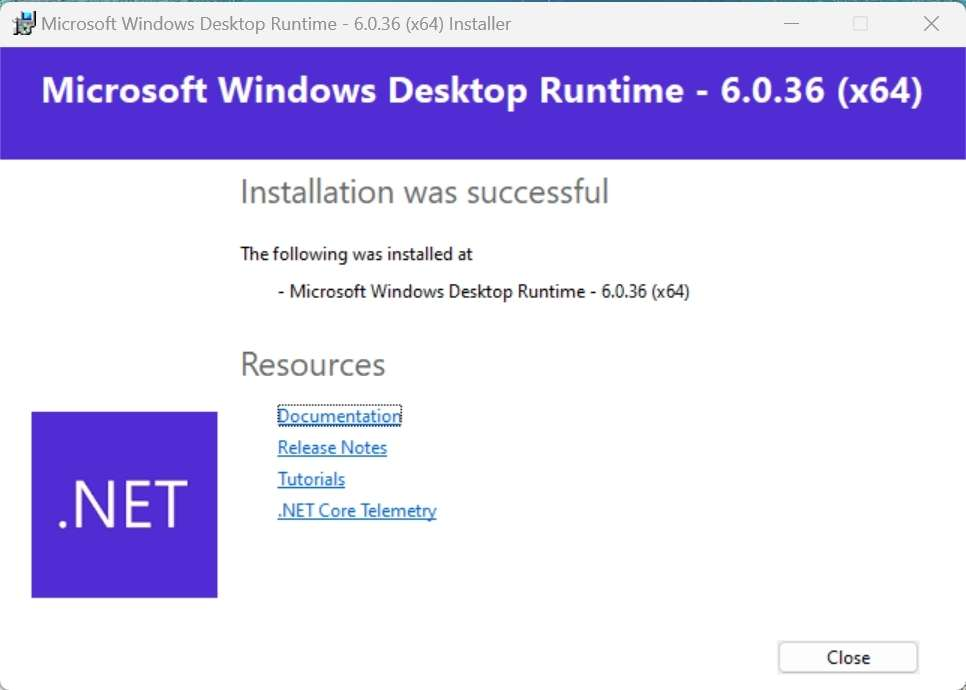
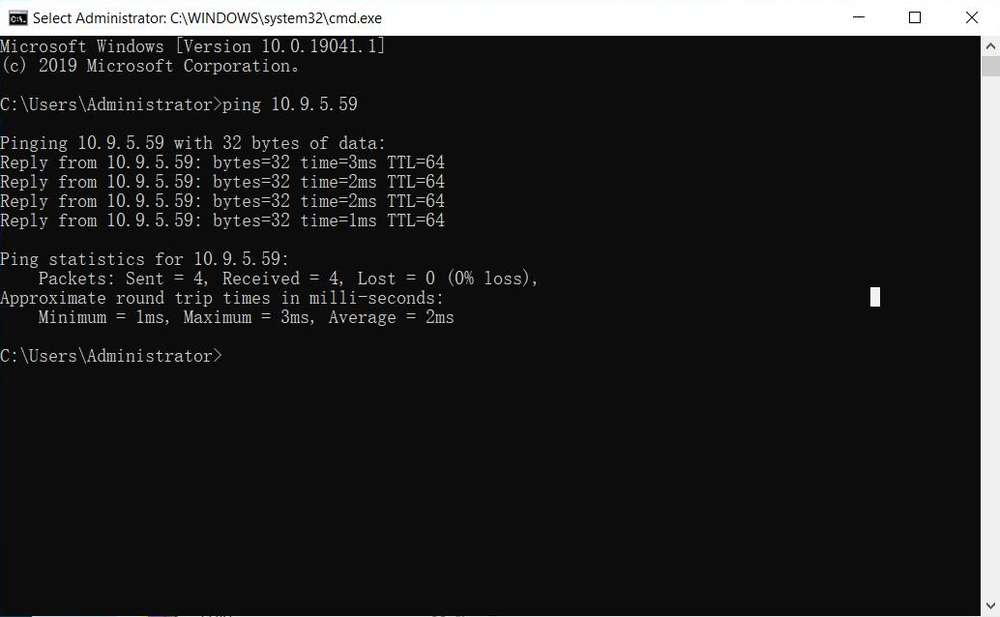

---
# Display h2 to h5 headings
toc_min_heading_level: 2
toc_max_heading_level: 4
---

# Get Started

## Introduction

RUBIK Pi 3 is developed based on the Qualcomm QCS6490 processor, which features the Qualcomm® Kryo™ 670 CPU and the Qualcomm® Hexagon™ Processor with fused AI-accelerator architecture. The processor provides exceptional AI performance of 12 TOPS and offers the capability for various machine learning and AI application scenarios.

RUBIK Pi 3 is designed with a wide range of interfaces and functions, such as USB, camera, DisplayPort, HDMI, Ethernet, 3.5mm headphone jack, Wi-Fi, Bluetooth, M.2 connector, fan, RTC, and 40-pin LS connector. These features cater to diverse development needs while facilitating rapid development and efficient debugging.&#x20;

RUBIK Pi 3 is compatible with various systems, such as Qualcomm Linux, Debian 13, Android 13, and Canonical Ubuntu for Qualcomm Platforms\*, providing developers with the flexibility to meet their specific application needs.

\*Canonical Ubuntu for Qualcomm Platforms is in the planning phase.


## Specifications

| **Category**      | **RUBIK Pi 3 Feature**                                                        |
| ----------------- | ----------------------------------------------------------------------------- |
| SoC               | QCS6490                                                                       |
| Processor         | <p>1 x Cortex-A78 2.7 GHz</p><p>3 x Cortex-A78 2.4 GHz</p><p>4 x Cortex-A55 1.9 GHz</p> |
| GPU               | Adreno 643 GPU @ up to 812 MHz                                                |
| VPU               | Adreno 633 VPU                                                                |
| NPU               | 12 TOPS                                                                       |
| ISP               | Spectra ISP capable of on-device machine learning and machine processing      |
| RAM               | 8 GB LPDDR4x                                                                  |
| ROM               | 128 GB UFS 2.2                                                                |
| Wi-Fi & Bluetooth | Wi-Fi 5 and Bluetooth 5.2                                                     |
| Camera            | 2 x 4-lane MIPI CSI D-PHY connector                                           |
| USB               |<p> 1 x USB Type-C (USB 3.1 Gen1)</p><p>2 x USB Type-A (USB 3.0)</p><p>1 x USB Type-A (USB 2.0)</p>|
| GPIO              | 28 GPIO pins                                                                  |
| Ethernet          | 1000M                                                                         |
| M.2 connector     | M.2 Key M 2280 (2-lane PCIe 3.0)                                              |
| Audio             | 3.5mm headphone jack                                                          |

## Preparations

* Computer running Windows 10 and later, or Ubuntu 18 – Ubuntu 22

* RUBIK Pi 3

* USB Type-A to Type-C cable

* USB Type-A to Micro USB cable

* Power supply (12V 3A Type-C)

### Install drivers

#### Install drivers in a Windows environment

##### Install QUD

1. Click [here](https://thundercomm.s3-accelerate.amazonaws.com/uploads/web/rubik-pi-3/tools/qud/qud.win.1.1_installer_10061.1.zip) to download the Qualcomm USB driver (QUD).

2. Decompress *qud.win.1.1\_installer\_10061.1.zip*, run *setup.exe* as shown in the following figure, and click **Next**.

    

3. Click **Next**.

    

4. Select the **I accept the terms in the license agreement** option and click **Next**.

    

5. Click **Install**.

    

6. Click **Finish** to complete the driver installation.

    

##### Install Tflash

1. Click [here](https://thundercomm.s3-accelerate.amazonaws.com/uploads/web/rubik-pi-3/tools/tflash/windows/TflashSetup_v1.2.0.4.exe) to download the image flashing tool Tflash.

2. Run *TflashSetup\_v1.2.0.4.exe*. Select your desired language and click **OK**.

    

3. Select the location where you want to install Tflash and click **Next**.

    

4. Click **Next**.

    

5) Select the **Create a desktop shortcut** option and click **Next**.

    

6) Click **Install**.

    

7. Select the **Launch Tflash** option and click **Finish**.

    

8. If the following error message appears, click **Y**. Follow the instructions to download the required installation package.

    

9. Double-click the package you downloaded and click **Install**.

    

10. Click **Close** to complete the installation.

    

11) After the installation is completed, the following Tflash icon will appear on your desktop and in the Start menu.

    

#### Install drivers in an Ubuntu environment

##### Install Tflash

1. Click [here](https://thundercomm.s3-accelerate.amazonaws.com/uploads/web/rubik-pi-3/tools/tflash/ubuntu/Thundercomm-tflash-v1.0.0.deb) to download the installation package.

2. Run the following command to install Tflash.

   ```shell
   sudo dpkg -i Thundercomm-tflash-v1.0.0.deb
   ```

3) After the installation is completed, run the `tflash` command in the terminal. If the following message appears, it indicates that Tflash has been successfully installed:

   

### Download images

RUBIK Pi 3 comes with a pre-installed Linux image (not the latest version) for a quick out-of-the-box experience. If you need the latest version of the Linux image or other operating system images, please visit the [RUBIK Pi 3 official website](https://www.thundercomm.com/rubik-pi-3/en/docs/image/) to download.

Visit [GitHub](https://github.com/rubikpi-ai) to download the Linux source code as needed.

* Qualcomm Linux is a simplified desktop system based on Weston. It is suitable for developers who have Linux development experience and seek an in-depth development experience.

  

* Debian 13: Based on GNOME 48, Debian 13 offers a complete set of system features, a rich software package library, more desktop applications, an enhanced user experience, and abundant development resources, making it ideal for developers who prioritize development convenience.

  

* Android 13 is an enhanced system based on Google AOSP, offering an improved experience for developers working on Android applications.

  

### Flash images


Before flashing images, enter flash mode (9008 mode) using one of the following methods:

:::warning
>
> * Do not touch the PCB components and metal contacts with your bare hands.
>
> * Before operation, discharge static electricity using grounding equipment (e.g., anti-static workstation/wrist strap).
>
> * Do not place the circuit board directly on conductive surfaces (such as metal tables or ungrounded chassis).
:::

Method 1:

1. Press and hold the **\[EDL]** button (No. 12 in the figure above).

   

2. Connect the power supply into port 10, as shown in the figure below.&#x20;

   

3) Insert the Type-C cable into port 5 and wait three seconds to enter 9008 mode.

   

Method 2:

1. Connect the power supply into port 10.

   

2. Insert the Type-C cable into port 5.

   

3) After RUBIK Pi 3 boots up, run the following command to enter 9008 mode.

   ```shell
   adb shell reboot edl
   ```

#### Flash images on a Windows system

##### Operation procedure

1. Open the Tflash software. Make sure the device is in 9008 mode, as shown in the following figure:

   

2. Select the **Storage Type** of the device to be flashed. For RUBIK Pi 3, select **UFS** for **Storage Type**.

   

3) Select **Reset After Download** or **Erase All Before Download** as needed. Exercise caution when selecting **Erase All Before Download**.

   

   * Reset After Download: When this option is selected, the device will reboot automatically after image flashing is completed.

   * Erase All Before Download: When this option is selected, the data in each RUBIK Pi 3 UFS partition will be erased before flashing.

     :::note
     >
     > * Selecting **Reset After Download** or **Erase All Before Download** is not a mandatory action. You are not required to select one of them.
     >
     > * The **Erase All Before Download** option takes effect only when the UFS partitions are the same before and after flashing.
     >
     > * When flashing images of different operating systems (for example, switching from Android to Debian), it is recommended to select the **Erase All Before Download** option.
     :::

4) Flash the FlatBuild image.

   1. Click **Browse**.

      

   2. Go to the *FlatBuild* directory, select *Programmer File*, and select *prog\_firehose\_ddr.elf,&#x20;*&#x61;nd click **Open**.

      

   3. Select all .xml files whose names start with "rawprogram", and click **Open**.

      

   4. Select all .xml files whose names start with "patch", and click **Open**.

      

      After the above settings, the related information will be displayed in the Tflash interface.

      

   5. Click **Download** to start flashing.

      

      :::note
      >
      > The flashing time varies from computer to computer. The green progress bar shows the flashing progress.
      :::

      After images are successfully flashed, the following logs will be displayed:

      

   * If you have selected **Reset After Download**, the board will reboot automatically after flashing.

   * If you have not selected **Reset After Download**, disconnect the power cable and USB cable to power off your RUBIK Pi 3, then reconnect the power cable and press the **\[PWR]** button to start your RUBIK Pi 3.

     

##### Fix boot failures after flashing

If you fail to flash images or your RUBIK Pi 3 fails to boot up after flashing (the heartbeat LED in the red box below does not blink), try provisioning UFS.


:::warning
>
> After provisioning, some information stored in the UFS, such as the SN and Ethernet MAC address, may be lost.
:::

The operations to provision UFS are as follows:

1. Enter 9008 mode.

   

2. Select **UFS** for **Storage Type** and select **Provision**.

   

3. Flash the provision file.

   1. Click **Browse**.

      

   2. Go to the *provision* directory in the image package, select *prog\_firehose\_ddr.elf*, and click **Open**.

      

   3. Select the *provision\_1\_3.xml* file and click **Open**.

      

   4. When "Load Image PATCH Successfully!" is displayed in the log, click **Download** to start provisioning.

      When the provisioning is completed, the following log is displayed.

      

      :::note
      >
      > After provisioning, remove and plug in the power supply and USB cable to restart your RUBIK Pi 3.
      :::

#### Flash images on an Ubuntu system

##### Operation procedure

1. Go to the FlatBuild package directory.

2. Run `tflash -r`.

   :::note
   >
   > * Run the `tflash -h` command to view more parameters. `-r` in the above command indicates restarting your RUBIK Pi 3 after flashing is completed.
   >
   > * When flashing images of different operating systems (for example, switching from Android to Debian), it is recommended to add the `-e` parameter (the Erase All Before Download option).
   :::

3. When "Stop the ModemManager on your host PC and press Enter on your keyboard to continue..." appears on the screen, press **Enter** to flash images.

   

   If the following information is displayed after the tflash operation, it indicates that flashing was successful.

    

:::note
>
> When running `tflash` on your PC, enter your PC login password.
:::

4. After successful image flashing by using the `-r` parameter, RUBIK Pi 3 automatically reboots.

##### Fix boot failures after flashing

If you fail to flash images or your RUBIK Pi 3 fails to boot up after flashing (the heartbeat LED in the red box below does not blink), try provisioning UFS.


:::warning
>
> After provisioning, some information stored in the UFS, such as the SN and Ethernet MAC address, may be lost.
:::

The operations to provision UFS are as follows:

1. Enter 9008 mode.


2. Go to the *provision* directory in the image package, run `tflash -E`, type "y" and press **Enter**.

  

3. When "Stop the ModemManager on your host PC and press Enter on your keyboard to continue..." appears on the screen, press **Enter** to flash images.

  

  If the following information is displayed after the tflash operation, it indicates that flashing was successful.

  

:::note
>
> After provisioning, remove and plug in the power supply and USB cable to restart your RUBIK Pi 3.
:::

## Power-on

For older board versions, connect the power supply and press the **\[PWR]** button to power on your RUBIK Pi 3. Board versions v02 and later support automatic power-on.


## Login
<a id="login"></a>

Connect your RUBIK Pi 3 to a monitor via HDMI and power it on. Then, connect a mouse and keyboard. The initialization program will run during the first boot, as shown in the following figure.


Set the language, time zone, and Wi-Fi, register an account, and log in to the GNOME desktop.


:::note
>
> In the Debian 13 image, the root user is registered by default. You can also run the following commands to log in as the root user when not using the graphical user interface.
:::

```shell
adb shell
su
```

## Power-off

* Click the Power icon in the top-right corner of the desktop, then click **Power Off** to power off your RUBIK Pi 3.


* Alternatively, run the `poweroff` command in the terminal to power off your RUBIK Pi 3.

## Reboot

Select one of the following methods to reboot your RUBIK Pi 3：

* Click the Power icon in the top-right corner of the desktop, then click **Restart** to restart your RUBIK Pi 3.


* Run the `sudo reboot` command in the terminal to reboot your RUBIK Pi 3.

* Press and hold the **\[PWR]** button for 12 seconds to reboot your RUBIK Pi 3.

  

## Serial port login

### Windows

1. Connect port 2 in the following figure to a computer via a serial cable.

   

2. Open the computer settings page, check the corresponding COM port in Device Manager, and record the port.

   

3) Download MobaXterm at https://mobaxterm.mobatek.net/ and decompress it.

   

4) Open MobaXterm, select **Session** > **Serial**, and set the baud rate of the serial port to 115200.

   

   

5. Click **OK** and press **Enter**. Log in using the user name and password registered in [login](#login):

   

:::info
>
> Login as the root user:
>
> Account: root

> Password: root
:::

### Ubuntu

1. Connect port 2 in the following figure to a computer via a serial cable.

   

2. Run the following commands to install minicom:

   ```shell
   sudo apt update  
   sudo apt install minicom
   ```

3) Run the following command to check the USB port:

    ```shell
    ls /dev/ttyACM*
    ```

    

4. Run the following command to open minicom. Press **Enter**. Log in using the user name and password registered in [1.5 Login](https://thundersoft.feishu.cn/docx/NO5tdvxI6oCCTgxCMracLTQhnfe#share-PmB3dJyBpoyk7lxxu7VcHr07nie):

   ```shell
   sudo minicom -D /dev/ttyACM0 -b 115200
   ```

   

:::info
>
> Login as the root user:
>
> Account: root

> Password: root
:::

## ADB login

### Windows

#### Preparations

1. Download the ADB and Fastboot installation package at https://developer.android.google.cn/tools/releases/platform-tools and decompress the package.


2. Right-click **This PC** and choose **Properties**. Click **Advanced** and click **Environment Variables**. Alternatively, right-click **This PC** and choose **Properties**. In the search bar, type **Advanced system settings** and click **Environment Variables**.


3. Under **System variables**, select **Path** and click **Edit**.

  

4. Click **New** and type the path of decompressed platform-tools in Step 1. Click **OK** to save the environment variable.


#### ADB login

Press **Win**+**R** and type "cmd" to open the Windows terminal. Run the following commands to log in to your RUBIK Pi 3:

```shell
adb devices # Check if devices are connected  
adb root    # Log in as root user  
su          # Switch to the root user and enable command completion
```


### Ubuntu

#### Preparations

1. Run the following command to install the ADB and Fastboot tools:

   ```shell
   sudo apt install git android-tools-adb android-tools-fastboot wget
   ```

2. Update the udev rules file.

   1. Run the following command to open and modify the *51-qcom-usb.rules* file.

      ```shell
      sudo vi /etc/udev/rules.d/51-qcom-usb.rules
      ```

   2. Add the following content to the file. If the following content already exists, skip this step.

      ```shell
      SUBSYSTEMS=="usb", ATTRS{idVendor}=="05c6", ATTRS{idProduct}=="9008", MODE="0666", GROUP="plugdev"
      ```

   3. Run the following command to restart `udev`.

      ```shell
      sudo systemctl restart udev
      ```

   :::note
   >
   > If your RUBIK Pi 3 is already connected to the PC via USB, unplug and replug the USB cable so that the updated rules can take effect.
   :::

#### ADB login

Run the following commands in the terminal to log in to your RUBIK Pi 3:

```shell
adb devices # Check if devices are connected  
adb root    # Log in as root user  
su          # Switch to the root user and enable command completion
```


## SSH login

### Windows

1. Obtain the IP address.

   1. Log in to the backend of the router or use other IP scanning software to obtain the IP address of RUBIK Pi 3.

   2. Log in to RUBIK Pi 3 via ADB and run the `ifconfig` command to obtain the IP address.

      :::note
      >
      > The IP address may change depending on the network environment, and the device name of RUBIK Pi 3 is "rubikpi".
      :::

   3. Press **Win**+**R**, type "cmd" in the pop-up window, and click **OK**.

      

   4. Run the `ping <IP>` command in the terminal. For example, the IP address of RUBIK Pi 3 is 10.9.5.59, run the following command and view the execution result.

    ```
    ping 10.9.5.59
    ```
    
    


2. SSH login.

    1. Open MobaXterm.

    

     2. Click **Session** and select **SSH** in the pop-up window.

    

     3. Type the IP address of the RUBIK Pi 3 you want to log in to and click OK.

    

    4. Type the username, press **Enter**, type the password, and press **Enter** to log in to RUBIK Pi 3.

    

    5. The following information indicates that the login is successful.

    


### Ubuntu

1. Confirm the network connection.

   1. Log in to the backend of the router or use other IP scanning software to obtain the IP address of RUBIK Pi 3.

      :::note
      >
      > The IP address may change depending on the network environment, and the device name of RUBIK Pi 3 is "rubikpi".
      >
      > Alternatively, log in to RUBIK Pi 3 via ADB and run the `ifconfig` command to obtain the IP address.
      :::

   2. Run the `ping <IP>` command in the Ubuntu terminal. For example, the IP address of RUBIK Pi 3 is 10.9.5.59, run the following command and view the execution result.

      ```shell
      ping 10.9.5.59
      ```

      

2. SSH login.

    1. Type the `ssh <user>@<IP>` command in the Ubuntu terminal and press **Enter**, as shown in the following figure. `root` indicates the role you want to log in as. `10.9.5.59` indicates the IP address of RUBIK Pi 3.

     ```shell
     ssh root@10.9.5.59
     ```

    2. Type the password and press **Enter**. The login succeeds.

     

## File transfer

### ADB

* In the PC terminal, run the following command to upload the *test.txt* file to the */opt* directory:

  ```shell
  adb push test.txt /opt
  ```

* In the PC terminal, run the following command to download the *test.txt* file to your current directory:

  ```shell
  adb pull /opt/test.txt ./
  ```

### SCP

To use Secure Copy Protocol (SCP) transfer, ensure your RUBIK Pi 3 is connected to the network. For example, if the IP address of RUBIK Pi 3 is 10.9.5.59, run the following commands:

:::tip
>
> Run the `ifconfig` command on RUBIK Pi 3 to obtain its IP address.
:::


* In the PC terminal, run the following command to upload the *test.txt* file to the */opt* directory:

  ```shell
  scp test.txt root@10.9.5.59:/opt
  ```

* In the PC terminal, run the following command to download the *test.txt* file to your current directory:

  ```shell
  scp root@10.9.5.59:/opt/test.txt ./
  ```


## Linux kernel

:::note
>
> The Debian V1.0.0 image does not include the Linux kernel source code. The source code will be provided in a future stable release.
:::