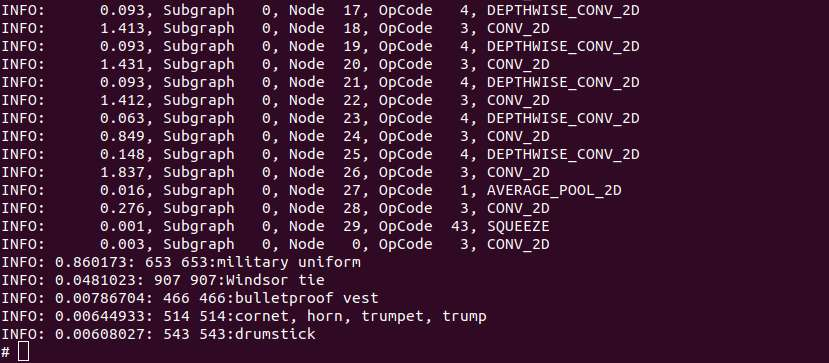

---
# Display h2 to h5 headings
toc_min_heading_level: 2
toc_max_heading_level: 4
custom_edit_url: https://github.com/rubikpi-ai/documentation/blob/main/docs-en/docs/rubik-pi-3-user-manual/1.0.0-d/3.ai-processor-and-sdk-testing-methods.md
---

# AI Processor and SDK Testing Methods

## TFlite test

Click [here](https://thundercomm.s3.dualstack.ap-northeast-1.amazonaws.com/uploads/web/rubik-pi-3/demos/ai/tflite_test.zip) to download *tflite_test.zip*.

Decompress *tflite\_test.zip&#x20;*&#x61;nd run the following commands:

```shell
adb root
adb shell mkdir -p /data/profiling
adb push ./tflite_test/Labels /data
adb push ./tflite_test/Models /data
```

### Use case 1

```shell
adb shell
label_image -l /data/Labels/labels.txt -i /data/Labels/grace_hopper.bmp -m /data/Models/mobilenet_v1_1.0_224.tflite -c 10 -j 1 -p 1
```

The following output indicates that the execution is successful:



### Use case 2

#### CPU and XNNPACK (open-source neural network inference library)

```javascript
adb shell
benchmark_model --graph=/data/Models/mobilenet_v1_1.0_224.tflite --enable_op_profiling=true --use_gpu=false --num_threads=1 --num_runs=100
```

The following output indicates that the execution is successful:


#### CPU only

```javascript
adb shell
benchmark_model --graph=/data/Models/mobilenet_v1_1.0_224.tflite --enable_op_profiling=true --use_gpu=false  --use_xnnpack=false --num_threads=1 --num_runs=100
```

The following output indicates that the execution is successful:


## QNN test

Visit https://github.com/rubikpi-ai/demo to download *qnn\_test.zip.*

Decompress *qnn\_test.zip&#x20;*&#x61;nd run the script *6490\_PI\_QNN.sh:*

```shell
chmod -R 777 ./6490_PI_QNN.sh
./6490_PI_QNN.sh
```

The following output indicates that the execution is successful:


## SNPE test

Visit https://github.com/rubikpi-ai/demo to download snp&#x65;*\_test.zip.*

Decompress *snpe\_test.zip&#x20;*&#x61;nd run the following command:

```javascript
adb push ./snpe_test/yolo* /opt
```

### Using CPU

```javascript
adb shell
snpe-throughput-net-run --container /opt/yolonas.dlc  --duration 100 --perf_profile "high_performance" --userbuffer_tf8 --userbuffer_float_output --use_cpu
```

The following output indicates that the execution is successful:


### Using DSP

```javascript
adb shell
snpe-throughput-net-run --container /opt/yolov5s_v2.5_quantized_cache.dlc  --duration 100 --perf_profile burst --userbuffer_tf8 --userbuffer_float_output --use_dsp
```

The following output indicates that the execution is successful:

