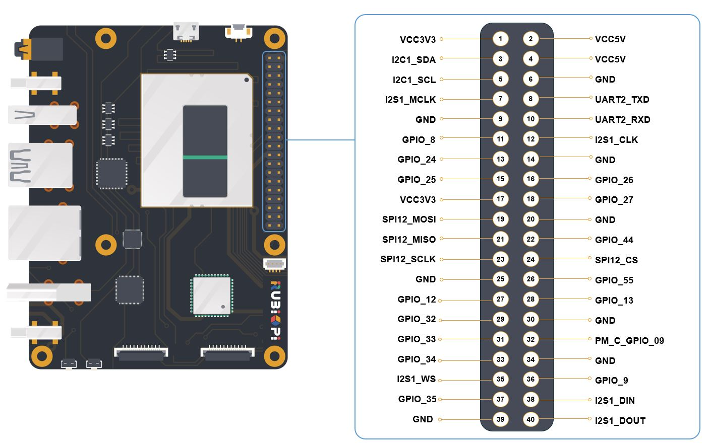
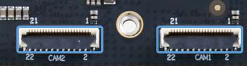

# Datasheet

## Overview

| Category    | RUBIK Pi 3 Feature                                                               |
|-------------|------------------------------------------------------------------------------|
| Platform  | Qualcomm® QCS6490                                                           |
| Memory    | 
RAM 8 GB LPDDR4x

ROM 128 GB UFS 2.2
                                  |
| Video  | 
1 x HDMI 1.4 output (up to 4K 30 Hz)

1 x DP over USB Type-C (up to 4K 60 Hz)

2 x camera connector (4-lane MIPI CSI D-PHY)
|
| Audio   | 1 x 3.5mm headphone jack                                                           |
| Connectivity | 
1 x USB Type-C (USB 3.1 Gen 1)

2 x USB Type-A (USB 3.0)

1 x USB Type-A (USB 2.0)

1 x Ethernet port (1000/100/10 Mbps full duplex auto-negotiation)

1 x UART for debug (over Micro USB)

1 x M.2 Key M connector (PCIe 3.0 x2)

40-pin LS connector supporting various interface options:

- Up to 28 x GPIO

- Up to 2 x I2C

- Up to 3 x UART

- Up to 3 x SPI

- 1 x I2S (PCM)
- 1 x PWM channel |
| Others      | 
1 x PWR button

1 x EDL button

1 x RGB LED

2-pin RTC battery connector
4-pin PWM fan connector |
| Wireless Connection  | 
Wi-Fi: IEEE 802.11 a/b/g/n/ac Wi-Fi

Bluetooth: BT 5.2
On-board PCB antenna  |
| Power Supply      | Power Delivery over Type-C, 12V 3A                                                      |
| Operating Environment | Operating temperature: 0°C – 50°C                                                      |
| Dimensions    | 100mm x 75mm x 25mm                                                         |
| OS Support  | 
Android 13

Qualcomm Linux

Debian 13
Canonical Ubuntu for Qualcomm platforms |

## Features

### System block diagram

### Component locations

| No. | Interface                    | No. | Interface               |
|------|--------------------------|------|-----------------------|
| 1    | RTC battery connector             | 10   | Power Delivery over Type-C        |
| 2    | Micro USB (UART debug)    | 11   | PWR button             |
| 3    | TurboX C6490P SOM        | 12   | EDL button            |
| 4    | 3.5mm headphone jack           | 13   | Camera connector 2        |
| 5    | USB Type-C with DP (USB 3.1) | 14 | Camera connector 1        |
| 6    | USB Type-A (USB 2.0)     | 15   | Wi-Fi/BT module       |
| 7    | 2 x USB Type-A (USB 3.0) | 16   | Fan connector             |
| 8    | 1000M Ethernet         | 17   | 40-pin connector        |
| 9    | HDMI OUT                 | 18   | M.2 Key M connector       |

### Electrical characteristics

#### Power supply requirements

RUBIK Pi 3 supports Power Delivery (PD) 3.0 power input. A Type-C 12V 3A power adapter compliant with PD 3.0 is recommended for input power.

The power indicator LED (in yellow green) will turn on if the power adapter meets requirements and power negotiation succeeds. If the adapter does not meet requirements, the LED will remain off and the device will not boot.

#### Output power requirements

The following table lists the maximum current output from each connector with a 12V 3A power supply.

| Connector          | Output Voltage | Max. Output Current | Remarks                                              |
|--------------------|----------------|---------------------|------------------------------------------------------|
| USB 3.0 Type-A - 1 | 5V             | 1.5A                |                                                      |
| USB 3.0 Type-A - 2 | 5V             | 1.5A                | The total current simultaneously output from the three USB ports cannot exceed 3A. |
| USB 2.0 Type-A     | 5V             | 1.5A                |                                                      |
| 40 Pin GPIO        | 5V             | 1A                  |                                                      |
| 40 Pin GPIO        | 3.3V           | 1A                  |                                                      |
| HDMI               | 5V             | 100mA               |                                                      |
| M.2 Key M          | 3.3V           | 1A                  |                                                      |
| Camera 1           | 3.3V           | 300mA               |                                                      |
| Camera 2           | 3.3V           | 300mA               |                                                      |

An output current exceeding the maximum threshold will trigger output power protection or a system restart.

It is NOT recommended to use the USB port of RUBIK Pi 3 to supply power to USB devices with high power consumption, such as USB fans, speakers, or displays.

### Mechanical specification

*All dimensions are in millimeters.

## Expansion Connections

### 40-pin connector

The default functions of the 40-pin connector are as follows:

The following table list the pin definition of the 40-pin LS connector:

  Functions bolded in blue are default functions.

RUBIK Pi 3 provides 28 GPIOs. By default, 2 x I2C, 1 x UART, 1 x SPI, 1 x I2S, 1 x PWM IO, and 9 GPIOs are configured.

The level of all GPIOs is 3.3V. The I2C GPIOs (GPIO 4, 5, 12, 13) are in open-drain output mode with 4.7 kΩ pull-up resistors. The other GPIOs are in push-pull output mode, and the external pull-up or pull-down resistors of the connected signals cannot be less than 50 kΩ due to the limitations of the on-board level shifter IC.

The GPIOs belonging to the same QUP group can be flexibly configured as UART or SPI. For details, refer to the user manual.

The 2.54mm pitch 40-pin LS connector is compatible with the expansion boards of most open-source development boards.

### HDMI connector

RUBIK Pi 3 comes with a standard-sized HDMI connector that is compatible with HDMI 1.4. This connector supports a maximum output of 4K 30 Hz. Additionally, it provides the Consumer Electronics Control (CEC) functionality, as well as 5V DDC and HPD interfaces.

### Ethernet connector

RUBIK Pi 3 is equipped with a standard RJ45 connector featuring Link and Active indicator LEDs. This connector supports high-speed communication at up to 1000 Mbps in full duplex mode, with backward compatibility for 100/10 Mbps via auto-negotiation.

The Link and Active indicators of the Ethernet connector are shown as follows:

### USB connector

#### USB 3.1 Gen 1 Type-C

RUBIK Pi 3 incorporates a USB 3.1 Gen 1 Type-C port that supports Type-C with DisplayPort v1.4. The port allows for a maximum output of 4K 60 Hz when used with a Type-C to DP cable and supports read/write operations at speeds of up to 5 Gbps.

By default, this port is used for ADB debugging.

#### USB 3.0 Type-A

RUBIK Pi 3 features two standard USB 3.0 Type-A ports, each supporting read and write operations at speeds of up to 4 Gbps.

The USB 3.0 Type-A port can operate in host mode only. Each individual port has a maximum output capacity of 5V 1.5A. The power output of each port can be individually controlled.

#### USB 2.0 Type-A

RUBIK Pi 3 is equipped with a standard USB 2.0 Type-A port which supports read and write operations at speeds of up to 480 Mbps. This port works in host mode by default and can be switched to device mode and used as an ADB interface by using software. The maximum output capacity of this port is 5V 1.5A, while the total output of all three USB Type-A ports is 3A. The power output of this port can be individually controlled.

### 3.5mm audio connector

The 3.5mm audio connector is designed according to CITA standard and supports left and right channels and microphone inputs.

The following figure shows the rings on the plug. From right to left, they are: 1-left channel, 2-right channel, 3-ground, 4-microphone.

The following table lists the pin definition of the 3.5mm audio connector.

| Pin No. | Pin Name |
|---------|----------|
| 1       | Left     |
| 2       | Right    |
| 3       | GND      |
| 4       | Mic      |

### Camera connector

RUBIK Pi 3 provides two 22-pin camera connectors. Each connector supports 4-lane MIPI CSI D-PHY and provides one I2C and two control GPIOs. The GPIO level is 3.3V, and the I2C signal is in open-drain mode with pull-up resistors. The pitch of the connector is 0.5mm and the connector is pin-to-pin compatible with the camera interfaces of mainstream development boards. For details, refer to the [Peripheral Compatibility List](https://www.thundercomm.com/rubik-pi-3/en/docs/peripheral-compatibility-list).

The following table lists the pin definition of the camera connector:

This datasheet is for the updated camera connectors, which facilitate user operations and do not have performance difference compared to the original ones. If you use the beta version hardware (marked with V01 on the board), refer to *RUBIK Pi 3 V01 (Beta Version) Datasheet*.

### M.2 connector

RUBIK Pi 3 provides an M.2 slot for NVMe storage, which can be used to install 2280-sized SSD hard drives. The M.2 Key M slot supports PCIe 3.0 x2 and can deliver an output of up to 3.3V 2A. The switch of the M.2 connector can be individually controlled.

The following table lists the pin definition of the M.2 connector:

(1) The level of the PCIe control IOs is 3.3V.

### Wi-Fi

RUBIK Pi 3 integrates the on-board wireless communication module that supports IEEE 802.11 a/b/g/n/ac Wi-Fi. The on-board PCB antenna is provided, eliminating the need for additional antennas.

### Bluetooth

The on-board wireless communication module of RUBIK Pi 3 also provides the BT 5.2 function for Bluetooth data transfer and Bluetooth audio applications. The Bluetooth shares the PCB antenna with Wi-Fi, eliminating the need for additional antennas.

### Fan connector

The fan connector of RUBIK Pi 3 is a 4-pin 1mm pitch connector which is suitable for 5V fans whose maximum rated current is smaller than 200 mA. The fan connector supports PWM control. For the fan compatible with its pin definition and board mounting holes, refer to the [Peripheral Compatibility List](https://www.thundercomm.com/rubik-pi-3/en/docs/peripheral-compatibility-list). 

The following table lists the pin definition of the fan connector:

| Pin No.  | Pin Name    |
|----------|-------------|
| 1        | NC          |
| 2        | GND         |
| 3        | PWM_OUT(1) |
| 4        | VCC5V_OUT   |

(1) The level of PWM_OUT is 5V.

### RTC battery connector

RUBIK Pi 3 includes a 2-pin 1.25mm pitch RTC battery connector, only compatible with 3V coin cell batteries. The voltage range for normal operation is 2V – 3.25V.

The following table lists the pin definition of the RTC battery connector:

| Pin No.  | Pin Name  |
|----------|-----------|
| 1        | VCC3V_IN  |
| 2        | GND       |

### Micro USB to UART for debug

RUBIK Pi 3 incorporates the CH343, a USB to UART TTL bridge IC made by WinChipHead (WCH). UART logs from the SoC can be obtained through connecting the device to a computer via micro USB.

The default UART setting is 115200 baud rate, 8 data bits,1 stop bit, and no parity.

Download the CH343 driver at the official website: [Driver](https://www.wch.cn/downloads/category/67.html?feature=USB%E8%BD%AC%E4%B8%B2%E5%8F%A3&product_name=CH343).

### Button

#### PWR button

Plug in the power supply and press the **[PWR]** button once to boot up the device. If the indicator light flashes once, it indicates that the device has powered on successfully and is starting to operate.

#### EDL button

The EDL button is for Emergency Download (EDL) mode. To enter EDL mode (9008), connect the power supply, then press and hold both the **[PWR]** and **[EDL]** buttons for more than 3 seconds.

### LED

#### Power indicator LED

When a compliant (12V 3A, PD-supported) power supply is connected, the indicator LED lights steadily in yellow-green, indicating that the device is ready.

#### RGB LED

RUBIK Pi 3 is equipped with an on-board RGB LED that supports PWM dimming.

## Precautions

### Operating environment

The ambient operating temperature range for RUBIK Pi 3 is 0°C – 50°C. While using RUBIK Pi 3, please closely monitor the CPU temperature and take appropriate cooling measures to ensure it stays below 85°C. This will help avoid CPU throttling or performance degradation. Prolonged use of the device in high-temperature conditions may cause irreversible damage to the hardware.

### ESD prevention

Prevent electrostatic discharge (ESD) and avoid touching any components on the board under any circumstances.

### Warning

Any external power supply used with RUBIK Pi 3 must comply with the relevant regulations and standards of the country in which it is used. The power supply should provide 12V DC and a minimum rated current of 3A.

### Safety instructions

- This product should not be overclocked.
- Do not operate this product in water or humid environments.
- Do not place this product on conductive surfaces.
- Keep this product away from heat sources. It is designed for use at normal room temperature to ensure reliable operation.
- Do not expose the circuit board to high-intensity light sources, such as xenon flashlights or lasers.
- Operate this product in a well-ventilated environment, and do not cover it during use.
- Place this product on a stable, flat, and insulated surface and avoid contact with conductive materials.
- Handle this product carefully to prevent mechanical or electrical damage to the printed circuit board and connectors.
- Avoid touching or handling the product when it is powered on. Only touch the edges of the product to minimize the risk of electrostatic discharge damage. Any peripherals or devices used with RUBIK Pi 3 must comply with the relevant standards of the country in which it is used and be appropriately marked to ensure safety and performance requirements are met.

