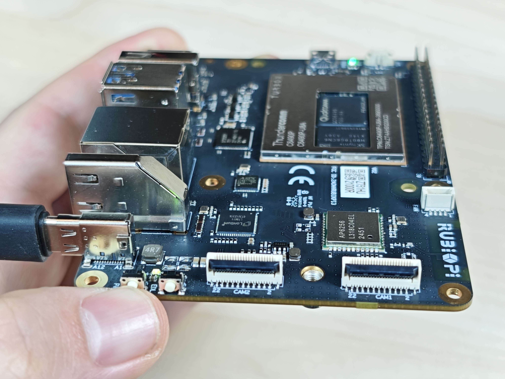
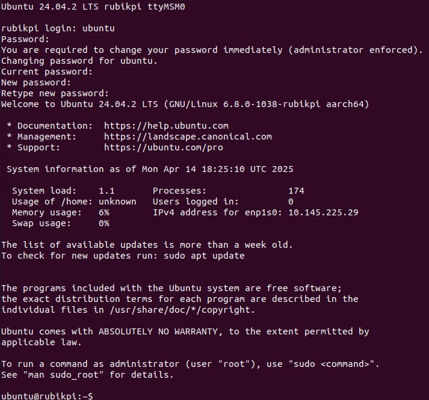
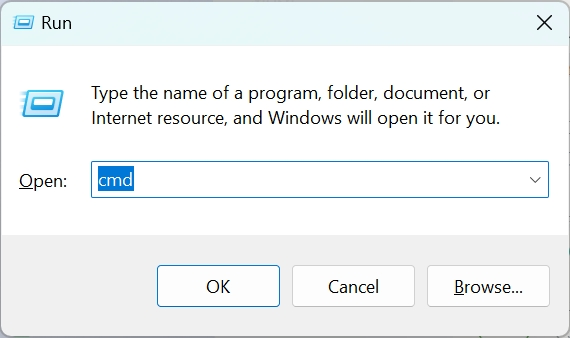
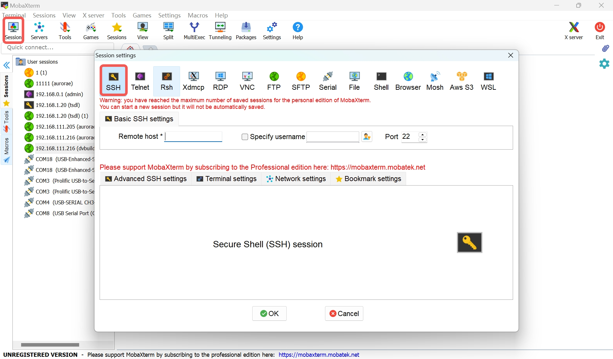
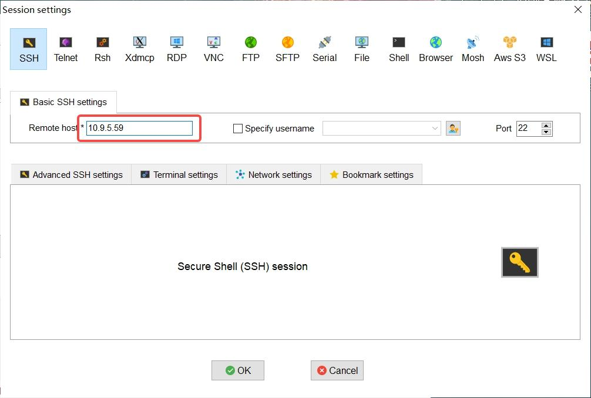

---
# Display h2 to h5 headings
toc_min_heading_level: 2
toc_max_heading_level: 4
---
# Get Started

## Introduction

RUBIK Pi 3 is developed based on the Qualcomm QCS6490 processor, which features the Qualcomm® Kryo™ 670 CPU and the Qualcomm® Hexagon™ Processor with fused AI-accelerator architecture. The processor provides exceptional AI performance of 12 TOPS and offers the capability for various machine learning and AI application scenarios.

RUBIK Pi 3 is designed with a wide range of interfaces and functions, such as USB, camera, DisplayPort, HDMI, Ethernet, 3.5mm headphone jack, Wi-Fi, Bluetooth, M.2 connector, fan, RTC, and 40-pin LS connector. These features cater to diverse development needs while facilitating rapid development and efficient debugging.

RUBIK Pi 3 is compatible with various systems, such as Qualcomm Linux, Debian 13, Android 13, and Canonical Ubuntu for Qualcomm Platforms, providing developers with the flexibility to meet their specific application needs.


## Specifications


|   **Category** | **RUBIK Pi 3 Feature**                                                                                     |
| -------------- | ---------------------------------------------------------------------------------------------------- |
| SoC         | QCS6490                                                                                            |
| Processor   | <p>1 x Cortex-A78 2.7GHz</p><p>3 x Cortex-A78 2.4GHz</p><p>4 x Cortex-A55 1.9GHz</p>               |
| GPU          | Adreno 643 GPU @ Up to 812 MHz                                                                     |
| VPU          | Adreno 633 VPU                                                                                     |
| NPU          | 12 TOPS                                                                                            |
| ISP          | Spectra ISP capable of on-device machine learning and machine processing                           |
| Memory        | 8 GB LPDDR4x                                                                                       |
| ROM          | 128 GB UFS 2.2                                                                                     |
| Wi-Fi & Bluetooth | Wi-Fi 5 and BT 5.2                                                                                 |
| Camera       | 2 x 4-lane MIPI CSI D-PHY                                                                          |
| USB          | <p>1 x USB Type-C (USB 3.1 Gen1)</p><p>2 x USB Type-A (USB 3.0)</p><p>1 x USB Type-A (USB 2.0)</p> |
| GPIO         | 28个 GPIO pins                                                                                     |
| Ethernet     | 1000M                                                                                              |
| M.2 connector| M.2 Key M  2280（2-lane PCIe 3.0）                                                                 |
| Audio        | 3.5mm headphone jack                                                                                    |

## Preparations

* Computer running Windows 10 and later, or Ubuntu 20 – Ubuntu 24

* RUBIK Pi 3

* USB Type-A to Type-C cable

* USB Type-A to Micro USB cable

* Power supply (12V 3A Type-C)

### Download images

RUBIK Pi 3 comes with a pre-installed Linux image (not the latest version) for a quick out-of-the-box experience. If you need the latest version of the Linux image or other operating system images, please visit the [RUBIK Pi 3 official website](https://www.thundercomm.com/rubik-pi-3/en/docs/image/) to download.

Visit [GitHub](https://github.com/rubikpi-ai) to download the Linux source code as needed.

We provide the following images:

* Qualcomm Linux is a simplified desktop system based on Weston. It is suitable for developers who have Linux development experience and seek an in-depth development experience.

  

* Debian 13: Based on GNOME 48, Debian 13 offers a complete set of system features, a rich software package library, more desktop applications, an enhanced user experience, and abundant development resources, making it ideal for developers who prioritize development convenience.

  

* Ubuntu24.04: Ubuntu24.04 has complete system functionality and rich package resources. There are more desktop applications, a better user experience, and more development materials, suitable for developers in pursuit of development convenience.


  
* Android 13 is an enhanced system based on Google AOSP, offering an improved experience for developers working on Android applications.

  

### Download QDL

Qualcomm Device Loader (QDL) is a flashing tool that allows you to flash images to RUBIK Pi 3.

[Click here to download](https://softwarecenter.qualcomm.com/api/download/software/tools/Qualcomm_Device_Loader/All/2.3.4/Qualcomm_Device_Loader.Core.2.3.4.All-AnyCPU-qdl_2.3.4.zip) QDL and decompress the package you download. The package contains the following files. QDL supports multiple platforms and architectures. For instructions on how to use QDL, refer to *QDL_User_Guide.pdf*.


### Flash images


Before flashing images, enter flash mode (9008 mode) using one of the following methods:

:::warning

* Do not touch the PCB components and metal contacts with your bare hands.

* Before operation, discharge static electricity using grounding equipment (e.g., anti-static workstation/wrist strap).

* Do not place the circuit board directly on conductive surfaces (such as metal tables or ungrounded chassis).
:::

Method 1:

1. Press and hold the **[EDL]** button (No. 12 in the figure above).

   
2. Connect the power supply into port 10, as shown in the figure below.

   
3. Insert the Type-C cable into port 5 and wait three seconds to enter 9008 mode.

   

Method 2:

1. Connect the power supply into port 10.

   
2. Insert the Type-C cable into port 5.

   
3. After RUBIK Pi 3 boots up, run the following command to enter 9008 mode.

   ```shell
   adb shell reboot edl
   ```

#### Flash images on a Windows system

<a id="flashwin"></a>

1. Install the WinUSB driver. (If you have installed it, skip this step.)
 
   1. Uninstall other drivers for this device. Make sure that Qualcomm USB drivers and similar drivers are not installed. 

     * The device should not appear under the COM ports in Device Manager. If you see the device under the COM ports, follow the instructions to uninstall QUD.

      

      * Ensure that **Delete the driver software for this device** is checked.

      
   
   2. Power off the device and re-enter the flashing mode. Follow the instructions below to install Microsoft WinUSB.

     * In Device Manager, right-click the USB port of RUBIK Pi 3 and select **Update driver.**

      

      * In the pop-up window, choose the **Browse my computer for driver software** option.

      

      * Under USB devices, select **WinUsb Device**.

      

      * Click **Yes** to update the driver.

      
2. In the terminal, use the following command to run the QDL executable from either the *QDL_Win_x64* or *QDL_Win_ARM64* directory based on your host architecture to flash the image. Once the flashing process is complete, the device will automatically reboot.

:::note

> The program file name does not support wildcards. Each image file must be listed in the command explicitly.

> Replace `<pathToQDL>` with the actual location of the *QDL_Win_x64* or *QDL_Win_ARM64* directory.
:::

```shell
<pathToQDL>\QDL.exe prog_firehose_ddr.elf rawprogram0.xml rawprogram1.xml rawprogram2.xml rawprogram3.xml rawprogram4.xml rawprogram5.xml patch1.xml patch2.xml patch3.xml patch4.xml patch5.xml
```


3. If your RUBIK Pi 3 fails to boot up after flashing, enter the *provision* directory in the FlatBuild package and run the following command to try provisioning UFS. 

:::warning

> After provisioning, some information stored in the UFS, such as the SN and Ethernet MAC address, may be lost.
>
> Replace `<pathToQDL>` with the actual location of the *QDL_Win_ARM64* or *QDL_Win_x64* directory.
:::

```shell
<pathToQDL>\QDL.exe prog_firehose_ddr.elf provision_ufs_1_3.xml
```


:::warning

> After provisioning, remove and plug in the power supply and USB cable to restart your RUBIK Pi 3 and proceed with the image flashing again.
:::

#### Flash images on an Ubuntu system

1. Run the following command to install libusb, libxml2 (If you have installed them, skip this step.)

```shell
sudo apt-get install libxml2-dev libudev-dev libusb-1.0-0-dev
```

2. Go to the *ufs* directory of the FlatBuild package.

3. Copy the *qdl* file from the *QDL_Linux_x64* or *QDL_Linux_ARM* directory to the *ufs* directory, depending on your host architecture.

4. Run the following command to flash the image.

```shell
./qdl --storage ufs prog_firehose_ddr.elf rawprogram*.xml patch*.xml
```


5. If your RUBIK Pi 3 fails to boot up after flashing, enter the *provision* directory in the FlatBuild package and run the following command to try provisioning UFS.

:::warning

> After provisioning, some information stored in the UFS, such as the SN and Ethernet MAC address, may be lost.
>
> Before running the following command, copy the *qdl* file from the *QDL_Linux_x64* or *QDL_Linux_ARM* directory to the *provision* directory, depending on your host architecture.
:::

```shell
./qdl prog_firehose_ddr.elf provision_ufs_1_3.xml
```


:::warning

> After provisioning, remove and plug in the power supply and USB cable to restart your RUBIK Pi 3 and proceed with the image flashing again.
:::

#### Flash images on a Mac system

1. Run the following command to install Homebrew (if you have installed it, skip this step).

```shell
/bin/bash -c "$(curl -fsSL https://raw.githubusercontent.com/Homebrew/install/HEAD/install.sh)"
```

2. Run the following commands to install libusb and libxml2.

```shell
brew install libusb
brew install libxml2
```

3. Go to the *ufs* directory of the FlatBuild package.

4. Copy the contents from the *QDL_Mac_x64* or *QDL_Mac_ARM* directory to the *ufs* directory, depending on your host architecture.

5. Run the following command to flash the image.

```shell
./qdl --storage ufs prog_firehose_ddr.elf rawprogram*.xml patch*.xml
```


6. If your RUBIK Pi 3 fails to boot up after flashing, enter the *provision* directory in the FlatBuild package and run the following command to try provisioning UFS.
   
:::warning

> After provisioning, some information stored in the UFS, such as the SN and Ethernet MAC address, may be lost.
>
> Before running the following command, copy the *qdl* file from the *QDL_Linux_x64* or *QDL_Linux_ARM* directory to the *provision* directory, depending on your host architecture.
:::

```shell
./qdl prog_firehose_ddr.elf provision_ufs_1_3.xml
```


:::warning

> After provisioning, remove and plug in the power supply and USB cable to restart your RUBIK Pi 3 and proceed with the image flashing again.
:::

## Power-on

For older board versions, connect the power supply and press the **[PWR]** button to power on your RUBIK Pi 3. Board versions v02 and later support automatic power-on.



## Login

<a id="login"></a>

### UART login

#### Windows

1. Connect port 2 in the following figure to a computer via a UART interface.

   
2. Open the computer settings page, check the corresponding COM port in Device Manager, and record the port.

   
3. Download MobaXterm at https://mobaxterm.mobatek.net/ and decompress it.

   
4. Open MobaXterm, select **Session** > **Serial**, and set the baud rate of the serial port to 115200.

   

   
5. Click **OK** and press **Enter**.

Log in to the Ubuntu UART console of RUBIK Pi 3 using `ubuntu` as the username and password. Reset the password as prompted in the terminal.


#### Ubuntu

Perform the following steps to configure UART. Do not log in to the console at this phase.

1. Connect the Micro-USB cable to the Micro-USB port on RUBIK Pi 3.

   
2. Connect the other end of the Mirco-USB cable to the host.
3. Run the following commands to install minicom.

   ```shell
   sudo apt update
   sudo apt install minicom
   ```
4. Run the following command to check the USB port.

   ```shell
   ls /dev/ttyACM*
   ```

   
5. Run the following command to open minicom.

```shell
sudo minicom -D /dev/ttyACM0 -b 115200
```

Log in to the Ubuntu UART console of RUBIK Pi 3 using `ubuntu` as the username and password. Reset the password as prompted in the terminal.



### SSH login

#### Windows

1. Ping the RUBIK Pi 3 IP address.
   
   1. Obtain the IP address.

   * Log in to the backend of the router or use other IP scanning software to obtain the IP address of RUBIK Pi 3.
   * Log in to RUBIK Pi 3 via ADB and run the `ifconfig` command to obtain the IP address.

   :::info

   > The IP address may change depending on the network environment, and the device name of RUBIK Pi 3 is "rubikpi".
   :::
   >

   2. Press **Win**+**R**, type "cmd" in the pop-up window, and click **OK**.

   

   3. Run the `ping <IP>` command in the terminal. For example, the IP address of RUBIK Pi 3 is 10.9.5.59, run the following command and view the execution result.

   ```
   ping 10.9.5.59
   ```

   
2. SSH login.

   1. Open MobaXterm.

   

   2. Click **Session** and select SSH in the pop-up window.

   

   3. Type the IP address of the RUBIK Pi 3 you want to log in to and click **OK**.

   

   4. Type the username, press **Enter**, type the password, and press **Enter** to log in to RUBIK Pi 3.

   

   5. The following information indicates that the login is successful. 

   

   :::note

   > If you log in via SSH for the first boot, use `ubuntu` as both the username and password to log in to the RUBIK Pi 3 Ubuntu SSH console.
   >
   > Then, follow the prompts in the terminal to reset the password and log in via SSH again.
   :::
   >

#### Ubuntu SSH

1. Confirm the network connection.

   1. Log in to the backend of the router or use other IP scanning software to obtain the IP address of RUBIK Pi 3.

      :::warning

      > The IP address may change depending on the network environment, and the device name of RUBIK Pi 3 is "rubikpi".
      >
      > Alternatively, log in to RUBIK Pi 3 via ADB and run the `ifconfig` command to obtain the IP address.
      :::
      >
   2. Run the `ping <IP>` command in the Ubuntu terminal. For example, the IP address of RUBIK Pi 3 is 10.9.5.59, run the following command and view the execution result.

      ```shell
      ping 10.9.5.59
      ```

      
2. SSH login.

   1. Type the `ssh <user>@<IP>` command in the Ubuntu terminal and press **Enter**, as shown in the following figure. `root` indicates the role you want to log in as. `10.9.5.59` indicates the IP address of RUBIK Pi 3.

   ```shell
   ssh root@10.9.5.59
   ```

   2. Type the password and press **Enter**. The login succeeds.

   

   :::note

   > If you log in via SSH for the first boot, use `ubuntu` as both the username and password to log in to the RUBIK Pi 3 Ubuntu SSH console.
   >
   > Then, follow the prompts in the terminal to reset the password and log in via SSH again.
   > :::
   >

### Desktop login

After resetting the password using the UART or SSH login, connect an HDMI display and power on the device. Connect a mouse and keyboard, then type the reset password to log in. As shown in the following figure, you are successfully logged in to the Ubuntu desktop.


## Power-off

* Click the icon in the top right corner of the desktop, and click **Power Off** in figure below.


* Alternatively, run the `poweroff` command in the terminal.

## Reboot

Use one of the following methods to reboot your device:

* Click the icon in the top right corner of the desktop, and click **Restart** in the figure below.

  
* Run the `sudo reboot` command in the terminal.
* Press and hold the **[PWR]** button for 12 seconds to reboot your RUBIK Pi 3.

  

## File transfer

### SCP

To use Secure Copy Protocol (SCP) transfer, ensure your RUBIK Pi 3 is connected to the network. For example, if the IP address of RUBIK Pi 3 is 10.9.5.59, run the following commands:

:::note

> Run the `ifconfig` command on RUBIK Pi 3 to obtain its IP address.
:::


* In the PC terminal, run the following command to upload the *test.txt* file to the */opt* directory:

  ```shell
  scp test.txt root@10.9.5.59:/opt
  ```
* In the PC terminal, run the following command to download the *test.txt* file to your current directory:

  ```shell
  scp root@10.9.5.59:/opt/test.txt ./
  ```

## Linux kernel

:::note
The Ubuntu 24.04 V1.0.0 image does not provide the Linux kernel source code. The Linux kernel source code will be made available in a future stable release.
:::
