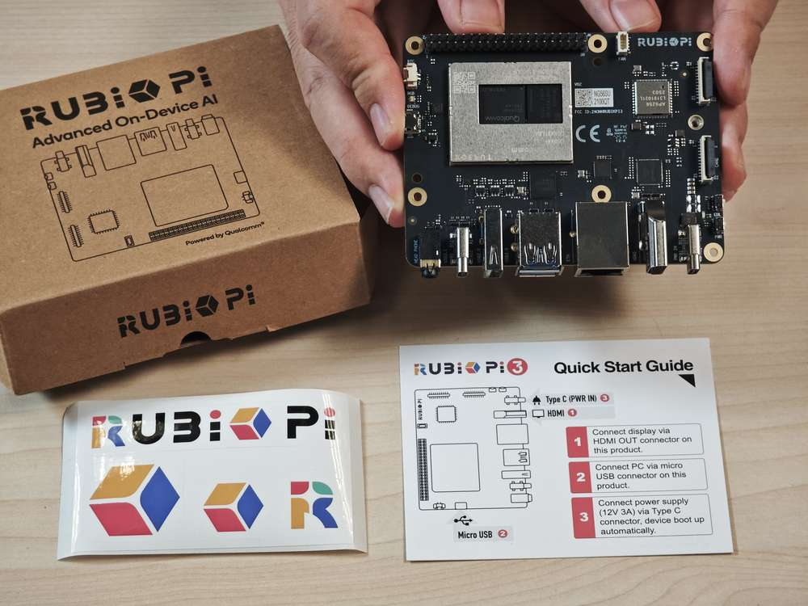

import Tabs from '@theme/Tabs';
import TabItem from '@theme/TabItem';

# Get started with RUBIK Pi 3  

The **RUBIK Pi 3**, powered by the **Qualcomm® QCS6490** SoC, is engineered for high-performance computing and seamless integration with modern development workflows. This guide walks you through setting up your board with **Canonical Ubuntu**, enabling you to explore and prototype end-to-end AI and multimedia applications.  
At its core, the RUBIK Pi 3 features:  
-- **Qualcomm® Kryo™ 670**  
-- **Qualcomm® Hexagon™ Processor** with fused AI-accelerator architecture  
-- **12 TOPS** of AI performance for real-time inference and machine learning workloads

Designed with versatility in mind, the RUBIK Pi 3 includes a wide array of interfaces:  
-- **USB, Camera, DisplayPort, HDMI**  
-- **Ethernet, 3.5mm headphone jack**  
-- **Wi-Fi, Bluetooth**  
-- **M.2 connector, Fan, RTC**  
-- **40-pin LS connector**  
These features support a wide range of development scenarios, enabling rapid prototyping and efficient debugging.      

-----------

### Packaging

* RUBIK Pi 3

* RUBIK Pi sticker

* Quick Start Guide

### Introduction to the board

