# Further study

## Choose Your Development Path

Based on your goals and experience level, choose the most appropriate path to continue your RUBIK Pi journey:

```mermaid
graph TD
    A["🎯 What do you want to do?"] --> B["📋 Choose Your Path"]
    
    B --> C["🚀 **Run Sample Applications**<br/>📦 Pre-built demos & benchmarks<br/>🎯 Best for: Beginners, demos"]
    B --> D["🧠 **Edge Impulse**<br/>🎨 No-code ML training<br/>🎯 Best for: Custom models, prototyping"]
    B --> E["🤖 **Robot Development**<br/>🔧 ROS & sensor integration<br/>🎯 Best for: Robotics, ROS projects"]
    B --> F["⚡ **IMSDK-TFLite-AIMET**<br/>🐍 Python/C AI development<br/>🎯 Best for: Performance-critical apps"]
    B --> G["💻 **VSCode IDE Setup**<br/>🛠️ Full development environment<br/>🎯 Best for: Professional development"]
    
    C --> C1["✨ Quickly see AI capabilities<br/>📊 Performance testing<br/>🎬 Demo presentations"]
    D --> D1["🔄 Complete ML workflow<br/>⚡ Rapid prototyping<br/>🎓 No deep ML expertise needed"]
    E --> E1["🤖 Robotics projects<br/>📡 Sensor applications<br/>🔧 ROS development"]
    F --> F1["🎯 Custom AI applications<br/>🚀 Optimal performance<br/>⚡ Rapid development"]
    G --> G1["🐛 Debugging & IntelliSense<br/>🌐 Remote development<br/>👥 Team collaboration"]

    classDef startNode fill:#e3f2fd,stroke:#1976d2,stroke-width:3px,color:#1565c0
    classDef pathNodes fill:#f3e5f5,stroke:#7b1fa2,stroke-width:3px,color:#4a148c
    classDef detailNodes fill:#e8f5e8,stroke:#388e3c,stroke-width:2px,stroke-dasharray: 5 5,color:#2e7d32
    
    class A,B startNode
    class C,D,E,F,G pathNodes
    class C1,D1,E1,F1,G1 detailNodes
    
    click C "../Run sample applications" _self
    click D "../Edge-Impulse" _self
    click E "../Robot-development" _self
    click F "../AI" _self
    click G "../develop-applications" _self
```

## Path Descriptions

### 🚀 **Run Sample Applications**
Perfect for users who want to quickly see the device's AI capabilities in action. This path provides pre-built demos and performance benchmarks.

**Best for:** Beginners, demonstrations, performance testing

### 🧠 **Edge Impulse**
Ideal for users who want to train their own machine learning models without deep ML expertise. The platform provides a complete ML workflow.

**Best for:** Custom model training, no-code ML, rapid prototyping

### 🤖 **Robot Development**
Tailored for robotics enthusiasts and developers working with ROS (Robot Operating System) and sensor integration.

**Best for:** Robotics projects, ROS development, sensor applications

### ⚡ **IMSDK-TFLite-AIMET**
For developers who want to quickly build AI applications using Python or C with TensorFlow Lite for optimal performance.

**Best for:** Custom AI applications, performance-critical projects, rapid development

### 💻 **VSCode IDE Setup**
For developers who prefer a full IDE environment with debugging, IntelliSense, and remote development capabilities.

**Best for:** Professional development, debugging, team collaboration

