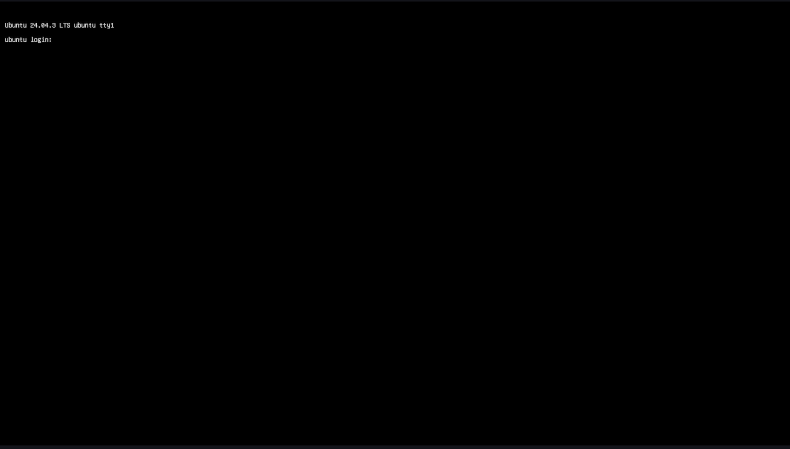

import Tabs from '@theme/Tabs';
import TabItem from '@theme/TabItem';

#  Flash Canonical Ubuntu 24.04 Over Android/QLI Build

If your device is currently running Android or Qualcomm Linux (QLI), this section provides instructions for replacing the existing operating system with a certified Canonical Ubuntu 24.04 Server image, using a host computer running Ubuntu, Windows®, or macOS®.   

	This is the **recommended path for developers** transitioning to Ubuntu for **AI** and **multimedia development**.

    :::warning
	Flashing a prebuilt Ubuntu image will erase all data on your device. Back up important files before proceeding.  
    ::: 
	
	:::info 
		- If the QLI version is 1.3 or above, please ignore Update UFS provisioning step.  
		- **Before You Start** - Complete [**🔗setup**](../2.set-up-your-device.md#-lets-get-started) instructions.  
	:::

### 🏁 Let’s Get Started!
 


### 1️⃣ Setup QDL tool   
**Qualcomm Device Loader (QDL)** is a cross-platform tool for flashing software images to Qualcomm® USB devices by uploading a flash loader, with support for **Windows**, **Linux**, and **macOS**.  
**a**. Download the appropriate version of the QDL tool for your host machine (**Windows**, **Linux**, or **macOS**) from the provided link.  [**🔗QDL tool**(consists executable files)](https://softwarecenter.qualcomm.com/catalog/item/Qualcomm_Device_Loader)    
**b**. Review the official setup guide to understand the full flashing process. 
<a id="flashQDL"></a>
<Tabs>

<TabItem value="uhost" label="Ubuntu host">

Install libusb and libxml2 by executing the following command. (Skip this step if they are already installed.)

```shell
sudo apt-get install libxml2-dev libudev-dev libusb-1.0-0-dev
```

</TabItem>
<TabItem value="whost" label="Windows host">

Install winUSB Driver:  
To prepare your device for flashing, follow these steps to install the **winUSB driver**:   
* Uninstall Existing Drivers    
	Ensure that **Qualcomm USB drivers (QUD)** or any other conflicting drivers are **not installed**.
	Open **Device Manager**, locate your device, and uninstall any existing drivers.  
	In the uninstall dialog, **check** the box labeled:  

          

         * Ensure that you check **Delete the driver software for this device**.

         

* In the folder of QDL - Run **install_driver.bat** 

</TabItem>
<TabItem value="mhost" label="macOS host">

* Install Homebrew using the following method. (Skip this step if it is already installed.)

```shell
/bin/bash -c "$(curl -fsSL https://raw.githubusercontent.com/Homebrew/install/HEAD/install.sh)"
```

* Run the following commands to install libusb and libxml2.

```shell
brew install libusb
brew install libxml2
```
</TabItem>
</Tabs>


### 2️⃣ UFS Provisioning  
Provisioning ensures that the Universal Flash Storage (UFS) is correctly initialized and partitioned to support the new OS image.  
	
**a**. Go to the link and download provision.zip file [**🔗 UFS**](https://artifacts.codelinaro.org/ui/native/codelinaro-le/Qualcomm_Linux/QCS6490/)    
**b**. Unzip and copy the QDL executable files from [**Step1**](#1️⃣-setup-qdl-tool) to UFS provision folder.  
	:::note
		- For Windows host make sure to copy the dll files along with the executable.
	:::
**c**. Enter into [**🔗 EDL mode**](../2.set-up-your-device.md#enter-into-edl-mode)  
**d**. Go to the provision folder to perform UFS provisioning operation   
<Tabs>
<TabItem value="uhost" label="Ubuntu host">
Run the following command to reconfigure the UFS.
```shell
./qdl prog_firehose_ddr.elf provision_1_3.xml
```

</TabItem>
<TabItem value="whost" label="Windows host">
Run the following command to reconfigure the UFS.
```shell
<pathToQDL>\QDL.exe prog_firehose_ddr.elf provision_1_3.xml
```

</TabItem>
<TabItem value="mhost" label="macOS host">
Run the following command to reconfigure the UFS.
```shell
qdl prog_firehose_ddr.elf provision_1_3.xml
```

</TabItem>
</Tabs>

### 3️⃣ Flash Renesas firmware
Renesas firmware update ensures proper initialization and compatibility of the Renesas MCU components embedded in the board. This step is essential for enabling secure boot, stable communication, and full functionality of the device under Ubuntu.  

**a**. Download the file  [**🔗Renesas FW Update**](https://thundercomm.s3.dualstack.ap-northeast-1.amazonaws.com/uploads/web/rubik-pi-3/firmware/Flat_usb_fw.zip)  
**b**. Unzip and copy the QDL executable files from [**Step1**](#1️⃣-setup-qdl-tool) to Renesas Firmware folder.  
	:::note
		- For Windows host make sure to copy the dll files along with the executable
	:::
**c**. Enter into [**🔗 EDL mode**](../2.set-up-your-device.md#enter-into-edl-mode)   
**d**. Flash the driver using QDL command 
<Tabs>
<TabItem value="uhost" label="Ubuntu host">
Run the following command.
```shell
qdl --storage ufs prog_firehose_ddr.elf rawprogram*.xml patch*.xml
```
</TabItem>
<TabItem value="whost" label="Windows host">
Run the following command 
```shell
QDL.exe prog_firehose_ddr.elf rawprogram0.xml rawprogram1.xml rawprogram2.xml rawprogram3.xml rawprogram4.xml rawprogram5.xml patch1.xml patch2.xml patch3.xml patch4.xml patch5.xml  
```
</TabItem>
<TabItem value="mhost" label="macOS host">
Run the following command
```shell
qdl prog_firehose_ddr.elf rawprogram*.xml patch*.xml
```
</TabItem>
</Tabs>
:::note
 In case of failures, remove and plug in the power supply and USB cable to restart your RUBIK Pi 3 and perform the flashing operation again.
:::

### 4️⃣ Download Canonical Ubuntu build and flash
**a**. Download the system image for RPi3 from the Canonical Ubuntu site. [**🔗Server 24.04 image**](https://people.canonical.com/~platform/images/qualcomm-iot/rubikpi3/ubuntu-server-24.04/x00/ubuntu-24.04-preinstalled-server-arm64+rubikpi3-20250912-127.img.xz). Extract the system image XZ file according to the host machine's configuration.    
**b**. Download the dtb.bin file [**🔗Devicetree blob**](https://people.canonical.com/~platform/images/qualcomm-iot/rubikpi3/ubuntu-server-24.04/x00/dtb.bin)  
**c**. Download the rawprogram0.xml file [**🔗rawprogram0.xml**](https://people.canonical.com/~platform/images/qualcomm-iot/rubikpi3/ubuntu-server-24.04/x00/rawprogram0.xml)  
**d**. Download the boot firmware image. [**🔗Boot firmware**](https://thundercomm.s3.dualstack.ap-northeast-1.amazonaws.com/uploads/web/rubik-pi-3/nhlos-bins/QLI.1.4-ubuntu-rubikpi3-nhlos-bins-20250912-127.tar.gz)  
**e**. Unzip the boot firmware image zip file and copy the system image (step a), dtb.bin (step b), and rawprogram0.xml (step c) to this folder location.   
**f**. Unzip and copy the QDL executable files from [**Step1**](#1️⃣-setup-qdl-tool) to Boot Firmware folder.  
	:::note
		- For Windows host make sure to copy the dll files along with the executable
	:::
**g**. Enter into [**🔗 EDL mode**](../2.set-up-your-device.md#enter-into-edl-mode)   
**h**. Follow the procedure below to flash the device using a host computer.    
<Tabs>
<TabItem value="uhost" label="Ubuntu host">
Run the following command.
```shell
qdl --storage ufs prog_firehose_ddr.elf rawprogram*.xml patch*.xml
```
</TabItem>
<TabItem value="whost" label="Windows host">
Run the following command 
```shell
QDL.exe prog_firehose_ddr.elf rawprogram0.xml rawprogram1.xml rawprogram2.xml rawprogram3.xml rawprogram4.xml rawprogram5.xml rawprogram6.xml patch1.xml patch2.xml patch3.xml patch4.xml patch5.xml patch6.xml
```
</TabItem>
<TabItem value="mhost" label="macOS host">
Run the following command
```shell
qdl prog_firehose_ddr.elf rawprogram*.xml patch*.xml
```
</TabItem>
</Tabs>
:::tip
 In case of failures, remove and plug in the power supply and USB cable to restart RUBIK Pi 3 flashing operation.
 :::

 :::info
 By default, when the platform build is flashed, the CDT is also flashed to the designated location named "cdt". This process is defined in the rawprogram3.xml file.   
:::

**i**. Once flashing is complete, the device will automatically boot and display the startup screen on the connected HDMI monitor.  
 

### 5️⃣Login & Wi-Fi Connection 
**a**. Login and change password on the monitor UART console/SBC terminal.    
**b**. Set up Wi-Fi connectivity.  [🔗 **Wi-Fi Setup Guide**](../2.set-up-your-device.md#connect-to-the-network)

### 6️⃣ Install Pre-built Packages 
Run the following commands to install pre-built packages on the device.    
```shell
git clone -b ubuntu_setup --single-branch https://github.com/rubikpi-ai/rubikpi-script.git
cd rubikpi-script
./install_ppa_pkgs.sh 
```

<details>
The script installs the following      
* Install AI samples application packages.  
* Install Rubikpi3 Camera, wiringrp and wiringrp_python packages.  
* Install generic developer tool related packages.  
</details>

> 📌 **Note:** If you encounter package installation failures, run the following command: 'apt --fix-broken install' 

After successful running the install_ppa_pkgs.sh, you can observe the following screen on Display Monitor.  

 
### 7️⃣ Verify the SW version
Run the following commands in the device shell to verify the version: 
	```shell
	cat /etc/os-release 
	```
Output: 
	```json
NAME="Ubuntu"
VERSION_ID="24.04"
VERSION="24.04.2 LTS (Noble Numbat)"
VERSION_CODENAME=noble
ID=ubuntu
ID_LIKE=debian
HOME_URL="https://www.ubuntu.com/"
SUPPORT_URL="https://help.ubuntu.com/"
BUG_REPORT_URL="https://bugs.launchpad.net/ubuntu/"
PRIVACY_POLICY_URL="https://www.ubuntu.com/legal/terms-and-policies/privacy-policy"
UBUNTU_CODENAME=noble
LOGO=ubuntu-logo
```
Run the following command to check the Linux version:
	```shell
	uname -a
	```
Output:
	```json
	Linux ubuntu 6.8.0-1055-qcom #55-Ubuntu SMP PREEMPT_DYNAMIC Wed Sep 17 02:03:34 UTC 2025 aarch64 aarch64 aarch64 GNU/Linux  
	```
---
> **🧭 Next Steps**
> After the image is flashed, refer to the [**Application Development and Execution Guide**](../7.Application%20Development%20and%20Execution%20Guide/index.md).
---