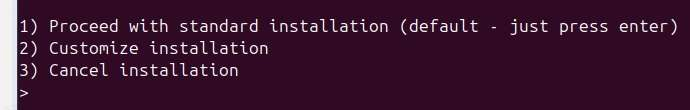

---
# Display h2 to h5 headings
toc_min_heading_level: 2
toc_max_heading_level: 4
---

import Tabs from '@theme/Tabs';
import TabItem from '@theme/TabItem';

# Linux Kernel
This chapter describes how to configure and build a customized kernel for your RUBUK Pi 3.

The RUBIK Pi kernel is hosted on [GitHub](https://github.com/rubikpi-ai/linux-ubuntu). The update lags behind the [upstream Linux kernel](https://github.com/torvalds/linux). Currently, the kernel version for RUBIK Pi 3 Ubuntu 24.04 LTS is 6.8.12.


## Update the kernel
When using the `sudo apt upgrade` command for an update, your kernel will automatically be updated to the latest stable version. If you want to try the latest unstable test kernel, [download the latest kernel source code](#downloade_linux_code) and [manually compile and update the kernel](#Native_and_cross_builds).

## Compile the kernel
There are two ways to compile the kernel: native builds and cross-compilation.

The compilers and linkers installed by default on RUBIK Pi 3 can build executable files that run on RUBIK Pi 3, which is known as the native build.

Cross-compilation, on the other hand, is the process of generating executable code for a different platform, such as building ARM architecture executables on an x86_64 machine.


<a id="downloade_linux_code"></a>
### Download kernel source code

Before building for any target platform, you need the kernel source code. To get the kernel source code, you will need Git. If you haven't installed Git, install it on your device first:

```shell
sudo apt install git
```
Next, download the source code for the latest RUBIK Pi 3 kernel:

```shell
git clone https://github.com/rubikpi-ai/linux-ubuntu.git
```
This may take a few minutes.
:::note
The above `git clone` command will download the current active branch, including all commit history and file history. If you only need the latest source code, use the `git clone --depth 1 https://github.com/rubikpi-ai/linux-ubuntu.git` command to reduce the download size.

If you want to download the source code for other branches, switch to the desired branch after cloning: Go to the download directory and run the `git checkout <branch-name>` command to switch to the desired branch.

Regarding the list of available branches, visit [RUBIK Pi kernel GitHub repository](https://github.com/rubikpi-ai/linux-ubuntu.git).
:::

<a id="Native_and_cross_builds"></a>
Now that you have the kernel source code, you can either build a new kernel locally or cross-compile it.

<Tabs>
  <TabItem value="Native builds" label="Native builds" default>
    **First, install the compilation dependencies on RUBIK Pi 3**
    ```shell
    sudo apt install bc bison flex libssl-dev make gcc debhelper cpio dwarfdump \
    zstd llvm clang libclang-dev gawk dwarves libelf-dev dkms zip rustup
    ```
    **Then, navigate to the kernel directory and set up the Rust environment:**
    ```shell
    cd linux-ubuntu

    curl --proto '=https' --tlsv1.2 -sSf https://sh.rustup.rs | sh
    cargo install --git https://github.com/rust-lang/rust-bindgen --tag v0.65.1 bindgen-cli
    sudo cp ~/.cargo/bin/bindgen /usr/bin/bindgen
    sudo cp /usr/bin/bindgen /usr/bin/bindgen-0.65
    rustup override set $(scripts/min-tool-version.sh rustc)
    rustup component add rust-src
    ```
    If the following content appears, press **Enter** to use the default configuration.
    

    Run the following command to verify that the Rust environment is configured successfully.
    ```shell
    make LLVM=1 rustavailable
    ```

    If the Rust environment is configured successfully, the following output will appear:

    ```
    Rust is available!
    ```
    **Next, build the kernel. This step may take a long time.**
    ```shell
    fakeroot debian/rules clean
    fakeroot debian/rules build
    fakeroot debian/rules binary
    ```
    :::note
    The command `fakeroot debian/rules build` will automatically compile the kernel in parallel based on the number of CPU cores. RUBIK Pi has 8 CPU cores, so 8 threads will be used to compile the kernel.
    :::

    **Install the kernel:**

    Navigate to the parent directory of linux-ubuntu, then install the generated kernel package onto the system.
    ```shell
    cd ..
    sudo dpkg -i linux-*.deb
    ```
    **Finally, run the following command to reboot your RUBIK Pi 3 and boot into the newly compiled kernel:**
    ```shell
    sudo reboot
    ```
  </TabItem>

  <TabItem value="Cross-compilation" label="Cross compilation">
    You need a suitable Linux cross-compilation host. We recommend that you perform the cross-compilation within a Docker container hosted on an Ubuntu 24.04 system.

    **First, click [here](https://thundercomm.s3.dualstack.ap-northeast-1.amazonaws.com/uploads/web/rubik-pi-3/tools/ubuntu-24.04.tar) to download the Docker image.**
    **Run the following command to import the Docker image and run it:**
    :::note
    If you have not installed Docker, run the `apt install docker.io` command to install Docker.
    When running Docker, you need to specify the local working directory to the Docker container. For example, */home/rubikpi/ubuntu* is the local working directory, and */home/ubuntu/prj* is the working directory inside the Docker container. Make sure that your local working directory contains the kernel source code directory *linux-ubuntu*.
    :::
    ```shell
    sudo docker load -i ubuntu-24.04.tar
    sudo docker run --name  ubuntu24.04 --privileged -it -v /home/rubikpi/ubuntu:/home/ubuntu/prj dokken/ubuntu-24.04 /bin/bash
    sudo passwd root
    sudo passwd ubuntu
    su ubuntu
    ```
    **Install the build dependencies in Ubuntu 24.04 Docker:**
    ```shell
    sudo apt update
    sudo apt install -y debhelper gcc-13-aarch64-linux-gnu/noble-updates \
    gcc-11-aarch64-linux-gnu g++-11-aarch64-linux-gnu cpio dwarfdump/noble \
    zstd llvm clang libclang-dev make gawk flex bison git libssl-dev bc dwarves \
    libelf-dev dkms zip

    **Navigate to the kernel directory and configure the Rust environment:**
    ```shell
    cd prj/linux-ubuntu

    curl --proto '=https' --tlsv1.2 -sSf https://sh.rustup.rs | sh
    cargo install --git https://github.com/rust-lang/rust-bindgen --tag v0.65.1 bindgen-cli
    sudo cp ~/.cargo/bin/bindgen /usr/bin/bindgen
    sudo cp /usr/bin/bindgen /usr/bin/bindgen-0.65
    rustup override set $(scripts/min-tool-version.sh rustc)
    rustup component add rust-src
    ```

    If the following content appears, press **Enter** to use the default configuration.
    

    Run the following command to verify that the Rust environment is configured successfully.
    ```shell
    make LLVM=1 rustavailable
    ```

    If the Rust environment is configured successfully, the following output will appear.

    ```
    Rust is available!
    ```
    **Next, build the kernel. This step may take a long time.**
    ```shell
    export ARCH=arm64
    export $(dpkg-architecture -aarm64)
    export CROSS_COMPILE=aarch64-linux-gnu-
    export HOSTCC=clang

    fakeroot debian/rules clean
    fakeroot debian/rules build
    fakeroot debian/rules binary
    ```
    :::note

    The command `fakeroot debian/rules build` will automatically compile the kernel in parallel based on the number of CPU cores. RUBIK Pi has 8 CPU cores, so 8 threads will be used to compile the kernel.
    :::

    **Install the kernel**

    Next, navigate to the parent directory of the *linux-ubuntu* directory, and transfer the generated kernel package to RUBIK Pi 3. You can use a USB drive, SSD, or commands like `scp` or `adb push` to transfer the files.
    Run the following command to install the kernel on RUBIK Pi 3：

    ```shell
    cd ..
    sudo dpkg -i linux-*.deb
    ```
    **Finally, run the following command to run the newly compiled kernel on RUBIK Pi 3:**

    ```shell
    sudo reboot
    ```
  </TabItem>
</Tabs>


## Configured the kernel
The Linux kernel is highly configurable. Some users may want to modify the default configuration to fit their own needs, such as enabling new or experimental network protocols, or enabling support for new hardware.

Configuration is typically done through the make menuconfig interface. Alternatively, you can edit the *.config* file, but this may be more challenging.

### Prepare for the configuration

The menuconfig tool requires the ncurses development headers to compile and run properly. To install these headers, run the following command:

```shell
sudo apt install libncurses5-dev
```
Next, [download the kernel source code](#downloade_linux_code). It's important to note that you should have already completed the steps for either [native builds or cross-compilation](#Native_and_cross_builds).

### menuconfig

After setting up everything, you can now compile and run the menuconfig program as follows:

<Tabs>
  <TabItem value="Native builds" label="Native builds">
    ```shell
    cd linux-ubuntu/debian/build/build-rubikpi

    make menuconfig
    ```
  </TabItem>

  <TabItem value="Cross-compilation" label="Cross-compilation">
    ```shell
    cd prj/linux-ubuntu/debian/build/build-rubikpi

    make ARCH=arm64 CROSS_COMPILE=aarch64-linux-gnu- menuconfig
    ```
  </TabItem>
</Tabs>

Use the keyboard to operate menuconfig:

* Use the arrow keys for navigation.

* Press **Enter** to enter a submenu (indicated by --->).

* Press **Esc** twice to go back to the previous level or exit.

* Use the space bar to toggle the enable/disable state of an option.

* Press **Enter** to open a submenu, use the arrow keys to browse the submenu, then press **Enter** again to select the state.

* Press **H** to get help on an option or menu.

After a quick compilation, the menuconfig will display a list of submenus containing all the configurable options. There are many options, so please read through them patiently. On your first attempt, do not enable or disable a large number of options. The configuration can be easily broken, so it's best to make only a few changes at a time and familiarize yourself with the configuration and build process.

### Save changes
After making the changes, press and hold the **Esc** key until the system prompts you to save the new configuration. By default, it will be saved to the *.config* file. You can save and load the configuration by copying this file.

Once the customization is complete, you can now proceed to build the kernel.
<Tabs>
  <TabItem value="Native builds" label="Native builds">
    ```shell
    cd linux-ubuntu

    fakeroot debian/rules build
    ```
  </TabItem>

  <TabItem value="Cross-compilation" label="Cross-compilation">
    ```shell
    cd prj/linux-ubuntu

    export ARCH=arm64
    export $(dpkg-architecture -aarm64)
    export CROSS_COMPILE=aarch64-linux-gnu-
    export HOSTCC=clang

    fakeroot debian/rules build
    ```
  </TabItem>
</Tabs>

After the kernel has been built, refer to the methods described [Compile the kernel](#Native_and_cross_builds) to install the kernel.

## Apply kernel patches
When building a custom kernel, you may want to apply patches or a patch set (a collection of patches) to the Linux kernel.

Hardware manufacturers sometimes provide patch sets as a temporary measure to support new hardware before the patches are incorporated into the Linux kernel and the RUBIK Pi kernel. However, there are also patch sets for other purposes, such as enabling full kernel preemption to support real-time use.

### Confirm your kernel version
To check the kernel version currently running on your device, run the following command:
```shell
uname -r
```
Before applying a patch, it is important to check the kernel version. In the kernel source directory, run the following command to check the kernel version:
```shell
head Makefile -n 4
```
An output similar to the following should appear.
```
# SPDX-License-Identifier: GPL-2.0
VERSION = 6
PATCHLEVEL = 8
SUBLEVEL = 12
```
In this case, the source code is applicable for the 6.8.12 kernel.

### Apply patches
The application of the patch depends on the format in which the patch is distributed.

Developers distribute most patches as single files. Use the patch utility to apply these patches. The following commands will download, extract, and use the real-time kernel patch to patch our example kernel version:
```shell
wget https://www.kernel.org/pub/linux/kernel/projects/rt/6.8/patch-6.8.2-rt11.patch.gz
gunzip patch-6.8.2-rt11.patch.gz
cat patch-6.8.2-rt11.patch.gz | patch -p1
```
Some developers may distribute patches in the form of an email, which is a folder containing multiple patch files. Use Git to apply these patches.  
Before using Git to apply the email patches, configure the local Git installation with the name and email:

```shell
git config --global user.name "your name"
git config --global user.email "your email"
```
To apply the patches distributed via emails using Git, run the following command:
```shell
git am -3 /path/to/patches/*
```
Be sure to follow the instructions provided by the patch distributor. For example, some patch sets may need to be applied against a specific commit.

### Kernel header files

To compile a kernel module, you need the Linux kernel header files. These header files provide the function and structure definitions required to build code that interfaces with the kernel.

If you cloned the entire kernel from GitHub, these header files are included in the source code tree. If you do not need all the extra files, use the `apt` command to install only the kernel header files on RUBIK Pi 3.

```shell
sudo apt install linux-headers-$(uname -r)
```
:::note
Installing the kernel header files may take a few minutes. There is no progress indicator during the installation.
:::

## Contribute your code

You may want to add something to the kernel for different reasons:

* You have written some RUBIK Pi-specific code and want everyone to benefit from it.

* You have written a generic Linux kernel driver for a device and want everyone to be able to use it.

* You have fixed a generic kernel bug.

* You have fixed a RUBIK Pi-specific kernel bug.

For RUBIK Pi-specific changes or bug fixes, submit a Pull Request (PR) to the RUBIK Pi kernel. For general Linux kernel changes (such as new drivers), first submit a PR to the upstream Linux kernel. Once the Linux kernel accepts your changes, we will merge them into the RUBIK Pi kernel during kernel updates.

### Contribute code to the RUBIK Pi kernel
First, fork the [RUBIK Pi kernel repository](https://github.com/rubikpi-ai/linux-ubuntu) and clone it to your development device. Then, you can make changes, test them, and submit them to your forked repository.

Next, submit a PR containing your changes to the [RUBIK Pi kernel repository](https://github.com/rubikpi-ai/linux-ubuntu). RUBIK Pi engineers will review your contribution and provide feedback for improvements. Once approved, we will merge your changes, which will eventually be included in the stable version of the RUBIK Pi kernel.

### Contribute code to the upstream Linux kernel
First, clone the [Linux kernel tree](https://git.kernel.org/pub/scm/linux/kernel/git/torvalds/linux.git) to your development device. Then, you can make changes, test them, and commit them to your local tree.

When your changes are ready, submit them to the Linux kernel community. Linux kernel development is conducted through mailing lists, not on GitHub, so email your patches to the community. Please follow the guidelines described in [Submitting patches: the essential guide to getting your code into the kernel](https://www.kernel.org/doc/html/latest/process/submitting-patches.html) and [Linux kernel coding style](https://www.kernel.org/doc/html/latest/process/coding-style.html). Linux kernel contributors will review your contribution and provide feedback for improvements. Once approved, they will merge your changes. Eventually, these changes will make it into a long-term Linux kernel release. Once we've tested that the long-term release is compatible with the RUBIK Pi kernel, your changes will be included in the stable version of the RUBIK Pi kernel.


