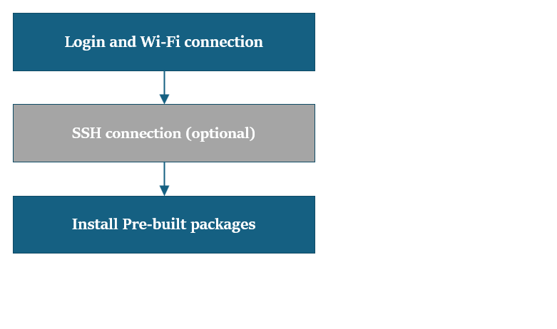
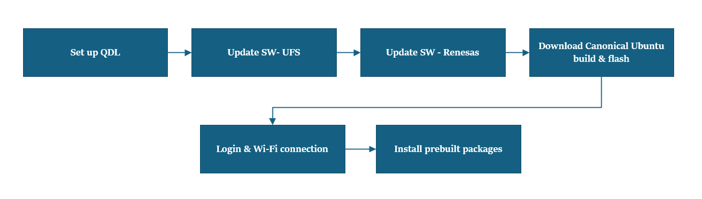

import Tabs from '@theme/Tabs';
import TabItem from '@theme/TabItem';

# 👋 Rpi Dogfooding Guide!  
Thanks for joining the Rpi internal testing crew! This guide walks you through our dogfooding phase, where your feedback helps us spot issues and make Rpi even better before launch.

***Inside this guide, you’ll find:***  
 How to get started with dogfooding  
 Steps for reporting bugs and sharing feedback  
 Where to find support and resources  

We encourage you to dive in, try things out, and let us know what’s working and what needs improvement. 
Your input is key to making Rpi the best it can be!

# Workflow Comparison Table

<details>

| **Aspect**               |  [🖥️ Device with Preloaded Certified Ubuntu Build (Post 9/30)](#wfl1) |  [🖥️Workflow 2 – Preloaded QLI Build (Pre 9/30)](#wfl2) | [🖥️Workflow 3 – QLI/Android to Certified Ubuntu (Post 9/30)](#wfl13) |  [🖥️Workflow 4 – Reset System Image or Update Qcom Firmware](#wfl4) |
|--------------------------|---------------------------------------------------------------|--------------------------------------------------|---------------------------------------------------------------|--------------------------------------------------------------|
| **Device State**         | Device comes preloaded with certified Ubuntu and Renesas FW   | Device comes preloaded with QLI build            | Device comes with QLI/Android build, needs Ubuntu update      | Device needs system image reset or firmware update          |
| **Setup Complexity**     | Minimal setup: login, Wi-Fi, install packages                 | Full flashing: QDL, UFS, Renesas, Ubuntu image   | Full flashing: QDL, UFS, Renesas, Canonical Ubuntu            | Flashing Canonical Ubuntu and Qcom firmware                 |
| **Tools Used**           | SSH (optional), Wi-Fi setup, install script                   | QDL, UFS provisioning, Renesas FW update, Canonical flashing | QDL, UFS provisioning, Renesas FW update, Canonical flashing | QDL, Canonical flashing                                     |
| **Steps Involved**       | 1. Login and Wi-Fi  2. Optional SSH  3. Install packages       | 1. QDL setup  2. UFS update  3. Renesas update  4. Ubuntu download and flash  5. Login and Wi-Fi  6. Install packages | 1. QDL setup  2. UFS update  3. Renesas update  4. Canonical download  5. Flash image  6. Login and Wi-Fi  7. Install packages | 1. QDL setup  2. Canonical download  3. Flash image  4. Login and Wi-Fi  5. Install packages |
| **User Effort**          | Lower – device is mostly ready to use                         | Higher – full reflash and configuration needed   | Higher – full reflash and configuration needed                | Moderate – focused on reset or firmware update              |
| **Use Case Timing**      | After September 30th                                          | Before September 30th                            | After September 30th                                          | Anytime reset or firmware update is needed                  |

</details>

<Tabs>
<TabItem value="Workflow1" label="Workflow1-Preloaded Certified Build(Post 9/30)">

		---
		<a id="wfl1"></a>
		## Workflow 1 – Device with Preloaded Certified Ubuntu Build (Post 9/30)
		---
		#### 📝 What You Need to Know First
		:::info Assumptions
		Your device already has the certified Ubuntu build and Renesas firmware loaded.    
		Complete setup instructions before starting workflow steps.
	
		:::

		---

		#### 🌐 Network Access Tip

		:::tip
		If accessing links outside the Qualcomm network, create a Qcom userid to download UFS.
		:::

		---

	### 🏁 Let’s Get Set Up!
	 

	##### 1️⃣ Login & Wi-Fi Connection 
	Login and change password on the monitor terminal (SBC).   
	Set up Wi-Fi connectivity.  
	###### Reference: [🔗 Wi-Fi Setup Guide](../1.quick-start/2.set-up-your-device.md#connect-to-the-network)

	##### 2️⃣ SSH Connection (Optional) 
	Get the IP address for RPi3.  
	On your host machine, use SSH to connect to the device.  
	###### Commands:  
	```shell
	ssh ubuntu@<IP Address>
	```

	##### 3️⃣ Install Pre-built Packages 
	Install pre-built packages on the device.  
	Set execution permissions and run the script.
	###### Commands:  
	```shell
	git clone -b ubuntu_setup --single-branch https://github.com/rubikpi-ai/rubikpi-script.git
	cd rubikpi-script
	./install_ppa_pkgs.sh
	```
	##### 4️⃣ Verify the SW version
	Run the following command in the device shell to verify the Ubuntu 24.04 version:
	###### Commands:  
	```shell
	 cat /etc/os-release 
	```
</TabItem>
<TabItem value="Workflow2" label="Workflow2-preloaded QLI build–(Pre 9/30)">

	---
	<a id="wfl2"></a>
	## Workflow 2 – User gets a device with preloaded QLI build – (Pre 9/30)
	---
	#### 📝 What You Need to Know First
	:::info 
		#### Assumptions
		 If the QLI version is 1.3 or above , please ignore Update UFS step 
		Please follow the instructions to make sure the setup is complete before proceeding with the workflow steps.    
		**Before You Start**  
		Make sure you’ve checked out the setup instructions.
		You’ll need internet access (like a mobile hotspot) to grab TC PPAs.  
		**Pre-requisites**  
		Complete setup instructions before starting workflow steps.
		Connect to an external network (e.g., mobile hotspot) to download TC PPAs.
	:::

	---

	#### 🌐 Network Access Tip

	:::tip
	If accessing links outside the Qualcomm network, create a Qcom userid to download UFS.
	:::

	---

### 🏁 Let’s Get Set Up!
 

##### 1️⃣ Set up QDL   
Based on host, download respective version of QDL from the link provided.
###### Reference: [🔗Flash using the QDL tool](../1.quick-start/1.update-software.md#flash-using-the-qdl-tool)  

##### 2️⃣ Update S/W - UFS 
  Copy the files from QDL_xxxx and put it in the UFS location  
  Put the device in EDL mode  
  Run the command to perform UFS provisioning operation
###### Reference: [🔗 UFS](https://artifacts.codelinaro.org/ui/native/codelinaro-le/Qualcomm_Linux/QCS6490/)
###### Commands:  
  ```shell
  <pathToQDL>\QDL.exe prog_firehose_ddr.elf provision_1_3.xml
``` 

##### 3️⃣ Update S/W - Renesas
Download the file -refer to the link below   
Unzip Copy the files from QDL_xxxx and put it in the renesas location  
Put the device in EDL mode
Flash the driver using QDL command 
###### Reference: [🔗Renesas FW Update](https://thundercomm.s3.dualstack.ap-northeast-1.amazonaws.com/uploads/web/rubik-pi-3/firmware/Flat_usb_fw.zip)
###### Commands:  
```shell
QDL.exe prog_firehose_ddr.elf rawprogram0.xml rawprogram1.xml rawprogram2.xml rawprogram3.xml rawprogram4.xml rawprogram5.xml patch1.xml patch2.xml patch3.xml patch4.xml patch5.xml  
```
##### 4️⃣ Download Canonical Ubuntu build 
Download the zip file tangshan ubuntu server build -- Pre certified build 
unzip the folder
###### Reference: [🔗Canonical link](https://oem-share.canonical.com/partners/tangshan/share/ubuntu-server-24.04/20250912-127/tangshan-ubuntu-server-24.04-20250912-127.tar.xz) , 🔗Dropbox location

##### 5️⃣ Canonical Ubuntu image flashing
Build location (canonical/tangshan folder) and copy the 2 qdl files to this folder location  
Put the device into EDL mode  
Flash the device using the command  
Device automatically boots up
###### Commands:  
  ```shell
  QDL.exe prog_firehose_ddr.elf rawprogram0.xml rawprogram1.xml rawprogram2.xml rawprogram3.xml rawprogram4.xml rawprogram5.xml rawprogram6.xml patch1.xml patch2.xml patch3.xml patch4.xml patch5.xml patch6.xml
  ```

##### 6️⃣ Login & Wi-Fi Connection 
Login and change password on the monitor terminal (SBC). 
Set up Wi-Fi connectivity.  
###### Reference: [🔗 Wi-Fi Setup Guide](../1.quick-start/2.set-up-your-device.md#connect-to-the-network)

##### 7️⃣ Install Pre-built Packages 
Install pre-built packages on the device.  
Set execution permissions and run the script.
###### Commands:  
```shell
git clone -b ubuntu_setup --single-branch https://github.com/rubikpi-ai/rubikpi-script.git
cd rubikpi-script
./install_ppa_pkgs.sh
```
##### 8️⃣ Verify the SW version
Run the following command in the device shell to verify the Ubuntu 24.04 version:
###### Commands:  
```shell
	cat /etc/os-release 
```
</TabItem>
<TabItem value="Workflow3" label="Workflow3-preloaded QLI/Android build to certified Canonical ubuntu build (post 9/30)">
	---
	<a id="wfl3"></a>
	## Workflow 3 – Workflow 3– User device is preloaded to QLI/Android build and update to certified Canonical ubuntu build (post 9/30) 
	---
	#### 📝 What You Need to Know First
	:::info 
		#### Assumptions
		 If the QLI version is 1.3 or above , please ignore Update UFS step 
		Please follow the instructions to make sure the setup is complete before proceeding with the workflow steps.    
		**Before You Start**  
		Make sure you’ve checked out the setup instructions.
		You’ll need internet access (like a mobile hotspot) to grab TC PPAs.  
		**Pre-requisites**  
		Complete setup instructions before starting workflow steps.
		Connect to an external network (e.g., mobile hotspot) to download TC PPAs.
		Host m/c required - user can use either Linux, Windows or a MAC (with either ARM or intel X86).  
	:::

	---

	#### 🌐 Network Access Tip

	:::tip
	If accessing links outside the Qualcomm network, create a Qcom userid to download UFS.
	:::

	---

### 🏁 Let’s Get Set Up!
 

##### 1️⃣ Set up QDL 
Set up QDL using the instructions   
Based on host,download respective version of QDL from the link provided.
###### Reference: [🔗QDL-Tool](https://softwarecenter.qualcomm.com/catalog/item/Qualcomm_Device_Loader)  

##### 2️⃣ Update S/W - UFS 
  Copy the files from QDL_xxxx and put it in the UFS location  
  Put the device in EDL mode  
  Run the command to perform UFS provisioning operation
###### Reference: [🔗 UFS](https://artifacts.codelinaro.org/ui/native/codelinaro-le/Qualcomm_Linux/QCS6490/)
###### Commands:  
  ```shell
  <pathToQDL>\QDL.exe prog_firehose_ddr.elf provision_1_3.xml
``` 

##### 3️⃣ Update S/W - Renesas
Download the file -refer to the link below   
Unzip Copy the files from QDL_xxxx and put it in the renesas location  
Put the device in EDL mode
Flash the driver using QDL command 
###### Reference: [🔗FW Update](https://thundercomm.s3.dualstack.ap-northeast-1.amazonaws.com/uploads/web/rubik-pi-3/firmware/Flat_usb_fw.zip)
###### Commands:  
```shell
QDL.exe prog_firehose_ddr.elf rawprogram0.xml rawprogram1.xml rawprogram2.xml rawprogram3.xml rawprogram4.xml rawprogram5.xml patch1.xml patch2.xml patch3.xml patch4.xml patch5.xml  
```
##### 4️⃣ Download Canonical Ubuntu build 
Canonical ubuntu site and download the system image for Rpi3  
Download the dtb.bin file (device tree)  
Download the rawprogram0.xml file  
Download the Qcomm firmware images  
unzip the qcom firmware image zip file and copy the dtb.bin ,rawprogra0.xml and system 
###### Reference: [🔗Canonical link](https://ubuntu.com/download/qualcomm-iot)

##### 5️⃣ Canonical Ubuntu image flashing
Build location (canonical/tangshan folder) and copy the 2 qdl files to this folder location 
Put the device into EDL mode
Flash the device using the command
Device automatically boots up
###### Commands:  
  ```shell
  QDL.exe prog_firehose_ddr.elf rawprogram0.xml rawprogram1.xml rawprogram2.xml rawprogram3.xml rawprogram4.xml rawprogram5.xml rawprogram6.xml patch1.xml patch2.xml patch3.xml patch4.xml patch5.xml patch6.xml
  ```

##### 6️⃣ Login & Wi-Fi Connection 
Login and change password on the monitor terminal (SBC). 
Set up Wi-Fi connectivity.  
###### Reference: [🔗 Wi-Fi Setup Guide](../1.quick-start/2.set-up-your-device.md#connect-to-the-network)

##### 7️⃣ Install Pre-built Packages 
Install pre-built packages on the device.  
Set execution permissions and run the script.
###### Commands:  
```shell
git clone -b ubuntu_setup --single-branch https://github.com/rubikpi-ai/rubikpi-script.git
cd rubikpi-script
./install_ppa_pkgs.sh
```
##### 8️⃣ Verify the SW version
Run the following command in the device shell to verify the Ubuntu 24.04 version:
###### Commands:  
```shell
	cat /etc/os-release 
```
</TabItem>
<TabItem value="Workflow4" label="Workflow4-reset system image/update Qcom firmware ">
	---
	<a id="wfl4"></a>
	## Workflow 4– User wants to reset the system image or update Qcom firmware 
	---
	#### 📝 What You Need to Know First
	:::info 
		#### Assumptions
		 If the QLI version is 1.3 or above , please ignore Update UFS step 
		Please follow the instructions to make sure the setup is complete before proceeding with the workflow steps.    
		**Before You Start**  
		Make sure you’ve checked out the setup instructions.
		You’ll need internet access (like a mobile hotspot) to grab TC PPAs.  
		**Pre-requisites**  
		Complete setup instructions before starting workflow steps.
		Connect to an external network (e.g., mobile hotspot) to download TC PPAs.
		Host m/c required - user can use either Linux, Windows or a MAC (with either ARM or intel X86).  
	:::

	---

	#### 🌐 Network Access Tip

	:::tip
	If accessing links outside the Qualcomm network, create a Qcom userid to download UFS.
	:::

	---

### 🏁 Let’s Get Set Up!
 

##### 1️⃣ Set up QDL 
Set up QDL using the instructions   
Based on host,download respective version of QDL from the link provided.
###### Reference: [🔗QDL-Tool](https://softwarecenter.qualcomm.com/catalog/item/Qualcomm_Device_Loader)  

##### 2️⃣ Download Canonical Ubuntu build 
Canonical ubuntu site and download the system image for Rpi3  
Download the dtb.bin file (device tree)  
Download the rawprogram0.xml file  
Download the Qcomm firmware images  
unzip the qcom firmware image zip file and copy the dtb.bin ,rawprogra0.xml and system 
###### Reference: [🔗Canonical link](https://ubuntu.com/download/qualcomm-iot)

##### 3️⃣ Canonical Ubuntu image flashing
Build location (canonical/tangshan folder) and copy the 2 qdl files to this folder location 
Put the device into EDL mode
Flash the device using the command
Device automatically boots up
###### Commands:  
  ```shell
  QDL.exe prog_firehose_ddr.elf rawprogram0.xml rawprogram1.xml rawprogram2.xml rawprogram3.xml rawprogram4.xml rawprogram5.xml rawprogram6.xml patch1.xml patch2.xml patch3.xml patch4.xml patch5.xml patch6.xml
  ```

##### 4️⃣ Login & Wi-Fi Connection 
Login and change password on the monitor terminal (SBC). 
Set up Wi-Fi connectivity.  
###### Reference: [🔗 Wi-Fi Setup Guide](../1.quick-start/2.set-up-your-device.md#connect-to-the-network)

##### 5️⃣ Install Pre-built Packages 
Install pre-built packages on the device.  
Set execution permissions and run the script.
###### Commands:  
```shell
git clone -b ubuntu_setup --single-branch https://github.com/rubikpi-ai/rubikpi-script.git
cd rubikpi-script
./install_ppa_pkgs.sh
```
##### 6️⃣ Verify the SW version
Run the following command in the device shell to verify the Ubuntu 24.04 version:
###### Commands:  
```shell
	cat /etc/os-release 
```
</TabItem>
</Tabs>

