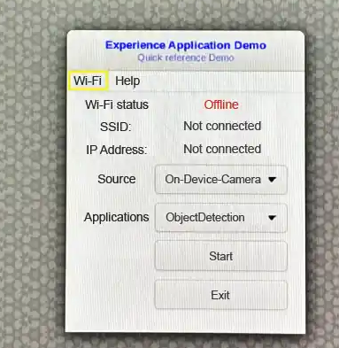

import Tabs from '@theme/Tabs';
import TabItem from '@theme/TabItem';

# 🧪 Run Sample Applications

Designed for developers and engineers exploring AI and multimedia capabilities, this guide outlines prerequisites, setup steps, and troubleshooting tips to ensure smooth execution and optimal performance.
Each tab below provides detailed instructions tailored to specific use cases.

<Tabs>
    <TabItem value="OOB Experience" label="Out Of Box Experience">
<Tabs>
<TabItem value="Prebuilt" label="Prebuilt Sample Apps">
---
### 🎯 Developer Goal
- Get a **quick out-of-the-box experience** with various use cases and device capabilities  
- Run **sample applications** using the **Qualcomm Intelligent Multimedia Product (QIMP) SDK** on Ubuntu  
---

### 👤 Persona
- AI curious developer or application engineer exploring multimedia capabilities.
---

### ✅ Pre-requisites
#### On Target
- **Ubuntu OS should be flashed** 
- **Terminal access** with appropriate permissions.
- **Run install_ppa_pkgs.sh script** to install necessary packages 

---

> 💡 **Tip:** Make sure your system meets all the prerequisites before launching the sample apps.  
---
### Step-by-Step instructions

### Step 1: Download and Run the Script

This script will automatically fetch all required packages for running the sample applications, including:
- Models  
- Labels  
- Media files

#### 📦 Script Details
```shell
cd /home/ubuntu 
sudo su 
curl -L -O https://raw.githubusercontent.com/quic/sample-apps-for-qualcomm-linux/refs/heads/main/download_artifacts.sh
chmod +x download_artifacts.sh 
./download_artifacts.sh -v GA1.5-rel -c QCS6490
```
---
#### 📘 Explanation
- Use the `-v` flag to define the **version** you want to work with (e.g., GA1.5-rel).
- Use the `-c` flag to define the **chipset** your device is using.(e.g., QCS6490).

### Step 2: Verify Model/Label/Media Files  
Before launching any sample applications, make sure the required files are in place.
#### ✅ Check the following directories:
- **Model files** → `/etc/models/`
- **Label files** → `/etc/labels/`
- **Media files** → `/etc/media/`
> 📌 **Note:** These files are essential for AI and multimedia apps to function correctly. If they’re missing, re-run the artifact download script. 
---

### Step 3: Set Up Environment Variables (if required)
Sample applications need specific environment variables for proper display and runtime behavior.
```shell
export XDG_RUNTIME_DIR=/dev/socket/weston 
export WAYLAND_DISPLAY=wayland-1
```
> 💡 **Tip:** These variables often control display settings, hardware acceleration, or runtime paths. Setting them correctly ensures smooth execution.

### Step 4: Sample Application – Available OOB 
##### Input Source – Media File; Output Source - Waylandsink
##### Model Precision - Quant model; Runtime - TFLite; Script used - JSON

| Sample App Name           |  Details   | AI Hub Model (Default)         |
|------------------------------|------------|--------------------------------|
| gst-ai-classification     |  [Image classification](https://docs.qualcomm.com/bundle/publicresource/topics/80-70020-50/gst-ai-classification.html)  | Inception_v3                   
| gst-ai-pose-detection     |  [Pose detection](https://docs.qualcomm.com/bundle/publicresource/topics/80-70020-50/gst-ai-pose-detection.html)  | hrnet_pose                
| gst-ai-segmentation       |  [Image segmentation](https://docs.qualcomm.com/bundle/publicresource/topics/80-70020-50/gst-ai-segmentation.html)  | Deeplabv3_plus_mobilenet 
| gst-ai-monodepth          |  [Monodepth from video](https://docs.qualcomm.com/bundle/publicresource/topics/80-70020-50/mono-depth-from-video.html) | midas                   
| gst-ai-face-detection     |  [Face detection](https://docs.qualcomm.com/bundle/publicresource/topics/80-70020-50/gst-ai-face-detection.html) | face_det_lite                
| gst-camera-single-stream-example     |  [Single camera streaming](https://docs.qualcomm.com/bundle/publicresource/topics/80-70020-50/gst-camera-single-stream-example.html) | NA                
| gst-multi-camera-example    |  [Multi-camera streaming](https://docs.qualcomm.com/bundle/publicresource/topics/80-70020-50/gst-multi-camera-stream-example.html) | NA         
| gst-activate-deactivate-streams-runtime-example     |  [Activate-deactivate streams at runtime](https://docs.qualcomm.com/bundle/publicresource/topics/80-70020-50/gst-activate-deactivate-streams-runtime.html) | NA                


Use the terminal to launch your sample application  
#### Example
```bash
gst-ai-classification
```
To display the available help options, run the following command in the SSH shell:
```bash
gst-ai-classification -h
```
### Step 5: 
To stop the use case, use CTRL + C.

---
### Reference Docs:  
[Qualcomm Intelligent Multimedia SDK (IM SDK) Reference](https://docs.qualcomm.com/bundle/publicresource/topics/80-70020-50/example-applications.html)  
---
</TabItem>

<TabItem value="QDemo" label="QDemo">
---
### 🎯 Developer Goal
- Run multimedia and AI sample applications using a graphical user interface (GUI) application.
- The Qdemo application helps user experience the **Qualcomm Intelligent Multimedia Product (QIMP) SDK** on Ubuntu with just a few clicks.
---
### 👤 Persona
- AI curious developer or application engineer exploring multimedia capabilities.
---

### ✅ Pre-requisites
#### On Target
- **Ubuntu OS should be flashed** 
- **Terminal access** with appropriate permissions.
- **SBC mode** - mouse,keyboard, HDMI monitor and HDMI cable must be connected. 
- **Run install_ppa_pkgs.sh script** to install necessary packages
-----
### Step-by-Step instructions

### Step 1: 

Open the terminal from SBC and install following packages:  
#### 📦 Script Details
```shell
sudo apt install python3-gi-cairo gir1.2-gtk-3.0
# Change permission to media/labels/models
sudo su
chmod 777 /etc/media
chmod 777 /etc/labels
chmod 777 /etc/models
chmod 777 /etc/media/video.mp4
```
---
### Step 2: Copy the files 
Copy Qdemo.png and Qdemo.gif by using SSH
../files/Qdemo.gif
../files/Qdemo.png

### Step 3: Run QDemo
Run the following command on SBC terminal
```shell
gst-gui-launcher-app.py
```
 

### Step 4: Wi-Fi setup
Select Wi-Fi to connect to a Wi-Fi network.

### Step 5: Run QDemo apps 
| Sample Apps           |  Details              |
|---------------------- |---------------------- |
| Record live video     | Records the camera feed and saves up to 30 seconds of video.|
| DashCamera            | Multi-camera streaming |
| VideoWall             | Performs concurrent video playback for MP4 AVC (H.264) videos and performs composition on a video wall display |
| ObjectDetection       | Object detection |
| Parallel-AI-Fusion    | Parallel inferencing |

</TabItem>
</Tabs>
</TabItem>


<TabItem value="Recipes" label="Recipes">
<Tabs>
<TabItem value="Recipes" label="Update Config JSON to run Apps">
---
### 🎯 Developer Goal
- Configure and run advanced multimedia and AI sample applications using the **Qualcomm Intelligent Multimedia Product (QIMP) SDK** on Ubuntu.
- Customize pipelines using JSON files to define input/output sources, runtime options, precision, and model types.
- Evaluate performance across CPU, GPU, and DSP using models from **AI Hub**, with support for frameworks like **TFLite, QNN, and SNPE**.
---

### 👤 Persona
- Developers or engineers with intermediate to advanced experience in AI, multimedia, or embedded systems.
- Users who require flexibility in configuring application behavior and optimizing performance across runtime targets.
---

### ✅ Pre-requisites
#### On Target
- **Ubuntu OS should be flashed** 
- **Terminal access** with appropriate permissions.
- **Run install_ppa_pkgs.sh script** to install necessary packages
- **Basic familiarity with JSON configuration files** and runtime environment variables.
- **Access to AI Hub** for model selection and export. [**Create AI Hub account**](https://aihub.qualcomm.com/)
-----
### Step-by-Step instructions

### Step 1: Download and Run the Script

This script will automatically fetch all required packages for running the sample applications, including:
- Models  
- Labels  
- Media files

#### 📦 Script Details
```shell
cd /home/ubuntu 
sudo su 
curl -L -O https://raw.githubusercontent.com/quic/sample-apps-for-qualcomm-linux/refs/heads/main/download_artifacts.sh
chmod +x download_artifacts.sh 
./download_artifacts.sh -v GA1.5-rel -c QCS6490
```
---
#### 📘 Explanation
- Use the `-v` flag to define the **version** you want to work with (e.g., GA1.5-rel).
- Use the `-c` flag to define the **chipset** your device is using.(e.g., QCS6490).

### Step 2: Verify Model/Label/Media Files  
Before launching any sample applications, make sure the required files are in place.
#### ✅ Check the following directories:
- **Model files** → `/etc/models/`
- **Label files** → `/etc/labels/`
- **Media files** → `/etc/media/`
> 📌 **Note:** These files are essential for AI and multimedia apps to function correctly. If they’re missing, re-run the artifact download script. 
---

### Step 3: Set Up Environment Variables (if required)
Sample applications need specific environment variables for proper display and runtime behavior.
```shell
export XDG_RUNTIME_DIR=/dev/socket/weston 
export WAYLAND_DISPLAY=wayland-1
```
> 💡 **Tip:** These variables often control display settings, hardware acceleration, or runtime paths. Setting them correctly ensures smooth execution.

### Step 4: Updating JSON Config File  
To run sample applications with a specific functionality, you’ll need a properly configured JSON file.  
#### 🔍 What to Do
- Update the required JSON config file based on your **model** and **config requirements**.
- Edit the file at `e.g. - /etc/configs/config_classification.json` to match your use case:
#### 🔧 Configuration Parameters
<details>

Update your JSON config file with the following key parameters:
- **Input Source**  
  - Camera  
  - File (Filesrc)  
  - RTSP Stream  
- **Output Source**  
  - Waylandsink  
  - Filesink  
  - RTSP Stream  
- **Runtime Options**  
  - CPU  
  - GPU  
  - DSP  
- **Precision**  
  - INT8 / INT16  
  - W8A8 / W8A16  
  - FP32  
- **Model Type**  
  - Select from available models in **AI Hub**
</details>

### 📊 Sample Application Configuration Matrix
| Sample App Name                        | Details   | AI Hub Model Type                                                                                                      | Runtime       | Script to Use                                                                 |
|----------------------------------------|-----------|------------------------------------------------------------------------------------------------------------------------|---------------|--------------------------------------------------------------------------------|
| gst-ai-classification                  | [Image classification](https://docs.qualcomm.com/bundle/publicresource/topics/80-70020-50/gst-ai-classification.html)    | MobileNet-v2, ResNet101, GoogLeNet, MobileNet-v3-Large, ResNet18, ResNeXt50, ResNeXt101, SqueezeNet, WideResNet50, Shufflenet | CPU, GPU, DSP | [Update JSON](https://git.codelinaro.org/clo/le/platform/vendor/qcom-opensource/gst-plugins-qti-oss/-/blob/imsdk.lnx.2.0.0.r2-rel/gst-sample-apps/gst-ai-classification/config_classification.json?ref_type=heads)    |
| gst-ai-object-detection                | [Object detection](https://docs.qualcomm.com/bundle/publicresource/topics/80-70020-50/gst-ai-object-detection.html)  | Yolox, Yolov7, Yolov8-Detection (manual export)                                                                       | CPU, GPU, DSP  | Export model from AI Hub; Update script for Yolox/Yolov7 – [Update JSON](https://git.codelinaro.org/clo/le/platform/vendor/qcom-opensource/gst-plugins-qti-oss/-/blob/imsdk.lnx.2.0.0.r2-rel/gst-sample-apps/gst-ai-classification/config_classification.json?ref_type=heads)      |
| gst-ai-pose-detection                  | [Pose detection](https://docs.qualcomm.com/bundle/publicresource/topics/80-70020-50/gst-ai-pose-detection.html)  | hrnet_pose                                                                                                                | CPU, GPU, DSP  | TFLite works by default; update script for precision/runtime – [Update JSON](https://git.codelinaro.org/clo/le/platform/vendor/qcom-opensource/gst-plugins-qti-oss/-/blob/imsdk.lnx.2.0.0.r2-rel/gst-sample-apps/gst-ai-classification/config_classification.json?ref_type=heads)   |
| gst-ai-segmentation                    | [Image segmentation](https://docs.qualcomm.com/bundle/publicresource/topics/80-70020-50/gst-ai-segmentation.html)      | FFNet-40S, FFNet-54S, FFNet-78S                                                                                     | CPU, GPU, DSP  | [Update JSON](https://git.codelinaro.org/clo/le/platform/vendor/qcom-opensource/gst-plugins-qti-oss/-/blob/imsdk.lnx.2.0.0.r2-rel/gst-sample-apps/gst-ai-classification/config_classification.json?ref_type=heads)                                                 |
| gst-ai-superresolution                 | [Video super-resolution](https://docs.qualcomm.com/bundle/publicresource/topics/80-70020-50/video-super-resolution.html)       | quicksrnetsmall, QuickSRNetMedium, QuickSRNetLarge, XLSR                                                    | CPU, GPU, DSP  | [Update JSON](https://git.codelinaro.org/clo/le/platform/vendor/qcom-opensource/gst-plugins-qti-oss/-/blob/imsdk.lnx.2.0.0.r2-rel/gst-sample-apps/gst-ai-classification/config_classification.json?ref_type=heads)                                                    |
| gst-ai-multistream-batch-inference     | [Multistream batch inference](https://docs.qualcomm.com/bundle/publicresource/topics/80-70020-50/multistream-batch-inference.html)        | YoloV8-Detection (batch 4), DeeplabV3 (batch 4)                                                  | CPU, GPU, DSP  | Export model from AI Hub; Update script – [Update JSON](https://git.codelinaro.org/clo/le/platform/vendor/qcom-opensource/gst-plugins-qti-oss/-/blob/imsdk.lnx.2.0.0.r2-rel/gst-sample-apps/gst-ai-classification/config_classification.json?ref_type=heads)                         |
| gst-ai-face-detection                  | [Face detection](https://docs.qualcomm.com/bundle/publicresource/topics/80-70020-50/gst-ai-face-detection.html)      | face_det_lite                                                                                                         | CPU, GPU, DSP  |  [Update JSON](https://git.codelinaro.org/clo/le/platform/vendor/qcom-opensource/gst-plugins-qti-oss/-/blob/imsdk.lnx.2.0.0.r2-rel/gst-sample-apps/gst-ai-classification/config_classification.json?ref_type=heads)                                                   |
| gst-ai-face-recognition                | [Face recognition](https://docs.qualcomm.com/bundle/publicresource/topics/80-70020-50/gst-ai-face-recognition.html)      | face_det_lite, face_attrib_net, facemap_3dmm                                                                      | CPU, GPU, DSP  | Face registration required; otherwise output is 'unknown face recognized'    |
| gst-ai-metadata-parser-example         | [Metadata parsing](https://docs.qualcomm.com/bundle/publicresource/topics/80-70020-50/gst-ai-metadata-parser.html)         | Yolov8-Detection                                                                                                | CPU, GPU, DSP  | Export model from AI Hub                                                      |
| gst-ai-usb-camera-app                  | [AI USB camera](https://docs.qualcomm.com/bundle/publicresource/topics/80-70020-50/gst-ai-metadata-parser.html)         | Yolov8-Detection                                                                                                   | CPU, GPU, DSP  | Export model from AI Hub                                                      |
| gst-ai-parallel-inference              | [Parallel inferencing](https://docs.qualcomm.com/bundle/publicresource/topics/80-70020-50/gst-ai-parallel-inference.html)          | Yolov8-Detection, Deeplab, Hrnet, Inceptionv3                                                           | CPU, GPU, DSP  | Export model from AI Hub; [Update JSON](https://git.codelinaro.org/clo/le/platform/vendor/qcom-opensource/gst-plugins-qti-oss/-/blob/imsdk.lnx.2.0.0.r2-rel/gst-sample-apps/gst-ai-classification/config_classification.json?ref_type=heads)  for other models                        |
| gst-ai-daisychain-detection-classification |[Daisy chain detection and classification](https://docs.qualcomm.com/bundle/publicresource/topics/80-70020-50/daisy-chain-detection-and-classification.html)        | Inceptionv3 + YoloV8                                                | CPU, GPU, DSP  | Export model from AI Hub; [Update JSON](https://git.codelinaro.org/clo/le/platform/vendor/qcom-opensource/gst-plugins-qti-oss/-/blob/imsdk.lnx.2.0.0.r2-rel/gst-sample-apps/gst-ai-classification/config_classification.json?ref_type=heads)  for other models                        |
| gst-ai-audio-classification |[Audio classification](https://docs.qualcomm.com/bundle/publicresource/topics/80-70020-50/audio-classification.html)        | Inceptionv3 + YoloV8                                                                                                       | CPU, GPU, DSP  | Export model from AI Hub; [Update JSON](https://git.codelinaro.org/clo/le/platform/vendor/qcom-opensource/gst-plugins-qti-oss/-/blob/imsdk.lnx.2.0.0.r2-rel/gst-sample-apps/gst-ai-classification/config_classification.json?ref_type=heads)  for other models                        |
| gst-ai-smartcodec-example  |[AI smart codecn](https://docs.qualcomm.com/bundle/publicresource/topics/80-70020-50/ai-smart-codec.html)       | Inceptionv3 + YoloV8                                                                                                                    | CPU, GPU, DSP  | Export model from AI Hub; [Update JSON](https://git.codelinaro.org/clo/le/platform/vendor/qcom-opensource/gst-plugins-qti-oss/-/blob/imsdk.lnx.2.0.0.r2-rel/gst-sample-apps/gst-ai-classification/config_classification.json?ref_type=heads)  for other models                        |
| setup_hw_benchmarking_app |[Hardware benchmarking application](https://docs.qualcomm.com/bundle/publicresource/topics/80-70020-50/vision_ai_demo_app.html)        | Inceptionv3,fcn_resnet50,hrnet_pose,midas.yolox                                                                   | CPU, GPU, DSP  | Export model from AI Hub; [Update JSON](https://git.codelinaro.org/clo/le/platform/vendor/qcom-opensource/gst-plugins-qti-oss/-/blob/imsdk.lnx.2.0.0.r2-rel/gst-sample-apps/gst-ai-classification/config_classification.json?ref_type=heads)  for other models                        |


Use the terminal to launch your sample application  
#### Example
```bash
gst-ai-classification
```
To display the available help options, run the following command in the SSH shell:
```bash
gst-ai-classification -h
```
### Step 5: 
To stop the use case, use CTRL + C.

---
### Reference Docs:
[Qualcomm Intelligent Multimedia SDK (IM SDK) Reference](https://docs.qualcomm.com/bundle/publicresource/topics/80-70020-50/example-applications.html)  
---
</TabItem>

<TabItem value="LiteRT" label="LiteRT Apps">
---
### 🎯 Developer Goal
- Run models downloaded from AI Hub using the **LiteRT runtime** on Ubuntu.
- Compare inference performance across **CPU and NPU (via QNN delegate)** using quantized TFLite models.
---

### 👤 Persona
- Developers or engineers with intermediate experience in AI model deployment, edge computing, or embedded systems.
- Users interested in evaluating hardware acceleration (NPU vs CPU) and optimizing inference pipelines for edge devices.
---

### ✅ Pre-requisites
#### On Target
- **Ubuntu OS should be flashed** 
- **Terminal access** with appropriate permissions.
- **Run install_ppa_pkgs.sh script** to install necessary packages
- **Access to AI Hub** for model selection and export. [**Create AI Hub account**](https://aihub.qualcomm.com/)
-----
### Step-by-Step instructions
### Step 1: Install packages.
Install the following packages to run LiteRT sample applications.
```shell
sudo apt install python3-gi python3-gi-cairo gir1.2-gtk-3.0
sudo apt install python3-venv python3-full
python3 -m venv .venv-litert-demo
source .venv-litert-demo/bin/activate
pip3 install ai-edge-litert==1.3.0 Pillow
pip3 install opencv-python
sudo apt install -y pkg-config cmake libcairo2-dev
sudo apt install libgirepository1.0-dev gir1.2-glib-2.0
sudo apt install build-essential python3-dev python3-pip pkg-config meson
```
### Step 2: Run LiteRT apps  
Run the vision Transformer on the terminal and Image classification in GUI by referring to this link.  
(**link to be added later**)
</TabItem>

<TabItem value="OpenCL" label="OpenCL Apps">
---
### 🎯 Developer Goal
- Run OpenCL apps with Edge Impulse for training your model on Ubuntu desktop.
---

### 👤 Persona
- Developers or engineers with intermediate experience in AI model deployment, edge computing, or embedded systems.
---

### ✅ Pre-requisites
#### On Target
- **Ubuntu OS should be flashed** 
- **Terminal access** with appropriate permissions.
- **Run install_ppa_pkgs.sh script** to install necessary packages
-----
### Step-by-Step instructions
### Step 1: Move to desktop from server build
Run the below mentioned commands to move from server build to desktop for SBC
```shell
sudo apt install qcom-adreno1- libgbm-msm1- libegl-mesa0 libegl1 libgles2 libglvnd0 libvulkan1
sudo apt install ubuntu-desktop
sudo reboot
```
### Step 2: Install packages
Run the command to install the necessary packages  
```shell
sudo apt-get install qcom-adreno-cl1
sudo apt install clinfo
```
### Step 3: Run the OpenCL applications
(steps will be provided soon)
</TabItem>
</Tabs>
</TabItem>
    <TabItem value="Compile" label="Compile Existing Apps on Target">
---
### 🎯 Developer Goal
- Providing a platform for developers to **modify existing sample apps** based on user requirements. 
- Run **sample applications** using the **Qualcomm Intelligent Multimedia Product (QIMP) SDK** on Ubuntu  
---

### 👤 Persona
- Developers or engineers with  advanced experience in AI, multimedia, or embedded systems.
- Users who require flexibility in configuring application behavior and optimizing performance across runtime targets.
---
### ✅ Pre-requisites
#### On Target
- **Ubuntu OS should be flashed** 
- **Terminal access** with appropriate permissions.
- **Run install_ppa_pkgs.sh script** to install necessary packages
-----
### Step-by-Step instructions

### Step 1: Configure Ubuntu Package manager to download source code
Install the following packages to download source code. 
```shell
sudo apt-get install adreno-dev
sudo apt-get install gstreamer1.0-qcom-sample-apps-utils-dev
```
### Step 2: Build the dependencies
Run the command to get the plugins needed for source code compilation
```shell
sudo apt build-dep gst-plugins-qti-oss
```
### Step 3: Download source code
Download the GA1.5 sample application source code
```shell
cd /home/ubuntu
git clone https://git.codelinaro.org/clo/le/platform/vendor/qcom-opensource/gst-plugins-qti-oss.git -b imsdk.lnx.2.0.0.r2-rel
git checkout 3982836c1733c709d3a1dbe6a7f7caf033a08301
```
### Step 4: Compile sample app utils
Compile Sample app utils to get the latest header
```shell
cd gst-plugins-qti-oss/gst-sample-apps/gst-sample-apps-utils
mkdir build; cd build
cmake \
   -DGST_VERSION_REQUIRED=1.20.1 \
   -DSYSROOT_INCDIR=/usr/include \
   -DSYSROOT_LIBDIR=/usr/lib \
   -DGST_PLUGINS_QTI_OSS_INSTALL_BINDIR=/usr/bin \
   -DGST_PLUGINS_QTI_OSS_INSTALL_CONFIG=/etc/configs \
   -DENABLE_CAMERA=TRUE \
   -DENABLE_VIDEO_ENCODE=TRUE \
   -DENABLE_VIDEO_DECODE=TRUE \
   -DENABLE_DISPLAY=TRUE \
   -DENABLE_ML=TRUE \
   -DENABLE_AUDIO=TRUE \
   -DCAMERA_SERVICE=LECAM \
   -DGST_PLUGINS_QTI_OSS_INSTALL_INCDIR=/usr/include \
   ..
make
make install
```
### Step 5: Compile sample app source code
Modify the sample apps based on your requirements and run the following commands to compile.
```shell
cd gst-plugins-qti-oss/gst-sample-apps/gst-ai-object-detection
mkdir build; cd build
cmake \
   -DGST_VERSION_REQUIRED=1.20.1 \
   -DSYSROOT_INCDIR=/usr/include \
   -DSYSROOT_LIBDIR=/usr/lib \
   -DGST_PLUGINS_QTI_OSS_INSTALL_BINDIR=/usr/bin \
   -DGST_PLUGINS_QTI_OSS_INSTALL_CONFIG=/etc/configs \
   -DENABLE_CAMERA=TRUE \
   -DENABLE_VIDEO_ENCODE=TRUE \
   -DENABLE_VIDEO_DECODE=TRUE \
   -DENABLE_DISPLAY=TRUE \
   -DENABLE_ML=TRUE \
   -DENABLE_AUDIO=TRUE \
   -DCAMERA_SERVICE=LECAM \
   -DGST_PLUGINS_QTI_OSS_INSTALL_INCDIR=/usr/include \
   ..
make
make install
```

> 📌 **Note:** Every sample app needs to be compiled individually
---

### Step 6: Run the compiled sample application
#### Example
```bash
gst-ai-object-detection
```
To display the available help options, run the following command in the SSH shell:
```bash
gst-ai-object-detection -h
```
### Step 7: 
To stop the use case, use CTRL + C.

### Reference Documentation:
[AI developer workflow - Ubuntu on Qualcomm® IoT Platforms Documentation](https://docs.qualcomm.com/bundle/publicresource/topics/80-90441-15/compile-qim-sample-app.html?product=1601111740057201&facet=AI%20developer%20workflow)
</TabItem>
</Tabs>


