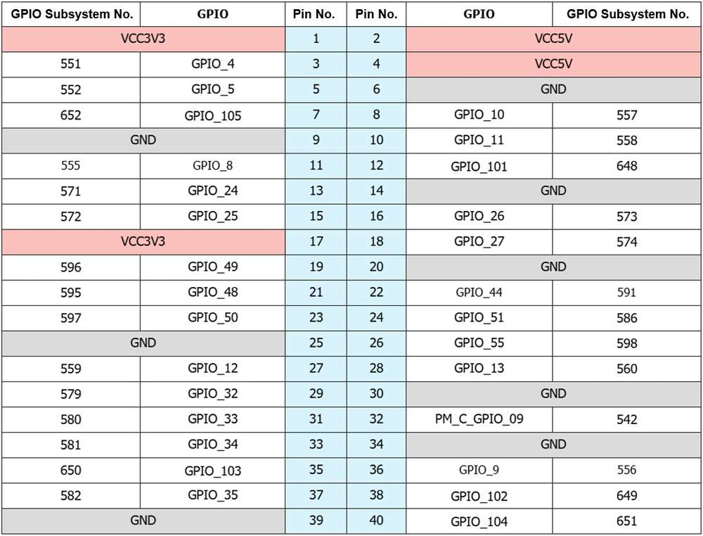
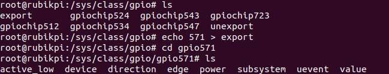
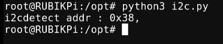
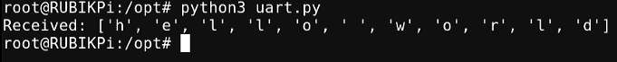

---
# Display h2 to h5 headings
toc_min_heading_level: 2
toc_max_heading_level: 4
---

import Tabs from '@theme/Tabs';
import TabItem from '@theme/TabItem';

# 40-pin LS connector

## GPIO

RUBIK Pi 3 is compatible with WiringRP (based on the high-performance GPIO programming library WiringPi). It is recommended to use WiringRP for controlling and programming General-Purpose Inputs/Outputs (GPIOs). For more details about WiringRP, visit https://github.com/rubikpi-ai/WiringRP.

### Pinout

The figure below shows the default functions of the RUBIK Pi 3 40-pin LS connector, most of which are compatible with the default functions of the 40-pin connector of open-source development boards.


The following table lists all the functions of the 40-pin LS connector, where the default ones are bolded in blue.


### Use GPIOs

On RUBIK Pi 3, you can use shell commands or programming languages to control the General-Purpose Input/Output (GPIO).

<Tabs>
    <TabItem value="GPIO Shell" label="Shell command">
    Perform the following steps on your RUBIK Pi 3 to control GPIOs.
    
    :::note
    The following commands require the root privilege:

    * Use the `sudo -i` command to switch to the root user.

    * For regular users, run commands with the `sudo` prefix, such as `sudo gpio readall` and enter the user's login password as prompted.
    :::

    * Using WiringRP commands:

         Before using the WiringRP commands, install the WiringRP as follows:

   1. Add the RUBIK Pi public personal package archive (PPA) to your RUBIK Pi 3 Ubuntu software sources. 
       
        ```shell
        sudo sed -i '$a deb http://apt.thundercomm.com/rubik-pi-3/noble ppa main' /etc/apt/sources.list
        sudo apt update
        ```
   2. Run the following command to install WiringRP.
        
        ```shell
        sudo apt install wiringrp
        ```

         Use the following commands to operate GPIOs after installation：

    * View the GPIO status

        ```shell
        gpio readall
        ```

         

   *  Set the GPIO mode

        ```shell
        gpio mode 15 in             # Set pin 15 to input mode
        gpio pins                   # Check the mode
        gpio mode 15 out            # Set pin 15 to output mode
        gpio pins                   # Check the mode
        ```

    *  Set the pin level

        ```shell
        gpio write 15 1             # Set pin 15 to high level
        gpio read 15                # Check the pin level
        gpio write 15 0             # Set pin 15 to low level
        gpio read 15                # Check the pin level
        ```

    * Operate nodes under */sys/class/gpio*:
  
         The table below shows the GPIO subsystem numbering.

        

        1. Go to the */sys/class/gpio* directory:

             ```
             cd /sys/class/gpio
             ```

        2. Export the GPIO to be controlled. For example, pin 13 GPIO_24:
             ```
             echo 571 > export
             ```

        3. Go to the gpio571 directory to set GPIO attributes:

             ```
             cd gpio571
             ls
             ```
             

        - direction:
            - input: in
            - output: out
  
        - value:
            - Low level: 0
            - High level: 1
  
        - edge (interrupt edge):
            - Rising edge trigger: rising
            - Falling edge trigger: falling
            - Both-edge trigger: both
            - Disabling interrupts: none

        4. For example, set pin 13 to output a high level:

        ```
        echo out > direction
        echo 1 > value
        ```
        5. Cancel the export of pin 13 to user space:

        ```
        echo 571 > unexport
        ```

    </TabItem>
    <TabItem value="GPIO WiringRP-c" label="WiringRP">
       The WiringRP library provides a set of API functions that enable control with minimal logic.

        To install the WiringRP library on the RUBIK Pi 3, follow these steps:

        1. Add the RUBIK Pi public personal package archive (PPA) to your RUBIK Pi 3 Ubuntu software sources.
        ```shell
        sudo sed -i '$a deb http://apt.thundercomm.com/rubik-pi-3/noble ppa main' /etc/apt/sources.list
        sudo apt update
        ```
        2. Run the following command to install WiringRP.
        ```shell
        sudo apt install wiringrp
        ```

        The following code snippet is an example that sets pin 13 as output, pin 15 as input, and loops to check the level status of pin 15.

        ```c
        #include <stdio.h>
        #include <wiringPi.h>

        int main (void)
        {
          wiringPiSetup () ;
          pinMode (13, OUTPUT) ;
          pinMode (15, INPUT) ;

          for (;;)
          {
            digitalWrite (13, HIGH) ;        // On
            printf("%d\n", digitalRead (15));        // On
            delay (1000) ;                // mS
            digitalWrite (13, LOW) ;        // Off
            printf("%d\n", digitalRead (15));        // On
            delay (1900) ;
          }

          return 0 ;
        }

        ```
        - Compile on RUBIK Pi 3

          ```shell
          gcc gpio.c -o gpio -lwiringPi
          ```

          :::note
          If the `gcc` command is not available, run `apt install gcc` to install the gcc compiler.
          :::
        Short pin 13 and pin 15 with a Dupont wire, as shown in the following figure, to test the GPIO level control and read the level.
        :::warning
        Pay attention to the pin order. Do not short the power and ground pins, as this may cause damage to the board.
        :::

        

          Run the following command:

        ```shell
        ./gpio
        ```

        The program execution result is as follows:

        


    </TabItem>
    <TabItem value="GPIO WiringRP-python" label="WiringRP-Python">
        The WiringRP-Python library provides a set of API functions that enable control with minimal logic.

        To install the WiringRP-Python on the RUBIK Pi 3, follow these steps:

        1. Add the RUBIK Pi public personal package archive (PPA) to your RUBIK Pi 3 Ubuntu software sources.
        ```shell
        sudo sed -i '$a deb http://apt.thundercomm.com/rubik-pi-3/noble ppa main' /etc/apt/sources.list
        sudo apt update
        ```
        2. Run the following command to install WiringRP-Python.
        ```shell
        sudo apt install wiringrp-python
        ```

        The following code snippet is an example that sets pin 13 as output, pin 15 as input, and loops to check the level status of pin 15.

        ```python
        import wiringpi
        import time

        wiringpi.wiringPiSetup()
        wiringpi.pinMode(13, 1)
        wiringpi.pinMode(15, 0)
        wiringpi.digitalRead(15)

        while True:
            wiringpi.digitalWrite(13,1)
            pin_level = wiringpi.digitalRead(15)
            print(f"in_gpio level: {pin_level}")

            time.sleep(1)

            wiringpi.digitalWrite(13,0)
            pin_level = wiringpi.digitalRead(15)
            print(f"in_gpio level: {pin_level}")

            time.sleep(1)
        ```

        Short pin 13 and pin 15 with a Dupont wire, as shown in the following figure, to test the GPIO level control and read the level.

        :::warning
        Pay attention to the pin order. Shorting the power and ground pins may cause damage to the board.
        :::

        

        Run the following command on your RUBIK Pi 3:

        ```shell
        python3 gpio.py
        ```

        The program execution result is as follows:

        


    </TabItem>
    <TabItem value="GPIO C" label="C">
        The following code snippet is an example that sets pin 13 as output, pin 15 as input, and loops to check the level status of pin 15.
        ```c
        #include <stdio.h>
        #include <stdlib.h>
        #include <unistd.h>

        int out_gpio = 571;
        int in_gpio = 572;

        int main() {
            char export_path[50] = {};
            char export_command[100] = {};
            snprintf(export_path, sizeof(export_path), "/sys/class/gpio/export");
            snprintf(export_command, sizeof(export_command), "echo %d > %s ", out_gpio, export_path);
            system(export_command);
            snprintf(export_command, sizeof(export_command), "echo %d > %s ", in_gpio, export_path);
            system(export_command);

            char direction_path[50] = {};
            snprintf(direction_path, sizeof(direction_path), "/sys/class/gpio/gpio%d/direction", out_gpio);
            FILE *direction_file = fopen(direction_path, "w");
            if (direction_file == NULL) {
                perror("Failed to open GPIO direction file");
                return -1;
            }
            fprintf(direction_file, "out");
            fclose(direction_file);

            snprintf(direction_path, sizeof(direction_path), "/sys/class/gpio/gpio%d/direction", in_gpio);
            direction_file = fopen(direction_path, "w");
            if (direction_file == NULL) {
                perror("Failed to open GPIO direction file");
                return -1;
            }
            fprintf(direction_file, "in");
            fclose(direction_file);

            char value_in_path[50] = {};
            char value_out_path[50] = {};
            char cat_command[100] = {};
            snprintf(value_out_path, sizeof(value_out_path), "/sys/class/gpio/gpio%d/value", out_gpio);
            snprintf(value_in_path, sizeof(value_in_path), "/sys/class/gpio/gpio%d/value", in_gpio);
            snprintf(cat_command, sizeof(cat_command), "cat %s", value_in_path);

            FILE *value_out_file = fopen(value_out_path, "w");
            if (value_out_file == NULL) {
                perror("Failed to open GPIO value file");
                return -1;
            }

            for (int i = 0; i < 5; i++) {
                fprintf(value_out_file, "1");
                fflush(value_out_file);

                system(cat_command);
                sleep(1);

                fprintf(value_out_file, "0");
                fflush(value_out_file);

                system(cat_command);
                sleep(1);
            }

            fclose(value_out_file);

            char unexport_path[50] = {};
            char unexport_command[100] = {};
            snprintf(unexport_path, sizeof(unexport_path), "/sys/class/gpio/unexport");
            snprintf(unexport_command, sizeof(unexport_command), "echo %d > %s ", out_gpio, unexport_path);
            system(unexport_command);
            snprintf(unexport_command, sizeof(unexport_command), "echo %d > %s ", in_gpio, unexport_path);
            system(unexport_command);

            return 0;
        }

        ```
        Compile on RUBIK Pi 3


        ```shell
        gcc gpio.c -o gpio
        ```
        :::note
        If the `gcc` command is not available, run `apt install gcc` to install the gcc compiler.
        :::

        Short pin 13 and pin 15 with a Dupont wire, as shown in the following figure, to test the GPIO level control and read the level.

        :::warning
        Pay attention to the pin order. Do not short the power and ground pins, as this may cause damage to the board.
        :::

        

        Run the following command:

        ```shell
        ./gpio
        ```

        The program execution result is as follows:

        

    </TabItem>
    <TabItem value="GPIO python" label="Python">
        GPIOs can be controlled by using python-periphery. Run the following command to install python-periphery on RUBIK Pi 3:

        The following code snippet is an example that sets pin 13 as output, pin 15 as input, and loops to check the level status of pin 15.
        ```python
        from periphery import GPIO
        import time

        out_gpio = GPIO(571, "out")
        in_gpio = GPIO(572, "in")

        try:
            while True:
                try:
                    out_gpio.write(True)
                    pin_level = in_gpio.read()
                    print(f"in_gpio level: {pin_level}")

                    out_gpio.write(False)
                    pin_level = in_gpio.read()
                    print(f"in_gpio level: {pin_level}")

                    time.sleep(1)

                except KeyboardInterrupt:
                    out_gpio.write(False)
                    break

        except IOError:
            print("Error")

        finally:
            out_gpio.close()
            in_gpio.close()
        ```
        Short pin 13 and pin 15 with a Dupont wire, as shown in the following figure, to test the GPIO level control and read the level.

        :::warning
        
        Pay attention to the pin order. Do not short the power and ground pins, as this may cause damage to the board.
        :::

        

        Run the following command:

        ```shell
        python3 gpio.py
         ```
        
        The program execution result is as follows:

        
    </TabItem>
</Tabs>


## I2C

Inter-Integrated circuit (I2C) is a bidirectional 2-wire bus for an efficient inter‑IC control bus developed by Philips in the 1980s. Every device on the bus has its own unique address (registered with the I2C general body headed by Philips). The I2C core supports multicontroller mode, 10‑bit target addressing, and 10‑bit extendable addressing. For more information on I2C, see https://www.i2c-bus.org/fileadmin/ftp/i2c_bus_specification_1995.pdf.


RUBIK Pi 3 is compatible with WiringRP (based on the high-performance GPIO programming library WiringPi). It is recommended to use WiringRP for controlling and programming I2C. For more details about WiringRP, visit https://github.com/rubikpi-ai/WiringRP.

### Pinout

The figure below shows the default functions of the RUBIK Pi 3 40-pin LS connector, most of which are compatible with the default functions of the 40-pin connector of open-source development boards.


:::note
Pin 3 and pin 5 are set to I2C1 by default.
:::

The following table lists all functions of the 40-pin LS connector, where the default ones are bolded in blue.


### Use I2C

On RUBIK Pi 3, you can use shell commands or programming languages to control the I2C bus.

<Tabs>
    <TabItem value="I2C Shell" label="Shell command">
        Perform the following steps on RUBIK Pi 3 to control the I2C bus.
        To install the WiringRP library on your RUBIK Pi 3, follow these steps:

        1. Add the RUBIK Pi public personal package archive (PPA) to your RUBIK Pi 3 Ubuntu software sources.
        ```shell
        sudo sed -i '$a deb http://apt.thundercomm.com/rubik-pi-3/noble ppa main' /etc/apt/sources.list
        sudo apt update
        ```
        2. To install the WiringRP library on the RUBIK Pi 3, follow these steps:
        ```shell
        sudo apt install wiringrp

        * Use the WiringRP related command:

            ```shell
            ./gpio -x ads1115:100:10 aread 100     #Read the analog signal value of the ADS1115 device via the I2C bus.
            ```
        * Use the i2cdetect tool

            *  View devices connected to the I2C1 interface:

               ```shell
               i2cdetect -a -y -r 1
               ```

            * Read all registers of the device whose address is 0x38:

              ```shell
              i2cdump -f -y 1 0x38
              ```

            * Write 0xaa to register 0x01 of the device whose address is 0x38:

              ```shell
              i2cset -f -y 1 0x38 0x01 0xaa
              ```

            * Read the value at register 0x01 of the device whose address is 0x38:

              ```shell
              i2cget -f -y 1 0x38 0x01
              ```

        :::note
        If commands like `i2cdetect` are not available, run `apt install i2c-tools` to install the i2c-tools package.
        :::
    </TabItem>

     <TabItem value="I2C WiringRP-c" label="WiringRP">
        The WiringRP library provides a set of API functions that enable control with minimal logic.

        To install the WiringRP library on your RUBIK Pi 3, follow these steps:

        1. Add the RUBIK Pi public personal package archive (PPA) to your RUBIK Pi 3 Ubuntu software sources.
        ```shell
        sudo sed -i '$a deb http://apt.thundercomm.com/rubik-pi-3/noble ppa main' /etc/apt/sources.list
        sudo apt update
        ```
        2. Run the following command to install WiringRP.
        ```shell
        sudo apt install wiringrp
        ```

        The following code snippet uses the I2C1 bus to communicate with a device whose address is 0x38: write 0xaa to the 0x01 address of the device.

        ```c
        #include <wiringPi.h>
        #include <wiringPiI2C.h>
        #include <stdio.h>
        #include <stdlib.h>
        #include <unistd.h>

        #define I2C_ADDRESS 0x38

        int main(void)
        {
            int fd;

            if (wiringPiSetup() == -1) {
                exit(1);
            }

            fd = wiringPiI2CSetup(1, I2C_ADDRESS);
            if (fd == -1) {
                exit(1);
            }

            unsigned char data[2];
            if (read(fd, data, 2) != 2) {
                exit(1);
            }

            wiringPiI2CWriteReg8(fd, 0x01, 0xaa) ;

            close(fd);
            return 0;
        }
        ```
        Compile on RUBIK Pi 3:

        ```shell
        gcc i2c.c -o i2c -lwiringPi
        ```

        :::note
        If the `gcc` command is not available, run `apt install gcc` to install the gcc compiler.
        :::

        Connect pin 3 and pin 5 to the I2C sensor and test the I2C communication as shown in the following figure.

        :::warning
        Pay attention to the pin order. Do not short the power and ground pins, as this may cause damage to the board.
        :::

        

        Run the following command:

        ```shell
        ./i2c
        ```
    </TabItem>

    <TabItem value="I2C WiringRP-python" label="WiringRP-Python">
        The WiringRP library provides a set of API functions that enable control with minimal logic.

        To install WiringRP-Python on your RUBIK Pi 3, follow these steps:

        1. Add the RUBIK Pi public personal package archive (PPA) to your RUBIK Pi 3 Ubuntu software sources.
        ```shell
        sudo sed -i '$a deb http://apt.thundercomm.com/rubik-pi-3/noble ppa main' /etc/apt/sources.list
        sudo apt update
        ```
        2. Run thw following command to install WiringRP-Python.
        ```shell
        sudo apt install wiringrp-python
        ```

        The following code snippet uses the I2C1 bus to communicate with a device whose address is 0x38: write 0xaa to the 0x01 address of the device.
        ```python
        import wiringpi as wpi

        wpi.wiringPiSetup()
        fd=wpi.wiringPiI2CSetup(0x38, 1)
        wpi.wiringPiI2CWriteReg8 (fd, 0x01, 0xaa)
        ```

        Connect pin 3 and pin 5 to the I2C sensor and test the I2C communication as shown in the following figure.

        :::warning
        Pay attention to the pin order. Do not short the power and ground pins, as this may cause damage to the board.
        :::

        

        Run the following command:
        
        ```shell
        python3 i2c.py
        ```
    </TabItem>

    <TabItem value="I2C C" label="C">
        The following code snippet uses the I2C1 bus to communicate with a device whose address is 0x38: write 0xaa to the 0x01 address of the device.
        ```c
        #include <stdio.h>
        #include <stdlib.h>
        #include <stdint.h>
        #include <fcntl.h>
        #include <unistd.h>
        #include <linux/i2c-dev.h>
        #include <sys/ioctl.h>

        #define I2C_DEVICE_PATH "/dev/i2c-1"

        int main() {
            uint8_t data[2] = {0x01,0xaa};

            const char *i2c_device = I2C_DEVICE_PATH;
            int i2c_file;

            if ((i2c_file = open(i2c_device, O_RDWR)) < 0) {
                perror("Failed to open I2C device");
                return -1;
            }

            ioctl(i2c_file, I2C_TENBIT, 0);
            ioctl(i2c_file, I2C_RETRIES, 5);
            printf("i2cdetect addr : ");
            for (int x = 0; x < 0x7f; x++)
            {
                if (ioctl(i2c_file, I2C_SLAVE, x) < 0) {
                    perror("Failed to set I2C slave address");
                    close(i2c_file);
                    return -1;
                }

                if (write(i2c_file, data, 2) == 2)
                {
                    printf("0x%x,", x);
                }
            }

            close(i2c_file);
            printf("\r\n");

            return 0;
        }
        ```

        Compile on RUBIK Pi 3:

        ```shell
        gcc i2c.c -o i2c
        ```

        :::note
        If the `gcc` command is not available, run `apt install gcc` to install the gcc compiler.
        :::


        Connect pin 3 and pin 5 to the I2C sensor to test the I2C bus communication, as shown in the following figure.

        :::warning
        Pay attention to the pin order. Do not short the power and ground pins, as this may cause damage to the board.
        :::

        

        Run the following command:

        ```shell
        ./i2c
        ```

          The program execution result is as follows:

        
    </TabItem>

    <TabItem value="I2C python" label="Python">
        I2C can be controlled by using the Python smbus library. Run the following command on RUBIK Pi 3 to install the library.

        ```shell
        apt install python3-smbus
        ```
        The following code snippet uses the I2C1 bus to communicate with a device whose address is 0x38: write 0xaa to the 0x01 address of the device.

        ```python
        import smbus

        def main():
            data = [0x01, 0xaa]

            try:
                i2c_bus = smbus.SMBus(1)

                print("i2cdetect addr : ", end="")
                for address in range(0x7F):
                    try:
                        i2c_bus.write_i2c_block_data(address, 0, data)
                        print("0x{:02X},".format(address), end="")
                    except OSError:
                        pass

                print()

            except Exception as e:
                print(f"An error occurred: {e}")

            finally:
                if i2c_bus:
                    i2c_bus.close()

        if __name__ == "__main__":
            main()

        ```

        Connect pin 3 and pin 5 to the I2C sensor and test the I2C communication as shown in the following figure.
        :::warning
        Pay attention to the pin order. Do not short the power and ground pins, as this may cause damage to the board.
        :::

        

        Run the following command:

        ```shell
        python3 i2c.py
        ```

        The execution result is as follows:

         

    </TabItem>
</Tabs>

## SPI

Serial Peripheral Interface (SPI) is a synchronous serial data link that operates in full-duplex mode. SPI is also known as a 4-wire serial bus.

RUBIK Pi 3 is compatible with WiringRP (based on the high-performance GPIO programming library WiringPi). It is recommended to use WiringRP for controlling and programming SPI. For more details about WiringRP, visit https://github.com/rubikpi-ai/WiringRP.

### Pinout

The figure below shows the default functions of the RUBIK Pi 3 40-pin LS connector, most of which are compatible with the default functions of the 40-pin connector of open-source development boards.


:::note
 Pins 19, 21, 23, and 24 are set to SPI by default.
:::

The following table lists all functions of the 40-pin LS connector, where the default ones are bolded in blue.


### Use SPI

<Tabs>
    <TabItem value="SPI WiringRP-c" label="WiringRP">
        The WiringRP library provides a set of API functions that enable control with minimal logic.

        To install WiringRP on your RUBIK Pi 3, follow these steps:

        1. Add the RUBIK Pi public personal package archive (PPA) to your RUBIK Pi 3 Ubuntu software sources.
        ```shell
        sudo sed -i '$a deb http://apt.thundercomm.com/rubik-pi-3/noble ppa main' /etc/apt/sources.list
        sudo apt update
        ```
        2. Run the following command to install WiringRP.
        ```shell
        sudo apt install wiringrp
        ```
        The following code snippet uses the SPI bus to send and receive data.
        ```c
        #include <wiringPi.h>
        #include <wiringPiSPI.h>
        #include <stdio.h>
        #include <stdlib.h>

        int main(void)
        {
            int fd;
            unsigned char send_data[64] =  "hello world!";
            unsigned char read_data[64];

            if(wiringPiSetup() == -1)
                exit(1);

            fd = wiringPiSPISetup(0, 1000000);
            if(fd < 0)
                exit(2);

                printf("\rtx_buffer: \n %s\n ", send_data);
            // Send and receive data
            if(wiringPiSPIDataRW(0, send_data, sizeof(send_data)) < 0)
                exit(3);
                printf("\rtx_buffer: \n %s\n ", send_data);


            return 0;
        }
        ```

        Compile programs

        Compile on RUBIK Pi 3

        ```shell
        gcc spi.c -o spi -lwiringPi
        ```

        :::note
        If the `gcc` command is not available, run `apt install gcc` to install the gcc compiler.
        :::

        Short pin 19 and pin 21 with a Dupont wire to test the SPI bus communication, as shown in the following figure:

        :::warning

         Pay attention to the pin order. Do not short the power and ground pins, as this may cause damage to the board.
        :::

        

        Run the following command:

        ```shell
        ./spi
        ```

        The execution result is as follows:

        
    </TabItem>

    <TabItem value="SPI WiringRP-python" label="WiringRP-Python">
        The WiringRP library provides a set of API functions that enable control with minimal logic.

        To install WiringRP-Python on your RUBIK Pi 3, follow these steps:

        1. Add the RUBIK Pi public personal package archive (PPA) to your RUBIK Pi 3 Ubuntu software sources.
        ```shell
        sudo sed -i '$a deb http://apt.thundercomm.com/rubik-pi-3/noble ppa main' /etc/apt/sources.list
        sudo apt update
        ```
        2. Run the following command to install WiringRP-Python.
        ```shell
        sudo apt install wiringrp-python
        ```
        The following code snippet uses the SPI bus to send and receive data:

        ```python
        import wiringpi as wpi

        wpi.wiringPiSetup()

        wpi.wiringPiSPISetup(0, 8000000)

        tx_buffer = bytes([72, 101, 108, 108, 111])
        print("tx_buffer:\n\r ", tx_buffer)
        retlen, rx_buffer = wpi.wiringPiSPIDataRW(0, tx_buffer)
        print("rx_buffer:\n\r ", rx_buffer)
        ```

        Short pin 19 and pin 21 with a Dupont wire to test the SPI bus communication, as shown in the following figure:

        :::warning
        Pay attention to the pin order. Do not short the power and ground pins, as this may cause damage to the board.
        :::

        

        Run the following command:

        ```shell
         python3 spi.py
        ```

          The execution result is as follows:

        
    </TabItem>

    <TabItem value="SPI C" label="C">
    The following code snippet uses the SPI bus to send and receive data.
    ```c
    #include <stdio.h>
    #include <stdlib.h>
    #include <stdint.h>
    #include <fcntl.h>
    #include <unistd.h>
    #include <linux/spi/spidev.h>
    #include <sys/ioctl.h>

    #define SPI_DEVICE_PATH "/dev/spidev12.0"

    int main() {
        int spi_file;
        uint8_t tx_buffer[50] = "hello world!";
        uint8_t rx_buffer[50];

        // Open the SPI device
        if ((spi_file = open(SPI_DEVICE_PATH, O_RDWR)) < 0) {
            perror("Failed to open SPI device");
            return -1;
        }

        // Configure SPI mode and bits per word
        uint8_t mode = SPI_MODE_0;
        uint8_t bits = 8;

        if (ioctl(spi_file, SPI_IOC_WR_MODE, &mode) < 0) {
            perror("Failed to set SPI mode");
            close(spi_file);
            return -1;
        }
        if (ioctl(spi_file, SPI_IOC_WR_BITS_PER_WORD, &bits) < 0) {
            perror("Failed to set SPI bits per word");
            close(spi_file);
            return -1;
        }

        // Perform SPI transfer
        struct spi_ioc_transfer transfer = {
            .tx_buf = (unsigned long)tx_buffer,
            .rx_buf = (unsigned long)rx_buffer,
            .len = sizeof(tx_buffer),
            .delay_usecs = 0,
            .speed_hz = 1000000,  // SPI speed in Hz
            .bits_per_word = 8,
        };

        if (ioctl(spi_file, SPI_IOC_MESSAGE(1), &transfer) < 0) {
            perror("Failed to perform SPI transfer");
            close(spi_file);
            return -1;
        }

         /* Print tx_buffer and rx_buffer*/
        printf("\rtx_buffer: \n %s\n ", tx_buffer);
        printf("\rrx_buffer: \n %s\n ", rx_buffer);

        // Close the SPI device
        close(spi_file);

        return 0;
    }
  ```

    Compile on RUBIK Pi 3

    ```c
    gcc spi.c -o spi
    ```

    :::note
    If the `gcc` command is not available, run `apt install gcc` to install the gcc compiler.
    :::

    Short pin 19 and pin 21 with a Dupont wire to test the SPI bus communication, as shown in the following figure.

    :::warning
    Pay attention to the pin order. Do not short the power and ground pins, as this may cause damage to the board.
    :::

    

    Run the following command:

    ```shell
    ./spi
    ```

     The program execution result is as follows:

   
    </TabItem>

    <TabItem value="SPI python" label="Python">
        SPI communication can be implemented by using the spidev library for Python. Run the following command to install spidev on RUBIK Pi 3.
        ```shell
        apt install python3-spidev
        ```
        The following code snippet uses the SPI bus to send and receive data.

        ```python
        import spidev

        def main():
            tx_buffer = [ord(char) for char in "hello world!"]
            rx_buffer = [0] * len(tx_buffer)

            try:
                spi = spidev.SpiDev()
                spi.open(12, 0)
                spi.max_speed_hz = 1000000

                rx_buffer = spi.xfer2(tx_buffer[:])
                print("tx_buffer:\n\r", ''.join(map(chr, tx_buffer)))
                print("rx_buffer:\n\r", ''.join(map(chr, rx_buffer)))

            except Exception as e:
                print(f"An error occurred: {e}")

            finally:
                if spi:
                    spi.close()

        if __name__ == "__main__":
            main()
        ```


        Short pin 19 and pin 21 with a Dupont wire to test the SPI bus communication, as shown in the following figure.

        :::warning
        Pay attention to the pin order. Do not short the power and ground pins, as this may cause damage to the board.
        :::

        

        Run the following command on your RUBIK Pi 3:

        ```shell
         python3 spi.py
        ```

          The program execution result is as follows:

        
    </TabItem>
</Tabs>


## UART
<a id="UART"></a>

RUBIK Pi 3 is compatible with WiringRP (based on the high-performance GPIO programming library WiringPi). It is recommended to use WiringRP for controlling and programming UART. For more details about WiringRP, visit https://github.com/rubikpi-ai/WiringRP.

### Pinout

The figure below shows the default functions of the RUBIK Pi 3 40-pin LS connector, most of which are compatible with the default functions of the 40-pin connector of open-source development boards.


:::note

Pins 8 and 10 have been set to UART by default. The device node is */dev/ttyHS2*.
:::

The following table lists all functions of the 40-pin LS connector, where the default ones are bolded in blue.


### Use UART

<Tabs>
    <TabItem value="UART Shell" label="Shell command">
       Run the following commands on RUBIK Pi 3 to control UART communication.

        Use the stty tool to configure UART. Run the following commands to set both the input rate and output rate of UART to 115200 and disable the echo.

        ```shell
        stty -F /dev/ttyHS2 ispeed 115200 ospeed 115200
        stty -F /dev/ttyHS2 -echo
        ```

        Enable two terminals on RUBIK Pi 3, short pin 8 and pin 10 with a Dupont wire, and run the following commands. The content sent by the transmitter will be displayed on the receiver.

        :::warning
        Pay attention to the pin order. Do not short the power and ground pins, as this may cause damage to the board.
        :::

        ```shell
        echo "hello world!" > /dev/ttyHS2  # Transmitter
        cat /dev/ttyHS2 # Receiver
        ```

        

    </TabItem>

    <TabItem value="UART WiringRP-c" label="WiringRP">
        The WiringRP library provides a set of API functions that enable control with minimal logic.

        To install WiringRP on your RUBIK Pi 3, follow these steps：

        1. Add the RUBIK Pi public personal package archive (PPA) to your RUBIK Pi 3 Ubuntu software sources.
        ```shell
        sudo sed -i '$a deb http://apt.thundercomm.com/rubik-pi-3/noble ppa main' /etc/apt/sources.list
        sudo apt update
        ```
        2. Run the following command to install WiringRP.
        ```shell
        sudo apt install wiringrp
        ```

        The following code snippet uses UART to send and receive data:

        ```c
        #include <stdio.h>
        #include <string.h>
        #include <errno.h>

        #include <wiringPi.h>
        #include <wiringSerial.h>

        int main ()
        {
          int fd ;
          int count ;
          unsigned int nextTime ;

          if ((fd = serialOpen ("/dev/ttyHS2", 115200)) < 0)
          {
            fprintf (stderr, "Unable to open serial device: %s\n", strerror (errno)) ;
            return 1 ;
          }

          if (wiringPiSetup () == -1)
          {
            fprintf (stdout, "Unable to start wiringPi: %s\n", strerror (errno)) ;
            return 1 ;
          }


          char tx_buffer[] = "hello world!\n";
          for (count = 0 ; count < sizeof(tx_buffer) ; count++)
          {
            serialPutchar (fd, tx_buffer[count]) ;
            delay (3) ;
            printf ("%c", serialGetchar (fd)) ;
          }
          printf ("\n") ;

          return 0 ;
        }
        ```

    Compile on RUBIK Pi 3

    ```shell
    gcc uart.c -o uart -lwiringPi
    ```

     :::note
     If the `gcc` command is not available, run `apt install gcc` to install the gcc compiler.
     :::

    Short pin 8 and pin 10 with a Dupont wire and test the communication, as shown in the following figure:

    :::warning
    Pay attention to the pin order. Do not short the power and ground pins, as this may cause damage to the board.
    :::

    

    Run the following command:

    ```shell
    ./uart
    ```

    The execution result is as follows:

     

    </TabItem>

    <TabItem value="UART WiringRP-python" label="WiringRP-Python">
        The WiringRP-Python library provides a set of API functions that enable control with minimal logic.

        To install WiringRP-Python on your RUBIK Pi 3, follow these steps：

        1. Add the RUBIK Pi public personal package archive (PPA) to your RUBIK Pi 3 Ubuntu software sources.
        ```shell
        sudo sed -i '$a deb http://apt.thundercomm.com/rubik-pi-3/noble ppa main' /etc/apt/sources.list
        sudo apt update
        ```
        2. Run the following command to install WiringRP-Python.
        ```shell
        sudo apt install wiringrp-python
        ```
        The following code snippet uses UART to send and receive data.
        ```python
        import wiringpi

        serial = wiringpi.serialOpen('/dev/ttyHS2', 115200)

        wiringpi.serialPuts(serial, "hello world")

        received_data = []
        c = wiringpi.serialGetchar(serial);
        received_data.append(chr(c))

        cnt = wiringpi.serialDataAvail(serial);
        for i in range(cnt):
            c = wiringpi.serialGetchar(serial);
            received_data.append(chr(c))

        print("Received:", received_data)

        wiringpi.serialClose(serial)
        ```

        Short pin 8 and pin 10 with a Dupont wire to test UART communication, as shown in the following figure:

        :::warning
        Pay attention to the pin order. Do not short the power and ground pins, as this may cause damage to the board.
        :::

        

        Run the following command:

        ```shell
        python3 uart.py
        ```

        The execution result is as follows:

        
    </TabItem>

    <TabItem value="UART C" label="C">
        - The following code snippet uses UART to send and receive data.

          ```c
          #include <stdio.h>
          #include <stdlib.h>
          #include <string.h>
          #include <fcntl.h>
          #include <termios.h>
          #include <unistd.h>

          int main() {
              int serial_port_num = 2;
              char serial_port[15];

              sprintf(serial_port,"/dev/ttyHS%d",serial_port_num);
              int serial_fd;

              serial_fd = open(serial_port, O_RDWR | O_NOCTTY);
              if (serial_fd == -1) {
                  perror("Failed to open serial port");
                  return 1;
              }

              struct termios tty;
              memset(&tty, 0, sizeof(tty));

              if (tcgetattr(serial_fd, &tty) != 0) {
                  perror("Error from tcgetattr");
                  return 1;
              }

              cfsetospeed(&tty, B9600);
              cfsetispeed(&tty, B9600);

              tty.c_cflag &= ~PARENB;
              tty.c_cflag &= ~CSTOPB;
              tty.c_cflag &= ~CSIZE;
              tty.c_cflag |= CS8;

              if (tcsetattr(serial_fd, TCSANOW, &tty) != 0) {
                  perror("Error from tcsetattr");
                  return 1;
              }

              char tx_buffer[] = "hello world!\n";
              ssize_t bytes_written = write(serial_fd, tx_buffer, sizeof(tx_buffer));

              if (bytes_written < 0) {
                  perror("Error writing to serial port");
                  close(serial_fd);
                  return 1;
              }
              printf("\rtx_buffer: \n %s ", tx_buffer);

              char rx_buffer[256];
              int bytes_read = read(serial_fd, rx_buffer, sizeof(rx_buffer));
              if (bytes_read > 0) {
                  rx_buffer[bytes_read] = '\0';
                  printf("\rrx_buffer: \n %s ", rx_buffer);
              } else {
                  printf("No data received.\n");
              }

              close(serial_fd);

              return 0;
            }

            ```

            Compile on RUBIK Pi 3

            ```shell
            gcc uart.c -o uart
            ```

            :::note
            If the `gcc` command is not available, run `apt install gcc` to install the gcc compiler.
            :::

            Short pin 8 and pin 10 with a Dupont wire to test UART communication, as shown in the following figure:

            :::warning
            Pay attention to the pin order. Do not short the power and ground pins, as this may cause damage to the board.
            :::

            

            Run the following command:

            ```shell
            ./uart
            ```

            The execution result is as follows:

            
    </TabItem>

    <TabItem value="UART python" label="Python">
        UART communication can be implemented by using the serial library for Python. Run the following command to install the serial library on RUBIK Pi 3.

        ```shell
        apt install python3-serial
        ```

        The following code snippet uses UART to send and receive data.

        ```python
        import serial
        import time

        with serial.Serial(
            "/dev/ttyHS2",
            baudrate=115200,
            bytesize=serial.EIGHTBITS,
            stopbits=serial.STOPBITS_ONE,
            parity=serial.PARITY_NONE,
            timeout=1,

        ) as uart3:
            uart3.write(b"Hello World!\n")
            buf = uart3.read(128)
            print("Raw data:\n", buf)
            data_strings = buf.decode("utf-8")
            print("Read {:d} bytes, printed as string:\n {:s}".format(len(buf), data_strings))
        ```

        Transfer *uart.py* to RUBIK Pi 3. For example, use the ADB method. The command is as follows:

        ```shell
        adb push uart.py /opt
        ```

        Short pin 8 and pin 10 with a Dupont wire to test UART communication, as shown in the following figure:

        :::warning
        Pay attention to the pin order. Do not short the power and ground pins, as this may cause damage to the board.
        :::

        

        Run the following command:

        ```shell
        python3 uart.py
        ```

          The execution result is as follows:

        
    </TabItem>
</Tabs>
