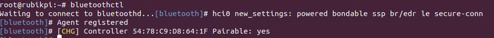
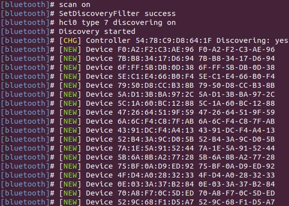
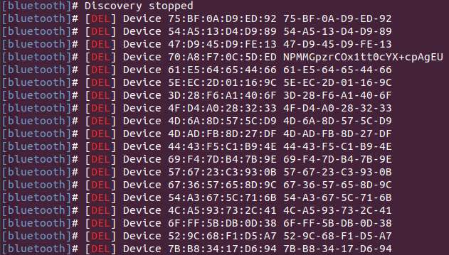
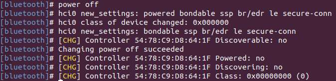

import Tabs from '@theme/Tabs';
import TabItem from '@theme/TabItem';


# Wi-Fi and Bluetooth

## Wi-Fi

Wi-Fi is a wireless networking technology that uses the IEEE 802.11 protocol. It allows electronic devices like smartphones, wearables, laptops, desktops, and other consumer electronics to connect to the Internet without physical cables.


### Operating bands

The AP6256 Wi-Fi chipset supports 2.4 GHz and 5 GHz operating bands.

### Operating modes

The Wi-Fi software operates in the following modes.

| Mode          | Description |
|---------------|-------------|
| STA mode      | In STA mode, a device connects to an AP within a Wi-Fi network and communicates with other devices in the network. This mode is standard for wireless devices in a Wi-Fi connection. |
| Hotspot mode  | The hotspot mode enables a device to provide backhaul (Internet) connectivity to Wi-Fi clients using a cellular link (LTE). The device establishes this connection through its lightweight hotspot interface. In hotspot mode, the device can communicate with other Wi-Fi clients connected to the same hotspot, communicate with the hotspot device, and share the WAN connection of the device. |


<Tabs>
    <TabItem value="Wi-Fi STA" label="STA mode">
    In Station (STA) mode, the device can be connected to an existing Wi-Fi network to access network resources or the Internet. 

    1. Scan for nearby Wi-Fi networks using commands.

    ```shell
    nmcli dev wifi list 2>&1 | less
    ```
    

    :::note
    Type `q` to exit.
    :::
    2. Connect to a Wi-Fi network.
    ```shell
    sudo nmcli dev wifi connect <WiFi-SSID> password <WiFi-password>
    ```

    For example, run the following command.

    ```shell
    sudo nmcli dev wifi connect rubikpiwifi password 123456789
    ```

    `WiFi-SSID` is `rubikpiwifi` and `WiFi-password` is `123456789`

    Sample output:

    ```shell
    Device 'wlan0' successfully activated with 'e8b98f24-3f23-4742-8aa3-0d37c5ee6564'.
    ```

    :::note
    If you see a network error message when running the command, run one of the following commands to trigger a Wi-Fi scan and verify the target access point (AP).

    * `nmcli dev wifi list`

    * `iw dev wlan0 scan `       &#x20;
    :::
    3. Check the network status:

    ```shell
    nmcli general status
    ```

    Sample output:

    ```shell
    STATE  CONNECTIVITY  WIFI-HW  WIFI    WWAN-HW  WWAN
    connected  full     enabled  enabled  enabled  enabled
    ```
    4. To verify the network status, run the following command:
        1. Run the following command to check the device status.

        ```shell
        nmcli dev status
        ```

        Sample output:

        ```
        DEVICE  TYPE      STATE        CONNECTION
        wlan0   wifi      connected    RUbikpiWiFi
        eth0    ethernet  unavailable  --
        eth1    ethernet  unavailable  --
        can0    can       unmanaged    --
        lo      loopback  unmanaged    --
        ```
        2. Check the additional connection information.

        ```
        nmcli device show wlan0
        ```

        Sample output:

        ```
        GENERAL.DEVICE:                         wlan0
        GENERAL.TYPE:                           wifi
        GENERAL.HWADDR:                         00:03:7F:12:F7:F7
        GENERAL.MTU:                            1500
        GENERAL.STATE:                          100 (connected)
        GENERAL.CONNECTION:                     QualcommWiFi
        GENERAL.CON-PATH:                       /org/freedesktop/NetworkManager/ActiveConnection/5
        IP4.ADDRESS[1]:                         192.168.117.130/24
        IP4.ADDRESS[2]:                         192.168.117.131/24
        IP4.GATEWAY:                            192.168.117.126
        ```
        3. Verify whether an IP address has been assigned to the wlan0 interface by running the `ifconfig wlan0` command in the UART console.

        ```
        ifconfig wlan0
        ```
        :::note
        
        Run the `sudo apt install net-tools` command to install the ifconfig command.
        :::

        4. Verify whether the AP or router is connected to the Internet by pinging the following public DNS IP address.

        ```
        ping 8.8.8.8
        ```
    :::note
     * If you have connected to a network but want to connect to another one, switch the connection off by specifying the SSID and running the command `nmcli con down  ssid/uuid`. If you have multiple connections with the same SSID, use the UUID.

    * To connect to another saved network, use the up option with the nmcli command-line tool by running the `nmcli con up ssid/uuid` command.
    :::

    :::note
    To exit the standard input shell, press **Ctrl**+**C**. 
    :::

    For more information about `nmcli`, refer to https://www.linux.org/docs/man1/nmcli.html and https://networkmanager.dev/docs/api/latest/nmcli.html.
    </TabItem>

    <TabItem value="Wi-Fi AP" label="AP mode">

   In Access Point (AP) mode, namely, the wireless hotspot mode, the device becomes a gateway for other devices to connect to a network. The steps to create an AP are as follows:

    * Enable the AP.
        * Create or modify */opt/hostapd.conf*:

          ```plain&#x20;text
          ctrl_interface=/var/run/hostapd
          driver=nl80211
          ieee80211n=1
          interface=wlan1
          hw_mode=a
          channel=36
          beacon_int=100
          dtim_period=1
          ssid=RUBIKPi
          auth_algs=1
          ap_isolate=0
          ignore_broadcast_ssid=0
          wpa=2
          wpa_key_mgmt=WPA-PSK
          rsn_pairwise=CCMP
          wpa_passphrase=123456789
          ```

        * Run the following commands to enable the AP:

          ```shell
          hostapd -B /opt/hostapd.conf # Set the software AP
          # Enable the DHCP server
          brctl addbr br0
          brctl addif br0 wlan1
          ifconfig br0 192.168.225.1 netmask 255.255.255.0 up
          killall dnsmasq
          dnsmasq --conf-file=/etc/dnsmasq.conf --dhcp-leasefile=/var/run/dnsmasq.leases --addn-hosts=/data/hosts --pid-file=/var/run/dnsmasq.pid -i br0 -I lo -z --dhcp-range=br0,192.168.225.20,192.168.225.60,255.255.255.0,43200 --dhcp-hostsfile=/data/dhcp_hosts --dhcp-option-force=6,192.168.225.1 --dhcp-script=/bin/dnsmasq_script.sh
          ```

  *  Run the following command to establish a connection with `hostapd_cli`.

    ```shell
    hostapd_cli -i wlan1 -p /var/run/hostapd
    ```

  Monitor Wi-Fi STA connection notifications in the `hostapd_cli` console, such as `AP-STA-CONNECTED` and `EAPOL-4WAY-HS-COMPLETED`.

  Sample output:
  ```shell
  root@rubikpi:~# hostapd_cli -i wlanl -p /var/run/hostapd
  hostapd_cli v2.11-devel
  Copyright (c) 2004-2022, Jouni Malinen <j@wl.fi> and contributors
  This software may be distributed under the terms of the BSD License. 
  See README for more details.

  Interactive mode
  > <3>AP-STA-CONNECTED aa: a4: fd: 8b: ec: 90
  <3>EAPOL-4WAY-HS-COMPLETED aa: a4: fd: 8b:ec:90

  > list_sta
  aa: a4: fd: 8b:ec:90
  ```
 Before the AP 5G mode is enabled, if there has never been a connection to a 5G Wi-Fi network using STA, use the following command to check the 5G channel configuration in the environment:

  ```shll
  iw dev wlan0 scan
  ```
 In the command output, identify the currently active channel through the **primary channel** field. In the following example, the value of **primary channel** is **36**. Write **36** into the **channel** field in the */opt/hostapd.conf* file.


 ```
 HT operation:
                 * primary channel: 36
                 * secondary channel offset: above
                 * STA channel width: any
                 * RIFS: 0
                 * HT protection: nonmember
                 * non-GF present: 0
                 * OBSS non-GF present: 0
                 * dual beacon: 0
                 * dual CTS protection: 0
                 * STBC beacon: 0
                 * L-SIG TXOP Prot: 0
                 * PCO active: 0
                 * PCO phase: 0
```
    * Verify AP

        To test the connection, connect to AP from other devices.

        For example, perform the following steps to connect to AP from a mobile device:

        1. On the mobile device, go to Wi-Fi settings.

        2. Wait for the Wi-Fi STA to detect AP.

        3. Select AP and type the corresponding `wpa_passphrase` configured for AP on your RUBIK Pi 3 device for connection.
   
        ```shell
        > status
        state=ENABLED
        phy=phyR freq=2412
        num_sta_non_erp=0
        num_sta_no_short_slot_time=0
        num_sta_no_short_preamble=0
        olbc=0
        num_sta_ht_no_gf=0 num_sta_no_ht=0
        num_sta_ht_20_mhz=0
        num_sta_ht40_intolerant=0
        olbc_ht=0
        ht_op_mode=0x0
        hw_mode=g
        country_code=US
        country3=0x20
        cac_time_seconds=0
        cac_time_left_seconds=N/A
        channel=1
        edmg_enable=0 edmg_channel=0
        secondary_channel=0
        ieee80211n=1
        ieee80211ac=0
        ieee80211ax=0
        ieee80211be=0
        beacon_int=100
        dtim_period=2
        ht_caps_info=000c
        ht_mcs_bitmask=ffff0000000000000000
        supported_rates-02 04 0b 16 Oc 12 18 24 30 48 60 6c
        max_txpower=30
        bss[0]=wlan1
        bssid[0]=00:03:7f:95:8e:8e
        ssid [0]=QSoftAP
        num_sta[0]=1
        > |
        ```
    To verify the connection, ping the IP address of the mobile device from the RUBIK Pi 3 device in the ssh shell.

    The following output indicates that the Wi-Fi connection has been established successfully and the data transfer has begun:

    ```shell
    sh-5.1# ping 192.168.1.42
    PING 192.168.1.42 (192.168.1.42): 56 data bytes
    64 bytes from 192.168.1.42: seq=0 ttl=64 time-11.175 ms
    64 bytes from 192.168.1.42: seq=1 ttl=64 time=14.528 ms
    64 bytes from 192.168.1.42: seq=2 ttl=64 time=29.735 ms
    64 bytes from 192.168.1.42: seq=3 ttl=64 time=223.822 ms
    64 bytes from 192.168.1.42: seq-4 ttl=64 time-23.675 ms
    ^C
    192.168.1.42 ping statistics ---
    7 packets transmitted, 5 packets received, 28% packet loss
    round-trip min/avg/max = 11.175/60.587/223.822 ms
    sh-5.1#
    ```

    Alternatively, you can verify the Wi-Fi connection status in Settings of the connected device. For example, to get the IP address of a mobile device connected to RUBIK Pi 3 AP, perform the following steps:
    
        1. Go to **Settings** > **Wi-Fi**.

        2. Verify the SSID of the AP.

    * Stop AP:

    Perform the following steps in SSH to disable AP:

  1. Stop the hostapd by performing the following steps:

       1. Stop the hostapd by performing the following steps:

          ```plain&#x20;text
          killall hostapd
          ```

       2. Run the following command to disable the interface:

          ```plain&#x20;text
          ifconfig wlan1 down
          ```

  2. Run the following command to delete `ctrl_interface`:

       ```plain&#x20;text
       rm -rf /var/run/hostapd/wlan1
       ```

    The Wi-Fi hotspot has stopped successfully.

    </TabItem>
</Tabs>


<a id="blue"></a>
## Bluetooth

The Bluetooth® wireless technology is a short-range communications system that facilitates wireless exchange of data between devices. The key advantages of Bluetooth technology are as follows:

* Replaces the cables connecting portable and fixed electronic devices.

* Provides robust, power-efficient, and cost-effective solutions.

* Facilitates flexibility of solutions and their applications.

### Open the Bluetooth test application

* To open the Bluetooth test application, run the following command. All Bluetooth configuration commands should be executed within this application.

```shell
bluetoothctl
```
Sample output


### Enable Bluetooth
* To enable Bluetooth, run the following command:
```shell
power on
```
Sample output


<a id="blue_scan"></a>

### Perform a Bluetooth scan
* To start a scan for nearby Bluetooth devices, run the following command:
```shell
scan on
```
Sample output



### Stop the Bluetooth scan
* To stop the ongoing Bluetooth scan, run the following command:

```shell
scan off
```
Sample output



### Pair with a remote Bluetooth device

Before pairing with the remote device, [perform a Bluetooth scan](#blue_scan) to ensure the remote device is available.
* To pair with the remote Bluetooth device, run the following command:
```shell
pair <bt_address>
```
To accept the active/passive pairing, enter 'yes'. To reject the active/passive pairing, enter 'no'. The parameter `bt_address` is the Bluetooth address of the remote device.

Example

  To pair with the remote device using `<bt_address> 00:25:02:02:7B:A4`, run the following command:

  ```shell
  pair 00:25:02:02:7B:A4
  ```
Sample output
```
[bluetooth] pair 00:25:02:02:7B:A4
Attempting to pair with 00:25:02:02:7B:A4
[bluetooth]# hci0 device_flags_changed: 00:25:02:02:7B:A4 (BR/EDR)
[bluetooth]#      supp: 0x00000001  curr: 0x00000000
[bluetooth]# hci0 00:25:02:02:7B:A4 type BR/EDR connected eir_len 20
[CHG] Device 00:25:02:02:7B:A4 Connected: yes
[OPPO Enco W31]# hci0 new_link_key 00:25:02:02:7B:A4 type 0x04 pin_len 0 store_hint 1
[OPPO Enco W31]# [CHG] Device 00:25:02:02:7B:A4 Bonded: yes
[OPPO Enco W31]# [CHG] Device 00:25:02:02:7B:A4 UUIDs: 00000001-0000-1000-8000-00805f9b34fb
[OPPO Enco W31]# [CHG] Device 00:25:02:02:7B:A4 UUIDs: 00001107-d102-11e1-9b23-00025b00a5a5
[OPPO Enco W31]# [CHG] Device 00:25:02:02:7B:A4 UUIDs: 0000110b-0000-1000-8000-00805f9b34fb
[OPPO Enco W31]# [CHG] Device 00:25:02:02:7B:A4 UUIDs: 0000110e-0000-1000-8000-00805f9b34fb
[OPPO Enco W31]# [CHG] Device 00:25:02:02:7B:A4 UUIDs: 0000110f-0000-1000-8000-00805f9b34fb
[OPPO Enco W31]# [CHG] Device 00:25:02:02:7B:A4 UUIDs: 0000111e-0000-1000-8000-00805f9b34fb
[OPPO Enco W31]# [CHG] Device 00:25:02:02:7B:A4 UUIDs: 00001203-0000-1000-8000-00805f9b34fb
[OPPO Enco W31]# [CHG] Device 00:25:02:02:7B:A4 ServicesResolved: yes
[OPPO Enco W31]# [CHG] Device 00:25:02:02:7B:A4 Paired: yes
[OPPO Enco W31]# Pairing successful
[OPPO Enco W31]# hci0 00:25:02:02:7B:A4 type BR/EDR disconnected with reason 2
[OPPO Enco W31]# [CHG] Device 00:25:02:02:7B:A4 ServicesResolved: no
[CHG] Device 00:25:02:02:7B:A4 Connected: no
[bluetooth]# hci0 00:25:02:02:7B:A4 type BR/EDR connected eir_len 20
[CHG] Device 00:25:02:02:7B:A4 Connected: yes
[OPPO Enco W31]# Authorize service
[agent] Authorize service 0000110d-0000-1000-8000-00805f9b34fb (yes/no): yes
[OPPO Enco W31]# Authorize service
[OPPO Enco W31]#   1;39m[agent] Authorize service 0000111f-0000-1000-8000-00805f9b34fb (yes/no): [CHG] Device 00:25:02:02:7B:A4 UUIDs: 00000001-0000-1000-8000-00805f9b34fb
[agent] Authorize service 0000111f-0000-1000-8000-00805f9b34fb (yes/no): [CHG] Device 00:25:02:02:7B:A4 UUIDs: 00001107-d102-11e1-9b23-00025b00a5a5
[agent] Authorize service 0000111f-0000-1000-8000-00805f9b34fb (yes/no): [CHG] Device 00:25:02:02:7B:A4 UUIDs: 0000110b-0000-1000-8000-00805f9b34fb
[agent] Authorize service 0000111f-0000-1000-8000-00805f9b34fb (yes/no): [CHG] Device 00:25:02:02:7B:A4 UUIDs: 0000110d-0000-1000-8000-00805f9b34fb
[agent] Authorize service 0000111f-0000-1000-8000-00805f9b34fb (yes/no): [CHG] Device 00:25:02:02:7B:A4 UUIDs: 0000110e-0000-1000-8000-00805f9b34fb
[agent] Authorize service 0000111f-0000-1000-8000-00805f9b34fb (yes/no): [CHG] Device 00:25:02:02:7B:A4 UUIDs: 0000110f-0000-1000-8000-00805f9b34fb
[agent] Authorize service 0000111f-0000-1000-8000-00805f9b34fb (yes/no): [CHG] Device 00:25:02:02:7B:A4 UUIDs: 0000111e-0000-1000-8000-00805f9b34fb
[agent] Authorize service 0000111f-0000-1000-8000-00805f9b34fb (yes/no): [CHG] Device 00:25:02:02:7B:A4 UUIDs: 00001203-0000-1000-8000-00805f9b34fb
[agent] Authorize service 0000111f-0000-1000-8000-00805f9b34fb (yes/no): [NEW] Endpoint /org/bluez/hci0/dev_00_25_02_02_7B_A4/sep1 
[agent] Authorize service 0000111f-0000-1000-8000-00805f9b34fb (yes/no): [NEW] Endpoint /org/bluez/hci0/dev_00_25_02_02_7B_A4/sep2       
[agent] Authorize service 0000111f-0000-1000-8000-00805f9b34fb (yes/no): yes
[OPPO Enco W31]#
```

### Get the list of bonded/paired devices

* To get the list of bonded/paired devices, run the following command:

```shell
devices
```

Sample output


### Connect to a remote device
* To connect to a remote device, run the following command:
```shell
connect <bt_address>
```
The `<bt_address>` parameter is the Bluetooth address of the remote device.

Example

  To connect to a paired remote device using `<bt_address> 00:25:02:02:7B:A4`, run the following command:

```shell
connect 00:25:02:02:7B:A4
```
Sample output
```
[bluetooth]# connect 00:25:02:02:7B:A4
Attempting to connect to 00:25:02:02:7B:A4
[bluetooth]# [CHG] Device 66:90:8B:13:9F:50 RSSI: 0xffffffb2 (-78)
[bluetooth]# [CHG] Device 00:25:02:02:7B:A4 AddressType: public
[bluetooth]# [CHG] Device 3F:5B:7D:73:30:9E ServiceData.0000fe95-0000-1000-8000-00805f9b34fb:
[bluetooth]#   70 20 5b 04 5e 9e 30 73 7d 5b 3f 09 04 10 02 ff  p [.^.0s}[?.....
[bluetooth]#   00                                               .               
[bluetooth]# [CHG] Device 47:6E:17:4C:2A:3C RSSI: 0xffffffb8 (-72)
[bluetooth]# [NEW] Device 54:38:90:28:DE:0A 54-38-90-28-DE-0A
[bluetooth]# [DEL] Device 28:6B:35:B5:C3:D0 CN8900578W2
[bluetooth]# hci0 00:25:02:02:7B:A4 type BR/EDR connected eir_len 15
[CHG] Device 00:25:02:02:7B:A4 Connected: yes
[OPPO Enco W31]# [NEW] Endpoint /org/bluez/hci0/dev_00_25_02_02_7B_A4/sep1 
[OPPO Enco W31]# [NEW] Endpoint /org/bluez/hci0/dev_00_25_02_02_7B_A4/sep2 
[OPPO Enco W31]# [NEW] Transport /org/bluez/hci0/dev_00_25_02_02_7B_A4/sep1/fd4 
[OPPO Enco W31]# Connection successful
[OPPO Enco W31]# [CHG] Device 00:25:02:02:7B:A4 ServicesResolved: yes
[OPPO Enco W31]# [CHG] Transport /org/bluez/hci0/dev_00_25_02_02_7B_A4/sep1/fd4 State: active
```

### Unpair a device
* To unpair a device, run the following command:
```Shell
remove <bt_address>
```
Sample output


### Enable discovery mode

* To enable discovery mode on the DUT, run the following command:
```shell
discoverable on
```
Sample output


### Disable Bluetooth

* To disable Bluetooth on the device, run the following command:
```shell
power off
```
Sample output



