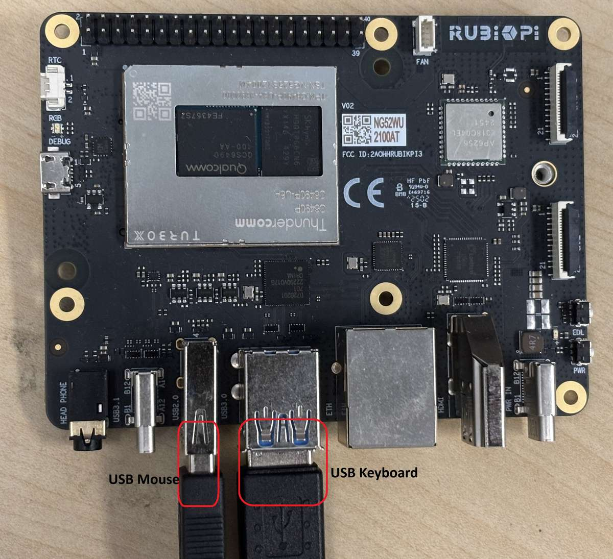
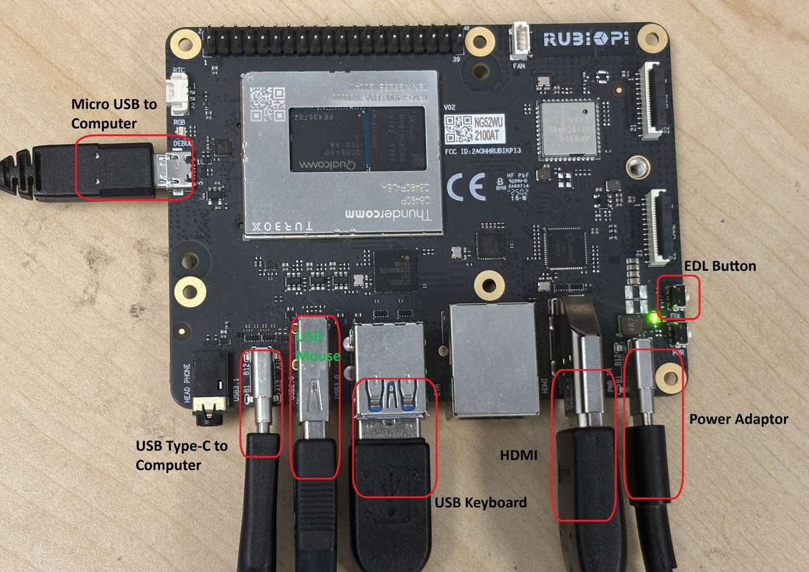

import Tabs from '@theme/Tabs';
import TabItem from '@theme/TabItem';

# Setup your device

This chapter offers a streamlined guide for developers to set up the **RUBIK Pi 3** development board across **Ubuntu**, **Windows®**, and **macOS®** environments. Whether you're powering on the device for the first time, configuring the debug UART for serial access, or establishing network and SSH connections, this section ensures a smooth and reliable onboarding experience.  
It also covers essential procedures such as entering **EDL mode** for firmware flashing and verifying your **Ubuntu 24.04** installation—laying the foundation for AI, multimedia, and embedded development workflows.  

### 🏁 Let’s Get Started!
   

<a id="poweron"></a>
## Power on the device

 Connect a 12V, 3A Type-C power adapter.  
 :::warning
RUBIK Pi 3 supports Power Delivery (PD) 3.0 power input. **A Type-C 12V 3A power adapter compliant with PD 3.0 is recommended for input power**.
The power indicator LED near the power port will turn on if the power adapter meets requirements and power negotiation succeeds. If the adapter does not meet requirements, the LED will remain off and the device will not boot.
:::
:::note
Plug in a USB Type-C to USB Type-A or a Type-C cable to establish connection for flashing operation.  
:::

Board versions v02 and later support automatic power-on after the power adapter is connected. You can check the hardware version number at the following location on the board. In the example below, the hardware version is V02.


:::note
If the blue LED on the board is constantly lit, it indicates that the power button was pressed for too long, and the board is in fastboot mode. Please refer to [**FAQ**](./11.Troubleshooting/4.troubleshooting.md#how-do-i-exit-fastboot-mode-on-the-rubik-pi-3) to exit the fastboot mode. 
:::


<a id="setUART"></a>
## Set up the Debug UART

The debug UART displays diagnostic messages and provides access to the device via a UART shell.

1️⃣ Connect a Micro-USB cable to the Micro-USB port on your RUBIK Pi 3.


2️⃣ Connect the other end of the Micro-USB cable to the host.
   Follow one of the following instructions based on the host operating system.

<Tabs>
<TabItem value="Ubuntuhost" label="Ubuntu host">

1️⃣ Run the following commands to install screen for accessing the UART console.
   ```shell
   sudo apt update
   sudo apt install screen
   ```

2️⃣ Run the following command to check the USB port:

   ```shell
   ls /dev/ttyACM*
   ```

   Sample output

   ```shell
   /dev/ttyACM0
   ```

3️⃣ Run the following command to open the debug UART session.  
   ```shell
   sudo screen <serial_port> <baud_rate>
   ```
Example: `sudo screen /dev/ttyACM0 115200`  
4️⃣ Open the debug UART interface and press Enter to display the authentication prompt.  
5️⃣ If Canonical Ubuntu is already flashed on the device, log in via the UART console and proceed to reset the user password.  
    * Account: `ubuntu`
    * Password: `ubuntu`

:::tip
 If you are unable to log in properly, check that your RUBIK Pi 3 has been upgraded to the Ubuntu 24.04. For detailed upgrade steps, refer to [Update software](./3.Update-Software/index.md).
:::

:::tip

 If you do not see the authentication console as expected, please check the USB connection. If necessary, disconnect and reconnect the Micro USB cable.
::: 
</TabItem>
<TabItem value="winhost" label="Windows host">

1️⃣ Download [PuTTY](https://www.chiark.greenend.org.uk/~sgtatham/putty/) for your Windows host. Make sure you select the correct version (32-bit or 64-bit).  
2️⃣ Run the installation wizard and follow the prompts.  
3️⃣ After installation, open the PuTTY application from the list of installed programs in the **Start** menu, or search for it in the search bar on the taskbar.  
4️⃣ In the PuTTY Configuration dialog box, perform the following actions:  

   1. Select Serial.  
   2. Specify the serial line based on the UART port detected in Windows Device Manager.  

   :::note
   If the UART port is not detected, download the driver and update it using Windows Device Manager:  
   * On x86 systems: [USB to UART serial driver](https://ftdichip.com/wp-content/uploads/2023/09/CDM-v2.12.36.4-WHQL-Certified.zip).  
   * On Arm(®) systems: Visit https://oemdrivers.com/usb-ft232r-usb-uart-arm64. Under **Drivers**, click **FTDI CDM VCP Drivers**.
   :::

   1. Set the baud rate to 115200.  
   2. Click **Open** to start the PuTTY session.  

    

5️⃣ Open the serial device and press **Enter** to bring up the authentication prompt.  
6️⃣ Log in to the UART console and follow the prompts to reset the password.  

    * Account: `ubuntu`    
    * Password: `ubuntu`  

:::tip
If you are unable to log in properly, check that your RUBIK Pi 3 has been upgraded to the Ubuntu 24.04. For detailed upgrade steps, refer to [Update software](./3.Update-Software/index.md).
:::

:::tip
 If you do not see the authentication console as expected, please check the USB connection. If necessary, disconnect and reconnect the Micro USB cable.
:::
</TabItem>
<TabItem value="machost" label="macOS host">

1️⃣ Run the following command to check the serial device connected to the macOS host.
   ```shell
   ls /dev/cu.*
   ```
2️⃣ Find your device in the list of serial devices.

    

3️⃣ Run the following command to open the serial device.
    ```shell
    screen <serial_device_node> <baud_rate>
    ```
    :::note
    * Replace `<serial_device_node>` with the device node name.  
    * Replace `<baud_rate>` with an appropriate baud rate.
    :::

Sample command: `ceteam@Qualcomms-MacBook-Pro ~ % screen /dev/cu.usbserial-DM03SDQQ 115200`

4️⃣ Open the serial device and press **Enter** to bring up the authentication prompt.  
5️⃣ Log in to the UART console and follow the prompts to reset the password.  
    * Account: `ubuntu`  
    * Password: `ubuntu`

:::tip
 If you are unable to log in properly, check that your RUBIK Pi 3 has been upgraded to the Ubuntu 24.04. For detailed upgrade steps, refer to [Update software](./3.Update-Software/index.md).
:::

:::tip  
 If you do not see the authentication console as expected, please check the USB connection. If necessary, disconnect and reconnect the Micro USB cable.
::: 
</TabItem>
</Tabs>

<a id="conNET"></a>
## Connect to the network

Use one of the following methods to establish an internet connection and obtain the device's IP address.

<Tabs>
<TabItem value="WiFi" label="Connect using Wi-Fi">

The device is running in Station mode for Wi-Fi. When the device boots up, it initializes the Wi-Fi host driver and performs network management authentication. Users can establish a wireless connection using the nmcli command-line tool.

1️⃣ Run the following command to connect to the wireless access point (Wi-Fi router):

   ```shell
   sudo nmcli dev wifi connect <WiFi-SSID> password <WiFi-password>
   ```

    Example

    ```
    sudo nmcli dev wifi connect RUBIKPiWiFi password 1234567890
    ```
    ```
    Device 'wlan0' successfully activated with 'd7b990bd-3b77-4b13-b239-b706553abaf8'.
    ```

2️⃣ Run the following command to verify the connection and device status:

      ```shell
      sudo nmcli -p device
      ```

    

3️⃣ Run the following command to verify the WLAN connection status and IP address.

    ```shell
    ip addr
     ```

     

4️⃣ To ensure the connection is active, perform a ping operation to a website such as that of RUBIK Pi:

     ```shell
    ping yahoo.com
     ```
 </TabItem>
   <TabItem value="ETH" label="Connect using Ethernet">

1️⃣ Connect one end of an Ethernet cable to the Ethernet port (RJ45) on your RUBIK Pi 3, and the other end to the network router.


2️⃣ After establishing the connection, run the following command on the UART serial console to obtain the IP address:

    ```shell
    ip addr
    ```

    
  </TabItem>
</Tabs>

## Establish SSH connection  

Secure Shell (SSH) is used for secure file transfer between the host and RUBIK Pi 3.

Before connecting to SSH, ensure that the network connection is established.

1️⃣ To find the IP address based on the network connection type, run the following command in the UART console:

   ```shell
   ip addr
   ```

2️⃣ Run the following command from the host to establish an SSH connection with the device. Use the IP address obtained in step 1.

   ```shell
   ssh <user name>@ip-address
   ```

    Example:
    ```
    ssh ubuntu@192.168.0.222
    ```

3️⃣ To connect to SSH, enter the user's password when prompted.

:::note
Ensure that the host is connected to the same network as the device.
:::

<a id="conHDMI"></a>

## Verify Software Version 
After completing the setup and once the device has successfully booted, verify the OS version by running the following commands in the device shell:

        ```shell
        cat /etc/os-release 
        ```
    Output: 
        ```json
    NAME="Ubuntu"
    VERSION_ID="24.04"
    VERSION="24.04.2 LTS (Noble Numbat)"
    VERSION_CODENAME=noble
    ID=ubuntu
    ID_LIKE=debian
    HOME_URL="https://www.ubuntu.com/"
    SUPPORT_URL="https://help.ubuntu.com/"
    BUG_REPORT_URL="https://bugs.launchpad.net/ubuntu/"
    PRIVACY_POLICY_URL="https://www.ubuntu.com/legal/terms-and-policies/privacy-policy"
    UBUNTU_CODENAME=noble
    LOGO=ubuntu-logo
    ```
:::note
Select the [**appropriate software upgrade**](https://www.thundercomm.com/rubik-pi-3/en/docs/rubik-pi-3-user-manual/1.0.0-u/Update-Software) path based on your current software version.  
:::

## Connect an HDMI display  

To connect an HDMI display and view the wayland output with the output from sample applications, follow these steps:   
1️⃣ Connect one end of the HDMI cable to the HDMI port on RUBIK Pi 3.  
2️⃣ Connect the other end of the HDMI cable to the display.


3️⃣ Power on the device and check the HDMI display. You should see the default Canonical Ubuntu screen before any package updates are applied.

 

## Connect to Keyboard and Mouse for SBC  
Connect USB Keyboard and Mouse to Type-A ports:
 

## Essential Port Connection Details  
  

## Enter into EDL mode
**EDL Mode** is required to flash firmware and OS images to RubikPi 3 using Qualcomm's QDL tool.  
If the device is pre-flashed and fully provisioned, EDL mode can be skipped during initial setup. 

	<a id="enterEDL"></a>

	
    
    
	<Tabs>
	<TabItem value="method1" label="Method1">

	1️⃣ Disconnect the power supply from port 10, and the Type-C cable from port 5.

	2️⃣ Press and hold the **[EDL]** button (No. 12 in the figure above).

	

	3️⃣ While continuing to hold the **[EDL]** button, connect the power supply into port 10, as shown in the figure below.

	

	4️⃣ While continuing to hold the **[EDL]** button insert the Type-C cable into port 5 and wait three seconds to enter 9008 mode.

	
   
    5️⃣ Release EDL button

	</TabItem>
	<TabItem value="method2" label="Method2">
    If your device is already running a Canonical Ubuntu image, follow the steps below to enter EDL (Emergency Download) mode.
    <details>
    <summary>🔧 Through UART</summary>
        1. Login from UART terminal  
        2. Run the following command:
        ```shell
        sudo reboot edl
        ```
    </details>

    <details>
    <summary>🌐 Through SSH</summary>
        1. Connect to the device using its IP address remotely  
        2. Login via SSH  
        ```shell
        sudo reboot edl
        ```
    </details>

    <details>
    <summary>🖥️ Through SBC</summary>
        1. On Weston display, open terminal
        2. Login to the terminal
        ```shell
        sudo reboot edl
        ```
    </details>
	</TabItem>
	</Tabs>
