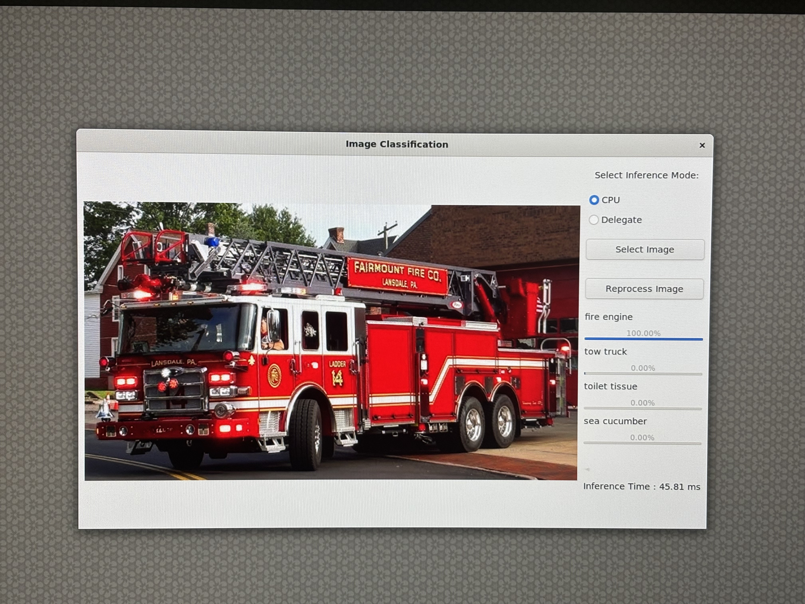

import Tabs from '@theme/Tabs';
import TabItem from '@theme/TabItem';

# LiteRT / TFLite 

LiteRT, formerly known as TensorFlow Lite, is Google's high-performance runtime for on-device AI. You can run existing quantized LiteRT models (in Python or C++) on the NPU on Dragonwing devices with a single line of code using the LiteRT delegates that are part of AI Engine Direct.

## Quantizing models

The NPU only supports uint8/int8 quantized models. Unsupported models, or unsupported layers will be automatically moved back to the CPU. You can use [quantization-aware training](https://www.tensorflow.org/model_optimization/guide/quantization/training_comprehensive_guide) or [post-training quantization](https://ai.google.dev/edge/litert/models/post_training_quantization) to quantize your LiteRT models. Make sure you follow the steps for "Full integer quantization".

:::info
**Don't want to quantize yourself?** You can download a range of pre-quantized models from [Qualcomm AI Hub](https://aihub.qualcomm.com), or use [Edge Impulse](https://qc-ai-test.gitbook.io/qc-ai-test-docs/running-building-ai-models/edge-impulse) to quantize new or existing models.
:::

## Running a model on the NPU (Python)

To offload a model to the NPU, you just need to load the LiteRT delegate; and pass it into the interpreter. E.g.:

```py
from ai_edge_litert.interpreter import Interpreter, load_delegate

qnn_delegate = load_delegate("libQnnTFLiteDelegate.so", options={"backend_type": "htp"})
interpreter = Interpreter(
    model_path=...,
    experimental_delegates=[qnn_delegate]
)
```

## Running a model on the NPU (C++)

To offload a model to the NPU, you'll first need to add the following compile flags:

```makefile
CFLAGS += -I${QNN_SDK_ROOT}/include
LDFLAGS += -L${QNN_SDK_ROOT}/lib/aarch64-ubuntu-gcc9.4 -lQnnTFLiteDelegate
```

Then, you instantiate the LiteRT delegate and pass it to the LiteRT interpreter:

```c
// == Includes ==
#include "QNN/TFLiteDelegate/QnnTFLiteDelegate.h"

// == Application code ==

// Get your interpreter...
tflite::Interpreter *interpreter = ...;

// Create QNN Delegate options structure.
TfLiteQnnDelegateOptions options = TfLiteQnnDelegateOptionsDefault();

// Set the mandatory backend_type option. All other options have default values.
options.backend_type = kHtpBackend;

// Instantiate delegate. Must not be freed until interpreter is freed.
TfLiteDelegate* delegate = TfLiteQnnDelegateCreate(&options);

TfLiteStatus status = interpreter->ModifyGraphWithDelegate(delegate);
// Check that status == kTfLiteOk
```

### Python Examples  
<Tabs>
<TabItem value="Example1" label="Vision Transformers">
### Vision Transformers  

Here's how you can run a Vision Transformer model (downloaded from [AI Hub](https://aihub.qualcomm.com/models/vit)) on both the CPU and the NPU using the LiteRT delegates.

Open the terminal on your development board, or an ssh session to your development board, and:

1. Create a new venv, and install the LiteRT runtime and Pillow:

   ```bash
   mkdir -p litert-demo/
   cd litert-demo/

   python3 -m venv .venv
   source .venv/bin/activate
   pip3 install ai-edge-litert==1.3.0 Pillow
   ```
2. Create `inference_vit.py` and add:

   ```py
   import numpy as np
   from ai_edge_litert.interpreter import Interpreter, load_delegate
   from PIL import Image
   import os, time, sys
   import urllib.request

   def curr_ms():
       return round(time.time() * 1000)

   use_npu = True if len(sys.argv) >= 2 and sys.argv[1] == '--use-npu' else False

   # Path to your quantized TFLite model and test image (will be download automatically)
   MODEL_PATH = "vit-vit-w8a8.tflite"
   IMAGE_PATH = "boa-constrictor.jpg"
   LABELS_PATH = "vit-vit-labels.txt"

   if not os.path.exists(MODEL_PATH):
       print("Downloading model...")
       model_url = 'https://cdn.edgeimpulse.com/qc-ai-docs/models/vit-vit-w8a8.tflite'
       urllib.request.urlretrieve(model_url, MODEL_PATH)

   if not os.path.exists(LABELS_PATH):
       print("Downloading labels...")
       labels_url = 'https://cdn.edgeimpulse.com/qc-ai-docs/models/vit-vit-labels.txt'
       urllib.request.urlretrieve(labels_url, LABELS_PATH)

   if not os.path.exists(IMAGE_PATH):
       print("Downloading image...")
       image_url = 'https://cdn.edgeimpulse.com/qc-ai-docs/examples/boa-constrictor.jpg'
       urllib.request.urlretrieve(image_url, IMAGE_PATH)

   with open(LABELS_PATH, 'r') as f:
       labels = [line for line in f.read().splitlines() if line.strip()]

   experimental_delegates = []
   if use_npu:
       experimental_delegates = [load_delegate("libQnnTFLiteDelegate.so", options={"backend_type": "htp"})]

   # Load TFLite model and allocate tensors
   interpreter = Interpreter(
       model_path=MODEL_PATH,
       experimental_delegates=experimental_delegates
   )
   interpreter.allocate_tensors()

   # Get input and output tensor details
   input_details = interpreter.get_input_details()
   output_details = interpreter.get_output_details()

   # Load and preprocess image
   def load_image(path, input_shape):
       # Expected input shape: [1, height, width, channels]
       _, height, width, channels = input_shape

       img = Image.open(path).convert("RGB").resize((width, height))
       img_np = np.array(img, dtype=np.uint8)  # quantized models expect uint8
       img_np = np.expand_dims(img_np, axis=0)
       return img_np

   input_shape = input_details[0]['shape']
   input_data = load_image(IMAGE_PATH, input_shape)

   # Set tensor and run inference
   interpreter.set_tensor(input_details[0]['index'], input_data)

   # Run once to warmup
   interpreter.invoke()

   # Then run 10x
   start = curr_ms()
   for i in range(0, 10):
       interpreter.invoke()
   end = curr_ms()

   # Get prediction
   q_output = interpreter.get_tensor(output_details[0]['index'])
   scale, zero_point = output_details[0]['quantization']
   f_output = (q_output.astype(np.float32) - zero_point) * scale

   # Image classification models in AI Hub miss a Softmax() layer at the end of the model, so add it manually
   def softmax(x, axis=-1):
       # subtract max for numerical stability
       x_max = np.max(x, axis=axis, keepdims=True)
       e_x = np.exp(x - x_max)
       return e_x / np.sum(e_x, axis=axis, keepdims=True)

   # show top-5 predictions
   scores = softmax(f_output[0])
   top_k = scores.argsort()[-5:][::-1]
   print("\nTop-5 predictions:")
   for i in top_k:
       print(f"Class {labels[i]}: score={scores[i]}")

   print('')
   print(f'Inference took (on average): {(end - start) / 10}ms. per image')
   ```
3. Run the model on the CPU:

   ```bash
   python3 inference_vit.py

   # INFO: Created TensorFlow Lite XNNPACK delegate for CPU.
   #
   # Top-5 predictions:
   # Class boa constrictor: score=0.6264431476593018
   # Class rock python: score=0.047579940408468246
   # Class night snake: score=0.006721484009176493
   # Class mouse: score=0.0022421202156692743
   # Class pick: score=0.001942973816767335
   #
   # Inference took (on average): 391.1ms. per image
   ```
4. Run the model on the NPU:

   ```bash
   python3 inference_vit.py --use-npu

   # INFO: TfLiteQnnDelegate delegate: 1382 nodes delegated out of 1633 nodes with 27 partitions.
   #
   # INFO: Created TensorFlow Lite XNNPACK delegate for CPU.
   #
   # Top-5 predictions:
   # Class boa constrictor: score=0.6113042235374451
   # Class rock python: score=0.038359832018613815
   # Class night snake: score=0.011630792170763016
   # Class mouse: score=0.002294909441843629
   # Class lens cap: score=0.0018960189772769809
   #
   # Inference took (on average): 132.7ms. per image
   ```
As you can see this model runs significantly faster on NPU - but there's a slight change in the output of the model. You can also see that for this model not all layers can run on NPU ("1382 nodes delegated out of 1633 nodes with 27 partitions").

</TabItem>

<TabItem value="Example2" label="Image Classification">
### GTK-Based Image Classification App

Here's how you can use a GTK-based desktop application to run an image classification model—downloaded from [(AI Hub)](https://aihub.qualcomm.com/iot/models/googlenet?searchTerm=google&chipsets=qualcomm-qcs6490-proxy) on both the CPU and NPU using LiteRT delegates from AI Engine Direct.   

The model uses TensorFlow Lite with QNN delegate acceleration for efficient on-device inference.  

Since this model isn’t available on Edge Impulse, download it with precision `w8a8` and set the runtime to `TFLite`.  


The next step is to push the model on to the target device    
Through scp command copy the model and image onto the device.
```shell
scp xxxx.tflite ubuntu@IP_address:/home/ubuntu/
scp xxx.jpg ubuntu@IP_address:/home/ubuntu/
```
:::note
Download any image from internet. In this example we used firetruck image.
:::
Open the terminal on your development board, or an ssh session to your development board, and:  

Create a new venv, and install the LiteRT runtime and Pillow:  
```python  
python3 -m venv .venv-litert-demo
source .venv-litert-demo/bin/activate
pip3 install ai-edge-litert==1.3.0 Pillow
pip3 install opencv-python
sudo apt install python3-gi python3-gi-cairo gir1.2-gtk-3.0
sudo apt install python3-venv python3-full
sudo apt install -y pkg-config cmake libcairo2-dev
sudo apt install libgirepository1.0-dev gir1.2-glib-2.0
sudo apt install build-essential python3-dev python3-pip pkg-config meson
```

Now follow the steps to create Image classification application.  
**Summary**  
•  Type: Desktop GUI application   
•  Functionality: Image classification using TFLite   
•  Modes: CPU and QNN delegate   
•  Interface: GTK-based GUI   
•  Output: Top predictions with confidence bars  

**Environment Setup & Imports**  
In the step the script sets up display-related environment variables (for Linux systems) and imports necessary libraries like OpenCV, NumPy, GTK, and TensorFlow Lite.  
```python
import cv2, numpy as np, os, time
from gi.repository import Gtk, GLib, GdkPixbuf
import ai_edge_litert.interpreter as tflite
```
:::note
•	GTK is used for the GUI, OpenCV for image handling, and TensorFlow Lite for inference.
:::

**Configuration Constants**  
 These constants define paths to the model, label file, and delegate library.
 ```python
 TF_MODEL = "googlenet-googlenet-w8a8.tflite"
LABELS = "imagenet_labels.txt"
DELEGATE_PATH = "libQnnTFLiteDelegate.so"
DEVICE_OS = "Ubuntu"
```
   
### Helper Functions 
This step sets up the core logic and interface for image classification using LiteRT and GTK.  

**Softmax Calculation**  
Ensures numerical stability when converting logits to probabilities.  
```python
Pythondef stable_softmax(logits):    
logits = logits.astype(np.float32)    
shifted_logits = np.clip(logits - np.max(logits), -500, 500)    
exp_scores = np.exp(shifted_logits)    
return exp_scores / np.sum(exp_scores)
```

**Label Loader**  
Loads class labels from a text file.  
```python 
Pythondef load_labels(label_path):    
with open(label_path, 'r') as f: 
       return [line.strip() for line in f.readlines()]
```

**Image Preprocessing**  
Prepares the image for model input: resizing, color conversion, and reshaping.  
```python 
Pythondef preprocess_image(image_path, input_shape, input_dtype):   
img = cv2.imread(image_path)    
img = cv2.cvtColor(img, cv2.COLOR_BGR2RGB)    
img = cv2.resize(img, (input_shape[2], input_shape[1]))    
img = img.astype(input_dtype)    
return np.expand_dims(img, axis=0)
```

**Inference Execution**  
This function will:   
•	Loads the model (with or without delegate)  
•	Prepares input  
•	Runs inference   
•	Applies softmax  
•	Returns top 4 predictions with confidence scores  

```python
def runInference(image, use_delegate):
    if use_delegate:
        try:
            delegate = tflite.load_delegate(DELEGATE_PATH, {'backend_type': 'htp'})
            model = tflite.Interpreter(model_path=TF_MODEL, experimental_delegates=[delegate])
        except:
            model = tflite.Interpreter(model_path=TF_MODEL)
    else:
        model = tflite.Interpreter(model_path=TF_MODEL)
    model.allocate_tensors()
    input_details = model.get_input_details()
    input_data = preprocess_image(image, input_details[0]['shape'], input_details[0]['dtype'])
    model.set_tensor(input_details[0]['index'], input_data)
    start_time = time.time()
    model.invoke()
    inference_time = time.time() - start_time
    output_data = model.get_tensor(model.get_output_details()[0]['index'])
    probabilities = stable_softmax(output_data[0])
    labels = load_labels(LABELS)
    top_indices = np.argsort(probabilities)[::-1][:4]
    results = [(labels[i], probabilities[i] * 100) for i in top_indices]
    return results, inference_time
```

**GTK GUI Components**  

**File Browser Dialog**  
Allows users to select an image file.  
```python 
class FileBrowser(Gtk.FileChooserDialog):
    def __init__(self):
        super().__init__(title="Choose an image", action=Gtk.FileChooserAction.OPEN)
        self.add_buttons(Gtk.STOCK_CANCEL, Gtk.ResponseType.CANCEL, Gtk.STOCK_OPEN, Gtk.ResponseType.OK)
    def run_and_get_file(self):
        if self.run() == Gtk.ResponseType.OK:
            return self.get_filename()
        self.destroy()
```

**Main Window**  
The GUI includes:  
•	Image display area  
•	Radio buttons to choose CPU or delegate  
•	Buttons to select and reprocess image  
•	Result display with labels and progress bars  

```python
class MainWindow(Gtk.Window):
    def __init__(self):
        super().__init__(title="Image Classification")
        self.set_default_size(800, 600)
        self.imageFilepath = ""
        ...
```

**Image Processing and Display**  
This method:  
•	Resizes and displays the image  
•	Runs inference  
•	Displays results with progress bars and inference time  
```python 
def process_file(self, filepath):
    pixbuf = GdkPixbuf.Pixbuf.new_from_file(filepath)
    new_width, new_height = resizeImage(pixbuf)
    scaled_pixbuf = pixbuf.scale_simple(new_width, new_height, GdkPixbuf.InterpType.BILINEAR)
    self.image.set_from_pixbuf(scaled_pixbuf)

    results, inference_time = runInference(filepath, self.use_delegate())
    ...
```

**Application Entry Point**  
Initializes and launches the GTK application.  
```python 
def main():
    app = MainWindow()
    app.connect("destroy", Gtk.main_quit)
    app.show_all()
    Gtk.main()
if __name__ == "__main__":
    success, _ = Gtk.init_check()
    if not success:
        print("GTK could not be initialized.")
        exit(1)
    main()
```

### Reference Code   

```python
# -----------------------------------------------------------------------------
#
# Copyright (c) Qualcomm Technologies, Inc. and/or its subsidiaries.
# SPDX-License-Identifier: BSD-3-Clause
#
# -----------------------------------------------------------------------------

import cv2
import gi
import numpy as np
import os
os.environ['xDG_RUNTIME_DIR'] = '/run/user/1000/'
os.environ['WAYLAND_DISPLAY'] = 'wayland-1'
os.environ['DISPLAY'] = ':0'
import time
gi.require_version("Gtk", "3.0")
from gi.repository import Gtk, GLib, GdkPixbuf

# ========= Constants =========
TF_MODEL = "googlenet-googlenet-w8a8.tflite"
LABELS = "/etc/labels/imagenet_labels.txt"
DELEGATE_PATH = "libQnnTFLiteDelegate.so"
DEVICE_OS="Ubuntu"
UNAME = os.uname().nodename

import ai_edge_litert.interpreter as tflite

# ========= Helper Functions =========
def stable_softmax(logits):
    # Convert logits to float64 for higher precision
    logits = logits.astype(np.float32)
    
    # Subtract the maximum logit to prevent overflow
    shifted_logits = logits - np.max(logits)
    
    # Clip the shifted logits to a safe range to prevent overflow in exp
    shifted_logits = np.clip(shifted_logits, -500, 500)
    
    # Calculate the exponentials and normalize
    exp_scores = np.exp(shifted_logits)
    probabilities = exp_scores / np.sum(exp_scores)
    
    return probabilities

# Load labels from file
def load_labels(label_path):
    with open(label_path, 'r') as f:
        return [line.strip() for line in f.readlines()]

def resizeImage(pixbuf):
    original_width = pixbuf.get_width()
    original_height = pixbuf.get_height()

    # Target display size
    max_width = 800
    max_height = 600

    # Calculate new size preserving aspect ratio
    scale = min(max_width / original_width, max_height / original_height)
    new_width = int(original_width * scale)
    new_height = int(original_height * scale)

    return new_width, new_height

# Load and preprocess input image
def preprocess_image(image_path, input_shape, input_dtype):
    # Read the image using OpenCV
    img = cv2.imread(image_path)
    if img is None:
        raise ValueError(f"Failed to load image at {image_path}")
    # Convert BGR to RGB
    img = cv2.cvtColor(img, cv2.COLOR_BGR2RGB)
    # Resize the image to the desired input shape
    img = cv2.resize(img, (input_shape[2], input_shape[1]))
    # Convert to the desired data type
    img = img.astype(input_dtype)
    # Add batch dimension
    img = np.expand_dims(img, axis=0)
    
    return img

# ====== Inference Function ======
def runInference(image, use_delegate):
    results = []    
    print(f"Running on {DEVICE_OS} using Delegate:{use_delegate}")
    if use_delegate:
        try:
            # Load the QNN delegate library
            delegate_options = { 'backend_type': 'htp' }
            delegate = tflite.load_delegate(DELEGATE_PATH, delegate_options)
            
            # Load the TFLite model
            model = tflite.Interpreter(model_path=TF_MODEL, experimental_delegates=[delegate])
            print("INFO: Loaded QNN delegate with HTP backend")
        except Exception as e:
            print(f"WARNING: Failed to load QNN delegate: {e}")
            print("INFO: Continuing without QNN delegate")
            model = tflite.Interpreter(model_path=TF_MODEL)   
    else:
        model = tflite.Interpreter(model_path=TF_MODEL)  
   
    model.allocate_tensors()

    # Get and Prepare input 
    input_details = model.get_input_details()
    input_shape = input_details[0]['shape']
    input_dtype = input_details[0]['dtype']
    input_data = preprocess_image(image, input_shape, input_dtype)
    
    # Load input data to input tensor
    model.set_tensor(input_details[0]['index'], input_data)
    model.get_signature_list()
    
    # Run inference
    try:
        start_time = time.time()
        model.invoke()
        end_time = time.time()
        print("Interpreter invoked successfully.")
    except Exception as e:
        print(f"Error during model invocation: {e}")
        return []

    # Calculate and print duration
    inference_time = end_time - start_time

    # Prepare output tensor details
    output_details = model.get_output_details()

    # Load output data to output tensor
    output_data = model.get_tensor(output_details[0]['index'])

    # Load labels and get prediction
    labels = load_labels(LABELS)
    predicted_index = np.argmax(output_data)
    predicted_label = labels[predicted_index]
    print("Predicted index:", predicted_index)
    print("Predicted label:", predicted_label)
    
    # Add Softmax function
    logits = output_data[0]
    probabilities = stable_softmax(logits)

    # Get top 4 predictions
    top_k = 4
    top_indices = np.argsort(probabilities)[::-1][:top_k]
    for i in top_indices:
        result = (labels[i], probabilities[i] * 100)
        results.append(result)

    return results, inference_time

# ====== GTK GUI Classes ======
class FileBrowser(Gtk.FileChooserDialog):
    def __init__(self):
        super().__init__(title="Choose an image", action=Gtk.FileChooserAction.OPEN)
        self.add_buttons(Gtk.STOCK_CANCEL, Gtk.ResponseType.CANCEL, Gtk.STOCK_OPEN, Gtk.ResponseType.OK)

    def run_and_get_file(self):
        response = super().run()
        if response == Gtk.ResponseType.OK:
            print("Selected file:", self.get_filename())
            self.selected_file = self.get_filename()            
        self.destroy()
        return self.selected_file

class MainWindow(Gtk.Window):
    def __init__(self):
        super().__init__(title="Image Classification")
        self.set_default_size(800, 600)
        self.imageFilepath = ""
        # Main layout
        self.mainBox = Gtk.Box(orientation=Gtk.Orientation.HORIZONTAL, spacing=10)
        self.mainBox.set_margin_top(10)
        self.mainBox.set_margin_bottom(10)
        self.mainBox.set_margin_start(10)
        self.mainBox.set_margin_end(10)
        self.add(self.mainBox)
        
        # Main Window Image setup with fallback
        self.image = Gtk.Image()
        try:
            MAIN_IMAGE = "MainWindowPic.jpg"
            self.image.set_from_file(MAIN_IMAGE)         
        except Exception as e:
            print("Error loading main image:", e)
            self.image.set_from_icon_name("image-missing", Gtk.IconSize.DIALOG)

        self.mainBox.pack_start(self.image, True, True, 0)

        # Set up a new box to add results and and file button
        self.infoBox = Gtk.Box(orientation=Gtk.Orientation.VERTICAL, spacing=10)
        
        # Radio button to select Delegate
        delegate_label = Gtk.Label(label="Select Inference Mode:")
        self.infoBox.pack_start(delegate_label, False, False, 10)

        self.cpu_radio = Gtk.RadioButton.new_with_label_from_widget(None, "CPU")
        self.delegate_radio = Gtk.RadioButton.new_with_label_from_widget(self.cpu_radio, "Delegate")

        self.infoBox.pack_start(self.cpu_radio, False, False, 0)
        self.infoBox.pack_start(self.delegate_radio, False, False, 0)
        
        # Radio button signal
        self.cpu_radio.connect("toggled", self.on_radio_toggled)
        self.delegate_radio.connect("toggled", self.on_radio_toggled)

        # Open file button
        open_button = Gtk.Button(label="Select Image")
        open_button.connect("clicked", self.on_open_file_clicked)
        self.infoBox.pack_start(open_button, False, True, 10)

        # Reprocess Image
        reprocess_button = Gtk.Button(label="Reprocess Image")
        reprocess_button.connect("clicked", self.on_reprocess_image_clicked)
        self.infoBox.pack_start(reprocess_button, False, True, 10)

        # Classification results
        self.results = Gtk.Box(orientation=Gtk.Orientation.VERTICAL, spacing=10)
        self.infoBox.pack_start(self.results, True, True, 0)
        self.mainBox.pack_start(self.infoBox, True, True, 0)

    def use_delegate(self):
        return self.delegate_radio.get_active()

    def on_radio_toggled(self, button):
        if button.get_active():
            print(f"Selected option: {button.get_label()}")

    def process_file(self, filepath): 
        try:
            # Resize Image
            pixbuf = GdkPixbuf.Pixbuf.new_from_file(filepath)
            new_width, new_height = resizeImage(pixbuf)
            scaled_pixbuf = pixbuf.scale_simple(new_width, new_height, GdkPixbuf.InterpType.BILINEAR)
            
            # Replace the image with new image
            self.image.set_from_pixbuf(scaled_pixbuf)
           
            # Run Inference
            use_delegate = self.use_delegate()
            print("delegate: " , use_delegate)
            options, inference_time = runInference(filepath, use_delegate)

            # Clear result box
            for child in self.results.get_children():
                self.results.remove(child)
            
            # Set up predictions
            for label, percent in options:
                textBox = Gtk.Box(orientation=Gtk.Orientation.HORIZONTAL, spacing=10)
                barBox = Gtk.Box(orientation=Gtk.Orientation.HORIZONTAL, spacing=10)
                text = Gtk.Label(label=label, xalign=0)
                text.set_size_request(100, -1) 
                
                bar = Gtk.ProgressBar()
                bar.set_fraction(percent / 100.0)
                bar.set_text(f"{percent:.2f}%")
                bar.set_show_text(True)
                
                textBox.pack_start(text, False, False, 0)
                barBox.pack_start(bar, True, True, 0)
            
                self.results.pack_start(textBox, False, False, 0)
                self.results.pack_start(barBox, False, False, 0)
                self.results.show_all()
            
            # Add inference time label
            time_label = Gtk.Label(label=f"Inference Time : {inference_time * 1000:.2f} ms")
            self.results.pack_start(time_label, False, False, 50)
            self.results.show_all()
        except Exception as e:
            print("Error reading file:", e)

    def on_open_file_clicked(self, widget):
        dialog = FileBrowser()
        selected_file = dialog.run_and_get_file()
        self.imageFilepath = selected_file
        if selected_file:
            self.process_file(selected_file)
 
    def on_reprocess_image_clicked(self, widget):
        self.process_file(self.imageFilepath)

    def on_destroy(self, widget):
        Gtk.main_quit()

# === Main Entry Point ===
def main():
    app = MainWindow()
    app.connect("destroy", Gtk.main_quit)
    app.show_all()
    Gtk.main()

if __name__ == "__main__":
    success, _ = Gtk.init_check()
    if not success:
        print("GTK could not be initialized. Check environmental variables")
        exit(1)

    main() 

```

Now you're set up to run the application on either CPU/delegate using the command below: 
```shell 
python3 classification.py
```
Select CPU as your runtime option on the GUI:  

  

Select delegate as your runtime option on the GUI:    


</TabItem>

<TabItem value="Example3" label="Object Detection">
### Object Detection with OpenCV & Wayland Display  
This Python script performs **real-time object detection** on a video file using a quantized **YOLOv8 TensorFlow Lite model** and displays the annotated frames via **GStreamer on a Wayland display**. It is optimized for **edge AI scenarios** using hardware acceleration through the **QNN TFLite delegate**.  
:::note
The YOLOv8 model isn't available by default. Please follow the **Step-6** from [**Qualcomm Intelligent Multimedia SDK**](https://docs.qualcomm.com/bundle/publicresource/topics/80-70020-50/download-model-and-label-files.html?vproduct=1601111740013072&version=1.5&facet=Intelligent_Multimedia_SDK.SDK.2.0) to export YoloV8 quantized model. 
:::

The next step is to push the model on to the target device
Through scp command copy the model onto the device.
```shell
scp xxxx.tflite ubuntu@IP_address:/home/ubuntu/
```

**Initialization and Configuration**  
•	Paths for the model, labels, input video, and delegate are defined.   
•	Constants like frame dimensions, FPS, confidence threshold, and scaling factors are set for preprocessing and postprocessing.  

    **MODEL_PATH** = "yolov8_det_quantized.tflite"  
    **LABEL_PATH** = "coco_labels.txt"  
    **VIDEO_IN** = "video.mp4"  
    **DELEGATE_PATH** = "libQnnTFLiteDelegate.so"  

:::note
Use a video file that works well with object detection models.  
For best results, choose videos with clear subjects, good lighting, and minimal motion blur.

**Examples:**  
• A street scene with vehicles and pedestrians  
• A warehouse or factory floor with visible objects  
• A static camera feed showing people or products  
:::


**Model Loading and Delegate Setup**  
•	Loads the hardware delegate for accelerated inference.   
•	Initializes the TensorFlow Lite interpreter with the quantized YOLOv8 model.  
```python
delegate_options = { 'backend_type': 'htp' }
delegate = tflite.load_delegate(DELEGATE_PATH, delegate_options)
interpreter = tflite.Interpreter(model_path=MODEL_PATH, experimental_delegates=[delegate])
interpreter.allocate_tensors()
```

**Label Loading**  
•	Loads COCO dataset labels for object annotation.  
```python
labels = [l.strip() for l in open(LABEL_PATH)]
```

**GStreamer Pipeline Setup**  
•	Creates a GStreamer pipeline using appsrc to stream frames to a Wayland sink. 
•	Enables real-time display of processed frames.
```shell
pipeline = Gst.parse_launch(
    'appsrc name=src is-live=true block=true format=time caps=video/x-raw,format=BGR,width=1600,height=900,framerate=30/1 ! videoconvert ! waylandsink')
```
**Video Capture and Frame Processing**  
•	Opens the video file using OpenCV.  
•	Each frame is resized and preprocessed to match the model’s input dimensions.  
```python
cap = cv2.VideoCapture(VIDEO_IN)
```

**Inference and Post-processing**  
•	Runs inference on each frame.  
•	Dequantizes the model outputs using predefined scales and zero-points.  

```python 
interpreter.set_tensor(in_det[0]['index'], input_tensor)
interpreter.invoke()
boxes_q = interpreter.get_tensor(out_det[0]['index'])[0]
scores_q = interpreter.get_tensor(out_det[1]['index'])[0]
classes_q = interpreter.get_tensor(out_det[2]['index'])[0]
```

•	Applies a confidence threshold to filter low-probability detections.
•	Uses Non-Maximum Suppression (NMS) to remove overlapping boxes.

```python 
mask = scores >= CONF_THRES
boxes_f = boxes[mask]
scores_f = scores[mask]
classes_f = classes[mask]
```

**Annotation and Display**

•	Draws bounding boxes and labels on the frame using OpenCV.
•	Logs the highest detection score every 100 frames.

```python
cv2.rectangle(frame_rs, (x1i, y1i), (x2i, y2i), (0,255,0), 2)
cv2.putText(frame_rs, f"{lab} {sc:.2f}", (x1i, max(10,y1i-5)), cv2.FONT_HERSHEY_SIMPLEX, 0.5, (0,255,0), 2)
```

**Streaming to Wayland Display**  

Converts frames to GStreamer buffers and pushes them to the pipeline with timestamps for smooth playback.  
```python
buf = Gst.Buffer.new_allocate(None, len(data), None)
buf.fill(0, data)
buf.duration = Gst.util_uint64_scale_int(1, Gst.SECOND, FPS_OUT)
timestamp = cap.get(cv2.CAP_PROP_POS_MSEC) * Gst.MSECOND
buf.pts = buf.dts = int(timestamp)
appsrc.emit('push-buffer', buf)
```
**Completion**  
Gracefully shuts down the pipeline after processing all frames.  
```python
appsrc.emit('end-of-stream')
pipeline.set_state(Gst.State.NULL)
cap.release()
```

**Use Cases**  
This script is ideal for:  
•	Smart cameras  
•	Robotics  
•	Embedded systems with Wayland-based GUIs  
•	Real-time monitoring in edge AI deployments  

### Reference Code   

```python
# -----------------------------------------------------------------------------
#
# Copyright (c) Qualcomm Technologies, Inc. and/or its subsidiaries.
# SPDX-License-Identifier: BSD-3-Clause
#
# -----------------------------------------------------------------------------

#!/usr/bin/env python3

# Import necessary libraries
import cv2
import numpy as np
import gi
gi.require_version('Gst', '1.0')
from gi.repository import Gst
import ai_edge_litert.interpreter as tflite

# Initialize GStreamer
Gst.init(None)

# -------------------- Parameters --------------------
MODEL_PATH = "/home/ubuntu/yolov8_det_quantized.tflite"  # Path to TFLite model
LABEL_PATH = "/home/ubuntu/coco_labels.txt"              # Path to label file
VIDEO_IN = "/etc/media/video.mp4"                        # Input video file
DELEGATE_PATH = "libQnnTFLiteDelegate.so"                # Delegate for hardware acceleration

# Frame and model parameters
FRAME_W, FRAME_H = 1600, 900
FPS_OUT = 30
CONF_THRES = 0.25
NMS_IOU_THRES = 0.50
BOX_SCALE = 3.2108588218688965
BOX_ZP = 31.0
SCORE_SCALE = 0.0038042240776121616
# -------------------- Load Model --------------------
# Load delegate for hardware acceleration
delegate_options = { 'backend_type': 'htp' }
delegate = tflite.load_delegate(DELEGATE_PATH, delegate_options)

# Load and allocate TFLite interpreter
interpreter = tflite.Interpreter(model_path=MODEL_PATH, experimental_delegates=[delegate])
interpreter.allocate_tensors()

# Get input/output tensor details
in_det = interpreter.get_input_details()
out_det = interpreter.get_output_details()
in_h, in_w = in_det[0]["shape"][1:3]

# -------------------- Load Labels --------------------
labels = [l.strip() for l in open(LABEL_PATH)]

# -------------------- GStreamer Pipeline --------------------
# Create GStreamer pipeline to display video via Wayland
pipeline = Gst.parse_launch(
    'appsrc name=src is-live=true block=true format=time caps=video/x-raw,format=BGR,width=1600,height=900,framerate=30/1 ! videoconvert ! waylandsink'
)
appsrc = pipeline.get_by_name('src')
pipeline.set_state(Gst.State.PLAYING)

# -------------------- Video Input --------------------
cap = cv2.VideoCapture(VIDEO_IN)

# Scaling factors for bounding box adjustment
sx, sy = FRAME_W / in_w, FRAME_H / in_h

# Preallocate frame buffers
frame_rs = np.empty((FRAME_H, FRAME_W, 3), np.uint8)
input_tensor = np.empty((1, in_h, in_w, 3), np.uint8)

frame_cnt = 0

# -------------------- Main Loop --------------------
while True:
    ok, frame = cap.read()
    if not ok:
        break
    frame_cnt += 1

    # ---------- Preprocessing ----------
    # Resize frame to display resolution
    cv2.resize(frame, (FRAME_W, FRAME_H), dst=frame_rs)

    # Resize again to model input resolution
    cv2.resize(frame_rs, (in_w, in_h), dst=input_tensor[0])

    # ---------- Inference ----------
    # Set input tensor and run inference
    interpreter.set_tensor(in_det[0]['index'], input_tensor)
    interpreter.invoke()

    # ---------- Postprocessing ----------
    # Get raw output tensors
    boxes_q = interpreter.get_tensor(out_det[0]['index'])[0]
    scores_q = interpreter.get_tensor(out_det[1]['index'])[0]
    classes_q = interpreter.get_tensor(out_det[2]['index'])[0]

    # Dequantize outputs
    boxes = BOX_SCALE * (boxes_q.astype(np.float32) - BOX_ZP)
    scores = SCORE_SCALE * scores_q.astype(np.float32)
    classes = classes_q.astype(np.int32)

    # Filter by confidence threshold
    mask = scores >= CONF_THRES
    if np.any(mask):
        boxes_f = boxes[mask]
        scores_f = scores[mask]
        classes_f = classes[mask]

        # Convert boxes to OpenCV format
        x1, y1, x2, y2 = boxes_f.T
        boxes_cv2 = np.column_stack((x1, y1, x2 - x1, y2 - y1))

        # Apply Non-Maximum Suppression
        idx_cv2 = cv2.dnn.NMSBoxes(
            bboxes=boxes_cv2.tolist(),
            scores=scores_f.tolist(),
            score_threshold=CONF_THRES,
            nms_threshold=NMS_IOU_THRES
        )

        if len(idx_cv2):
            idx = idx_cv2.flatten()
            sel_boxes = boxes_f[idx]
            sel_scores = scores_f[idx]
            sel_classes = classes_f[idx]

            # Debug print every 100 frames
            if frame_cnt % 100 == 0:
                print(f"[{frame_cnt:4d}] max score = {sel_scores.max():.3f}")

            # Rescale boxes to display resolution
            sel_boxes[:, [0,2]] *= sx
            sel_boxes[:, [1,3]] *= sy
            sel_boxes = sel_boxes.astype(np.int32)

            # Clip boxes to frame boundaries
            sel_boxes[:, [0,2]] = np.clip(sel_boxes[:, [0,2]], 0, FRAME_W-1)
            sel_boxes[:, [1,3]] = np.clip(sel_boxes[:, [1,3]], 0, FRAME_H-1)

            # Draw boxes and labels
            for (x1i, y1i, x2i, y2i), sc, cl in zip(sel_boxes, sel_scores, sel_classes):
                cv2.rectangle(frame_rs, (x1i, y1i), (x2i, y2i), (0,255,0), 2)
                lab = labels[cl] if cl < len(labels) else str(cl)
                cv2.putText(frame_rs, f"{lab} {sc:.2f}", (x1i, max(10,y1i-5)),
                            cv2.FONT_HERSHEY_SIMPLEX, 0.5, (0,255,0), 2)

    # ---------- Video Output ----------
    # Convert frame to bytes and push to GStreamer pipeline
    data = frame_rs.tobytes()
    buf = Gst.Buffer.new_allocate(None, len(data), None)
    buf.fill(0, data)
    buf.duration = Gst.util_uint64_scale_int(1, Gst.SECOND, FPS_OUT)
    timestamp = cap.get(cv2.CAP_PROP_POS_MSEC) * Gst.MSECOND
    buf.pts = buf.dts = int(timestamp)
    appsrc.emit('push-buffer', buf)

# -------------------- Finish --------------------
appsrc.emit('end-of-stream')
pipeline.set_state(Gst.State.NULL)
cap.release()
print("Done – video streamed to Wayland sink")
```
Now you're set up to run the application on NPU(delegate) using the command below: 
```python
python3 ObjectDetection.py
```


</TabItem>
</Tabs>