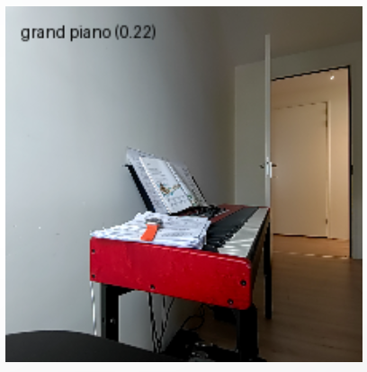
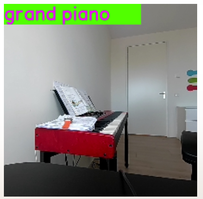

# Develop your first Application  

The Qualcomm® Intelligent Multimedia SDK (IM SDK) is a set of GStreamer plugins that let you run computer vision operations on the GPU of your Dragonwing development board; and that can create AI pipelines that run fully on GPU and NPU, without ever having to yield back to the CPU (zero-copy). Together this makes it possible to achieve much higher throughput rates than when you implement AI CV pipelines yourself in e.g. OpenCV + TFLite.


##  GStreamer Pipelines with IM SDK
The Intelligent Multimedia SDK (IM SDK) is built on top of GStreamer, a powerful multimedia framework that enables developers to define video and audio processing workflows as pipelines. Instead of manually coding each step—like capturing frames, resizing, cropping, running inference, and rendering output—GStreamer allows you to declare the entire sequence in a single pipeline string. The framework then handles execution, synchronization, and data flow automatically.  
IM SDK enhances this experience on Qualcomm® hardware by enabling seamless acceleration across the pipeline. Tasks such as image resizing, cropping, and overlay rendering are offloaded to the GPU, while inference operations are executed on the NPU. This zero-copy architecture ensures that data flows through the pipeline without unnecessary CPU intervention, resulting in real-time performance and reduced system load.  
To support this, IM SDK provides specialized GStreamer plugins:  

`qtivtransform`: Accelerates color conversion, cropping, and resizing using the GPU.  
`qtimltflite`: Executes TensorFlow Lite models on the NPU.  

By integrating these plugins, developers can build high-performance multimedia applications using familiar GStreamer syntax—while benefiting from hardware acceleration under the hood.  

## Setting up GStreamer and the IM SDK  
Alright, let's go build some applications using the IM SDK.

1. Install GStreamer, the IM SDK and some extra dependencies we'll need in this example. Open the terminal on your development board, or an ssh session to your development board, and run:  
```python
# Add the Qualcomm IoT PPA
sudo apt-add-repository -y ppa:ubuntu-qcom-iot/qcom-ppa

# Install GStreamer / IM SDK
sudo apt update
sudo apt install -y gstreamer1.0-tools gstreamer1.0-tools gstreamer1.0-plugins-good gstreamer1.0-plugins-base gstreamer1.0-plugins-base-apps gstreamer1.0-plugins-qcom-good gstreamer1.0-qcom-sample-apps

# Install Python bindings for GStreamer, and some build dependencies
sudo apt install -y v4l-utils libcairo2-dev pkg-config python3-dev libgirepository1.0-dev gir1.2-gstreamer-1.0
```
2. Clone the example repo, create a venv, and install its dependencies:  
```python
# Clone repo
git clone https://github.com/edgeimpulse/qc-ai-docs-examples-imsdk.git
cd qc-ai-docs-examples-imsdk/tutorial

# Create a new venv
python3 -m venv .venv
source .venv/bin/activate

# Install Python dependencies
pip3 install -r requirements.txt
```
3. You'll need a camera (either built-in, on the RB3 Gen 2 Vision Kit) or a USB webcam.

If you want to use a USB webcam:

Find out the device ID:
```python 
v4l2-ctl --list-devices
# msm_vidc_media (platform:aa00000.video-codec):
#         /dev/media0
#
# msm_vidc_decoder (platform:msm_vidc_bus):
#         /dev/video32
#         /dev/video33
#
# C922 Pro Stream Webcam (usb-0000:01:00.0-2):
#         /dev/video2     <-- So /dev/video2
#         /dev/video3
#         /dev/media3
```
4. Set the environment variable (we'll use this in our examples):  
```python
export IMSDK_VIDEO_SOURCE="v4l2src device=/dev/video2"
```
If you're on the RB3 Gen 2 Vision Kit, and want to use the built-in camera:  
```python
export IMSDK_VIDEO_SOURCE="qtiqmmfsrc name=camsrc camera=0"
```
### Ex 1: Resizing and cropping on GPU vs. CPU  
Let's show how much faster working on the GPU can be compared to the CPU. If you have a neural network that expects a 224x224 RGB input, you'll need to preprocess your data: first, grab the frame from the webcam (e.g. native resolution is 1980x1080), then crop it to a 1/1 aspect ratio (e.g. crop to 1080x1080), then resize to the desired resolution (224x224), and then create a Numpy array from the pixels.

1. Create a new file `ex1.py`, and add:
```python 
from gst_helper import gst_grouped_frames, atomic_save_image, timing_marks_to_str
import time, argparse

parser = argparse.ArgumentParser(description='GStreamer -> Python RGB frames')
parser.add_argument('--video-source', type=str, required=True, help='GStreamer video source (e.g. "v4l2src device=/dev/video2" or "qtiqmmfsrc name=camsrc camera=0")')
args, unknown = parser.parse_known_args()

PIPELINE = (
    # Video source
    f"{args.video_source} ! "
    # Properties for the video source
    "video/x-raw,width=1920,height=1080 ! "
    # An identity element so we can track when a new frame is ready (so we can calc. processing time)
    "identity name=frame_ready_webcam silent=false ! "
    # Crop to square
    "videoconvert ! aspectratiocrop aspect-ratio=1/1 ! "
    # Scale to 224x224 and RGB
    "videoscale ! video/x-raw,format=RGB,width=224,height=224 ! "
    # Event when the crop/scale are done
    "identity name=transform_done silent=false ! "
    # Send out the resulting frame to an appsink (where we can pick it up from Python)
    "queue max-size-buffers=2 leaky=downstream ! "
    "appsink name=frame drop=true sync=false max-buffers=1 emit-signals=true"
)

for frames_by_sink, marks in gst_grouped_frames(PIPELINE):
    print(f"Frame ready")
    print('    Data:', end='')
    for key in list(frames_by_sink):
        print(f' name={key} {frames_by_sink[key].shape}', end='')
    print('')
    print('    Timings:', timing_marks_to_str(marks))

    # Save image to disk, frames_by_sink has all the
    frame = frames_by_sink['frame']
    atomic_save_image(frame=frame, path='out/gstreamer.png')
```
2. Let's run this. This pipeline runs on the CPU (using vanilla GStreamer components):
```
python
python3 ex1.py --video-source "$IMSDK_VIDEO_SOURCE"

# Frame ready
#     Data: name=frame (224, 224, 3)
#     Timings: frame_ready_webcam→transform_done: 17.89ms, transform_done→pipeline_finished: 1.89ms (total 19.78ms)
# Frame ready
#     Data: name=frame (224, 224, 3)
#     Timings: frame_ready_webcam→transform_done: 18.01ms, transform_done→pipeline_finished: 1.42ms (total 19.44ms)
```
Here you see the resize/crop takes 18ms., for a total of ~20ms. per frame processing time (measured on RB3 with the built-in camera).

Now let's make this run on the GPU instead... Replace:  
```python 
    # Crop to square
    "videoconvert ! aspectratiocrop aspect-ratio=1/1 ! "
    # Scale to 224x224 and RGB
    "videoscale ! video/x-raw,format=RGB,width=224,height=224 ! "
```
With:
```python
    # Crop (square), the crop syntax is (`<X, Y, WIDTH, HEIGHT >`).
    # So here we use 1920x1080 input, then center crop to 1080x1080 ((1920-1080)/2 = 420 = x crop)
    f'qtivtransform crop="<420, 0, 1080, 1080>" ! '
    # then resize to 224x224
    "video/x-raw,format=RGB,width=224,height=224 ! "
```

Run this again:  
```python 
python3 ex1.py --video-source "$IMSDK_VIDEO_SOURCE"

# Frame ready
#     Data: name=frame (224, 224, 3)
#     Timings: frame_ready_webcam→transform_done: 2.48ms, transform_done→pipeline_finished: 1.64ms (total 4.13ms)
# Frame ready
#     Data: name=frame (224, 224, 3)
#     Timings: frame_ready_webcam→transform_done: 1.93ms, transform_done→pipeline_finished: 1.26ms (total 3.19ms)
````
🚀 You've now sped up the crop/resize operation by 9 times; with just two lines of code.  

### Ex 2: Tee'ing streams and multiple outputs  
So... in the pipeline above you've seen a few elements that will be relevant when interacting with your own code:

Identity elements (e.g. `identity name=frame_ready_webcam silent=false`). These can be used to debug timing in a pipeline. The timestamp when they're emitted is saved, and then returned at the end of the pipeline in the 'marks' element (k/v pair, key is the identity name, value is the timestamp).

Appsink elements (e.g. `appsink name=frame`). These are used to send data from a GStreamer pipeline to your application. Here the element before the appsink is a `video/x-raw,format=RGB,width=224,height=224` - so we'll send a 224x224 RGB array to Python. You receive these in the `frames_by_sink` element (k/v pair, key is the appsink name, value is the data).

You can have multiple appsinks per pipeline. For example, you might want to grab the original 1920x1080 image as well. In that case you can split the pipeline up in two parts, right after `identity name=frame_ready_webcam`; and send one part to a new appsink; and the other part through the resize/crop pipeline.

Create a new file `ex2.py` and add:
```python
from gst_helper import gst_grouped_frames, atomic_save_image, timing_marks_to_str
import time, argparse

parser = argparse.ArgumentParser(description=`GStreamer -> Python RGB frames`)
parser.add_argument(`--video-source`, type=str, required=True, help=`GStreamer video source (e.g. "v4l2src device=/dev/video2" or "qtiqmmfsrc name=camsrc camera=0")`)
args, unknown = parser.parse_known_args()

PIPELINE = (
    # Video source
    f"{args.video_source} ! "
    # Properties for the video source
    "video/x-raw,width=1920,height=1080 ! "
    # An identity element so we can track when a new frame is ready (so we can calc. processing time)
    "identity name=frame_ready_webcam silent=false ! "

    # Split the stream
    "tee name=t "

    # Branch A) convert to RGB and send to original appsink
        "t. ! queue max-size-buffers=1 leaky=downstream ! "
        "qtivtransform ! video/x-raw,format=RGB ! "
        "appsink name=original drop=true sync=false max-buffers=1 emit-signals=true "

    # Branch B) resize/crop to 224x224 -> send to another appsink
        "t. ! queue max-size-buffers=1 leaky=downstream ! "
        # Crop (square), the crop syntax is ('<X, Y, WIDTH, HEIGHT >').
        # So here we use 1920x1080 input, then center crop to 1080x1080 ((1920-1080)/2 = 420 = x crop)
        f'qtivtransform crop="<420, 0, 1080, 1080>" ! '
        # then resize to 224x224
        "video/x-raw,format=RGB,width=224,height=224 ! "
        # Event when the crop/scale are done
        "identity name=transform_done silent=false ! "
        # Send out the resulting frame to an appsink (where we can pick it up from Python)
        "queue max-size-buffers=2 leaky=downstream ! "
        "appsink name=frame drop=true sync=false max-buffers=1 emit-signals=true "
)

for frames_by_sink, marks in gst_grouped_frames(PIPELINE):
    print(f"Frame ready")
    print('    Data:', end='')
    for key in list(frames_by_sink):
        print(f' name={key} {frames_by_sink[key].shape}', end='')
    print('')
    print('    Timings:', timing_marks_to_str(marks))

    # Save image to disk
    frame = frames_by_sink['frame']
    atomic_save_image(frame=frame, path='out/imsdk.png')
    original = frames_by_sink['original']
    atomic_save_image(frame=original, path='out/imsdk_original.png')
    ```
    
2. Run this:
```Python
python3 ex2.py --video-source "$IMSDK_VIDEO_SOURCE"

# Frame ready
#     Data: name=frame (224, 224, 3) name=original (1080, 1920, 3)
#     Timings: frame_ready_webcam→transform_done: 1.79ms, transform_done→pipeline_finished: 4.75ms (total 6.54ms)
# Frame ready
#     Data: name=frame (224, 224, 3) name=original (1080, 1920, 3)
#     Timings: frame_ready_webcam→transform_done: 3.63ms, transform_done→pipeline_finished: 3.59ms (total 7.22ms)
```

(The `out/` directory has the last processed frames in both original and resized resolutions)

Alright! That gives you two outputs from a single pipeline. Now you know how to construct more complex applications in a single pipeline.  

### Ex 3: Run a neural network  
Now that we have images streaming from the webcam in the correct resolution, let's add a neural network to the mix.  

#### 3.1: Neural network and compositing in Python  
1. First we'll do a `normal` implementation, where take the resized frame from the IM SDK pipeline, and then use [LiteRT](https://qc-ai-test.gitbook.io/qc-ai-test-docs/running-building-ai-models/lite-rt) to run the model (on the NPU). Afterwards we'll then we'll the draw the top conclusion on the image and write it to disk. Create a new file `ex3_from_python.py` and add:  
```python
from gst_helper import gst_grouped_frames, atomic_save_pillow_image, timing_marks_to_str, download_file_if_needed, softmax
import time, argparse, numpy as np
from ai_edge_litert.interpreter import Interpreter, load_delegate
from PIL import ImageDraw, Image

parser = argparse.ArgumentParser(description='GStreamer -> SqueezeNet')
parser.add_argument('--video-source', type=str, required=True, help='GStreamer video source (e.g. "v4l2src device=/dev/video2" or "qtiqmmfsrc name=camsrc camera=0")')
args, unknown = parser.parse_known_args()

MODEL_PATH = download_file_if_needed('models/squeezenet1_1-squeezenet-1.1-w8a8.tflite', 'https://cdn.edgeimpulse.com/qc-ai-docs/models/squeezenet1_1-squeezenet-1.1-w8a8.tflite')
LABELS_PATH = download_file_if_needed('models/SqueezeNet-1.1_labels.txt', 'https://cdn.edgeimpulse.com/qc-ai-docs/models/SqueezeNet-1.1_labels.txt')

# Parse labels
with open(LABELS_PATH, 'r') as f:
    labels = [line for line in f.read().splitlines() if line.strip()]

# Load TFLite model and allocate tensors, note: this is a 224x224 model with uint8 input!
# If your models are different, then you'll need to update the pipeline below.
interpreter = Interpreter(
    model_path=MODEL_PATH,
    experimental_delegates=[load_delegate("libQnnTFLiteDelegate.so", options={"backend_type": "htp"})]     # Use NPU
)
interpreter.allocate_tensors()
input_details = interpreter.get_input_details()
output_details = interpreter.get_output_details()

PIPELINE = (
    # Video source
    f"{args.video_source} ! "
    # Properties for the video source
    "video/x-raw,width=1920,height=1080 ! "
    # An identity element so we can track when a new frame is ready (so we can calc. processing time)
    "identity name=frame_ready_webcam silent=false ! "
    # Crop (square), the crop syntax is ('<X, Y, WIDTH, HEIGHT >').
    # So here we use 1920x1080 input, then center crop to 1080x1080 ((1920-1080)/2 = 420 = x crop)
    f'qtivtransform crop="<420, 0, 1080, 1080>" ! '
    # then resize to 224x224
    "video/x-raw,format=RGB,width=224,height=224 ! "
    # Event when the crop/scale are done
    "identity name=transform_done silent=false ! "
    # Send out the resulting frame to an appsink (where we can pick it up from Python)
    "queue max-size-buffers=2 leaky=downstream ! "
    "appsink name=frame drop=true sync=false max-buffers=1 emit-signals=true "
)

for frames_by_sink, marks in gst_grouped_frames(PIPELINE):
    print(f"Frame ready")
    print('    Data:', end='')
    for key in list(frames_by_sink):
        print(f' name={key} {frames_by_sink[key].shape}', end='')
    print('')

    # Begin inference timer
    inference_start = time.perf_counter()

    # Set tensor with the image received in "frames_by_sink['frame']", add batch dim, and run inference
    interpreter.set_tensor(input_details[0]['index'], frames_by_sink['frame'].reshape((1, 224, 224, 3)))
    interpreter.invoke()

    # Get prediction (dequantized)
    q_output = interpreter.get_tensor(output_details[0]['index'])
    scale, zero_point = output_details[0]['quantization']
    f_output = (q_output.astype(np.float32) - zero_point) * scale

    # Image classification models in AI Hub miss a Softmax() layer at the end of the model, so add it manually
    scores = softmax(f_output[0])

    # End inference timer
    inference_end = time.perf_counter()

    # Add an extra mark, so we have timing info for the complete pipeline
    marks['inference_done'] = list(marks.items())[-1][1] + (inference_end - inference_start)

    # Print top-5 predictions
    top_k = scores.argsort()[-5:][::-1]
    print(f"    Top-5 predictions:")
    for i in top_k:
        print(f"        Class {labels[i]}: score={scores[i]}")

    # Image composition timer
    image_composition_start = time.perf_counter()

    # Add the top 5 scores to the image, and save image to disk (for debug purposes)
    frame = frames_by_sink['frame']
    img = Image.fromarray(frame)
    img_draw = ImageDraw.Draw(img)
    img_draw.text((10, 10), f"{labels[top_k[0]]} ({scores[top_k[0]]:.2f})", fill="black")
    atomic_save_pillow_image(img=img, path='out/imsdk_with_prediction.png')

    image_composition_end = time.perf_counter()

    # Add an extra mark, so we have timing info for the complete pipeline
    marks['image_composition_end'] = list(marks.items())[-1][1] + (image_composition_end - image_composition_start)

    print('    Timings:', timing_marks_to_str(marks))

```

2. Now run this application:
```python 
# We use '| grep -v "<W>"' to filter out some warnings - you can omit it if you want.
python3 ex3_from_python.py --video-source "$IMSDK_VIDEO_SOURCE" | grep -v "<W>"

# Frame ready
# Data: name=frame (224, 224, 3)
# Top-5 predictions:
#     Class grand piano: score=0.236373171210289
#     Class studio couch: score=0.06304315477609634
#     Class dining table: score=0.04321642965078354
#     Class umbrella: score=0.04321642965078354
#     Class quilt: score=0.035781171172857285
# Timings: frame_ready_webcam→transform_done: 2.59ms, transform_done→pipeline_finished: 1.52ms, pipeline_finished→inference_done: 1.14ms, inference_done→image_composition_end: 24.84ms (total 30.09ms)
```
  

Absolutely not bad, but let's see if we can do better...  


#### 3.2: Running the neural network with IM SDK  
:::note
TODO: What does mobilenet mean when calling the classifier. I assume it does some normalization  
:::

Let's move the neural network inference to the IM SDK. You do this through three plugins:  
`qtimlvconverter` - to convert the frame into an input tensor.

`qtimltflite` - to run a neural network (in LiteRT format). If you send these results over an appsink you'll get the exact same tensor back as earlier (you just didn't need to hit the CPU to invoke the inference engine).

An element like `qtimlvclassification` to interpret the output. Here this plugin is made for image classification usecases (like the SqueezeNet model we use) with a '(1, n)' shape. This plugin spits either text out (with the predictions), or it spits an overlay out (to draw onto the original image).    

* This element has a particular labels format (see below).
1. Create a new file `ex3_nn_imsdk.py` and add:  
```python 
from gst_helper import gst_grouped_frames, atomic_save_pillow_image, timing_marks_to_str, download_file_if_needed, softmax
import time, argparse, numpy as np
from ai_edge_litert.interpreter import Interpreter, load_delegate
from PIL import ImageDraw, Image

parser = argparse.ArgumentParser(description='GStreamer -> SqueezeNet')
parser.add_argument('--video-source', type=str, required=True, help='GStreamer video source (e.g. "v4l2src device=/dev/video2" or "qtiqmmfsrc name=camsrc camera=0")')
args, unknown = parser.parse_known_args()

MODEL_PATH = download_file_if_needed('models/squeezenet1_1-squeezenet-1.1-w8a8.tflite', 'https://cdn.edgeimpulse.com/qc-ai-docs/models/squeezenet1_1-squeezenet-1.1-w8a8.tflite')
LABELS_PATH = download_file_if_needed('models/SqueezeNet-1.1_labels.txt', 'https://cdn.edgeimpulse.com/qc-ai-docs/models/SqueezeNet-1.1_labels.txt')

# Parse labels
with open(LABELS_PATH, 'r') as f:
    labels = [line for line in f.read().splitlines() if line.strip()]

# IM SDK expects labels in this format
# (structure)"white-shark,id=(guint)0x3,color=(guint)0x00FF00FF;" (so no spaces in the name)
IMSDK_LABELS_PATH = 'models/SqueezeNet-1.1_imsdk_labels.txt'
with open(IMSDK_LABELS_PATH, 'w') as f:
    imsdk_labels_content = []
    for i in range(0, len(labels)):
        label = labels[i]
        label = label.replace(' ', '-') # no space allowed
        label = label.replace("'", '') # no ' allowed
        imsdk_labels_content.append(f'(structure)"{label},id=(guint){hex(i)},color=(guint)0x00FF00FF;"')
    f.write('\n'.join(imsdk_labels_content))

# Load TFLite model and allocate tensors, note: this is a 224x224 model with uint8 input!
# If your models are different, then you'll need to update the pipeline below.
interpreter = Interpreter(
    model_path=MODEL_PATH,
    experimental_delegates=[load_delegate("libQnnTFLiteDelegate.so", options={"backend_type": "htp"})]     # Use NPU
)
interpreter.allocate_tensors()
input_details = interpreter.get_input_details()
output_details = interpreter.get_output_details()
scale, zero_point = output_details[0]['quantization']

PIPELINE = (
    # Video source
    f"{args.video_source} ! "
    # Properties for the video source
    "video/x-raw,width=1920,height=1080 ! "
    # An identity element so we can track when a new frame is ready (so we can calc. processing time)
    "identity name=frame_ready_webcam silent=false ! "
    # Crop (square), the crop syntax is ('<X, Y, WIDTH, HEIGHT >').
    # So here we use 1920x1080 input, then center crop to 1080x1080 ((1920-1080)/2 = 420 = x crop)
    f'qtivtransform crop="<420, 0, 1080, 1080>" ! '
    # then resize to 224x224, (!! NOTE: here you need to use format=NV12 to get a tightly packed buffer - if you use RGB this won't work !!)
    "video/x-raw,width=224,height=224,format=NV12 ! "
    # Event when the crop/scale are done
    "identity name=transform_done silent=false ! "

    # turn into right format (UINT8 data type) and add batch dimension
    'qtimlvconverter ! neural-network/tensors,type=UINT8,dimensions=<<1,224,224,3>> ! '
    # Event when conversion is done
    "identity name=conversion_done silent=false ! "
    # run inference (using the QNN delegates to run on NPU)
    f'qtimltflite delegate=external external-delegate-path=libQnnTFLiteDelegate.so external-delegate-options="QNNExternalDelegate,backend_type=htp;" model="{MODEL_PATH}" ! '
    # Event when inference is done
    "identity name=inference_done silent=false ! "

    # Run the classifier (add softmax, as AI Hub models miss it), this will return the top n labels (above threshold, min. threshold is 10)
    # note that you also need to pass the quantization params (see below under the "gst_grouped_frames" call).
    f'qtimlvclassification name=cls module=mobilenet extra-operation=softmax threshold=10 results=1 labels="{IMSDK_LABELS_PATH}" ! '
    "identity name=classification_done silent=false ! "

    # The qtimlvclassification can either output a video/x-raw,format=BGRA,width=224,height=224 element (overlay),
    # or a text/x-raw element (raw text) - here we want the text
    "text/x-raw,format=utf8 ! "

    # Send to application
    "queue max-size-buffers=2 leaky=downstream ! "
    'appsink name=qtimlvclassification_text drop=true sync=false max-buffers=1 emit-signals=true '
)

for frames_by_sink, marks in gst_grouped_frames(PIPELINE, element_properties={
    # the qtimlvclassification element does not like these variables passed in as a string in the pipeline, so set them like this
    'cls': { 'constants': f'Mobilenet,q-offsets=<{zero_point}>,q-scales=<{scale}>' }
}):
    print(f"Frame ready")
    print('    Data:', end='')
    for key in list(frames_by_sink):
        print(f' name={key} {frames_by_sink[key].shape} ({frames_by_sink[key].dtype})', end='')
    print('')

    # Grab the qtimlvclassification_text (utf8 text) with predictions from IM SDK
    qtimlvclassification_text = frames_by_sink['qtimlvclassification_text'].tobytes().decode("utf-8")
    print('    qtimlvclassification_text:', qtimlvclassification_text)

    print('    Timings:', timing_marks_to_str(marks))
    ```
    :::warning
    NV12: We switched from `RGB` to `NV12` format here (after `qtivtransform`), as `qtimltflite` requires a tightly packed buffer - and the RGB output uses row-stride padding. These issues can be very hard to debug... Add `GST_DEBUG=3` before your command (e.g. `GST_DEBUG=3 python3 ex3_nn_imsdk.py`) and feed the pipeline and error into an LLM like ChatGPT can sometimes help.  
    :::

    2. Now run this application:  
    ```python 
    # We use '| grep -v "<W>"' to filter out some warnings - you can omit it if you want.
    python3 ex3_nn_imsdk.py --video-source "$IMSDK_VIDEO_SOURCE" | grep -v "<W>"

# Frame ready
#     Data: name=qtimlvclassification_text (337,) (uint8)
#     qtimlvclassification_text: { (structure)"ImageClassification\,\ batch-index\=\(uint\)0\,\ labels\=\(structure\)\<\ \"grand.piano\\\,\\\ id\\\=\\\(uint\\\)256\\\,\\\ confidence\\\=\\\(double\\\)52.870616912841797\\\,\\\ color\\\=\\\(uint\\\)16711935\\\;\"\ \>\,\ timestamp\=\(guint64\)1471167589\,\ sequence-index\=\(uint\)1\,\ sequence-num-entries\=\(uint\)1\;" }
#     Timings: frame_ready_webcam→transform_done: 3.86ms, transform_done→inference_done: 4.04ms, inference_done→pipeline_finished: 0.74ms (total 8.65ms)
```
OK! The model now runs on the NPU inside the IM SDK pipeline. If you rather have the top 5 outputs (like we did in 3.1), you can tee the stream after the 'qtimltflite' element and send the raw output tensor back to the application as well.  

:::note 
Overlay image: If you want to see the overlay image, rather than the text, see `tutorial/_ex3_nn_imsdk_show_overlay.py`.
:::

#### 3.3: Overlays  
To mimic the output in 3.1 we also want to draw an overlay. Let's first demonstrate that with a static overlay image.  
1. 
Download a semi-transparent image [source](https://commons.wikimedia.org/wiki/File:PNG_transparency_demonstration_2.png):  
```python 
mkdir -p images
wget -O images/imsdk-transparent-static.png https://cdn.edgeimpulse.com/qc-ai-docs/example-images/imsdk-transparent-static.png
```
2. Create a new file `ex3_overlay.py` and add:  
```python 
from gst_helper import gst_grouped_frames, atomic_save_image, timing_marks_to_str, download_file_if_needed, softmax
import time, argparse, numpy as np
from ai_edge_litert.interpreter import Interpreter, load_delegate
from PIL import ImageDraw, Image

parser = argparse.ArgumentParser(description='GStreamer -> SqueezeNet')
parser.add_argument('--video-source', type=str, required=True, help='GStreamer video source (e.g. "v4l2src device=/dev/video2" or "qtiqmmfsrc name=camsrc camera=0")')
args, unknown = parser.parse_known_args()

if args.video_source.strip() == '':
    raise Exception('--video-source is empty, did you not set the IMSDK_VIDEO_SOURCE env variable? E.g.:\n' +
    '    export IMSDK_VIDEO_SOURCE="v4l2src device=/dev/video2"')

# Source: https://commons.wikimedia.org/wiki/File:Arrow_png_image.png
OVERLAY_IMAGE = download_file_if_needed('images/imsdk-transparent-static.png', 'https://cdn.edgeimpulse.com/qc-ai-docs/example-images/imsdk-transparent-static.png')
OVERLAY_WIDTH = 128
OVERLAY_HEIGHT = 96

PIPELINE = (
    # Part 1: Create a qtivcomposer with two sinks (we'll write webcam to sink 0, overlay to sink 1)
    "qtivcomposer name=comp sink_0::zorder=0 "
        # Sink 1 (the overlay) will be at x=10, y=10; and sized 128x96
        f"sink_1::zorder=1 sink_1::alpha=1.0 sink_1::position=<10,10> sink_1::dimensions=<{OVERLAY_WIDTH},{OVERLAY_HEIGHT}> ! "
    "videoconvert ! "
    "video/x-raw,format=RGBA,width=224,height=224 ! "
    # Write frames to appsink
    "appsink name=overlay_raw drop=true sync=false max-buffers=1 emit-signals=true "

    # Part 2: Grab image from webcam and write the composer
        # Video source
        f"{args.video_source} ! "
        # Properties for the video source
        "video/x-raw,width=1920,height=1080 ! "
        # An identity element so we can track when a new frame is ready (so we can calc. processing time)
        "identity name=frame_ready_webcam silent=false ! "
        # Crop (square), the crop syntax is ('<X, Y, WIDTH, HEIGHT >').
        # So here we use 1920x1080 input, then center crop to 1080x1080 ((1920-1080)/2 = 420 = x crop)
        f'qtivtransform crop="<420, 0, 1080, 1080>" ! '
        # then resize to 224x224
        "video/x-raw,width=224,height=224,format=NV12 ! "
        # Event when the crop/scale are done
        "identity name=transform_done silent=false ! "
        # Write to sink 0 on the composer
        "comp.sink_0 "

    # Part 3: Load overlay from disk and write to composer (sink 1)
        # Image (statically from disk)
        f'filesrc location="{OVERLAY_IMAGE}" ! '
        # Decode PNG
        "pngdec ! "
        # Turn into a video (scaled to 128x96, RGBA format so we keep transparency, requires a framerate)
        "imagefreeze ! "
        "videoscale ! "
        "videoconvert ! "
        f"video/x-raw,format=RGBA,width={OVERLAY_WIDTH},height={OVERLAY_HEIGHT},framerate=30/1 ! "
        # Write to sink 1 on the composer
        "comp.sink_1 "
)

for frames_by_sink, marks in gst_grouped_frames(PIPELINE):
    print(f"Frame ready")
    print('    Data:', end='')
    for key in list(frames_by_sink):
        print(f' name={key} {frames_by_sink[key].shape} ({frames_by_sink[key].dtype})', end='')
    print('')

    # Save image to disk
    save_image_start = time.perf_counter()
    frame = frames_by_sink['overlay_raw']
    atomic_save_image(frame=frame, path='out/webcam_with_overlay.png')
    save_image_end = time.perf_counter()

    # Add an extra mark, so we have timing info for the complete pipeline
    marks['save_image_end'] = list(marks.items())[-1][1] + (save_image_end - save_image_start)

    print('    Timings:', timing_marks_to_str(marks))
    ```
3. Run this application:  
```python 
# We use '| grep -v "<W>"' to filter out some warnings - you can omit it if you want.
python3 ex3_overlay.py --video-source "$IMSDK_VIDEO_SOURCE" | grep -v "<W>"

# Frame ready
#     Data: name=overlay_raw (224, 224, 4) (uint8)
#     Timings: frame_ready_webcam→transform_done: 2.22ms, transform_done→pipeline_finished: 5.17ms, pipeline_finished→save_image_end: 21.51ms (total 28.89ms)
```
  

#### 3.4: Combining neural network with overlay  
You've now seen how to run a neural network as part of an IM SDK pipeline; and you've seen how to draw overlays. Let's combine these into a single pipeline, where we overlay the prediction onto the image - all without ever touching the CPU.

1. Create a new file `ex3_from_imsdk.py` and add:  
```python 

from gst_helper import gst_grouped_frames, atomic_save_numpy_buffer, timing_marks_to_str, download_file_if_needed, softmax
import time, argparse, numpy as np
from ai_edge_litert.interpreter import Interpreter, load_delegate
from PIL import ImageDraw, Image

parser = argparse.ArgumentParser(description='GStreamer -> SqueezeNet')
parser.add_argument('--video-source', type=str, required=True, help='GStreamer video source (e.g. "v4l2src device=/dev/video2" or "qtiqmmfsrc name=camsrc camera=0")')
args, unknown = parser.parse_known_args()

if args.video_source.strip() == '':
    raise Exception('--video-source is empty, did you not set the IMSDK_VIDEO_SOURCE env variable? E.g.:\n' +
    '    export IMSDK_VIDEO_SOURCE="v4l2src device=/dev/video2"')

MODEL_PATH = download_file_if_needed('models/squeezenet1_1-squeezenet-1.1-w8a8.tflite', 'https://cdn.edgeimpulse.com/qc-ai-docs/models/squeezenet1_1-squeezenet-1.1-w8a8.tflite')
LABELS_PATH = download_file_if_needed('models/SqueezeNet-1.1_labels.txt', 'https://cdn.edgeimpulse.com/qc-ai-docs/models/SqueezeNet-1.1_labels.txt')

# Parse labels
with open(LABELS_PATH, 'r') as f:
    labels = [line for line in f.read().splitlines() if line.strip()]

# IM SDK expects labels in this format
# (structure)"white-shark,id=(guint)0x3,color=(guint)0x00FF00FF;" (so no spaces in the name)
IMSDK_LABELS_PATH = 'models/SqueezeNet-1.1_imsdk_labels.txt'
with open(IMSDK_LABELS_PATH, 'w') as f:
    imsdk_labels_content = []
    for i in range(0, len(labels)):
        label = labels[i]
        label = label.replace(' ', '-') # no space allowed
        label = label.replace("'", '') # no ' allowed
        imsdk_labels_content.append(f'(structure)"{label},id=(guint){hex(i)},color=(guint)0x00FF00FF;"')
    f.write('\n'.join(imsdk_labels_content))

# Load TFLite model and allocate tensors, note: this is a 224x224 model with uint8 input!
# If your models are different, then you'll need to update the pipeline below.
interpreter = Interpreter(
    model_path=MODEL_PATH,
    experimental_delegates=[load_delegate("libQnnTFLiteDelegate.so", options={"backend_type": "htp"})]     # Use NPU
)
interpreter.allocate_tensors()
input_details = interpreter.get_input_details()
output_details = interpreter.get_output_details()
scale, zero_point = output_details[0]['quantization']

PIPELINE = (
    # Part 1: Create a qtivcomposer with two sinks (we'll write webcam to sink 0, overlay to sink 1)
    "qtivcomposer name=comp sink_0::zorder=0 "
        # Sink 1 (the overlay). We don't need to pass in a position/size as the overlay will already be the right size.
        f"sink_1::zorder=1 sink_1::alpha=1.0 ! "
    "videoconvert ! "
    "video/x-raw,format=RGBA,width=224,height=224 ! "
    # Convert to PNG
    "identity name=pngenc_begin silent=false ! "
    "pngenc ! "
    "identity name=pngenc_done silent=false ! "
    # Write frames to appsink
    "appsink name=image_with_overlay drop=true sync=false max-buffers=1 emit-signals=true "

    # Video source
    f"{args.video_source} ! "
    # Properties for the video source
    "video/x-raw,width=1920,height=1080 ! "
    # An identity element so we can track when a new frame is ready (so we can calc. processing time)
    "identity name=frame_ready_webcam silent=false ! "
    # Crop (square), the crop syntax is ('<X, Y, WIDTH, HEIGHT >').
    # So here we use 1920x1080 input, then center crop to 1080x1080 ((1920-1080)/2 = 420 = x crop)
    f'qtivtransform crop="<420, 0, 1080, 1080>" ! '
    # then resize to 224x224, (!! NOTE: here you need to use format=NV12 to get a tightly packed buffer - if you use RGB this won't work !!)
    "video/x-raw,width=224,height=224,format=NV12 ! "
    # Event when the crop/scale are done
    "identity name=transform_done silent=false ! "

    # Tee the stream
    "tee name=v "

    # Branch A) send the image to the composer (sink 0)
        "v. ! queue max-size-buffers=1 leaky=downstream ! "
        "comp.sink_0 "

    # Branch B) run inference over the image
        "v. ! queue max-size-buffers=1 leaky=downstream ! "
        # turn into right format (UINT8 data type) and add batch dimension
        'qtimlvconverter ! neural-network/tensors,type=UINT8,dimensions=<<1,224,224,3>> ! '
        # run inference (using the QNN delegates to run on NPU)
        f'qtimltflite delegate=external external-delegate-path=libQnnTFLiteDelegate.so external-delegate-options="QNNExternalDelegate,backend_type=htp;" model="{MODEL_PATH}" ! '

        # Split the stream
        "tee name=t "

        # Branch B1) send raw results to the appsink (note that these are still quantized!)
            "t. ! queue max-size-buffers=1 leaky=downstream ! "
            "queue max-size-buffers=2 leaky=downstream ! "
            "appsink name=qtimltflite_output drop=true sync=false max-buffers=1 emit-signals=true "

        # Branch B2) parse the output tensor in IM SDK
            "t. ! queue max-size-buffers=1 leaky=downstream ! "
            # Run the classifier (add softmax, as AI Hub models miss it), this will return the top n labels (above threshold, min. threshold is 10)
            # note that you also need to pass the quantization params (see below under the "gst_grouped_frames" call).
            f'qtimlvclassification name=cls module=mobilenet extra-operation=softmax threshold=10 results=1 labels="{IMSDK_LABELS_PATH}" ! '
            # Event when inference is done
            "identity name=inference_done silent=false ! "

            # create an RGBA overlay
            "video/x-raw,format=BGRA,width=224,height=224 ! "

            # And send to the composer
            "comp.sink_1 "
)

for frames_by_sink, marks in gst_grouped_frames(PIPELINE, element_properties={
    # the qtimlvclassification element does not like these variables passed in as a string in the pipeline, so set them like this
    'cls': { 'constants': f'Mobilenet,q-offsets=<{zero_point}>,q-scales=<{scale}>' }
}):
    print(f"Frame ready")
    print('    Data:', end='')
    for key in list(frames_by_sink):
        print(f' name={key} {frames_by_sink[key].shape} ({frames_by_sink[key].dtype})', end='')
    print('')

    # Get prediction (these come in quantized, so dequantize first)
    q_output = frames_by_sink['qtimltflite_output']
    f_output = (q_output.astype(np.float32) - zero_point) * scale

    # Image classification models in AI Hub miss a Softmax() layer at the end of the model, so add it manually
    scores = softmax(f_output)
    top_k = scores.argsort()[-5:][::-1]
    print(f"    Top-5 predictions:")
    for i in top_k:
        print(f"        Class {labels[i]}: score={scores[i]}")

    # Save image to disk
    save_image_start = time.perf_counter()
    png_file = frames_by_sink['image_with_overlay']
    atomic_save_numpy_buffer(png_file, path='out/webcam_with_overlay_imsdk.png')
    save_image_end = time.perf_counter()

    # Add an extra mark, so we have timing info for the complete pipeline
    marks['save_image_end'] = list(marks.items())[-1][1] + (save_image_end - save_image_start)

    print('    Timings:', timing_marks_to_str(marks))
```
2. Run this application:  
```python 
# We use '| grep -v "<W>"' to filter out some warnings - you can omit it if you want.
python3 ex3_from_imsdk.py --video-source "$IMSDK_VIDEO_SOURCE" | grep -v "<W>"

# Frame ready
#     Data: name=image_with_overlay (49550,) (uint8) name=qtimltflite_output (1000,) (uint8)
#     Top-5 predictions:
#         Class grand piano: score=0.2539741098880768
#         Class spotlight: score=0.056083470582962036
#         Class punching bag: score=0.03183111920952797
#         Class accordion: score=0.03183111920952797
#         Class projector: score=0.0218204278498888
#   Timings: frame_ready_webcam→transform_done: 1.69ms, transform_done→inference_done: 6.93ms, inference_done→pngenc_begin: 1.50ms, pngenc_begin→pngenc_done: 15.96ms, pngenc_done→pipeline_finished: 0.76ms, pipeline_finished→save_image_end: 1.10ms (total 27.95ms)
```
Great! This whole pipeline now runs in the IM SDK. You can find the output image in `out/webcam_with_overlay_imsdk.png`:  

   

## Troubleshooting  

####  Pipeline does not yield anything  
If you don't see any output, add `GST_DEBUG=3` to see more detailed debug info.  
```python 
GST_DEBUG=3 python3 ex1.py
```
#### QMMF Recorder StartCamera Failed / Failed to Open Camera  
If you see an error like (using the built-in camera on the RB3 Gen 2 Vision Kit):

```python 
0:00:00.058915726  7329     0x1faf28a0 ERROR             qtiqmmfsrc qmmf_source_context.cc:1426:gst_qmmf_context_open: QMMF Recorder StartCamera Failed!
0:00:00.058955986  7329     0x1faf28a0 WARN              qtiqmmfsrc qmmf_source.c:1206:qmmfsrc_change_state:<camsrc> error: Failed to Open Camera!
```
Run:  
```python 
sudo killall cam-server
```

