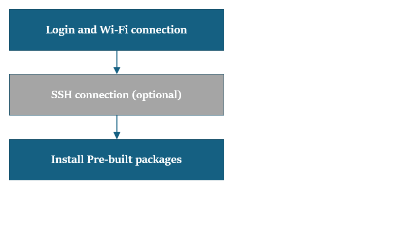

import Tabs from '@theme/Tabs';
import TabItem from '@theme/TabItem';

# Upgrade Canonical Ubuntu to Latest Build
 
This guide walks you through a streamlined process to update your system using prebuilt packages, while preserving your existing environment. The update is performed from a host computer—running Ubuntu, Windows®, or macOS®—to ensure your device benefits from the latest improvements in performance, security, and compatibility.  

	:::info 
		- **Before You Start** - Complete [**🔗setup**](../2.set-up-your-device.md#-lets-get-started) instructions.  
	:::
	
	### 🏁 Let’s Get Started!
	
    ### 1️⃣ Login & Wi-Fi Connection 
	**a**. Login and change password on the monitor UART console/SBC terminal.     
	**b**. Set up Wi-Fi connectivity. [🔗 Wi-Fi Setup Guide](../2.set-up-your-device.md#connect-to-the-network)  

	### 2️⃣ SSH Connection (Optional) 
	**a**. Get the IP address for RPi3.  
	**b**. On your host machine, use SSH to connect to the device.   
	```shell
	ssh ubuntu@<IP Address>
	```

	### 3️⃣ Upgrade Pre-built Packages 
	This command will upgrade to the latest pre-built packages on the device.  
	```shell
	sudo apt upgrade -y
	```
	:::note
	If you're new to Ubuntu and your software version is based on QLI or Android build, please follow the [**Flash Canonical Ubuntu 24.04**](https://www.thundercomm.com/rubik-pi-3/en/docs/rubik-pi-3-user-manual/1.0.0-u/Update-Software/3.2.Flash-using-Qualcomm-Launcher) path for flashing.
	:::

 If you haven’t previously installed the PPA packages, please run the following steps to install them:
	```shell
	git clone -b ubuntu_setup --single-branch https://github.com/rubikpi-ai/rubikpi-script.git 
	cd rubikpi-script  
	./install_ppa_pkgs.sh 
	```
	
	<details>
	The script installs the following   
	* Install AI samples application packages.  
	  (gstreamer1.0-plugins-base-apps, gstreamer1.0-qcom-python-examples, gstreamer1.0-qcom-sample-apps
	   gstreamer1.0-tools, libqnn-dev, libsnpe-dev, qcom-adreno1, qcom-fastcv-binaries-dev
	   qcom-libdmabufheap-dev, qcom-sensors-test-apps, qcom-video-firmware, qnn-tools, snpe-tools
	   tensorflow-lite-qcom-apps, weston-autostart, xwayland)  
	* Install Rubikpi3 Camera, wiringrp and wiringrp_python packages.  
	* Install generic developer tool related packages.  
	  (ffmpeg, net-tools, pulseaudio-utils, python3-pip, selinux-utils, unzip, v4l-utils)
	* Perform "sudo apt upgrade" operation.  
	</details>

	:::tip
	If you encounter package installation failures, run the following command: 'apt --fix-broken install'  
	If you encounter following error, rerun the install_ppa_pkgs.sh script.  
	GPG error: http://apt.thundercomm.com/rubik-pi-3/noble ppa InRelease: The following signatures couldn't be verified because the public key is not available:
	:::

	After successful running the install_ppa_pkgs.sh, you can observe the following screen on Display Monitor.  

	
 
	### 4️⃣ Verify the SW version 
		Run the following commands in the device shell to verify the version: 
			```shell
			cat /etc/os-release 
			```
		Output: 
			```json
		NAME="Ubuntu"
		VERSION_ID="24.04"
		VERSION="24.04.2 LTS (Noble Numbat)"
		VERSION_CODENAME=noble
		ID=ubuntu
		ID_LIKE=debian
		HOME_URL="https://www.ubuntu.com/"
		SUPPORT_URL="https://help.ubuntu.com/"
		BUG_REPORT_URL="https://bugs.launchpad.net/ubuntu/"
		PRIVACY_POLICY_URL="https://www.ubuntu.com/legal/terms-and-policies/privacy-policy"
		UBUNTU_CODENAME=noble
		LOGO=ubuntu-logo
		```
		Run the following command to check the Linux version:
			```shell
			uname -a
			```
		Output:
			```json
			Linux ubuntu 6.8.0-1055-qcom #55-Ubuntu SMP PREEMPT_DYNAMIC Wed Sep 17 02:03:34 UTC 2025 aarch64 aarch64 aarch64 GNU/Linux  
			```
 **🧭 Next Steps**  
 After successful software upgrade, refer to the [**Application Development and Execution Guide**](../7.Application%20Development%20and%20Execution%20Guide/index.md).  
