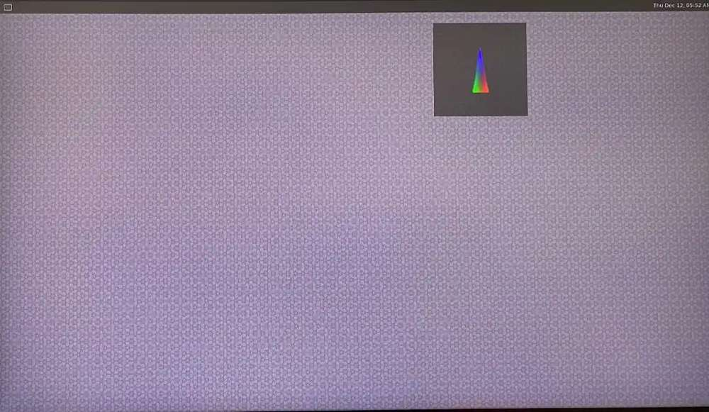
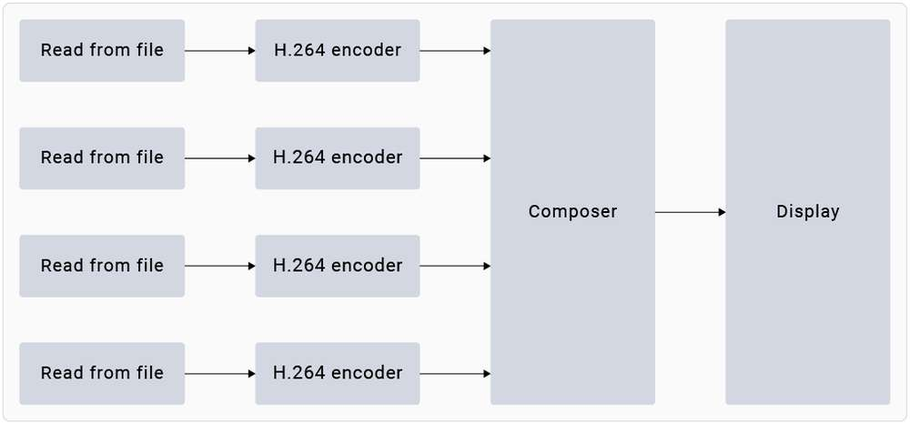
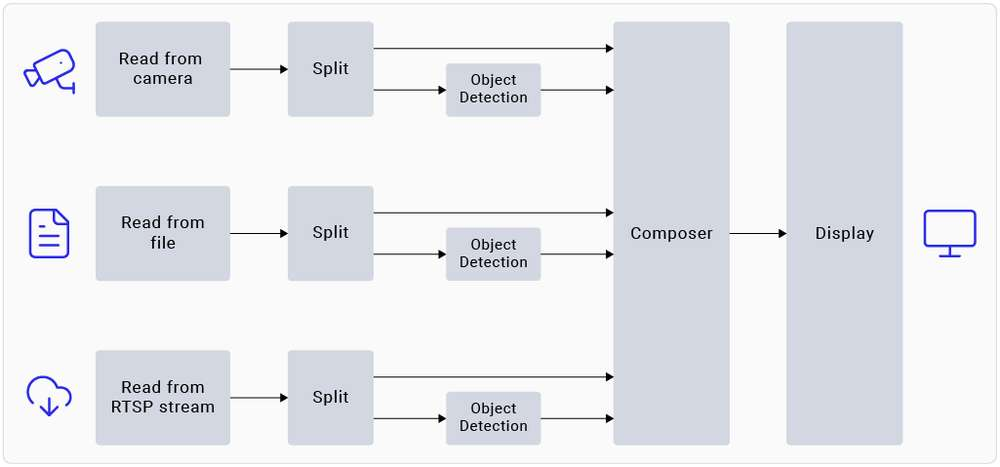

import Tabs from '@theme/Tabs';
import TabItem from '@theme/TabItem';

# Run sample applications

RUBIK Pi 3 Ubuntu 24.04 includes various sample applications. For details, see the Artificial Intelligence, Camera Software, and Robot Development chapters.

You can run these applications:

* [Run multimedia sample applications](#run-multimedia-sample-applications)
* [Run AI sample applications](#run-ai-sample-applications)
:::note
  
  * Running the application may result in high computational load. For a better experience, please install a fan.
  
  * To run the multimedia and AI applications, set up the Wi-Fi connection and establish an SSH connection.
  
  * To view the display output, connect an HDMI display to the HDMI port of RUBIK Pi 3 by referring to [Connect an HDMI display](1.quick-start/2.set-up-your-device.md#conHDMI).
  
  * To enable audio, please refer to the Audio section.
::: 

<a id="prererunsample"></a>
## Prerequisites for running sample applications

Before running the sample applications, enable the Weston display to activate the full functionality of the camera and AI capabilities. The steps are as follows:

1. Add the Qualcomm Public Personal Package Archive (PPA) to the Ubuntu sources.

   1. Add the Qualcomm PPA to the software sources of your RUBIK Pi 3 Ubuntu.

   ```shell
   sudo add-apt-repository ppa:ubuntu-qcom-iot/qcom-noble-ppa
   ```

   

   2. Update and install the dependencies.

   ```shell
   sudo apt update && sudo apt upgrade
   ```

2. Install Weston and test the basic display functionality.

   1. Install Weston and the related software packages.

   ```shell
   sudo apt install weston-autostart gstreamer1.0-qcom-sample-apps gstreamer1.0-tools qcom-fastcv-binaries-dev qcom-video-firmware weston-autostart libgbm-msm1 qcom-adreno1
   sudo reboot
   ```

   2. Set up the display environment as the root user.

   ```shell
   sudo -i
   export XDG_RUNTIME_DIR=/run/user/$(id -u ubuntu)
   ```

3. Connect the HDMI display and briefly wait for the Weston desktop to be displayed on the screen.

   :::note
   
   If the Weston desktop is not displayed properly, try entering the `sudo dpkg-reconfigure weston-autostart` command in the RUBIK Pi terminal.
   :::

4. To test the graphics, run the sample application. The following example runs the Weston-simple-egl:

   ```shell
   weston-simple-egl
   ```

   

<a id="runmediaapp"></a>
## Run multimedia sample applications

The multimedia sample applications show various use cases for the camera, display, and video streaming capabilities of RUBIK Pi.

<Tabs>
   <TabItem value="dashcam" label="Multi-camera streaming or encoding (dashcam)">

The `gst-multi-camera-example` command-line application demonstrates simultaneous streaming from two camera sensors on RUBIK Pi 3. This application composites the video streams side by side and displays them on a monitor, or encodes the video streams and saves them to a file.


**Example**

Before running the application, make sure the [Weston display is enabled](#prerequisites-for-running-sample-applications). To launch the application, run the following use case from the SSH terminal:

1. Install the camera-related software.

   1. Add the RUBIK Pi PPA to Ubuntu sources and update the package list:

       ```shell
       sudo sed -i '$a deb http://apt.rubikpi.ai ppa main' /etc/apt/sources.list
       sudo apt update
       ```

   2. Install the camera software.

       ```shell
       sudo apt install -y qcom-ib2c qcom-camera-server qcom-camx
       sudo apt install -y rubikpi3-cameras
       sudo chmod -R 755 /opt
       sudo mkdir -p /var/cache/camera/
       sudo touch /var/cache/camera/camxoverridesettings.txt
       sudo sh -c 'echo enableNCSService=FALSE >> /var/cache/camera/camxoverridesettings.txt'
       ```

2. To view the sample application on the HDMI display, run the following export command:

    ```shell
    export XDG_RUNTIME_DIR=/run/user/$(id -u ubuntu)/ && export WAYLAND_DISPLAY=wayland-1
    ```

   :::note
   
   If Weston is not automatically enabled, start two secure shell instances - one to enable Weston, and another to run the application.
   1. To enable Weston, run the following command in the first shell:
   
       `export GBM_BACKEND=msm && export XDG_RUNTIME_DIR=/run/user/$(id -u ubuntu)/ && mkdir -p $XDG_RUNTIME_DIR && weston --continue-without-input --idle-time=0`

   2. To set up the Wayland Display environment, run the following command in the second shell:
   
       `export XDG_RUNTIME_DIR=/run/user/$(id -u ubuntu)/ && export WAYLAND_DISPLAY=wayland-1`

   :::

3. To view the `waylandsink` output, run the following command:

   ```shell
   gst-multi-camera-example -o 0
   ```

4. To store the encoder output, follow these steps:

    1. Run the following command:

       ```shell
       gst-multi-camera-example -o 1
       ```

       The device will store the encoded files in `/opt/cam1_vid.mp4` and `/opt/cam2_vid.mp4`, for camera 1 and camera 2 respectively.

    2. Run the following command to extract the files from the host:
   
        ```shell
        scp ubuntu@<IP address of target device>:/opt/cam1_vid.mp4 <destination directory>
        ```

    3. To play the encoder output, use any media player that supports MP4 files.
   
* To stop the use case, press **Ctrl** + **C**.

* To display the available help options, run the following command:

    ```shell
    gst-multi-camera-example --help
    ```

* The `GST_DEBUG` environment variable controls the GStreamer debug output. Set the desired level to allow logging. For example, to log all warnings, run the following command:

    ```shell
    export GST_DEBUG=2
    ```
</TabItem>
<TabItem value="wall" label="Multichannel video decode and compose (Video wall)">

The gst-concurrent-videoplay-composition command-line application allows concurrent video decoding and playback for AVC-coded videos and composes them on a display for video wall applications. The application requires at least one input video file, which should be an MP4 file with the AVC codec.




Before running the application, make sure the [Weston display is enabled](#prerequisites-for-running-sample-applications). To launch the application, run the following use case from the SSH terminal:

1. Install the camera-related software.

   1. Add the RUBIK Pi PPA to Ubuntu sources and update the package list:

       ```shell
       sudo sed -i '$a deb http://apt.rubikpi.ai ppa main' /etc/apt/sources.list
       sudo apt update
       ```

   2. Install the camera software.

       ```shell
       sudo apt install -y qcom-ib2c qcom-camera-server qcom-camx
       sudo apt install -y rubikpi3-cameras
       sudo chmod -R 755 /opt
       sudo mkdir -p /var/cache/camera/
       sudo touch /var/cache/camera/camxoverridesettings.txt
       sudo sh -c 'echo enableNCSService=FALSE >> /var/cache/camera/camxoverridesettings.txt'
      ```

2. To transfer prerecorded or test videos that are in the AVC-encoded MP4 (H.264) format (with the filename as `<file_name>`) to your device, run the following command on the host computer:

    ```shell
    scp <file_name> ubuntu@[DEVICE IP-ADDR]:/opt/
    ```

3. To view the sample application on the HDMI display, run the following export command from the SSH terminal:

    ```shell
    export XDG_RUNTIME_DIR=/run/user/$(id -u ubuntu)/ && export WAYLAND_DISPLAY=wayland-1
    ```

:::note

If Weston is not automatically enabled, start two secure shell instances - one to enable Weston, and another to run the application.

  1. To enable Weston, run the following command in the first shell:
   
     `export GBM_BACKEND=msm && export XDG_RUNTIME_DIR=/run/user/$(id -u ubuntu)/ && mkdir -p $XDG_RUNTIME_DIR && weston --continue-without-input --idle-time=0`

  2. To set up the Wayland Display environment, run the following command in the second shell:
   
     `export XDG_RUNTIME_DIR=/run/user/$(id -u ubuntu)/ && export WAYLAND_DISPLAY=wayland-1`
:::

4. To start concurrent playback for four channels, run the following command:

```shell
gst-concurrent-videoplay-composition -c 4 -i /opt/<file_name1>.mp4 -i /opt/<file_name2>.mp4 -i /opt/<file_name3>.mp4 -i /opt/<file_name4>.mp4
```

:::note

 * `-c`: specifies the number of streams to be decoded for composition can be either 2, 4, or 8.

 * `-i`: specifies the absolute path to the input video file.
::: 

* To stop the use case, press **Ctrl** + **C**.

* To display the available help options, run the following command:

```shell
gst-concurrent-videoplay-composition --help
```

* The `GST_DEBUG` environment variable controls the GStreamer debug output. Set the required level to allow logging. For example, to log all warnings, run the following command:

```shell
export GST_DEBUG=2
```
</TabItem>
</Tabs>

<a id="runsampleapp"></a>
## Run AI sample applications

AI sample applications perform use cases for object detection and parallel inferencing on camera, video file, or Real-Time Streaming Protocol (RTSP) input streams on the RUBIK Pi 3 device. The procedure involves downloading the models from [Qualcomm® AI Hub](https://aihub.qualcomm.com/iot/models) and labels from GitHub, transferring them to RUBIK Pi 3, and running the sample applications.


**Prerequisites**

The device requires models and label files to run the AI sample applications.

<a id="proced"></a>
**Procedure**

Before running the application, make sure the [Weston display is enabled](#prerequisites-for-running-sample-applications). To launch the application, run the following use case from the SSH terminal:

1. Install the camera-related software.

   1. Add the RUBIK Pi PPA to Ubuntu sources and update the package list:

       ```shell
       sudo sed -i '$a deb http://apt.rubikpi.ai ppa main' /etc/apt/sources.list
       sudo apt update
       ```

   2. Install the camera software.

       ```shell
       sudo apt install -y qcom-ib2c qcom-camera-server qcom-camx
       sudo apt install -y rubikpi3-cameras
       sudo chmod -R 755 /opt
       sudo mkdir -p /var/cache/camera/
       sudo touch /var/cache/camera/camxoverridesettings.txt
       sudo sh -c 'echo enableNCSService=FALSE >> /var/cache/camera/camxoverridesettings.txt'
       ```

2. You need the following models for the AI sample applications:

    | Sample Application         | Required Model                          | Required label file          |
    |----------------------------|-----------------------------------------|------------------------------|
    | AI object detection        | yolov8_det_quantized.tflite             | yolonas.labels               |
    | Parallel AI inference      | yolov8_det_quantized.tflite             | yolov8.labels                |
    | Parallel AI inference      | inception_v3_quantized.tflite           | classification.labels        |
    | Parallel AI inference      | hrnet_pose_quantized.tflite             | hrnet_pose.labels            |
    | Parallel AI inference      | deeplabv3_plus_mobilenet_quantized.tflite | deeplabv3_resnet50.labels    |

3. Download and run the automated script to get the model and label files on the device:

    ```shell
    curl -L -O https://raw.githubusercontent.com/quic/sample-apps-for-qualcomm-linux/refs/heads/main/download_artifacts.sh
    ```

    ```shell
    chmod +x download_artifacts.sh
    ```

    ```shell
    ./download_artifacts.sh -v GA1.4-rel -c QCS6490
    ```

:::note

 The YOLOv8 models are not part of the script. You need to export these models using the Qualcomm AI Hub APIs.
:::

4. Export YOLOv8 from Qualcomm AI Hub.

    Follow these validated instructions to export models on your host computer using Ubuntu 22.04. You can also run these instructions on Windows through Windows Subsystem for Linux (WSL) or set up an Ubuntu 22.04 virtual machine on macOS. For more details, see Virtual Machine Setup Guide.

       1. Obtain the shell script for exporting the models:
    
          ```shell
          wget https://raw.githubusercontent.com/quic/sample-apps-for-qualcomm-linux/refs/heads/main/scripts/export_model.sh
          ```

       2. Update the script permissions to make it executable:
    
          ```shell
          chmod +x export_model.sh
          ```

       3. Run the export script with your Qualcomm AI Hub API token as the value for the --api-token argument:
   
          ```shell
          ./export_model.sh --api-token=<Your AI Hub API Token>
          ```

       :::note
       You can find your Qualcomm AI Hub API token in your [account settings](https://app.aihub.qualcomm.com/account/).
       :::
   
       4. The script downloads the models to the `build` directory. Copy these models to the */etc/models/* directory of your device using the following commands:
   
          ```shell
          scp <working directory>/build/yolonas_quantized/yolonas_quantized.tflite ubuntu@<IP address of target device>:/etc/models/
          ```

          ```shell
          scp <working directory>/build/yolov8_det_quantized/yolov8_det_quantized.tflite ubuntu@<IP address of target device>:/etc/models/
          ```
   

5. Update the `q_offset` and `q_scale` constants of the quantized LiteRT model in the JSON file. For instructions, refer to Get the model constants.

6. Use the following command to push the downloaded model files to the device:

    ```shell
    scp <model filename> ubuntu@<IP addr of the target device>:/etc/models
    ```

Example

```shell
wget https://thundercomm.s3.dualstack.ap-northeast-1.amazonaws.com/uploads/web/rubik-pi-3/tools/rubikpi3_ai_sample_apps_models_labels.zip
unzip rubikpi3_ai_sample_apps_models_labels.zip
cd rubikpi3_ai_sample_apps_models_labels
scp inception_v3_quantized.tflite ubuntu@<IP addr of the target device>:/etc/models/
scp yolonas.labels ubuntu@<IP addr of the target device>:/etc/labels/
```

7. Create a directory for test videos using the following commands:

    ```shell
    ssh ubuntu@<ip-addr of the target device>
    ```

    ```shell
    mount -o remount, rw /usr
    ```

    ```shell
    mkdir /etc/media/
    ```

8. From the host computer, push the test video files to the device:
 
    ```shell
    scp <filename>.mp4 ubuntu@<IP address of target device>:/etc/media/
    ```


<Tabs>
<TabItem value="AIobject" label="AI object detection">

The gst-ai-object-detection sample application demonstrates the hardware capability to detect objects on camera, video file, or RTSP input streams. The pipeline receives the input stream, preprocesses it, runs inferences on AI hardware, and displays the results on the screen.




**Example**

You must push the model and label files to the device to run the sample application. For details, see [Procedure](#proced).

1. Begin a new SSH session and start the HDMI display monitor if you haven't already:

    ```xml
    ssh ubuntu@<ip-addr of the target device>
    ```

2. To view the sample application on the HDMI display, run the following export command from the SSH terminal:

    ```typescript
    export XDG_RUNTIME_DIR=/run/user/$(id -u ubuntu)/ && export WAYLAND_ DISPLAY=wayland-1
    ```

:::note

If Weston is not automatically enabled, start two secure shell instances - one to enable Weston, and another to run the application.
  1. To enable Weston, run the following command in the first shell:
   
     `export GBM_BACKEND=msm && export XDG_RUNTIME_DIR=/run/user/$(id -u ubuntu)/ && mkdir -p $XDG_RUNTIME_DIR && weston --continue-without-input --idle-time=0`

  2. To set up the Wayland Display environment, run the following command in the second shell:
   
     `export XDG_RUNTIME_DIR=/run/user/$(id -u ubuntu)/ && export WAYLAND_DISPLAY=wayland-1`
:::

3. Modify the `/etc/configs/config_detection.json` file on your device.

```json
{
   "file-path": "/etc/media/video.mp4",
   "ml-framework": "tflite",
   "yolo-model-type": "yolov8",
   "model": "/etc/models/yolov8_det_quantized.tflite",
   "labels": "/etc/labels/yolonas.labels",
   "constants": "YOLOv8,q-offsets=<21.0, 0.0, 0.0>,q-scales=<3.0546178817749023, 0.003793874057009816, 1.0>;",
   "threshold": 40,
   "runtime": "dsp"
}
```
| Field           | Values/description |
|-----------------|--------------------|
| **ml-framework** | |
| snpe           | Uses the Qualcomm® Neural Processing SDK models |
| tflite         | Uses the LiteRT models |
| qnn            | Uses the Qualcomm® AI Engine direct models |
| **yolo-model-type** | |
| yolov5 yolov8 yolonas | Runs the YOLOv5, YOLOv8, and YOLO-NAS models, respectively. See Sample model and label files. |
| **runtime** | |
| cpu            | Runs on the CPU |
| gpu            | Runs on the GPU |
| dsp            | Runs on the digital signal processor (DSP) |
| **Input source** | |
| camera         | <p>0 – Primary camera</p><p>1 – Secondary camera</p> |
| file-path      | Directory path to the video file |
| rtsp-ip-port   | Address of the RTSP stream in `rtsp://<ip>:/<stream>` format |

4. To start the application, run the following command:

    ```python
    gst-ai-object-detection
    ```

* To stop the use case, press **Ctrl** + **C**.

* To display the available help options, run the following command:

    ```python
    gst-ai-object-detection -h
    ```

* The `GST_DEBUG` environment variable controls the GStreamer debug output. Set the required level to allow logging. For example, to log all warnings, run the following command:

    ```c++
    export GST_DEBUG=2
    ```
</TabItem>

<TabItem value="parallelAI" label="Parallel AI inference">

The gst-ai-parallel-inference command-line application demonstrates the hardware capability to perform four parallel AI inferences on camera, video file, or RTSP input streams. The pipeline detects objects, classifies objects, detects poses, and segments images on the input stream. The screen displays the results side-by-side.


**Example**

You must push the model and label files to the device to run the sample application. For details, see [Procedure](#proced).

1. Begin a new SSH session and start the HDMI display monitor if you haven't already:

```xml
ssh ubuntu@<ip-addr of the target device>
```

2. To view the sample application on the HDMI display, run the following export command from the SSH terminal:

```typescript
export XDG_RUNTIME_DIR=/run/user/$(id -u ubuntu)/ && export WAYLAND_ DISPLAY=wayland-1
```

:::note

 If Weston is not automatically enabled, start two secure shell instances - one to enable Weston, and another to run the application.

  1. To enable Weston, run the following command in the first shell:
   
     `export GBM_BACKEND=msm && export XDG_RUNTIME_DIR=/run/user/$(id -u ubuntu)/ && mkdir -p $XDG_RUNTIME_DIR && weston --continue-without-input --idle-time=0`

  2. To set up the Wayland Display environment, run the following command in the second shell:
   
     `export XDG_RUNTIME_DIR=/run/user/$(id -u ubuntu)/ && export WAYLAND_DISPLAY=wayland-1`

:::

3. Run the following command to push the downloaded model file to the device:

```shell
scp <model filename> ubuntu@<IP addr of the target device>:/etc/models
```

Example

```shell
wget https://thundercomm.s3.dualstack.ap-northeast-1.amazonaws.com/uploads/web/rubik-pi-3/tools/rubikpi3_ai_sample_apps_models_labels.zip
unzip rubikpi3_ai_sample_apps_models_labels.zip
cd rubikpi3_ai_sample_apps_models_labels
scp yolov8_det_quantized.tflite ubuntu@<IP addr of the target device>:/etc/models/
scp yolov8.labels ubuntu@<IP addr of the target device>:/etc/labels/

scp inception_v3_quantized.tflite ubuntu@<IP addr of the target device>:/etc/models/
scp classification.labels ubuntu@<IP addr of the target device>:/etc/labels/

scp hrnet_pose_quantized.tflite ubuntu@<IP addr of the target device>:/etc/models/
scp hrnet_pose.labels ubuntu@<IP addr of the target device>:/etc/labels/

scp deeplabv3_plus_mobilenet_quantized.tflite ubuntu@<IP addr of the target device>:/etc/models/
scp deeplabv3_resnet50.labels ubuntu@<IP addr of the target device>:/etc/labels/
```

4. To start the application, run the following command:

```plaintext
gst-ai-parallel-inference
```

* To stop the use case, press **Ctrl** + **C**.

* To display the available help options, run the following command:

```plaintext
gst-ai-parallel-inference -h
```

* Qualcomm AI Hub often updates models with the latest SDK versions. Using the wrong model constants may lead to inaccurate results. If you face such issues, update the model constants. Provide the model constants for the sample application using the following command:

```python
gst-ai-parallel-inference -s /etc/media/video.mp4 \
--object-detection-constants="YOLOv8,q-offsets=<21.0, 0.0, 0.0>,q-scales=<3.0546178817749023, 0.003793874057009816, 1.0>;" \
--pose-detection-constants="Posenet,q-offsets=<8.0>,q-scales=<0.0040499246679246426>;" \
--segmentation-constants="deeplab,q-offsets=<0.0>,q-scales=<1.0>;" \
--classification-constants="Inceptionv3,q-offsets=<38.0>,q-scales=<0.17039915919303894>;"
```

* The `GST_DEBUG` environment variable controls the GStreamer debug output. Set the required level to allow logging. For example, to log all warnings, run the following command:

```c++
export GST_DEBUG=2
```

Known issue

In pose detection, the model detects only one person, even if many people are present in the frame.

:::note

Image classification using the Inception v3 model trains on the ImageNet data set. As a result, the model can't detect a person because this class isn't included in the data set.
:::
</TabItem>
</Tabs>

## More applications

The release offers various sample applications. To explore more, see the Artificial Intelligence, Camera Software, and Robot Development chapters. 
