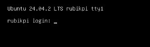

---
# Display h2 to h4 headings
toc_min_heading_level: 2
toc_max_heading_level: 4
---

import Tabs from '@theme/Tabs';
import TabItem from '@theme/TabItem';

# Ubuntu Desktop Vs Server  

**Ubuntu Desktop requires the open-source Freedreno graphics driver rather than the proprietary Qualcomm Adreno driver**. While the Adreno driver supports hardware-accelerated pre- and post-processing, it is not compatible with the standard Ubuntu Desktop environment. Freedreno ensures broader compatibility with desktop features and graphical applications in Ubuntu 24.04.
:::note
Ubuntu Server can still be used as a **SBC** (Single Board Computer) without host requirements.
:::

Ubuntu Desktop and Server are the two primary versions of the Ubuntu operating system, each tailored for distinct usage scenarios and requirements. The following are the main differences between them:

| Dimension         |  Desktop Version                   |  Server Version                   |
|-------------------|------------------------------------|-------------------------------------------|
| Design goal     | Interactive experience, multitasking                    | Service stability, resource efficiency                      |
| User interface     | Graphical (GNOME)                         | Wayland Display                             |
| Memory usage     | Relatively high (GUI resident)                         | Relatively low                                  |
| Qualcomm AI support | Supports non-graphical AI                     | Supported                   |
| GPU driver     | Uses freedreno                          | Uses adreno                           |
| CSI camera   | Supported                                    | Supported                           |


### Switch from Ubuntu desktop version to server version

  1. Refer to [Connect to the network](./2.Device%20Setup/set-up-your-device.md#conNET) to ensure proper network connectivity.  
  2. Execute the following commands to switch from the desktop version to the server version:
  :::warning
This process takes a long time to complete. Please do not interrupt it.
  :::
  ```shell
  sudo apt-get install qcom-adreno1
  sudo apt-get remove ubuntu-desktop
  sudo apt remove gdm3
  sudo reboot
  ```
  3. After the system boots, the following interface appears, indicating a successful switch:  
  
  4. Run the following commands to install pre-built packages on the device.    
  ```shell
  git clone -b ubuntu_setup --single-branch https://github.com/rubikpi-ai/rubikpi-script.git
  cd rubikpi-script
  ./install_ppa_pkgs.sh 
  ```
  5. Check the HDMI monitor and confirm expected visual pattern is displayed.  
   

### Switch from Ubuntu server version to desktop version

  1. Refer to [Connect to the network](./2.Device%20Setup/set-up-your-device.md#conNET) to ensure proper network connectivity.  
  2. Execute the following commands to switch from the server version to the desktop version:
  :::warning
This process takes a long time to complete. Please do not interrupt it.
  :::
  ```shell
  sudo apt install qcom-adreno1- libgbm-msm1- libegl-mesa0 libegl1 libgles2 libglvnd0 libvulkan1
  sudo apt install ubuntu-desktop
  sudo reboot
  ```
  1. After the system boots, the following interface appears, indicating a successful switch:
    
