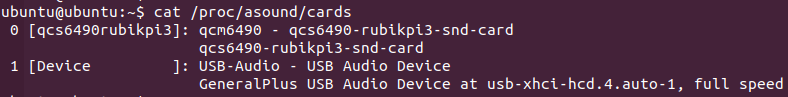
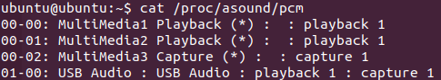

import Tabs from '@theme/Tabs';
import TabItem from '@theme/TabItem';

# Audio

RUBIK Pi 3 currently supports the following audio interfaces:
* 3.5mm headphone (No. 4 in the following figure)
* HDMI OUT (No. 9 in the following figure)
* USB Audio (No. 5, 6, 7 in the following figure)


This section describes how to perform audio playback, recording, and input/output interface switching when a UAC device is connected.

## Sound card

- The mounting order of the onboard sound card and the UAC device sound card mainly depends on the following factors:
  1. The connection interface of the UAC device.
  2. Whether the UAC device is connected before or after device boot-up.
- On RUBIK Pi 3, run the following command to check the mounted sound cards:
    ```shell
    cat /proc/asound/cards
    ```
    

    :::warning
    1. The following instructions assume that the onboard sound card is mounted as card 0, and the UAC device is mounted as card 1.
    2. The actual name and supported formats of UAC devices may vary. Please adjust commands accordingly based on your specific device.
    :::
- On RUBIK Pi 3, run the following command to check the allocated PCM stream list:
    

## ALSA

- On RUBIK Pi 3, run the following commands to install the ALSA utilities.

    ```shell
    sudo apt update
    sudo apt install alsa-utils
    ```

### Playback
    :::warning
    1. Run the following command to ensure the */opt* path has read/write permissions.
    2. Make sure the `WAV` test file (`<FileName>.wav`) has been pushed to the */opt* directory before running the command.
    :::

    ```shell
    sudo chmod 777 -R /opt
    paplay /opt/<FileName>.mp3
    ```
- 3.5mm headphone playback
    ```shell
    amixer -c 0 cset "name=DAC Playback Volume" 192
    amixer -c 0 cset "name=PRIMARY_MI2S_RX Audio Mixer MultiMedia1" 1
    aplay -Dplughw:0,0 /opt/<FileName>.wav
    ```
- HDMI OUT playback
    ```shell
    amixer -c 0 cset "name=QUATERNARY_MI2S_RX Audio Mixer MultiMedia2" 1
    aplay -Dplughw:0,1 /opt/<FileName>.wav
    ```
- UAC playback
    ```shell
    aplay -Dplughw:1,0 /opt/<FileName>.wav
    ```
### Recording
    :::warning
    Run the following command to ensure the */opt* path has read/write permissions.
    :::

    ```shell
    sudo chmod 777 -R /opt
    ```
* 3.5mm headphone recording
    ```shell
    amixer -c 0 cset "name=MultiMedia3 Mixer PRIMARY_MI2S_TX" 1
    arecord -Dplughw:0,2 -f S16_LE -r 48000 -c 1 -d 10 -t wav /opt/<FileName>.wav
    ```

* UAC recording
    :::warning
    Adjust the command parameters based on the formats actually supported by the UAC device.
    :::

    ```shell
    arecord -Dplughw:1,0 -f S16_LE -r 48000 -c 1 -d 10 -t wav /opt/<FileName>.wav
    ```

## PulseAudio
- On RUBIK Pi 3, run the following commands to install the PulseAudio utilities:

    ```shell
    sudo apt update
    sudo apt install pulseaudio pulseaudio-utils
    ```
    :::note
    Please run the Pulseaudio command under a non-root user. For example, use the `su ubuntu` command to switch to the ubuntu user.
    :::

### Set the audio output interface
    :::warning
    1. PulseAudio automatically switches audio output based on sink priority: UAC > 3.5mm headphone > HDMI OUT.
    2. Users can manually switch using the `set-default-sink` command. Once switched manually, the automatic strategy will be overridden until the sink is manually set back to the one with the highest priority.
    :::

- On RUBIK Pi 3, use the following command to view sink names and their priorities:
    ```shell
    pactl list sinks | grep -A5 -B1 -E 'Sink #|priority'
    ```
### Switch the audio output interface
    ```shell
    pactl set-default-sink <Sink-Name>
    ```
    Examples
    - Switch output to 3.5mm headphone:
    ```shell
    pactl set-default-sink alsa_output.platform-sound.HiFi__hw_qcs6490rubikpi3_0__sink
    ```
    - Switch output to HDMI OUT:
    ```shell
    pactl set-default-sink alsa_output.platform-sound.HiFi__hw_qcs6490rubikpi3_1__sink
    ```
    - Switch output to UAC device:
    :::warning
    Adjust the command according to the actual sink name of your UAC device.
    :::
    ```shell
    pactl set-default-sink alsa_output.usb-GeneralPlus_USB_Audio_Device-00.analog-stereo
    ```
### Set the audio input interface
:::warning
1. PulseAudio automatically switches audio input based on source priority: UAC > 3.5mm headphone.
2. Users can manually switch using the `set-default-source` command. Once switched manually, the automatic strategy will be overridden until the source is manually set back to the one with the highest priority.
:::

- On RUBIK Pi 3, run the following command to list available sources and their priorities:
    ```shell
    pactl list sources | grep -A5 -B1 -E 'Source #|priority'
    ```
### Switch the audio input interface
```shell
pactl set-default-source <Source-Name>
```
Examples:
    - Switch input to 3.5mm headphone:
    ```shell
    pactl set-default-source alsa_input.platform-sound.HiFi__hw_qcs6490rubikpi3_2__source
    ```
    - Switch input to UAC device:
    :::warning
    Adjust the command according to the actual source name of your UAC device.
    :::
    ```shell
    pactl set-default-source alsa_input.usb-GeneralPlus_USB_Audio_Device-00.mono-fallback
    ```
### Playback
    :::warning
    1. Run the following command to make sure the */opt* directory has read/write permissions.
    2. Before running the command, ensure the `MP3` test file (`<FileName>.wav`) has been pushed to the */opt* directory.
    :::

    ```shell
    sudo chmod 777 -R /opt
    ```

### Recording
    :::waring
    Run the following command to make sure the */opt* directory has read/write permissions.
    :::
    ```shell
    sudo chmod 777 -R /opt
    ```
    - On RUBIK Pi 3, run the following command to start recording:
    ```shell
    parecord /opt/<FileName>.mp3
    ```

