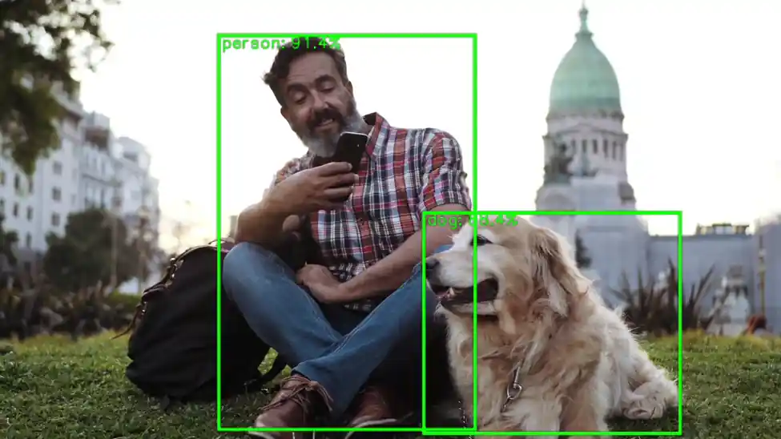

# Prebuilt Sample Applications

The **Qualcomm Intelligent Multimedia SDK (IMSDK)** includes a set of prebuilt sample applications designed to help developers quickly evaluate multimedia and AI capabilities on Qualcomm® hardware. These applications are built using **GStreamer pipelines** and **IMSDK plugins**, and serve as reference implementations for common use cases such as camera capture, video playback, object detection, pose estimation, and more.  
 
Prebuilt sample apps provide a fast and reliable way to:  
    * **Validate hardware functionality**: Confirm that camera, display, audio, and AI accelerators are working correctly on your development board.  
    * **Understand pipeline structure**: Learn how GStreamer pipelines are constructed using IMSDK plugins like `qtivtransform`, `qtimltflite`, and `qtivcomposer`.  
    * **Benchmark performance**: Measure throughput and latency for real-time multimedia and AI tasks using optimized pipelines.  
    * **Accelerate development**: Use working examples as a starting point for building custom applications. Each sample demonstrates best practices for zero-copy data flow, hardware offload, and plugin configuration.    

## Getting started with prebuilt applications 
To begin exploring prebuilt sample applications on the target device, follow these step-by-step instructions to install required dependencies and configure the system.  

#### 1️⃣ Before launching the sample apps, ensure the target device meets all the following prerequisites
    * **Ubuntu OS** should be flashed  
    * **Terminal access** with appropriate permissions    
    * If you haven’t previously installed the PPA packages, please run the following steps to install them.   
	```shell
	git clone -b ubuntu_setup --single-branch https://github.com/rubikpi-ai/rubikpi-script.git 
	cd rubikpi-script  
	./install_ppa_pkgs.sh 
	```

:::tip
Missing Dependencies  
* Ensure the install_ppa_pkgs.sh script has been executed successfully.  
* Run sudo apt update && sudo apt install -f to fix broken dependencies.  
* Verify that required GStreamer plugins (e.g., qtivtransform, qtimltflite) are installed.  
:::

#### 2️⃣ Download and run the artifact script   
Before running any sample applications, you'll need to download the required models, labels, and media assets. The download artifact script will automatically fetch all required components for running the sample applications, including:  
    * Models  
    * Labels  
    * Media files    

You can run the following commands on SSH or SBC terminal.
```shell
cd /home/ubuntu 
curl -L -O https://raw.githubusercontent.com/quic/sample-apps-for-qualcomm-linux/refs/heads/main/download_artifacts.sh
sudo chmod +x download_artifacts.sh 
sudo ./download_artifacts.sh -v GA1.5-rel -c QCS6490
```
**Explanation**  
* Use the `-v` flag to define the version you want to work with (e.g., GA1.5-rel).
* Use the `-c` flag to define the chipset your device is using.(e.g., QCS6490).

#### 3️⃣ Verify Model/Label/Media Files      
Before launching any sample applications, make sure the required files are in place.    

Check the following directories:    
    **Model files** → `/etc/models/`  
    **Label files** → `/etc/labels/`   
    **Media files** → `/etc/media/`  

:::note
These files are essential for AI apps to function correctly. If they’re missing, re-run the artifact download script.
:::

#### 4️⃣ List of prebuilt Sample Applications    

***Input Source*** – Media File; Output Source - Waylandsink    
***Model Precision*** - Quant model; Runtime - TFLite; Script used - JSON  

For **Multimedia sample applications**, please make sure the **CSI cameras** are connected    

| Sample App Name           |  Details   | AI Hub Model (Default)         |
|------------------------------|------------|--------------------------------|
|gst-ai-object-detection    | [Object Detection](https://docs.qualcomm.com/bundle/publicresource/topics/80-70020-50/gst-ai-object-detection.html?vproduct=1601111740013072&version=1.5&facet=Intelligent_Multimedia_SDK.SDK.2.0)| yolox_quantized
|gst-ai-daisychain-detection-pose    | [Daisychain Detection Pose](https://docs.qualcomm.com/bundle/publicresource/topics/80-70020-50/daisy-chain-detection-and-pose-detection.html?vproduct=1601111740013072&version=1.5&facet=Intelligent_Multimedia_SDK.SDK.2.0)| Yolo-X_w8a8, HRNetPose_w8a8
| gst-ai-face-detection     |  [Face detection](https://docs.qualcomm.com/bundle/publicresource/topics/80-70020-50/gst-ai-face-detection.html) | face_det_lite                
| gst-ai-segmentation       |  [Image segmentation](https://docs.qualcomm.com/bundle/publicresource/topics/80-70020-50/gst-ai-segmentation.html)  | Deeplabv3_plus_mobilenet 
| gst-ai-pose-detection     |  [Pose detection](https://docs.qualcomm.com/bundle/publicresource/topics/80-70020-50/gst-ai-pose-detection.html)  | hrnet_pose                
| gst-ai-monodepth          |  [Monodepth from video](https://docs.qualcomm.com/bundle/publicresource/topics/80-70020-50/mono-depth-from-video.html) | midas                                
| gst-camera-single-stream-example     |  [Single camera streaming](https://docs.qualcomm.com/bundle/publicresource/topics/80-70020-50/gst-camera-single-stream-example.html) | NA                
| gst-multi-camera-example    |  [Multi-camera streaming](https://docs.qualcomm.com/bundle/publicresource/topics/80-70020-50/gst-multi-camera-stream-example.html) | NA         
| gst-activate-deactivate-streams-runtime-example     |  [Activate-deactivate streams at runtime](https://docs.qualcomm.com/bundle/publicresource/topics/80-70020-50/gst-activate-deactivate-streams-runtime.html) | NA                

#### 5️⃣ Run Object Detection sample application
The gst-ai-object-detection application allows you to detect objects within images and videos. The use cases show the execution of YOLOv5, YOLOv8, and YOLOX using the Qualcomm Neural Processing SDK runtime, YOLOv8 using Qualcomm AI Engine direct, and YOLOv5 and YOLOv8 using LiteRT.  

Use the SSH or SBC terminal to launch your sample application.  
:::note
In case if the terminal is in root, then we need to set the following environment. Otherwise for ubuntu user, it is not required.  
```shell
export `XDG_RUNTIME_DIR=/run/user/$(id -u ubuntu)`
```
:::

 Run gst-ai-object-detection application by using following command.  

```shell
gst-ai-object-detection
```


To display the available help options, run the following command in the SSH shell:  
```shell
gst-ai-object-detection -h
```

To stop the use case, use **CTRL + C**


### Reference Documentation  
* [**Run AI/ML sample applications**](https://docs.qualcomm.com/bundle/publicresource/topics/80-70020-50/ai-ml-sample-applications.html)
* [**Get started with the Qualcomm IM SDK**](https://docs.qualcomm.com/bundle/publicresource/topics/80-70020-51/install-sdk.html#panel-0-VWJ1bnR1)


