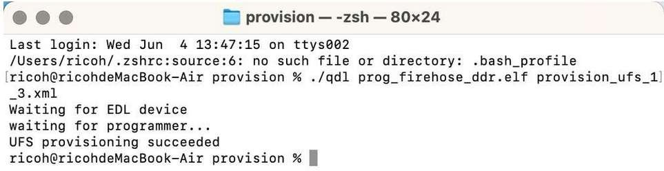

import Tabs from '@theme/Tabs';
import TabItem from '@theme/TabItem';

# Update software (Advanced)

This section describes how to download and flash the prebuilt images onto the RUBIK Pi 3 device from different host computers running Ubuntu, Windows, or mac operating systems.
This will ensure that the board will have the latest and greatest Ubuntu build available and ensure an easier experience moving forward.


:::warning

 Updating the software with the prebuilt images erases all data on your device and installs a newer image. Ensure you back up important data before you start.
::: 

## Download software

Visit the [RUBIK Pi 3 official website](https://www.thundercomm.com/rubik-pi-3/en/docs/image) to download the Ubuntu 24.04 software version.

<a id="enterEDL"></a>
## Enter EDL mode


<Tabs>
<TabItem value="method1" label="Manual Flow">

1. Press and hold the **[EDL]** button (No. 12 in the figure above).

   

2. Connect the power supply into port 10, as shown in the figure below.

   

3. Insert the Type-C cable into port 5 and wait three seconds to enter 9008 mode.

   
</TabItem>
<TabItem value="method2" label="Remote Access">

1. Connect the 20w power supply into port 10.

   

2. Insert the Type-C cable into port 5 and to your host machine.

   

3. After RUBIK Pi 3 boots up, run the following command to enter 9008 mode.

   ```shell
   adb shell reboot edl
   ```
</TabItem>
</Tabs>

<a id="flashQDL"></a>
## Flash using the QDL tool

The Qualcomm Device Loader (QDL) tool is a flashing utility that can be used to flash images to RUBIK Pi 3.
| Type                      | Architecture  | Link                                        |
|---------------------------|---------------|---------------------------------------------|
| Windows                   |  x86          | [Download link](https://softwarecenter.qualcomm.com/catalog/item/Qualcomm_Device_Loader?osArch=X86&osType=Windows&version=2.3.9.2)|
| Windows                   |  ARM64        | [Download link](https://softwarecenter.qualcomm.com/catalog/item/Qualcomm_Device_Loader?osArch=ARM64&osType=Windows&version=2.3.9.2)|
| Linux                     |  x86          | [Download link](https://softwarecenter.qualcomm.com/catalog/item/Qualcomm_Device_Loader?osArch=X86&osDist=Debian&osType=Linux&version=2.3.9.2)|
| Linux                     |  ARM64        | [Download link](https://softwarecenter.qualcomm.com/catalog/item/Qualcomm_Device_Loader?osArch=ARM64&osDist=Debian&osType=Linux&version=2.3.9.2)|
| MacOS                     |  x86          | [Download link](https://softwarecenter.qualcomm.com/catalog/item/Qualcomm_Device_Loader?osArch=X86&osType=macOS&version=2.3.6)|
| MacOS                     |  ARM64        | [Download link](https://softwarecenter.qualcomm.com/catalog/item/Qualcomm_Device_Loader?osArch=ARM64&osType=macOS&version=2.3.9.2)|

<Tabs>

<TabItem value="uhost" label="Ubuntu host">

1. Install libusb and libxml2 by executing the following command. (Skip this step if they are already installed.)

```shell
sudo apt-get install libxml2-dev libudev-dev libusb-1.0-0-dev
```

2. Go to the *ufs* directory of the FlatBuild package.

3. Based on the host architecture, copy the *qdl* from either the *QDL_Linux_x64* or *QDL_Linux_ARM* directory into the *ufs* directory.

4. Execute the following command to perform the flashing.

```shell
./qdl --storage ufs prog_firehose_ddr.elf rawprogram*.xml patch*.xml
```


5. If your RUBIK Pi 3 fails to boot up after flashing, click [here](https://thundercomm.s3.dualstack.ap-northeast-1.amazonaws.com/uploads/web/rubik-pi-3/firmware/provision.zip) to download the provision file and reconfigure the UFS.

:::warning
 * After provisioning, some information stored in the UFS, such as the SN and Ethernet MAC address, may be lost.

 * Before configuration, copy the *qdl* from either the *QDL_Linux_x64* or *QDL_Linux_ARM* directory to the *provision* directory, depending on your host architecture.
::: 

Go to the folder of the provision file you downloaded and run the following command to reconfigure the UFS.

```shell
./qdl prog_firehose_ddr.elf provision_ufs_1_3.xml
```


:::note
 After provisioning, remove and plug in the power supply and USB cable to restart your RUBIK Pi 3 and perform the image flashing again.
:::
</TabItem>
<TabItem value="whost" label="Windows host">

1. Run the executable in the extracted QDL_Win_x64 directory.   
 Install winUSB Driver:
   
   1a. Uninstall other drivers for the device.   
      Make sure driver like Qualcomm USB drivers (QUD) not installed. You may follow the screenshot to uninstall other drivers.   
      Make sure the “Delete the driver software for this device” is checked
       :::note 
        The RUBIK Pi device should not exist under the COM ports in Device Manager. If you see the device under the COM ports, right-click it and select **Uninstall device**.
      :::
          

         * Ensure that you check **Delete the driver software for this device**.

         

       1b. In the folder of QDL - Run install_driver.bat 

2. Power off the device, then reenter flashing mode. Use the following instructions/screenshots to install the Microsoft WinUSB driver:

      * In Device Manager, right-click the USB port for RUBIK Pi 3 and select **Update driver**.

      

      * Select **WinUsb Device** under **Model.**

      

      * Click **Yes** to complete the driver update.

      

2. In the terminal, use the following command to run the QDL executable from either the *QDL_Win_x64* or *QDL_Win_ARM64* directory, based on your host architecture, to flash the image. The device will automatically reboot once the flashing is complete. Make sure you're in the *ufs* directory of the FlatBuild package.

:::note
 * The program file names do not support wildcards. The command must list each image file explicitly.
 
 * Replace `<pathToQDL>` with the actual location of the *QDL_Win_x64* or *QDL_Win_ARM64* directory.
::: 

```shell
<pathToQDL>\QDL.exe prog_firehose_ddr.elf rawprogram0.xml rawprogram1.xml rawprogram2.xml rawprogram3.xml rawprogram4.xml rawprogram5.xml rawprogram6.xml patch1.xml patch2.xml patch3.xml patch4.xml patch5.xml patch6.xml
```


3. If your RUBIK Pi 3 fails to boot up after flashing, click [here](https://thundercomm.s3.dualstack.ap-northeast-1.amazonaws.com/uploads/web/rubik-pi-3/firmware/provision.zip) to download the provision file and reconfigure the UFS.

:::warning
 * After provisioning, some information stored in the UFS, such as the SN and Ethernet MAC address, may be lost.

 * Replace `<pathToQDL>` with the actual location of the *QDL_Win_ARM64* or *QDL_Win_x64* directory.
::: 

```shell
<pathToQDL>\QDL.exe prog_firehose_ddr.elf provision_ufs_1_3.xml
```


:::note
 After provisioning, remove and plug in the power supply and USB cable to restart your RUBIK Pi 3 and perform the image flashing again.
:::
</TabItem>
<TabItem value="mhost" label="macOS host">

1. Install Homebrew using the following method. (Skip this step if it is already installed.)

```shell
/bin/bash -c "$(curl -fsSL https://raw.githubusercontent.com/Homebrew/install/HEAD/install.sh)"
```

2. Run the following commands to install libusb and libxml2.

```shell
brew install libusb
brew install libxml2
```

3. Make sure you're in the *ufs* directory of the FlatBuild package.

4. Based on the host architecture, copy the contents from either the *QDL_Mac_x64* or *QDL_Mac_ARM* directory into the *ufs* directory.

5. Execute the following command to perform the flashing.

```shell
./qdl --storage ufs prog_firehose_ddr.elf rawprogram*.xml patch*.xml
```


6. If your RUBIK Pi 3 fails to boot up after flashing, click [here](https://thundercomm.s3.dualstack.ap-northeast-1.amazonaws.com/uploads/web/rubik-pi-3/firmware/provision.zip) to download the provision file and reconfigure the UFS.

:::note
 * After provisioning, some information stored in the UFS, such as the SN and Ethernet MAC address, may be lost.

 * Before configuration, copy the *qdl* from either the *QDL_Mac_x64* or *QDL_Mac_ARM* directory to the *provision* directory, depending on your host architecture.
::: 

```shell
./qdl prog_firehose_ddr.elf provision_ufs_1_3.xml
```



:::note
 After provisioning, remove and plug in the power supply and USB cable to restart your RUBIK Pi 3 and perform the image flashing again.
:::
</TabItem>

</Tabs>

## Subsequent steps

1. [Set up your device](../1.quick-start/3.set-up-your-device.md)

