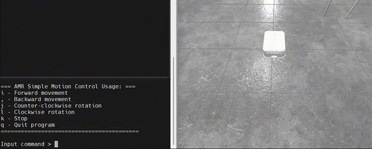
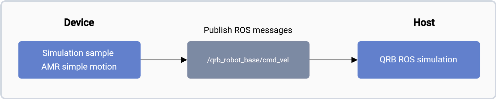

The Qualcomm® Intelligent Robotics (QIR) SDK for Ubuntu provides essential components for developing robotic features on Qualcomm platforms using the Ubuntu operating system.

## Key Features of the QIR SDK:  
•	**Reference ROS Packages**: Includes Robot Operating System (ROS) packages to support robotic application development.  
•	**End-to-End Scenario Samples**: Offers sample scenarios to help evaluate robotic platforms.  
•	**QRB ROS Transport**: Enables zero-copy transport of ROS messages on Qualcomm robotics platforms.  

:::note
 QRB ROS Transport is implemented based on [REP 2007](https://www.ros.org/reps/rep-2007.html), which defines interfaces for serializing custom types and supports intra-process communication without conversion.
:::

**Prerequisites**   
* **Ubuntu OS** should be flashed  
* **Terminal access** with appropriate permissions    
* If you haven’t previously installed the PPA packages, please run the following steps to install them.   
	```shell
	git clone -b ubuntu_setup --single-branch https://github.com/rubikpi-ai/rubikpi-script.git 
	cd rubikpi-script  
	./install_ppa_pkgs.sh 
	```

## Getting Started with QIR SDK on Ubuntu
This guide walks you through using QIR sample applications on development kits running Ubuntu.

## Setup Instructions:
1.	Fetch ROS2 and QIR SDK using scripts.
2.	Install the QIR SDK.
3.	Add ROS source to your device following the [ROS2 documentation](https://github.com/ros2/ros2_documentation/blob/jazzy/source/Installation/_Apt-Repositories.rst).
4.	Add Qualcomm public PPA archives to your Ubuntu software sources: 

```shell
sudo add-apt-repository ppa:ubuntu-qcom-iot/qcom-ppa   # qcom-ppa is usually already enabled in your system. Describe here just in case.
sudo add-apt-repository ppa:ubuntu-qcom-iot/qirp
```

5.	Install and configure the QIR SDK: 
```shell
sudo apt install qirp-sdk
source /usr/share/qirp-setup.sh
```

## Sample Applications
The QIR SDK includes a variety of sample applications categorized as follows:  
•	**Platform Sample Applications**: Demonstrate platform-level capabilities.  
•	**Robotics Sample Applications**: Enable robotic functionalities such as CPU load monitoring and robot simulation using ROS2.  


## Simulation Sample – AMR Simple Motion  
The **AMR simple motion** is a simulated sample application that uses a Python-based ROS node to control the movements of QRB autonomous moving robots (AMRs) within the simulator.  

The [qrb-ros-simulation](https://github.com/qualcomm-qrb-ros/qrb_ros_simulation) package provides a simulation environment. It allows you to control the movement of QRB AMRs through publishing the ROS messages to the /qrb_robot_base/cmd_vel topic.  
  

## Pipeline flow for QRB AMR simple motion  
The figure shows the pipeline of QRB AMR Simple Motion   
  


## ROS node used in the AMR simple motion pipeline  
 ROS node used in the AMR simple motion pipeline  
|ROS node	           |Description|
|----------------------|-------------|
|Qrb_ros-simulation    |qrb_ros_simulation is a ROS package designed to set up the Qualcomm robotic|


## Reference Documentation    
For details instructions to run the sample applications, please refer for [Qualcomm Intelligent Robotics SDK for Ubuntu](https://docs.qualcomm.com/bundle/publicresource/topics/80-90441-2/introduction_1.html).


