# Deploy OpenClaw on RUBIK Pi 3 (Ubuntu)

OpenClaw (formerly Clawd Bot) is a privacy-focused, self-hosted AI assistant gateway that connects chat platforms like WhatsApp, Telegram, and Lark to AI models. This guide will walk you through deploying OpenClaw on RUBIK Pi 3 running Ubuntu, using the MiniMax M2.1 model (pay-as-you-go) as an example, and covers integration with Lark and WhatsApp.

:::warning 
OpenClaw consumes tokens rapidly. When using pay-as-you-go mode, be sure to set up balance alerts to avoid unexpected high costs.
:::


**Official Resources:**

Website: https://openclaw.ai

GitHub: https://github.com/openclaw/openclaw

Documentation: https://docs.clawd.bot

## Prerequisites: Obtaining MiniMax API Key

This guide uses the **MiniMax M2.1** model as an example. Before installing OpenClaw, you need to obtain a MiniMax API Key first.

:::note 
OpenClaw supports multiple model providers (Anthropic Claude, OpenAI GPT, Google Gemini, local models, etc.). If you're using another provider, you can skip this section and select the corresponding provider during configuration.
:::

**1. Register and Top Up**

1. Visit the [MiniMax Open Platform](https://www.minimax.io/), register an account and log in.

2. Go to **Account** and complete the top-up (new MiniMax users receive a 15 yuan voucher).

3. **Highly Recommended**: Set up **balance alerts** in the User Center (e.g., alert when balance is below 30 yuan). OpenClaw consumes tokens quickly, so setting alerts in advance is essential to avoid unexpected high costs.
   
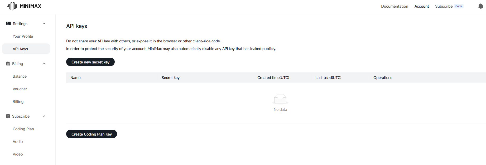

**2. Create API Key**

1. In the open platform, go to **Account** > **API Keys** > **Create new secret key**.

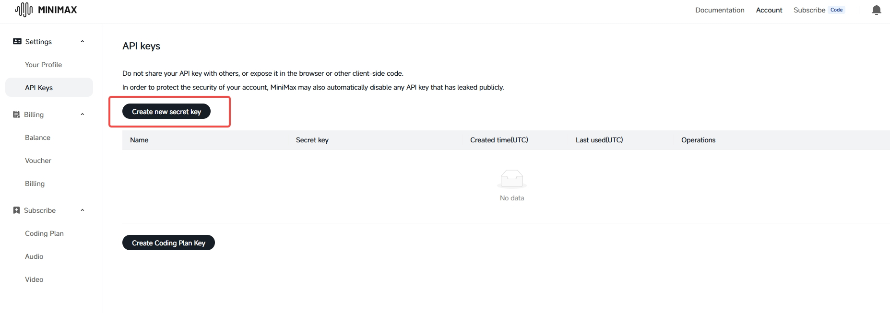

2. Enter a key name (any name works) and click **Create**.

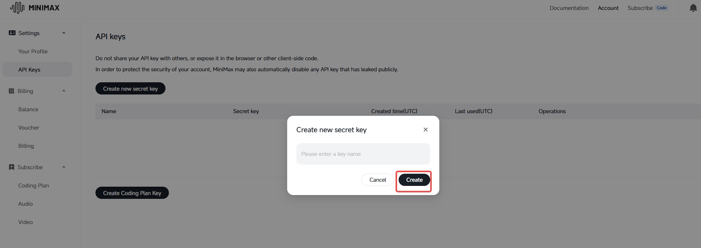

3. **Important:** The key is displayed only once after creation and cannot be viewed again. Make sure to immediately copy and save the key to a secure local location, as you'll need it multiple times during installation and configuration.

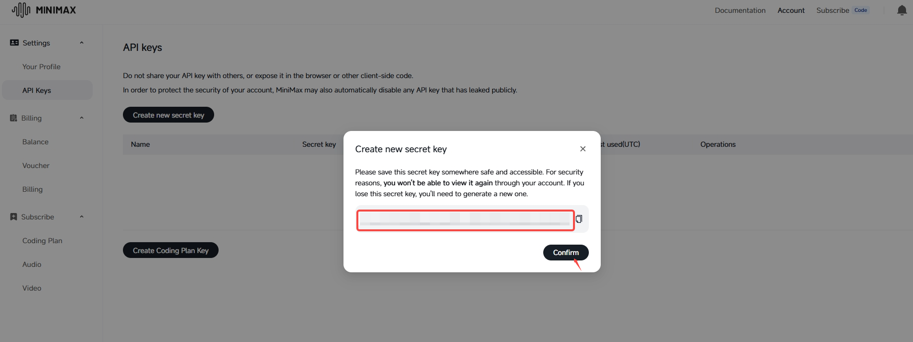

The result after creation is shown as follows:

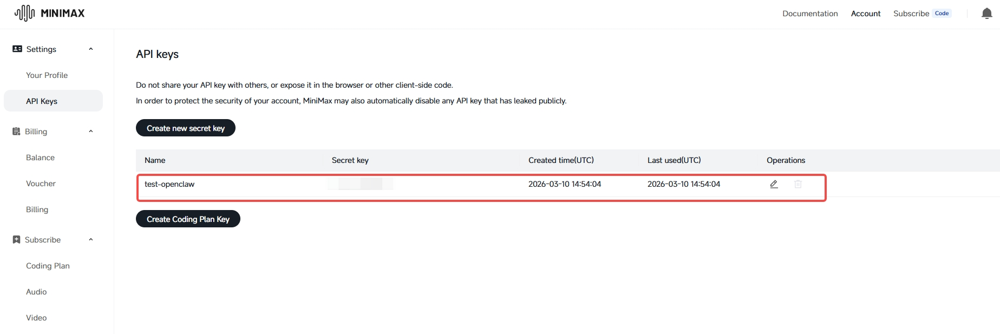

:::note
To activate the free quota, you need to complete verification on the platform.
:::


| Reference Documentation: [MiniMax OpenClaw Installation Guide](https://platform.minimax.io/docs/coding-plan/openclaw) |


## Part 1: Installing OpenClaw on RUBIK Pi 3

### 1. Check the system environment

OpenClaw requires **Node.js version ≥ 22**. RUBIK Pi 3's Ubuntu system doesn't have Node.js installed by default. You need to install it manually.

Open the terminal and check if Node.js is installed:
```
node -v
npm -v
```
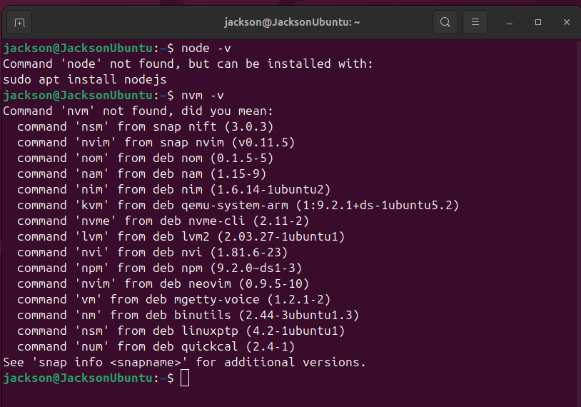

If you see "command not found" or the version is earlier than 22, proceed to the next step.

Check if **Git** is installed:

`git --version`

If Git is not installed, run the following command to install it:

`sudo apt update && sudo apt install -y git`

### 2. Install Node.js

It's recommended to use **nvm** (Node Version Manager) to install and manage Node.js versions.
```
# If curl is not available
sudo apt update 
sudo apt install curl -y
# Download and install nvm
curl -o- https://raw.githubusercontent.com/nvm-sh/nvm/v0.40.3/install.sh | bash
# Load nvm into the current terminal (no need to restart terminal)
\. "$HOME/.nvm/nvm.sh"
# Install Node.js (v22 or later)
nvm install 22
# Verify installation
node -v   # Display v22.x.x or higher
npm -v    # Display 10.x.x or higher
```
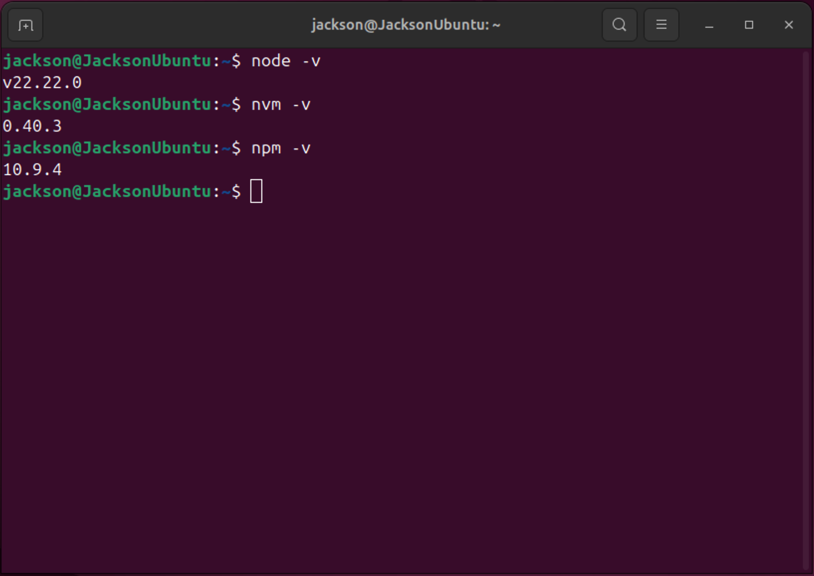

:::note 
You can also use `nvm install --lts` to install the latest LTS version. As long as the version is ≥ 22, OpenClaw will run normally.
:::

### 3. Check network connectivity

Before installing OpenClaw, ensure RUBIK Pi 3 can access the internet properly:
```
ping -c 3 github.com
ping -c 3 registry.npmjs.org
```

If you're behind a firewall or in a restricted network environment, set up a proxy:

(Optional): Set HTTP proxy if needed

```
export HTTP_PROXY=http://your_proxy_address:port
export HTTPS_PROXY=http://your_proxy_address:port
```

### 4. Install OpenClaw

Two installation methods are provided. Choose one based on your situation.

Open OpenClaw official website: https://openclaw.ai/

* Method A: One-click installation script (recommended)
```
curl -fsSL https://openclaw.bot/install.sh | bash
```

The script will automatically download and configure OpenClaw. Installation typically takes **5–10 minutes**, depending on network speed. If it's not complete after 15 minutes, consider switching to Method B.

Installation process screenshots:

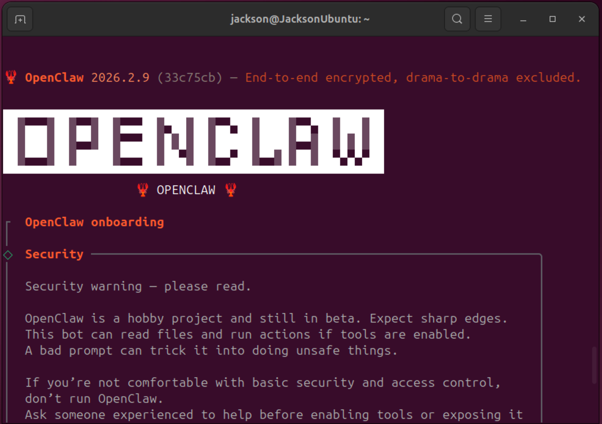


If you see the above interface, the installation is successful and you can proceed with configuration.

:::note
The interface may vary slightly depending on the version. `openclaw install successfully` indicates successful installation.
:::

* Method B: Install via npm
  
`npm i -g openclaw`

Verify installation:
`openclaw --version`

### 5. Configure OpenClaw (onboarding wizard)

After installation, the configuration wizard will start automatically. If it doesn't appear, run `openclaw onboard`

The complete configuration steps, using **MiniMax M2.1** as an example, are as follows:

| Step | Option | Selection |
| :--- | :--- | :--- |
| 1 | Onboarding mode | **QuickStart** |
| 2 | Model/auth provider | **MiniMax** |
| 3 | MiniMax auth method | **MiniMax M2.1** |
| 4 | Enter MiniMax API Key | Enter the API Key you obtained in the prerequisites |
| 5 | Default model | **Keep Current** |
| 6 | Configure channels (WhatsApp, etc.) | **Skip for now** (can be configured later in Web UI) |
| 7 | Configure skills now | **No** (can be configured later in Web UI) |
| 8 | Enable hooks | Use the space bar to select all three options, then press **Enter** to confirm. |
| 9 | Install shell completion script | **Yes** |

Configuration wizard screenshots (for reference only):

1. After download completes, you'll reach the installation screen. Select **Yes** and press **Enter**:
   

2. For **Onboarding mode**, select **QuickStart** and press **Enter**;
   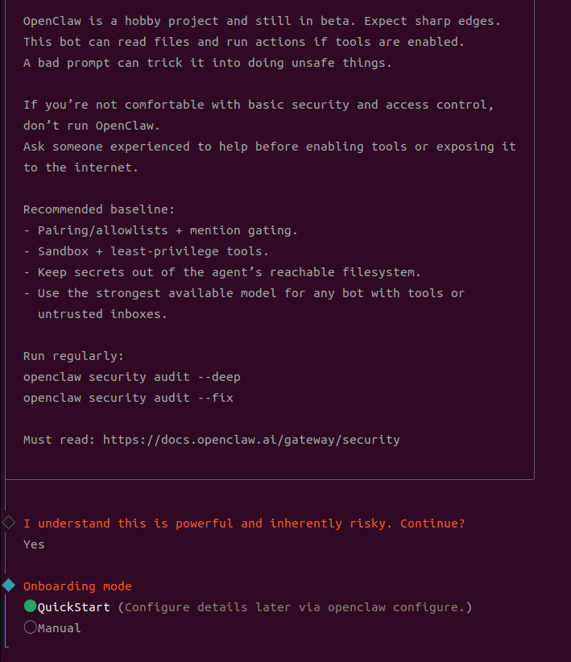

3. For **Model/auth provider**, select **MiniMax** and press **Enter**;
   

4. For **MiniMax auth method**, select **MiniMax M2.1** and press **Enter**;
   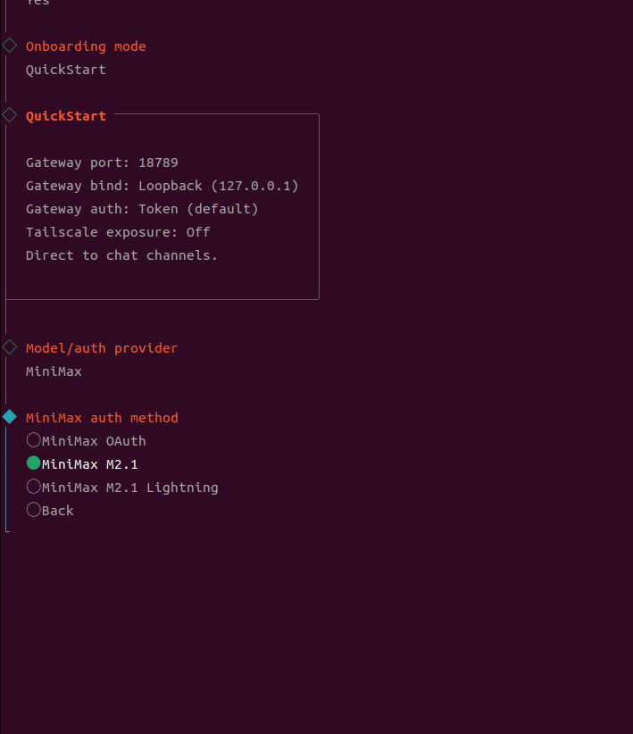

5.  For **Enter MiniMax API key**, enter the API Key generated in MiniMax and press **Enter**;
   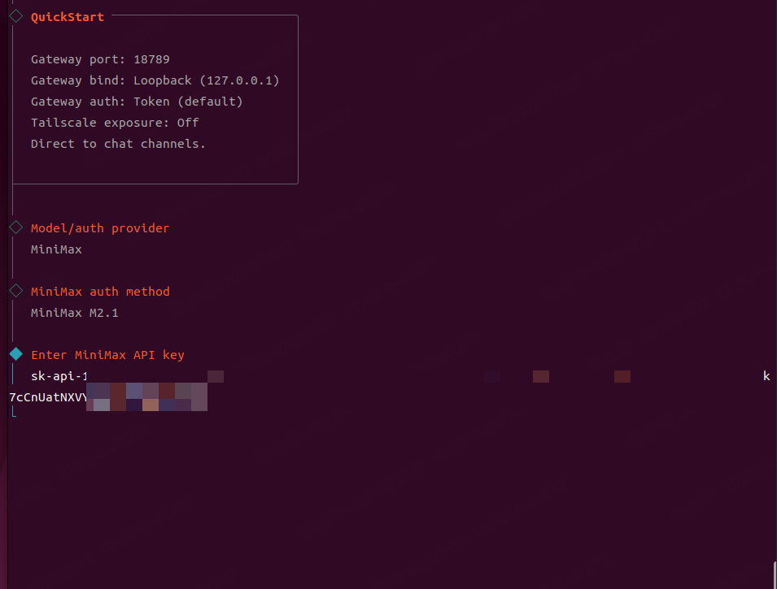

6.  For **Default model**, select **Keep Current**;
   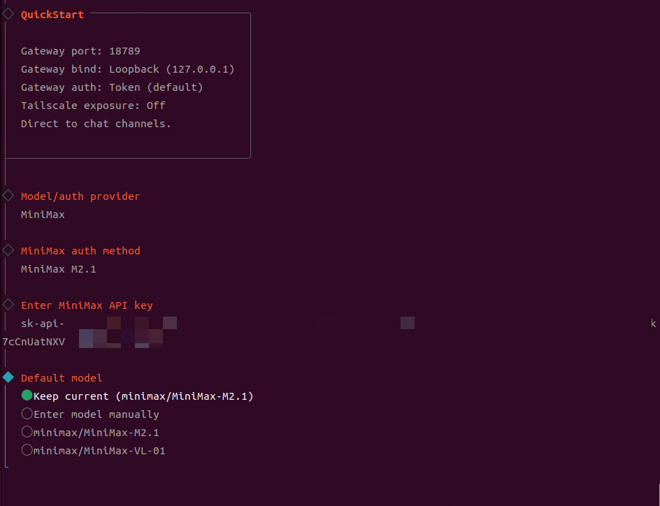

7.  Due to limitations, the following applications cannot be used for now, so select **skip for now**. You can reconfigure later in the web interface;
   

8.  For **Configure skills now**, select **No**. You can reconfigure later in the web interface;
   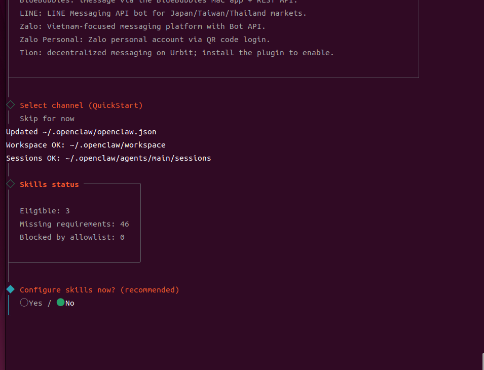

9.  For **Enable hooks**, select all three options below using the space bar and press **Enter** to install (if no Hooks option appears, you can also configure later in web);
    
    

10. For **Install shell completion script**, select **Yes** and press **Enter**. OpenClaw installation is now complete;
    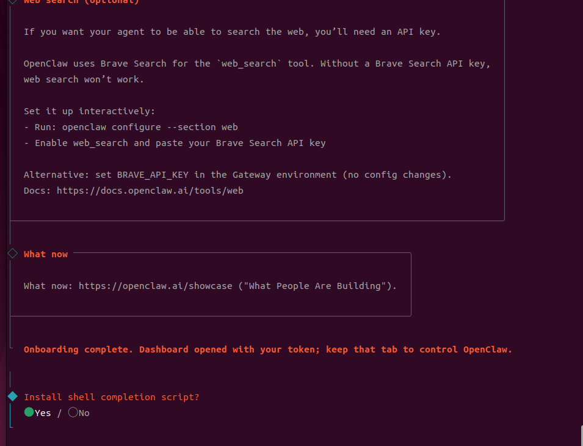

After installation, check OpenClaw status:
```
openclaw status 
```


**Configuration File**

All settings are saved in the `~/.openclaw/openclaw.json` file. You can directly edit this file for advanced configuration:

```openclaw config   # Open config file with default editor```

### 6. Complete key MiniMax configuration in web UI

**This step is crucial!** Even after completing the onboarding steps, you still need to confirm the following MiniMax configuration in Web UI, otherwise model calls may fail.

#### 6.1 Start gateway and access web UI

`openclaw gateway run`

#### 6.2 Get access token

First-time access to Web UI requires token authentication. Check the token:

`grep -n '"token"' ~/.openclaw/openclaw.json`

Enter the following URL in your browser:

http://127.0.0.1:18789/?token =your_token_value


Enter [127.0.0.1:18789] in the browser and view the chat page. An error appears. Don't worry about this error; adding the token to the URL will resolve it;

#### 6.3 Configure MiniMax model in web UI

After entering Web UI, complete the following settings on the model configuration page:

| Configuration | Value | Description |
| :--- | :--- | :--- |
| **Model Name** | MiniMax M2.1 | Must match the model name exactly |
| **API Key** | Token generated by openclaw via minimax api key | The key obtained in prerequisites |
| **Auth Header** | **Enabled (On)** | Must be enabled, otherwise authentication will fail |
| **Base URL** | https://api.minimaxi.com/anthropic |Keep the default value. **If you are in the Chinese Mainland, you must change to this address**|


After configuration, click **Save** and **Update** in the upper right corner, and wait for the update to complete (this may take some time).

### 7. Start the gateway and test

**Start Gateway**

```
# Start in the foreground (suitable for testing, logs visible)
openclaw gateway run

# Or start it as a background daemon
openclaw gateway start
```

**Verify Configuration**

Send a test message on the Chat page in Web UI. If you receive an AI reply, the configuration is correct.

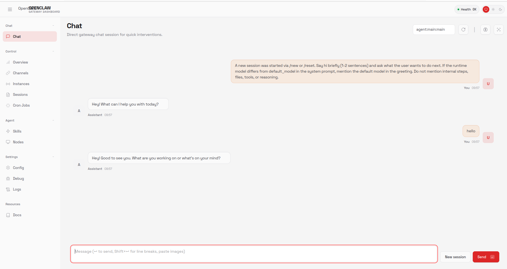

You can also use the terminal user interface for interactive testing:

```
openclaw tui 
```

Perform the test. Try something like: Create a folder named *yorick* on the desktop, generate a *yorickbao.txt* file, and copy the first blog post from [www.yorickbao.cn](http://www.yorickbao.cn/) into this *yorickbao.txt* file.

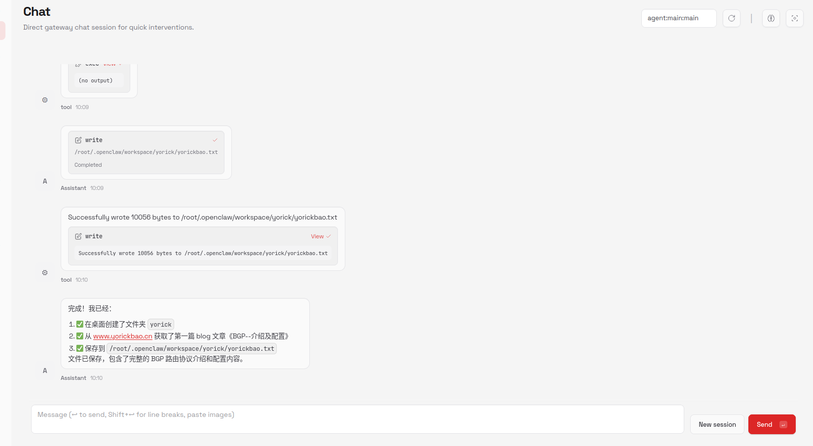
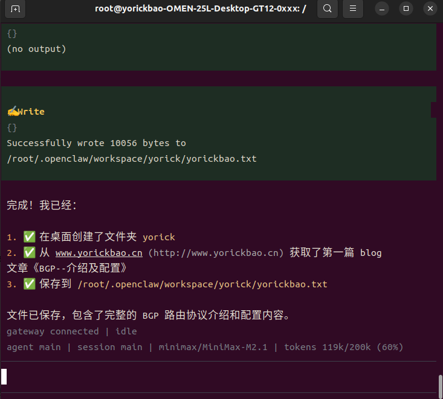

### 8. Common commands quick reference

| Command | Description |
| :--- | :--- |
| `openclaw onboard` | Run configuration wizard |
| `openclaw status` | Check OpenClaw running status |
| `openclaw config` | Edit configuration file |
| `openclaw config set <key> <value>` | Set configuration item |
| `openclaw gateway run` | Start gateway in foreground (logs visible) |
| `openclaw gateway start` | Start gateway in background |
| `openclaw gateway restart` | Restart gateway |
| `openclaw gateway stop` | Stop gateway |
| `openclaw tui` | Terminal User Interface (TUI) |
| `openclaw plugins list` | View installed plugins |
| `openclaw plugins install <package>` | Install plugin |
| `openclaw channels login` | Login to channel (e.g., WhatsApp QR scan) |
| `openclaw channels status` | Check channel connection status |
| `openclaw doctor` | Diagnose common issues |
| `openclaw logs --follow` | View logs in real time |

### Appendix: Build and Install from Source

If automatic installation fails, you can manually build and install from source.

#### Step 1: Install pnpm

```
npm i -g pnpm
pnpm -v   # Verify installation
```

#### Step 2: Clone the repository
```
git clone https://github.com/openclaw/openclaw.git
cd openclaw 
```


Go to the project directory:


Open the terminal:


#### Step 3: Install dependencies

```
pnpm install
```


#### Step 4: Build the UI

```
pnpm ui:build
```


#### Step 5: Build the project

```
pnpm build 
```
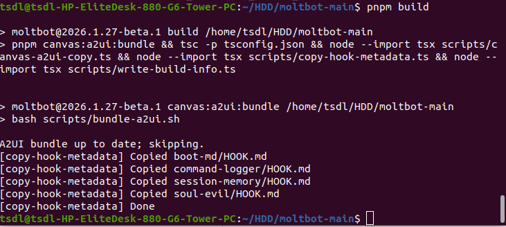

#### Step 6: Global link

```
npm link 
```

Now you can use the `openclaw` command globally. Go back to [Step 5: Configure OpenClaw](#5-configure-openclaw-onboarding-wizard) to continue setup.

## Part 2: Integrating with Feishu/Lark

Connect OpenClaw to **Feishu** (China) **Lark** (international) to enable your AI assistant to reply to messages in Lark.

**Plugin repository:** [github.com/m1heng/clawdbot-feishu](https://github.com/m1heng/clawdbot-feishu)

**Alternative plugin:** [github.com/AlexAnys/openclaw-feishu](https://github.com/AlexAnys/openclaw-feishu)

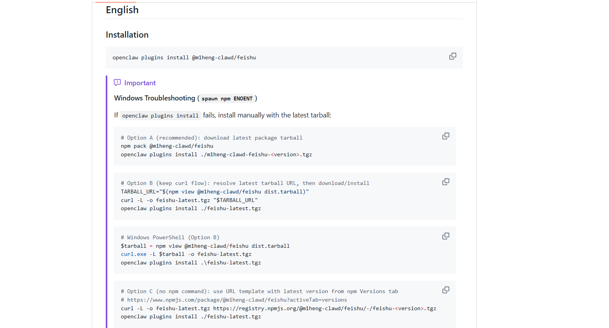

### 1. Install the Feishu plugin

```
openclaw plugins install @m1heng-clawd/feishu
```

If installation fails, try the following alternatives:

* Option A: Install from the alternative repository

```
openclaw plugins install https://github.com/AlexAnys/openclaw-feishu.git 
```

* Option B: Manually download and install

```
curl -O https://registry.npmjs.org/@m1heng-clawd/feishu/-/feishu-0.1.3.tgz
openclaw plugins install ./feishu-0.1.3.tgz 
```

Upgrade the installed plugin:

```
openclaw plugins update feishu 
```

### 2. Create the Feishu application

1. Go to the **Feishu Open Platform** developer console:

* Feishu (China): [https://open.feishu.cn/app](https://open.feishu.cn/app?lang=zh-CN)

* Lark (International): [https://open.larksuite.com/app](https://open.larksuite.com/app)

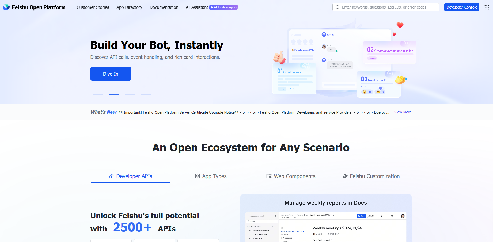

2. Click **Create Custom App**.

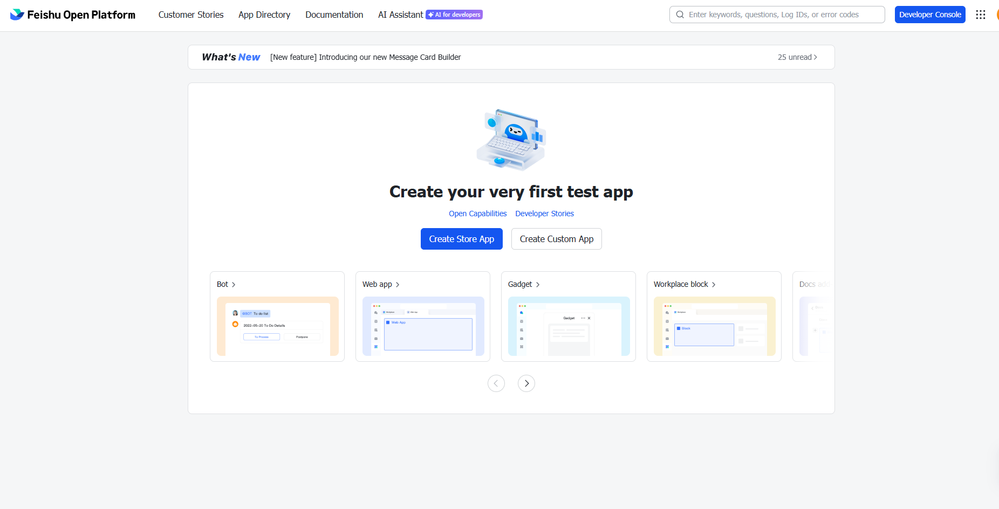

3. Fill in the app name, description, and icon.

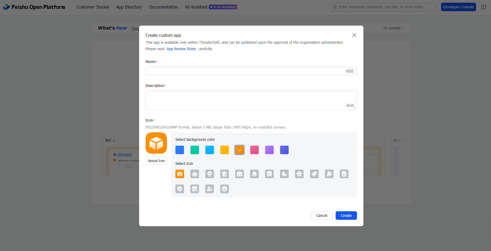

4. In **Add features to your app**, enable the **Bot** capability.
  
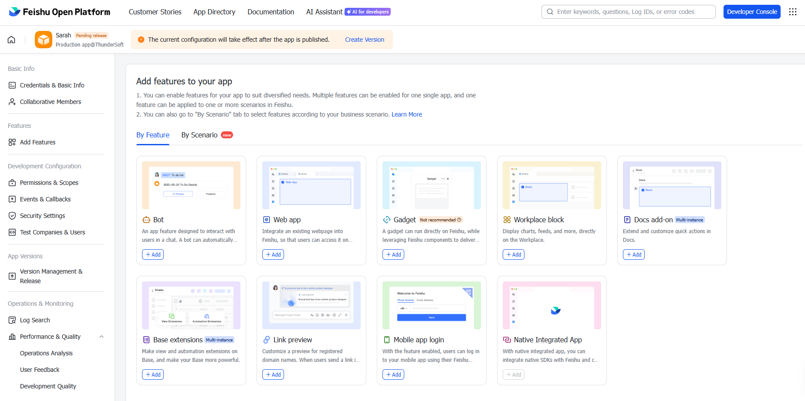

5. After creation, record the **App ID** (`cli_xxxxx`) and **App Secret**.


### 3. Configure the plugin

- **Method A: Quick installation and configuration**
  
Send the following message to your OpenClaw through any connected channel:

Install Feishu plugin for me: https://github.com/AlexAnys/openclaw-feishu

My Feishu app configuration is as follows:

App ID: cli_xxxxx
App Secret: your_app_secret

OpenClaw will automatically complete installation, configuration, and restart.

- **Method B: Command line configuration**

```
openclaw config set channels.feishu.enabled true --json
openclaw config set channels.feishu.appId "cli_xxxxx"
openclaw config set channels.feishu.appSecret "your_app_secret"
```

- **Method C: Modify the configuration file**
  
Modify `~/.openclaw/openclaw.json` and add Feishu configuration under `channels`:

```json
{
  "channels": {
    "feishu": {
      "enabled": true,
      "appId": "cli_xxxxx",
      "appSecret": "your_app_secret",
      // Domain: "feishu" (China) or "lark" (international)
      "domain": "feishu",
      // Connection mode: "websocket" (recommended) or "webhook"
      "connectionMode": "websocket",
      // Private chat policy: "pairing" | "open" | "allowlist"
      "dmPolicy": "pairing",
      // Group chat policy: "open" | "allowlist" | "disabled"
      "groupPolicy": "allowlist",
      // Whether @bot is required in group chats
      "requireMention": true,
      // Maximum media file size (MB, default 30)
      "mediaMaxMb": 30,
      // Reply render mode: "auto" | "raw" | "card"
      "renderMode": "auto"
    }
  }
}
```

:::note
For Lark users: Change `"domain": "feishu"` to `"domain": "lark"`.
:::

### 4. Configure permissions

In the Feishu Open Platform console, go to your app's **Permissions & Scopes** page.

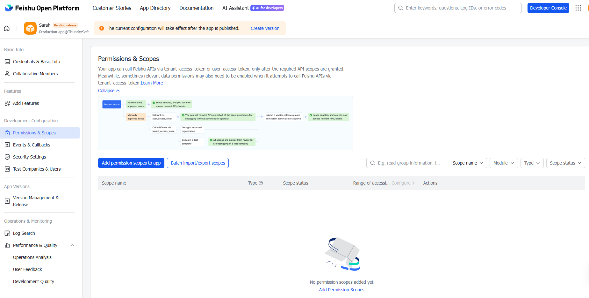

**Required Permissions**

| Permission | Scope | Description |
| :--- | :--- | :--- |
| `contact:user.base:readonly` | User Info | Get basic user information (for parsing sender names, avoiding treating different people as the same people in group/private chats) |
| `im:message` | Messages | Send and receive messages |
| `im:message.p2p_msg:readonly` | Private Chat | Read private messages sent to the bot |
| `im:message.group_at_msg:readonly` | Group Chat | Receive @bot messages in groups |
| `im:message:send_as_bot` | Send | Send messages as bot |
| `im:resource` | Media | Upload and download images/files |

**Tool Permissions (Read-Only)**

| Permission | Tool | Description |
| :--- | :--- | :--- |
| `docx:document:readonly` | feishu_doc | Read documents |
| `drive:drive:readonly` | feishu_drive | List folders, get file information |
| `wiki:wiki:readonly` | feishu_wiki | List spaces, list nodes, get node details, search |

**Tool Permissions (Read-Write)**

| Permission | Tool | Description |
| :--- | :--- | :--- |
| `docx:document` | feishu_doc | Create/edit documents |
| `docx:document.block:convert` | feishu_doc | Markdown to blocks (required for write/append) |
| `drive:drive` | feishu_doc, feishu_drive | Upload images to documents, create folders, move/delete files |
| `wiki:wiki` | feishu_wiki | Create/move/rename wiki nodes |

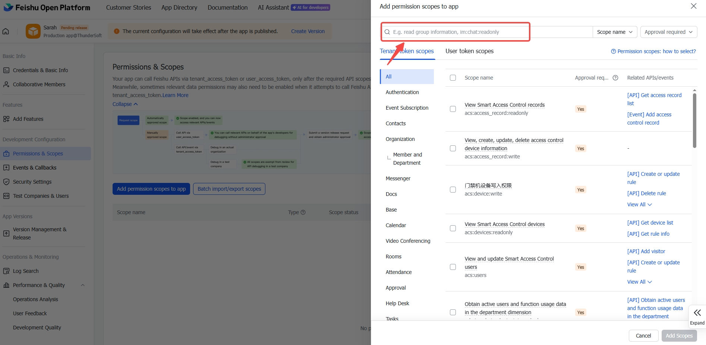

### 5. Configure events and callbacks

**Event subscription**

1. In app settings, go to the **Events & Callbacks** page.

2. Select **Receive events through persistent connection** as the event subscription mode (recommended).

3. Add the following events:

- `im.message.receive_v1` — Receive message events

- `im.message.reaction.created_v1` — Message reaction event (optional)

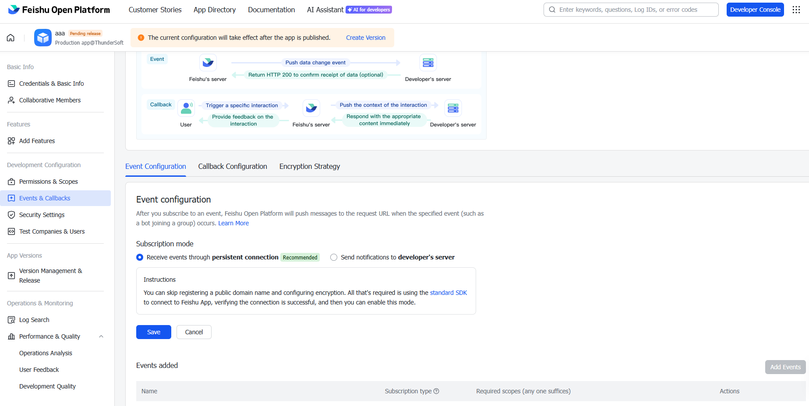

**Callback Configuration**

1. Go to the **Callback Configuration** page.

2. Select **Receive callbacks through persistent connection** to receive callbacks.

3. Add callback: **Card Interaction Callback**.

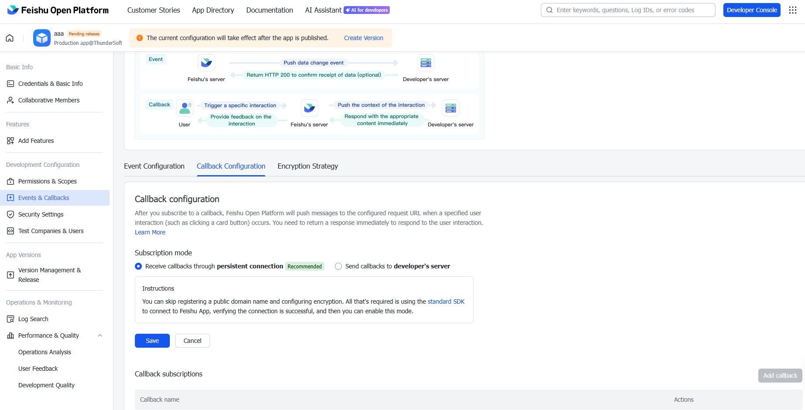

### 6. Publish and test

1. In the Feishu developer console, select **Version Management and Release**.

2. Create a new version and submit for release.

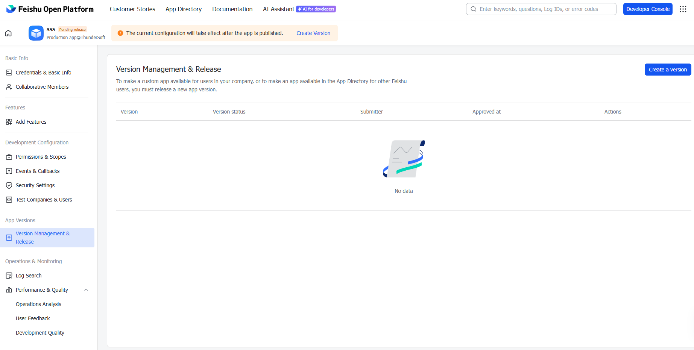

3. After approval, search for your bot in Lark to start chatting!

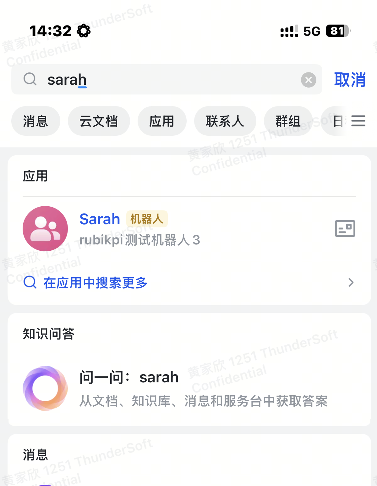
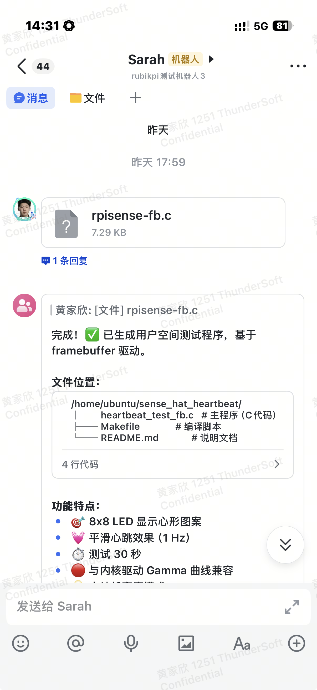

**Restart gateway** for the configuration to take effect:

```
openclaw gateway restart
```

## Part 3: Integrating with WhatsApp

OpenClaw supports WhatsApp through **WhatsApp Web (Baileys)**. The gateway manages sessions directly—no Twilio or Business API required.

**Official Documentation:** [https://docs.clawd.bot/whatsapp](https://docs.clawd.bot/channels/whatsapp)

### 1. Prerequisites

- OpenClaw installed and configured (see Part 1)

- A **phone number** for WhatsApp:

   - **Dedicated number (recommended):** Use a separate phone number for the bot. Best experience, clear routing.
   
   - **Personal number (alternative):** Use your own WhatsApp number. Use the "message yourself" feature for testing.

:::note
Phone number recommendations:

- Use real phone numbers—VoIP and virtual numbers are usually banned by WhatsApp.

- A local prepaid SIM card or eSIM will work.

- The number is only used to receive verification SMS once. Sessions are then persisted via `creds.json`.

- **Avoid:** TextNow, Google Voice, and most "free SMS" services. WhatsApp actively bans these numbers.
:::

### 2. Configure the WhatsApp channel

**Minimal configuration**

Modify `~/.openclaw/openclaw.json` and add the WhatsApp channel:

```json
{
  "channels": {
    "whatsapp": {
      "dmPolicy": "allowlist",
      "allowFrom": ["+8613800138000"]  // Your phone number in E.164 format
    }
  }
} 
```

Recommended starter configuration:

```json
{
  "identity": {
    "name": "MyAssistant",
    "theme": "helpful assistant",
    "emoji": "🦞"
  },
  "agent": {
    "workspace": "~/.openclaw/workspace",
    "model": {
      "primary": "anthropic/claude-sonnet-4-5"
    }
  },
  "channels": {
    "whatsapp": {
      "dmPolicy": "allowlist",
      "allowFrom": ["+8613800138000"],
      "groups": {
        "*": { "requireMention": true }
      }
    }
  }
} 
```

Personal number mode (self-chat mode):

If using your own WhatsApp number:

```json
{
  "channels": {
    "whatsapp": {
      "selfChatMode": true,
      "dmPolicy": "allowlist",
      "allowFrom": ["+8613800138000"]  // Your own WhatsApp number
    }
  }
} 
```

**Pairing Mode**

Use pairing mode instead of allowlist. Unknown senders will receive a one-time pairing code:

```json
{
  "channels": {
    "whatsapp": {
      "dmPolicy": "pairing"
    }
  }
} 
```

Approve new users:

```
openclaw pairing list whatsapp
openclaw pairing approve whatsapp <pairing_code> 
```


### 3. Link the WhatsApp account

Scan QR code to link OpenClaw as a WhatsApp Web device:

Run `openclaw channels login`.

The terminal will display a QR code. On your phone:

1. Open **WhatsApp** → **Settings** → **Linked devices**.

2. Tap **Link a Device**.

3. Scan the QR code displayed in the terminal.

Multi-account setup:

```
openclaw channels login --account work 
```

:::note
**Credentials** are saved in `~/.openclaw/credentials/whatsapp/<accountId>/creds.json` and automatically backed up as `creds.json.bak`.
:::

### 4. Start the gateway

```
openclaw gateway --verbose
```

Send a test message to the linked WhatsApp number. You should see the bot reply.

Check connection status:

```
openclaw channels status
```

### 5. Advanced configuration

**Group chat settings**

```json
{
  "channels": {
    "whatsapp": {
      // Group chat access policy: "open" | "disabled" | "allowlist" (default)
      "groupPolicy": "allowlist",
      // Who can trigger the bot in group chats
      "groupAllowFrom": ["+8613800138000"],
      "groups": {
        // "" Applies to all groups
        "": {
          // Whether an @ mention is required to trigger it (default: true)
          "requireMention": true
        }
      }
    }
  }
} 
```

**Automatic confirmation with a reaction**

Send emoji reaction immediately when receiving messages:

```json
{
  "channels": {
    "whatsapp": {
      "ackReaction": {
        "emoji": "👀",
        "direct": true,
        "group": "mentions"  // "always" | "mentions" | "never"
      }
    }
  }
} 
```

**Read receipts**

Disable blue double check marks (read receipts):

```json
{
  "channels": {
    "whatsapp": {
      "sendReadReceipts": false
    }
  }
} 
```

**Message limits**

```json
{
  "channels": {
    "whatsapp": {
      // Maximum received media file size (default 50 MB)
      "mediaMaxMb": 50,
      // Maximum text length per message (default 4000 characters)
      "textChunkLimit": 4000,
      // Split by paragraph then by length
      "chunkMode": "newline"
    }
  }
} 
```

**Multi-account setup**

Run multiple WhatsApp accounts in one gateway:

```json
{
  "channels": {
    "whatsapp": {
      "accounts": {
        "personal": {
          "selfChatMode": true,
          "allowFrom": ["+8611111111111"]
        },
        "work": {
          "allowFrom": ["+8622222222222", "+8633333333333"],
          "ackReaction": { "emoji": "✅" }
        }
      }
    }
  }
} 
```

Login to each account separately:

```
openclaw channels login --account personal
openclaw channels login --account work 
```

### 6. Troubleshooting

View real-time logs for debugging:

```
openclaw logs --follow 
```

Log file location: `/tmp/openclaw/openclaw-YYYY-MM-DD.log`

## Quick Reference: Running Multiple Channels Simultaneously

Run WhatsApp and Lark simultaneously:

```json
{
  "identity": {
    "name": "MyAssistant",
    "theme": "helpful assistant",
    "emoji": "🦞"
  },
  "agent": {
    "workspace": "~/.openclaw/workspace",
    "model": {
      "primary": "anthropic/claude-sonnet-4-5"
    }
  },
  "channels": {
    "whatsapp": {
      "dmPolicy": "allowlist",
      "allowFrom": ["+8613800138000"],
      "groups": { "*": { "requireMention": true } }
    },
    "feishu": {
      "enabled": true,
      "appId": "cli_xxxxx",
      "appSecret": "your_app_secret",
      "domain": "feishu",
      "connectionMode": "websocket",
      "dmPolicy": "pairing",
      "requireMention": true
    }
  }
} 
```

Then start or restart the gateway:

```
openclaw gateway restart
```

## FAQ

**Q: After linking WhatsApp, will OpenClaw automatically send messages to my contacts?**

A: No. The default DM policy is `pairing`. Unknown senders will only receive a pairing code, and their messages **will not be processed**. OpenClaw only replies to messages it receives or sends messages that you actively trigger.

**Q: Can I use Feishu and Lark simultaneously?**

A: Yes. Set `"domain": "feishu"` for the China version and `"domain": "lark"` for the international version. You can also run multiple Feishu/Lark apps with different configurations.

**Q: What AI models are supported?**

A: OpenClaw supports Anthropic (Claude), OpenAI (GPT), MiniMax, Google (Gemini), local models via LM Studio/Ollama, and any OpenAI-compatible API.

**Q: How do I update OpenClaw?**

A: Run `npm i -g openclaw` to upgrade to the latest version, or use `openclaw update` (if supported).

**Q: RUBIK Pi 3 uses ARM architecture. Can OpenClaw run on it?**

A: Yes. OpenClaw is a Node.js application that can run on any platform supporting Node.js 22+, including the ARM64 (aarch64) architecture used by RUBIK Pi 3.