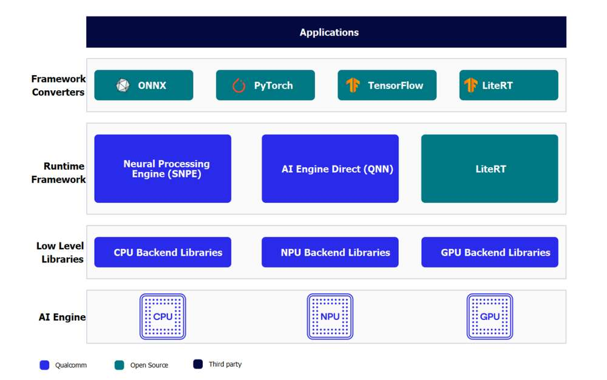
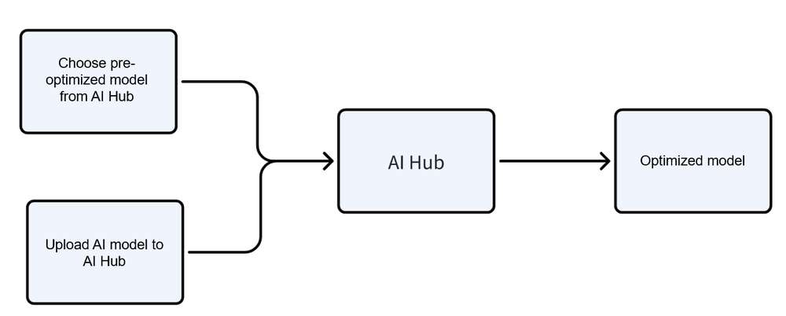
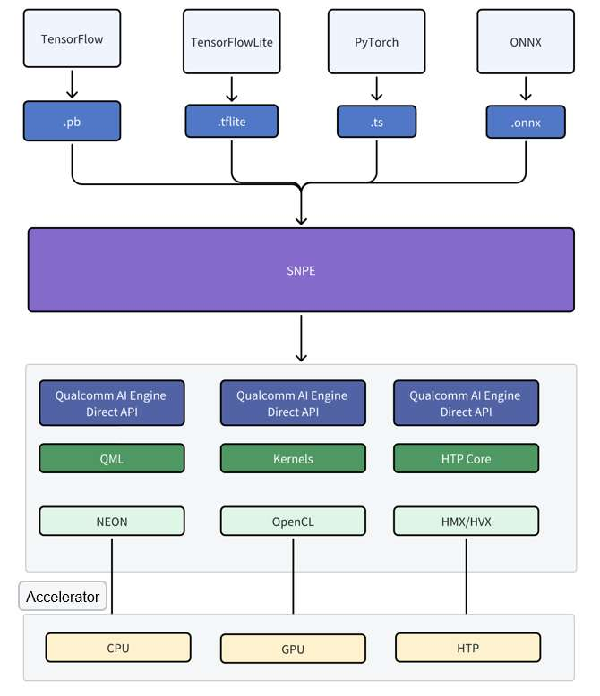
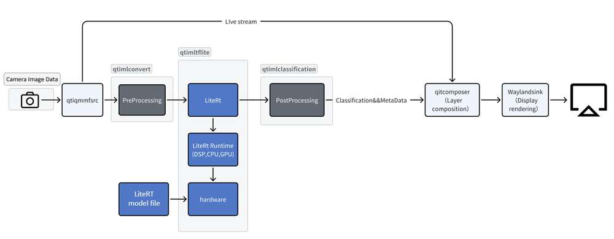
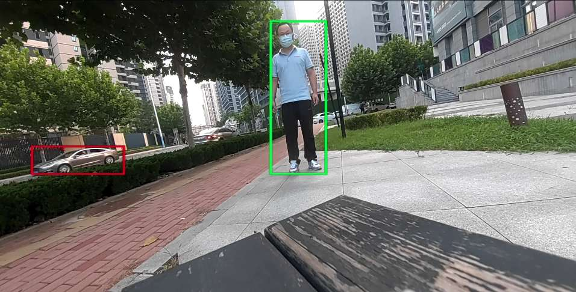
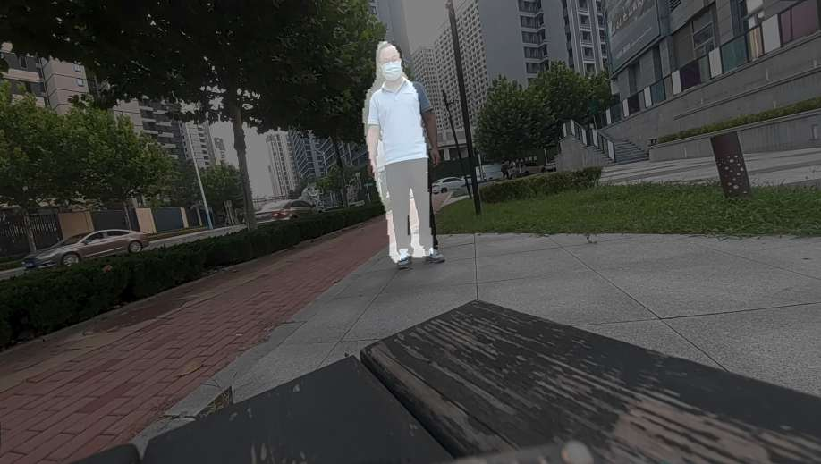
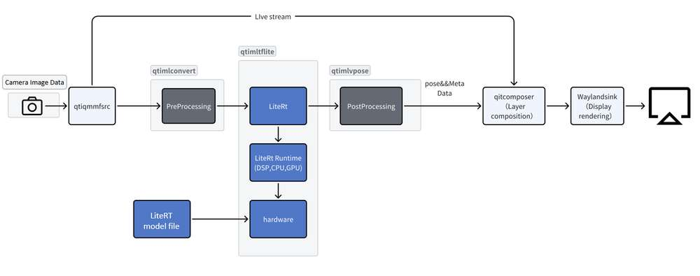
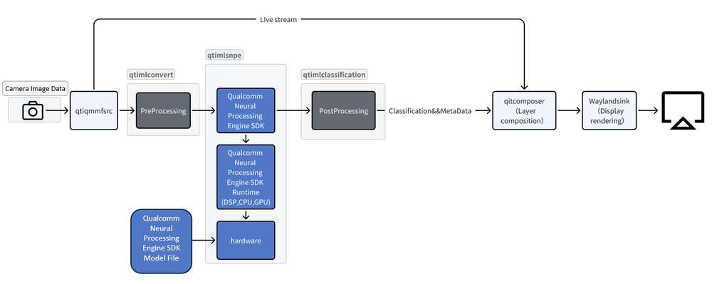
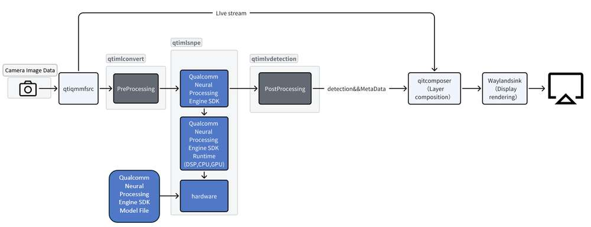
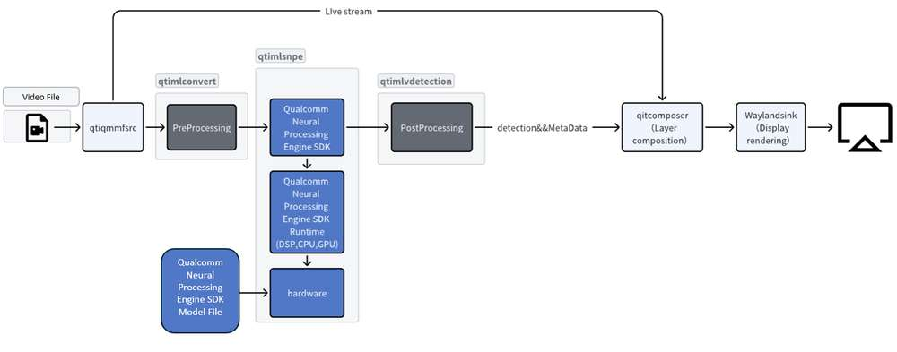

import Tabs from '@theme/Tabs';
import TabItem from '@theme/TabItem';

# Artificial Intelligence

This chapter introduces how to use the Qualcomm AI Runtime SDK. The SDK enables AI developers to easily leverage Qualcomm's high-performance hardware for machine learning inference. It supports running or converting models trained with popular frameworks like TensorFlow, PyTorch, ONNX, and LiteRT, allowing them to run efficiently on the RUBIK Pi 3.

## Overview

The AI/ML development process for RUBIK Pi 3 Ubuntu is as follows:


The above AI/ML developer workflow consists of two steps:

Step 1

■ Compile and optimize the model from the third-party AI framework to efficiently run on Qualcomm hardware. For example, a Tensorflow model can be exported to a TFLite model. Optionally, quantize, fine-tune performance, and accuracy using hardware-specific customizations.

Step 2

Build an application to use the optimized model to run on device inference

■ Integrate the AI model into the use case pipeline.

■ Cross-compile the application to generate an executable binary file that uses the required libraries.

## Software and hardware architecture

### Overall AI framework



Developers can import models from ONNX, PyTorch, TensorFlow or TFLite, and use the Qualcomm AI Runtime SDK to efficiently run these models on the AI hardware of the RUBIK Pi 3, including the HTP (NPU), GPU, and CPU.

### AI hardware

■ Qualcomm Kryo™ CPU - Best-in-class CPU with high performance and remarkable power efficiency.

■ Qualcomm Adreno GPU - Suitable to execute AI workloads with balanced power and performance. AI workloads are accelerated with OpenCL kernels. You can use the GPU to accelerate model pre/postprocessing.

■ Qualcomm Hexagon - Also known as NPU/DSP/HMX, capable of executing AI workloads with low-power and high-performance. For optimized performance, quantize the pre-trained models to one of the supported precisions.

### AI software

The AI software stack contains various SDKs to help AI developers easily leverage the powerful AI hardware accelerators of the RUBIK Pi 3. Developers can choose one of the SDKs to deploy their AI workloads. Pre-trained models (except for TFLite models) need to be converted to the executable format supported by the selected SDK  before running. TFLite models can be run directly using the TFLite Delegate.

■ **LiteRT**

LiteRT models can be executed natively on RUBIK Pi 3 hardware with acceleration using the following Delegates.

| Delegate                                 | Acceleration    |
| ---------------------------------------- | --------------- |
| AI Engine Direct Delegate (QNN Delegate) | CPU, GPU, and HTP |
| XNNPACK Delegate                         | CPU             |
| GPU Delegate                             | GPU             |

■ **Qualcomm Neural Processing Engine SDK (SNPE)**

The Qualcomm Neural Processing Engine (also known as SNPE) is a software acceleration runtime for executing deep neural networks. The SNPE SDK provides tools to convert and quantize neural networks, and accelerate their execution on hardware accelerators such as the CPU, GPU, and HTP.

■ **Qualcomm AI Engine Direct (QNN)**

Qualcomm AI Engine Direct is a software architecture designed for AI/ML use cases to leverage the AI accelerator hardware on the RUBIK Pi 3.

The architecture is designed to provide a unified API and modular and extensible pre-accelerator libraries, which form a reusable basis for full stack AI solutions. It provides support for runtimes such as Qualcomm Neural Processing SDK and TFLite AI Engine Direct Delegate.

■ **AI Model Efficiency Toolkit (AIMET)**

Open-source library to optimize (compressing and quantizing) trained neural network models. This is a complex SDK designed to generate optimized quantized models, intended only for advanced developers.

## Compile and optimize the model


Use either of the following two ways to compile and optimize your models:

| Method            | Operation |
|-------------------|-----------|
| AI hub            | Developers can import their own models and try out the pre-optimized models on cloud devices (Snapdragon devices). |
| AI software stack | - Optimize Model with LiteRT<p>Directly port the LiteRT AI model to the RUBIK Pi 3 device</p>- Optimize AI Model with Qualcomm AI Runtime SDK<p>Use the integrated and easily customizable Qualcomm AI Runtime (QAIRT) SDK to port your model</p> |

### AI Hub

AI Hub provides a way to optimize, validate, and deploy machine learning models on-device for vision, audio, and speech use cases.



#### Environment setup

1. Install miniconda and configure the Python environment on your computer.

     1. Download [miniconda](https://www.anaconda.com/download) from the official website and install it.
   
     2. Open the command-line interface.
  
        <Tabs>
        <TabItem value="win" label="Windows">

        After the installation is complete, open the [Anaconda](https://docs.conda.io/projects/miniconda/en/latest/miniconda-install.html) prompt window through the Start menu.
        </TabItem>
        <TabItem value="maclinu" label="macOS/Linux">

        After the installation is complete, open a new shell.
        </TabItem>
        </Tabs>

     3. Set up a Python virtual environment for AI Hub. In the opened command-line interface, input the following commands:

         ```bash
         conda activate
         conda create python=3.10 -n qai_hub
         conda activate qai_hub
         ```

2. Install the AI Hub Python client.

   ```bash
   pip3 install qai-hub
   pip3 install "qai-hub[torch]"
   ```


3. Log in to AI Hub.

   Go to [AI Hub](https://aihub.qualcomm.com/) and log in using your Qualcomm ID to view information about jobs you create.

   After you log in, navigate to **Account** > **Settings** > **API Token**. This should provide an API token that you can use to configure your client.

4. Configure the client with your API token using the following command in your terminal.

     ```bash
     qai-hub configure --api_token <INSERT_API_TOKEN>
     ```

     Use the following command to check the list of supported devices to verify that the AI Hub Python client is installed successfully.

     ```bash
     qai-hub list-devices
     ```

     The following results indicate that the AI Hub Python client was installed successfully:

     


#### AI Hub workflow

##### Use a pre-optimized model

1. Navigate to [AI Hub Model Zoo](https://aihub.qualcomm.com/iot/models) to access pre-optimized models available for RUBIK Pi 3.

2. In the left-pane, filter models available for RUBIK Pi 3 by selecting Qualcomm QCS6490 as the chipset.

3. Select a model from the filtered view to navigate to the model page.

4. On the model page, select Qualcomm QCS6490 from the drop-down list and choose **TorchScript** > **TFLite path**.

5. After clicking the download button, the model download will begin. The downloaded model has already been pre-optimized and can be directly used to develop your own applications.


##### Import your own model:

1. Select a pre-trained model in PyTorch or Onnx format.

2. Submit a model for compilation or optimization to AI Hub using python APIs. When submitting a compilation job, you must select a device or chipset and the target runtime to compile the model. For RUBIK Pi 3, the TFLite runtime is supported.

   | **Chipset** | **Runtime** | **CPU**         | **GPU**   | **HTP**   |
   | ------- | ----------- | --------------- | --------- | --------- |
   | QCS6490 | TFLite      | INT8,FP16, FP32 | FP16,FP32 | NT8,INT16 |

   On submission, AI Hub generates a unique ID for the job. You can use this job ID to view job details.

3. AI Hub optimizes the model based your device and runtime selections. Optionally, you can submit a job to profile or inference the optimized model (using Python APIs) on a real device provisioned from a device farm.

   – Profiling: Benchmarks the model on a provisioned device and provides statistics, including average inference times at the layer level, runtime configuration, etc.

   – Inference: Performs inference using an optimized model on data submitted as part of the inference job by running the model on a provisioned device.

4. Each submitted job will be available for review in the AI Hub portal. A submitted compilation job will provide a downloadable link to the optimized model. This optimized model can then be deployed on a local development device like RUBIK Pi 3.

### LiteRT


LiteRT is an open-source deep learning framework for on-device inference. LiteRT helps you run your models on mobile, embedded, and edge platforms by optimizing the model for latency, model size, power consumption, etc. Qualcomm supports executing TFLite models natively on RUBIK Pi 3 through TFLite Delegates as listed below.


| Delegate                                 | Acceleration      |
| ---------------------------------------- | --------------- |
| AI Engine Direct Delegate (QNN Delegate) | CPU, GPU, HTP |
| XNNPack Delegate                         | CPU             |
| GPU Delegate                             | GPU             |

### Qualcomm AI Runtime SDK

Qualcomm AI Runtime SDK is an all-in-one SDK to port ML models to run on Qualcomm (RUBIK Pi 3) hardware accelerators. The SDK includes tools provided by Qualcomm Neural Processing Engine (SNPE) and Qualcomm AI Engine Direct (QNN), which can be used to convert and quantize models trained in PyTorch and TensorFlow and execute these models on CPU, GPU, and HTP. Learn more about [SNPE](https://docs.qualcomm.com/bundle/publicresource/topics/80-63442-2/) and [QNN](https://docs.qualcomm.com/bundle/publicresource/topics/80-63442-50/).





## AI/ML sample applications

The AI/ML sample application demonstrates the actual scenario of feeding data from a real-time camera or a local video file, and then running the model on the RUBIK Pi 3 device. The following will detail the steps to run sample applications.

### Preparations

#### Install the software package

Ensure that the sample applications can run normally based on [Run sample applications](1.quick-start/3.run sample applications.md)

For the desktop version, start Weston as follows.

```bash
systemctl stop gdm
sudo dpkg-reconfigure weston-autostart
```

#### Download the model files and label files

Sample application names for LiteRT and the corresponding model files and label files:

| Sample Application                          | Required Model                    | Required Label File         |
|---------------------------------------|-----------------------------------|-------------------------------|
| image-classification-LiteRT-from-camera/file | resnet101-resnet101-w8a8.tflite   | classification_0.labels       |
| object-detection-LiteRT-from-camera/file     | yolov8_det_quantized.tflite       | yolov8.labels                 |
| image-segmentation-LiteRT-from-camera/file   | deeplabv3_plus_mobilenet_quantized.tflite | deeplabv3_resnet50.labels |
| pose-detection-LiteRT-from-camera/file       | hrnet_pose_quantized.tflite       | hrnet_pose.labels             |

Sample application names for SNPE and the corresponding model files and label files:

| Sample Application                   | Required Model      | Required Label File  |
|---------------------------------------|-------------------|----------------------|
| image-classification-LiteRT-from-camera/file | inceptionv3.dlc   | classification.labels |
| object-detection-LiteRT-from-camera/file     | yolonas.dlc       | yolonas.labels        |


1. Click to download the compressed package [*ai\_sample\_app\_model\_label.zip*](https://thundercomm.s3.dualstack.ap-northeast-1.amazonaws.com/uploads/web/rubik-pi-3/tools/ai_sample_app_model_label.zip) of model files and label files required for the sample application .

2. Use the following command to push all model files and label files from the compressed package to the *opt* directory of the device.

   <Tabs>
   <TabItem value="ubun" label="Ubuntu" default>

   ```bash
   adb push ./* /opt
   ```
   </TabItem>
   <TabItem value="wind" label="Windows">

   ```bash
   adb push  /opt
   ```
   </TabItem>
   </Tabs>
   Alternatively, individually push the model files and label files required by the sample application to the */opt* directory of the device when using the following sample application.

### LiteRT sample applications

#### Implement AI functionality by acquiring image information through cameras

##### Image classification (image-classification-LiteRT-from-camera)

This sample application uses a camera to capture images in real time and sends them to LiteRt for inference using the resnet101-resnet101-w8a8.tflite model via HTP. The classification results and image information are then displayed on a monitor through Weston. Refer to the diagram below for the specific pipeline.




* Push the necessary model files and label files from the model compressed package to the */opt* directory:

   ```bash
   adb push resnet101-resnet101-w8a8.tflite /opt
   adb push classification.labels /opt
   ```

* Run the following commands to run the sample application:

   ```bash
   sudo -i
   export XDG_RUNTIME_DIR=/run/user/$(id -u ubuntu)/ && export WAYLAND_DISPLAY=wayland-1
   gst-launch-1.0 -e --gst-debug=1 qtiqmmfsrc name=camsrc camera=0  ! video/x-raw,format=NV12 ! tee name=split ! queue ! qtivcomposer name=mixer ! queue ! fpsdisplaysink sync=true signal-fps-measurements=true text-overlay=true video-sink="waylandsink fullscreen=true" split. ! queue ! qtimlvconverter ! queue ! qtimltflite name=tf_3 delegate=external external-delegate-path=libQnnTFLiteDelegate.so external-delegate-options="QNNExternalDelegate,backend_type=htp,htp_device_id=(string)0,htp_performance_mode=(string)2,htp_precision=(string)1;"  model=/opt/resnet101-resnet101-w8a8.tflite ! queue ! qtimlvclassification threshold=51.0 results=5 module=mobilenet labels=/opt/classification_0.labels extra-operation=softmax constants="Inception,q-offsets=<-38.0>,q-scales=<0.17039915919303894>;" ! video/x-raw,format=BGRA,width=640,height=360 ! queue ! mixer. 
   ```

* The result is as follows:

   


##### Object detection (object-detection-LiteRT-from-camera)

This sample application uses a camera to capture images in real time and sends them to LiteRT for inference using the yolov8_det_quantized.tflite model via HTP. The object detection results and image information are then displayed on a monitor through Weston. Refer to the diagram below for the specific pipeline.


* Push the necessary model files and label files from the model compressed package to the */opt* directory:

   ```bash
   adb push yolov8_det_quantized.tflite /opt
   adb push yolov8.labels /opt
   ```


* Run the following commands to run the sample application:

   ```bash
   sudo -i
   export XDG_RUNTIME_DIR=/run/user/$(id -u ubuntu)/ && export WAYLAND_DISPLAY=wayland-1
   gst-launch-1.0 -e --gst-debug=1 qtiqmmfsrc name=camsrc camera=0 ! video/x-raw,format=NV12 ! tee name=split ! queue ! qtivcomposer name=mixer ! queue ! fpsdisplaysink sync=true signal-fps-measurements=true text-overlay=true video-sink="waylandsink fullscreen=true" split. ! queue ! qtimlvconverter ! queue ! qtimltflite delegate=external external-delegate-path=libQnnTFLiteDelegate.so external-delegate-options="QNNExternalDelegate,backend_type=htp;" model=/opt/yolov8_det_quantized.tflite ! queue ! qtimlvdetection threshold=75.0 results=10 module=yolov8 labels=/opt/yolov8.labels constants="YOLOv8,q-offsets=<21.0, 0.0, 0.0>,    q-scales=<3.0546178817749023, 0.003793874057009816, 1.0>;" ! video/x-raw,format=BGRA,width=640,height=360 ! queue ! mixer.
   ```

* The result is as follows:

   

##### Semantic segmentation (image-segmentation-LiteRT-from-camera)

This sample application uses a camera to capture images in real time and sends them to LiteRT for inference using the deeplabv3_plus_mobilenet_quantized.tflite model via HTP. The semantic segmentation results and image information are then displayed on a monitor through Weston. Refer to the diagram below for the specific pipeline.


* Push the necessary model files and label files from the model compressed package to the */opt* directory:

   ```bash
   adb push deeplabv3_plus_mobilenet_quantized.tflite /opt
   adb push deeplabv3_resnet50.labels  /opt
   ```

* Run the following commands to run the sample application:

   ```bash
   sudo -i
   export XDG_RUNTIME_DIR=/run/user/$(id -u ubuntu)/ && export WAYLAND_DISPLAY=wayland-1
   gst-launch-1.0 -e --gst-debug=1 qtiqmmfsrc name=camsrc camera=0 ! video/x-raw,format=NV12 ! tee name=split ! queue ! qtivcomposer name=mixer sink_1::alpha=0.5 ! queue ! fpsdisplaysink sync=true signal-fps-measurements=true text-overlay=true video-sink="waylandsink fullscreen=true" split. ! queue ! qtimlvconverter ! queue ! qtimltflite delegate=external external-delegate-path=libQnnTFLiteDelegate.so external-delegate-options="QNNExternalDelegate,backend_type=htp;" model=/opt/deeplabv3_plus_mobilenet_quantized.tflite ! queue ! qtimlvsegmentation module=deeplab-argmax labels=/opt/deeplabv3_resnet50.labels constants="deeplab,q-offsets=<-61.0>,q-scales=<0.06232302635908127>;" ! video/x-raw,format=BGRA,width=256,height=144 ! queue ! mixer.
   ```

* The result is as follows:

   

##### Pose detection (pose-detection-LiteRT-from-camera)

This sample application uses a camera to capture images in real time and sends them to LiteRT for inference using the hrnet_pose_quantized.tflite model via HTP. The pose detection results and image information are then displayed on a monitor through Weston. Refer to the diagram below for the specific pipeline.




* Push the necessary model files and label files from the model compressed package to the */opt* directory:

   ```bash
   adb push hrnet_pose_quantized.tflite /opt
   adb push hrnet_pose.labels  /opt
   ```

* Run the following commands to run the sample application:

    ```bash
   sudo -i
   export XDG_RUNTIME_DIR=/run/user/$(id -u ubuntu)/ && export WAYLAND_DISPLAY=wayland-1
   gst-launch-1.0 -e --gst-debug=1 qtiqmmfsrc name=camsrc camera=0 ! video/x-raw,format=NV12 ! tee name=split ! queue ! qtivcomposer name=mixer sink_1::alpha=0.5 ! queue ! fpsdisplaysink sync=true signal-fps-measurements=true text-overlay=true video-sink="waylandsink fullscreen=true" split. ! queue ! qtimlvconverter ! queue ! qtimltflite delegate=external external-delegate-path=libQnnTFLiteDelegate.so external-delegate-options="QNNExternalDelegate,backend_type=htp;" model=/opt/hrnet_pose_quantized.tflite ! queue ! qtimlvpose threshold=51.0 results=2 module=hrnet labels=/opt/hrnet_pose.labels constants="hrnet,q-offsets=<8.0>,q-scales=<0.0040499246679246426>;" ! video/x-raw,format=BGRA,width=640,height=360 ! queue ! mixer.
   ```

* The result is as follows:

   

#### Implement AI functionality by acquiring image information through recorded MP4 files

##### Image classification (image-classification-LiteRT-from-file)

This sample application uses an MP4 file to retrieve images and sends them to LiteRT for inference using the resnet101-resnet101-w8a8.tflite model via HTP. The classification results and image information are then displayed on a monitor through Weston. Refer to the diagram below for the specific pipeline.


* Push the necessary model files and label files from the model compressed package to the */opt* directory:

   ```bash
   adb push resnet101-resnet101-w8a8.tflite /opt
   adb push classification.labels /opt
   ```

* Run the following commands to run the sample application:

   ```bash
   sudo -i
   export XDG_RUNTIME_DIR=/run/user/$(id -u ubuntu)/ && export WAYLAND_DISPLAY=wayland-1
   gst-launch-1.0 -v --gst-debug=2 filesrc location=/opt/Draw_1080p_180s_30FPS.mp4 ! qtdemux ! h264parse ! v4l2h264dec capture-io-mode=4 output-io-mode=4 ! video/x-raw,format=NV12 ! tee name=split ! queue ! qtivcomposer name=mixer ! queue ! fpsdisplaysink sync=true signal-fps-measurements=true text-overlay=true video-sink="waylandsink fullscreen=true" split. ! queue ! qtimlvconverter ! queue ! qtimltflite name=tf_3 delegate=external external-delegate-path=libQnnTFLiteDelegate.so external-delegate-options="QNNExternalDelegate,backend_type=htp,htp_device_id=(string)0,htp_performance_mode=(string)2,htp_precision=(string)1;"  model=/opt/resnet101-resnet101-w8a8.tflite ! queue ! qtimlvclassification threshold=51.0 results=5 module=mobilenet labels=/opt/classification_0.labels extra-operation=softmax constants="Inception,q-offsets=<-38.0>,q-scales=<0.17039915919303894>;" ! video/x-raw,format=BGRA,width=640,height=360 ! queue ! mixer. 
   ```

* The result is as follows:

   

##### Object detection (object-detection-LiteRT-from-file)

This sample application uses an MP4 file to extract images and sends them to LiteRT for inference using the yolov8_det_quantized.tflite model via HTP. The object detection results and image information are then displayed on a monitor through Weston. Refer to the diagram below for the specific pipeline.


* Push the necessary model files and label files from the model compressed package to the */opt* directory:

   ```bash
   adb push yolov8_det_quantized.tflite /opt
   adb push yolov8.labels /opt
   ```


* Run the following commands to run the sample application:

   ```bash
   sudo -i
   export XDG_RUNTIME_DIR=/run/user/$(id -u ubuntu)/ && export WAYLAND_DISPLAY=wayland-1
   gst-launch-1.0 -v --gst-debug=2 filesrc location=/opt/Draw_1080p_180s_30FPS.mp4 ! qtdemux ! h264parse ! v4l2h264dec capture-io-mode=4 output-io-mode=4 ! video/x-raw,format=NV12 ! tee name=split ! queue ! qtivcomposer name=mixer ! queue ! fpsdisplaysink sync=true signal-fps-measurements=true text-overlay=true video-sink="waylandsink fullscreen=true" split. ! queue ! qtimlvconverter ! queue ! qtimltflite delegate=external external-delegate-path=libQnnTFLiteDelegate.so external-delegate-options="QNNExternalDelegate,backend_type=htp;" model=/opt/yolov8_det_quantized.tflite ! queue ! qtimlvdetection threshold=75.0 results=10 module=yolov8 labels=/opt/yolov8.labels constants="YOLOv8,q-offsets=<21.0, 0.0, 0.0>,    q-scales=<3.0546178817749023, 0.003793874057009816, 1.0>;" ! video/x-raw,format=BGRA,width=640,height=360 ! queue ! mixer.
   ```

* The result is as follows:

   


##### Semantic segmentation (image-segmentation-LiteRT-from-file)

This sample application uses an MP4 file to extract images and sends them to LiteRT for inference using the deeplabv3_plus_mobilenet_quantized.tflite model via HTP. The semantic segmentation results and image information are then displayed on a monitor through Weston. Refer to the diagram below for the specific pipeline.


* Push the necessary model files and label files from the model compressed package to the */opt* directory:

   ```bash
   adb push deeplabv3_plus_mobilenet_quantized.tflite /opt
   adb push deeplabv3_resnet50.labels  /opt
   ```

* Run the following commands to run the sample application:

   ```bash
   sudo -i
   export XDG_RUNTIME_DIR=/run/user/$(id -u ubuntu)/ && export WAYLAND_DISPLAY=wayland-1
   gst-launch-1.0 -v --gst-debug=2 filesrc location=/opt/Draw_1080p_180s_30FPS.mp4 ! qtdemux ! h264parse ! v4l2h264dec capture-io-mode=4 output-io-mode=4 ! video/x-raw,format=NV12 ! tee name=split ! queue ! qtivcomposer name=mixer sink_1::alpha=0.5 ! queue ! fpsdisplaysink sync=true signal-fps-measurements=true text-overlay=true video-sink="waylandsink fullscreen=true" split. ! queue ! qtimlvconverter ! queue ! qtimltflite delegate=external external-delegate-path=libQnnTFLiteDelegate.so external-delegate-options="QNNExternalDelegate,backend_type=htp;" model=/opt/deeplabv3_plus_mobilenet_quantized.tflite ! queue ! qtimlvsegmentation module=deeplab-argmax labels=/opt/deeplabv3_resnet50.labels constants="deeplab,q-offsets=<-61.0>,q-scales=<0.06232302635908127>;" ! video/x-raw,format=BGRA,width=256,height=144 ! queue ! mixer.
   ```

* The result is as follows:

   

##### Pose detection (pose-detection-LiteRT-from-file)

This sample application uses an MP4 file to extract images and sends them to LiteRT for inference using the hrnet_pose_quantized.tflite model via HTP. The pose detection results and image information are then displayed on a monitor through Weston. Refer to the diagram below for the specific pipeline.


* Push the necessary model files and label files from the model compressed package to the */opt* directory:

   ```bash
   adb push hrnet_pose_quantized.tflite /opt
   adb push hrnet_pose.labels  /opt
   ```

* Run the following commands to run the sample application:

   ```bash
   sudo -i
   export XDG_RUNTIME_DIR=/run/user/$(id -u ubuntu)/ && export WAYLAND_DISPLAY=wayland-1
   gst-launch-1.0 -v --gst-debug=2 filesrc location=/opt/Draw_1080p_180s_30FPS.mp4 ! qtdemux ! h264parse ! v4l2h264dec capture-io-mode=4 output-io-mode=4 ! video/x-raw,format=NV12 ! tee name=split ! queue ! qtivcomposer name=mixer sink_1::alpha=0.5 ! queue ! fpsdisplaysink sync=true signal-fps-measurements=true text-overlay=true video-sink="waylandsink fullscreen=true" split. ! queue ! qtimlvconverter ! queue ! qtimltflite delegate=external external-delegate-path=libQnnTFLiteDelegate.so external-delegate-options="QNNExternalDelegate,backend_type=htp;" model=/opt/hrnet_pose_quantized.tflite ! queue ! qtimlvpose threshold=51.0 results=2 module=hrnet labels=/opt/hrnet_pose.labels constants="hrnet,q-offsets=<8.0>,q-scales=<0.0040499246679246426>;" ! video/x-raw,format=BGRA,width=640,height=360 ! queue ! mixer.
   ```

* The result is as follows:

   

### SNPE sample applications

#### Implement AI functionality by acquiring image information through cameras

##### Image classification (image-classification-LiteRT-from-camera)

This sample application uses a camera to capture images in real time and sends them to SNPE for inference using the inceptionv3.dlc model via HTP. The classification results and image information are then displayed on a monitor through Weston. Refer to the diagram below for the specific pipeline.





* Push the necessary model files and label files from the model compressed package to the */opt* directory:

   ```bash
   adb push inceptionv3.dlc /opt
   adb push classification.labels /opt
   ```


* Run the following commands to run the sample application:

   ```bash
   sudo -i
   export XDG_RUNTIME_DIR=/run/user/$(id -u ubuntu)/ && export WAYLAND_DISPLAY=wayland-1
   gst-launch-1.0 -e --gst-debug=1 qtiqmmfsrc name=camsrc camera=0 ! video/x-raw,format=NV12 ! queue ! tee name=split ! queue ! qtivcomposer name=mixer ! queue ! fpsdisplaysink sync=true text-overlay=true video-sink="waylandsink sync=true fullscreen=true"  split. ! queue ! qtimlvconverter ! queue ! qtimlsnpe delegate=dsp model=/opt/inceptionv3.dlc ! queue ! qtimlvclassification threshold=40.0 results=2 module=mobilenet labels=/opt/classification.labels ! queue ! video/x-raw,format=BGRA,width=640,height=360 ! queue ! mixer.
   ```

* The result is as follows:

   

##### Object detection (object-detection-LiteRT-from-camera)

The sample application uses a camera to capture images in real-time and sends them to SNPE for HTP inference using the yolonas.labels model. The object detection results and image information are then displayed on the monitor through Weston. Refer to the diagram below for the specific pipeline.




* Push the necessary model files and label files from the model compressed package to the */opt* directory:

   ```bash
   adb push yolonas.dlc /opt
   adb push yolonas.labels /opt
   ```

* Run the following commands to run the sample application:
 
   ```bash
   sudo -i
   export XDG_RUNTIME_DIR=/run/user/$(id -u ubuntu)/ && export WAYLAND_DISPLAY=wayland-1
   gst-launch-1.0 -e --gst-debug=1 qtiqmmfsrc name=camsrc camera=0 ! video/x-raw,format=NV12 ! tee name=split split. ! queue ! qtivcomposer name=mixer ! queue ! fpsdisplaysink sync=true signal-fps-measurements=true text-overlay=true video-sink='waylandsink fullscreen=true sync=true' split. ! queue ! qtimlvconverter ! queue ! qtimlsnpe delegate=dsp model=/opt/yolonas.dlc layers="</heads/Mul, /heads/Sigmoid>" ! queue ! qtimlvdetection module=yolo-nas labels=/opt/yolonas.labels ! video/x-raw,format=BGRA ! queue ! mixer.
   ```

* The result is as follows:

   

#### Implement AI functionality by acquiring image information through recorded MP4 files

##### Image classification (image-classification-LiteRT-from-file)

This sample application uses an MP4 file to capture images and sends them to SNPE for HTP inference using the inceptionv3.dlc model. The classification results and image information are then displayed on the monitor through Weston. Refer to the diagram below for the specific pipeline.


* Push the necessary model files and label files from the model compressed package to the */opt* directory:

   ```bash
   adb push inceptionv3.dlc /opt
   adb push classification.labels /opt
   ```

* Run the following commands to run the sample application:

   ```bash
   sudo -i
   export XDG_RUNTIME_DIR=/run/user/$(id -u ubuntu)/ && export WAYLAND_DISPLAY=wayland-1
   gst-launch-1.0 -e filesrc location=/opt/Draw_1080p_180s_30FPS.mp4 ! qtdemux ! queue ! h264parse ! v4l2h264dec capture-io-mode=4 output-io-mode=4 ! video/x-raw,format=NV12 ! queue ! tee name=split ! queue ! qtivcomposer name=mixer ! queue ! fpsdisplaysink sync=true text-overlay=true video-sink="waylandsink sync=true fullscreen=true"  split. ! queue ! qtimlvconverter ! queue ! qtimlsnpe delegate=dsp model=/opt/inceptionv3.dlc ! queue ! qtimlvclassification threshold=40.0 results=2 module=mobilenet labels=/opt/classification.labels ! queue ! video/x-raw,format=BGRA,width=640,height=360 ! queue ! mixer.
   ```

* The result is as follows:

   

##### Object detection (object-detection-LiteRT-from-file)

This sample application uses an MP4 file to capture images and sends them to SNPE for HTP inference using the yolonas.labels model. The object detection results and image information are then displayed on the monitor through Weston. Refer to the diagram below for the specific pipeline.



* Push the necessary model files and label files from the model compressed package to the */opt* directory:

   ```bash
   adb push yolonas.dlc /opt
   adb push yolonas.labels /opt
   ```

* Run the following commands to run the sample application:

   ```bash
   sudo -i
   export XDG_RUNTIME_DIR=/run/user/$(id -u ubuntu)/ && export WAYLAND_DISPLAY=wayland-1
   gst-launch-1.0 -e --gst-debug=2 filesrc location=/opt/Draw_1080p_180s_30FPS.mp4 ! qtdemux ! queue ! h264parse ! v4l2h264dec capture-io-mode=4 output-io-mode=4 ! video/x-raw,format=NV12 ! tee name=split split. ! queue ! qtivcomposer name=mixer ! queue ! fpsdisplaysink sync=true signal-fps-measurements=true text-overlay=true video-sink='waylandsink fullscreen=true sync=true' split. ! queue ! qtimlvconverter ! queue ! qtimlsnpe delegate=dsp model=/opt/yolonas.dlc layers="</heads/Mul, /heads/Sigmoid>" ! queue ! qtimlvdetection module=yolo-nas labels=/opt/yolonas.labels ! video/x-raw,format=BGRA ! queue ! mixer.
   ```

* The result is as follows:

   

### Purposes and functions of AI-related plugins

| Plug-in Name          | Function |
|------------------|------|
| qtimlsnpe        |  Loading and executing the SNPE DLC model files. It receives input tensors from the preprocessing plugin (qtimlvconverter) and outputs tensors passed to plugins such as qtimlvclassification, qtimlvdetection, qtimlvsegmentation, and qtimlvpose. |
| qtimltflite      | Loading and executing LiteRT TFLite model files. It receives input tensors from the preprocessing plugin (qtimlvconverter) and outputs tensors passed to plugins such as qtimlvclassification, qtimlvdetection, qtimlvsegmentation, and qtimlvpose. |
| qtimlvconverter  | Converting data from the incoming video buffer into neural network tensors, while performing the necessary format conversion and resizing.|
| qtimlvclassification | Post-processing the output tensors for classification use cases. |
| qtimlvdetection  | Post-processing the output tensors for detection use cases.|
| qtimlvsegmentation | Post-processing the output tensors for pixel-level use cases such as image segmentation or depth map processing. |
| qtimlvpose       | Post-processing the output tensors for pose estimation use cases. |
