---
# Display h2 to h2 headings
toc_min_heading_level: 2
toc_max_heading_level: 2
---
import Tabs from '@theme/Tabs';
import TabItem from '@theme/TabItem';

# Artificial Intelligence

This chapter introduces how to use the Qualcomm AI Runtime SDK. The SDK enables AI developers to easily leverage Qualcomm's high-performance hardware for machine learning inference. It supports running or converting models trained with popular frameworks like TensorFlow, PyTorch, ONNX, and LiteRT, allowing them to run efficiently on your RUBIK Pi 3.

## Overview

The AI/ML development process for RUBIK Pi 3 Ubuntu is as follows:


The above AI/ML developer workflow consists of two steps:

Step 1

Compile and optimize the model from the third-party AI framework to efficiently run on RUBIK Pi 3. For example, a Tensorflow model can be exported to a TFLite model. Optionally, quantize, fine-tune performance, and accuracy using hardware-specific customizations.

Step 2

Build an application to use the optimized model to run on device inference

* Integrate the AI model into the use case pipeline.
* Cross-compile the application to generate an executable binary file that uses the required libraries.

## Software and hardware architecture

### Overall AI framework


Developers can import models from ONNX, PyTorch, TensorFlow or TFLite, and use the Qualcomm AI Runtime SDK to efficiently run these models on the AI hardware of the RUBIK Pi 3, including the HTP (NPU), GPU, and CPU.

### AI hardware

* Qualcomm Kryo™ CPU - Best-in-class CPU with high performance and remarkable power efficiency.
* Qualcomm Adreno GPU - Suitable to execute AI workloads with balanced power and performance. AI workloads are accelerated with OpenCL kernels. You can use the GPU to accelerate model pre/postprocessing.
* Qualcomm Hexagon - Also known as NPU/DSP/HMX, capable of executing AI workloads with low-power and high-performance. For optimized performance, quantize the pre-trained models to one of the supported precisions.

### AI software

The AI software stack contains various SDKs to help AI developers easily leverage the powerful AI hardware accelerators of the RUBIK Pi 3. Developers can choose one of the SDKs to deploy their AI workloads. Pre-trained models (except for TFLite models) need to be converted to the executable format supported by the selected SDK before running. TFLite models can be run directly using the TFLite Delegate.

* **LiteRT**

LiteRT models can be executed natively on RUBIK Pi 3 hardware with acceleration using the following Delegates.


| Delegate                                 | Acceleration      |
| ------------------------------------------ | ------------------- |
| AI Engine Direct Delegate (QNN Delegate) | CPU, GPU, and HTP |
| XNNPACK Delegate                         | CPU               |
| GPU Delegate                             | GPU               |

* **Qualcomm Neural Processing Engine SDK (SNPE)**

The Qualcomm Neural Processing Engine (also known as SNPE) is a software acceleration runtime for executing deep neural networks. The SNPE SDK provides tools to convert and quantize neural networks, and accelerate their execution on hardware accelerators such as the CPU, GPU, and HTP.

* **Qualcomm AI Engine Direct (QNN)**

Qualcomm AI Engine Direct is a software architecture designed for AI/ML use cases to leverage the AI accelerator hardware on the RUBIK Pi 3.

The architecture is designed to provide a unified API and modular and extensible pre-accelerator libraries, which form a reusable basis for full stack AI solutions. It provides support for runtimes such as Qualcomm Neural Processing SDK and TFLite AI Engine Direct Delegate.

* **AI Model Efficiency Toolkit (AIMET)**

This is an open-source library to optimize (compressing and quantizing) trained neural network models. This is a complex SDK designed to generate optimized quantized models, intended only for advanced developers.

## Compile and optimize the model


Use either of the following two ways to compile and optimize your models:


| Method            | Operation                                                                                                                                                                                                                                         |
| ------------------- | --------------------------------------------------------------------------------------------------------------------------------------------------------------------------------------------------------------------------------------------------- |
| AI hub            | Developers can import their own models and try out the pre-optimized models on cloud devices (Snapdragon devices).                                                                                                                                |
| AI software stack | - Optimize Model with LiteRT<p>Directly port the LiteRT AI model to the RUBIK Pi 3 device</p>- Optimize AI Model with Qualcomm AI Runtime SDK<p>Use the integrated and easily customizable Qualcomm AI Runtime (QAIRT) SDK to port your model</p> |

### AI Hub

AI Hub provides a way to optimize, validate, and deploy machine learning models on-device for vision, audio, and speech use cases.


#### Environment setup

1. Install miniconda and configure the Python environment on your computer.

   1. Download [miniconda](https://www.anaconda.com/download) from the official website and install it.
   
   2. Open the command line window.

       <Tabs>
       <TabItem value="Windows" label="Windows" default>

         After the installation is complete, open the [Anaconda ](https://docs.conda.io/projects/miniconda/en/latest/miniconda-install.html) prompt window through the Start menu.
       </TabItem>

       <TabItem value="macOS/Linux" label="macOS/Linux">

         After the installation is complete, open a new shell.
       </TabItem>
       </Tabs>

   3. Set up a Python virtual environment for AI Hub. In the opened command-line interface, input the following commands:

       ```bash
       conda activate
       conda create python=3.10 -n qai_hub
       conda activate qai_hub
       ```
2. Install the AI Hub Python client.

   ```bash
   pip3 install qai-hub
   pip3 install "qai-hub[torch]"
   ```

3. Log in to AI Hub.

   Go to [AI Hub](https://aihub.qualcomm.com/) and log in using your Qualcomm ID to view information about jobs you create.

   After you log in, navigate to **Account** > **Settings** > **API Token**. This should provide an API token that you can use to configure your client.

4. Configure the client with your API token using the following command in your terminal.

   ```bash
   qai-hub configure --api_token <INSERT_API_TOKEN>
   ```

   Use the following command to check the list of supported devices to verify that the AI Hub Python client is installed successfully.

   ```bash
   qai-hub list-devices
   ```

   The following results indicate that the AI Hub Python client was installed successfully:

   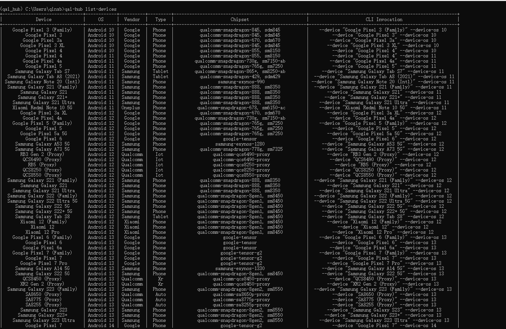

#### AI Hub workflow

* Use a pre-optimized model

1. Navigate to [AI Hub Model Zoo](https://aihub.qualcomm.com/iot/models) to access pre-optimized models available for RUBIK Pi 3.
2. In the left-pane, filter models available for RUBIK Pi 3 by selecting Qualcomm QCS6490 as the chipset.
3. Select a model from the filtered view to navigate to the model page.
4. On the model page, select Qualcomm QCS6490 from the drop-down list and choose **TorchScript** > **TFLite** path.
5. After clicking the download button, the model download will begin. The downloaded model has already been pre-optimized and can be directly used to develop your own applications.

* Import your own model

1. Select a pre-trained model in PyTorch or Onnx format.
2. Submit a model for compilation or optimization to AI Hub using python APIs. When submitting a compilation job, you must select a device or chipset and the target runtime to compile the model. For RUBIK Pi 3, the TFLite runtime is supported.


   | **Chipset** | **Runtime** | **CPU**          | **GPU**    | **HTP**   |
   | ------------- | ------------- | ------------------ | ------------ | ----------- |
   | QCS6490     | TFLite      | INT8, FP16, FP32 | FP16, FP32 | NT8, INT16 |

   On submission, AI Hub generates a unique ID for the job. You can use this job ID to view job details.

3. AI Hub optimizes the model based your device and runtime selections. Optionally, you can submit a job to profile or inference the optimized model (using Python APIs) on a real device provisioned from a device farm.

   – Profiling: Benchmarks the model on a provisioned device and provides statistics, including average inference times at the layer level, runtime configuration, etc.

   – Inference: Performs inference using an optimized model on data submitted as part of the inference job by running the model on a provisioned device.
4. Each submitted job will be available for review in the AI Hub portal. A submitted compilation job will provide a downloadable link to the optimized model. This optimized model can then be deployed on a local development device like RUBIK Pi 3.

### LiteRT


LiteRT is an open-source deep learning framework for on-device inference. LiteRT helps you run your models on mobile, embedded, and edge platforms by optimizing the model for latency, model size, power consumption, etc. RUBIK Pi supports executing TFLite models natively through TFLite Delegates as listed below.


| Delegate                                 | Acceleration  |
| ------------------------------------------ | --------------- |
| AI Engine Direct Delegate (QNN Delegate) | CPU, GPU, HTP |
| XNNPack Delegate                         | CPU           |
| GPU Delegate                             | GPU           |

### Qualcomm(®) Intelligent Multimedia SDK

#### Overview of Qualcomm IM SDK

The Qualcomm IM SDK provides the development environment with upstream and Qualcomm [GStreamer](https://gstreamer.freedesktop.org/) plugins as APIs. You can use these APIs to develop and optimize applications, create pipelines, and customize plugins.

The following diagram shows the Qualcomm IM SDK framework:

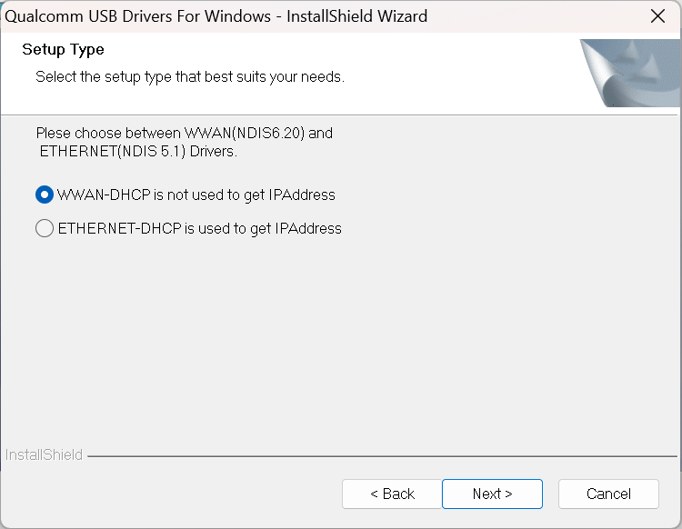

#### Functions of commonly used Qualcomm [GStreamer](https://gstreamer.freedesktop.org/) plugins in the Qualcomm IM SDK


| Plugin               | Function                                                                                                                                                                                                                                            |
| ---------------------- | ----------------------------------------------------------------------------------------------------------------------------------------------------------------------------------------------------------------------------------------------------- |
| qtiqmmfsrc           | The qtiqmmfsrc plugin captures the video frames through Qualcomm Camera Service.                                                                                                                                                                    |
| qtimlsnpe            | Loading and executing the SNPE DLC model files. It receives input tensors from the preprocessing plugin (qtimlvconverter) and outputs tensors passed to plugins such as qtimlvclassification, qtimlvdetection, qtimlvsegmentation, and qtimlvpose.  |
| qtimltflite          | Loading and executing LiteRT TFLite model files. It receives input tensors from the preprocessing plugin (qtimlvconverter) and outputs tensors passed to plugins such as qtimlvclassification, qtimlvdetection, qtimlvsegmentation, and qtimlvpose. |
| qtimlvconverter      | Converting data from the incoming video buffer into neural network tensors, while performing the necessary format conversion and resizing.                                                                                                          |
| qtimlvclassification | Post-processing the output tensors for classification use cases.                                                                                                                                                                                    |
| qtimlvdetection      | Post-processing the output tensors for detection use cases.                                                                                                                                                                                         |
| qtimlvsegmentation   | Post-processing the output tensors for pixel-level use cases such as image segmentation or depth map processing.                                                                                                                                    |
| qtimlvpose           | Post-processing the output tensors for pose estimation use cases.                                                                                                                                                                                   |

## AI/ML sample applications

### Preparations

1. Install the software package.

   Refer to the [Run sample applications](3.run-sample-applications.md) chapter and ensure that the sample application can run successfully.
   
2. Download the compressed package containing the model file, label file, and JSON configuration file required for the AI/ML sample application.

   * On the device, run the following command to download the compressed package *ai\_sample\_app\_models\_labels\_configs.zip*.

     ```bash
     wget https://thundercomm.s3.dualstack.ap-northeast-1.amazonaws.com/uploads/web/rubik-pi-3/tools/ai_sample_app_models_labels_configs.zip
     ```

   * Use the following command to extract the compressed package to the */etc* directory.

     ```bash
     unzip ./ai_sample_app_model_label.zip -d /etc/
     ```

   * List of files in the compressed package:


| Model File                                          | Label File                        | Json Configuration File                                    |
| ----------------------------------------------------- | ----------------------------------- | ------------------------------------------------------------ |
| models/deeplabv3\_plus\_mobilenet\_quantized.tflite | labels/classification\_0.labels   | configs/config\_classification.json                        |
| models/midas\_quantized.tflite                      | labels/hrnet\_pose.labels         | configs/config\_monodepth.json                             |
| models/hrnet\_pose\_quantized.tflite                | labels/yolov5.labels              | configs/config\_daisychain\_detection\_classification.json |
| models/yolov5.tflite                                | labels/deeplabv3\_resnet50.labels | configs/config\_pose.json                                  |
| models/inception\_v3\_quantized.tflite              | labels/monodepth.labels           | configs/config\_detection.json                             |
| models/yolov8\_det\_quantized.tflite                | labels/yolov8.labels              | configs/config\_segmentation.json                          |

### Image classification sample application: gst-ai-classification

The gst-ai-classification application allows you to identify the subject in an image. The use cases are implemented using the SNPE, LiteRT, or QNN.

The following figure shows the pipeline, which receives a video stream from a camera, file source, or Real-Time Streaming Protocol (RTSP), preprocesses it, runs the inference on AI hardware, and displays the results on the screen.

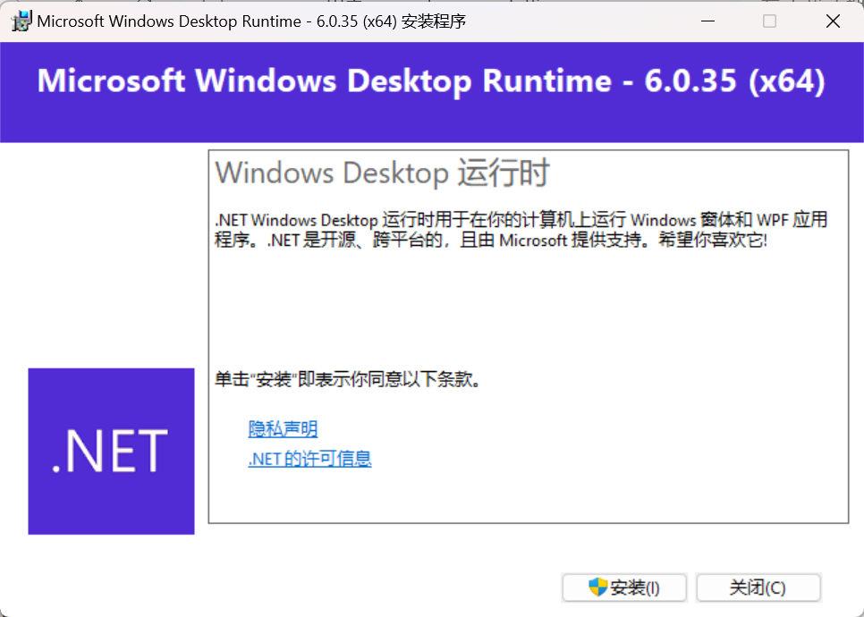

* JSON configuration file used by the sample application：*/etc/configs/config\_classification.json*

**Follow these steps to perform testing:**

1. Use the camera as the input source:

:::note
Connect the camera before testing.
:::

```json
{
  "camera": 0,
  "ml-framework": "tflite",
  "model": "/etc/models/inception_v3_quantized.tflite",
  "labels": "/etc/labels/classification_0.labels",
  "constants": "Inceptionv3,q-offsets=<38.0>,q-scales=<0.17039915919303894>;",
  "threshold": 40,
  "runtime": "dsp"
}
```

Alternatively, use the MP4 video file as the input source:

:::note
Set the `file-path` attribute below to the path of your MP4 video file.
:::

```json
{
 "file-path": "/etc/media/video.mp4",
  "ml-framework": "tflite",
  "model": "/etc/models/inception_v3_quantized.tflite",
  "labels": "/etc/labels/classification_0.labels",
  "constants": "Inceptionv3,q-offsets=<38.0>,q-scales=<0.17039915919303894>;",
  "threshold": 40,
  "runtime": "dsp"
}
```

2. Execute the following commands to run the sample application:

```bash
sudo -i
gst-ai-classification --config-file=/etc/configs/config_classification.json
```

* The result is shown below:

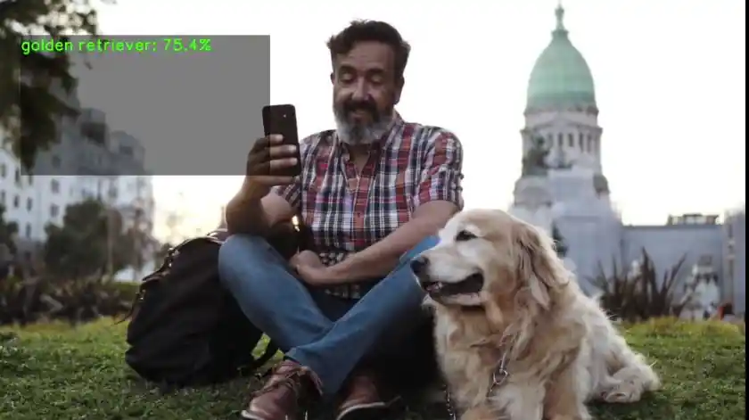

### Object detection sample application: gst-ai-object-detection

The gst-ai-object-detection application allows you to detect objects within images and videos.

The following figure shows the pipeline, which receives the input from a live camera feed, file, or an RTSP stream, preprocesses it, runs inferences on AI hardware, and displays the results on the screen.


* JSON configuration file used by the sample application: */etc/configs/config\_detection.json*

**Follow these steps to perform testing:**

1. Use the camera as the input source:

:::note
Connect the camera before testing.
:::

```json
{
  "camera": "0",
  "ml-framework": "tflite",
  "yolo-model-type": "yolov8",
  "model": "/etc/models/yolov8_det_quantized.tflite",
  "labels": "/etc/labels/yolov8.labels",
  "constants": "YOLOv8,q-offsets=<21.0, 0.0, 0.0>,q-scales=<3.0546178817749023, 0.003793874057009816, 1.0>;",
  "threshold": 40,
  "runtime": "dsp"
}
```

Alternatively, use the MP4 video file as the input source:

:::note
Set the `file-path` attribute below to the path of your MP4 video file.
:::

```json
{
  "file-path": "/etc/media/video.mp4",
  "ml-framework": "tflite",
  "yolo-model-type": "yolov8",
  "model": "/etc/models/yolov8_det_quantized.tflite",
  "labels": "/etc/labels/yolov8.labels",
  "constants": "YOLOv8,q-offsets=<21.0, 0.0, 0.0>,q-scales=<3.0546178817749023, 0.003793874057009816, 1.0>;",
  "threshold": 40,
  "runtime": "dsp"
}
```

2. Execute the following commands to run the sample application:

```bash
sudo -i
gst-ai-object-detection --config-file=/etc/configs/config_detection.json
```

* The result is shown below:

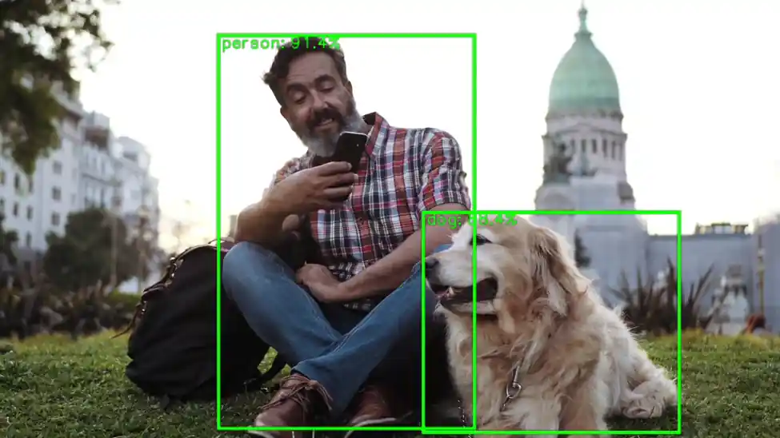

### Pose detection sample application: gst-ai-pose-detection

The gst-ai-pose-detection application allows you to detect the body pose of the subject in an image or video.

The figure shows the pipeline, which receives the input from a live camera feed, file, or an RTSP stream, performs preprocessing, conducts inference on the AI hardware, and displays the results on the screen.

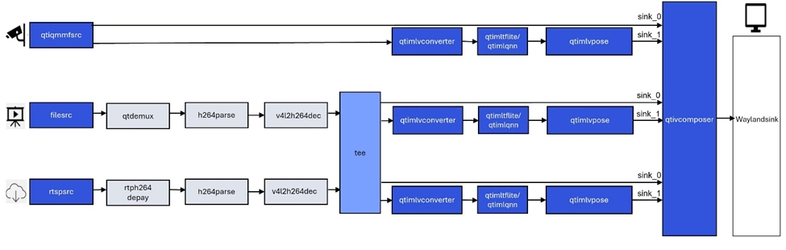

* JSON configuration file used by the sample application: */etc/configs/config\_pose.json*

**Follow these steps to perform testing:**

1. Use the camera as the input source:

:::note
Connect the camera before testing.
:::

```json
{
  "camera": "0",
  "ml-framework": "tflite",
  "model": "/etc/models/hrnet_pose_quantized.tflite",
  "labels": "/etc/labels/hrnet_pose.labels",
  "constants": "hrnet,q-offsets=<8.0>,q-scales=<0.0040499246679246426>;",
  "threshold": 51,
  "runtime": "dsp"
}

```

Alternatively, use the MP4 video file as the input source:

:::note
Set the `file-path` attribute below to the path of your MP4 video file.
:::

```json
{
  "file-path": "/etc/media/video.mp4",
  "ml-framework": "tflite",
  "model": "/etc/models/hrnet_pose_quantized.tflite",
  "labels": "/etc/labels/hrnet_pose.labels",
  "constants": "hrnet,q-offsets=<8.0>,q-scales=<0.0040499246679246426>;",
  "threshold": 51,
  "runtime": "dsp"
}

```

2. Execute the following commands to run the sample application:

```bash
sudo -i
gst-ai-pose-detection  --config-file=/etc/configs/config_pose.json
```

* The result is shown below:


### Image segmentation sample application: gst-ai-segmentation

The gst-ai-segmentation application allows you to divide an image into different and meaningful parts or segments.

The figure shows the pipeline, which receives the input from a live camera feed, file, or an RTSP stream, performs preprocessing, conducts inference on the AI hardware, and displays the results on the screen.

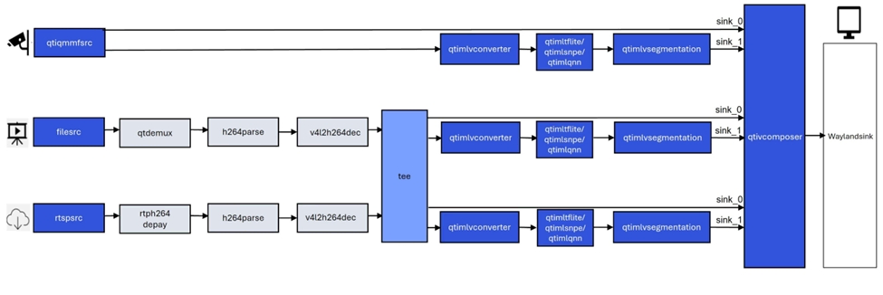

* JSON configuration file used by the sample application: */etc/configs/config\_segmentation.json*

**Follow these steps to perform testing:**

1. Use the camera as the input source:

:::note
Connect the camera before testing.
:::

```json
{
  "camera": 0,
  "ml-framework": "tflite",
  "model": "/etc/models/deeplabv3_plus_mobilenet_quantized.tflite",
  "labels": "/etc/labels/deeplabv3_resnet50.labels",
  "constants": "deeplab,q-offsets=<0.0>,q-scales=<1.0>;",
  "runtime": "dsp"
}
```

Alternatively, use the MP4 video file as the input source:

:::note
Set the `file-path` attribute below to the path of your MP4 video file.
:::

```json
{
  "file-path": "/etc/media/video.mp4",
  "ml-framework": "tflite",
  "model": "/etc/models/deeplabv3_plus_mobilenet_quantized.tflite",
  "labels": "/etc/labels/deeplabv3_resnet50.labels",
  "constants": "deeplab,q-offsets=<0.0>,q-scales=<1.0>;",
  "runtime": "dsp"
}
```

2. Execute the following commands to run the sample application:

```bash
sudo -i
gst-ai-segmentation  --config-file=/etc/configs/config_segmentation.json
```

* The result is shown below:

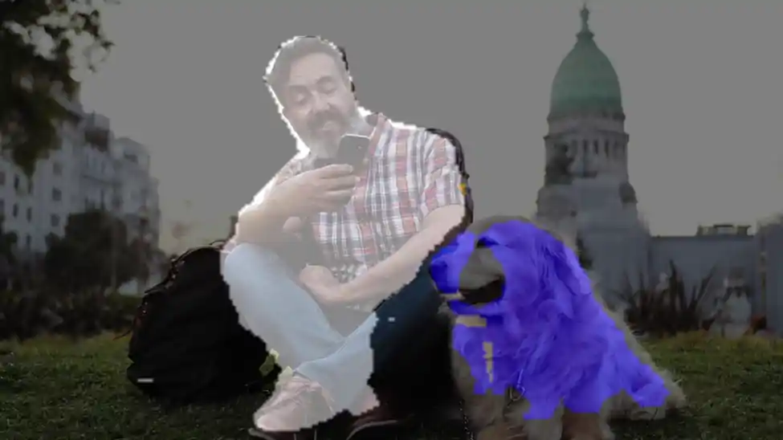

### Multi input/output object detection sample application: gst-ai-multi-input-output-object-detection

The gst-ai-multi-input-output-object-detection application allows you to perform object detection on video streams from multiple sources such as two cameras, two video files, or over the network protocol such as RTSP.

The figure shows the pipeline, which receives the input from a live camera feed, file, or an RTSP stream, performs preprocessing, conducts inference on the AI hardware, and displays the results on the screen.

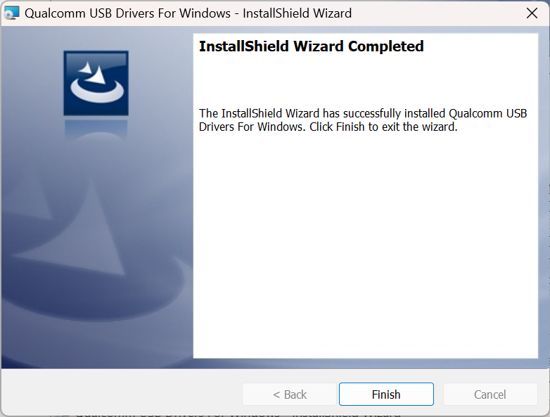

* Execute the following commands to run the sample application:

:::note
Connect two cameras before testing.
:::

```bash
sudo -i
gst-ai-multi-input-output-object-detection --num-camera=2 --out-file=/opt/H.mp4 -d --model=/etc/models/yolov5.tflite --labels=/etc/labels/yolov5.labels
```

The current command demonstrates a use case where video streams from two cameras are used simultaneously for object detection, with the inference results saved to an MP4 file and displayed on a screen.

* The result is shown below:

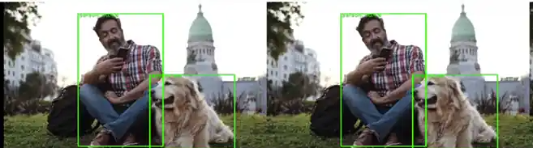

### Object detection and image classification cascade sample application：gst-ai-daisychain-detection-classification

The gst-ai-daisychain-detection-classification sample application can perform cascaded object detection and classification using a camera, file, or RTSP stream.

The figure shows the pipeline, which receives the input from a live camera feed, file, or other sources, performs preprocessing, conducts inference on the AI hardware, and displays the detection and classification results on the screen.

*Figure: gst-ai-daisychain-detection-classification send pipeline*
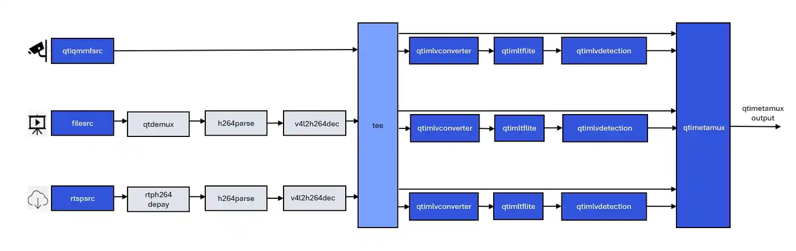

*Figure: gst-ai-daisychain-detection-classification inference pipeline*


* JSON configuration file used by the sample application: */etc/configs/config\_daisychain\_detection\_classification.json*

**Follow these steps to perform testing:**

1. Use the camera as the input source:

:::note
Connect the camera before testing.
:::

```json
{
  "camera": 0,
  "detection-model": "/etc/models/yolov8_det_quantized.tflite",
  "detection-labels": "/etc/labels/yolov8.labels",
  "classification-model": "/etc/models/inception_v3_quantized.tflite",
  "classification-labels": "/etc/labels/classification_0.labels",
  "detection-constants": "YOLOv8,q-offsets=<21.0, 0.0, 0.0>,q-scales=<3.0546178817749023, 0.003793874057009816, 1.0>;",
  "classification-constants": "Inceptionv3,q-offsets=<38.0>,q-scales=<0.17039915919303894>;"
}
```

Alternatively, use the MP4 video file as the input source:

:::note
Set the `file-path` attribute below to the path of your MP4 video file.
:::

```json
{
  "file-path": "/etc/media/video.mp4",
  "detection-model": "/etc/models/yolov8_det_quantized.tflite",
  "detection-labels": "/etc/labels/yolov8.labels",
  "classification-model": "/etc/models/inception_v3_quantized.tflite",
  "classification-labels": "/etc/labels/classification_0.labels",
  "detection-constants": "YOLOv8,q-offsets=<21.0, 0.0, 0.0>,q-scales=<3.0546178817749023, 0.003793874057009816, 1.0>;",
  "classification-constants": "Inceptionv3,q-offsets=<38.0>,q-scales=<0.17039915919303894>;"
}
```

* Execute the following commands to run the sample application:

```bash
sudo -i
gst-ai-daisychain-detection-classification   --config-file=/etc/configs/config_daisychain_detection_classification.json
```

* The result is shown below:


### Image depth estimation sample application: gst-ai-monodepth

The gst-ai-monodepth sample application can acquire visual data from three types of input sources: a live camera feed, a local video file, or a network RTSP stream. It uses a monocular depth estimation algorithm (without requiring a stereo camera) to automatically analyze and infer the depth information of each object in the scene — that is, how far each object is from the camera or observer.

The diagram below shows the workflow of the sample application.

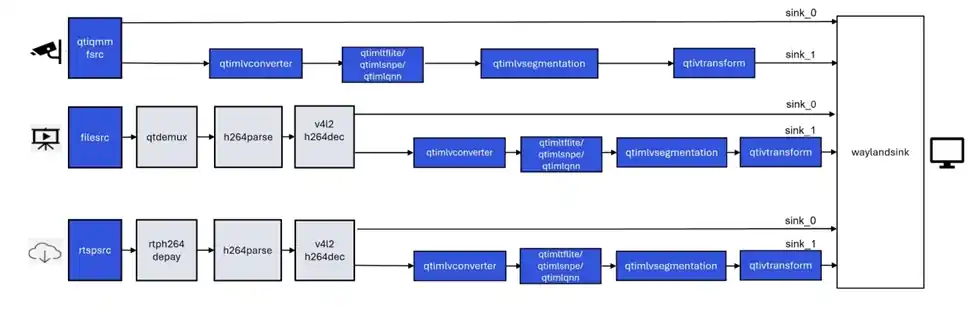

* JSON configuration file used by the sample application: */etc/configs/config\_monodepth.json*

**Follow these steps to perform testing:**

1. Use the camera as the input source:

:::note
Connect the camera before testing.
:::

```json
{
  "camera": 0,
  "ml-framework": "tflite",
  "model": "/etc/models/midas_quantized.tflite",
  "labels": "/etc/labels/monodepth.labels",
  "constants": "Midas,q-offsets=<0.0>,q-scales=<6.846843242645264>;",
  "runtime": "dsp"
}

```

Alternatively, use the MP4 video file as the input source:

:::note
Set the `file-path` attribute below to the path of your MP4 video file.
:::

```json
{
  "file-path": "/etc/media/video.mp4",
  "ml-framework": "tflite",
  "model": "/etc/models/midas_quantized.tflite",
  "labels": "/etc/labels/monodepth.labels",
  "constants": "Midas,q-offsets=<0.0>,q-scales=<6.846843242645264>;",
  "runtime": "dsp"
}

```

2. Execute the following commands to run the sample application:

```bash
sudo -i
gst-ai-classification --config-file=/etc/configs/config_monodepth.json
```

* The result is shown below:

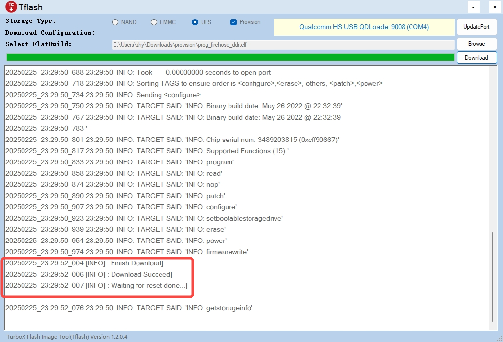

## AI/ML gstreamer command-line use cases

The AI/ML GStreamer command line use cases demonstrate the practical scenario of using the GStreamer plugin from QIM on a RUBIK Pi 3 device to feed data from a live camera or a local video file and then run a model. The following will detail the steps to run the sample applications.

### Preparations

1. Install the software package.

   Refer to the [Run sample applications](3.run-sample-applications.md) chapter and ensure that the sample application can run successfully.

2. Download the model file and label file.

* Use the following command on the device to download the compressed file *ai_gstreamer_command_line_models_labels.zip*, which contains the model files and label files required for the AI/ML GStreamer command line use cases.

   ```bash
   wget https://thundercomm.s3.dualstack.ap-northeast-1.amazonaws.com/uploads/web/rubik-pi-3/tools/ai_gstreamer_command_line_models_labels.zip
   ```

* Use the following command to extract the compressed file to the */etc* directory:

   ```bash
   unzip ./ai_gstreamer_command_line_models_labels.zip -d /opt/
   ```

**List of GStreamer command-line use cases using LiteRT and the corresponding model files and label files**


| GStreamer Command-line Use Case              | Required Model                            | Required Label File       |
| :--------------------------------------------- | :------------------------------------------ | :-------------------------- |
| image-classification-LiteRT-from-camera/file | resnet101-resnet101-w8a8.tflite           | classification_0.labels   |
| object-detection-LiteRT-from-camera/file     | yolov8_det_quantized.tflite               | yolov8.labels             |
| image-segmentation-LiteRT-from-camera/file   | deeplabv3_plus_mobilenet_quantized.tflite | deeplabv3_resnet50.labels |
| pose-detection-LiteRT-from-camera/file       | hrnet_pose_quantized.tflite               | hrnet_pose.labels         |

**List of GStreamer command-line use cases using SNPE and the corresponding model files and label files**


| GStreamer Command-line Use Case              | Required Model  | Required Label File   |
| :--------------------------------------------- | :---------------- | :---------------------- |
| image-classification-LiteRT-from-camera/file | inceptionv3.dlc | classification.labels |
| object-detection-LiteRT-from-camera/file     | yolonas.dlc     | yolonas.labels        |


### GStreamer command-line use cases using LiteRT

#### GStreamer command-line use cases for implementing AI functions by acquiring image data through a camera

##### Image classification (image-classification-LiteRT-from-camera)

This sample application uses a camera to capture images in real time and sends them to LiteRT, which performs inference using the resnet101-resnet101-w8a8.tflite model with HTP. The classification results and image information are then displayed on a monitor via Weston. Refer to the following diagram for the pipeline.


* Execute the following commands to run the sample application:

```bash
sudo -i
export XDG_RUNTIME_DIR=/run/user/$(id -u ubuntu)/ && export WAYLAND_DISPLAY=wayland-1
gst-launch-1.0 -e --gst-debug=1 qtiqmmfsrc name=camsrc camera=0  ! video/x-raw,format=NV12 ! tee name=split ! queue ! qtivcomposer name=mixer ! queue ! fpsdisplaysink sync=true signal-fps-measurements=true text-overlay=true video-sink="waylandsink fullscreen=true" split. ! queue ! qtimlvconverter ! queue ! qtimltflite name=tf_3 delegate=external external-delegate-path=libQnnTFLiteDelegate.so external-delegate-options="QNNExternalDelegate,backend_type=htp,htp_device_id=(string)0,htp_performance_mode=(string)2,htp_precision=(string)1;"  model=/opt/resnet101-resnet101-w8a8.tflite ! queue ! qtimlvclassification threshold=51.0 results=5 module=mobilenet labels=/opt/classification_0.labels extra-operation=softmax constants="Inception,q-offsets=<-38.0>,q-scales=<0.17039915919303894>;" ! video/x-raw,format=BGRA,width=640,height=360 ! queue ! mixer. 
```

* The result is shown below:


##### Object detection (object-detection-LiteRT-from-camera)

This sample application uses a camera to capture images in real time and sends them to LiteRT, which performs inference using the yolov8_det_quantized.tflite model with HTP. The object detection results and image information are then displayed on a monitor via Weston. Refer to the following diagram for the pipeline.


* Execute the following commands to run the sample application:

```bash
sudo -i
export XDG_RUNTIME_DIR=/run/user/$(id -u ubuntu)/ && export WAYLAND_DISPLAY=wayland-1
gst-launch-1.0 -e --gst-debug=1 qtiqmmfsrc name=camsrc camera=0 ! video/x-raw,format=NV12 ! tee name=split ! queue ! qtivcomposer name=mixer ! queue ! fpsdisplaysink sync=true signal-fps-measurements=true text-overlay=true video-sink="waylandsink fullscreen=true" split. ! queue ! qtimlvconverter ! queue ! qtimltflite delegate=external external-delegate-path=libQnnTFLiteDelegate.so external-delegate-options="QNNExternalDelegate,backend_type=htp;" model=/opt/yolov8_det_quantized.tflite ! queue ! qtimlvdetection threshold=75.0 results=10 module=yolov8 labels=/opt/yolov8.labels constants="YOLOv8,q-offsets=<21.0, 0.0, 0.0>,    q-scales=<3.0546178817749023, 0.003793874057009816, 1.0>;" ! video/x-raw,format=BGRA,width=640,height=360 ! queue ! mixer.
```

* The result is shown below:

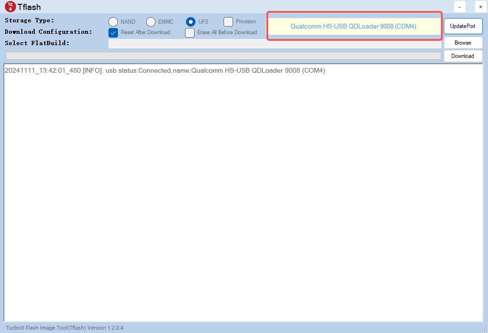

##### Image segmentation (image-segmentation-LiteRT-from-camera)

This sample application uses a camera to capture images in real time and sends them to LiteRT, which performs inference using the deeplabv3_plus_mobilenet_quantized.tflite model with HTP. The segmentation results and image information are then displayed on a monitor via Weston. Refer to the following diagram for the pipeline.


* Execute the following commands to run the sample application:

```bash
sudo -i
export XDG_RUNTIME_DIR=/run/user/$(id -u ubuntu)/ && export WAYLAND_DISPLAY=wayland-1
gst-launch-1.0 -e --gst-debug=1 qtiqmmfsrc name=camsrc camera=0 ! video/x-raw,format=NV12 ! tee name=split ! queue ! qtivcomposer name=mixer sink_1::alpha=0.5 ! queue ! fpsdisplaysink sync=true signal-fps-measurements=true text-overlay=true video-sink="waylandsink fullscreen=true" split. ! queue ! qtimlvconverter ! queue ! qtimltflite delegate=external external-delegate-path=libQnnTFLiteDelegate.so external-delegate-options="QNNExternalDelegate,backend_type=htp;" model=/opt/deeplabv3_plus_mobilenet_quantized.tflite ! queue ! qtimlvsegmentation module=deeplab-argmax labels=/opt/deeplabv3_resnet50.labels constants="deeplab,q-offsets=<-61.0>,q-scales=<0.06232302635908127>;" ! video/x-raw,format=BGRA,width=256,height=144 ! queue ! mixer.
```

* The result is shown below:

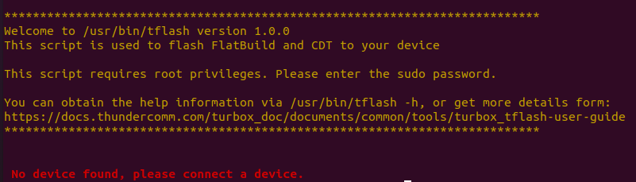

##### Pose detection (pose-detection-LiteRT-from-camera)

This sample application uses a camera to capture images in real time and sends them to LiteRT, which performs inference using the hrnet_pose_quantized.tflite model with HTP. The pose detection results and image information are then displayed on a monitor via Weston. Refer to the following diagram for the pipeline.

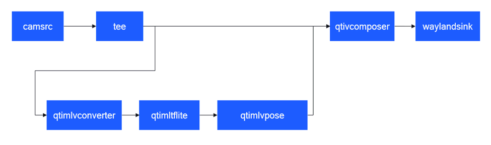

* Execute the following commands to run the sample application:

```bash
sudo -i
export XDG_RUNTIME_DIR=/run/user/$(id -u ubuntu)/ && export WAYLAND_DISPLAY=wayland-1
gst-launch-1.0 -e --gst-debug=1 qtiqmmfsrc name=camsrc camera=0 ! video/x-raw,format=NV12 ! tee name=split ! queue ! qtivcomposer name=mixer sink_1::alpha=0.5 ! queue ! fpsdisplaysink sync=true signal-fps-measurements=true text-overlay=true video-sink="waylandsink fullscreen=true" split. ! queue ! qtimlvconverter ! queue ! qtimltflite delegate=external external-delegate-path=libQnnTFLiteDelegate.so external-delegate-options="QNNExternalDelegate,backend_type=htp;" model=/opt/hrnet_pose_quantized.tflite ! queue ! qtimlvpose threshold=51.0 results=2 module=hrnet labels=/opt/hrnet_pose.labels constants="hrnet,q-offsets=<8.0>,q-scales=<0.0040499246679246426>;" ! video/x-raw,format=BGRA,width=640,height=360 ! queue ! mixer.
```

* The result is shown below:


#### GStreamer command-line use cases for implementing AI functionality by acquiring image data from a recorded MP4 file

##### Image classification (image-classification-LiteRT-from-file)

This sample application uses an MP4 file to obtain image data and sends it to LiteRT, which performs inference using the resnet101-resnet101-w8a8.tflite model with HTP. The classification results and image information are then displayed on a monitor via Weston. Refer to the following diagram for the pipeline.


* Execute the following commands to run the sample application:

```bash
sudo -i
export XDG_RUNTIME_DIR=/run/user/$(id -u ubuntu)/ && export WAYLAND_DISPLAY=wayland-1
gst-launch-1.0 -v --gst-debug=2 filesrc location=/opt/Draw_1080p_180s_30FPS.mp4 ! qtdemux ! h264parse ! v4l2h264dec capture-io-mode=4 output-io-mode=4 ! video/x-raw,format=NV12 ! tee name=split ! queue ! qtivcomposer name=mixer ! queue ! fpsdisplaysink sync=true signal-fps-measurements=true text-overlay=true video-sink="waylandsink fullscreen=true" split. ! queue ! qtimlvconverter ! queue ! qtimltflite name=tf_3 delegate=external external-delegate-path=libQnnTFLiteDelegate.so external-delegate-options="QNNExternalDelegate,backend_type=htp,htp_device_id=(string)0,htp_performance_mode=(string)2,htp_precision=(string)1;"  model=/opt/resnet101-resnet101-w8a8.tflite ! queue ! qtimlvclassification threshold=51.0 results=5 module=mobilenet labels=/opt/classification_0.labels extra-operation=softmax constants="Inception,q-offsets=<-38.0>,q-scales=<0.17039915919303894>;" ! video/x-raw,format=BGRA,width=640,height=360 ! queue ! mixer. 
```

* The result is shown below:


##### Object detection (object-detection-LiteRT-from-file)

This sample application uses an MP4 file to obtain image data and sends it to LiteRT, which performs inference using the yolov8_det_quantized.tflite model with HTP. The object detection results and image information are then displayed on a monitor via Weston. Refer to the following diagram for the pipeline.

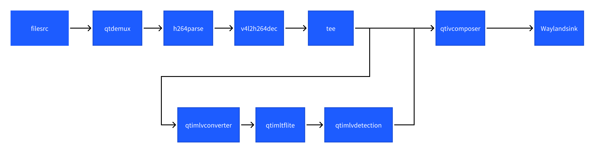

* Execute the following commands to run the sample application:

```bash
sudo -i
export XDG_RUNTIME_DIR=/run/user/$(id -u ubuntu)/ && export WAYLAND_DISPLAY=wayland-1
gst-launch-1.0 -v --gst-debug=2 filesrc location=/opt/Draw_1080p_180s_30FPS.mp4 ! qtdemux ! h264parse ! v4l2h264dec capture-io-mode=4 output-io-mode=4 ! video/x-raw,format=NV12 ! tee name=split ! queue ! qtivcomposer name=mixer ! queue ! fpsdisplaysink sync=true signal-fps-measurements=true text-overlay=true video-sink="waylandsink fullscreen=true" split. ! queue ! qtimlvconverter ! queue ! qtimltflite delegate=external external-delegate-path=libQnnTFLiteDelegate.so external-delegate-options="QNNExternalDelegate,backend_type=htp;" model=/opt/yolov8_det_quantized.tflite ! queue ! qtimlvdetection threshold=75.0 results=10 module=yolov8 labels=/opt/yolov8.labels constants="YOLOv8,q-offsets=<21.0, 0.0, 0.0>,    q-scales=<3.0546178817749023, 0.003793874057009816, 1.0>;" ! video/x-raw,format=BGRA,width=640,height=360 ! queue ! mixer.
```

* The result is shown below:


##### Image segmentation (image-segmentation-LiteRT-from-file)

This sample application uses an MP4 file to obtain image data and sends it to LiteRT, which performs inference using the deeplabv3_plus_mobilenet_quantized.tflite model with HTP. The segmentation results and image information are then displayed on a monitor via Weston. Refer to the following diagram for the pipeline.


* Execute the following commands to run the sample application:

```bash
sudo -i
export XDG_RUNTIME_DIR=/run/user/$(id -u ubuntu)/ && export WAYLAND_DISPLAY=wayland-1
gst-launch-1.0 -v --gst-debug=2 filesrc location=/opt/Draw_1080p_180s_30FPS.mp4 ! qtdemux ! h264parse ! v4l2h264dec capture-io-mode=4 output-io-mode=4 ! video/x-raw,format=NV12 ! tee name=split ! queue ! qtivcomposer name=mixer sink_1::alpha=0.5 ! queue ! fpsdisplaysink sync=true signal-fps-measurements=true text-overlay=true video-sink="waylandsink fullscreen=true" split. ! queue ! qtimlvconverter ! queue ! qtimltflite delegate=external external-delegate-path=libQnnTFLiteDelegate.so external-delegate-options="QNNExternalDelegate,backend_type=htp;" model=/opt/deeplabv3_plus_mobilenet_quantized.tflite ! queue ! qtimlvsegmentation module=deeplab-argmax labels=/opt/deeplabv3_resnet50.labels constants="deeplab,q-offsets=<-61.0>,q-scales=<0.06232302635908127>;" ! video/x-raw,format=BGRA,width=256,height=144 ! queue ! mixer.
```

* The result is shown below:


##### Pose detection (pose-detection-LiteRT-from-file)

This sample application uses an MP4 file to obtain image data and sends it to LiteRT, which performs inference using the hrnet_pose_quantized.tflite model with HTP. The pose detection results and image information are then displayed on a monitor via Weston. Refer to the following diagram for the pipeline.


* Execute the following commands to run the sample application:

```bash
sudo -i
export XDG_RUNTIME_DIR=/run/user/$(id -u ubuntu)/ && export WAYLAND_DISPLAY=wayland-1
gst-launch-1.0 -v --gst-debug=2 filesrc location=/opt/Draw_1080p_180s_30FPS.mp4 ! qtdemux ! h264parse ! v4l2h264dec capture-io-mode=4 output-io-mode=4 ! video/x-raw,format=NV12 ! tee name=split ! queue ! qtivcomposer name=mixer sink_1::alpha=0.5 ! queue ! fpsdisplaysink sync=true signal-fps-measurements=true text-overlay=true video-sink="waylandsink fullscreen=true" split. ! queue ! qtimlvconverter ! queue ! qtimltflite delegate=external external-delegate-path=libQnnTFLiteDelegate.so external-delegate-options="QNNExternalDelegate,backend_type=htp;" model=/opt/hrnet_pose_quantized.tflite ! queue ! qtimlvpose threshold=51.0 results=2 module=hrnet labels=/opt/hrnet_pose.labels constants="hrnet,q-offsets=<8.0>,q-scales=<0.0040499246679246426>;" ! video/x-raw,format=BGRA,width=640,height=360 ! queue ! mixer.
```

* The result is shown below:

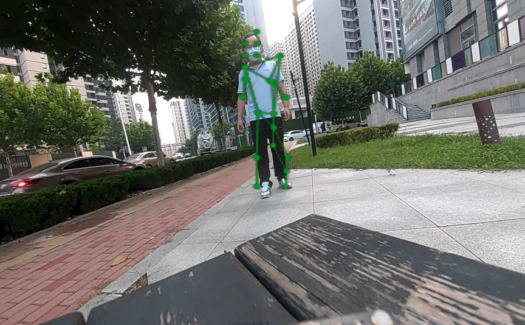

### GStreamer command-line use cases using SNPE

#### GStreamer command-line use cases for implementing AI functionality by acquiring image data from a camera

##### Image classification (image-classification-LiteRT-from-camera)

This sample application uses a camera to capture images in real time and sends them to SNPE, which performs inference using the inceptionv3.dlc model with HTP. The classification results and image information are then displayed on a monitor via Weston. Refer to the following diagram for the pipeline.

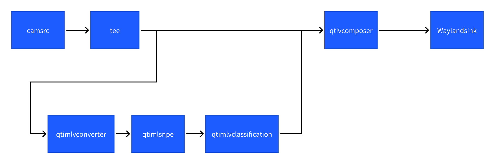

* Execute the following commands to run the sample application:

```bash
sudo -i
export XDG_RUNTIME_DIR=/run/user/$(id -u ubuntu)/ && export WAYLAND_DISPLAY=wayland-1
gst-launch-1.0 -e --gst-debug=1 qtiqmmfsrc name=camsrc camera=0 ! video/x-raw,format=NV12 ! queue ! tee name=split ! queue ! qtivcomposer name=mixer ! queue ! fpsdisplaysink sync=true text-overlay=true video-sink="waylandsink sync=true fullscreen=true"  split. ! queue ! qtimlvconverter ! queue ! qtimlsnpe delegate=dsp model=/opt/inceptionv3.dlc ! queue ! qtimlvclassification threshold=40.0 results=2 module=mobilenet labels=/opt/classification.labels ! queue ! video/x-raw,format=BGRA,width=640,height=360 ! queue ! mixer.
```

* The result is shown below:


##### Object detection (object-detection-LiteRT-from-camera)

This sample application uses a camera to capture images in real time and sends them to SNPE, which performs inference using the yolonas.labels model with HTP. The object detection results and image information are then displayed on a monitor via Weston. Refer to the following diagram for the pipeline.


* Execute the following commands to run the sample application:

```bash
sudo -i
export XDG_RUNTIME_DIR=/run/user/$(id -u ubuntu)/ && export WAYLAND_DISPLAY=wayland-1
gst-launch-1.0 -e --gst-debug=1 qtiqmmfsrc name=camsrc camera=0 ! video/x-raw,format=NV12 ! tee name=split split. ! queue ! qtivcomposer name=mixer ! queue ! fpsdisplaysink sync=true signal-fps-measurements=true text-overlay=true video-sink='waylandsink fullscreen=true sync=true' split. ! queue ! qtimlvconverter ! queue ! qtimlsnpe delegate=dsp model=/opt/yolonas.dlc layers="</heads/Mul, /heads/Sigmoid>" ! queue ! qtimlvdetection module=yolo-nas labels=/opt/yolonas.labels ! video/x-raw,format=BGRA ! queue ! mixer.
```

* The result is shown below:

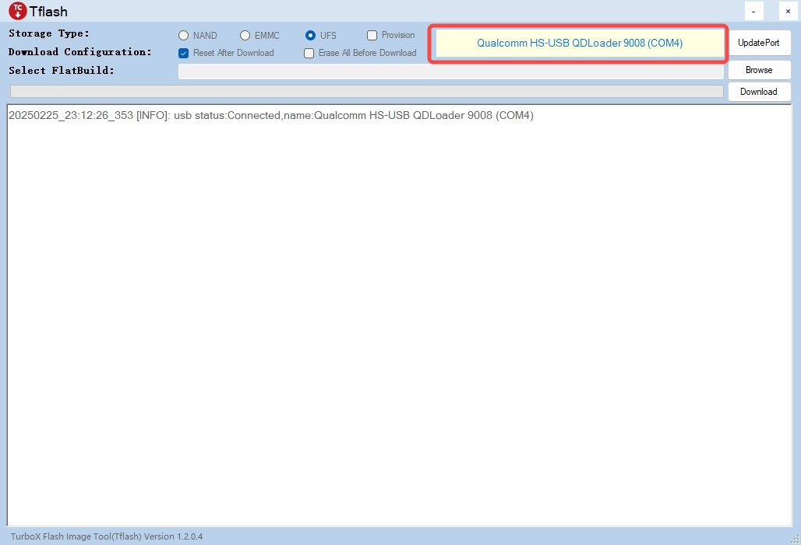

#### GStreamer command-line use cases for implementing AI functionality by acquiring image data from a recorded MP4 file

##### Image classification (image-classification-LiteRT-from-file)

This sample application uses an MP4 file to obtain image data and sends it to SNPE, which performs inference using the inceptionv3.dlc model with HTP. The classification results and image information are then displayed on a monitor via Weston. Refer to the following diagram for the pipeline.


* Execute the following commands to run the sample application:

```bash
sudo -i
export XDG_RUNTIME_DIR=/run/user/$(id -u ubuntu)/ && export WAYLAND_DISPLAY=wayland-1
gst-launch-1.0 -e filesrc location=/opt/Draw_1080p_180s_30FPS.mp4 ! qtdemux ! queue ! h264parse ! v4l2h264dec capture-io-mode=4 output-io-mode=4 ! video/x-raw,format=NV12 ! queue ! tee name=split ! queue ! qtivcomposer name=mixer ! queue ! fpsdisplaysink sync=true text-overlay=true video-sink="waylandsink sync=true fullscreen=true"  split. ! queue ! qtimlvconverter ! queue ! qtimlsnpe delegate=dsp model=/opt/inceptionv3.dlc ! queue ! qtimlvclassification threshold=40.0 results=2 module=mobilenet labels=/opt/classification.labels ! queue ! video/x-raw,format=BGRA,width=640,height=360 ! queue ! mixer.
```

* The result is shown below:


##### Object detection (object-detection-LiteRT-from-file)

This sample application uses an MP4 file to obtain image data and sends it to SNPE, which performs inference using the yolonas.labels model with HTP. The object detection results and image information are then displayed on a monitor via Weston. Refer to the following diagram for the pipeline.


* Execute the following commands to run the sample application:

```bash
sudo -i
export XDG_RUNTIME_DIR=/run/user/$(id -u ubuntu)/ && export WAYLAND_DISPLAY=wayland-1
gst-launch-1.0 -e --gst-debug=2 filesrc location=/opt/Draw_1080p_180s_30FPS.mp4 ! qtdemux ! queue ! h264parse ! v4l2h264dec capture-io-mode=4 output-io-mode=4 ! video/x-raw,format=NV12 ! tee name=split split. ! queue ! qtivcomposer name=mixer ! queue ! fpsdisplaysink sync=true signal-fps-measurements=true text-overlay=true video-sink='waylandsink fullscreen=true sync=true' split. ! queue ! qtimlvconverter ! queue ! qtimlsnpe delegate=dsp model=/opt/yolonas.dlc layers="</heads/Mul, /heads/Sigmoid>" ! queue ! qtimlvdetection module=yolo-nas labels=/opt/yolonas.labels ! video/x-raw,format=BGRA ! queue ! mixer.
```

* The result is shown below:


## Refences

* Reference documentation for compiling sample applications
  
   [AI Developer_Workflow](https://docs.qualcomm.com/bundle/publicresource/topics/80-90441-15/introduction.html?product=1601111740057201&facet=AI%20developer%20workflow)

* Reference documentation for the QIM SDK and all AI/MM sample applications
  
   [Qualcomm Intelligent Multimedia SDK (IM SDK) Reference - Qualcomm® Linux Documentation](https://docs.qualcomm.com/bundle/publicresource/topics/80-70020-50/example-applications.html?vproduct=1601111740013072&version=1.5&facet=Qualcomm%20Intelligent%20Multimedia%20SDK)
