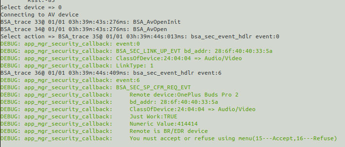
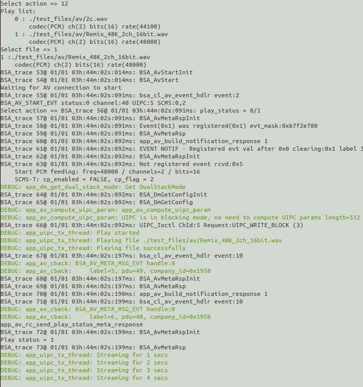
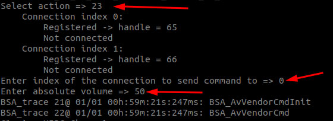

# 11. User Guide to the RUBIK Pi 3 Bluetooth Tool – rubikpi_btapp

## 11.1 Enable Bluetooth and pair devices

1. Run rubikpi\_btapp.

   ```shell showLineNumbers
   rubikpi_btapp
   ```

   The main menu is output as follows. The main menu shows the rubikpi-btapp functional modules. Type a number to go to the menu of the corresponding function (0: Exit the program, 99: Print help information, 1: Return to the previous level).

   ```plain showLineNumbers
   BSA_trace 1@ 01/01 00h:31m:18s:746ms: BSA_MgtOpenInit
   BSA_trace 2@ 01/01 00h:31m:18s:746ms: BSA_MgtOpen (/usr/src/rubikpi-btapp/)
   Created thread with thread_id=  8119f120
   BSA_trace 3@ 01/01 00h:31m:18s:746ms: bsa_cl_mgt_init
   BSA_trace 4@ 01/01 00h:31m:18s:746ms: UIPC_Init
   BSA_trace 5@ 01/01 00h:31m:18s:746ms: UIPC_Open ChId:3
    
   *****************Main Menu menu*******************
            1 ==>main
            2 ==>manager
            3 ==>opp
            4 ==>a2dp
            5 ==>pan
            6 ==>pbap
            7 ==>sap
            8 ==>hfp ag
            9 ==>hfp client
            10 ==>hfp sw
            11 ==>av
            12 ==>data gw
            13 ==>fm
            14 ==>ftp
            15 ==>hid dev
            16 ==>hid host
            17 ==>headless
            18 ==>health
            19 ==>map
            20 ==>nsa
            21 ==>ctn
            22 ==>3d
            23 ==>test
            24 ==>vsc
            25 ==>ble
            26 ==>ble_ancs
            27 ==>ble_cscc
            28 ==>ble_blp
            29 ==>ble_eddystone
            30 ==>ble_hrc
            31 ==>ble_htp
            32 ==>ble_pm
            33 ==>ble_rscc
            34 ==>ble_tvselect
            35 ==>ble_wifi
            99 ==>help
            0 ==>quit
    ****************************************************
   Select action => 
   ```

2. Type "2" to go to the manager menu, which contains basic Bluetooth pairing and connection functions. The manager menu is as follows:

   ```plain showLineNumbers
   Select action => 2
    
   *****************manager menu*******************
            1 ==>main_menu
            99 ==>help_menu
            0 ==>quit
    ****************************************************
   Bluetooth Application Manager menu:
           2 => Init
           3 => Abort Discovery
           4 => Discovery
           5 => Discovery test
           6 => Bonding
           7 => Cancel Bonding
           8 => Remove device from security database
           9 => Services Discovery (all services)
           10 => Device Id Discovery
           11 => Set local Device Id
           12 => Get local Device Id
           13 => Stop Bluetooth
           14 => Restart Bluetooth
           15 => Accept Simple Pairing
           16 => Refuse Simple Pairing
           17 => Enter BLE Passkey
           18 => Act As HID Keyboard (SP passkey entry)
           19 => Read Device configuration
           20 => Read Local Out Of Band data
           21 => Enter remote Out Of Band data
           22 => Set device visibility
           23 => Set device BLE visibility
           24 => Set AFH Configuration
           25 => Set Tx Power Class2 (specific FW needed)
           26 => Set Tx Power Class1.5 (specific FW needed)
           27 => Change Dual Stack Mode (currently:DUAL_STACK_MODE_BSA)
           28 => Set Link Policy
           29 => Enter Passkey
           30 => Get Remote Device Name
           31 => RSSI Measurement
           32 => Tx Power Measurement
           33 => Set class of device
           96 => Kill BSA server
           97 => Connect to BSA server
           98 => Disconnect from BSA server
           0 => Exit
   Select action => 

   ```

3. Initialize the manager.

   :::note
   Other menus' communication is based on the socket established in the manager. Therefore, initialize the manager before performing operations in other menus.
   :::

   Type "2" to initialize the manager:

   ```plain showLineNumbers
   Select action => 2
   DEBUG: app_mgr_read_config: Enable:1
   DEBUG: app_mgr_read_config: Discoverable:1
   DEBUG: app_mgr_read_config: Connectable:1
   DEBUG: app_mgr_read_config: Name:BSA_HOGP
   DEBUG: app_mgr_read_config: Bdaddr be:ef:be:ef:25:6a
   DEBUG: app_mgr_read_config: ClassOfDevice:00:04:24 => Audio/Video
   DEBUG: app_mgr_read_config: RootPath:/usr/src/rubikpi-btapp/pictures
   DEBUG: app_mgr_read_config: Default PIN (4):0000
   ERROR: app_xml_read_db: open(/usr/src/rubikpi-btapp/bt_devices.xml) failed
   ERROR: app_mgr_read_remote_devices: app_xml_read_db failed:-1
   ERROR: app_mgr_config: No remote device database found
   BSA_trace 6@ 01/01 00h:33m:52s:562ms: BSA_DmGetConfigInit
   BSA_trace 7@ 01/01 00h:33m:52s:562ms: BSA_DmGetConfig
   DEBUG: app_mgr_get_bt_config: Enable:1
   DEBUG: app_mgr_get_bt_config: Discoverable:1
   DEBUG: app_mgr_get_bt_config: Connectable:1
   DEBUG: app_mgr_get_bt_config: Name:BSA_HOGP
   DEBUG: app_mgr_get_bt_config: Bdaddr be:ef:be:ef:25:6a
   DEBUG: app_mgr_get_bt_config: ClassOfDevice:00:04:24
   DEBUG: app_mgr_get_bt_config: First host disabled channel:79
   DEBUG: app_mgr_get_bt_config: Last host disabled channel:79
   DEBUG: app_mgr_sec_set_security: 
   BSA_trace 8@ 01/01 00h:33m:52s:564ms: BSA_SecSetSecurityInit
   BSA_trace 9@ 01/01 00h:33m:52s:564ms: BSA_SecSetSecurity
   Add all devices found in database
   ERROR: app_xml_read_si_db: open(/usr/src/rubikpi-btapp/si_devices.xml) failed
   ERROR: app_read_xml_si_devices: app_xml_read_si_db failed: -1
   BSA_trace 10@ 01/01 00h:33m:52s:564ms: BSA_DmSetConfigInit
   DEBUG: app_mgr_set_bt_config: Enable:1
   DEBUG: app_mgr_set_bt_config: Discoverable:1
   DEBUG: app_mgr_set_bt_config: Connectable:1
   DEBUG: app_mgr_set_bt_config: Name:BSA_HOGP
   DEBUG: app_mgr_set_bt_config: Bdaddr be:ef:be:ef:25:6a
   DEBUG: app_mgr_set_bt_config: ClassOfDevice:00:04:24
   DEBUG: app_mgr_set_bt_config: First host disabled channel:79
   DEBUG: app_mgr_set_bt_config: Last host disabled channel:79
   BSA_trace 11@ 01/01 00h:33m:52s:565ms: BSA_DmSetConfig
   BSA_trace 12@ 01/01 00h:33m:52s:676ms: BSA_TmReadVersionInit
   BSA_trace 13@ 01/01 00h:33m:52s:676ms: BSA_TmReadVersion
   Server status:0
   FW Version:3.6.6.1154
   BSA Server Version:BSA0107_00.26.00_qcom_qcs6490
   BSA Server Version Information:Use_local_timestamp_for_logs_20240814
   DEBUG: app_dm_get_dual_stack_mode: Get DualStackMode
   BSA_trace 14@ 01/01 00h:33m:52s:678ms: BSA_DmGetConfigInit
   BSA_trace 15@ 01/01 00h:33m:52s:678ms: BSA_DmGetConfig
   Current DualStack mode:DUAL_STACK_MODE_BSA
   Select action => 

   ```

4. Search for devices.

   Type "4" to search for devices available for pairing. (Since communication between the app and service is asynchronous, you will need to wait a moment before the available devices are displayed.)&#x20;

   ```plain showLineNumbers
   Select action => 4
   Start Regular Discovery
   BSA_trace 16@ 01/01 01h:45m:29s:988ms: BSA_DiscStartInit
   BSA_trace 17@ 01/01 01h:45m:29s:988ms: BSA_DiscStart
   Select action => New Discovered device:0
           Bdaddr:69:00:83:7f:b1:15
           Name:
           ClassOfDevice:00:00:00 => Misc device
           Services:0x00000000 ()
           Rssi:-47
           DeviceType:BLE InquiryType:BLE AddressType:Random
           Extended Information:
               Flags:0x1a [LE_General Controller_LE/BR/EDR Host_LE/BR/EDR]
               TxPower:12 dB
               Manufacturer Specific CompanyId:0x004C [Apple, Inc.]:
                   Data: 10 05 65 1C 6D B4 B4 
   ......
   ......
   Discovery complete
   ```

5. Pair devices

   Type "6" to go to the bonding menu. The devices previously searched for pairing will be displayed. Type the corresponding device number to pair with the desired device. Then, follow the prompts to type "15" or "16" to confirm whether to accept the pairing (15-Accept, 16-Refuse). Once accepted, the pairing process will be completed.

   ```plain showLineNumbers
   Dev:0
           Bdaddr:5a:20:4e:6e:f7:57
           Name:
           ClassOfDevice:00:00:00 => Misc device
           Rssi:-55
   ......
   ```

   If needed, type "7" to unpair the Bluetooth device.

## 11.2 Transfer files via Bluetooth

In the main menu, type "3" and press **Enter** to go to the opp menu for file transfer testing:

```plain showLineNumbers
Select action => 3
 
*****************opp menu*******************
         1 ==>main_menu
         99 ==>help_menu
         0 ==>quit
 ****************************************************
Bluetooth Application OPP Menu:
    2 => opp server enable
    3 => opp server disable
    4 => ops enable auto accept
    5 => ops disconnect device
    6 => opp client enable
    7 => opp client disable
    8 => push vcard
    9 => exchange vcard
    10 => pull vcard
    11 => push /usr/src/rubikpi-btapp/test_file.txt
    12 => opc disconnect device
    13 => discovery
    0 => Exit
Select action => 

```

* Test file receiving

1. The terminal where rubikpi-btapp is run in the previous section is called terminal 1. In another terminal – terminal 2, go to the rubikpi-btapp directory */usr/src/rubikpi-btapp/* and create a new directory *push* using the following command:

   ```shell showLineNumbers
   mkdir push
   ```

2. Go back to terminal 1. In the opp menu, type "2" to enable the opp server.&#x20;

   ```plain showLineNumbers
   Select action => 2
   app_start_ops
   BSA_trace 6@ 01/01 00h:40m:39s:334ms: BSA_OpsEnableInit
   BSA_trace 7@ 01/01 00h:40m:39s:334ms: BSA_OpsEnable
   app_start_ops Status: 0 
   Select action => 

   ```

3. Type "4" to enable automatic file reception. Then, use the device paired with RUBIK Pi 3 to send a test file. RUBIK Pi 3 will save the received file in the *push* directory. Once the transfer is complete, you can find the transmitted file in the *push* directory through terminal 2.

   ```plain showLineNumbers
   Select action => 4
   BSA_trace 8@ 01/01 00h:41m:54s:528ms: BSA_OpsAccessInit
   app_ops_auto_accept
   DEBUG: app_ops_auto_accept: app_ops Auto - oper:1 access:4 Name:/usr/src/rubikpi-btapp/push/
   BSA_trace 9@ 01/01 00h:41m:54s:528ms: BSA_OpsAccess
   app_ops Auto - oper:2 access:4 Name:/usr/src/rubikpi-btapp/pull/Abdul Iqbal.vcf
   BSA_trace 10@ 01/01 00h:41m:54s:530ms: BSA_OpsAccess
   Select action => 

   ```

4. Type "3" to disable the server.

   ```plain showLineNumbers
   Select action => 3
   app_stop_ops
   BSA_trace 11@ 01/01 00h:42m:52s:588ms: BSA_OpsDisableInit
   BSA_trace 12@ 01/01 00h:42m:52s:588ms: BSA_OpsDisable
   Select action => 

   ```

* Test file sending

1. In terminal 2, go to the rubikpi-btapp path *usr/src/rubikpi-btapp/*, create a file *test\_file.txt&#x20;*&#x66;or the sending test, and run the following command to write the content to the file:

   ```shell showLineNumbers
   touch ./test_file.txt
   echo RUBIKPI_TEST > test_file.txt
   ```

2. Go back to terminal 1. In the opp menu, type "6" to enable the opp client.

   ```plain showLineNumbers
   Select action => 6
   app_opc_start
   BSA_trace 13@ 01/01 00h:44m:27s:670ms: BSA_OpcEnableInit
   BSA_trace 14@ 01/01 00h:44m:27s:670ms: BSA_OpcEnable
   app_opc_start Status: 0 
   Select action => 
   ```

3. Type "11" to get ready to send the test file. Select the number of the device to which you want to send the file and press **Enter**. The device will be ready to receive the file. After the file is received, type "7" to disable the client.

## 11.3 Test Bluetooth audio

* Audio playback test

  1. In the main menu, type "11" to go to av mode:

     ```yaml showLineNumbers
     Select action => 11
      
     *****************av menu*******************
              1 ==>main_menu
              99 ==>help_menu
              0 ==>quit
      ****************************************************
     Bluetooth Application AV menu
       AV Point To Point menu:
         2 => Abort Discovery
         3 => Start Discovery
         4 => Display local source points
         5 => AV Register (Create local source point)
         6 => AV DeRegister (Remove local source point)
         7 => AV Open (Connect)
         8 => AV Close (Disconnect)
         9 => AV Play AVK Stream
         10 => AV Play Tone
         11 => AV Toggle Tone
         12 => AV Play File
         13 => AV Start Playlist
         14 => AV Play Microphone
         15 => Accept Request
         16 => Refuse Request
         17 => AV Stop
         18 => AV Pause
         19 => AV Resume
         20 => AV Send RC Command (Inc Volume)
         21 => AV Send RC Command (Dec Volume)
         22 => AV Close RC
         23 => AV Send Absolute Vol RC Command
         24 => AV Configure UIPC
         25 => AV Change Content Protection (Currently:NONE)
         26 => AV Test SEC codec
         27 => AV Set Tone sampling frequency
         28 => AV Send Meta Response to Get Element Attributes Command
         29 => AV Send Meta Response to Get Play Status Command
         30 => AV Send Metadata Change Notifications
         31 => Change AV file for PTS test
         32 => Reset folder location for PTS test
         0 => Exit
     DEBUG: app_uipc_tx_thread: Starting UIPC Tx thread
     DEBUG: app_uipc_tx_thread: Waiting for play start
     DEBUG: app_playlist_create: New file Audio file found:2c.wav
     DEBUG: app_playlist_create: New file Audio file found:Remix_48K_2ch_16bit.wav
     WAV format of: /usr/src/rubikpi-btapp/test_files/av/2c.wav
         codec(PCM) ch(2) bits(16) rate(44100)
     WAV format of: /usr/src/rubikpi-btapp/test_files/av/Remix_48K_2ch_16bit.wav
         codec(PCM) ch(2) bits(16) rate(48000)
     app_av_cb.soundfile_list_size:2
     BSA_trace 6@ 01/01 00h:46m:41s:124ms: BSA_AvEnableInit
     BSA_trace 7@ 01/01 00h:46m:41s:124ms: BSA_AvEnable
     BSA_trace 8@ 01/01 00h:46m:41s:127ms: BSA_AvRegisterInit
     BSA_trace 9@ 01/01 00h:46m:41s:127ms: BSA_AvRegister
     BSA_trace 10@ 01/01 00h:46m:41s:134ms: UIPC_Open ChId:5
     BSA_trace 11@ 01/01 00h:46m:41s:134ms: uipc_rb_open name:rb_av id:5 size:20001 flags:x2
     BSA_trace 12@ 01/01 00h:46m:41s:134ms: uipc_rb_open: Size = 20001
     BSA_trace 13@ 01/01 00h:46m:41s:134ms: uipc_rb_open: Buffer = 0x7f97074010
     BSA_trace 14@ 01/01 00h:46m:41s:134ms: uipc_rb_open: semid = 0
     BSA_trace 15@ 01/01 00h:46m:41s:134ms: uipc_rb_open: wr_lockid = 1
     BSA_trace 16@ 01/01 00h:46m:41s:134ms: uipc_rb_open: wr_lockid.val = 20000
     BSA_trace 17@ 01/01 00h:46m:41s:134ms: uipc_cl_av_open AV channel opened
     BSA_trace 18@ 01/01 00h:46m:41s:134ms: UIPC_Ioctl ChId:5 Request:UIPC_WRITE_BLOCK (3)
     BSA_trace 19@ 01/01 00h:46m:41s:134ms: BSA_AvRegisterInit
     BSA_trace 20@ 01/01 00h:46m:41s:134ms: BSA_AvRegister
     Select action => 

     ```

  2. Type "3" to start discovering Bluetooth audio devices and wait for the discovery to complete.

  3. Type "7" to go to connect mode.

     ```yaml showLineNumbers
     Select action => 7
     Bluetooth AV Open menu:
         0 Device from XML database (already paired)
         1 Device found in last discovery
     Select source => 

     ```

  4. Type "1", find the device you want to connect from the discovered ones, type the corresponding device number, and start paring. The following example uses dev 0 as a reference.

     ```plain showLineNumbers
     Select source => 1
     Dev:0
             Bdaddr:60:6b:4d:3e:93:26
             Name:
             ClassOfDevice:00:00:00 => Misc device
             Rssi:-65
     Dev:1
     ......
     Select device => 


     ```

  5. Type "15" or "16" to confirm whether to accept the connection request.

       

    After accepting the connection request, the pairing process begins until the Bluetooth device is successfully connected.

  6.  Type "12" to go to the playback menu, select the desired test audio, and start playback. The Bluetooth audio device will output sound.

      
  7.  While playing Bluetooth audio, you can adjust the volume by sequentially entering "23 > 0 > volume value." The volume range is from 0 to 100.
  
      

* Bluetooth recording test

  1. In the main menu, type "8" to go to ag mode. The ag menu is as follows:

     ```plain showLineNumbers
     Select action => 8
      
     *****************hfp ag menu*******************
              1 ==>main_menu
              99 ==>help_menu
              0 ==>quit
      ****************************************************
     Bluetooth Application HFP AG menu:
         2  => Initialize
         3  => Deinitialize
         4  => Discover Headset
         5  => Enable 
         6  => Disable 
         7  => Register 
         8  => Deregister 
         9  => Connect 
         10  => Disconnect
         11  => Open audio 
         12  => Close audio 
         13  => Record audio file
         15 => Accept Request
         16 => Refuse Request
         14  => Stop record audio file
         17  => Play audio file
         18  => Stop Playing audio file
         19  => Display SCO route config
         20  => Indicate incoming call
         21  => PickUp call
         22  => HangUp call
         0  => Quit
     Select action => 

     ```

  2. Type "2" to initialize ag mode.

  3. Type "4" to discover the Bluetooth headset and wait for the discovery to complete.

  4. Type "9" to go to the connect menu.

     ```plain showLineNumbers
     Select action => 9
     DEBUG: app_ag_open: Entering
     Bluetooth AG menu:
         0 Device from XML database (already paired)
         1 Device found in last discovery
     Select source => 
     ```

  5. Type "1" to select the device you want to connect from the discovered ones.

  6. Type the device number to start connection.

  7. Type "15" or "16" to confirm whether to accept the connection.

     ```plain showLineNumbers
     You must accept or refuse using menu(15---Accept,16---Refuse)
     ```

  8. Type "11" to open the SCO link.

  In another terminal – terminal 3, run the following commands:

  ```c++ showLineNumbers
  systemctl stop pulseaudio

  #Start recording audio from the Bluetooth headset microphone.
  agmcap /home/root/my.wav -D 100 -d 101 -r 16000 -b 16 -c 1 -i MI2S-LPAIF_VA-TX-PRIMARY -dkv 0xA3000003 -p 120 -n 2

  #Press Ctrl+C to stop recording.

  systemctl start pulseaudio
  ```

  The recorded audio is saved at */home/root/my.wav*.

  ```shell showLineNumbers
  mkdir /data/misc/display -p


  export PATH=/usr/bin:$PATH
  export EXTRALAYERS="meta-qcom-qim-product-sdk"
  export MACHINE=qcm6490-idp
  export DISTRO=qcom-wayland
  source setup-environment
  export CUST_ID="213195" 
  export FWZIP_PATH="/home/scm/prj/6490PI/src/vendor/thundercomm/prebuilt/BP-BINs"
  export BB_ENV_PASSTHROUGH_ADDITIONS="$BB_ENV_PASSTHROUGH_ADDITIONS FWZIP_PATH CUST_ID"


  export PATH=/usr/bin:$PATH
  export EXTRALAYERS="meta-qcom-qim-product-sdk"
  export MACHINE=qcm6490-idp
  export DISTRO=rubikpi-debian
  source setup-environment
  export CUST_ID="213195" 
  export FWZIP_PATH="/home/scm/prj/6490PI/src/vendor/thundercomm/prebuilt/BP-BINs"
  export BB_ENV_PASSTHROUGH_ADDITIONS="$BB_ENV_PASSTHROUGH_ADDITIONS FWZIP_PATH CUST_ID"

  ```

## 11.4 Check the software version

Run `rubikpi_btapp` with the parameter `-v` to view the version information:

```shell showLineNumbers
rubikpi_btapp -v
```