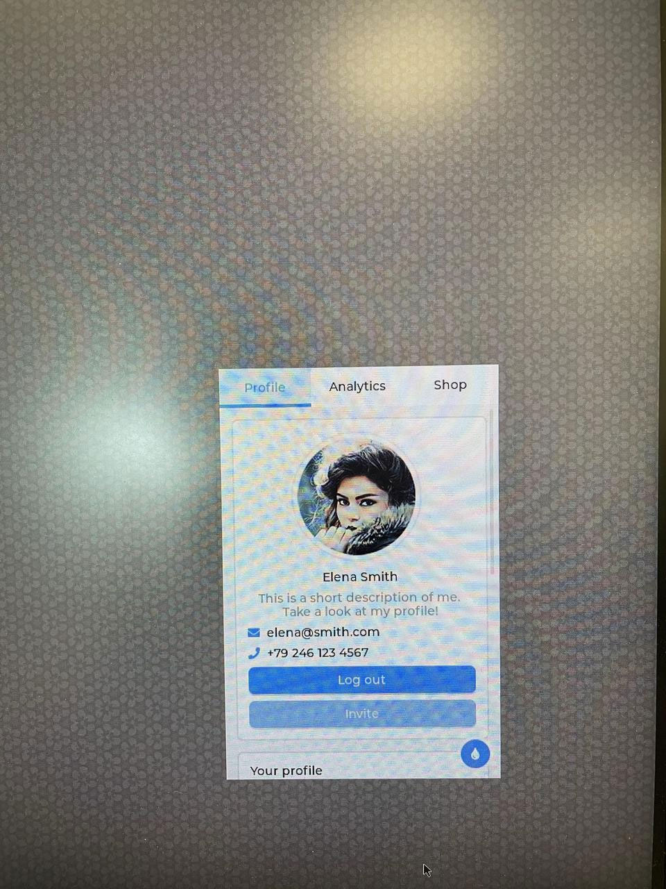

# 5. LVGL User Guide

Light and Versatile Graphics Library (LVGL) is an open-source lightweight graphics library. The following example illustrates how to port LVGL9.2 to the Weston desktop. After porting, the library can be downloaded at https://github.com/rubikpi-ai/lvgl.

For more information about LVGL, visit https://lvgl.io/.

1. Clone the required code base:

   ```shell showLineNumbers
   git clone -b release/v9.2 https://github.com/lvgl/lvgl.git  
   git clone https://github.com/lvgl/lv_port_pc_vscode.git
   ```

2. Copy lvgl to the root directory of *lv\_port\_pc\_vscode*, replace the *lv\_conf.h* configuration file, and go to *main/src* to create a soft link.

   ```shell showLineNumbers
   cd lv_port_pc_vscode  
   cp ../lvgl . -r  
   cp lvgl/lv_conf_template.h lv_conf.h  
   cd main/src  
   ln -sf ../../lvgl
   ```

3) Modify *lv\_conf.h*.

   * Enable *lv\_conf.h*.

     ```c showLineNumbers
     /* clang-format off */  
     #if 1 /*Set it to "1" to enable content*/
     ```

   * Modify the color depth:

     ```c showLineNumbers
     #define LV_COLOR_DEPTH 32
     ```

   * Define LV\_MEM\_SIZE:

     ```c showLineNumbers
     #define LV_MEM_SIZE (20U * 1024U * 1024U)
     ```

   * Define LV\_USE\_WAYLAND:

     ```c showLineNumbers
     #define LV_USE_WAYLAND          1
     ```

   * Define LV\_WAYLAND\_WL\_SHELL:

     ```c showLineNumbers
     #define LV_WAYLAND_WL_SHELL             1
     ```

   * Define LV\_USE\_LINUX\_DRM:

     ```c showLineNumbers
     #define LV_USE_LINUX_DRM        1
     ```

   * Enable the demo:

     ```c showLineNumbers
     #define LV_USE_DEMO_WIDGETS 1
     ```

4) Modify *CMakeLists.txt*.

   * Comment out SDL2 library:

     ```cmake showLineNumbers
     # Find and include SDL2 library  
     # find_package(SDL2 REQUIRED)
     ```

   * Add the path of the header file and modify the path according to the actual situation. As shown in the following code, */home/zhy/QCOM/sdk* is the installation path of the cross-compilation tool. For details, refer to [1.12.2. Compile code](/rubik-pi-3/en/docs/rubik-pi-3-user-manual/1.1.0/quick-start#1122-compile-code).

     ```cmake showLineNumbers
     target_include_directories(lvgl PUBLIC /home/zhy/QCOM/sdk/sysroots/armv8-2a-qcom-linux/usr/include/drm)
     ```

   * Comment out the following content:

     ```cmake showLineNumbers
     # Remove ARM-specific compile and linker options  
     # set(CMAKE_C_FLAGS "${CMAKE_C_FLAGS} -march=native")  
     # set(CMAKE_CXX_FLAGS "${CMAKE_CXX_FLAGS} -march=native")
     ```

   * Set the link library. Replace the original target\_link\_libraries:

     ```cmake showLineNumbers
     # Define LVGL configuration as a simple include  
     target_compile_definitions(main PRIVATE LV_CONF_INCLUDE_SIMPLE)  
     target_link_libraries(main lvgl lvgl::examples lvgl::demos lvgl::thorvg m pthread rt drmfs drm_etnaviv drm_nouveau drm_omap drmtime drm drmutils sdedrm xkbcommon wayland-client wayland-cursor wayland-egl EGL GLESv2)
     ```

5. Configure the cross-compilation environment.

   * For details, refer to [1.11.2. Install cross-compilation tools](/rubik-pi-3/en/docs/rubik-pi-3-user-manual/1.1.0/quick-start#1112-install-cross-compilation-tools).

     ```shell showLineNumbers
     source <your toolchains directory>/environment-setup-armv8-2a-qcom-linux
     ```

   * Modify the hal\_init function in *lv\_port\_pc\_vscode/main/src/main.c*.

     ```c
     /**
      * Initialize the Hardware Abstraction Layer (HAL) for the LVGL graphics
      * library
      */
     static lv_display_t * hal_init(int32_t w, int32_t h)
     {
             lv_disp_t * disp;
             lv_group_set_default(lv_group_create());

             lv_group_set_default(lv_group_create());
             disp = lv_wayland_window_create(w, h, "Window Title", NULL);
         // lv_wayland_window_set_fullscreen(disp, false);

             lv_indev_t *kb = lv_wayland_get_keyboard(disp);
             lv_indev_set_display(kb, disp);
             lv_indev_set_group(kb, lv_group_get_default());

             lv_display_set_default(disp);

             return disp;
     }
     ```

6. In the main function of *lv\_port\_pc\_vscode/nvim main/src/main.c*, change *lv\_timer\_handler* called in the while loop to *lv\_wayland\_timer\_handler*.

   ```c
   while(1) {
     /* Periodically call the lv_task handler.
      * It could be done in a timer interrupt or an OS task too.*/
     lv_wayland_timer_handler();
     usleep(5 * 1000);
   }
   ```

7) Start compilation.

   ```shell showLineNumbers
   cd lv_port_pc_vscode  
   mkdir build  
   cd build  
   cmake ..  
   make
   ```

8) Transfer the compilation artifact to RUBIK Pi 3. The following is an ADB transfer example:

   ```shell showLineNumbers
   cd lv_port_pc_vscode/bin  
   adb push main /opt
   ```

9. Connect the HDMI cable, mouse, and keyboard. Run the following commands in the Weston terminal to execute the LVGL program. Use the mouse and keyboard to perform operations in the user interface.

   ```shell showLineNumbers
   cd /opt  
   ./main
   ```

   The porting result:

   