---
# Display h2 to h5 headings
toc_min_heading_level: 2
toc_max_heading_level: 4
---

# Peripherals and Interfaces

## Hardware resource diagram


| **No.**      | **Interface**                | **No.** | **Interface**              |
| -------------| ---------------------------- | ------- | -------------------------- |
| **1**        | RTC battery connector        | **10**  | Power Delivery over Type-C |
| **2**        | Micro USB (UART debug)       | **11**  | PWR button                 |
| **3**        | TurboX C6490P SOM            | **12**  | EDL button                 |
| **4**        | 3.5mm headphone jack         | **13**  | Camera connector 2         |
| **5**        | USB Type-C with DP (USB 3.1) | **14**  | Camera connector 1         |
| **6**        | USB Type-A (USB 2.0)         | **15**  | Wi-Fi/BT module            |
| **7**        | 2 x USB Type-A (USB 3.0)     | **16**  | Fan connector              |
| **8**        | 1000M Ethernet               | **17**  | 40-pin LS connector        |
| **9**        | HDMI OUT                     | **18**  | M.2 Key M connector        |


## 40-pin LS connector

### GPIO

RUBIK Pi 3 is compatible with WiringRP (based on the high-performance GPIO programming library WiringPi). It is recommended to use WiringRP for controlling and programming GPIOs. For more details about WiringRP, visit https://github.com/rubikpi-ai/WiringRP.

#### Pinout

The figure below shows the default functions of the RUBIK Pi 3 40-pin LS connector, most of which are compatible with the default functions of the Raspberry Pi 40-pin connector.


The following table lists all functions of the 40-pin LS connector. Blue bold functions are default functions.


#### Control GPIOs using shell commands

Run the following commands on RUBIK Pi 3 to control GPIOs.

* Using WiringRP commands:

  * View the GPIO status

    ```shell
    gpio readall
    ```

  

  * Set the GPIO mode

    ```shell
    gpio mode 15 in             # Set pin 15 to input mode
    gpio pins                   # Check the mode
    gpio mode 15 out            # Set pin 15 to output mode
    gpio pins                   # Check the mode
    ```

  * Set the pin level

    ```shell
    gpio write 15 1             # Set pin 15 to high level
    gpio read 15                # Check the pin level
    gpio write 15 0             # Set pin 15 to low level
    gpio read 15                # Check the pin level
    ```

* Operate nodes under */sys/class/gpio*

  The table below shows the GPIO subsystem numbering.
  

  * Go to the */sys/class/gpio* directory:

    ```shell
    cd /sys/class/gpio
    ```

  * Export the GPIO to be controlled. For example, pin 13 GPIO_24:

    ```shell
    echo 559 > export
    ```

  * Go to the *gpio559* directory to set GPIO attributes:

    ```shell
    cd gpio559  
    ls
    ```

   

  The attributes are described as follows:

    - direction:
      - Input: in
      - Output: out
    - value:
      - Low level: 0
      - High level: 1
    - edge (interrupt edge):
      - Rising edge trigger: rising
      - Falling edge trigger: falling
      - Both-edge trigger: both
      - Disabling interrupts: none

  For example, set pin 13 to output a high level:
     ```
    echo out > direction  
    echo 1 > value
   ```
  Cancel the export of pin 13 to user space:
   ```
   echo 559 > unexport
   ```


#### Control GPIOs using WiringRP (C)

The WiringRP library provides a set of API functions that enable control with minimal logic.

* The following code snippet sets pin 13 as output, pin 15 as input, and loops to check the level status of pin 15.

  ```c
  #include <stdio.h>
  #include <wiringPi.h>

  int main (void)
  {
    wiringPiSetup () ;
    pinMode (13, OUTPUT) ;
    pinMode (15, INPUT) ;

    for (;;)
    {
      digitalWrite (13, HIGH) ;        // On
      printf("%d\n", digitalRead (15));        // On
      delay (1000) ;                // mS
      digitalWrite (13, LOW) ;        // Off
      printf("%d\n", digitalRead (15));        // On
      delay (1900) ;
    }

    return 0 ;
  }
  ```

* Compile on RUBIK Pi 3

  ```shell
  adb push gpio.c /opt
  adb shell
  cd /opt
  gcc gpio.c -o gpio -lwiringPi
  ```

* Short pin 13 and pin 15 with a Dupont wire, as shown in the following figure, to test the GPIO level control and read the level.

  :::caution
  
  Pay attention to the pin order. Do not short the power and ground pins, as this may cause damage to the board.
  :::

  

  Run the following commands:

  ```shell
  cd /opt
  ./gpio
  ```

  The program execution result is as follows:

    

#### Control GPIOs using WiringRP-Python

The WiringRP library provides a set of API functions that enable control with minimal logic.

* The following code snippet is an example of controlling GPIOs using the WiringRP library: set pin 13 as output, pin 15 as input, and loops to check the level status of pin 15.

  ```python
  import wiringpi
  import time

  wiringpi.wiringPiSetup()
  wiringpi.pinMode(13, 1)
  wiringpi.pinMode(15, 0)
  wiringpi.digitalRead(15)

  while True:
      wiringpi.digitalWrite(13,1)
      pin_level = wiringpi.digitalRead(15)
      print(f"in_gpio level: {pin_level}")

      time.sleep(1)

      wiringpi.digitalWrite(13,0)
      pin_level = wiringpi.digitalRead(15)
      print(f"in_gpio level: {pin_level}")

      time.sleep(1)
  ```

* Transfer *gpio.py* to RUBIK Pi 3. For example, use the ADB method.

  ```shell
  adb push gpio.py /opt
  ```

* Short pin 13 and pin 15 with a Dupont wire, as shown in the following figure, to test the GPIO level control and read the level.

  :::caution
  
  Pay attention to the pin order. Do not short the power and ground pins, as this may cause damage to the board.
  :::

  

  Run the following commands:

  ```shell
  cd /opt
  python3 gpio.py 
  ```

  The program execution result is as follows:

   

#### Control GPIOs using Python programs

* GPIOs can be controlled by using python-periphery. Run the following command to install python-periphery on RUBIK Pi 3:

  ```shell
  pip3 install python-periphery
  ```

* The following code snippet uses python-periphery to operate GPIOs: set pin 13 as output, pin 15 as input, and loop to check the level status of pin 15.

  ```python
  from periphery import GPIO
  import time

  out_gpio = GPIO(559, "out")
  in_gpio = GPIO(560, "in")

  try:
      while True:
          try:
              out_gpio.write(True)
              pin_level = in_gpio.read()
              print(f"in_gpio level: {pin_level}")

              out_gpio.write(False)
              pin_level = in_gpio.read()
              print(f"in_gpio level: {pin_level}")

              time.sleep(1)

          except KeyboardInterrupt:
              out_gpio.write(False)
              break

  except IOError:
      print("Error")

  finally:
      out_gpio.close()
      in_gpio.close()
  ```

* Transfer *gpio.py* to RUBIK Pi 3. For example, use the ADB method.

  ```shell
  adb push gpio.py /opt
  ```

* Short pin 13 and pin 15 with a Dupont wire, as shown in the following figure, to test the GPIO level control and read the level.

  :::caution
  
  Pay attention to the pin order. Do not short the power and ground pins, as this may cause damage to the board.
  :::

  

  Run the following commands:

  ```shell
  cd /opt
  python3 gpio.py
  ```

  The program execution result is as follows:

    

#### Control GPIOs using C programs

* The following code snippet sets pin 13 as output, pin 15 as input, and loops to check the level status of pin 15.

  ```c
  #include <stdio.h>
  #include <stdlib.h>
  #include <unistd.h>

  int out_gpio = 559;
  int in_gpio = 560;

  int main() {
      char export_path[50] = {};
      char export_command[100] = {};
      snprintf(export_path, sizeof(export_path), "/sys/class/gpio/export");
      snprintf(export_command, sizeof(export_command), "echo %d > %s ", out_gpio, export_path);
      system(export_command);
      snprintf(export_command, sizeof(export_command), "echo %d > %s ", in_gpio, export_path);
      system(export_command);

      char direction_path[50] = {};
      snprintf(direction_path, sizeof(direction_path), "/sys/class/gpio/gpio%d/direction", out_gpio);
      FILE *direction_file = fopen(direction_path, "w");
      if (direction_file == NULL) {
          perror("Failed to open GPIO direction file");
          return -1;
      }
      fprintf(direction_file, "out");
      fclose(direction_file);

      snprintf(direction_path, sizeof(direction_path), "/sys/class/gpio/gpio%d/direction", in_gpio);
      direction_file = fopen(direction_path, "w");
      if (direction_file == NULL) {
          perror("Failed to open GPIO direction file");
          return -1;
      }
      fprintf(direction_file, "in");
      fclose(direction_file);

      char value_in_path[50] = {};
      char value_out_path[50] = {};
      char cat_command[100] = {};
      snprintf(value_out_path, sizeof(value_out_path), "/sys/class/gpio/gpio%d/value", out_gpio);
      snprintf(value_in_path, sizeof(value_in_path), "/sys/class/gpio/gpio%d/value", in_gpio);
      snprintf(cat_command, sizeof(cat_command), "cat %s", value_in_path);

      FILE *value_out_file = fopen(value_out_path, "w");
      if (value_out_file == NULL) {
          perror("Failed to open GPIO value file");
          return -1;
      }

      for (int i = 0; i < 5; i++) {
          fprintf(value_out_file, "1");
          fflush(value_out_file);

          system(cat_command);
          sleep(1);

          fprintf(value_out_file, "0");
          fflush(value_out_file);

          system(cat_command);
          sleep(1);
      }

      fclose(value_out_file);

      char unexport_path[50] = {};
      char unexport_command[100] = {};
      snprintf(unexport_path, sizeof(unexport_path), "/sys/class/gpio/unexport");
      snprintf(unexport_command, sizeof(unexport_command), "echo %d > %s ", out_gpio, unexport_path);
      system(unexport_command);
      snprintf(unexport_command, sizeof(unexport_command), "echo %d > %s ", in_gpio, unexport_path);
      system(unexport_command);

      return 0;
  }
  ```

* Compile programs

  * Cross-compile the program. For details, refer to [Use the cross-compilation tools](./1.get-started.md#usecrosstool).

    ```shell
    aarch64-qcom-linux-gcc gpio.c -o gpio --sysroot=/home/zhy/qcom_sdk_meta/sysroots/armv8-2a-qcom-linux/
    ```

    If you use cross-compilation, transfer *gpio* to RUBIK Pi 3. For example, use the ADB method.

    ```shell
    adb push gpio /opt
    ```

  * Compile on RUBIK Pi 3

    ```shell
    adb push gpio.c /opt
    adb shell
    cd /opt
    gcc gpio.c -o gpio
    ```

* Short pin 13 and pin 15 with a Dupont wire, as shown in the following figure, to test the GPIO level control and read the level.

  :::caution
  
  Pay attention to the pin order. Do not short the power and ground pins, as this may cause damage to the board.
  :::

  

  Run the following commands:

  ```shell
  cd /opt
  ./gpio
  ```

  The program execution result is as follows:

    

### I2C

Inter-Integrated circuit (I2C) is a bidirectional 2-wire bus for an efficient inter‑IC control bus developed by Philips in the 1980s. Every device on the bus has its own unique address (registered with the I2C general body headed by Philips). The I2C core supports a multicontroller mode and 10‑bit target address and 10‑bit extendable address. For more information on I2C, see https://www.i2c-bus.org/fileadmin/ftp/i2c_bus_specification_1995.pdf.

RUBIK Pi 3 is compatible with WiringRP (based on the high-performance GPIO programming library WiringPi). It is recommended to use WiringRP for controlling and programming I2C. For more details about WiringRP, visit [https://github.com/rubikpi-ai/WiringRP.](https://github.com/rubikpi-ai/WiringRP)

#### Pinout

The figure below shows the default functions of the RUBIK Pi 3 40-pin LS connector, most of which are compatible with the default functions of the Raspberry Pi 40-pin connector.


:::note

Pin 3 and pin 5 are set to I2C1 by default.
:::

The following table lists all functions of the 40-pin LS connector. Blue bold functions are default functions.


#### I2C communication using shell commands

Run the following commands on RUBIK Pi 3 to control the I2C bus.

* Use the WiringRP related command:

  ```shell
  ./gpio -x ads1115:100:10 aread 100     #Read the analog signal value of the ADS1115 device via the I2C bus.
  ```

* Use the i2cdetect tool

  * View devices connected to the I2C1 interface:

    ```shell
    i2cdetect -a -y -r 1
    ```

  * Read all registers of the device whose address is 0x38:

    ```shell
    i2cdump -f -y 1 0x38
    ```

  * Write 0xaa to register 0x01 of the device whose address is 0x38:

    ```shell
    i2cset -f -y 1 0x38 0x01 0xaa
    ```

  * Read the value at register 0x01 of the device whose address is 0x38:

    ```shell
    i2cget -f -y 1 0x38 0x01
    ```

#### I2C communication using WiringRP (C)

The WiringRP library provides a set of API functions that enable control with minimal logic.

* The following code snippet uses the I2C1 bus to communicate with a device whose address is 0x38: write 0xaa to the 0x01 address of the device.

  ```c
  #include <wiringPi.h>
  #include <wiringPiI2C.h>
  #include <stdio.h>
  #include <stdlib.h>
  #include <unistd.h>

  #define I2C_ADDRESS 0x38

  int main(void)
  {
      int fd;

      if (wiringPiSetup() == -1) {
          exit(1);
      }

      fd = wiringPiI2CSetup(1, I2C_ADDRESS);
      if (fd == -1) {
          exit(1);
      }

      unsigned char data[2];
      if (read(fd, data, 2) != 2) {
          exit(1);
      }

      wiringPiI2CWriteReg8(fd, 0x01, 0xaa) ;

      close(fd);
      return 0;
  }
  ```

* Compile on RUBIK Pi 3

  ```shell
  adb push gpio.c /opt
  adb shell
  cd /opt
  gcc i2c.c -o i2c -lwiringPi
  ```

* Connect pin 3 and pin 5 to the I2C sensor and test the I2C communication as shown in the following figure.

  :::caution
  
  Pay attention to the pin order. Do not short the power and ground pins, as this may cause damage to the board.
  :::
  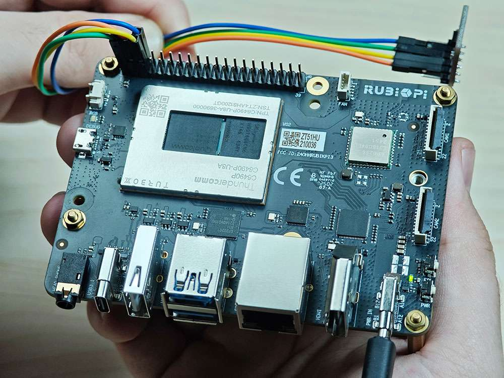

  Run the following commands:

  ```shell
  cd /opt
  ./i2c
  ```

#### I2C communication using WiringRP-Python

The WiringRP library provides a set of API functions that enable control with minimal logic.

* The following code snippet uses the I2C1 bus to communicate with a device whose address is 0x38: write 0xaa to the 0x01 address of the device.

  ```bash
  import wiringpi as wpi

  wpi.wiringPiSetup()
  fd=wpi.wiringPiI2CSetup(0x38, 1)
  wpi.wiringPiI2CWriteReg8 (fd, 0x01, 0xaa)

  ```

* Transfe&#x72;*&#x20;i2c.py* to RUBIK Pi 3. For example, use the ADB method.

  ```shell
  adb push i2c.py /opt
  ```

* Connect pin 3 and pin 5 to the I2C sensor and test the I2C communication as shown in the following figure.

  :::caution
  
  Pay attention to the pin order. Do not short the power and ground pins, as this may cause damage to the board.
  :::
  

  Run the following commands:

  ```shell
  cd /opt
  python3 i2c.py 
  ```

#### I2C communication using Python programs

* I2C can be controlled by using the Python smbus library. Run the following command on RUBIK Pi 3 to install the library.

  ```shell
  pip3 install smbus
  ```

* The following code snippet uses the I2C1 bus to communicate with a device whose address is 0x38: write 0xaa to the 0x01 address of the device.

  ```python
  import smbus

  def main():
      data = [0x01, 0xaa]

      try:
          i2c_bus = smbus.SMBus(1)  

          print("i2cdetect addr : ", end="")
          for address in range(0x7F):
              try:
                  i2c_bus.write_i2c_block_data(address, 0, data)
                  print("0x{:02X},".format(address), end="")
              except OSError:
                  pass  

          print()

      except Exception as e:
          print(f"An error occurred: {e}")

      finally:
          if i2c_bus:
              i2c_bus.close()

  if __name__ == "__main__":
      main()
  ```

* Transfer *i2c.py* to RUBIK Pi. For example, use the ADB method.

  ```shell
  adb push i2c.py /opt
  ```

* Connect pin 3 and pin 5 to the I2C sensor and test the I2C bus communication as shown in the following figure.

  :::caution
  
  Pay attention to the pin order. Do not short the power and ground pins, as this may cause damage to the board.
  :::
  

  Run the following commands:

  ```shell
  cd /opt
  python3 i2c.py
  ```

  The execution result is as follows:

   

#### I2C communication using C programs

* The following code snippet uses the I2C1 bus to communicate with a device whose address is 0x38: write 0xaa to the 0x01 address of the device.

  ```c
  #include <stdio.h>
  #include <stdlib.h>
  #include <stdint.h>
  #include <fcntl.h>
  #include <unistd.h>
  #include <linux/i2c-dev.h>
  #include <sys/ioctl.h>

  #define I2C_DEVICE_PATH "/dev/i2c-1"

  int main() {
      uint8_t data[2] = {0x01,0xaa};
    
      const char *i2c_device = I2C_DEVICE_PATH;  
      int i2c_file;

      if ((i2c_file = open(i2c_device, O_RDWR)) < 0) {
          perror("Failed to open I2C device");
          return -1;
      }
    
      ioctl(i2c_file, I2C_TENBIT, 0);
      ioctl(i2c_file, I2C_RETRIES, 5);

      printf("i2cdetect addr : ");
      for (int x = 0; x < 0x7f; x++)
      {
          if (ioctl(i2c_file, I2C_SLAVE, x) < 0) {
              perror("Failed to set I2C slave address");
              close(i2c_file);
              return -1;
          }
      
          if (write(i2c_file, data, 2) == 2)
          {
              printf("0x%x,", x);
          }
      }
    
      close(i2c_file);
      printf("\r\n");

      return 0;
  }
  ```

* Compile programs:

  * Cross-compile the program. For details, refer to [Use the cross-compilation tools](./1.get-started.md#usecrosstool).

    ```shell
    aarch64-qcom-linux-gcc i2c.c -o i2c --sysroot=/home/zhy/qcom_sdk_meta/sysroots/armv8-2a-qcom-linux/
    ```

    If you use cross-compilation, transfer *i2c* to RUBIK Pi 3. For example, use the ADB method.

    ```shell
    adb push i2c /opt
    ```

  * Compile on RUBIK Pi 3

    ```shell
    adb push i2c.c /opt
    adb shell
    cd /opt
    gcc i2c.c -o i2c
    ```

* Connect pin 3 and pin 5 to the I2C sensor to test the I2C bus communication, as shown in the following figure.

  :::caution
  
  Pay attention to the pin order. Do not short the power and ground pins, as this may cause damage to the board.
  :::
  

  Run the following commands:

  ```shell
  cd /opt
  ./i2c
  ```

  The program execution result is as follows:

   

### SPI

Serial Peripheral Interface (SPI) is a synchronous serial data link that operates in full-duplex mode. SPI is also known as a 4-wire serial bus.

RUBIK Pi 3 is compatible with WiringRP (based on the high-performance GPIO programming library WiringPi). It is recommended to use WiringRP for controlling and programming SPI. For more details about WiringRP, visit [https://github.com/rubikpi-ai/WiringRP.](https://github.com/rubikpi-ai/WiringRP)

#### Pinout

The figure below shows the default functions of the RUBIK Pi 3 40-pin LS connector, most of which are compatible with the default functions of the Raspberry Pi 40-pin connector.


:::note

Pins 19, 21, 23, and 24 are set to SPI by default.
:::
The following table lists all functions of the 40-pin LS connector. Blue bold functions are default functions.


#### SPI communication using WiringRP (C)

The WiringRP library provides a set of API functions that enable control with minimal logic.

* The following code snippet uses the SPI bus to send and receive data.

  ```c
  #include <wiringPi.h>
  #include <wiringPiSPI.h>
  #include <stdio.h>
  #include <stdlib.h>

  int main(void)
  {
      int fd;
      unsigned char send_data[64] =  "hello world!";
      unsigned char read_data[64];

      if(wiringPiSetup() == -1)
          exit(1);

      fd = wiringPiSPISetup(0, 1000000);
      if(fd < 0)
          exit(2);

          printf("\rtx_buffer: \n %s\n ", send_data);
      // Send and receive data
      if(wiringPiSPIDataRW(0, send_data, sizeof(send_data)) < 0)
          exit(3);
          printf("\rtx_buffer: \n %s\n ", send_data);


      return 0;
  }
  ```

* Compile on RUBIK Pi 3

  ```shell
  adb push spi.c /opt
  adb shell
  cd /opt
  gcc spi.c -o spi -lwiringPi
  ```

* Short pin 19 and pin 21 with a Dupont wire to test the SPI bus communication, as shown in the following figure:

  :::caution
  
  Pay attention to the pin order. Do not short the power and ground pins, as this may cause damage to the board.
   :::
  

  Run the following commands:

  ```shell
  cd /opt
  ./spi
  ```

  The execution result is as follows:

   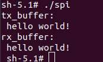

#### SPI communication using WiringRP-Python

The WiringRP library provides a set of API functions that enable control with minimal logic.

* The following code snippet uses the SPI bus to send and receive data:

  ```bash
  import wiringpi as wpi                                                          
                                                
  wpi.wiringPiSetup()                                                             
                                                                          
  wpi.wiringPiSPISetup(0, 8000000)                                                
                                                                 
  tx_buffer = bytes([72, 101, 108, 108, 111])                                     
  print("tx_buffer:\n\r ", tx_buffer)                                             
  retlen, rx_buffer = wpi.wiringPiSPIDataRW(0, tx_buffer)                         
  print("rx_buffer:\n\r ", rx_buffer)                                             
                                        
  ```

* Transfer *spi.py&#x20;*&#x74;o RUBIK Pi 3. For example, use the ADB method.

  ```shell
  adb push spi.py /opt
  ```

* Short pin 19 and pin 21 with a Dupont wire to test the SPI bus communication, as shown in the following figure:

  :::caution
  
  Pay attention to the pin order. Do not short the power and ground pins, as this may cause damage to the board.
  :::
  

  Run the following command:&#x20;

  ```shell
   python3 spi.py 
  ```

  The execution result is as follows:

    

#### SPI communication using Python programs

* SPI communication can be implemented by using the spidev library for Python. Run the following command to install spidev on RUBIK Pi 3.

  ```shell
  pip3 install spidev
  ```

* The following code snippet uses the SPI bus to send and receive data.

  ```python
  import spidev

  def main():
      tx_buffer = [ord(char) for char in "hello world!"]
      rx_buffer = [0] * len(tx_buffer)

      try:
          spi = spidev.SpiDev()
          spi.open(12, 0)
          spi.max_speed_hz = 1000000  

          rx_buffer = spi.xfer2(tx_buffer[:])
          print("tx_buffer:\n\r", ''.join(map(chr, tx_buffer)))
          print("rx_buffer:\n\r", ''.join(map(chr, rx_buffer)))

      except Exception as e:
          print(f"An error occurred: {e}")

      finally:
          if spi:
              spi.close()

  if __name__ == "__main__":
      main()
  ```

* Transfer *spi.py* to RUBIK Pi 3. For example, use the ADB method.

  ```shell
  adb push spi.py /opt
  ```

* Short pin 19 and pin 21 with a Dupont wire to test the SPI bus communication, as shown in the following figure.

  :::caution
  
  Pay attention to the pin order. Do not short the power and ground pins, as this may cause damage to the board.
  :::
  
  

  Run the following command:

  ```shell
  python3 spi.py
  ```

  The program execution result is as follows:

    

#### SPI communication using C programs

* The following code snippet uses the SPI bus to send and receive data.

  ```c
  #include <stdio.h>
  #include <stdlib.h>
  #include <stdint.h>
  #include <fcntl.h>
  #include <unistd.h>
  #include <linux/spi/spidev.h>
  #include <sys/ioctl.h>

  #define SPI_DEVICE_PATH "/dev/spidev12.0"

  int main() {
      int spi_file;
      uint8_t tx_buffer[50] = "hello world!";
      uint8_t rx_buffer[50];

      // Open the SPI device
      if ((spi_file = open(SPI_DEVICE_PATH, O_RDWR)) < 0) {
          perror("Failed to open SPI device");
          return -1;
      }

      // Configure SPI mode and bits per word
      uint8_t mode = SPI_MODE_0;
      uint8_t bits = 8;
      if (ioctl(spi_file, SPI_IOC_WR_MODE, &mode) < 0) {
          perror("Failed to set SPI mode");
          close(spi_file);
          return -1;
      }
      if (ioctl(spi_file, SPI_IOC_WR_BITS_PER_WORD, &bits) < 0) {
          perror("Failed to set SPI bits per word");
          close(spi_file);
          return -1;
      }

      // Perform SPI transfer
      struct spi_ioc_transfer transfer = {
          .tx_buf = (unsigned long)tx_buffer,
          .rx_buf = (unsigned long)rx_buffer,
          .len = sizeof(tx_buffer),
          .delay_usecs = 0,
          .speed_hz = 1000000,  // SPI speed in Hz
          .bits_per_word = 8,
      };

      if (ioctl(spi_file, SPI_IOC_MESSAGE(1), &transfer) < 0) {
          perror("Failed to perform SPI transfer");
          close(spi_file);
          return -1;
      }

       /* Print tx_buffer and rx_buffer*/
      printf("\rtx_buffer: \n %s\n ", tx_buffer);
      printf("\rrx_buffer: \n %s\n ", rx_buffer);

      // Close the SPI device
      close(spi_file);

      return 0;
  }
  ```

* Compile programs:

  * Cross-compile the program. For details, refer to [Use the cross-compilation tools](./1.get-started.md#usecrosstool).

    ```shell
    aarch64-qcom-linux-gcc spi.c -o spi --sysroot=/home/zhy/qcom_sdk_meta/sysroots/armv8-2a-qcom-linux/
    ```

    If you use cross-compilation, transfer *spi* to RUBIK Pi 3. For example, use the ADB method:

    ```shell
    adb push spi /opt
    ```

  * Compile on RUBIK Pi 3

    ```c
    adb push spi.c /opt
    adb shell
    cd /opt
    gcc spi.c -o spi
    ```

* Short pin 19 and pin 21 with a Dupont wire to test the SPI bus communication, as shown in the following figure.

  :::caution
  
  Pay attention to the pin order. Do not short the power and ground pins, as this may cause damage to the board.
  :::
  

  Run the following commands:

  ```shell
  cd /opt
  ./spi
  ```

  The program execution result is as follows:

    

<a id="224UART"></a>
### UART

RUBIK Pi 3 is compatible with WiringRP (based on the high-performance GPIO programming library WiringPi). It is recommended to use WiringRP for controlling and programming UART. For more details about WiringRP, visit [https://github.com/rubikpi-ai/WiringRP.](https://github.com/rubikpi-ai/WiringRP)

#### Pinout

The figure below shows the default functions of the RUBIK Pi 3 40-pin LS connector, most of which are compatible with the default functions of the Raspberry Pi 40-pin connector.


:::note

Pins 8 and 10 have been set to UART by default. The device node is */dev/ttyHS2*.
:::
The following table lists all functions of the 40-pin LS connector. Blue bold functions are default functions.


#### UART communication using shell commands

Run the following commands on RUBIK Pi 3 to control UART communication.

* Use the stty tool to configure UART. Run the following commands to set both the input rate and output rate of UART to 115200 and disable the echo.

  ```shell
  stty -F /dev/ttyHS2 ispeed 115200 ospeed 115200  
  stty -F /dev/ttyHS2 -echo
  ```

* Enable the two terminals on RUBIK Pi 3, short pin 8 and pin 10 with a Dupont wire, and run the following commands. The content sent by the transmitter will be displayed on the receiver.

  :::caution
  
  Pay attention to the pin order. Do not short the power and ground pins, as this may cause damage to the board.
  :::
  ```shell
  echo "hello world!" > /dev/ttyHS2 #Transmitter  
  cat /dev/ttyHS2 #Receiver
  ```

  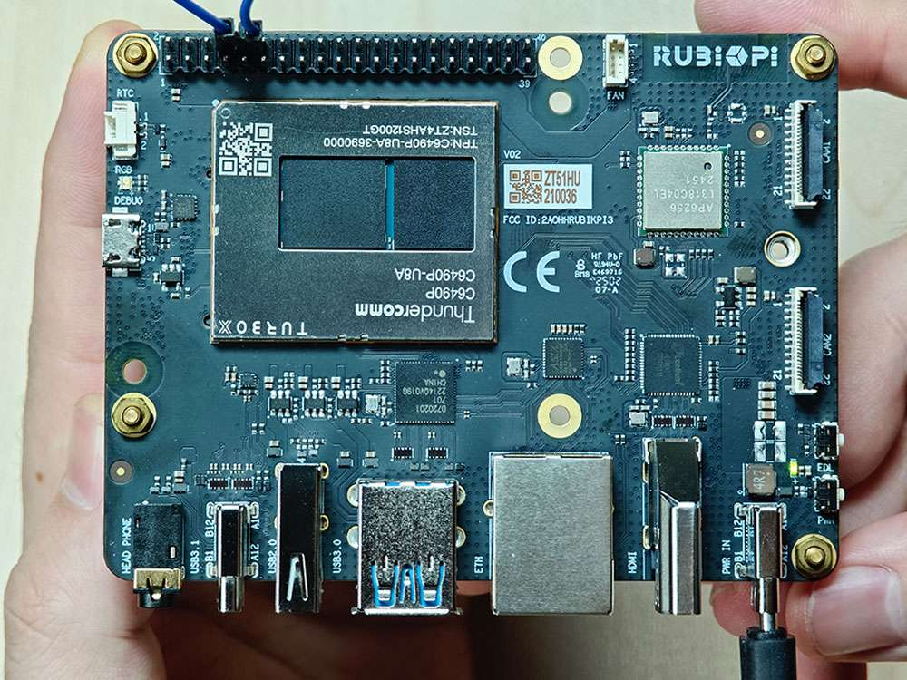

#### UART communication using WiringRP (C)

The WiringRP library provides a set of API functions that enable control with minimal logic.

* The following code snippet uses UART to send and receive data:

  ```c
  #include <stdio.h>
  #include <string.h>
  #include <errno.h>

  #include <wiringPi.h>
  #include <wiringSerial.h>

  int main ()
  {
    int fd ;
    int count ;
    unsigned int nextTime ;

    if ((fd = serialOpen ("/dev/ttyHS2", 115200)) < 0)
    {
      fprintf (stderr, "Unable to open serial device: %s\n", strerror (errno)) ;
      return 1 ;
    }

    if (wiringPiSetup () == -1)
    {
      fprintf (stdout, "Unable to start wiringPi: %s\n", strerror (errno)) ;
      return 1 ;
    }


    char tx_buffer[] = "hello world!\n";
    for (count = 0 ; count < sizeof(tx_buffer) ; count++)
    {
      serialPutchar (fd, tx_buffer[count]) ;
      delay (3) ;
      printf ("%c", serialGetchar (fd)) ;
    }
    printf ("\n") ;

    return 0 ;
  }


  ```

* Compile programs:

  * Compile on RUBIK Pi 3

    ```shell
    adb push uart.c /opt
    adb shell
    cd /opt
    gcc uart.c -o uart
    ```

* Short pin 8 and pin 10 with a Dupont wire and test the communication, as shown in the following figure:

  :::caution
  
  Pay attention to the pin order. Do not short the power and ground pins, as this may cause damage to the board.
   :::
  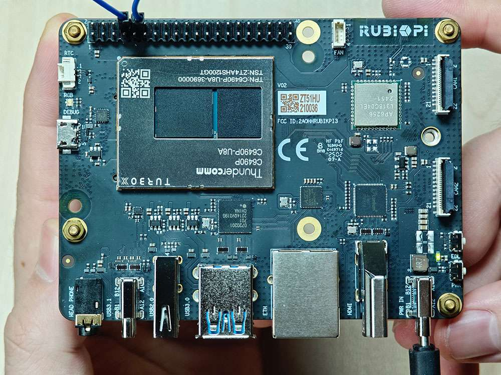

  Run the following commands:

  ```shell
  cd /opt
  ./uart
  ```

  The execution result is as follows:

    

#### UART communication using WiringRP-Python

The WiringRP library provides a set of API functions that enable control with minimal logic.

* The following code snippet uses UART to send and receive data.

  ```bash
  import wiringpi

  serial = wiringpi.serialOpen('/dev/ttyHS2', 115200)

  wiringpi.serialPuts(serial, "hello world")

  received_data = []
  c = wiringpi.serialGetchar(serial);
  received_data.append(chr(c))

  cnt = wiringpi.serialDataAvail(serial);
  for i in range(cnt):
      c = wiringpi.serialGetchar(serial);
      received_data.append(chr(c))

  print("Received:", received_data)

  wiringpi.serialClose(serial)

  ```

* Transfer *uart.py&#x20;*&#x74;o RUBIK Pi 3. For example, use the ADB method. The command is as follows:

  ```shell
  adb push uart.py /opt
  ```

* Short pin 8 and pin 10 with a Dupont wire to test UART communication, as shown in the following figure:

  :::caution
  
   Pay attention to the pin order. Do not short the power and ground pins, as this may cause damage to the board.
   :::
  

  Run the following commands:

  ```shell
  cd /opt
  python3 uart.py 
  ```

  The execution result is as follows:

  

#### UART communication using Python programs

* UART communication can be implemented by using the serial library for Python. Run the following command to install the serial library on RUBIK Pi 3.

  ```shell
  pip3 install pyserial
  ```

* Use UART to send and receive data.

  ```python
  import serial
  import time

  with serial.Serial(
      "/dev/ttyHS2",
      baudrate=115200,
      bytesize=serial.EIGHTBITS,
      stopbits=serial.STOPBITS_ONE,
      parity=serial.PARITY_NONE,
      timeout=1,

  ) as uart3:
      uart3.write(b"Hello World!\n")
      buf = uart3.read(128)
      print("Raw data:\n", buf)
      data_strings = buf.decode("utf-8")
      print("Read {:d} bytes, printed as string:\n {:s}".format(len(buf), data_strings))
  ```

* Transfer *uart.py* to RUBIK Pi 3. For example, use the ADB method. The command is as follows:

  ```shell
  adb push uart.py /opt
  ```

* Short pin 8 and pin 10 with a Dupont wire to test the UART communication, as shown in the following figure.

  :::caution
  
   Pay attention to the pin order. Do not short the power and ground pins, as this may cause damage to the board.
   :::
  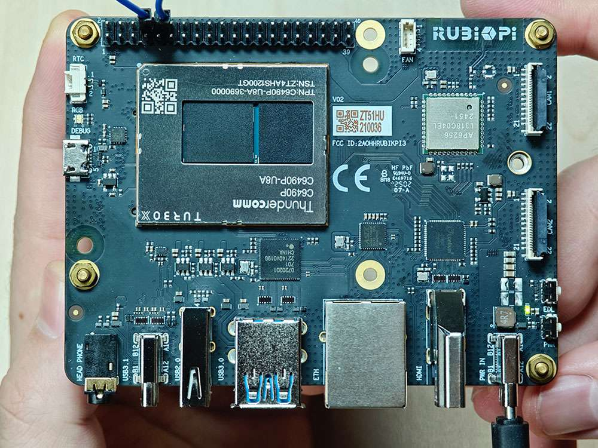

  Run the following command:

  ```shell
  python3 uart.py
  ```

  The program execution result is as follows:

   

#### UART communication using C programs

* Use UART to send and receive data.

  ```c
  #include <stdio.h>
  #include <stdlib.h>
  #include <string.h>
  #include <fcntl.h>
  #include <termios.h>
  #include <unistd.h>

  int main() {
      int serial_port_num = 2;
      char serial_port[15];

      sprintf(serial_port,"/dev/ttyHS%d",serial_port_num);
      int serial_fd;

      serial_fd = open(serial_port, O_RDWR | O_NOCTTY);
      if (serial_fd == -1) {
          perror("Failed to open serial port");
          return 1;
      }

      struct termios tty;
      memset(&tty, 0, sizeof(tty));

      if (tcgetattr(serial_fd, &tty) != 0) {
          perror("Error from tcgetattr");
          return 1;
      }

      cfsetospeed(&tty, B9600);
      cfsetispeed(&tty, B9600);

      tty.c_cflag &= ~PARENB;
      tty.c_cflag &= ~CSTOPB;
      tty.c_cflag &= ~CSIZE;
      tty.c_cflag |= CS8;

      if (tcsetattr(serial_fd, TCSANOW, &tty) != 0) {
          perror("Error from tcsetattr");
          return 1;
      }

      char tx_buffer[] = "hello world!\n";
      ssize_t bytes_written = write(serial_fd, tx_buffer, sizeof(tx_buffer));
      if (bytes_written < 0) {
          perror("Error writing to serial port");
          close(serial_fd);
          return 1;
      }
      printf("\rtx_buffer: \n %s ", tx_buffer);

      char rx_buffer[256];
      int bytes_read = read(serial_fd, rx_buffer, sizeof(rx_buffer));
      if (bytes_read > 0) {
          rx_buffer[bytes_read] = '\0';
          printf("\rrx_buffer: \n %s ", rx_buffer);
      } else {
          printf("No data received.\n");
      }

      close(serial_fd);

      return 0;
  }

  ```

* Compile programs:

  * Cross-compile the program. For details, refer to [Use the cross-compilation tools](./1.get-started.md#usecrosstool).

    ```shell
    aarch64-qcom-linux-gcc uart.c -o uart --sysroot=/home/zhy/qcom_sdk_meta/sysroots/armv8-2a-qcom-linux/
    ```

    If you use cross-compilation, transfer *uart* to RUBIK Pi 3. For example, use the ADB method. The command is as follows:

    ```shell
    adb push uart /opt
    ```

  * Compile on RUBIK Pi 3

    ```shell
    adb push uart.c /opt
    adb shell
    cd /opt
    gcc uart.c -o uart
    ```

* Short pin 8 and pin 10 with a Dupont wire and test the UART communication, as shown in the following figure.

  :::caution
  
  Pay attention to the pin order. Do not short the power and ground pins, as this may cause damage to the board.
  :::
  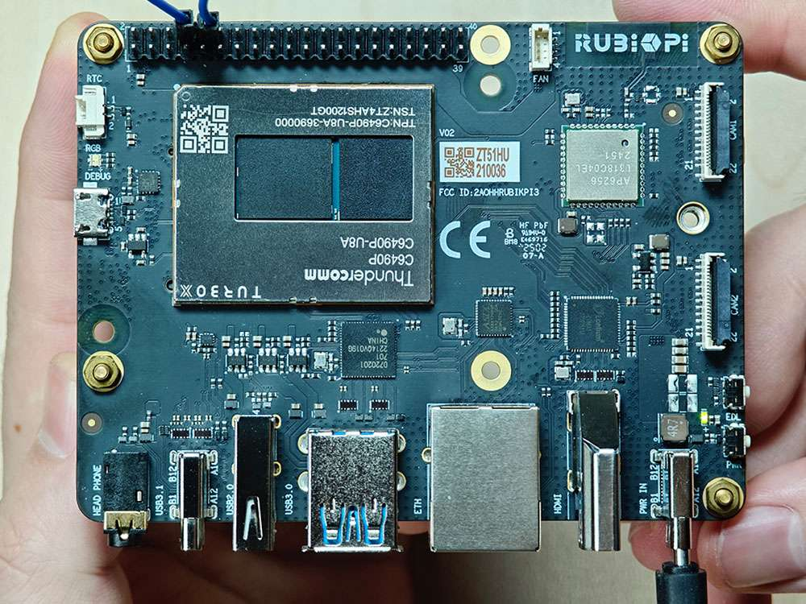

  Run the following commands:

  ```shell
  cd /opt
  ./uart
  ```

  The program execution result is as follows:

   

## USB

RUBIK Pi 3 provides four USB ports:

* 2 x USB 3.0, host mode only (No.7 in the following figure)

* 1 x USB 2.0, host or device mode (No. 6 in the following figure)

* 1 x USB 3.1 Gen 1, host or device mode (ADB), Type-C with DisplayPort v1.4 (No. 5 in the following figure)


### USB 2.0 Type-A

The USB 2.0 port is set to host mode by default. To switch the USB 2.0 port to device mode, you need to run commands manually. For example, run the following commands on RUBIK Pi 3 to simulate RUBIK Pi 3 as a USB flash drive.

```shell
cd /sys/kernel/config/usb_gadget/ #Log in from the serial port and run the following command
mkdir g1
cd g1
mkdir functions/mass_storage.0
dd if=/dev/zero of=/tmp/test.iso bs=1M count=2048 #Create a 2 GB USB drive space
mkfs.ext4 /tmp/test.iso
echo "/tmp/test.iso" > functions/mass_storage.0/lun.0/file
mkdir configs/c.1
ln -s functions/mass_storage.0/ configs/c.1/f3
mount -t debugfs none /sys/kernel/debug/

echo device > /sys/kernel/debug/usb/8c00000.usb/qcom_usb2_0_mode #Switch USB to device mode
echo 8c00000.usb > UDC #Connect the USB cable. The USB drive is identified and can be written to and read from


echo host > /sys/kernel/debug/usb/8c00000.usb/qcom_usb2_0_mode #Remove the USB cable and switch to host mode
```

### USB 3.1 Type-C

The Type-C port can automatically switch between host and device modes.

* Automatically switches to device mode when connected to PC

* Automatically switches to host mode when an OTG cable is connected

* Automatically outputs DP video signals when connected to a DP monitor

### USB debugging

This section provides the methods for obtaining debug logs. The debug methods include `regdumps`, debug `ftraces`, and `configfs` nodes. When debugging issues related to entering or exiting low-power modes, system memory management unit (SMMU), and unclocked accesses, you can check the event and controller status details through the logs obtained by using the above methods.

* USB 2.0 Type-A device path:*&#x20;/sys/devices/platform/soc@0/**8c00000**.usb/xhci-hcd.0.auto/usb1*

* USB 3.0 Type-A device path:

  * */sys/devices/platform/soc@0/**1c00000**.pci/pci0000:00/0000:00:00.0/0000:**01:00.0**/usb2*

  * */sys/devices/platform/soc@0/**1c00000**.pci/pci0000:00/0000:00:00.0/0000:**01:00.0**/usb3*

* USB 3.1 Type-C device path: */sys/devices/platform/soc@0/**a600000**.usb*

#### USB tracing

Use `debugfs` to deeply trace each transaction over the USB line. To view the trace list, run the following command.

:::note

Before running the command, ensure that `debugfs` has been mounted. If not mounted, run the following command to mount `debugfs`:&#x20;

`mount -t debugfs none /sys/kernel/debug`
:::

```shell
ls /sys/kernel/debug/tracing/events/dwc3
```

The following traces can be used to verify data transmission in the xHCI, gadget stack, or USB Type-C Connector System Software Interface (UCSI).

```shell
dwc3_alloc_request  dwc3_event              dwc3_gadget_generic_cmd  enable
dwc3_complete_trb   dwc3_free_request       dwc3_gadget_giveback     filter
dwc3_ctrl_req       dwc3_gadget_ep_cmd      dwc3_prepare_trb
dwc3_ep_dequeue     dwc3_gadget_ep_disable  dwc3_readl
dwc3_ep_queue       dwc3_gadget_ep_enable   dwc3_writel
```

To list the traces in the xHCI/Host Controller Driver (HCD), run the following command:

```shell
ls /sys/kernel/debug/tracing/events/xhci-hcd
```

The following traces can be used to verify data transmission in the xHCI/HCD.

```shell
enable                            xhci_handle_cmd_config_ep
filter                            xhci_handle_cmd_disable_slot
  xhci_add_endpoint                 xhci_handle_cmd_reset_dev
  xhci_address_ctrl_ctx             xhci_handle_cmd_reset_ep
  xhci_address_ctx                  xhci_handle_cmd_set_deq
  xhci_alloc_dev                    xhci_handle_cmd_set_deq_ep
  xhci_alloc_virt_device            xhci_handle_cmd_stop_ep
  xhci_configure_endpoint           xhci_handle_command
  xhci_configure_endpoint_ctrl_ctx  xhci_handle_event
  xhci_dbc_alloc_request            xhci_handle_port_status
  xhci_dbc_free_request             xhci_handle_transfer
  xhci_dbc_gadget_ep_queue          xhci_hub_status_data
  xhci_dbc_giveback_request         xhci_inc_deq
  xhci_dbc_handle_event             xhci_inc_enq
  xhci_dbc_handle_transfer          xhci_queue_trb
  xhci_dbc_queue_request            xhci_ring_alloc
  xhci_dbg_address                  xhci_ring_ep_doorbell
  xhci_dbg_cancel_urb               xhci_ring_expansion
  xhci_dbg_context_change           xhci_ring_free
  xhci_dbg_init                     xhci_ring_host_doorbell
  xhci_dbg_quirks                   xhci_setup_addressable_virt_device
  xhci_dbg_reset_ep                 xhci_setup_device
  xhci_dbg_ring_expansion           xhci_setup_device_slot
  xhci_discover_or_reset_device     xhci_stop_device
  xhci_free_dev                     xhci_urb_dequeue
  xhci_free_virt_device             xhci_urb_enqueue
  xhci_get_port_status              xhci_urb_giveback
  xhci_handle_cmd_addr_dev
```

To list the available events for the USB Video Class (UVC) gadget driver, run the following command:

```shell
ls /sys/kernel/debug/tracing/events/gadget
```

The output is as follows.

```shell
enable                      usb_gadget_activate
  filter                      usb_gadget_clear_selfpowered
  usb_ep_alloc_request        usb_gadget_connect
  usb_ep_clear_halt           usb_gadget_deactivate
  usb_ep_dequeue              usb_gadget_disconnect
  usb_ep_disable              usb_gadget_frame_number
  usb_ep_enable               usb_gadget_giveback_request
  usb_ep_fifo_flush           usb_gadget_set_remote_wakeup
  usb_ep_fifo_status          usb_gadget_set_selfpowered
  usb_ep_free_request         usb_gadget_vbus_connect
  usb_ep_queue                usb_gadget_vbus_disconnect
  usb_ep_set_halt             usb_gadget_vbus_draw
  usb_ep_set_maxpacket_limit  usb_gadget_wakeup
  usb_ep_set_wedge
```

To list the available events in the UCS&#x49;**&#x20;**&#x64;river, run the following command:

```shell
ls /sys/kernel/debug/tracing/events/ucsi
```

The output is as follows.

```shell
enable  ucsi_connector_change  ucsi_register_port  ucsi_run_command
filter  ucsi_register_altmode  ucsi_reset_ppm
```

#### USB regdump

The USB `debugfs` provides the following information (using the Type-C interface as an example)

* Operating mode

  ```shell
  cat /sys/kernel/debug/usb/a600000.usb/mode # Type-C interface
  ```

  :::note
  
  Operating mode of USB 2.0 Type-A `cat /sys/kernel/debug/usb/8c00000.usb/qcom_usb2_0_mode`
  :::

  Sample output:

  ```shell
  device
  ```

* State and transfer ring buffer (TRB) queues to all endpoints in device mode.

* Current link status.

  ```shell
  cat /sys/kernel/debug/usb/a600000.usb/link_state
  ```

  Sample output:

  ```shell
  Sleep
  ```

* Display processor (LSP) dump

  ```shell
  cat /sys/kernel/debug/usb/a600000.usb/lsp_dump
  ```

  Sample output:

  ```shell
  GDBGLSP[0] = 0x40000000
  GDBGLSP[1] = 0x00003a80
  GDBGLSP[2] = 0x38200000
  GDBGLSP[3] = 0x00802000
  GDBGLSP[4] = 0x126f1000
  GDBGLSP[5] = 0x3a800018
  GDBGLSP[6] = 0x00000a80
  GDBGLSP[7] = 0xfc03f14a
  GDBGLSP[8] = 0x0b803fff
  GDBGLSP[9] = 0x00000000
  GDBGLSP[10] = 0x000000f8
  GDBGLSP[11] = 0x000000f8
  GDBGLSP[12] = 0x000000f8
  GDBGLSP[13] = 0x000000f8
  GDBGLSP[14] = 0x000000f8
  GDBGLSP[15] = 0x000000f8
  ```

```shell
ls /sys/kernel/debug/usb/a600000.usb
```

Sample output:

```shell
ep0in    ep11out  ep14in   ep1out  ep4in   ep6out  ep9in       regdump
ep0out   ep12in   ep14out  ep2in   ep4out  ep7in   ep9out      testmode
ep10in   ep12out  ep15in   ep2out  ep5in   ep7out  link_state
ep10out  ep13in   ep15out  ep3in   ep5out  ep8in   lsp_dump
ep11in   ep13out  ep1in    ep3out  ep6in   ep8out  mode
```

Run the `regdump` command to obtain the current status of the register space for the following registers:

* Device mode registers, such as DCTL, DSTS, and DCFG

* Global registers, such as GCTL and GSTS

```shell
cd /sys/kernel/debug/usb/a600000.usb
cat regdump
```

Sample output:

```shell
GSBUSCFG0 = 0x2222000e
GSBUSCFG1 = 0x00001700
GTXTHRCFG = 0x00000000
GRXTHRCFG = 0x00000000
GCTL = 0x00102000
GEVTEN = 0x00000000
GSTS = 0x7e800000
GUCTL1 = 0x810c1802
GSNPSID = 0x5533330a
GGPIO = 0x00000000
GUID = 0x00060500
GUCTL = 0x0d00c010
GBUSERRADDR0 = 0x00000000
GBUSERRADDR1 = 0x00000000
GPRTBIMAP0 = 0x00000000
GPRTBIMAP1 = 0x00000000
GHWPARAMS0 = 0x4020400a
GDBGFIFOSPACE = 0x00420000
GDBGLTSSM = 0x41090658
GDBGBMU = 0x20300000
GPRTBIMAP_HS0 = 0x00000000
GPRTBIMAP_HS1 = 0x00000000
GPRTBIMAP_FS0 = 0x00000000
GPRTBIMAP_FS1 = 0x00000000
GUCTL2 = 0x0198440d
VER_NUMBER = 0x00000000
VER_TYPE = 0x00000000
GUSB2PHYCFG(0) = 0x00002400
GUSB2I2CCTL(0) = 0x00000000
GUSB2PHYACC(0) = 0x00000000
GUSB3PIPECTL(0) = 0x030e0002
GTXFIFOSIZ(0) = 0x00000042
GRXFIFOSIZ(0) = 0x00000305
GEVNTADRLO(0) = 0xfffff000
GEVNTADRHI(0) = 0x0000000f
GEVNTSIZ(0) = 0x00001000
GEVNTCOUNT(0) = 0x00000000
GHWPARAMS8 = 0x000007ea
GUCTL3 = 0x00010000
GFLADJ = 0x8c80c8a0
DCFG = 0x00cc08b4
DCTL = 0x8cf00a00
DEVTEN = 0x00000257
DSTS = 0x008a5200
DGCMDPAR = 0x00000000
DGCMD = 0x00000000
DALEPENA = 0x0000000f
DEPCMDPAR2(0) = 0x00000000
DEPCMDPAR1(0) = 0xffffe000
DEPCMDPAR0(0) = 0x0000000f
DEPCMD(0) = 0x00000006
OCFG = 0x00000000
OCTL = 0x00000000
OEVT = 0x00000000
OEVTEN = 0x00000000
OSTS = 0x00000000
```

#### Host mode sysfs lookup

To view the bus detailed information, run the following command:

```shell
lsub
```

Sample output:

```shell
Bus 002 Device 001: ID 1d6b:0003 Linux Foundation 3.0 root hub
Bus 001 Device 002: ID 03f0:134a HP, Inc Optical Mouse
Bus 001 Device 001: ID 1d6b:0002 Linux Foundation 2.0 root hub
```

To view the contents of the current directory, run the following commands:

```shell
cd /sys/bus/usb/devices/
ls
```

Sample output:

```shell
1-0:1.0  1-1  1-1:1.0  2-0:1.0  usb1  usb2
```

To view detailed information about USB devices, run the following command:

```shell
cat /sys/kernel/debug/usb/devices
```

Sample output:

```shell
T:  Bus=01 Lev=00 Prnt=00 Port=00 Cnt=00 Dev#=  1 Spd=480  MxCh= 1
B:  Alloc=  0/800 us ( 0%), #Int=  0, #Iso=  0
D:  Ver= 2.00 Cls=09(hub  ) Sub=00 Prot=01 MxPS=64 #Cfgs=  1
P:  Vendor=1d6b ProdID=0002 Rev= 6.05
S:  Manufacturer=Linux 6.5.0-rc4 xhci-hcd
S:  Product=xHCI Host Controller
S:  SerialNumber=xhci-hcd.0.auto
C:* #Ifs= 1 Cfg#= 1 Atr=e0 MxPwr=  0mA
I:* If#= 0 Alt= 0 #EPs= 1 Cls=09(hub  ) Sub=00 Prot=00 Driver=hub
E:  Ad=81(I) Atr=03(Int.) MxPS=   4 Ivl=256ms

T:  Bus=01 Lev=01 Prnt=01 Port=00 Cnt=01 Dev#=  2 Spd=1.5  MxCh= 0
D:  Ver= 2.00 Cls=00(>ifc ) Sub=00 Prot=00 MxPS= 8 #Cfgs=  1
P:  Vendor=03f0 ProdID=134a Rev= 1.00
S:  Manufacturer=PixArt
S:  Product=HP USB Optical Mouse
C:* #Ifs= 1 Cfg#= 1 Atr=a0 MxPwr=100mA
I:* If#= 0 Alt= 0 #EPs= 1 Cls=03(HID  ) Sub=01 Prot=02 Driver=usbhid
E:  Ad=81(I) Atr=03(Int.) MxPS=   4 Ivl=10ms

T:  Bus=02 Lev=00 Prnt=00 Port=00 Cnt=00 Dev#=  1 Spd=5000 MxCh= 1
B:  Alloc=  0/800 us ( 0%), #Int=  0, #Iso=  0
D:  Ver= 3.00 Cls=09(hub  ) Sub=00 Prot=03 MxPS= 9 #Cfgs=  1
P:  Vendor=1d6b ProdID=0003 Rev= 6.05
S:  Manufacturer=Linux 6.5.0-rc4 xhci-hcd
S:  Product=xHCI Host Controller
S:  SerialNumber=xhci-hcd.0.auto
C:* #Ifs= 1 Cfg#= 1 Atr=e0 MxPwr=  0mA
I:* If#= 0 Alt= 0 #EPs= 1 Cls=09(hub  ) Sub=00 Prot=00 Driver=hub
E:  Ad=81(I) Atr=03(Int.) MxPS=   4 Ivl=256ms
```

## Camera Serial Interface (CSI)

Currently, RUBIK Pi 3 is compatible with three Raspberry Pi cameras. The following table lists the supported resolutions for each camera module.

| Resolution  | Aspect Ratio | IMX477 | IMX708 | IMX219 |
| ----------- | ------------ | ------ | ------ | ------ |
| 4056 x 3040 | 4:3          | Yes    | No     | No     |
| 4608 x 2592 | 16:9         | No     | Yes    | No     |
| 3280 x 2464 | 4:3          | No     | No     | Yes    |
| 1920 x 1080 | 16:9         | Yes    | No     | No     |
| 1632 x 1224 | 4:3          | No     | No     | Yes    |

* Raspberry Pi High Quality Camera (IMX477/M12 Mount)  [Purchase link](https://www.raspberrypi.com/products/raspberry-pi-high-quality-camera/)

  In the demonstration in [Qualcomm IM SDK](./5.qualcomm-im-sdk.md#QIMSDK), the IMX477 camera uses the WS1053516 lens.

  

* Raspberry Pi Camera Module 2 (IMX219) [Purchase link](https://www.raspberrypi.com/products/camera-module-v2/)

   :::note
  
   Currently, RUBIK Pi 3 only supports the standard Camera Module 2 and does not support the wide-angle or NoIR versions.
   :::

* Raspberry Pi Camera Module 3 (IMX708) [Purchase link](https://www.raspberrypi.com/products/camera-module-3/)

  :::note
  
  Currently, RUBIK Pi 3 only supports the standard Camera Module 3 and does not support the wide-angle or NoIR versions. The current software version does not support the autofocus (AF) function of the Module 3 camera.
  :::

<a id="section-2.4.1"></a>

### Connect the camera cable

RUBIK Pi 3 supports the 22-pin FPC with a 0.5mm pitch and a 0.3±0.05mm thickness. It is compatible with the [Raspberry Pi 5 FPC](https://www.raspberrypi.com/products/camera-cable/) of the same specification.

 :::caution

 Never plug or unplug the camera module while the board is powered on, as this can easily damage the camera module.
 :::


1. Pull up the lock of the connector.

   

2. Insert the FPC. Ensure that the contacts are toward the center of RUBIK Pi 3.

   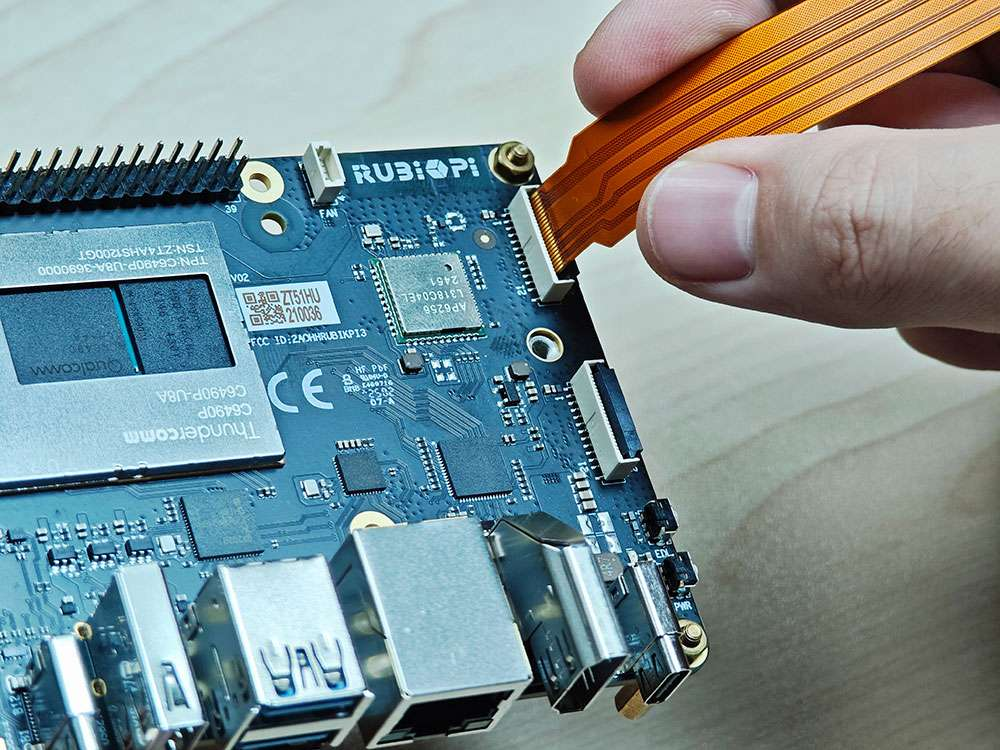

3) Press the lock down to ensure that the FPC is properly connected.

   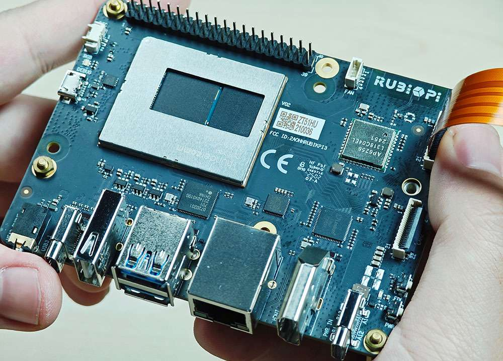

### Use cameras

The camera can be operated by using the GStreamer command on RUBIK Pi 3. Before an operation, run the following commands to set the camera.

```shell
echo multiCameraLogicalXMLFile=kodiak_dc.xml > /var/cache/camera/camxoverridesettings.txt
echo enableNCSService=FALSE >> /var/cache/camera/camxoverridesettings.txt
```

Run the following commands to enable or disable the camera-related logging. After running the commands, restart your RUBIK Pi 3 for the setting to take effect.

Default values:

* `logWarningMask：0xFFFFFFFFFFFFFFFF`

* `logCoreCfgMask：0xFFFFFFFFFFFFFFFF`

```shell
echo logWarningMask=0x00 >> /var/cache/camera/camxoverridesettings.txt
echo logCoreCfgMask=0x00 >> /var/cache/camera/camxoverridesettings.txt
```

Connect cameras to connectors 13 and 14 in the following figure.


The following picture shows the physical connection:


:::note

Currently, running two IMX708 at 4608 x 2592 simultaneously is not supported.
:::

* Run the following commands on RUBIK Pi 3 for the full-screen preview of a single camera:

  ```shell
  export XDG_RUNTIME_DIR=/dev/socket/weston  
  export WAYLAND_DISPLAY=wayland-1  
  setprop persist.overlay.use_c2d_blit 2  
  gst-launch-1.0 -e qtiqmmfsrc camera=0 name=camsrc ! video/x-raw\(memory:GBM\),format=NV12,width=1920,height=1080,framerate=30/1,compression=ubwc ! queue ! waylandsink fullscreen=true async=true
  ```

The following figure shows the preview result:


* Run the following commands on RUBIK Pi 3 for the concurrent preview of two cameras:

  ```shell
  # Terminal 1  
  export XDG_RUNTIME_DIR=/dev/socket/weston  
  export WAYLAND_DISPLAY=wayland-1  
  setprop persist.overlay.use_c2d_blit 2  
  gst-launch-1.0 -e qtiqmmfsrc camera=0 name=camsrc ! video/x-raw\(memory:GBM\),format=NV12,width=1920,height=1080,framerate=30/1,compression=ubwc ! queue ! waylandsink sync=false x=0 y=0 width=960 height=540 enable-last-sample=false  
        
  # Terminal 2  
  export XDG_RUNTIME_DIR=/dev/socket/weston  
  export WAYLAND_DISPLAY=wayland-1  
  setprop persist.overlay.use_c2d_blit 2  
  gst-launch-1.0 -e qtiqmmfsrc camera=1 name=camsrc ! video/x-raw\(memory:GBM\),format=NV12,width=1920,height=1080,framerate=30/1,compression=ubwc ! queue ! waylandsink sync=false x=960 y=540 width=960 height=540 enable-last-sample=false
  ```

  The following figure shows the preview result:

  

* Run the following commands on RUBIK Pi 3 for concurrent video recording from both cameras.

  ```shell
  # Terminal 1:   
  echo multiCameraLogicalXMLFile=kodiak_dc.xml > /var/cache/camera/camxoverridesettings.txt  
  export XDG_RUNTIME_DIR=/dev/socket/weston  
  export WAYLAND_DISPLAY=wayland-1  
  setprop persist.overlay.use_c2d_blit 2  
  gst-launch-1.0 -e qtiqmmfsrc camera=0 name=camsrc video_0::type=preview ! video/x-raw\(memory:GBM\),format=NV12,width=1920,height=1080,framerate=30/1,compression=ubwc,interlace-mode=progressive,colorimetry=bt601 ! queue ! v4l2h264enc capture-io-mode=5 output-io-mode=5 ! queue ! h264parse ! mp4mux ! queue ! filesink location="/opt/mux0.mp4"    
  # Terminal 2:   
  export XDG_RUNTIME_DIR=/dev/socket/weston  
  export WAYLAND_DISPLAY=wayland-1  
  setprop persist.overlay.use_c2d_blit 2  
  gst-launch-1.0 -e qtiqmmfsrc camera=1 name=camsrc video_0::type=preview ! video/x-raw\(memory:GBM\),format=NV12,width=1920,height=1080,framerate=30/1,compression=ubwc,interlace-mode=progressive,colorimetry=bt601 ! queue ! v4l2h264enc capture-io-mode=5 output-io-mode=5 ! queue ! h264parse ! mp4mux ! queue ! filesink location="/opt/mux1.mp4"
  ```

  The recorded video files are saved in th&#x65;*&#x20;/opt* directory.

   

* Run the following commands on RUBIK Pi 3 for concurrent preview and video recording from two cameras.

  ```shell
  # Terminal 1  
  export XDG_RUNTIME_DIR=/dev/socket/weston  
  export WAYLAND_DISPLAY=wayland-1  
  setprop persist.overlay.use_c2d_blit 2  
  gst-launch-1.0 -e qtiqmmfsrc camera=0 name=camsrc video_0::type=preview ! video/x-raw\(memory:GBM\),format=NV12,width=1920,height=1080,framerate=30/1,compression=ubwc,interlace-mode=progressive,colorimetry=bt601 ! queue ! v4l2h264enc capture-io-mode=5 output-io-mode=5 ! queue ! h264parse ! mp4mux ! queue ! filesink location="/opt/mux0.mp4" camsrc. ! video/x-raw\(memory:GBM\),format=NV12,width=1920,height=1080,framerate=30/1,compression=ubwc ! waylandsink sync=false x=0 y=0 width=960 height=540 enable-last-sample=false  
        
  # Terminal 2  
  export XDG_RUNTIME_DIR=/dev/socket/weston  
  export WAYLAND_DISPLAY=wayland-1  
  setprop persist.overlay.use_c2d_blit 2  
  gst-launch-1.0 -e qtiqmmfsrc camera=1 name=camsrc video_0::type=preview ! video/x-raw\(memory:GBM\),format=NV12,width=1920,height=1080,framerate=30/1,compression=ubwc,interlace-mode=progressive,colorimetry=bt601 ! queue ! v4l2h264enc capture-io-mode=5 output-io-mode=5 ! queue ! h264parse ! mp4mux ! queue ! filesink location="/opt/mux1.mp4" camsrc. ! video/x-raw\(memory:GBM\),format=NV12,width=1920,height=1080,framerate=30/1,compression=ubwc ! waylandsink sync=false x=960 y=540 width=960 height=540 enable-last-sample=false
  ```

  The recorded video files are saved in the */opt* directory.

  

  The following figure shows the preview result:

  

* Run the following commands on RUBIK Pi 3 to test the camera photo function:

  ```shell
  export XDG_RUNTIME_DIR=/dev/socket/weston
  export WAYLAND_DISPLAY=wayland-1
  setprop persist.overlay.use_c2d_blit 2
  gst-pipeline-app -e qtiqmmfsrc name=camsrc camera=0  ! "image/jpeg,width=1920,height=1080,framerate=30/1" ! multifilesink location=/opt/0_frame%d.jpg max-files=1

  ```

  After executing the above commands, the following MENU is displayed in the terminal. Type "3" in the MENU and press **Enter** to take photos.

  ```shell

  ##################################### MENU #####################################

   ============================== Pipeline Controls ==============================
     (0) NULL                     : Set the pipeline into NULL state
     (1) READY                    : Set the pipeline into READY state
     (2) PAUSED                   : Set the pipeline into PAUSED state
     (3) PLAYING                  : Set the pipeline into PLAYING state
   ==================================== Other ====================================
     (p) Plugin Mode              : Choose a plugin which to control
     (q) Quit                     : Exit the application


  Choose an option:

  # Press CTRL+C to stop taking photos
  ```

  The captured photos are saved in the */opt* directory.

   

### Troubleshoot camera issues

If the camera fails to display or capture images, check the following contents:

1. Check the camera module connection.

   For details, refer to [Connect the camera cable](./2.peripherals-and-interfaces.md#section-2.4.1).

2. Run the single-stream preview test case.

   ```shell
   export XDG_RUNTIME_DIR=/dev/socket/weston
   export WAYLAND_DISPLAY=wayland-1
   setprop persist.overlay.use_c2d_blit 2
   gst-launch-1.0 -e qtiqmmfsrc camera=0 name=camsrc ! video/x-raw\(memory:GBM\),format=NV12,width=1920,height=1080,framerate=30/1,compression=ubwc ! queue ! waylandsink sync=false x=1000 y=1000 width=960 height=540 enable-last-sample=false
   ```

3. Run the following command to collect logs.

   ```shell
   journalctl -f > /opt/log.txt
   ```

   Search for "probe success" in the logs. "probe success" indicates that the camera module is powered on and responding to I2C control. If the sensor does not have the "probe success" log, the possible cause is the flex cable connection or camera module issue.

   The following log indicates that an IMX477 is detected:

   ```shell
   [   80.645992] CAM_INFO: CAM-SENSOR: cam_sensor_driver_cmd: 939: Probe success,slot:7,slave_addr:0x34,sensor_id:0x477, is always on: 0
   ```

4. Check the camera sensor driver command.

   Collect logs using the `journalctl -f > /opt/log.txt` command and search for "cam_sensor_driver_cmd" in the logs. "CAM_START_DEV Success" indicates that the camera sensor streaming started. "CAM_STOP_DEV Success" indicates that the camera sensor streaming has stopped. For example:

   ```shell
   start:
   [   81.172814] CAM_INFO: CAM-SENSOR: cam_sensor_driver_cmd: 1129: CAM_START_DEV Success, sensor_id:0x477,sensor_slave_addr:0x34
   stop:
   [   88.905241] CAM_INFO: CAM-SENSOR: cam_sensor_driver_cmd: 1157: CAM_STOP_DEV Success, sensor_id:0x477,sensor_slave_addr:0x34
   ```

5. Check the sensor streaming.

   Enable the CSID SOF/EOF IRQ logs, then execute the camera streaming command.

   ```shell
   mount -o rw,remount /usr
   mount -t debugfs none /sys/kernel/debug/
   echo 0x8 > /sys/module/camera/parameters/debug_mdl
   echo 3 >/sys/kernel/debug/camera_ife/ife_csid_debug
   echo 1 > /sys/kernel/tracing/tracing_on
   echo 1 > /sys/kernel/tracing/events/camera/cam_log_debug/enable
   echo 2 > /sys/module/camera/parameters/debug_type
   cat /sys/kernel/tracing/trace_pipe > trace.txt
   ```

   The captured logs provide detailed information about the Start of Frame (SOF) and End of Frame (EOF). In the *trace.txt* log, search for "irq_status_ipp".

   * BIT12 (0x1000) represents the SOF packet.

   * BIT9 (0x200) represents the EOF packet.

   The log will appear as follows:

   ```shell
   <idle>-0       [000] d.h1. 19287.546764: cam_log_debug:
   CAM_DBG: CAM-ISP: cam_ife_csid_irq: 4996: irq_status_ipp = 0x1110 cam-server-25604     [000] dNH.. 19287.561705: cam_log_debug:
   CAM_DBG: CAM-ISP: cam_ife_csid_irq: 4996: irq_status_ipp = 0xee8
   ```

## HDMI OUT

The HDMI connector is component No.9 in the following figure.&#x20;

RUBIK Pi 3 HDMI specifications are as follows:

* HDMI 1.4

* 3840 x 2160@30 fps

* DSI 0 to HDMI (LT9611)

* Supports CEC

* Supports resolution auto-adjustment

* Supports hot swapping


:::note

 DP and HDMI can be connected to a monitor simultaneously for concurrent display.
 :::

### CEC

HDMI Consumer Electronics Control (CEC) is a feature of HDMI designed to interconnect and control multiple connected devices via a single HDMI cable. CEC facilitates communication between connected devices through a dedicated CEC pin. For example, multiple devices can be controlled with a single remote control.

RUBIK Pi 3 integrates the cec-client tool. After connecting the HDMI cable to a TV, run the following command to check whether the TV supports CEC.

```shell
echo 'scan' | cec-client -s -d 1
```

If the TV supports CEC, you will see the following output:

```plaintext
opening a connection to the CEC adapter...
requesting CEC bus information ...
CEC bus information
===================
device #0: TV
address:       0.0.0.0
active source: no
vendor:        Sony
osd string:    TV
CEC version:   1.4
power status:  standby
language:      eng
 
  
device #1: Recorder 1
address:       1.0.0.0
active source: no
vendor:        Pulse Eight
osd string:    CECTester
CEC version:   1.4
power status:  on
language:      eng
 
  
device #4: Playback 1
address:       3.0.0.0
active source: no
vendor:        Sony
osd string:    PlayStation 4
CEC version:   1.3a
power status:  standby
language:      ???
```

If the TV supports the CEC function, run the following commands on RUBIK Pi 3 to increase or decrease the TV volume.

```shell
echo 'volup' | cec-client -t p -s  
echo 'voldown' | cec-client -t p -s
```

For more information about how to use cec-client, use the `-h` parameter.


### HDMI OUT touchscreen

RUBIK Pi 3 supports HDMI OUT touchscreen with 1024 x 600P resolution by default:

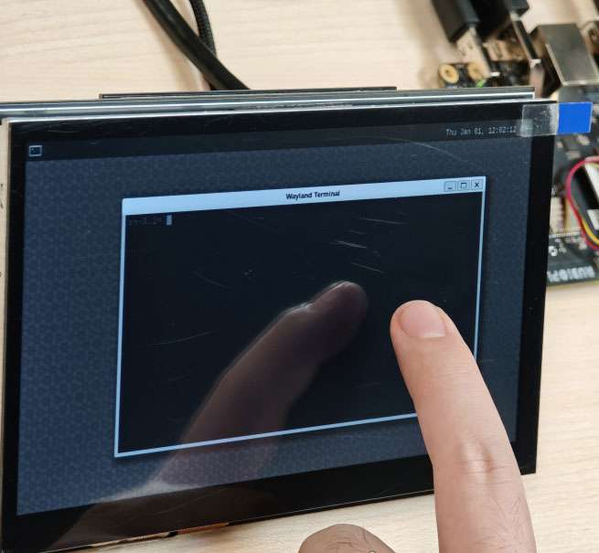

:::info

The screen used in the picture above is a [7" IPS HD touch screen](https://a.co/d/cTl7rkN).
:::

### HDMI OUT debugging

RUBIK Pi 3 uses the LT9611 DSI-to-HDMI bridge chip.

The following table lists the configurations required for integrating the bridge.
| Description | DTSI Node |
|-------------|----------|
| Set the DSI-to-HDMI bridge panel as Primary | `&sde_dsi { qcom, dsi-default-panel = <&dsi_ext_bridge_1080p>;`|
| Configure reference power supply entries for the bridge chip | `&sde_dsi { vddio-supply = <&vreg_18c_ip62>; vdda-9p9-supply = <&vreg_11oc_9p88>; vdda-9p9-supply = <&vreg_11oc_9p88>; `|
| Configure panel reset GPIOs for the bridge chip |` lt9611: lt,lt9611 { reset-options = <&tlmm 21 0>;} `|
| Configure the DSI host driver in the external bridge mode to work with the third-party DSI-to-HDMI bridge chip | `qcom,mdss-dsi-ext-bridge-mode;` |

#### Obtain LT9611 logs

Run the following command to obtain LT9611 logs:

```bash
dmesg | grep lt9611
```

Check the logs. The following message indicates that HDMI OUT is functioning properly.

This log records the initialization of the LT9611 chip and the HDMI connection process, from firmware version detection to CEC initialization, indicating that the chip has started normally.

1. The firmware version of the chip is 0xe2.17.02. This indicates that during initialization, the driver successfully reads the version information.

2. The Consumer Electronics Control (CEC) function adapter of the LT9611 has been successfully registered.

3. CEC initialization is complete, which means that the CEC module of LT9611 is functioning properly.

4. The chip successfully reads the Hot Plug Detection (HPD) status, and a value is returned, confirming the connection of the HDMI device.

5. The chip detects the video signal parameters: horizontal resolution 1920 pixels, vertical resolution 1080 pixels, and pixel clock frequency 148500 kHz (148.5 MHz). This is a typical 1080p resolution (Full HD) with a 60 Hz refresh rate configuration.

```bash
[    5.492765] lt9611 9-0039: LT9611 revision: 0xe2.17.02
[    5.570258] lt9611 9-0039: CEC adapter registered
[    5.582944] lt9611 9-0039: CEC init success

[    8.233028] lt9611 9-0039: success to read hpd status: 13
[    8.233044] lt9611_device_connect_status_notify: send msg[Hdmi Connection] ret[32]
[    8.345015] lt9611 9-0039: hdisplay=1920, vdisplay=1080, clock=148500 
[    8.836662] lt9611 9-0039: video check: hactive_a=1920, hactive_b=1920, vactive=1080, v_total=1125, h_total_sysclk=401, mipi_video_format=170
```

#### Obtain DSI logs

The output DSI information can also be used for debugging. DSI stands for Display Serial Interface, which is typically related to display drivers for mobile devices or embedded systems (such as MIPI DSI).&#x20;

The following command is used to view kernel logs related to DSI for debugging display drivers or hardware issues.

```bash
dmesg | grep dsi
```

Sample output:

```shell

[    4.811430] i2c 9-0039: Fixed dependency cycle(s) with /soc@0/qcom,dsi-display-primary
[    4.941131] dsi_phy ae94400.qcom,mdss_dsi_phy0: supply gdsc not found, using dummy regulator
[    4.941385] [drm:dsi_pll_init [msm_drm]] [msm-dsi-info]: DSI_PLL_0: DSI pll label = dsi_pll_5nm
[    4.941466] [drm:dsi_pll_init [msm_drm]] [msm-dsi-info]: DSI_PLL_0: PLL SSC enabled
[    4.941513] dsi_pll_init: PLL base=00000000625eaee4
[    4.941658] [drm:dsi_pll_clock_register_5nm [msm_drm]] [msm-dsi-info]: DSI_PLL_0: Registered clocks successfully
[    4.941700] [drm:dsi_phy_driver_probe [msm_drm]] [msm-dsi-info]: DSI_0: Probe successful
[    4.973185] [drm:dsi_ctrl_dev_probe [msm_drm]] [msm-dsi-info]: dsi-ctrl-0: Probe successful

[    5.585113] [drm:dsi_display_bind [msm_drm]] [msm-dsi-info]: Successfully bind display panel 'qcom,mdss_dsi_ext_bridge_1080p '
[    5.585154] msm_drm ae00000.qcom,mdss_mdp0: bound soc@0:qcom,dsi-display-primary (ops dsi_display_comp_ops [msm_drm])
[    8.345467] [drm:dsi_display_set_mode [msm_drm]] [msm-dsi-info]: mdp_transfer_time=0, hactive=1920, vactive=1080, fps=60, clk_rate=0
[    8.345740] [drm:dsi_ctrl_isr_configure [msm_drm]] [msm-dsi-info]: dsi-ctrl-0: IRQ 249 registered
```

#### View display panel information

Run the following command to view the information of the specified display panel.

```plain&#x20;text
cat /sys/kernel/debug/qcom,mdss_dsi_ext_bridge_2k60/dump_info
```

Sample output:

```shell
name = qcom,mdss_dsi_ext_bridge_2k60
        Resolution = 2560(80|48|32|1)x1440(33|3|5|1)@60fps 0 Hz
        CTRL_0:
                ctrl = dsi-ctrl-0
                phy = dsi-phy-0
        Panel = ext video mode dsi bridge
        Clock master = dsi-ctrl-0
```

#### View DSI clock information

Run the following command to view DSI clock information.

```shell
cat /sys/kernel/debug/qcom,mdss_dsi_ext_bridge_2k60/dsi-ctrl-0/state_info
```

Sample output:

```shell
Current State:
        CTRL_ENGINE = ON
        VIDEO_ENGINE = ON
        COMMAND_ENGINE = OFF

Clock Info:
        BYTE_CLK = 181274400, PIXEL_CLK = 241699200, ESC_CLK = 19200000
```

#### View regulator information

Run the following command to view the regulator status and voltage.

```shell
cat /sys/kernel/debug/regulator/regulator_summary
```

#### View interface information

To retrieve the debug dump output (display interface number, VSync count, underload count, and interface mode), run the following command:

```shell
cat /sys/kernel/debug/dri/0/encoder*/status
```

Sample output:

```shell
intf:1    vsync:  359036     underrun:       0    mode: video
intf:0    vsync:       0     underrun:       0    mode: video
```

#### Common DPU debug information

The common Display Processing Unit (DPU) debug information is explained as follows:

Run the following command to check the DPU clock rate:

```shell
cat /sys/kernel/debug/clk/clk_summary | grep disp_cc
```

Set the DPU to performance mode.

```shell
cd /sys/kernel/debug/dri/0/debug/core_perf/
echo 1 > perf_mode
```

## DisplayPort

RUBIK Pi 3 provides a USB Type-C that supports DisplayPort (DP) over Single-Stream Transport (SST), labeled as No. 5 in the following figure.

The DP specifications are as follows:

* 3840 × 2160@60 fps

* Single-stream transport

* Simultaneous operation of DP and USB 3.0


:::note

DP and HDMI can be connected to a monitor simultaneously for concurrent display.
:::

### DP debugging

#### Obtain DP logs

Run the following command to enable log printing.

```bash
echo 8 > /proc/sys/kernel/printk 
echo ‘file dsi* +p’ > /sys/kernel/debug/dynamic_debug/control
```

:::note

 `8` in the first command is the log level. In the Linux kernel, log levels are represented by numbers from 0 to 8. The smaller the number, the higher the priority. The levels are described as follows:

 * 0 (KERN_EMERG): System emergency (e.g., crash).

 * 1 (KERN_ALERT): Issues that require immediate attention.

 * 2 (KERN_CRIT): Critical errors.

 * 3 (KERN_ERR): General errors.

 * 4 (KERN_WARNING): Warnings.

 * 5 (KERN_NOTICE): Normal events that are noteworthy.

 * 6 (KERN_INFO): Informational messages.

 * 7 (KERN_DEBUG): Debugging information.

 * 8: A level lower than debugging, displaying all levels of logs.
 :::

Running the second command `echo ‘file dsi* +p’ > /sys/kernel/debug/dynamic_debug/control` will display the debug information from all kernel source files whose filenames start with *dsi\** (usually related to DSI display driver code). This debug information will be output to the kernel log, which can be viewed by running `dmesg`. The following command output can be used for DP debugging:

```bash
mount -t debugfs none /sys/kernel/debug
echo 'file dp_display.c +p' > /sys/kernel/debug/dynamic_debug/control
echo 'file dp_aux.c +p' > /sys/kernel/debug/dynamic_debug/control
echo 'file dp_link.c +p' > /sys/kernel/debug/dynamic_debug/control
echo 'file dp_power.c +p' > /sys/kernel/debug/dynamic_debug/control
echo 'file dp_ctrl.c +p' > /sys/kernel/debug/dynamic_debug/control
echo 'file dp_parser.c +p' > /sys/kernel/debug/dynamic_debug/control
```

After printing all levels of logs, filter DP logs for further validation. The following output shows the logs for a successful DP startup.

```plain&#x20;text
hub 4-0:1.0: USB hub found
hub 4-0:1.0: 1 port detected
usb usb5: We don't know the algorithms for LPM for this host, disabling LPM.
hub 5-0:1.0: USB hub found
hub 5-0:1.0: 1 port detected
[drm:dp_power_clk_enable][msm-dp-info][3216]core:on link:off strm0:off strm1:off
[drm:dp_display_host_init][msm-dp-info][3216][OK]
[drm:dp_display_host_ready][msm-dp-info][2912][OK]
[drm:dp_panel_read_sink_caps][msm-dp-info][2912]fec_en=0, dsc_en=0, widebus_en=0
[drm:dp_link_process_request][msm-dp-info][2912]event: DP_LINK_STATUS_UPDATED
[drm:dp_power_clk_enable][msm-dp-info][2912]core:on link:on strm0:off strm1:off
[drm:dp_catalog_ctrl_fec_config][msm-dp-err][2912]no link
[drm:dp_ctrl_link_train][msm-dp-info][2912]link training #1 successful
[drm:dp_ctrl_link_train][msm-dp-info][2912]link training #2 successful
[drm:dp_link_process_request][msm-dp-info][2912]event: DP_LINK_STATUS_UPDATED
[drm:dp_catalog_ctrl_fec_config][msm-dp-err][2912]no link
[drm:dp_ctrl_link_train][msm-dp-info][2912]link training #1 successful
[drm:dp_ctrl_link_train][msm-dp-info][2912]link training #2 successful
[drm:dp_display_send_hpd_event][msm-dp-info][2912][name=DP-1]:[status=connected] [bpp=0] [pattern=0]
[drm:dp_display_send_hpd_event][msm-dp-info][2912]uevent success: 0
lt9611 9-0039: success to read hpd status: 8
lt9611_device_connect_status_notify: send msg[Hdmi Disconnect] ret[32]
lt9611 9-0039: success to read hpd status: 8
lt9611_device_connect_status_notify: send msg[Hdmi Disconnect] ret[32]
[drm:dp_power_clk_enable][msm-dp-info][577 ]core:on link:on strm0:on strm1:off
[drm:dp_catalog_ctrl_fec_config][msm-dp-err][577 ]no link
[drm:dp_ctrl_link_train][msm-dp-info][577 ]link training #1 successful
[drm:dp_ctrl_link_train][msm-dp-info][577 ]link training #2 successful
[drm:dp_panel_resolution_info][msm-dp-info][577 ]DP RESOLUTION: active(back|front|width|low)
[drm:dp_panel_resolution_info][msm-dp-info][577 ]1920(148|88|44|0)x1080(36|4|5|0)@60fps 24bpp 148500Khz 10LR 2Ln
```

The above logs for a successful DP startup are summarized as follows:

1. USB initialization: The system detects two single-port USB hubs during startup and disables the LPM of USB 5.

2. DP preparation: The DP controller is initialized, the display capabilities are read, and preparations are made to establish a connection.

3. DP link training: Multiple link training attempts are made to establish a stable connection between the DP and the display.

4. DP connection confirmation: The system confirms that DP-1 is connected and notifies the user space.

5. HDMI disconnection: LT9611 detects HDMI disconnection, which may be due to user action or interface switching.

6. DP output: After HDMI disconnection, DP enables video streaming and outputs 1080p@60 Hz video.

## Wi-Fi and Bluetooth

RUBIK Pi 3 is equipped with the AP6256 Wi-Fi module and supports Wi-Fi 5 and Bluetooth 5.2.

### Wi-Fi

Wi-Fi is a wireless networking technology that uses the IEEE 802.11 protocol. It allows electronic devices like smartphones, wearables, laptops, desktops, and other consumer electronics to connect to the Internet without physical cables.

#### Operating bands

The AP6256 Wi-Fi chipset supports 2.4 GHz and 5 GHz operating bands.

#### Operating modes

The Wi-Fi software operates in the following modes.

| Mode          | Description |
|---------------|-------------|
| STA mode      | In STA mode, a device connects to an AP within a Wi-Fi network and communicates with other devices in the network. This mode is standard for wireless devices in a Wi-Fi connection. |
| Hotspot mode  | The hotspot mode enables a device to provide backhaul (Internet) connectivity to Wi-Fi clients using a cellular link (LTE). The device establishes this connection through its lightweight hotspot interface. In hotspot mode, the device can communicate with other Wi-Fi clients connected to the same hotspot, communicate with the hotspot device, and share the WAN connection of the device.|

##### STA mode

In Station (STA) mode, the device can be connected to an existing Wi-Fi network to access network resources or the Internet. Run the following commands on RUBIK Pi 3:

1. Scan for nearby Wi-Fi.

   ```shell
   iw wlan0 scan | grep SSID
   ```

2. Connect to Wi-Fi.

   ```shell
   wpa_passphrase <ssid> <passphrase> > /etc/wpa_supplicant.conf #Enter the Wi-Fi account and password
   systemctl restart wifi #Connect to Wi-Fi
   ```

   The device will automatically connect to the Wi-Fi network the next time it is started.

3. If you want to switch to another Wi-Fi network, modify the */etc/wpa_supplicant.conf* file. The following example shows a modification method:

   ```shell
   ctrl_interface=/var/run/wpa_supplicant
   update_config=1
   pmf=1
   network={
           ssid="RUBIKPi"
           psk="123456789"
   }
   ```

   * `ssid` is the Wi-Fi network name.

   * `psk` is the Wi-Fi network password.

   Modify the .conf file based on your actual situation.

4) After modifying the configuration, run the following commands to connect to the Wi-Fi network.

   ```shell
   killall -9 wpa_supplicant  
   wpa_supplicant -Dnl80211 -iwlan0 -c/etc/wpa_supplicant.conf -B
   ```

##### Hotspot mode

In Access Point (AP) mode, namely, the wireless hotspot mode, the device becomes a gateway for other devices to connect to a network. The steps to create an AP are as follows:

* Enable the AP.

  1. Create or modify *hostapd.conf.*

     ```plain&#x20;text
     ctrl_interface=/var/run/hostapd
     driver=nl80211
     ieee80211n=1
     interface=wlan1
     hw_mode=a
     channel=36
     beacon_int=100
     dtim_period=1
     ssid=RUBIKPi
     auth_algs=1
     ap_isolate=0
     ignore_broadcast_ssid=0
     wpa=2
     wpa_key_mgmt=WPA-PSK
     rsn_pairwise=CCMP
     wpa_passphrase=123456789
     ```

  2. Run the following commands to enable the AP:

     ```shell
     hostapd -B /opt/hostapd.conf # Set the software AP
     # Enable the DHCP server
     brctl addbr br0
     brctl addif br0 wlan1
     ifconfig br0 192.168.225.1 netmask 255.255.255.0 up
     killall dnsmasq
     dnsmasq --conf-file=/etc/dnsmasq.conf --dhcp-leasefile=/var/run/dnsmasq.leases --addn-hosts=/data/hosts --pid-file=/var/run/dnsmasq.pid -i br0 -I lo -z --dhcp-range=br0,192.168.225.20,192.168.225.60,255.255.255.0,43200 --dhcp-hostsfile=/data/dhcp_hosts --dhcp-option-force=6,192.168.225.1 --dhcp-script=/bin/dnsmasq_script.sh
     ```

  3. Run the following command to establish a connection with `hostapd_cli`.

     ```shell
     hostapd_cli -i wlan1 -p /var/run/hostapd
     ```

     Monitor Wi-Fi STA connection notifications in the `hostapd_cli` console, such as `AP-STA-CONNECTED` and `EAPOL-4WAY-HS-COMPLETED`.

     Sample output:

     ```shell
     root@rubikpi:~# hostapd_cli -i wlanl -p /var/run/hostapd
     hostapd_cli v2.11-devel
     Copyright (c) 2004-2022, Jouni Malinen <j@wl.fi> and contributors
     This software may be distributed under the terms of the BSD License. 
     See README for more details.

     Interactive mode
     > <3>AP-STA-CONNECTED aa: a4: fd: 8b: ec: 90
     <3>EAPOL-4WAY-HS-COMPLETED aa: a4: fd: 8b:ec:90

     > list_sta
     aa: a4: fd: 8b:ec:90
     ```

  Before the AP 5G mode is enabled, if there has never been a connection to a 5G Wi-Fi network in STA mode, use the following command to check the 5G channel configuration in the environment:

  ```shell
  iw dev wlan0 scan
  ```

  In the command output, identify the currently active channel through the `primary channel` field. In the following example, the value of `primary channel` is `36`. Write `36` into the `channel` field in the */opt/hostapd.conf* file.

  ```yaml
  HT operation:
                   * primary channel: 36
                   * secondary channel offset: above
                   * STA channel width: any
                   * RIFS: 0
                   * HT protection: nonmember
                   * non-GF present: 0
                   * OBSS non-GF present: 0
                   * dual beacon: 0
                   * dual CTS protection: 0
                   * STBC beacon: 0
                   * L-SIG TXOP Prot: 0
                   * PCO active: 0
                   * PCO phase: 0
  ```

* Verify AP

  To test the connection, connect to AP from other devices.

  For example, perform the following steps to connect to AP from a mobile device:

  1. On the mobile device, go to Wi-Fi settings.

  2. Wait for the Wi-Fi STA to detect AP.

  3. Select the AP and type the corresponding `wpa_passphrase` configured for the AP on your RUBIK Pi 3, then connect.

  ```shell
  > status
  state=ENABLED
  phy=phyR freq=2412
  num_sta_non_erp=0
  num_sta_no_short_slot_time=0
  num_sta_no_short_preamble=0
  olbc=0
  num_sta_ht_no_gf=0 num_sta_no_ht=0
  num_sta_ht_20_mhz=0
  num_sta_ht40_intolerant=0
  olbc_ht=0
  ht_op_mode=0x0
  hw_mode=g
  country_code=US
  country3=0x20
  cac_time_seconds=0
  cac_time_left_seconds=N/A
  channel=1
  edmg_enable=0 edmg_channel=0
  secondary_channel=0
  ieee80211n=1
  ieee80211ac=0
  ieee80211ax=0
  ieee80211be=0
  beacon_int=100
  dtim_period=2
  ht_caps_info=000c
  ht_mcs_bitmask=ffff0000000000000000
  supported_rates-02 04 0b 16 Oc 12 18 24 30 48 60 6c
  max_txpower=30
  bss[0]=wlan1
  bssid[0]=00:03:7f:95:8e:8e
  ssid [0]=QSoftAP
  num_sta[0]=1
  > |
  ```

  To verify the connection, ping the IP address of the mobile device from the RUBIK Pi 3 terminal.

  The following output indicates that the Wi-Fi connection has been established successfully and the data transfer has begun:

  ```shell
  sh-5.1# ping 192.168.1.42
  PING 192.168.1.42 (192.168.1.42): 56 data bytes
  64 bytes from 192.168.1.42: seq=0 ttl=64 time-11.175 ms
  64 bytes from 192.168.1.42: seq=1 ttl=64 time=14.528 ms
  64 bytes from 192.168.1.42: seq=2 ttl=64 time=29.735 ms
  64 bytes from 192.168.1.42: seq=3 ttl=64 time=223.822 ms
  64 bytes from 192.168.1.42: seq-4 ttl=64 time-23.675 ms
  ^C
  192.168.1.42 ping statistics ---
  7 packets transmitted, 5 packets received, 28% packet loss
  round-trip min/avg/max = 11.175/60.587/223.822 ms
  sh-5.1#
  ```

  Alternatively, you can verify the Wi-Fi connection status in **Settings** of the connected device. For example, to get the IP address of a mobile device connected to RUBIK Pi 3 AP, perform the following steps:

  1. Go t&#x6F;**&#x20;Settings** >**&#x20;Wi-Fi**.

  2. Verify the SSID of the AP.

* Stop AP:

  Perform the following steps in the terminal to disable AP:

  1. Stop the hostapd by performing the following steps:

     * Run the following command to stop the hostapd process:

       ```plain&#x20;text
       killall hostapd
       ```

     * Run the following command to disable the interface:

       ```plain&#x20;text
       ifconfig wlan1 down
       ```

  2. Run the following command to delete `ctrl_interface`:

     ```plain&#x20;text
     rm -rf /var/run/hostapd/wlan1
     ```

     The Wi-Fi hotspot has stopped successfully.

### Bluetooth

The Bluetooth® wireless technology is a short-range communications system that facilitates wireless exchange of data between devices. The key advantages of Bluetooth technology are as follows:

* Replaces the cables connecting portable and fixed electronic devices.

* Provides robust, power-efficient, and cost-effective solutions.

* Facilitates flexibility of solutions and their applications.

#### BlueZ stack

##### Generic Access Profile

The Generic Access Profile (GAP) ensures that different Bluetooth products can discover each other and establish connections. It serves as the foundation for all other Bluetooth application specifications.

`bluetoothctl` is part of the BlueZ suite, the official Bluetooth protocol stack for Linux. It enables users to manage Bluetooth devices efficiently, making it suitable for both desktop and embedded systems.

* Run the following command in the terminal to start `bluetoothctl`.

  ```shell
  bluetoothctl
  ```

  Sample output

  ```shell
  sh-5.1# bluetoothctl
  Agent registered        uetoothd...
  [CHG] Controller 22:22:F1:C1:99:C0 Pairable: yes
  ```

  After entering `bluetoothctl` interactive mode, the prompt will change to `[bluetooth]#`, indicating that you can input commands for management.

* Run the `help` command to view help information.

  ```shell
  [bluetooth]# help
  ```

Sample output:
```
Menu main:
Available commands:
-------------------
advertise                                         Advertise Options Submenu
monitor                                           Advertisement Monitor Options Submenu
scan                                              Scan Options Submenu
gatt                                              Generic Attribute Submenu
admin                                             Admin Policy Submenu
player                                            Media Player Submenu
endpoint                                          Media Endpoint Submenu
transport                                         Media Transport Submenu
list                                              List available controllers
show [ctrl]                                       Controller information
select <ctrl>                                     Select default controller
devices [Paired/Bonded/Trusted/Connected]         List available devices, with an optional property as the filter
system-alias <name>                               Set controller alias
reset-alias                                       Reset controller alias
power <on/off>                                    Set controller power
pairable <on/off>                                 Set controller pairable mode
discoverable <on/off>                             Set controller discoverable mode
discoverable-timeout [value]                      Set discoverable timeout
agent <on/off/capability>                         Enable/disable agent with given capability
default-agent                                     Set agent as the default one
advertise <on/off/type>                           Enable/disable advertising with given type
set-alias <alias>                                 Set device alias
scan <on/off/bredr/le>                            Scan for devices
info [dev]                                        Device information
pair [dev]                                        Pair with device
cancel-pairing [dev]                              Cancel pairing with device
trust [dev]                                       Trust device
untrust [dev]                                     Untrust device
block [dev]                                       Block device
unblock [dev]                                     Unblock device
remove <dev>                                      Remove device
connect <dev>                                     Connect device
disconnect [dev]                                  Disconnect device
menu <name>                                       Select submenu
version                                           Display version
quit                                              Quit program
exit                                              Quit program
help                                              Display help about this program
export                                            Print environment variables
```

* Run the `show` command to view the current Bluetooth controller status.

  ```shell
  [bluetooth]# show
  ```

Sample output:
```
Controller 54:78:C9:D8:64:1F (public)
        Name: rubikpi
        Alias: rubikpi
        Class: 0x00000000
        Powered: no
        Discoverable: no
        DiscoverableTimeout: 0x000000b4
        Pairable: yes
        UUID: Message Notification Se.. (00001133-0000-1000-8000-00805f9b34fb)
        UUID: A/V Remote Control        (0000110e-0000-1000-8000-00805f9b34fb)
        UUID: OBEX Object Push          (00001105-0000-1000-8000-00805f9b34fb)
        UUID: Message Access Server     (00001132-0000-1000-8000-00805f9b34fb)
        UUID: PnP Information           (00001200-0000-1000-8000-00805f9b34fb)
        UUID: IrMC Sync                 (00001104-0000-1000-8000-00805f9b34fb)
        UUID: Headset                   (00001108-0000-1000-8000-00805f9b34fb)
        UUID: A/V Remote Control Target (0000110c-0000-1000-8000-00805f9b34fb)
        UUID: Generic Attribute Profile (00001801-0000-1000-8000-00805f9b34fb)
        UUID: Phonebook Access Server   (0000112f-0000-1000-8000-00805f9b34fb)
        UUID: Device Information        (0000180a-0000-1000-8000-00805f9b34fb)
        UUID: Audio Sink                (0000110b-0000-1000-8000-00805f9b34fb)
        UUID: Generic Access Profile    (00001800-0000-1000-8000-00805f9b34fb)
        UUID: Handsfree Audio Gateway   (0000111f-0000-1000-8000-00805f9b34fb)
        UUID: Audio Source              (0000110a-0000-1000-8000-00805f9b34fb)
        UUID: OBEX File Transfer        (00001106-0000-1000-8000-00805f9b34fb)
        UUID: Handsfree                 (0000111e-0000-1000-8000-00805f9b34fb)
        Modalias: usb:v1D6Bp0246d0541
        Discovering: no
        Roles: central
        Roles: peripheral
Advertising Features:
        ActiveInstances: 0x00 (0)
        SupportedInstances: 0x05 (5)
        SupportedIncludes: tx-power
        SupportedIncludes: appearance
        SupportedIncludes: local-name
```

* Enable Bluetooth:

  ```shell
  [bluetooth]# power on
  ```

* Disable Bluetooth:

  ```shell
  [bluetooth]# power off 
  ```

<a id="BTdiscovery"></a>
* Start scanning for devices:

  ```shell
  [bluetooth]# scan on
  ```

* Stop scanning for devices:

  ```shell
  [bluetooth]# scan off
  ```
<a id="pairwithDev"></a>
* Pair with devices:

  Before pairing with a remote device, [perform a Bluetooth discovery scan](./2.peripherals-and-interfaces.md#BTdiscovery) to ensure the remote device is available.

  ```shell
  [bluetooth]# pair XX:XX:XX:XX:XX:XX
  ```

 In the above command, `XX:XX:XX:XX:XX:XX` is the MAC address of the target device, which can be obtained by running the `scan on` command.

* Trust devices:

After a device is trusted, the system will automatically accept connection requests from it.

```shell
[bluetooth]# trust XX:XX:XX:XX:XX:XX
```

* Connect to devices:

```shell
[bluetooth]# connect XX:XX:XX:XX:XX:XX
```

* Disconnect devices:

```shell
[bluetooth]# disconnect XX:XX:XX:XX:XX:XX
```

* Unpair devices:

```shell
[bluetooth]# remove XX:XX:XX:XX:XX:XX
```

* List paired devices:

```shell
[bluetooth]# devices
```

* Check logs

If you encounter any issues, check the system logs to obtain more information.

```shell
sudo journalctl -u bluetooth
```

##### General Attribute Profile

GATT is a service framework that uses the Attribute Protocol (ATT) to discover services, and to read and write characteristic values on a peer device.

To perform Bluetooth Low Energy GATT server or client functions, you must first complete the steps in the following procedure.

<a id="SetforBTGATT"></a>
1. **Set up device for Bluetooth Low Energy GATT functions**

   1. Run the following command to open the Bluetooth test application:

   ```shell
   bluetoothctl
   ```

    You can perform a few GATT functions like connecting and scanning through the main menu options of `bluetoothctl`.

   Sample output

   ```shell
   sh-5.1# bluetoothctl
   Agent registered        uetoothd...
   [CHG] Controller 22:22:F1:C1:99:C0 Pairable: yes
   ```

   2. Run the following command to enable Bluetooth:

   ```shell
   power on
   ```

   3. Run the following command to go to the GATT submenu:

   ```shell
   menu gatt
   ```

   Sample output

   ```bash
   Menu gatt:
   Available commands:
   -------------------
   list-attributes [dev/local]                       List attributes
   select-attribute <attribute/UUID/local> [attribute/UUID] Select attribute
   attribute-info [attribute/UUID]                   Select attribute
   read [offset]                                     Read attribute value
   write <data=xx xx ...> [offset] [type]            Write attribute value
   acquire-write                                     Acquire Write file descriptor
   release-write                                     Release Write file descriptor
   acquire-notify                                    Acquire Notify file descriptor
   release-notify                                    Release Notify file descriptor
   notify <on/off>                                   Notify attribute value
   clone [dev/attribute/UUID]                        Clone a device or attribute
   register-application [UUID ...]                   Register profile to connect
   unregister-application                            Unregister profile
   register-service <UUID> [handle]                  Register application service.
   unregister-service <UUID/object>                  Unregister application service
   register-includes <UUID> [handle]                 Register as Included service in.
   unregister-includes <Service-UUID> <Inc-UUID>     Unregister Included service.
   register-characteristic <UUID> <Flags=read,write,notify...> [handle] Register application characteristic
   unregister-characteristic <UUID/object>           Unregister application characteristic
   register-descriptor <UUID> <Flags=read,write...> [handle] Register application descriptor
   unregister-descriptor <UUID/object>               Unregister application descriptor
   back                                              Return to main menu
   version                                           Display version
   quit                                              Quit program
   exit                                              Quit program
   help                                              Display help about this program
   export                                            Print environment variables
   ```

2. **Perform Bluetooth Low Energy GATT server functions**

You can perform Bluetooth Low Energy GATT server functions using the GATT submenu options and `bluetoothctl` commands.

Before you begin, set up the device as described in [Set up device for Bluetooth Low Energy GATT functions](./2.peripherals-and-interfaces.md#SetforBTGATT).

**Connect to a remote device**

To connect to a remote device, run the following command from the `bluetoothctl` menu:

```shell
connect <bt_address>
```

Parameter

`<bt_address>` is the Bluetooth address of the remote device.

:::note

To get the Bluetooth address of the remote device, run a [Bluetooth Low Energy GATT scan](./2.peripherals-and-interfaces.md#StartBTGATT).
:::

Example

To connect to a server device with `<bt_address>` `6D:38:AF:C6:B5:62`, run the following command:&#x20;

```shell
connect 6D:38:AF:C6:B5:62
```
<a id="addprimary"></a>
**Add a primary service**

To add a primary service to the GATT server, run the following command from the `menu gatt` menu:

```shell
register-service <UUID> [handle]
```

Example

If the UUID of the service is `FF01` and the handle is `30`, run the following command:

```shell
register-service FF01 30
```

Sample output

```bash
[MyDeviceB:/service0001/char0008]# register-service FF01 30
[NEW] Primary Service (Handle 0x001e)
        /org/bluez/app/service0
        FF01
[/org/bluez/app/service0] Primary (yes/no): yes
```

**Add a characteristic**

To add a characteristic to a service of the server, run the following command from the `menu gatt` menu:

```shell
register-characteristic <UUID> <Flags=read,write,notify...> [handle]
```

Parameter

`<Flags>` are the flag values of the characteristic. For values, see [Flag values](./2.peripherals-and-interfaces.md#Flagvalues).

Example

The UUID of a service is `FF02`, the flags are `read,write,notify`, and the handle is `31`. To add a characteristic, run the following command:

```shell
register-characteristic FF02 read,write,notify 31
```

Sample output

```shell
[MyDeviceB]# register-characteristic FF02 read,write,notify 31
[NEW] Characteristic (Handle 0x001f)
        /org/bluez/app/service0/chrc0
        FF02
<register-characteristic FF02 read,write,notify 31[/org/bluez/app/service0/chrc0] Enter value: 20
```

**Add a descriptor**

To add a descriptor to a characteristic in the server, run the following command from the `menu gatt` menu:

```shell
register-descriptor <UUID> <Flags=read,write...> [handle]
```

Parameter

`<Flags>` are the flag values of the descriptor. For values, see [Flag values](./2.peripherals-and-interfaces.md#Flagvalues).

Example

The UUID of a service is `FF03`, the flags are `read,write`, and the handle is `33`. To add a descriptor, run the following command:

```shell
register-descriptor FF03 read,write 33
```

Sample output

```bash
[MyDeviceB]# register-descriptor FF03 read,write 33
[NEW] Descriptor (Handle 0x0021)
    /org/bluez/app/service0/chrc0/desc0
    FF03
<register-descriptor FF03 read,write 33[/org/bluez/app/service0/chrc0/desc0] Enter value: 21
```

**Add an included service**

Before you begin, add the intended services as a [primary service](./2.peripherals-and-interfaces.md#addprimary).

To add an included service to another service, run the following command from the `menu gatt` menu:

```shell
register-includes <UUID> <UUID>
```

Example

Consider two primary services with the UUID `FF01` and `1112`, respectively. To add the service `1112` as an included service to the service `FF01`, run the following command:

Sample output

```shell
[MyDeviceB]# register-includes FF01 1112
[NEW] Primary Service (Handle 0x001e)
        /org/bluez/app/service0
        FF01
[NEW] Primary Included Service (Handle 0x0000)
        /org/bluez/app/service1
        1112
        Unknown
```

**Register an application**

To publish the services that are available or added to the server, run the following command from the `menu gatt`:

```shell
register-application [UUID]
```

Example

The UUID of the service is `FF01`. To publish the services that are available or added to the server, run the following command:

```shell
register-application FF01
```

Sample output

```yaml
[MyDeviceB]# register-application FF01
[CHG] Secondary Service (Handle 0x0015)
    /org/bluez/app/service2
    1112
    Unknown
[CHG] Controller 22:22:9B:2C:79:1E UUIDs: 0000110e-0000-1000-8000-00805f9b34fb
[CHG] Controller 22:22:9B:2C:79:1E UUIDs: 00001200-0000-1000-8000-00805f9b34fb
[CHG] Controller 22:22:9B:2C:79:1E UUIDs: 0000111f-0000-1000-8000-00805f9b34fb
[CHG] Controller 22:22:9B:2C:79:1E UUIDs: 0000110b-0000-1000-8000-00805f9b34fb
[CHG] Controller 22:22:9B:2C:79:1E UUIDs: 00001108-0000-1000-8000-00805f9b34fb
[CHG] Controller 22:22:9B:2C:79:1E UUIDs: 0000110c-0000-1000-8000-00805f9b34fb
[CHG] Controller 22:22:9B:2C:79:1E UUIDs: 00001800-0000-1000-8000-00805f9b34fb
[CHG] Controller 22:22:9B:2C:79:1E UUIDs: 0000110a-0000-1000-8000-00805f9b34fb
[CHG] Controller 22:22:9B:2C:79:1E UUIDs: 00001801-0000-1000-8000-00805f9b34fb
[CHG] Controller 22:22:9B:2C:79:1E UUIDs: 0000180a-0000-1000-8000-00805f9b34fb
[CHG] Controller 22:22:9B:2C:79:1E UUIDs: 0000111e-0000-1000-8000-00805f9b34fb
[CHG] Controller 22:22:9B:2C:79:1E UUIDs: 00001112-0000-1000-8000-00805f9b34fb
[CHG] Primary Service (Handle 0x0016)
    /org/bluez/app/service1    
    FF01
[CHG] Controller 22:22:9B:2C:79:1E UUIDs: 0000110e-0000-1000-8000-00805f9b34fb
[CHG] Controller 22:22:9B:2C:79:1E UUIDs: 00001200-0000-1000-8000-00805f9b34fb
[CHG] Controller 22:22:9B:2C:79:1E UUIDs: 0000111f-0000-1000-8000-00805f9b34fb
[CHG] Controller 22:22:9B:2C:79:1E UUIDs: 0000110b-0000-1000-8000-00805f9b34fb
[CHG] Controller 22:22:9B:2C:79:1E UUIDs: 00001108-0000-1000-8000-00805f9b34fb
[CHG] Controller 22:22:9B:2C:79:1E UUIDs: 0000110c-0000-1000-8000-00805f9b34fb
[CHG] Controller 22:22:9B:2C:79:1E UUIDs: 00001800-0000-1000-8000-00805f9b34fb
[CHG] Controller 22:22:9B:2C:79:1E UUIDs: 0000110a-0000-1000-8000-00805f9b34fb
[CHG] Controller 22:22:9B:2C:79:1E UUIDs: 00001801-0000-1000-8000-00805f9b34fb
[CHG] Controller 22:22:9B:2C:79:1E UUIDs: 0000180a-0000-1000-8000-00805f9b34fb
[CHG] Controller 22:22:9B:2C:79:1E UUIDs: 0000ff01-0000-1000-8000-00805f9b34fb
[CHG] Controller 22:22:9B:2C:79:1E UUIDs: 0000111e-0000-1000-8000-00805f9b34fb
[CHG] Controller 22:22:9B:2C:79:1E UUIDs: 00001112-0000-1000-8000-00805f9b34fb
Application registered
[CHG] Controller 22:22:9B:2C:79:1E UUIDs: 0000110e-0000-1000-8000-00805f9b34fb
[CHG] Controller 22:22:9B:2C:79:1E UUIDs: 00001200-0000-1000-8000-00805f9b34fb
[CHG] Controller 22:22:9B:2C:79:1E UUIDs: 0000111f-0000-1000-8000-00805f9b34fb
[CHG] Controller 22:22:9B:2C:79:1E UUIDs: 0000110b-0000-1000-8000-00805f9b34fb
[CHG] Controller 22:22:9B:2C:79:1E UUIDs: 00001108-0000-1000-8000-00805f9b34fb
[CHG] Controller 22:22:9B:2C:79:1E UUIDs: 0000110c-0000-1000-8000-00805f9b34fb
[CHG] Controller 22:22:9B:2C:79:1E UUIDs: 00001800-0000-1000-8000-00805f9b34fb
[CHG] Controller 22:22:9B:2C:79:1E UUIDs: 0000110a-0000-1000-8000-00805f9b34fb
[CHG] Controller 22:22:9B:2C:79:1E UUIDs: 00001801-0000-1000-8000-00805f9b34fb
[CHG] Controller 22:22:9B:2C:79:1E UUIDs: 0000180a-0000-1000-8000-00805f9b34fb
[CHG] Controller 22:22:9B:2C:79:1E UUIDs: 0000ff01-0000-1000-8000-00805f9b34fb
[CHG] Controller 22:22:9B:2C:79:1E UUIDs: 0000111e-0000-1000-8000-00805f9b34fb
```

**Start an advertisement**

To start a GATT advertisement, run the following command from the `bluetoothctl` menu:

```shell
advertise on
```

Sample output

```yaml
[MyDeviceB]# advertise on
[CHG] Controller 22:22:9B:2C:79:1E SupportedInstances: 0x0f (15)
[CHG] Controller 22:22:9B:2C:79:1E ActiveInstances: 0x01 (1)
Advertising object registered
Tx Power: off
Name: off
Appearance: off
Discoverable: on
```

**Disconnect a remote device**

To disconnect a remote device, run the following command from the `bluetoothctl` menu:

```shell
disconnect <bt_address>
```

Parameter

`<bt_address>` is the Bluetooth address of the remote device.

Example

To disconnect a client with `<bt_address>` `6D:38:AF:C6:B5:62`, run the following command:

```shell
disconnect 6D:38:AF:C6:B5:62
```

<a id="Flagvalues"></a>
**Flag values**

The value of `<Flags>` can be:

|                          |                                |                             |                                   |
|--------------------------|--------------------------------|-----------------------------|-----------------------------------|
| broadcast                | authenticated-signed-writes    | encrypt-authenticated-read  | encrypt-authenticated-notify      |
| read                     | extended-properties            | encrypt-authenticated-write | secure-notify                     |
| write                    | reliable-write                 | secure-read                 | encrypt-indicate                  |
| write-without-response   | writable-auxiliaries           | secure-write                | encrypt-authenticated-indicate    |
| notify                   | encrypt-read                   | authorize                   | secure-indicate                   |
| indicate                 | encrypt-write                  | encrypt-notify              |                                   |

3. **Perform Bluetooth Low Energy GATT client functions**

You can perform Bluetooth Low Energy GATT client functions using the GATT submenu options and `bluetoothctl` commands.

**Connect to a remote device**

To connect to a remote device, run the following command from the `bluetoothctl` menu:

```shell
connect <bt_address>
```

Parameter

`<bt_address>` is the Bluetooth address of the remote device.

 :::note

 To get the Bluetooth address of the remote device, run a [Bluetooth Low Energy GATT scan](./2.peripherals-and-interfaces.md#StartBTGATT).
 :::

Example

To connect to a server device with `<bt_address>` `6D:38:AF:C6:B5:62`, run the following command:

```shell
connect 6D:38:AF:C6:B5:62
```

Sample output

```bash
[bluetooth]# connect 6D:38:AF:C6:B5:62
Attempting to connect to 6D:38:AF:C6:B5:62
[CHG] Device 6D:38:AF:C6:B5:62 Connected: yes
Connection successful
[NEW] Primary Service (Handle 0x0000)
        /org/bluez/hci0/dev_6D_38_AF_C6_B5_62/service0001
        00001801-0000-1000-8000-00805f9b34fb
        Generic Attribute Profile
[NEW] Characteristic (Handle 0x0000)
        /org/bluez/hci0/dev_6D_38_AF_C6_B5_62/service0001/char0002
        00002a05-0000-1000-8000-00805f9b34fb
        Service Changed
[NEW] Characteristic (Handle 0x0000)
        /org/bluez/hci0/dev_6D_38_AF_C6_B5_62/service0001/char0004
        00002b3a-0000-1000-8000-00805f9b34fb
        Server Supported Features
[NEW] Characteristic (Handle 0x0000)
        /org/bluez/hci0/dev_6D_38_AF_C6_B5_62/service0001/char0006
        00002b29-0000-1000-8000-00805f9b34fb
        Client Supported Features
[NEW] Characteristic (Handle 0x0000)
        /org/bluez/hci0/dev_6D_38_AF_C6_B5_62/service0001/char0008
        00002b2a-0000-1000-8000-00805f9b34fb
        Database Hash
[CHG] Device 6D:38:AF:C6:B5:62 UUIDs: 00001800-0000-1000-8000-00805f9b34fb
[CHG] Device 6D:38:AF:C6:B5:62 UUIDs: 00001801-0000-1000-8000-00805f9b34fb
[CHG] Device 6D:38:AF:C6:B5:62 ServicesResolved: yes
```
<a id="StartBTGATT"></a>
**Start Bluetooth Low Energy GATT scan**

To start a Bluetooth Low Energy GATT scan, run the following command from the `bluetoothctl` menu:

```shell
scan le
```

:::note

To get the scan results, the remote device must advertise using any Bluetooth Low Energy application.
:::

Sample output

```yaml
[MyDeviceB]# scan le
Discovery started
[CHG] Controller 22:22:9B:2C:79:1E Discovering: yes
[CHG] Device F8:7D:76:9D:9B:6B RSSI: -70
[NEW] Device A4:30:7A:EE:AF:EF [TV] MyDeviceA (43)
[NEW] Device 52:2F:07:6F:AA:93 52-2F-07-6F-AA-93
[CHG] Device A4:30:7A:EE:AF:EF ManufacturerData Key: 0x0075
[CHG] Device A4:30:7A:EE:AF:EF ManufacturerData Value:
 42 04 01 01 e7 a4 30 7a ee af ef a6 30 7a ee af B..... 0z....0z....
 ee 01 3b 00 00 00 00 00                          ......
[CHG] Device A4:30:7A:EE:AF:EF Modalias: bluetooth:v04E8p8080d0000
[CHG] Device A4:30:7A:EE:AF:EF UUIDs: 0000110a-0000-1000-8000-00805f9b34fb
[CHG] Device A4:30:7A:EE:AF:EF UUIDs: 0000110b-0000-1000-8000-00805f9b34fb
[CHG] Device A4:30:7A:EE:AF:EF UUIDs: 0000110c-0000-1000-8000-00805f9b34fb
[CHG] Device A4:30:7A:EE:AF:EF UUIDs: 0000110e-0000-1000-8000-00805f9b34fb
[CHG] Device A4:30:7A:EE:AF:EF UUIDs: 00001112-0000-1000-8000-00805f9b34fb
[CHG] Device A4:30:7A:EE:AF:EF UUIDs: 0000111f-0000-1000-8000-00805f9b34fb
[CHG] Device A4:30:7A:EE:AF:EF UUIDs: 00001200-0000-1000-8000-00805f9b34fb
[CHG] Device A4:30:7A:EE:AF:EF ManufacturerData Key: 0x0075
[CHG] Device A4:30:7A:EE:AF:EF ManufacturerData Value:
 42 04 01 01 e7 a4 30 7a ee af ef a6 30 7a ee af B..... 0z....0z....
 ee 01 3b 00 00 00 00 00                          ......
[CHG] Device A4:30:7A:EE:AF:EF ManufacturerData Key: 0xff19
[CHG] Device A4:30:7A:EE:AF:EF ManufacturerData Value:
 00 75 00 09 01 00 00 00 06 01 00 00 00 00 00 00 .u..................
 00 00 00 00 00 00 00 00                         ................
[CHG] Device F8:7D:76:9D:9B:6B RSSI: -60
[CHG] Device A4:30:7A:EE:AF:EF ManufacturerData Key: 0x0075
[CHG] Device A4:30:7A:EE:AF:EF ManufacturerData Value:
 42 04 01 20 e7 20 0d 00 02 01 2b 01 01 00 01 00 B .. ..... .......
 00 00 00 00 00 00 00 00                        ........
[CHG] Device A4:30:7A:EE:AF:EF ManufacturerData Key: 0xff19
[CHG] Device A4:30:7A:EE:AF:EF ManufacturerData Value:
 00 75 00 09 01 00 00 00 06 01 00 00 00 00 00 00  .u.............
 00 00 00 00 00 00 00 00                            .......
[NEW] Device 4A:04:87:DF:CB:35 4A-04-87-DF-CB-35
[DEL] Device 52:2F:07:6F:AA:93 52-2F-07-6F-AA-93
```

**Stop Bluetooth Low Energy GATT scan**

To stop a Bluetooth Low Energy GATT scan, run the following command from the `bluetoothctl` menu:

```shell
scan off
```

Sample output

```shell
[MyDeviceB]# scan off
Discovery stopped
[CHG] Device A4:30:7A:EE:AF:EF RSSI is nil
[CHG] Device F8:7D:76:9D:9B:6B RSSI is nil
[CHG] Controller 22:22:9B:2C:79:1E Discovering: no
```

**Get the list of attributes**

To get the list of attributes of the remote device, run the following command from the `menu gatt` menu:

```shell
list-attributes <bt_address>
```

Parameter

`<bt_address>` is the address of the remote device.

Example

To list the attributes of the remote device with the address `6D:38:AF:C6:B5:62`, run the following command:

```plain&#x20;text
list-attributes 6D:38:AF:C6:B5:62
```

Sample output

```bash
[MyDeviceB]# list-attributes 6D:38:AF:C6:B5:62
Primary Service (Handle 0x0000)
        /org/bluez/hci0/dev_6D_38_AF_C6_B5_62/service0001
        00001801-0000-1000-8000-00805f9b34fb
        Generic Attribute Profile
Characteristic (Handle 0x0000)
        /org/bluez/hci0/dev_6D_38_AF_C6_B5_62/service0001/char0002
        00002a05-0000-1000-8000-00805f9b34fb
        Service Changed
Characteristic (Handle 0x0000)
        /org/bluez/hci0/dev_6D_38_AF_C6_B5_62/service0001/char0004
        00002b3a-0000-1000-8000-00805f9b34fb
        Server Supported Features
Characteristic (Handle 0x0000)
        /org/bluez/hci0/dev_6D_38_AF_C6_B5_62/service0001/char0006
        00002b29-0000-1000-8000-00805f9b34fb
        Client Supported Features
Characteristic (Handle 0x0000)
        /org/bluez/hci0/dev_6D_38_AF_C6_B5_62/service0001/char0008
        00002b2a-0000-1000-8000-00805f9b34fb
        Database Hash
```

**Get attribute information**

To get the information of an attribute, run the following command from the `menu gatt` menu:

```plain&#x20;text
attribute-info <attribute/UUID>
```

Parameter

`<attribute/UUID>` is the UUID or the attribute path.

Example

To get the information of an attribute with the UUID `00002b29-0000-1000-8000-00805f9b34fb`, run the following command:

```plain&#x20;text
attribute-info 00002b29-0000-1000-8000-00805f9b34fb
```

Sample output

```shell
[MyDeviceB]# attribute-info 00002b29-0000-1000-8000-00805f9b34fb
Characteristic - Client Supported Features
        UUID: 00002b29-0000-1000-8000-00805f9b34fb
        Service: /org/bluez/hci0/dev_73_F4_3F_FA_0A_DF/service0001
        Flags: read
        Flags: write
        MTU: 0x0205
```


**Select an attribute**
<a id="selectattr"></a>
To select the attribute using the UUID or path, run the following command from the `menu gatt` menu:

```plain&#x20;text
select-attribute <attribute/UUID>
```

Parameter

`<attribute/UUID>` is the UUID or path of the attribute.

Example

* To select an attribute using the UUID `00006677-0000-1000-8000-00805f9b34fb`, run the following command

```plain&#x20;text
select-attribute 00006677-0000-1000-8000-00805f9b34fb
```

Sample output

```bash
Characteristic User Description
[MyDeviceB]# select-attribute 00006677-0000-1000-8000-00805f9b34fb
<lect-attribute 00006677-0000-1000-8000-00805f9b34fb[MyDeviceB:/service0028/char0029/desc002c]#
[MyDeviceB:/service0028/char0029/desc002c]#
```

To select an attribute using the attribute path */org/bluez/hci0/dev_6C_5F_B9_ED_5B_48/service0001/char0002*, run the following command:

```plain&#x20;text
select-attribute /org/bluez/hci0/dev_6C_5F_B9_ED_5B_48/service0001/char0002
```

Sample output

```shell
[MyDeviceB:/service0001/char0004]# ED_5B_48/service0001/char0002
[MyDeviceB:/service0001/char0002]#
```

**Read a characteristic value**

To read a characteristic value, do the following from the `menu gatt` menu:
     1. [Select an attribute](./2.peripherals-and-interfaces.md#selectattr).
     2. Read the selected attribute by running the following command: 


```plain&#x20;text
read 0
```

Sample output

```bash
[MyDeviceB:/service0028/char0029]# read 0
Attempting to read /org/bluez/hci0/dev_64_8C_C7_03_C4_B0/service0028/char0029
[CHG] Attribute /org/bluez/hci0/dev_64_8C_C7_03_C4_B0/service0028/char0029 Value:
    11
    11
[MyDeviceB:/service0028/char0029]#
```

**Write a characteristic value**

To write a characteristic value, do the following from the `menu gatt` menu:
    1. [Select an attribute](./2.peripherals-and-interfaces.md#selectattr).
    2. Write a value to the selected attribute by running the following command:

```plain&#x20;text
write "<value>"
```

Parameter

`<value>` is the value to be written.

Example

To write the attribute value as `0x11`, run the following command:

```plain&#x20;text
write "0x11"
```

Sample output

```bash
[MyDeviceB:/service0028/char0029]# read 0b
Attempting to read /org/bluez/hci0/dev_64_8C_C7_03_C4_B0/service0028/char0029
[CHG] Attribute /org/bluez/hci0/dev_64_8C_C7_03_C4_B0/service0028/char0029 Value:
    22
    22
[MyDeviceB:/service0028/char0029]# write "0x11"
Attempting to write /org/bluez/hci0/dev_64_8C_C7_03_C4_B0/service0028/char0029
[MyDeviceB:/service0028/char0029]# read 0
Attempting to read /org/bluez/hci0/dev_64_8C_C7_03_C4_B0/service0028/char0029
[CHG] Attribute /org/bluez/hci0/dev_64_8C_C7_03_C4_B0/service0028/char0029 Value:
    11    
    11
[MyDeviceB:/service0028/char0029]#
```

**Read a descriptor value**

To read a descriptor value, do the following from the `menu gatt` menu:
    1. [Select an attribute](./2.peripherals-and-interfaces.md#selectattr).
    2. Read the selected attribute by running the following command:

```plain&#x20;text
read 0
```

Sample output

```bash
[MyDeviceB]# select-attribute 00006677-0000-1000-8000-00805f9b34fb
<lect-attribute 00006677-0000-1000-8000-00805f9b34fb[MyDeviceB:/service0028/char0029/desc002c]#
[MyDeviceB:/service0028/char0029/desc002c]#
[MyDeviceB:/service0028/char0029/desc002c]# read 0
Attempting to read /org/bluez/hci0/dev_55_B1_D2_67_7C_CD/service0028/char0029/desc002c
[CHG] Attribute /org/bluez/hci0/dev_55_B1_D2_67_7C_CD/service0028/char0029/desc002c Value:
    00
    00
[MyDeviceB:/service0028/char0029/desc002c]# write "0x11"
Attempting to write /org/bluez/hci0/dev_55_B1_D2_67_7C_CD/service0028/char0029/desc002c
[MyDeviceB:/service0028/char0829/desc002c]# read 0
Attempting to read /org/bluez/hci0/dev_55_B1_D2_67_7C_CD/service0028/char0029/desc002c
[CHG] Attribute /org/bluez/hci0/dev_55_B1_D2_67_7C_CD/service0028/char0029/desc002c Value:
    11
    11
[MyDeviceB:/service0028/char0029/desc002c]#
```

**Write a descriptor value**

  To write a descriptor value, do the following from the `menu gatt` menu:
    1. [Select an attribute](./2.peripherals-and-interfaces.md#selectattr).
    2. Write a value to the selected attribute by running the following command:
    ```
    write "<value>"
    ```

  Parameter

   `value` is the value to be written.

  Example

  To write the attribute value as `0x11`, run the following command:
  ```
    write "0x11"
  ```
  
  Sample output
```
[MyDeviceB]# select-attribute 00006677-0000-1000-8000-00805f9b34fb
<lect-attribute 00006677-0000-1000-8000-00805f9b34fb[MyDeviceB:/service0028/char0029/desc002c]#
[MyDeviceB:/service0028/char0029/desc002c]#
[MyDeviceB:/service0028/char0029/desc002c]# read 0
Attempting to read /org/bluez/hci0/dev_55_B1_D2_67_7C_CD/service0028/char0029/desc002c
[CHG] Attribute /org/bluez/hci0/dev_55_B1_D2_67_7C_CD/service0028/char0029/desc002c Value:
    00
    00
[MyDeviceB:/service0028/char0029/desc002c]# write "0x11"
Attempting to write /org/bluez/hci0/dev_55_B1_D2_67_7C_CD/service0028/char0029/desc002c
[MyDeviceB:/service0028/char0829/desc002c]# read 0
Attempting to read /org/bluez/hci0/dev_55_B1_D2_67_7C_CD/service0028/char0029/desc002c
[CHG] Attribute /org/bluez/hci0/dev_55_B1_D2_67_7C_CD/service0028/char0029/desc002c Value:
    11
    11
[MyDeviceB:/service0028/char0029/desc002c]#
```

**Read an encrypted characteristic value**

To read an encrypted characteristic value, do the following from the `menu gatt` menu:

  1. [Select an attribute](./2.peripherals-and-interfaces.md#selectattr).
  2. Read the selected attribute by running the following command:
    ```
    read 0
    ```
  3. When prompted to confirm the reading, enter `yes`.

Sample output

```bash
[MyDeviceB:/service0028/char0029]# read 0
Attempting to read /org/bluez/hci0/dev_4F_A4_EC_0D_D2_F2/service0028/char0029
[DEL] Device 60:A3:37:5A:35:5F 60-A3-37-5A-35-5F
[NEW] Device 60:A3:37:5A:35:5F 60-A3-37-5A-35-5F
Request confirmation
[agent] Confirm passkey 161326 (yes/no): yes
[CHG] Attribute /org/bluez/hci0/dev_4F_A4_EC_0D_D2_F2/service0028/char0029 Value:
    00
[CHG] Device D4:8A:39:78:27:41 Address: D4:8A:39:78:27:41
[CHG] Device D4:8A:39:78:27:41 AddressType: public
    00
[CHG] Device D4:8A:39:78:27:41 Bonded: yes
[CHG] Device D4:8A:39:78:27:41 Paired: yes
[CHG] Device D4:8A:39:78:27:41 Class: 0x005a020c
[CHG] Device D4:8A:39:78:27:41 Icon: phone
```

**Write an encrypted characteristic value**

  To write an encrypted characteristic value, do the following from the menu gatt menu:
  1. [Select an attribute](./2.peripherals-and-interfaces.md#selectattr).
  2. Write a value to the selected attribute by running the following command:
   ```
   write "<value>"
   ```

  Parameter

  `value` is the value to be written.

  Example

  To write the attribute value as `0x11`, run the following command:
  ```
   write "0x11"
   ```

  3. When prompted to confirm writing, enter `yes`.

**Turn on notifications for an attribute**

To turn on notifications for an attribute, do the following from the `menu gatt` menu:

  1. [Select an attribute](./2.peripherals-and-interfaces.md#selectattr).
  2. Enable notifications for the attribute by running the following command:
   ```
   notify on
   ```
  You are notified of any changes to the attribute.

Sample output

```bash
[MyDeviceB:/service0028/char0029]# notify on
[CHG] Attribute /org/bluez/hci0/dev_44_38_FB_67_B2_E2/service0028/char0029 Notifying: yes
Notify started
[CHG] Attribute /org/bluez/hci0/dev_44_38_FB_67_B2_E2/service0028/char0029 Value:
    55                                            U
[CHG] Attribute /org/bluez/hci0/dev_44_38_FB_67_B2_E2/service0028/char0029 Value:
    88                                            .
[CHG] Attribute /org/bluez/hci0/dev_44_38_FB_67_B2_E2/service0028/char0029 Value:
    55 55                                         UU
[CHG] Device D4:8A:39:78:27:41 RSSI: -74
[CHG] Attribute /org/bluez/hci0/dev_44_38_FB_67_B2_E2/service0028/char0029 Value:
    55                                            U
[CHG] Attribute /org/bluez/hci0/dev_44_38_FB_67_B2_E2/service0028/char0029 Value:
    11                                            U
[CHG] Attribute /org/bluez/hci0/dev_44_38_FB_67_B2_E2/service0028/char0029 Value:
    66                                            f
```

**Turn off notifications for an attribute**

To turn off notifications for an attribute, do the following from the `menu gatt` menu:

   1. [Select an attribute](./2.peripherals-and-interfaces.md#selectattr).
   2. Disable notifications for the attribute by running the following command:
  


```plain&#x20;text
notify off
```

Sample output

```bash
[MyDeviceB:/service0028/char0029]# notify off
[CHG] Attribute /org/bluez/hci0/dev_44_38_FB_67_B2_E2/service0028/char0029 Notifying: no
Notify stopped
```

##### Human Interface Device over GATT Profile

Human interface device (HID) over GATT Profile (HOGP) is a Bluetooth profile specification maintained by the Bluetooth SIG. It implements HID profiles using Bluetooth Low Energy, serving as an interface with computers, eliminating the need for wires or physical connections in HID applications.

HOGP defines how a Bluetooth Low Energy wireless communications device can support HID services over the Bluetooth Low Energy protocol stack using GATT.

1. **Set up device for HOGP functions**

   * Prerequisites

     * Place the DUT and the remote device in the Bluetooth vicinity.

   * Procedure

   1. Open the Bluetooth test application in the terminal by running the following command:

   ```shell
   bluetoothctl
   ```

   You can perform a few GATT functions like connecting and scanning through the main menu options of `bluetoothctl`.

   Sample output

   ```shell
   sh-5.1# bluetoothctl
   Agent registered        uetoothd...
   [CHG] Controller 22:22:F1:C1:99:C0 Pairable: yes
   ```

   2. Enable Bluetooth by running the following command:

   ```shell
   power on
   ```

   Sample output

   ```shell
   [bluetooth]# power on
   [CHG] Controller 22:22:F1:C1:99:C0 Class: 0x007c0000
   Changing power on succeeded
   [CHG] Controller 22:22:F1:C1:99:C0 Powered: yes
   ```

For HOGP functions, refer to [Perform Bluetooth HOGP functions](./2.peripherals-and-interfaces.md#BTHOGP).

<a id="BTHOGP"></a>
2. **Perform Bluetooth HOGP functions**

You can perform HOGP functions using the `bluetoothctl` options and evtest tool.

**Connect a remote device**

To connect a remote device, run the following command from the `bluetoothctl` menu:

```shell
connect <bt_address>
```

Parameter

`<bt_address>` is the Bluetooth address of the remote device.

Example

To connect to a paired remote device with `<bt_address>` `30:73:00:41:22:49`, run the following command:

```shell
connect 30:73:00:41:22:49
```

Sample output

```yaml
[bluetooth]# connect 30:73:00:41:22:49
Attempting to connect to 30:73:00:41:22:49
[CHG] Device 30:73:00:41:22:49 Connected: yes
[CHG] Device 30:73:00:41:22:49 Modalias: usb:v04E8p7021d0001
[CHG] Device 30:73:00:41:22:49 UUIDs: 00001000-0000-1000-8000-00805f9b34fb
[CHG] Device 30:73:00:41:22:49 UUIDs: 00001124-0000-1000-8000-00805f9b34fb
[CHG] Device 30:73:00:41:22:49 UUIDs: 00001200-0000-1000-8000-00805f9b34fb
[CHG] Device 30:73:00:41:22:49 ServicesResolved: yes
[CHG] Device 30:73:00:41:22:49 WakeAllowed: yes
Connection successful
```

**Verify HOGP functionality**

The evtest tool is an open-source tool used to verify HOGP functionality. It monitors and queries device events of an input device, such as a mouse or keyboard.&#x20;

:::note

 The evtest tool is not available in the user build. To verify HOGP functionality, compile the tool from open-source and push it to the device under test (DUT).&#x20;
 :::

Example:

To verify the functionality of a Bluetooth wireless mouse, do the following:

1. Switch on the Bluetooth wireless mouse.

2. Run a [Start Bluetooth Low Energy GATT scan](./2.peripherals-and-interfaces.md#StartBTGATT) on the DUT for the Bluetooth wireless mouse.

3. [Connect a remote device](./2.peripherals-and-interfaces.md#ConnectRMT) to the Bluetooth wireless mouse.

4. Run the evtest tool in SSH.

5. Select the Bluetooth wireless mouse from the list of connected input devices that appear on the screen.

6. Use the mouse and perform different actions such as clicking, scrolling, dragging, and moving.&#x20;

7. Verify the events that are printed on the screen for each action.

**Disconnect a remote device**

To disconnect a remote device, run the following command from the `bluetoothctl` menu:

```shell
disconnect <bt_address>
```

Parameter

`<bt_address>` is the Bluetooth address of the remote device.

Example

To disconnect a paired remote device with `<bt_address>` `30:73:00:41:22:49`, run the following command:

```shell
disconnect 30:73:00:41:22:49
```

Sample output

```bash
[bluetooth]# connect 17:1A:35:8D:A2:A4
Attempting to connect to 17:1A:35:8D:A2:A4
[CHG] Device 17:1A:35:8D:A2:A4 Connected: yes
[CHG] Device 17:1A:35:8D:A2:A4 UUIDs: 0000110b-0000-1000-8000-00805f9b34fb
[CHG] Device 17:1A:35:8D:A2:A4 UUIDs: 0000110c-0000-1000-8000-00805f9b34fb
[CHG] Device 17:1A:35:8D:A2:A4 UUIDs: 0000110e-0000-1000-8000-00805f9b34fb
[CHG] Device 17:1A:35:8D:A2:A4 ServicesResolved: yes
[CHG] Device 17:1A:35:8D:A2:A4 Bonded: yes
[CHG] Device 17:1A:35:8D:A2:A4 Paired: yes
[NEW] Endpoint /org/bluez/hci0/dev_17_1A_35_8D_A2_A4/sep1
[NEW] Endpoint /org/bluez/hci0/dev_17_1A_35_8D_A2_A4/sep2
[NEW] Transport /org/bluez/hci0/dev_17_1A_35_8D_A2_A4/sep1/fd0
Connection successful
[CHG] Transport /org/bluez/hci0/dev_17_1A_35_8D_A2_A4/sep1/fd0 State: active
[CHG] Transport /org/bluez/hci0/dev_17_1A_35_8D_A2_A4/sep1/fd0 Volume: 0x0040 (64)
[CHG] Transport /org/bluez/hci0/dev_17_1A_35_8D_A2_A4/sep1/fd0 State: idle
[CHG] Transport /org/bluez/hci0/dev_17_1A_35_8D_A2_A4/sep1/fd0 Volume: 0x0044 (68)
[CHG] Transport /org/bluez/hci0/dev_17_1A_35_8D_A2_A4/sep1/fd0 Volume: 0x0040 (64)
[MySoundbar]#
```

##### Advanced Audio Distribution Profile

A2DP defines how multimedia audio can be streamed from one device to another over a Bluetooth connection. This mechanism is also called as Bluetooth audio streaming.

To perform A2DP source or sink functions, you must first complete the steps in the following procedure.
<a id="SetforA2DP"></a>
**1. Set up device for A2DP functions**

- Prerequisites

  Place the DUT and the remote device in the Bluetooth vicinity.

- Procedure
   1. Open the Bluetooth test application by running the following command: 
   ```
   bluetoothctl
   ```
   Sample output
   ```
   sh-5.1# bluetoothctl
   Agent registered        uetoothd...
   [CHG] Controller 22:22:F1:C1:99:C0 Pairable: yes
   ```
   2. Go to the **Transport submenu** or **Player submenu** as needed.
     
     - Run the following command from `bluetoothctl` to go to the **Transport submenu**.
     ```
     menu transport
     ```

     Sample output
     ```
     [bluetooth]# menu transport
     Menu transport:
     Available commands:
     -------------------
     list                                              List available transports
     show <transport>                                  Transport information
     acquire <transport>                               Acquire Transport
     release <transport>                               Release Transport
     send <transport> <filename>                       Send contents of a file
     receive <transport> [filename]                    Get/Set file to receive
     volume <transport> [value]                        Get/Set transport volume
     back                                              Return to main menu
     version                                           Display version
     quit                                              Quit program
     exit                                              Quit program
     help                                              Display help about this program
     export                                            Print environment variables
     ```
     To perform **Transport submenu** functions in the source, refer to [Perform Bluetooth A2DP source functions](./2.peripherals-and-interfaces.md#BTADPsource).
     To perform **Transport submenu** functions in the sink, refer to [Perform Bluetooth A2DP sink functions](./2.peripherals-and-interfaces.md#BTADPsink).
     - Run the following command from `bluetoothctl` to go to the **Player submenu**.
     ```
     menu player
     ```
     Sample output
     ```
     [bluetooth]# menu player
     Menu player:
     Available commands:
     -------------------
     list                                              List available players
     show [player]                                     Player information
     select <player>                                   Select default player
     play [item]                                       Start playback
     pause                                             Pause playback
     stop                                              Stop playback
     next                                              Jump to next item
     previous                                          Jump to previous item
     fast-forward                                      Fast forward playback
     rewind                                            Rewind playback
     equalizer <on/off>                                Enable/Disable equalizer
     repeat <singletrack/alltrack/group/off>           Set repeat mode
     shuffle <alltracks/group/off>                     Set shuffle mode
     scan <alltracks/group/off>                        Set scan mode
     change-folder <item>                              Change current folder
     list-items [start] [end]                          List items of current folder
     search <string>                                   Search items containing string
     queue <item>                                      Add item to playlist queue
     show-item <item>                                  Show item information
     back                                              Return to main menu
     version                                           Display version
     quit                                              Quit program
     exit                                              Quit program
     help                                              Display help about this program
     export                                            Print environment variables
     ```
     To perform **Player submenu** functions in the sink, refer to [Perform Bluetooth A2DP sink functions](./2.peripherals-and-interfaces.md#BTADPsink).

* [Perform Bluetooth A2DP source functions](./2.peripherals-and-interfaces.md#BTADPsource)

  You can perform Bluetooth A2DP source functions using the `bluetoothctl` menu, `menu transport` submenu, and `paplay` commands.

* [Perform Bluetooth A2DP sink functions](./2.peripherals-and-interfaces.md#BTADPsink)

  You can perform Bluetooth A2DP sink functions using the `bluetoothctl` menu, `menu transport` submenu, and `menu player` submenu.

<a id="BTADPsource"></a>
**2. Perform Bluetooth A2DP source functions**

You can perform Bluetooth A2DP source functions using the `bluetoothctl` menu, `menu transport` submenu, and `paplay` commands.

Before you begin, set up your device and go to the required menu as described in [Set up device for A2DP functions](./2.peripherals-and-interfaces.md#SetforA2DP).

**Connect a remote device**

To connect a remote device in the A2DP source role, run the following command from the `bluetoothctl` menu:

```plain&#x20;text
connect <bt_address>
```

- Parameter

`<bt_address>` is the Bluetooth address of the remote device.

- Example

To connect to a paired remote device with `<bt_address>` `17:1A:35:8D:A2:A4`, run the following command:

```plain&#x20;text
connect 17:1A:35:8D:A2:A4
```

- Sample output

```bash
[bluetooth]# connect 17:1A:35:8D:A2:A4
Attempting to connect to 17:1A:35:8D:A2:A4
[CHG] Device 17:1A:35:8D:A2:A4 Connected: yes
[CHG] Device 17:1A:35:8D:A2:A4 UUIDs: 0000110b-0000-1000-8000-00805f9b34fb
[CHG] Device 17:1A:35:8D:A2:A4 UUIDs: 0000110c-0000-1000-8000-00805f9b34fb
[CHG] Device 17:1A:35:8D:A2:A4 UUIDs: 0000110e-0000-1000-8000-00805f9b34fb
[CHG] Device 17:1A:35:8D:A2:A4 ServicesResolved: yes
[CHG] Device 17:1A:35:8D:A2:A4 Bonded: yes
[CHG] Device 17:1A:35:8D:A2:A4 Paired: yes
[NEW] Endpoint /org/bluez/hci0/dev_17_1A_35_8D_A2_A4/sep1
[NEW] Endpoint /org/bluez/hci0/dev_17_1A_35_8D_A2_A4/sep2
[NEW] Transport /org/bluez/hci0/dev_17_1A_35_8D_A2_A4/sep1/fd0
Connection successful
[CHG] Transport /org/bluez/hci0/dev_17_1A_35_8D_A2_A4/sep1/fd0 State: active
[CHG] Transport /org/bluez/hci0/dev_17_1A_35_8D_A2_A4/sep1/fd0 Volume: 0x0040 (64)
[CHG] Transport /org/bluez/hci0/dev_17_1A_35_8D_A2_A4/sep1/fd0 State: idle
[CHG] Transport /org/bluez/hci0/dev_17_1A_35_8D_A2_A4/sep1/fd0 Volume: 0x0044 (68)
[CHG] Transport /org/bluez/hci0/dev_17_1A_35_8D_A2_A4/sep1/fd0 Volume: 0x0040 (64)
[MySoundbar]#
```

**List available transport**

To list the available transport, run the following command from the `menu transport` submenu:

```shell
list
```

Sample output

```shell
[MySoundbar]# list
Transport /org/bluez/hci0/dev_17_1A_35_8D_A2_A4/sep1/fd0
```

**Get information about codec capabilities**

To get the information about the codec capabilities of a transport, run the following command from the `menu transport` submenu:

```shell
show <transport>
```

- Parameter

`<transport>` is the transport path.

- Example

To get the information about the codec capabilities of `<transport>` `/org/bluez/hci0/dev_17_1A_35_8D_A2_A4/sep1/fd0`, run the following command:

```shell
show /org/bluez/hci0/dev_17_1A_35_8D_A2_A4/sep1/fd0
```

- Sample output

```yaml
[MySoundbar]# show /org/bluez/hci0/dev_17_1A_35_8D_A2_A4/sep1/fd0
Transport /org/bluez/hci0/dev_17_1A_35_8D_A2_A4/sep1/fd0
        UUID: 0000110a-0000-1000-8000-00805f9b34fb
        Codec: 0x00 (0)
        Configuration: 0x21 (33)
        Configuration: 0x15 (21)
        Configuration: 0x02 (2)
        Configuration: 0x35 (53)
        Device: /org/bluez/hci0/dev_17_1A_35_8D_A2_A4
        State: idle
        Volume: 0x0040 (64)
```

**Set absolute volume**

:::note

Ensure that the DUT and the remote device support the `setabsvolume` feature.
:::

To set the absolute volume of a transport, run the following command from the `menu transport` submenu:

```shell
volume <transport> [value]
```

- Parameter

   `<transport>` is the transport path.
   
    `[value]` is the volume level.

- Example

To set the absolute volume of `<transport>` `/org/bluez/hci0/dev_17_1A_35_8D_A2_A4/sep1/fd0` as `50`, run the following command:

```plain&#x20;text
volume /org/bluez/hci0/dev_17_1A_35_8D_A2_A4/sep1/fd0 50
```

- Sample output

```shell
[MySoundbar]# volume /org/bluez/hci0/dev_17_1A_35_8D_A2_A4/sep1/fd0 50
Changing Volume succeeded
[CHG] Transport /org/bluez/hci0/dev_17_1A_35_8D_A2_A4/sep1/fd0 Volume: 0x0032 (50)
[MySoundbar]# volume /org/bluez/hci0/dev_17_1A_35_8D_A2_A4/sep1/fd0 10
Changing Volume succeeded
```

**Play an audio file**

:::note

* The DUT does not support an audio player. Use `paplay` commands to play music.
* Only PCM audio sample is supported.
:::

To play songs from the DUT, do the following:

1. Run SSH.

2. Play a WAV file by running the following command:

```plain&#x20;text
paplay <audio_filepath> -v
```

- Parameter

`<audio_filepath>` is the filepath of the WAV file.

- Example

To play a WAV file at */tmp/pcmtest.wav,&#x20;*&#x72;un the following command:

```plain&#x20;text
paplay /tmp/pcmtest.wav -v
```

- Sample output

```python
sh-5.1# paplay /tmp/pcmtest.wav -v
Opening a playback stream with sample specification 's16le 2ch 44100Hz' and channel map 'front-left,front-right'.
Connection established.
Strean successfully created.
Buffer metrics: maxlength=4194304, tlength=352800, prebuf=349276, minreq=3528
Using sample spec 's16le 2ch 44100Hz', channel map 'front-left,front-right'.
Connected to device bluez_sink.20_19_D8_36_90_40.a2dp_sink (index: 4, suspended: no).
Stream started.
Time: 4.427 sec; Latency: 2042656 usec.
```

**Get a list of sinks**

To get the list of sinks when multiple devices are connected, run the following command in SSH:

```shell
pactl list sinks short
```

- Sample output

```shell
sh-5.1# pactl list sinks short
0 low-latency0    module-pal-card.c    s16le 2ch 48000Hz    SUSPENDED
1 deep-buffer0    module-pal-card.c    s16le 2ch 48000Hz    SUSPENDED
2 offload0        module-pal-card.c    s16le 2ch 48000Hz    SUSPENDED
3 voip-rx0        module-pal-card.c    s16le 2ch 48000Hz    SUSPENDED
4 bluez_sink.20_19_D8_36_90_40.a2dp_sink    module-bluez5-device.c    s16le 2ch 44100Hz    SUSPENDED
```

**Play audio on a specific sink**

To play audio on a specific sink when multiple devices are connected, run the following command in SSH:

```plain&#x20;text
paplay <audio_filepath> --device=<device_name> -v
```

- Parameter

    `<audio_filepath>` is the filepath of the WAV file.

    `<device_name>` is the sink name.

- Example

To play *pcmtest.wav&#x20;*&#x6F;n the `bluez_sink.20_19_D8_36_90_40.a2dp_sink` sink, run the following command:

```plain&#x20;text
paplay pcmtest.wav --device=bluez_sink.20_19_D8_36_90_40.a2dp_sink -v
```

- Sample output

```sql
sh-5.1# paplay pcmtest.wav --device=bluez_sink.20_19_D8_36_90_40.a2dp_sink -v
Opening a playback stream with sample specification 's16le 2ch 44100Hz' and channel map 'front-left,front-right'.
Connection established.
Stream successfully created.
Buffer metrics: maxlength=4194304, tlength=352800, prebuf=349276, minreq=3528
Using sample spec 's16le 2ch 44100Hz', channel map 'front-left,front-right'.
Connected to device bluez_sink.20_19_D8_36_90_40.a2dp_sink (index: 4, suspended: no).
Stream started.
Time: 2.925 sec; Latency: 2062081 usec.
```

**Disconnect a remote device**

To disconnect a remote device, run the following command from the `bluetoothctl` menu:

```shell
disconnect <bt_address>
```

- Parameter

`<bt_address>` is the Bluetooth address of the remote device.

- Example

To disconnect a paired remote device with `<bt_address>` `17:1A:35:8D:A2:A4`, run the following command:

```plain&#x20;text
disconnect 17:1A:35:8D:A2:A4
```

- Sample output

```bash
[MySoundbar]# disconnect 17:1A:35:8D:A2:A4
Attempting to disconnect from 17:1A:35:8D:A2:A4
[DEL] Transport /org/bluez/hci0/dev_17_1A_35_8D_A2_A4/sep1/fd2
[DEL] Endpoint /org/bluez/hci0/dev_17_1A_35_8D_A2_A4/sep1
[DEL] Endpoint /org/bluez/hci0/dev_17_1A_35_8D_A2_A4/sep2
[CHG] Device 17:1A:35:8D:A2:A4 ServicesResolved: no
Successful disconnected
[CHG] Device 17:1A:35:8D:A2:A4 Connected: no
```
<a id="BTADPsink"></a>
**3. Perform Bluetooth A2DP sink functions**

You can perform Bluetooth A2DP sink functions using the `bluetoothctl` menu, `menu transport` submenu, and `menu player` submenu.

Before you begin, set up your device and go to the required menu as described in [Set up device for A2DP functions](./2.peripherals-and-interfaces.md#SetforA2DP).

<a id="ConnectRMT"></a>
**Connect a remote device**

To connect a remote device, run the following command from the `bluetoothctl` menu:

```plain&#x20;text
connect <bt_address>
```

- Parameter

`<bt_address>` is the Bluetooth address of the remote device.

- Example

To connect to a paired remote device with `<bt_address>` `D4:8A:39:78:27:41`, run the following command:

```plain&#x20;text
connect D4:8A:39:78:27:41
```

- Sample output

```bash
[bluetooth]# connect D4:8A:39:78:27:41
Attempting to connect to D4:8A:39:78:27:41
[CHG] Device D4:8A:39:78:27:41 Connected: yes
[NEW] Endpoint /org/bluez/hci0/dev_D4_8A_39_78_27_41/sep1
[NEW] Endpoint /org/bluez/hci0/dev_D4_8A_39_78_27_41/sep2
[NEW] Endpoint /org/bluez/hci0/dev_D4_8A_39_78_27_41/sep3
[NEW] Endpoint /org/bluez/hci0/dev_D4_8A_39_78_27_41/sep4
[NEW] Endpoint /org/bluez/hci0/dev_D4_8A_39_78_27_41/sep5
[NEW] Transport /org/bluez/hci0/dev_D4_8A_39_78_27_41/sep1/fd2
Connection successful
[NEW] Player /org/bluez/hci0/dev_D4_8A_39_78_27_41/player0 [default]
[CHG] Device D4:8A:39:78:27:41 ServicesResolved: yes
[CHG] Player /org/bluez/hci0/dev_D4_8A_39_78_27_41/player0 Repeat: off
[CHG] Player /org/bluez/hci0/dev_D4_8A_39_78_27_41/player0 Shuffle: off
[CHG] Player /org/bluez/hci0/dev_D4_8A_39_78_27_41/player0 Status: stopped
[CHG] Player /org/bluez/hci0/dev_D4_8A_39_78_27_41/player0 Title: Not Provided
[CHG] Player /org/bluez/hci0/dev_D4_8A_39_78_27_41/player0 TrackNumber: 0x00000001 (1)
[CHG] Player /org/bluez/hci0/dev_D4_8A_39_78_27_41/player0 NumberOfTracks: 0x00000001 (1)
[CHG] Player /org/bluez/hci0/dev_D4_8A_39_78_27_41/player0 Duration: 0x00000000 (0)
[CHG] Player /org/bluez/hci0/dev_D4_8A_39_78_27_41/player0 Album:
[CHG] Player /org/bluez/hci0/dev_D4_8A_39_78_27_41/player0 Artist:
[CHG] Player /org/bluez/hci0/dev_D4_8A_39_78_27_41/player0 Genre:
[CHG] Player /org/bluez/hci0/dev_D4_8A_39_78_27_41/player0 Position: 0x00000000 (0)
[CHG] Player /org/bluez/hci0/dev_D4_8A_39_78_27_41/player0 Position: 0x00000000 (0)
[CHG] Transport /org/bluez/hci0/dev_D4_8A_39_78_27_41/sep1/fd2 Volume: 0x004d (77)
[CHG] Transport /org/bluez/hci0/dev_D4_8A_39_78_27_41/sep1/fd2 State: pending
[CHG] Transport /org/bluez/hci0/dev_D4_8A_39_78_27_41/sep1/fd2 State: active
[CHG] Player /org/bluez/hci0/dev_D4_8A_39_78_27_41/player0 Status: playing
[CHG] Player /org/bluez/hci0/dev_D4_8A_39_78_27_41/player0 Position: 0x00000000 (0)
[CHG] Transport /org/bluez/hci0/dev_D4_8A_39_78_27_41/sep1/fd2 State: idle
[CHG] Player /org/bluez/hci0/dev_D4_8A_39_78_27_41/player0 Position: 0x00000000 (0)
[CHG] Player /org/bluez/hci0/dev_D4_8A_39_78_27_41/player0 Status: stopped
[CHG] Player /org/bluez/hci0/dev_D4_8A_39_78_27_41/player0 Position: 0x00000000 (0)
[MyDeviceB]#
```

**List available transport**

To list the available transport, run the following command from the `menu transport` submenu:

```plain&#x20;text
list
```

- Sample output

```shell
[MyDeviceB]# list
Transport /org/bluez/hci0/dev_D4_8A_39_78_27_41/sep1/fd2
```

**Get information about codec capabilities**

To get information about the codec capabilities of a transport, run the following command from the `menu transport` submenu:

```plain&#x20;text
show <transport>
```

- Parameter

`<transport>` is the transport path.

- Example

To get information about the codec capabilities of `<transport>` `/org/bluez/hci0/dev_D4_8A_39_78_27_41/sep1/fd2`, run the following command:

```plain&#x20;text
show /org/bluez/hci0/dev_D4_8A_39_78_27_41/sep1/fd2
```

- Sample output

```yaml
[MyDeviceB]# show /org/bluez/hci0/dev_D4_8A_39_78_27_41/sep1/fd2
Transport /org/bluez/hci0/dev_D4_8A_39_78_27_41/sep1/fd2
    UUID: 0000110b-0000-1000-8000-00805f9b34fb
    Codec: 0x00 (0)
    Configuration: 0x21 (33)
    Configuration: 0x15 (21)
    Configuration: 0x02 (2)
    Configuration: 0x35 (53)
    Device: /org/bluez/hci0/dev_D4_8A_39_78_27_41
    State: active
    Volume: 0x007f (127)
```

**Set absolute volume**

:::note

Ensure that the DUT and the remote device support the `setabsvolume` feature.
:::

To set the absolute volume of a transport, run the following command from the `menu transport` submenu:

```plain&#x20;text
volume <transport> [value]
```

- Parameter

   `<transport>` is the transport path.

   `[value]` is the volume level.

- Example

To set the absolute volume of `<transport>` `/org/bluez/hci0/dev_D4_8A_39_78_27_41/sep1/fd2` as `0`, run the following command:

```plain&#x20;text
volume /org/bluez/hci0/dev_D4_8A_39_78_27_41/sep1/fd2 0
```

- Sample output

```bash
<me /org/bluez/hci0/dev_D4_8A_39_78_27_41/sep1/fd2 0
Changing Volume succeeded
[CHG] Transport /org/bluez/hci0/dev_D4_8A_39_78_27_41/sep1/fd2 Volume: 0x0000 (0)
<me /org/bluez/hci0/dev_D4_8A_39_78_27_41/sep1/fd2 100
Changing Volume succeeded
[CHG] Transport /org/bluez/hci0/dev_D4_8A_39_78_27_41/sep1/fd2 Volume: 0x0064 (100)
< /org/bluez/hci0/dev_D4_8A_39_78_27_41/sep1/fd2 50
Changing Volume succeeded
```

**Play an audio file**

To play an audio file, run the following command from the `menu player` submenu:

```plain&#x20;text
play [item]
```

Sample output

```bash
[MyDeviceB]# play
Attempting to play
Play successful
[CHG] Transport /org/bluez/hci0/dev_D4_8A_39_78_27_41/sep1/fd2 State: pending
[CHG] Transport /org/bluez/hci0/dev_D4_8A_39_78_27_41/sep1/fd2 State: active
[CHG] Player /org/bluez/hci0/dev_D4_8A_39_78_27_41/player0 Position: 0x000cc8b9 (837817)
[CHG] Player /org/bluez/hci0/dev_D4_8A_39_78_27_41/player0 Status: playing
[CHG] Player /org/bluez/hci0/dev_D4_8A_39_78_27_41/player0 Position: 0x000cc932 (837938)
[MyDeviceB]#
```

**Pause playback**

To pause playback, run the following command from the `menu player` submenu:

```plain&#x20;text
pause
```

Sample output

```bash
[MyDeviceB]# pause
Attempting to pause
Pause successful
[CHG] Player /org/bluez/hci0/dev_D4_8A_39_78_27_41/player0 Position: 0x000cc888 (837768)
[CHG] Player /org/bluez/hci0/dev_D4_8A_39_78_27_41/player0 Status: paused
[CHG] Player /org/bluez/hci0/dev_D4_8A_39_78_27_41/player0 Position: 0x000cc888 (837768)
[CHG] Transport /org/bluez/hci0/dev_D4_8A_39_78_27_41/sep1/fd2 State: idle
[MyDeviceB]#
```

**Stop playback**

To stop playback, run the following command from the `menu player` submenu:

```plain&#x20;text
stop
```

Sample output

```bash
[MyDeviceB]# stop
Attempting to stop
Stop successful
[CHG] Player /org/bluez/hci0/dev_D4_8A_39_78_27_41/player0 Position: 0x00000000 (0)
[CHG] Player /org/bluez/hci0/dev_D4_8A_39_78_27_41/player0 Status: stopped
[CHG] Player /org/bluez/hci0/dev_D4_8A_39_78_27_41/player0 Position: 0x00000000 (0)
[CHG] Transport /org/bluez/hci0/dev_D4_8A_39_78_27_41/sep1/fd2 State: idle
```

**Play the next audio file**

To play the next audio file, run the following command from the `menu player` submenu:

```plain&#x20;text
next
```

Sample output

```shell
[MyDeviceB]# next
Attempting to jump to next
Next successful
```

**Play the previous audio file**

To play the previous audio file, run the following command from the `menu player` submenu:

```plain&#x20;text
previous
```

Sample output

```shell
[MyDeviceB]# previous
Attempting to jump to previous
Previous successful
```

**Fast forward playback**

To fast forward playback, run the following command from the `menu player` submenu:

```plain&#x20;text
fast-forward
```

Sample output

```bash
[MyDeviceB]# fast-forward
Fast forward playback
FastForward successful
[CHG] Player /org/bluez/hci0/dev_D4_8A_39_78_27_41/player0 Status: forward-seek
[CHG] Player /org/bluez/hci0/dev_D4_8A_39_78_27_41/player0 Position: 0x00000000 (0)
```

**Disconnect a remote device**

To disconnect a remote device, run the following command from the `bluetoothctl` menu:

```plain&#x20;text
disconnect <bt_address>
```

- Parameter

`<bt_address>` is the Bluetooth address of the remote device.

- Example

To disconnect a paired remote device with `<bt_address>` `D4:8A:39:78:27:41`, run the following command:

```plain&#x20;text
disconnect D4:8A:39:78:27:41
```

- Sample output

```bash
[MyDeviceB]# disconnect D4:8A:39:78:27:41
Attempting to disconnect from D4:8A:39:78:27:41
[DEL] Player /org/bluez/hci0/dev_D4_8A_39_78_27_41/player0 [default]
[DEL] Transport /org/bluez/hci0/dev_D4_8A_39_78_27_41/sep1/fd1
[DEL] Endpoint /org/bluez/hci0/dev_D4_8A_39_78_27_41/sep1
[DEL] Endpoint /org/bluez/hci0/dev_D4_8A_39_78_27_41/sep2
[DEL] Endpoint /org/bluez/hci0/dev_D4_8A_39_78_27_41/sep3
[DEL] Endpoint /org/bluez/hci0/dev_D4_8A_39_78_27_41/sep4
[DEL] Endpoint /org/bluez/hci0/dev_D4_8A_39_78_27_41/sep5
[CHG] Device D4:8A:39:78:27:41 ServicesResolved: no
Successful disconnected
[CHG] Device D4:8A:39:78:27:41 Connected: no
```

**Other player functions**

The `menu player` submenu offers other functions that enable you to:

* Shuffle tracks

* Rewind an audio file

* Repeat a single track, all tracks, or a playlist

* Switch the equalizer on or off

* Search a track

##### Hands-Free Profile

HFP defines how an audio gateway device can connect to a hands-free device for functions like remote control and audio connection.

To perform HFP client or audio gateway functions, you must first complete the steps in the following procedure.

<a id="SetforHFP"></a>
**1. Set up the device for HFP functions**

- Prerequisites

   Place the DUT and the remote device in the Bluetooth vicinity.

[Configure the DUT for HFP client functions](./2.peripherals-and-interfaces.md#DUTforHFPclient) or [Configure the DUT for HFP audio gateway functions](./2.peripherals-and-interfaces.md#DUTforHFPgateway), as required.

<a id="DUTforHFPclient"></a>
**Configure the DUT for HFP client functions**

After the [Set up the device for HFP functions](./2.peripherals-and-interfaces.md#SetforHFP)**&#x20;**&#x6F;perations, do the following for an HFP client:

  1. Verify the status of ofono service by running the following command in SSH: 
     ```
     systemctl status ofono
     ```
  2. Open the pulse configuration file *system.pa* at the */etc/pulse/* directory in a text editor.
  3. Add `headset=ofono` to the following lines in the file:
     ```
     Load module bluetooth discover
     load-module module-bluetooth-discover headset=ofono
     ```
     The file must appear as follows:
     ```
     ### Load module bluetooth discover
     load-module module-bluetooth-discover headset=ofono

     ### Load module bluetooth policy
     load-module module-bluetooth-policy
     sh-5.1#
  4. Save the file.
  5. Reload the daemon by running the following command:
     ```
     systemctl daemon-reload
     ```
  6. Restart PulseAudio by running the following command:
     ```
     systemctl restart pulseaudio
     ```
  7. After you reload the daemon and restart PulseAudio, the changes in the *system.pa* configuration file reflect in the system. A connection is established between PulseAudio and ofono using DBUS. 
  8. Run `bluetoothctl` by running the following command in SSH:
     ```
     bluetoothctl
     ```
  9. Verify if the UUID of the hands-free-client device is listed by running the following command from the `bluetoothctl` menu:
     ```
     show
     ```
Sample output
```
[bluetooth]# show
Controller 22:22:9B:2C:79:1E (public)
    Name: qcm6490
    Alias: qcm6490
    Class: 0x002c0000
    Powered: yes
    Discoverable: no
    DiscoverableTimeout: 0x000000b4
    Pairable: yes
    UUID: A/V Remote Control        (e000110e-0000-1000-8000-00805f9b34fb)
    UUID: PnP Information           (e0001200-0000-1000-8000-00805f9b34fb)
    UUID: Audio Source              (e000110a-0000-1000-8000-00805f9b34fb)
    UUID: Audio Sink                (e000110b-0000-1000-8000-00805f9b34fb)
    UUID: A/V Remote Control Target (0000110c-0000-1000-8000-00805f9b34fb)
    UUID: Generic Access Profile    (e0001800-0000-1000-8000-00805f9b34fb)
    UUID: Generic Attribute Profile (00001801-0000-1000-8000-00805f9b34fb)
    UUID: Device Information        (0000180a-0000-1000-8000-00805f9b34fb)
    UUID: Handsfree                 (e000111e-0000-1000-8000-00805f9b34fb)
    Modalias: usb:v1D6Bp0246d0541
    Discovering: no
    Roles: central
    Roles: peripheral
Advertising Features:
    ActiveInstances: 0x00 (0)
    SupportedInstances: 0x10 (16)
    SupportedIncludes: tx-power
    SupportedIncludes: appearance
    SupportedIncludes: local-name
    SupportedSecondaryChannels: 1M
    SupportedSecondaryChannels: 2M
    SupportedSecondaryChannels: Coded
[bluetooth]#
```
:::note
The hands-free audio gateway and headset UUIDs are not listed. Only the handsfree client UUID that is configured from PulseAudio is listed.
:::
  10. Open the `ofono/test` menu by running the following command in SSH:
    ```
    ls -rt /usr/lib/ofono/test
    ```
:::note
The ofono/test application is available only in `qcom-multimedia-test-image`. To run the ofono/test application on the user build, you must compile it.
:::
  Sample output
```
sh-5.1# ls -rt /usr/lib/ofono/test
unlock-pin                 set-ddr                     hangup-call
test-stk-menu              set-context-property        hangup-all
test-ss-control-cs         set-cbs-topics              hangup-active
test-ss-control-cf         set-call-forwarding         get-tech-preference
test-ss-control-cb         send-vcard                  get-serving-cell-info
test-ss                    send-vcal                   get-operators
test-sms                   send-ussd                   get-icon
test-smart-messaging       send-sms                    enter-pin
test-serving-cell-info     scan-for-operators          enable-throttling
test-push-notification     reset-pin                   enable-modem
test-phonebook             remove-contexts             enable-gprs
test-network-registration  release-and-swap            enable-cbs
test-modem                 release-and-answer          display-icon
test-message-waiting       reject-calls                disable-throttling
test-gnss                  register-operator           disable-modem
test-cbs                   register-auto               disable-gprs
test-call-settings         receive-sms                 disable-call-forwarding
test-call-forwarding       process-context-settings    dial-number
test-call-barring          private-chat                deactivate-context
test-advice-of-charge      online-modem                deactivate-all
swap-calls                 offline-modem               create-multiparty
set-use-sms-reports        monitor-ofono               create-mms-context
set-umts-band              lockdown-modem              create-internet-context
set-tty                    lock-pin                    change-pin
set-tech-preference        list-operators              cdma-set-credentials
set-speaker-volume         list-modems                 cdma-list-call
set-sms-smsc               list-messages               cdma-hangup
set-sms-bearer             list-contexts               cdma-dial-number
set-sms-alphabet           list-calls                  cdma-connman-enable
set-roaming-allowed        list-applications           cdma-connman-disable
set-msisdn                 list-allowed-access-points  cancel-ussd
set-mms-details            initiate-ussd               cancel-sms
set-mic-volume             ims-unregister              backtrace
set-lte-property           ims-register                answer-calls
set-gsm-band               hold-and-answer             activate-context
set-fast-dormancy          hangup-multiparty
sh-5.1#
```

For HFP client functions, refer to [Perform Bluetooth HFP client functions](./2.peripherals-and-interfaces.md#performHFPclient).

<a id="DUTforHFPgateway"></a>
**Configure the DUT for HFP audio gateway functions**

After the [Set up the device for HFP functions](./2.peripherals-and-interfaces.md#SetforHFP)**&#x20;**&#x6F;perations, do the following for an HFP audio gateway:

  1. Run `bluetoothctl` by running the following command in SSH:
     ```
     bluetoothctl
     ```
  2. Verify if the UUID of the hands-free audio gateway and the headset are listed by running the following command from the `bluetoothctl` menu:
   ```
   show
   ```
  Sample output
```
[bluetooth]# show
Controller 22:22:9B:2C:79:1E (public)
    Name: qcm6490
    Alias: qcm6490
    Class: 0x006c0000
    Powered: yes
    Discoverable: no
    DiscoverableTimeout: 0x000000b4
    Pairable: yes
    UUID: A/V Remote Control        (0000110a-0000-1000-8000-00805f9b34fb)
    UUID: PnP Information           (00001200-0000-1000-8000-00805f9b34fb)
    UUID: Handsfree Audio Gateway   (0000111f-0000-1000-8000-00805f9b34fb)
    UUID: Audio Sink                (0000110b-0000-1000-8000-00805f9b34fb)
    UUID: Headset                   (00001108-0000-1000-8000-00805f9b34fb)
    UUID: A/V Remote Control Target (0000110c-0000-1000-8000-00805f9b34fb)
    UUID: Generic Access Profile    (00001800-0000-1000-8000-00805f9b34fb)
    UUID: Audio Source              (0000110a-0000-1000-8000-00805f9b34fb)
    UUID: Generic Attribute Profile (00001801-0000-1000-8000-00805f9b34fb)
    UUID: Device Information        (0000180a-0000-1000-8000-00805f9b34fb)
    UUID: Handsfree                 (0000111e-0000-1000-8000-00805f9b34fb)
    Modalias: usb:v1D6Bp0246d0541
    Discovering: no
    Roles: central
    Roles: peripheral
Advertising Features:
    ActiveInstances: 0x00 (0)
    SupportedInstances: 0x10 (16)
    SupportedIncludes: tx-power
    SupportedIncludes: appearance
    SupportedIncludes: local-name
    SupportedSecondaryChannels: 1M
    SupportedSecondaryChannels: 2M
    SupportedSecondaryChannels: Coded
[bluetooth]# |
```

For HFP audio gateway functions, refer to [Perform Bluetooth HFP audio gateway functions](./2.peripherals-and-interfaces.md#performHFPgateway).

* [Perform Bluetooth HFP client functions](./2.peripherals-and-interfaces.md#performHFPclient)
  You can perform HFP client functions using the `bluetoothctl` menu and `ofono/test` tools.&#x20;

* [Perform Bluetooth HFP audio gateway functions](./2.peripherals-and-interfaces.md#performHFPgateway)
  You can perform HFP audio gateway functions using the `bluetoothctl` menu and `paplay` commands.&#x20;

<a id="performHFPclient"></a>
**2. Perform Bluetooth HFP client functions**

You can perform HFP client functions using the `bluetoothctl` menu and `ofono/test` tools.&#x20;

Before you begin, [Set up the device for HFP functions](./2.peripherals-and-interfaces.md#SetforHFP) and [Configure the DUT for HFP client functions](./2.peripherals-and-interfaces.md#DUTforHFPclient).

**Connect a remote device**

To connect a remote device, run the following command from the `bluetoothctl` menu:

```plain&#x20;text
connect <bt_address>
```

- Parameter

`<bt_address>` is the Bluetooth address of the remote device.

- Example

To connect to a paired remote device with `<bt_address>` `F8:7D:76:9D:9B:6B`, run the following command:

```plain&#x20;text
connect F8:7D:76:9D:9B:6B
```

- Sample output

```bash
[bluetooth]# connect F8:7D:76:9D:9B:6B
Attempting to connect to F8:7D:76:9D:9B:6B
(CHG) Device F8:7D:76:9D:9B:6B Connected: yes
[NEW] Endpoint /org/bluez/hci0/dev_F8_7D_76_9D_9B_6B/sep3
[NEW] Endpoint /org/bluez/hci0/dev_F8_7D_76_9D_9B_6B/sep4
[NEW] Endpoint /org/bluez/hci0/dev_F8_7D_76_9D_9B_6B/sep5
[NEW] Endpoint /org/bluez/hci0/dev_F8_7D_76_9D_9B_6B/sep6
(NEW) Endpoint /org/bluez/hci0/dev_F8_7D_76_9D_9B_6B/sep1
(NEW) Endpoint /org/bluez/hci0/dev_F8_7D_76_9D_9B_6B/sep2
[NEW] Transport /org/bluez/hci0/dev_F8_7D_76_9D_9B_6B/sep1/fd0
Connection successful
[NEW] Player /org/bluez/hci0/dev_F8_7D_76_9D_9B_6B/player0 [default]
[NEW] Item /org/bluez/hci0/dev_F8_7D_76_9D_9B_6B/player0/Filesystem /Filesystem
[NEW) Item /org/bluez/hci0/dev_F8_7D_76_9D_9B_6B/player0/NowPlaying /NowPlaying
[CHG) Player /org/bluez/hci0/dev_F8_7D_76_9D_9B_6B/player0 Type: Audio
[CHG] Player /org/bluez/hci0/dev_F8_7D_76_9D_9B_6B/player0 Subtype: None
[CHG] Player /org/bluez/hci0/dev_F8_7D_76_9D_9B_6B/player0 Status: stopped
[CHG] Player /org/bluez/hci0/dev_F8_7D_76_9D_9B_6B/player0 Browsable: yes
[CHG] Player /org/bluez/hci0/dev_F8_7D_76_9D_9B_6B/player0 Searchable: yes
[CHG) Player /org/bluez/hci0/dev_F8_7D_76_9D_9B_6B/player0 Playlist: /org/bluez/hci0/dev_F8_7D_76_9D_9B_6B/player0/NowPlaying
(CHG) Player /org/bluez/hci0/dev_F8_7D_76_9D_9B_6B/player0 Name: Music
[CHG] Player /org/bluez/hci0/dev_F8_7D_76_9D_9B_6B/player0 Repeat: off
[CHG] Player /org/bluez/hci0/dev_F8_7D_76_9D_9B_6B/player0 Shuffle: off
[NEW] Folder /org/bluez/hci0/dev_F8_7D_76_9D_9B_6B/player0
[CHG] Device F8:7D:76:9D:9B:6B ServicesResolved: yes
(CHG) Player /org/bluez/hci0/dev_F8_7D_76_9D_9B_6B/player0 Duration: 0x00000000 (0)
(CHG) Player /org/bluez/hci0/dev_F8_7D_76_9D_9B_6B/player0 Genre:
[CHG] Player /org/blwez/hci0/dev_F8_7D_76_9D_9B_6B/player0 Title:
[CHG] Player /org/blwez/hci0/dev_F8_7D_76_9D_9B_6B/player0 Item: /org/bluez/hci0/dev_F8_7D_76_9D_9B_6B/player@/NowPlaying/item18446749073709551615
[CHG] Player /org/bluez/hci0/dev_F8_7D_76_9D_9B_6B/player0 TrackNumber: 0x00000000 (0)
[CHG] Player /org/bluez/hci0/dev_F8_7D_76_9D_9B_6B/player0 Artist:
(CHG) Player /org/bluez/hci0/dev_F8_7D_76_9D_9B_6B/player0 NumberOfTracks: 0x00000000 (0)
[CHG) Player /org/bluez/hci0/dev_F8_7D_76_9D_9B_6B/player0 Album:
[NEW] Item /org/bluez/hci0/dev_F8_7D_76_9D_9B_6B/player0/NowPlaying/item18446744073709551615 <unknown>
[CHG] Player /org/bluez/hci0/dev_F8_7D_76_9D_9B_6B/player0 Position: 0x00000000 (0)
[MyDeviceA]#
```

**Dial a phone number**

To dial a phone number, run the following command from the `ofono/test` menu:

```plain&#x20;text
./dial-number <phone_number>
```

- Parameter

`<phone_number>` is the phone number that you want to dial.

- Sample output

```bash
sh-5.1# ./dial-number 7123456789
Using modem /hfp/org/bluez/hci0/dev_F8_7D_76_9D_9B_6B
/hfp/org/bluez/hci0/dev_F8_7D_76_9D_9B_6B/voicecall01
sh-5.1#
```

**Answer an incoming call**

To answer an incoming call, run the following command from the `ofono/test` menu:

```plain&#x20;text
./answer-calls
```

Sample output

```bash
sh-5.1# ./answer-calls
[ /hfp/org/bluez/hci0/dev_F8_7D_76_9D_9B_6B ]
[ /hfp/org/bluez/hci0/dev_F8_7D_76_9D_9B_6B/voicecall01 ] incoming
sh-5.1# |
```

:::note

If you are on a call, an echo is heard. This is a known behavior in software with a BlueZ stack.&#x20;
:::

**List active calls**

To list the active calls, run the following command from the `ofono/test` menu:

```plain&#x20;text
./list-calls
```

Sample output

```shell
sh-5.1# ./list-calls
[ /hfp/org/bluez/hci0/dev_F8_7D_76_9D_9B_6B ]
[ /hfp/org/bluez/hci0/dev_F8_7D_76_9D_9B_6B/voicecall01 ]
        State = incoming
        LineIdentification = +917123456789
        Name =
        Multiparty = 0
        RemoteHeld = 0
        RemoteMultiparty = 0
        Emergency = 0
```

**Reject or disconnect a call**

To reject or disconnect a call, run the following command from the `ofono/test` menu:

```plain&#x20;text
./hangup-call <call_path>
```

- Parameter

`<call_path>` is the call path of the active call.

- Example

To hang up a call with the path `/hfp/org/bluez/hci0/dev_F8_7D_76_9D_9B_6B/voicecall01`, run the following command:

```plain&#x20;text
./hangup-call /hfp/org/bluez/hci0/dev_F8_7D_76_9D_9B_6B/voicecall01
```

**Disconnect a remote device**

To disconnect a remote device, run the following command from the `bluetoothctl`menu:

```plain&#x20;text
disconnect <bt_address>
```

- Parameter

`<bt_address>` is the Bluetooth address of the remote device.

- Example

To disconnect a paired remote device with `<bt_address>` `F8:7D:76:9D:9B:6B`, run the following command:

```plain&#x20;text
disconnect F8:7D:76:9D:9B:6B
```

- Sample output

```shell
[MyDeviceA]# disconnect
Attempting to disconnect from F8:7D:76:9D:9B:6B
[CHG] Device F8:7D:76:9D:9B:6B ServicesResolved: no
Successful disconnected
[CHG] Device F8:7D:76:9D:9B:6B Connected: no
[bluetooth]#
```
<a id="performHFPgateway"></a>
**3. Perform Bluetooth HFP audio gateway functions**

You can perform HFP audio gateway functions using the `bluetoothctl` menu and `paplay` commands.

Before you begin, [Set up the device for HFP functions](./2.peripherals-and-interfaces.md#SetforHFP) and [Configure the DUT for HFP audio gateway functions](./2.peripherals-and-interfaces.md#DUTforHFPgateway).

**Connect a remote device**

To connect a remote device, run the following command from the `bluetoothctl` menu:

```shell
connect <bt_address>
```

- Parameter

`<bt_address>` is the Bluetooth address of the remote device.

- Example

To connect to a paired remote device with `<bt_address>` `20:19:D8:36:90:40`, run the following command:

```plain&#x20;text
connect 20:19:D8:36:90:40
```

- Sample output

```bash
[Test]# connect 20:19:D8:36:90:40
Attempting to connect to 20:19:D8:36:90:40
[CHG] Device 20:19:D8:36:90:40 Connected: yes
[CHG] Device 20:19:D8:36:90:40 UUIDs: 00001108-0000-1000-8000-00805f9b34fb
[CHG] Device 20:19:D8:36:90:40 UUIDs: 0000110b-0000-1000-8000-00805f9b34fb
[CHG] Device 20:19:D8:36:90:40 UUIDs: 0000110c-0000-1000-8000-00805f9b34fb
[CHG] Device 20:19:D8:36:90:40 UUIDs: 0000110e-0000-1000-8000-00805f9b34fb
[CHG] Device 20:19:D8:36:90:40 UUIDs: 0000111e-0000-1000-8000-00805f9b34fb
[CHG] Device 20:19:D8:36:90:40 ServicesResolved: yes
[CHG] Device 20:19:D8:36:90:40 Bonded: yes
[CHG] Device 20:19:D8:36:90:40 Paired: yes
[NEW] Endpoint /org/bluez/hci0/dev_20_19_D8_36_90_40/sep1
[NEW] Transport /org/bluez/hci0/dev_20_19_D8_36_90_40/sep1/fd1
Connection successful
[CHG] Transport /org/bluez/hci0/dev_20_19_D8_36_90_40/sep1/fdl State: active
[CHG] Transport /org/bluez/hci0/dev_20_19_D8_36_90_40/sep1/fd1 Volume: 0x0068 (104)
[CHG] Transport /org/bluez/hci0/dev_20_19_D8_36_90_40/sep1/fd1 State: idle
```

**Verify audio gateway functionality**

To verify the audio gateway functionality, do the following:

  1. Create a dummy SCO as follows:
     1. Run SSH.
     2. Play a WAV file by running the following command:
     ```
     paplay <file.wav> -v
     ```
    - Example
    
    To play the *AG_playback.wav* file, run the following command:
     ```
     paplay AG_playback.wav -v
     ```
     - Sample output
     ```
     sh-5.1# paplay AG_playback.wav -v
     Opening a playback stream with sample specification 's16le 2ch 8000Hz' and channel map 'front-left,front-right'
     Connection established.
     Stream successfully created.
     Buffer metrics: maxlength=4194304, tlength=64000, prebuf=63364, minreq=640
     Using sample spec 's16le 2ch 8000Hz', channel map 'front-left,front-right'.
     Connected to device bluez_sink.20_19_D8_36_90_40.handsfree_head_unit (index: 7, suspended: no).
     Stream started.
     Time: 2.003 sec; Latency: 2042009 usec.
     ```
 2. Receive microphone data from the remote device by running the following command:
     ```
     parec -v --rate=<rate> --format=<format> --channels=<channel_number> --file-format=<file_format audio_filepath> --device=<device_name>
     ```
     Parameters
     |**Option**      |	**Parameter**               |	**Description**                                             |	**Example**|
     |----------------|-----------------------------|-------------------------------------------------------------|------------|
     |--rate	        |rate                      |The specific sample rate to play the audio file.	            |16000|
     |--format	      |format                    |The specific sample format to play the audio file.	          |s16le|
     |--channels	    |channel_number           	|The specificnumber ofchannels to play the audio file.	      |1|
     |--file-format	  |file_format audio_filepath	|The file format to play the audio file from a directory.    	|wav /data/rec1.wav|
     |--device	      |device_name	              |The device name of the source or sink to play the audio file.|<p>bluez_source.20_19_D8_36_90_40.</p>handsfree_head_unit|
  - Example
   
   To receive microphone data from a remote device for the example values listed in the table, run the following command: 
   ```
   parec -v --rate=16000 --format=s16le --channels=1 --file-format=wav /data/rec1.wav --device=bluez_source.20_19_D8_36_90_40.handsfree_head_unit
   ```
  3. Play the recorded microphone data and verify if the audio is clear. 

**Disconnect a remote device**

To disconnect a remote device, run the following command from the `bluetoothctl` menu:

```plain&#x20;text
disconnect <bt_address>
```

- Parameter

`<bt_address>` is the Bluetooth address of the remote device.

- Example

To disconnect a paired remote device with `<bt_address>` `20:19:D8:36:90:40`, run the following command:&#x20;

```plain&#x20;text
disconnect 20:19:D8:36:90:40
```

- Sample output

```bash
[MyHeadset]# disconnect 20:19:D8:36:90:40
Attempting to disconnect from 20:19:D8:36:90:40
[DEL] Transport /org/bluez/hci0/dev_20_19_D8_36_90_40/sep1/fd2
[DEL] Endpoint /org/bluez/hci0/dev_20_19_D8_36_90_40/sep1
[CHG] Device 20:19:D8:36:90:40 ServicesResolved: no
Successful disconnected
[CHG] Device 20:19:D8:36:90:40 Connected: no
```

##### Object Push Profile

OPP defines how two Bluetooth devices can exchange objects, such as business cards, images, wallpapers, ringtones, or videos.&#x20;

To perform Bluetooth OPP functions, you must first complete the steps in the following procedure.

<a id="SetforBTOPP"></a>
**1. Set up device for Bluetooth OPP functions**

- Prerequisites

   Place the DUT and the remote device in the Bluetooth vicinity.

- Procedure
  
   Open the Bluetooth test application by running the following command:

```plain&#x20;text
obexctl
```

To view OBEX functions, run the following command:

```plain&#x20;text
help
```

This command provides the main menu of obexctl. To perform OPP server and client functions, refer to [Perform Bluetooth OPP server functions](./2.peripherals-and-interfaces.md#performBTOPPserver) and [Perform Bluetooth OPP client functions](./2.peripherals-and-interfaces.md#performoppclient).&#x20;

Sample output

```bash
sh-5.1# obexctl
[NEW] Client /org/bluez/obex
[obex]# help
Menu main:
Available commands:
-------------------
connect <dev> [uuid] [channel]                    Connect session
disconnect [session]                              Disconnect session
list                                              List available sessions
show [session]                                    Session information
select <session>                                  Select default session
info <object>                                     Object information
cancel <transfer>                                 Cancel transfer
suspend <transfer>                                Suspend transfer
resume <transfer>                                 Resume transfer
send <file>                                       Send file
pull <file>                                       Pull Vobject & stores in file
cd <path>                                         Change current folder
ls <options>                                      List current folder
cp <source file> <destination file>               Copy source file to destination file
mv <source file> <destination file>               Move source file to destination file
rm <file>                                         Delete file
mkdir <folder>                                    Create folder
version                                           Display version
quit                                              Quit program
exit                                              Quit program
help                                              Display help about this program
export                                            Print environment variables
[obex]#
```

* [Perform Bluetooth OPP server functions](./2.peripherals-and-interfaces.md#performBTOPPserver)
  You can verify Bluetooth OPP server functionality using the commands provided in the main menu of obexctl.

* [Perform Bluetooth OPP client functions](./2.peripherals-and-interfaces.md#performoppclient)
  You can verify Bluetooth OPP client functionality using the commands provided in the main menu of obexctl.

<a id="performBTOPPserver"></a>
**2. Perform Bluetooth OPP server functions**

You can verify Bluetooth OPP server functionality using the commands provided in the main menu of obexctl.&#x20;

**Receive a file in server role**

To receive a file in the server role, do the following:
  1. Pair the DUT and the remote device. For instructions, refer to [Pair with devices](./2.peripherals-and-interfaces.md#pairwithDev).
  2. Initiate a connection from the remote device to the DUT.
  3. Send any file from the remote device to the DUT through Bluetooth sharing.
     The transfer prints appear in the `obexctl` screen of the DUT. The file is transferred to the DUT and stored at */var/bluetooth*.
    Sample output
    ```
[NEW] Session /org/bluez/obex/server/session6
[NEW] Transfer /org/bluez/obex/server/session6/transfer5
[CHG] Transfer /org/bluez/obex/server/session6/transfer5 Size: 36
[CHG] Transfer /org/bluez/obex/server/session6/transfer5 Status: active
[CHG] Transfer /org/bluez/obex/server/session6/transfer5 Transferred: 36 (@0KB/s 00:00)
[CHG] Transfer /org/bluez/obex/server/session6/transfer5 Status: complete
[DEL] Transfer /org/bluez/obex/server/session6/transfer5
[DEL] Session /org/bluez/obex/server/session6
[22:22:75:C2:D2:72]#
```

**3. Perform Bluetooth OPP client functions**
<a id="performoppclient"></a>

You can verify Bluetooth OPP client functionality using the commands provided in the main menu of obexctl.&#x20;

**Send a file in the client role**

Before you begin, set up the device as described in [Set up device for Bluetooth OPP functions](./2.peripherals-and-interfaces.md#SetforBTOPP).

To send a file in the client role, do the following:
  1. Connect to the remote device by running the following command from the `obexctl` menu:
    ```
    connect <bt_address> <profile_name>
    ```
  - Parameter

     `<bt_address>` is the Bluetooth address of the remote device.
     
     `<profile_name>` is opp.
  - Example

  To connect to a remote device with `<bt_address> 22:22:5A:A5:56:6B`, run the following command:
  ```
  connect 22:22:5A:A5:56:6B opp
  ```
  - Sample output
```
[obex]# connect 22:22:5A:A5:56:6B opp
Attempting to connect to 22:22:5A:A5:56:6B
[NEW] Session /org/bluez/obex/client/session1 [default]
[NEW] ObjectPush /org/bluez/obex/client/session1
Connection successful
[22:22:5A:A5:56:6B]#
```
  2. Create a text file at a local directory of the DUT.
  3. Send this text file to the remote device by running the following command from the obexctl menu:
    ```
    send <filepath>
    ```
  - Parameter

  `<filepath>` is the filepath of the text file.
  - Example

  To send a text file *temp.txt* at */local/mnt/workspace/*, run the following command:
```
send /local/mnt/workspace/temp.txt
```
  - Sample output
```
[22:22:5A:A5:56:6B]# send /local/mnt/workspace/temp.txt
Attempting to send /local/mnt/workspace/temp.txt to /org/bluez/obex/client/session1
[NEW] Transfer /org/bluez/obex/client/session1/transfer1
Transfer /org/bluez/obex/client/session1/transfer1
    Status: queued
    Name: temp.txt
    Size: 36
    Filename: /local/mnt/workspace/temp.txt
    Session: /org/bluez/obex/client/session1
[CHG] Transfer /org/bluez/obex/client/session1/transfer1 Status: complete
[DEL] Transfer /org/bluez/obex/client/session1/transfer1
[22:22:5A:A5:56:6B]#
```
  4. On the remote device, accept the prompt to receive the file.
  
      The file is successfully sent to the remote device.

##### File Transfer Protocol

FTP defines the requirements to exchange files between two Bluetooth devices.&#x20;

To perform Bluetooth FTP functions, you must first complete the steps in the following procedure.

<a id="setforBTFTP"></a>
**1. Set up device for Bluetooth FTP functions**

- Prerequisites

  Ensure that the DUT and the remote device support the BlueZ stack. One device acts as a server and another device acts as a client.

:::note

To test or verify FTP server functions, a test application is not required. FTP functions are performed through the client connection.
:::

* Pair the DUT and the remote device. For instructions, refer to [Pair with devices](./2.peripherals-and-interfaces.md#pairwithDev).

* Place the DUT and the remote device in the Bluetooth vicinity.

**Procedure**
  1. Open the Bluetooth test application by running the following command:
```
obexctl
```
  To view OBEX functions, run the following command:
```
help
```
  This command provides the main menu of **obexctl**.

  Sample output
```  
sh-5.1# obexctl
[NEW] Client /org/bluez/obex
[obex]# help
Menu main:
Available commands:
-------------------
connect <dev> [uuid] [channel]                    Connect session
disconnect [session]                              Disconnect session
list                                              List available sessions
show [session]                                    Session information
select <session>                                  Select default session
info <object>                                     Object information
cancel <transfer>                                 Cancel transfer
suspend <transfer>                                Suspend transfer
resume <transfer>                                 Resume transfer
send <file>                                       Send file
pull <file>                                       Pull Vobject & stores in file
cd <path>                                         Change current folder
ls <options>                                      List current folder
cp <source file> <destination file>               Copy source file to destination file
mv <source file> <destination file>               Move source file to destination file
rm <file>                                         Delete file
mkdir <folder>                                    Create folder
version                                           Display version
quit                                              Quit program
exit                                              Quit program
help                                              Display help about this program
export                                            Print environment variables
[obex]#
```
  2. Connect to the remote device by running the following command from the `obexctl` menu:
```
connect <bt_address> <profile_name>
```
  - Parameter

     `<bt_address>` is the Bluetooth address of the remote device.

     `<profile_name>` is ftp.

  - Example

  To connect to a remote device with `<bt_address> E8:48:B8:C8:20:00`, run the following command:
```
connect E8:48:B8:C8:20:00 ftp
```
  Sample output
```
[E8:48:B8:C8:20:00]# connect E8:48:B8:C8:20:00 ftp
Attempting to connect to E8:48:B8:C8:20:00
[NEW] Session /org/bluez/obex/client/session7
[NEW] FileTransfer /org/bluez/obex/client/session7
Connection successful
```

To perform FTP client functions, refer to [Perform Bluetooth FTP client functions](./2.peripherals-and-interfaces.md#performBTFTPclient).

<a id="performBTFTPclient"></a>
**2. Perform Bluetooth FTP client functions**

You can verify Bluetooth FTP client functionality using the commands provided in the main menu of **obexctl**.

:::note

To test or verify FTP server functions, a test application is not required. FTP functions are performed through the client connection.
:::

Before you begin, set up the device as described in [Set up device for Bluetooth FTP functions](2.peripherals-and-interfaces.md#setforBTFTP).

**Create a folder**

To create a folder on the remote device, run the following command from the `obexctl` menu:

```plain&#x20;text
mkdir <folder_name>
```

You can verify folder creation on the server at the */var/bluetooth* directory.

- Parameter

`<folder_name>` is the new folder name.

- Example

To create a folder called *new_dir*, run the following command:

```plain&#x20;text
mkdir new_dir
```

- Sample output

```yaml
#mkdir new_dir
Attempting to CreateFolder
CreateFolder successful
```
<a id="changefolder"></a>
**Change the current folder**

To change the current folder of the remote device, run the following command from the `obexctl` menu:

```plain&#x20;text
cd <folder_path>
```

- Parameter

`<folder_path>` is the folder that you intend to switch to.

- Example

To change the current folder to *new_dir*, run the following command:

```plain&#x20;text
cd new_dir
```

- Sample output

```shell
#cd new_dir
Attempting to ChangeFolder to new_dir
ChangeFolder successful
```

**Get current folder information**

To get information about the current folder, run the following command from the `obexctl` menu:

```shell
ls .
```

Sample output

```yaml
# ls .
Attempting to ListFolder
[NEW] Transfer /org/bluez/obex/client/session7/transfer4
[CHG] Transfer /org/bluez/obex/client/session7/transfer4 Size: 611
[CHG] Transfer /org/bluez/obex/client/session7/transfer4 Status: complete
      Type: folder
       Name: My_folder
       User-perm: RWD
       Group-perm: R
       Other-perm:
       Accessed: 20231214T123503Z
       Modified: 20231214T123502Z
       Created: 20231214T123502Z
       Type: folder
       Name: new_dir
       User-perm: RWD
       Group-perm: R
       Other-perm:
       Accessed: 20231215T093311Z
       Modified: 20231215T093245Z
       Created: 20231215T093245Z
```

**Copy a file to a remote device**

To copy a local file to the remote device, run the following command from the `obexctl` menu:

```plain&#x20;text
cp :<source_file> <destination_file>
```

- Parameter

    `<source_file>` is the local file.

   `<destination_file>` is the target file on the remote device.

- Example

To copy a local file at *Documents/ftp_client.txt* to the *ftp_client.txt&#x20;*&#x6F;n the remote device, run the following command:

```plain&#x20;text
cp :Documents/ftp_client.txt ftp_client.txt
```

- Sample output

```shell
# cp :Documents/ftp_client.txt ftp_client.txt
Attempting to PutFile
[NEW] Transfer /org/bluez/obex/client/session7/transfer5
Transfer /org/bluez/obex/client/session7/transfer5
      Status: queued
       Name: ftp_client.txt
       Size: 10
       Filename: Documents/ftp_client.txt
       Session: /org/bluez/obex/client/session7
[CHG] Transfer /org/bluez/obex/client/session7/transfer5 Status: complete
[DEL] Transfer /org/bluez/obex/client/session7/transfer5
```

**Copy a file from a remote device**

Before you begin, [change the current folder](./2.peripherals-and-interfaces.md#changefolder) to the folder of the intended file.

To copy a file from the remote device to a local directory, run the following command from the `obexctl` menu:

```plain&#x20;text
cp <destination_file> :<source_file>
```

Parameter

* `<source_file>` is the file on the remote device.

* `<destination_file>` is the target file on the local device.

Example

To copy *ftp_client_2.txt* file from the remote device to the local device, run the following command:

```plain&#x20;text
cp ftp_client_2.txt :ftp_client_2.txt
```

Sample output

```bash
# cp ftp_client_2.txt :ftp_client_2.txt
Attempting to GetFile
[NEW] Transfer /org/bluez/obex/client/session7/transfer21
Transfer /org/bluez/obex/client/session7/transfer21
       Status: queued
       Name: ftp_client_2.txt
       Size: 0
       Filename: ftp_client_2.txt
       Session: /org/bluez/obex/client/session7
[CHG] Transfer /org/bluez/obex/client/session7/transfer21 Size: 13
[CHG] Transfer /org/bluez/obex/client/session7/transfer21 Status: complete
[DEL] Transfer /org/bluez/obex/client/session7/transfer21
```

**Copy a file in a remote device**

To copy a file from a directory to another directory on the remote device, run the following command from the `obexctl` menu:

```plain&#x20;text
cp <source_file> <destination_file>
```

Parameter

* `<source_file>` is the file to be copied.

* `<destination_file>` is the target location.

Example

To copy *ftp_client.txt*  to */new_dir_2/*, run the following command:

```plain&#x20;text
cp ftp_client.txt ../new_dir_2/ftp_client.txt
```

Sample output

```shell
# cp ftp_client.txt ../new_dir_2/ftp_client.txt
Attempting to CopyFile
CopyFile successful
```

**Move a file**

To move a file from one folder to another on the remote device, run the following command from the `obexctl` menu:

```plain&#x20;text
mv <source_file> <destination_file>
```

Parameter

* `<source_file>` is the file to be moved.

* `<destination_file>` is the target location.

Example

To move *ftp_client_2.txt* file to */new_dir_2/*, run the following command:

```plain&#x20;text
mv ftp_client_2.txt ../new_dir_2/ftp_client_2.txt
```

Sample output

```shell
#mv ftp_client_2.txt ../new_dir_2/ftp_client_2.txt
Attempting to MoveFile
MoveFile successful
```

**Delete a file**

To delete a file, run the following command from the `obexctl` menu:

```plain&#x20;text
rm <filename>
```

Parameter

`<filename>` is the file to be deleted.

Example

To delete `ftp_client.txt` file, run the following command:

```plain&#x20;text
rm ftp_client.txt
```

Sample output

```shell
# rm ftp_client.txt
Attempting to Delete
Delete successful
```

##### Phone Book Access Profile

PBAP is a Bluetooth profile that enables exchange of phone book objects between a remote and a local device.

To perform Bluetooth PBAP functions, you must first complete the steps in the following procedure.

<a id="setforBTPBAP"></a>
**1. Set up device for Bluetooth PBAP functions**

Prerequisites

* Pair the DUT and the remote device. For instructions, refer to [Pair with devices](./2.peripherals-and-interfaces.md#pairwithDev).

* Place the DUT and the remote device in the Bluetooth vicinity.

Open the Bluetooth test application by running the following command:

```plain&#x20;text
obexctl
```

To view OBEX functions, run the following command:

```plain&#x20;text
help
```

This command provides the main menu of **obexctl**. To perform PBAP server and client functions, refer to [Perform Bluetooth PBAP server functions](./2.peripherals-and-interfaces.md#performBTPBAPserver) and [Perform Bluetooth PBAP client functions](./2.peripherals-and-interfaces.md#performBTPBAPclient).

Sample output

```bash
sh-5.1# obexctl
[NEW] Client /org/bluez/obex
[obex]# help
Menu main:
Available commands:
-------------------
connect <dev> [uuid] [channel]                    Connect session
disconnect [session]                              Disconnect session
list                                              List available sessions
show [session]                                    Session information
select <session>                                  Select default session
info <object>                                     Object information
cancel <transfer>                                 Cancel transfer
suspend <transfer>                                Suspend transfer
resume <transfer>                                 Resume transfer
send <file>                                       Send file
pull <file>                                       Pull Vobject & stores in file
cd <path>                                         Change current folder
ls <options>                                      List current folder
cp <source file> <destination file>               Copy source file to destination file
mv <source file> <destination file>               Move source file to destination file
rm <file>                                         Delete file
mkdir <folder>                                    Create folder
version                                           Display version
quit                                              Quit program
exit                                              Quit program
help                                              Display help about this program
export                                            Print environment variables
[obex]#
```

[Perform Bluetooth PBAP server functions](./2.peripherals-and-interfaces.md#performBTPBAPserver)

You can verify Bluetooth PBAP server functionality using the commands provided in the main menu of **obexctl**.

[Perform Bluetooth PBAP client functions](./2.peripherals-and-interfaces.md#performBTPBAPclient)

You can verify Bluetooth PBAP client functionality using the commands provided in the main menu of **obexctl**.

<a id="performBTPBAPserver"></a>
**2. Perform Bluetooth PBAP server functions**

You can verify Bluetooth PBAP server functionality using the commands provided in the main menu of **obexctl**.

**Pull a contact from the server**

Before you begin, do the following:

* Pair the DUT and the remote device. For instructions, refer to [Pair with devices](./2.peripherals-and-interfaces.md#pairwithDev).

* Create a PBAP directory on the server.

:::note

In the BlueZ stack, PBAP server functionality cannot be tested or verified directly as you cannot create contacts on the server. Hence, you must create a PBAP directory on the DUT. For more information about creating a PBAP directory, refer to [Sample PBAP directory](./2.peripherals-and-interfaces.md#samplePBAP).
:::

To pull a contact from the server, do the following:
  1. Initiate a connection from the remote device to the DUT.
  2. Accept the connection request on the DUT as follows:
      1. Run SSH on the DUT.
      2. Open the `bluetoothctl` application by running the following command:
       ```
      bluetoothctl
       ```
       3. Authenticate the connection request.
  3. Pull the intended contact from the server to the client.
  4. Open and verify the retrieved contact on the client.

<a id="samplePBAP"></a>
**Sample PBAP directory**

You can create a sample PBAP directory to verify PBAP server functionality as follows:
  1. Run SSH.
  2. Create a *telecom* folder for each phone book repository at the *root* by running the following command:
   ```
   mkdir telecom
   ```
  3. Change the current directory to *telecom* by running the following command:
   ```
   cd telecom
   ```
  4. In the *telecom* directory, create subfolders for different phone book objects.
  To create a subfolder at *telecom*, run the following command:
   ```
   mkdir <subfolder>
   ```
  Parameter

  `<subfolder>` is the name of the subfolder. For example, `pb`.

  Use the following folder names for phone book objects:
  |**Phone book object**	   |**Folder name**|
  |--------------------------|---------------|
  |Main phone book	         |pb|
  |Incoming call history	   |ich|
  |Outgoing call history	   |och|
  |Missed call history	     |mch|
  |Combined call history	   |cch|
  |Speed-dial contacts	     |spd|
  |Favorite contacts	       |fav|
  5. In each subfolder, create sample VCF files.

  The following figure shows a sample PBAP directory. It contains telecom directories for two phone book repositories. In the *telecom* directory, there are subfolders for different phone book objects. These subfolders contain VCF files.


<a id="performBTPBAPclient"></a>
**3. Perform Bluetooth PBAP client functions**

You can verify Bluetooth PBAP client functionality using the commands provided in the main menu of **obexctl**.

Before you begin, set up the device as described in [Set up device for Bluetooth PBAP functions](./2.peripherals-and-interfaces.md#setforBTPBAP).

<a id="connectremote"></a>
**Connect the remote device**

To connect a remote device in PBAP, run the following command from the `obexctl` menu:

```plain&#x20;text
connect <bt_address> <profile_name>
```

Parameter

* `<bt_address>` is the Bluetooth address of the remote device.

* `<profile_name>` is `pbap`.

Example

To connect to a remote device with `<bt_address>` `F8:7D:76:9D:9B:6B`, run the following command:&#x20;

```plain&#x20;text
connect F8:7D:76:9D:9B:6B pbap
```

Sample output

```shell
[obex]# connect F8:7D:76:9D:9B:6B pbap
Attempting to connect to F8:7D:76:9D:9B:6B
[NEW] Session /org/bluez/obex/client/session1 [default]
[NEW] PhonebookAccess /org/bluez/obex/client/session1
Connection successful
[F8:7D:76:9D:9B:6B]#
```
<a id="selectphonebookobj"></a>
**Select a phone book object**

To select a phone book object, run the following command from the `obexctl` menu:

```plain&#x20;text
cd <phonebook_object>
```

Parameters

`<phonebook_object>` can be:

* `pb` for the phone book.

* `ich` for the incoming call history.

* `och` for the outgoing call history.

* `mch` for the missed call history.

* `cch` for the history of incoming, outgoing, and missed calls.

* `spd` for the speed dial contacts.

* `fav` for the favorite contacts.

Example

To select the entire phone book, run the following command from the `obexctl` menu:

```plain&#x20;text
cd pb
```

Sample output

```shell
[F8:7D:76:9D:9B:6B]# cd pb
Attempting to Select to pb
Select successful
[F8:7D:76:9D:9B:6B]#
```

**Pull a phone book**

To pull a phone book, do the following:
  1. [Connect the remote device](./2.peripherals-and-interfaces.md#connectremote).
  2. [Select a phone book object](./2.peripherals-and-interfaces.md#selectphonebookobj)
  3. Pull the intended phone book by running the following command:
  ```
  cp <source file> <destination file>
  ```
  The file is stored at the root directory or at the */var/bluetooth/* directory.
  
  Parameter
    - `<source file>` is the phone book to be pulled.
    - `<destination file>` is the file into which the phone book must be pulled.
  
  Example

  To pull **.vcf* to *contact.vcf*, run the following command:
  ```
  cp *.vcf contact.vcf
  ```
  Sample output
```
[F8:7D:76:9D:9B:6B]# cp *. vcf contact.vcf
Attempting to PullAll
[NEW] Transfer /org/bluez/obex/client/session2/transfer22
PullAll successful
[CHG] Transfer /org/bluez/obex/client/session2/transfer22 Status: active
[CHG] Transfer /org/bluez/obex/client/session2/transfer22 Transferred: 23976 (@23KB/s)
[CHG] Transfer /org/bluez/obex/client/session2/transfer22 Transferred: 79920 (@55KB/s)
[CHG] Transfer /org/bluez/obex/client/session2/transfer22 Transferred: 130536 (@50KB/s)
[CHG] Transfer /org/bluez/obex/client/session2/transfer22 Transferred: 175824 (@45KB/s)
[CHG] Transfer /org/bluez/obex/client/session2/transfer22 Transferred: 229184 (@53KB/s)
[CHG] Transfer /org/bluez/obex/client/session2/transfer22 Transferred: 281052 (@51KB/s)
[CHG] Transfer /org/bluez/obex/client/session2/transfer22 Transferred: 336330 (@55KB/s)
[CHG] Transfer /org/bluez/obex/client/session2/transfer22 Transferred: 382284 (@45KB/s)
[CHG] Transfer /org/bluez/obex/client/session2/transfer22 Transferred: 478188 (095KB/s)
[CHG] Transfer /org/bluez/obex/client/session2/transfer22 Transferred: 615384 (@137KB/s)
[CHG] Transfer /org/bluez/obex/client/session2/transfer22 Transferred: 691974 (@76KB/s)
[CHG] Transfer /org/bluez/obex/client/session2/transfer22 Transferred: 740592 (@48KB/s)
[CHG] Transfer /org/bluez/obex/client/session2/transfer22 Transferred: 786546 (@45KB/s)
[CHG] Transfer /org/bluez/obex/client/session2/transfer22 Transferred: 829836 (@43KB/s)
[CHG] Transfer /org/bluez/obex/client/session2/transfer22 Transferred: 877122 (047KB/s)
[CHG] Transfer /org/bluez/obex/client/session2/transfer22 Transferred: 925074 (047KB/s)
[CHG] Transfer /org/bluez/obex/client/session2/transfer22 Transferred: 972360 (@47KB/s)
[CHG] Transfer /org/bluez/obex/client/session2/transfer22 Transferred: 1082250 (@109KB/s)
[CHG] Transfer /org/bluez/obex/client/session2/transfer22 Transferred: 1206126 (@123KB/s)
[CHG] Transfer /org/bluez/obex/client/session2/transfer22 Transferred: 1337328 (@131KB/s)
[CHG] Transfer /org/bluez/obex/client/session2/transfer22 Transferred: 1347984 (@10KB/s)
[CHG] Transfer /org/bluez/obex/client/session2/transfer22 Status: complete
[DEL] Transfer /org/bluez/obex/client/session2/transfer22
[F8:7D:76:9D:9B:6B]#
```
  4. Open and verify the phone book.

**Get phone book size**

  To get the size of a phone book, do the following:
  1. [Connect the remote device](./2.peripherals-and-interfaces.md#connectremote).
  2. [Select a phone book object](./2.peripherals-and-interfaces.md#selectphonebookobj)
  3. Get the size of the intended phone book by running the following command:
  ```
  ls -l
  ```
  Sample output
```
Attempting to GetSize
          [NEW] Transfer /org/bluez/obex/client/session1/transfer4
          [CHG] Transfer /org/bluez/obex/client/session1/transfer4 
Status: complete
                 Size: 0x0006
          Attempting to List
          [DEL] Transfer /org/bluez/obex/client/session1/transfer4
          [NEW] Transfer /org/bluez/obex/client/session1/transfer5
          [CHG] Transfer /org/bluez/obex/client/session1/transfer5 
Status: complete
           0.vcf: MyContact1
          1.vcf: MyContact2
          2.vcf: MyContact3
          3.vcf: MyContact4
          4.vcf: MyContact5
          5.vcf: MyContact6
        [DEL] Transfer /org/bluez/obex/client/session1/transfer5
```

**Search for a contact**

To search for a contact by name or number, do the following:
  1. [Connect the remote device](./2.peripherals-and-interfaces.md#connectremote).
  2. [Select a phone book object](./2.peripherals-and-interfaces.md#selectphonebookobj)
  3. Search for the contact by running the following command:
```
ls <name_or_number>
```
  The contact file appears.

  Parameter
  `<name_or_number>` is the contact name or number.

  Example

  To search for a contact called BT in a phone book, run the following command:
  ```
   ls BT
   ```
  Sample output
```
# ls BT
      Attempting to Search
     [NEW] Transfer /org/bluez/obex/client/session1/transfer7
     [CHG] Transfer /org/bluez/obex/client/session1/transfer7 Status: complete
        4.vcf: MyContact5
     [DEL] Transfer /org/bluez/obex/client/session1/transfer7
```

##### Message Access Profile

MAP defines the features and procedures to be used by devices that exchange message objects.

To perform Bluetooth MAP functions, you must first complete the steps in the following procedure.

<a id="setforBTMAP"></a>
**1. Set up device for Bluetooth MAP functions**

Prerequisites

* Pair the DUT and the remote device. For instructions, refer to [Pair with devices](./2.peripherals-and-interfaces.md#pairwithDev).

* Place the DUT and the remote device in the Bluetooth vicinity.

Open the Bluetooth test application by running the following command:

```plain&#x20;text
obexctl
```

To view OBEX functions, run the following command:

```plain&#x20;text
help
```

This command provides the main menu of **obexctl**. To perform MAP server and client functions, refer to [Perform Bluetooth MAP server functions](./2.peripherals-and-interfaces.md#performBTMAPserver) an&#x64;**&#x20;**[Perform Bluetooth MAP client functions](./2.peripherals-and-interfaces.md#performBTMAPclient).

Sample output

```bash
sh-5.1# obexctl
[NEW] Client /org/bluez/obex
[obex]# help
Menu main:
Available commands:
-------------------
connect <dev> [uuid] [channel]                    Connect session
disconnect [session]                              Disconnect session
list                                              List available sessions
show [session]                                    Session information
select <session>                                  Select default session
info <object>                                     Object information
cancel <transfer>                                 Cancel transfer
suspend <transfer>                                Suspend transfer
resume <transfer>                                 Resume transfer
send <file>                                       Send file
pull <file>                                       Pull Vobject & stores in file
cd <path>                                         Change current folder
ls <options>                                      List current folder
cp <source file> <destination file>               Copy source file to destination file
mv <source file> <destination file>               Move source file to destination file
rm <file>                                         Delete file
mkdir <folder>                                    Create folder
version                                           Display version
quit                                              Quit program
exit                                              Quit program
help                                              Display help about this program
export                                            Print environment variables
[obex]#
```

* [Perform Bluetooth MAP server functions](./2.peripherals-and-interfaces.md#performBTMAPserver)
  You can verify Bluetooth MAP server functionality using the commands provided in the main menu of **obexctl**.

* [Perform Bluetooth MAP client functions](./2.peripherals-and-interfaces.md#performBTMAPclient)
  You can verify Bluetooth MAP client functionality using the commands provided in the main menu of **obexctl**.

<a id="performBTMAPserver"></a>
**2. Perform Bluetooth MAP server functions**

You can verify Bluetooth MAP server functionality using the commands provided in the main menu of **obexctl**.

**Pull and read a message**

Before you begin, do the following:

* Pair the DUT and the remote device. For instructions, refer to [Pair with devices](./2.peripherals-and-interfaces.md#pairwithDev).

* Create a MAP directory on the server.

:::note

In the BlueZ stack, MAP server functionality cannot be tested or verified directly as you cannot send or receive cellular messages on the device. Hence, you must create a MAP directory on the DUT. For more information about creating a MAP directory, refer to [Sample MAP directory](./2.peripherals-and-interfaces.md#sampleMAP).
:::

To pull and read a message from the server, do the following:
  1. Initiate a connection from the remote device to the DUT.
  2. Accept the connection request on the DUT as follows:
      1. Run SSH on the DUT.
      2. Open the bluetoothctl application by running the following command:
      ```
      bluetoothctl
      ```
      3. Authenticate the connection request.
  3. Pull the intended message from the server to the client.
  4. Open and verify the retrieved message on the client.

<a id="sampleMAP"></a>
**Sample MAP directory**

You can create a sample MAP directory to verify MAP server functionality as follows:
  1. Run SSH.
  2. Create a message directory *map-messages/telecom/msg* by running the following commands in sequence:
     ```
     mkdir map-messages
     ```
     ```
     cd map-messages
     ```
     ```
     mkdir telecom
     ```
     ```
     cd map-messages/telecom
     ```
     ```
     mkdir msg
     ```
     ```
     cd telecom/msg
     ```
  3. In the msg directory, create the following subfolders:
    - inbox
    - outbox
    - sent
    - deleted
    - draft
  
  To create the subfolder at msg, run the following command:
  ```
   mkdir <subfolder>
   ```
  `<subfolder>` is the name of the subfolder. For example, *inbox*.

  4. In each subfolder, create message files.

  The following figure shows a sample MAP directory. In the */map-messages/telecom/msg/* directory, there are subfolders for different types of messages. These subfolders contain messages.


<a id="performBTMAPclient"></a>
**3. Perform Bluetooth MAP client functions**

You can verify Bluetooth MAP client functionality using the commands provided in the main menu of **obexctl**.

Before you begin, set up the device as described in [Set up device for Bluetooth MAP functions](./2.peripherals-and-interfaces.md#setforBTMAP).

<a id="connectRMTDev"></a>
**Connect the remote device**

To connect a remote device in MAP, run the following command from the `obexctl` menu:

```plain&#x20;text
connect <bt_address> <profile_name>
```

Parameter

* `<bt_address>` is the Bluetooth address of the remote device.

* `<profile_name>` is `map`.

Example

To connect to a remote device with `<bt_address>` `22:22:23:DB:F2:4A`, run the following command:

```plain&#x20;text
connect 22:22:23:DB:F2:4A map
```

Sample output

```shell
#connect 22:22:23:DB:F2:4A map
Attempting to connect to 22:22:23:DB:F2:4A
[NEW] Session /org/bluez/obex/client/session23 [default]
[NEW] MessageAccess /org/bluez/obex/client/session23
[NEW] Transfer /org/bluez/obex/client/session23/transfer149
Connection successful
```

**List messages in a folder**

To list messages in a folder, do the following:
  1. [Connect the DUT and the remote device](./2.peripherals-and-interfaces.md#connectRMTDev).
  2. Change the current directory to the intended directory.

  Example

  If the message folder is at *telecom/msg*, run the following command from the obexctl menu.
   ```
   cd telecom/msg
   ```
  3. List the messages in the intended folder by running the following command:
  ```
   ls <folder_name>
   ```
  Example

  To list the inbox messages, run the following command:
  ```
   ls inbox
   ```
  Sample output
```
[22:22:23:DB:F2:4A]# ls inbox
Attempting to ListMessages
[NEW] Transfer /org/bluez/obex/client/session22/transfer141
[CHG] Transfer /org/bluez/obex/client/session22/transfer141 Status: complete
[NEW] Message /org/bluez/obex/client/session22/message288230376151711846
[NEW] Message /org/bluez/obex/client/session22/message288230376151711844
[NEW] Message /org/bluez/obex/client/session22/message288230376151711842
```

**Send a message**

To send a message, do the following:
  1. [Connect the DUT and the remote device](./2.peripherals-and-interfaces.md#connectRMTDev).
  2. Change the current directory to the outbox directory. 

  Example

  To change the directory to outbox, run the following command from the obexctl menu:
   ```
   cd outbox
   ```
  3. Ensure that the message is present in the *outbox* folder. If the message is not present, create one.

  Example

  You can create a BMSG file called *map_file.msg* with the following content:
  ```
   BEGIN:BMSG
   VERSION:1.0
   STATUS:UNREAD
   TYPE:SMS_GSM
   FOLDER:outbox
   NOTIFICATION:1
   BEGIN:VCARD
   VERSION:2.1
   N:QCOM-BTD
   END:VCARD
   BEGIN:BENV
   BEGIN:VCARD
   VERSION:2.1
   N:null;;;;
   TEL:123-456-7890
   END:VCARD
   BEGIN:BBODY
   CHARSET:UTF-8
   LENGTH:50
   BEGIN:MSG
   Hello from client side
   END:MSG
   END:BBODY
   END:BENV
   END:BMSG
```
  4. Send the message by running the following command from the obexctl menu:
  ```
  send <message_filename>
  ```

  Parameter

  `<message_filename>` is the filename of the message to be sent.

  Example

  To send *map_file.msg*, run the following command:
  ```
   send map_file.msg
   ```
  Sample output
```
[22:22:23:DB:F2:4A]# send map_file.msg
Attempting to send map_file.msg to /org/bluez/obex/client/session22
[NEW] Transfer /org/bluez/obex/client/session22/transfer147
Transfer /org/bluez/obex/client/session22/transfer147
    Status: queued
    Name :
    Size: 322
    Filename: map_file.msg
    Session: /org/bluez/obex/client/session22
[CHG] Transfer /org/bluez/obex/client/session22/transfer147 Status: complete
[DEL] Transfer /org/bluez/obex/client/session22/transfer147
```

#### BSA satack

Run the following commands on RUBIK Pi 3 to test the Bluetooth function.

* Run the app_manager program to pair devices:

  ```shell
  cd /usr/src/rubikpi-btapp/  
  ./app_manager
  ```

  

  1. In the terminal, type "2", press **Enter**, and wait for the Bluetooth scan result.

  2. In the terminal, type "4", press **Enter**, type the dev number of the Bluetooth device to be paired, and press **Enter** again.

  3. In the terminal, type "13" to accept the pairing. The Bluetooth device to be paired also needs to accept the pairing request.

  app_manager must be running at all times. Run the `adb shell` command to create a terminal and perform the following steps.

* Transmission via Bluetooth.

  Take sending a file as an example:

  ```shell
  cd /usr/src/rubikpi-btapp/  
  touch ./test_file.txt  
  echo RUBIKPi > test_file.txt
  ./app_opc  
  #Type 4 and press Enter  
  #Type 0 and press Enter  
  #Type the dev number and press Enter  
  #Phone receives file  
  #Type 9 and press Enter to quit
  ```

   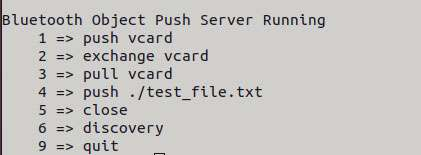

* Reception via Bluetooth

  ```shell
  cd /usr/src/rubikpi-btapp/  
  mkdir push
  ./app_ops  
  #Type 1 and press Enter  
  #Phone sends file via Bluetooth  
  #After transmission, type 9 and press Enter to quit. The transmitted file is located in the ./push folder
  ```

   

* Other demos

  All the BT-related source code is stored in the following directory of RUBIK Pi 3:
  */usr/src/rubikpi-bt-demo/3rdparty/3rdparty/embedded/bsa_examples/linux*. Compile and view the code as needed. The following example shows the compilation method:

  ```shell
  cd /usr/src/rubikpi-bt-demo/3rdparty/3rdparty/embedded/bsa_examples/linux/<test demo>/build/  
  export ARMGCC=gcc  
  make CPU=arm64  
  cp arm64/<demo executable file> /usr/src/rubikpi-btapp/  
  cd /usr/src/rubikpi-btapp/  
  #Run the demo
  ```

## Audio

RUBIK Pi 3 currently supports the following audio interfaces:

* 3.5mm headphone (No. 4 in the following figure)

* HDMI OUT (No. 9 in the following figure)

* Bluetooth


### View the sound card information

* Run the following command on RUBIK Pi 3 to view the mounted sound cards:

  ```shell
  cat /proc/asound/cards
  ```

   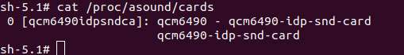

* Run the following command on RUBIK Pi 3 to view the list of allocated Pulse-Code Modulation (PCM) streams:

  ```shell
  cat /proc/asound/pcm
  ```

   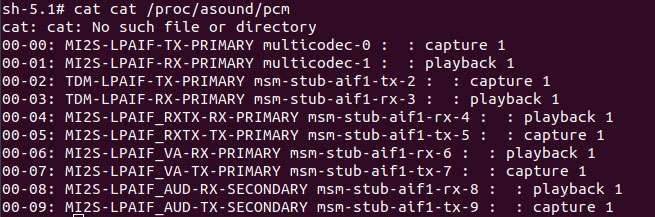

### Set the audio output device

Run the following commands on RUBIK Pi 3 to change the audio output source for commands such as gstreamer and paplay:

* Set the 3.5mm headset as the output interface:

  ```shell
  rubikpi_config audio output headset
  ```

  or

  ```shell
  pactl set-sink-port low-latency0 headset
  ```

* Set the HDMI OUT as the output interface:

  ```shell
  rubikpi_config audio output hdmi
  ```

  or

  ```shell
  pactl set-sink-port low-latency0 hdmi
  ```

### Playback

* Run the following command on RUBIK Pi 3 to test headset playback.&#x20;

  :::note
  
  Before running the following command, put the MP3 test file (*\<FileName>.mp3*) in the */opt/* directory.
  :::

  ```shell
  gst-launch-1.0 filesrc location=/opt/<FileName>.mp3 ! mpegaudioparse ! mpg123audiodec ! pulsesink
  ```

* Run the following command on RUBIK Pi 3 to test HDMI OUT playback.&#x20;

  :::note
  
  Before running the following command, put the PCM test file (*\<FileName>.wav*) in the */opt/* directory.
  :::

  ```shell
  systemctl stop pulseaudio  
  agmplay /opt/<FileName>.wav -D 100 -d 100 -r 48000 -b 16 -c 2 -i MI2S-LPAIF_RXTX-RX-PRIMARY  
  systemctl start pulseaudio
  ```

* Run the following commands on RUBIK Pi 3 to test Bluetooth playback. You need to open multiple terminals.

1. Terminal 1:

  ```shell
  cd /usr/src/rubikpi-btapp/  
  ./app_manager
  ```

  

2. Terminal 2:

  ```shell
  cd /usr/src/rubikpi-btapp/  
  ./app_av
  ```

   

         a. Type "2" and press **Enter**. Wait for the Bluetooth device to be found.

         b. Type "6" and press **Enter** to start establishing a connection.

         

         c. Type "1" and press **Enter** to connect to a recently scanned device.

         d. Type the dev number of the Bluetooth device you want to connect.


3. Go to Terminal 1 and type "13" to accept the pairing.

4. Go to Terminal 2, type "11", and press **Enter**. Select the number of the piece of music you want to play and press **Enter**.

### Recording

Run the following commands on RUBIK Pi 3 to test the recording function.

* Headset recording

  ```shell
  gst-launch-1.0 -v pulsesrc volume=10 ! audioconvert ! wavenc ! filesink location=/opt/test.wav
  ```

* Test the Bluetooth headset recording. You need to open multiple terminals.

1. Terminal 1:

  ```shell
  cd /usr/src/rubikpi-btapp/  
  ./app_manager
  ```

  

2. Terminal 2:

  ```shell
  cd /usr/src/rubikpi-btapp/  
  ./app_ag
  ```

  

     a. Type "1" and press **Enter**. Wait for the Bluetooth device to be found.

     b. Type "6" and press **Enter** to connect the Bluetooth headset.


  

     c. Type "1" and press **Enter** to connect to a recently scanned device.

     d. Type the dev number of the Bluetooth device you want to connect.

  

     e. Go to Terminal 1 and type "13" to accept the pairing.

     f. Go to Terminal 2 and type "8" to open the SCO link.

3. Go to terminal 3 and run the following commands to start recording:

  ```shell
    systemctl stop pulseaudio

    #Start recording audio from the Bluetooth headset microphone.
    agmcap /home/root/my.wav -D 100 -d 101 -r 16000 -b 16 -c 1 -i MI2S-LPAIF_VA-TX-PRIMARY -dkv 0xA3000003 -p 120 -n 2

    #Press CTRL+C to stop recording.

    systemctl start pulseaudio
  ```

    The recorded audio is located at */home/root/my.wav*.

### Volume up/down

* Adjust the headphone volume

  Run the following commands to obtain and set the volume:

  ```shell
      tinymix get "DAC Playback Volume"  
      
      tinymix set "DAC Playback Volume" 192 192
  ```

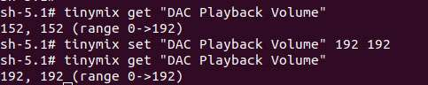

* Adjust the Bluetooth volume

  While playing Bluetooth audio, you can control the volume in terminal 2.

  1. Type 20

  2. Type 0

  3. Type the volume (from 0 to 100).


### Capture logs

* User space logs

  Perform the following operations to capture user space logs:

  ```shell
  cat /var/log/user.log
  ```

* Kernel audio driver logs

  To capture the kernel logs, please do the following:

  * &#x20;Kernel logs

    ```shell
    dmesg
    ```

  * Disable kernel logs in a specific file:

    ```shell
    echo –n “file <filename> -p” > /sys/kernel/debug/dynamic_debug/control
    ```

  * Dynamic kernel logs

    By default, dynamic logging is disabled. To enable it, add the `CONFIG_DYNAMIC_DEBUG` kernel configuration, then recompile and reflash the device.

    To enable audio dynamic kernel logs, perform the following steps:

    ```shell
    ssh root@ip-addr
    mount -o rw,remount /
    mount -t debugfs none /sys/kernel/debug
    echo –n “file <filename> +p” > /sys/kernel/debug/dynamic_debug/control
    ```

### Analyze the captured logs

View user space logs and kernel audio driver logs to learn about playback and recording use cases.

* Playback

  The following log snippet describes the information collected for the playback use case.

  ```shell
  //Open Low latency Playback stream. Details of each stream type can be found at sources/audio/opensource/arpal-lx/inc/PalDefs.h
  2022-04-28T18:02:08.748280+00:00 pulseaudio: pal_stream_open: 224: Enter, stream type:1

  //Verify the backend device, sample rate, bitwidth, channels etc
  2022-04-28T18:02:08.748627+00:00 pulseaudio: setDeviceMediaConfig: 1056: CODEC_DMA-LPAIF_WSA-RX-0 rate ch fmt data_fmt 48000 2 2 1

  //Start playback stream
  2022-04-28T18:02:08.751947+00:00 pulseaudio: pal_stream_start: 338: Enter. Stream handle 0xffff94001040K

  //Map the metadata with kvh2xml.h file for playback usecase details.
  2022-04-28T18:02:08.853157+00:00 pulseaudio: metadata_print: 82 key:0xa1000000, value:0xa100000e//PCM_LL_PLAYBACK
  2022-04-28T18:02:08.853395+00:00 pulseaudio: metadata_print: 82 key:0xab000000, value:0x1
  2022-04-28T18:02:08.853660+00:00 pulseaudio: metadata_print: 82 key:0xa2000000, value:0xa2000001//Speaker
  2022-04-28T18:02:08.853881+00:00 pulseaudio: metadata_print: 82 key:0xac000000, value:0xac000002//DEVICEPP_RX_AUDIO_MBDRC

  //Verify the graph opened for playback usecase
  2022-04-28T18:02:08.856934+00:00 pulseaudio: print_graph_alias: 2334 GKV Alias 142 | StreamRX_PCM_LL_Playback_DeviceRX_Speaker_Instance_Instance_1_DevicePP_Rx_Audio_MBDRC
  //graph_open called
  2022-04-28T18:02:08.859509+00:00 pulseaudio: graph_open: 709 graph_handle 0x47534c

  //Configure hardware endpoint module
  2022-04-28T18:02:08.864386+00:00 pulseaudio: configure_hw_ep_media_config: 636 entry mod tag c0000004 miid 43b1 mid 7001023
  2022-04-28T18:02:08.864495+00:00 pulseaudio: configure_hw_ep_media_config: 664 rate 48000 bw 16 ch 2, data_fmt 1
  2022-04-28T18:02:08.864603+00:00 pulseaudio: configure_hw_ep_media_config: 676 exit, ret 0

  //graph_start entry
  2022-04-28T18:02:08.867234+00:00 pulseaudio: graph_start: 899 entry graph_handle 0x47534c
  //Stream started
  2022-04-28T18:02:08.867864+00:00 pulseaudio: pal_stream_start: 387: Exit. status 0

  //graph_stop entry
  2022-04-28T18:02:25.037338+00:00 pulseaudio: graph_stop: 928 entry graph_handle 0x47534c
  //Stop the PAL stream once playback completes
  2022-04-28T18:02:25.039923+00:00 pulseaudio: pal_stream_stop: 441: Exit. status 0

  //graph_close entry
  2022-04-28T18:02:25.050944+00:00 pulseaudio: graph_close: 762 entry handle 0x47534c
  //Close the PAL stream
  2022-04-28T18:02:25.054510+00:00 pulseaudio: pal_stream_close: 322: Exit. status 0

  ```

* Recording

  The following log snippet describes the information collected for the recording use case.

  ```shell
  //Open Recording stream for PAL_STREAM_RAW. Details of stream type can be found at sources/audio/opensource/arpal-lx/inc/PalDefs.h
  Apr 29 09:23:11 pulseaudio[862]: pal_stream_open: 224: Enter, stream type:9

  //Verify the backend device, sample rate, bitwidth, channels etc
  Apr 29 09:23:11 pulseaudio[862]: setDeviceMediaConfig: 1056: CODEC_DMA-LPAIF_VA-TX-0 rate ch fmt data_fmt 48000 1 2 1

  //Start recording stream
  Apr 29 09:23:11 pulseaudio[862]: pal_stream_start: 338: Enter. Stream handle 0xffff6c001040K

  //graph_open entry
  Apr 29 09:23:11 pulseaudio[862]: graph_open: 709 graph_handle 0x47534c

  //Metadata details to identify the usecase
  Apr 29 09:23:11 pulseaudio[862]: metadata_print: 82 key:0xb1000000, value:0xb1000009//RAW_RECORD
  Apr 29 09:23:11 pulseaudio[862]: metadata_print: 82 key:0xa3000000, value:0xa3000004//HANDSETMIC

  //Verify the graph opened for recording usecase
  Apr 29 09:23:11 pulseaudio[862]: print_graph_alias: 2334 GKV Alias 29 | DeviceTX_Handset_Mic_StreamTX_RAW_Record

  //Configure hardware endpoint module
  Apr 29 09:23:11 pulseaudio[862]: configure_hw_ep_media_config: 636 entry mod tag c0000005 miid 43af mid 7001024
  Apr 29 09:23:11 pulseaudio[862]: configure_hw_ep_media_config: 664 rate 48000 bw 16 ch 1, data_fmt 1
  Apr 29 09:23:11 pulseaudio[862]: configure_hw_ep_media_config: 676 exit, ret 0

  //graph_start entry
  Apr 29 09:23:11 pulseaudio[862]: graph_start: 899 entry graph_handle 0x47534c
  //Stream recording started
  Apr 29 09:23:11 pulseaudio[862]: pal_stream_start: 387: Exit. status 0


  //graph_stop entry
  Apr 29 09:23:26 pulseaudio[862]: graph_stop: 928 entry graph_handle 0x47534c
  //Stop the PAL stream once user stops recording
  Apr 29 09:23:26 pulseaudio[862]: D: [regular2] pal-source.c: pal_stream_stop returned 0

  //Close the PAL stream
  Apr 29 09:23:26 pulseaudio[862]: pal_stream_close: 284: Enter. Stream handle :0xffff6c001040K
  //graph_close entry
  Apr 29 09:23:26 pulseaudio[862]: graph_close: 762 entry handle 0x47534c
  //Close the PAL stream
  Apr 29 09:23:26 pulseaudio[862]: pal_stream_close: 322: Exit. status 0

  ```

## Fan

RUBIK Pi 3 is compatible with the [Raspberry Pi Active Cooler.](https://www.raspberrypi.com/products/active-cooler/)

:::warning

When using RUBIK Pi 3 in high-load or high-performance scenarios, use cooling measures to ensure that the performance of the device is stable. Otherwise, performance may fluctuate due to high CPU temperatures.
:::

### Install the fan

1. **Remove all the thermal pads on the back of the cooler**.**&#x20;**&#x43;ut the following two pads in the shape of SoC and uMCP of RUBIK Pi 3.

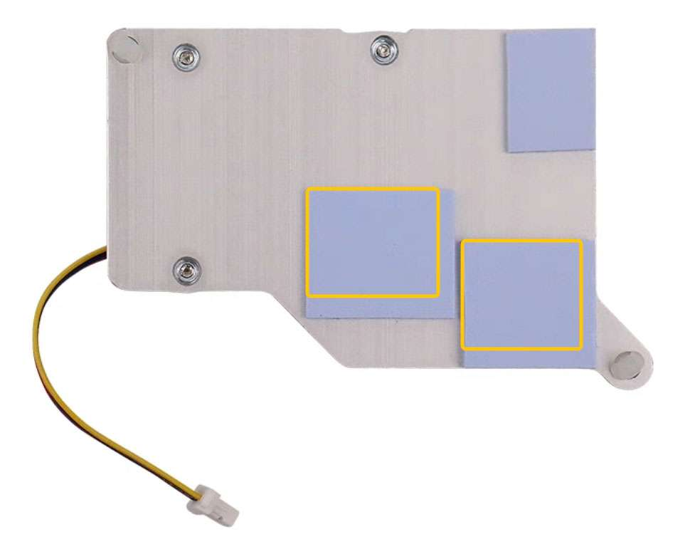

The dimensions of the two pieces are about 14 x 12mm and 13 x 11.5mm.


2. Paste the two thermal pads to the corresponding positions on RUBIK Pi 3.


3. Install the cooler and connect the fan cable.

   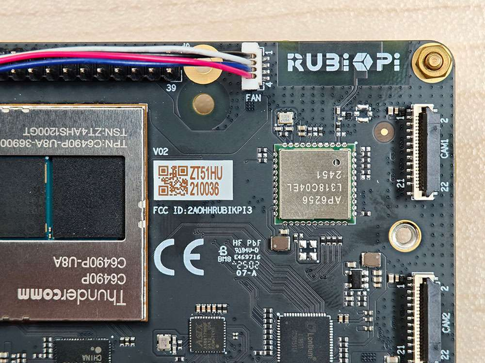

:::warning

 We recommend that you do not remove the fan after installing it on your RUBIK Pi 3. Removal will cause the fan's push pins and thermal pads to degrade and may result in product damage. If the push pins are damaged or deformed or if they do not clip securely, stop using the fan.
 :::

### Control the fan

The fan of RUBIK Pi 3 controls the speed according to the CPU temperature. You can also run the following commands on RUBIK Pi 3 to control the fan speed. 0 and 255 indicate the minimum and maximum speed of the fan respectively.

```shell
rubikpi_config fan speed 100
rubikpi_config fan speed 255
rubikpi_config fan speed 0
```

or

```shell
echo 100 > /sys/class/hwmon/hwmon29/pwm1
echo 255 > /sys/class/hwmon/hwmon29/pwm1
echo 0 > /sys/class/hwmon/hwmon29/pwm1
```

:::note

Before setting the fan speed to a fixed value, disable CPU thermal management using the `rubikpi_config thermal disable` command.
:::

## LED

RUBIK Pi 3 features an RGB tri-color LED driven by the Power Management IC (PMIC). By default, the green LED is set as a heartbeat indicator to reflect the system's operation status and CPU load.&#x20;

LED indicator descriptions:

* Blue LED (solid on): fastboot mode

* Green LED (heartbeat blinking): normal operation

* Red LED (heartbeat blinking): low-power mode (power input is less than 12V 2.25A).

* Rapid heartbeat: high CPU load

* No heartbeat:

  * System crash

  * Sleep mode

  * Booting up

Use the following commands to operate the LED:

* Turn off the heartbeat LED

  ```shell
  rubikpi_config led heartbeat off
  ```

  or

  ```shell
  echo none > /sys/class/leds/green/trigger 
  ```

* Turn on the heartbeat LED

  ```shell
  rubikpi_config led heartbeat on
  ```

  or

  ```shell
  echo heartbeat > /sys/class/leds/green/trigger
  ```

* Set the brightness of the green LED (from 0 to 511. The following example sets it to 100)

  ```shell
  rubikpi_config led green 100
  ```

  or

  ```shell
  echo 100 >  /sys/class/leds/green/brightness
  ```

* Set the brightness of the red LED (from 0 to 511. The following example sets it to 100)

  ```shell
  rubikpi_config led red 100
  ```

  or

  ```shell
  echo 100 >  /sys/class/leds/red/brightness
  ```

* Set the brightness of the blue LED (from 0 to 511. The following example sets it to 100)

  ```shell
  rubikpi_config led blue 100
  ```

  or

  ```shell
  echo 100 >  /sys/class/leds/blue/brightness
  ```

## Ethernet

Ethernet technology is designed to transmit data over a channel using wired technology at different link speeds. It uses cables to transmit data in network models, such as Local Area Network (LAN) and Wide Area Network (WAN) for a reliable, secure, and better network connectivity.

Ethernet connectivity is integrated into IoT devices and sensors, enabling them to transmit data to the network. It is defined under IEEE 802.3 standards and provides a standardized interface for these devices to communicate with gateways.

The Ethernet interface is port 8 in the following figure. RUBIK Pi 3 supports Gigabit Ethernet.


Connect the network cable, as shown in the following figure:

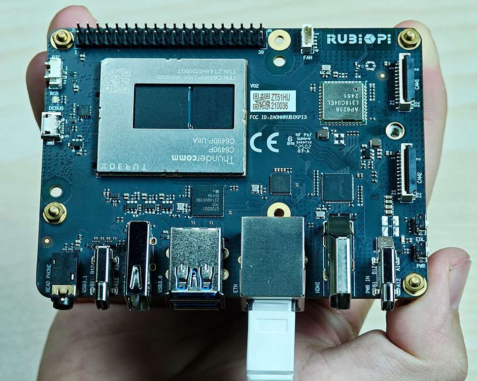

Run the following command on RUBIK Pi 3 to check the network connection. As shown in the following figure, the IP address has been successfully assigned, indicating that the network connection is successful:

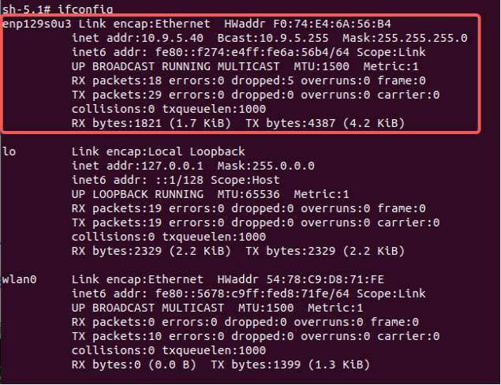

### Ethernet debugging

Use the following types of logs to record and debug Ethernet-related issues.

* `dmesg`: Debug issues related to kernel drivers.

* `tcpdump`: Verify packet transmission.

To debug potential issues that may occur during Ethernet setup, perform the following steps:

1. To collect `dmesg` logs and debug issues related to the kernel driver, run the following command:

   ```shell
   dmesg > /var/log/dmesg_logs.txt
   ```

2. To collect `tcpdump` logs and verify packet transmission, run the following command:

   ```shell
   tcpdump -i any -s 0 -w /var/log/tcpdump.pcap
   ```

3. Collect the output from the `ethtool`, `ifconfig`, `netstat`, and IP routing table for debugging.

## RTC battery connector

The real-time clock (RTC) battery connector is port 1 in the following figure.


Connect the RTC battery as shown in the following figure and write the time into the system hardware clock of RUBIK Pi 3. This way, the system time of RUBIK Pi 3 can be saved even if it is completely powered off.

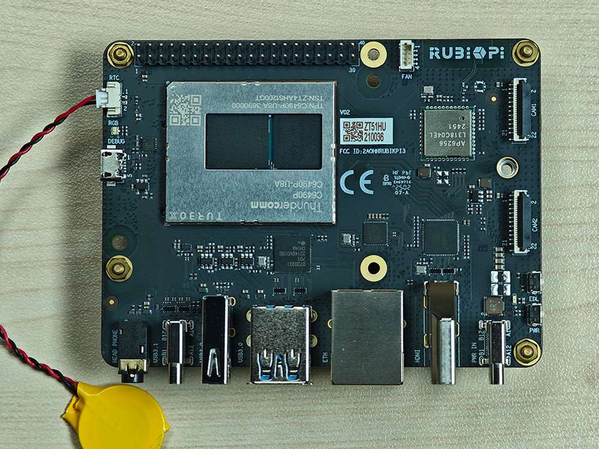

Write the system time to the system hardware clock on RUBIK Pi 3 as follows:

```shell
date -s "08:00:00 20241201" # Set system time to 08:00, December 1, 2024
hwclock -w # Write system time to system hardware clock
```

## M.2 Key M connector

RUBIK Pi 3 provides an M.2 slot for NVMe storage, which can be used to install a 2280 (22 x 80mm) SSD hard drive. The M.2 Key M slot supports PCIe Gen3 x 2 and can deliver an output of up to 3.3V 2A. The switch of the M.2 connector can be individually controlled.

The M.2 Key M connector uses the PCIe1 bus of the QCS6490. The device path is: */sys/bus/pci/devices/0001:00:00.0*.&#x20;

The M.2 Key M connector is connector 18 in the following figure:


The M.2 Key M connector is compatible with the 2280 SSD, as shown in the following figures:


At present, RUBIK Pi 3 does not support the automatic mounting of SSDs. Run the following commands on RUBIK Pi 3 to mount SSDs manually.

```shell
mkdir /opt/ssd
mount /dev/nvme0n1 /opt/ssd
```


### PCIe power management

PCIe defines two types of power management methods:

* Software power management, which determines the power management features for each device and manages them individually.

* Systems that do not require software intervention, such as Active State Power Management (ASPM).

When no data packets are being transmitted on the PCIe link, the device puts the PCIe link into a low-power state.

#### PCIe L0 link states

PCIe power management defines the following L0 link states:

* L0: working state

* L0s: ASPM state with low-resume latency (energy saving standby state)&#x20;

#### PCIe device states

PCIe power management defines the following device states:

* D0 (mandatory): The device is fully ON. There are two sub-states.

  * D0(uninitialized): The function is in D0 (uninitialized) state when waiting for enumeration and configuration after exiting the reset state.

  * D0(active)

    * The function enters the D0(active) state once the enumeration and configuration process is completed.

    * The function enters the D0(active) state when the system software enables one or more (in any combination) function parameters, such as memory space enable, I/O space enable, or BME bits.

* D1 (optional): light sleep state

  * The function can only initiate the PME message and cannot initiate other TLPs.

  * The function can only serve as the target for configuration transactions, not for other transactions.

  * The function enters the D1 state via a software command that sets the PM control and status registers.

* D2 (optional): deep sleep state

  * The function can only issue PME messages and cannot issue other TLPs.

  * The function can only serve as the target for configuration transactions, not for other transactions.

  * The function enters the D2 state via software commands that set the PM control and status registers.

* D3 (mandatory): The device is in the lowest power state, and this function must support two types of D3 states:

* D3(hot)

  * The function can only issue PME messages and cannot issue other TLPs.

  * The function can only serve as the target for configuration transactions, not for other transactions.

  * The function enters D3(hot) state by issuing a software command that sets the power state field.

* D3(cold): The device enters the D3(cold) state and is powered off. When power is restored, the device enters the D0(uninitialized) state.

### PCIe debugging

The M.2 Key M connector uses the PCIe1 bus of the QCS6490. The device path is: */sys/bus/pci/devices/0001:00:00.0*.&#x20;

The `lspci` and `setpci` commands are native to Linux distributions. These two commands provide multiple levels of output and can also be used to view the capabilities and states of different components trained on the PCI bus at a given time. Most of these capabilities reflect the configuration space registers required by the PCIe basic specification. For more detailed information, visit https://pcisig.com/specifications. To view the usage instructions, run the following command:

```shell
lspci --help
```

The following features help in debugging PCIe issues:

* Display device information.

  ```shell
  lspci
  ```

  Sample output:

  ```shell
  0000:00:00.0 PCI bridge: Qualcomm Device 010b
  0000:01:00.0 USB controller: Renesas Technology Corp. uPD720201 USB 3.0 Host Controller (rev 03)
  0001:00:00.0 PCI bridge: Qualcomm Device 010b
  ```

* Show PCIe device and vendor IDs in the device control registers.

  ```shell
  lspci -nvmm
  ```

  Sample output

  ```shell
  Slot:        00:00.0
  Class:        0604
  Vendor:        17cb
  Device:        010b
  IOMMUGroup:        6

  Slot:        01:00.0
  Class:        0c03
  Vendor:        1912
  Device:        0014
  Rev:        03
  ProgIf:        30
  IOMMUGroup:        6

  Slot:        0001:00:00.0
  Class:        0604
  Vendor:        17cb
  Device:        010b
  DTNode:        /sys/firmware/devicetree/base/soc@0/pci@1c08000/pcie@1
  IOMMUGroup:        7

  ```
