---
# Display h2 to h5 headings
toc_min_heading_level: 2
toc_max_heading_level: 4
custom_edit_url: https://github.com/rubikpi-ai/documentation/blob/main/docs-en/docs/rubik-pi-3-user-manual/1.1.2/1.get-started.md
---

import Tabs from '@theme/Tabs';
import TabItem from '@theme/TabItem';

# Get Started

## Introduction

RUBIK Pi 3 is developed based on the Qualcomm QCS6490 processor, which features the Qualcomm® Kryo™ 670 CPU and the Qualcomm® Hexagon™ Processor with fused AI-accelerator architecture. The processor provides exceptional AI performance of 12 TOPS and offers the capability for various machine learning and AI application scenarios.

RUBIK Pi 3 is designed with a wide range of interfaces and functions, such as USB, camera, DisplayPort, HDMI, Ethernet, 3.5mm headphone jack, Wi-Fi, Bluetooth, M.2 connector, fan, RTC, and 40-pin LS connector. These features cater to diverse development needs while facilitating rapid development and efficient debugging.&#x20;

RUBIK Pi 3 is compatible with various systems, such as Qualcomm Linux, Debian 13, Android 13, and Canonical Ubuntu for Qualcomm Platforms\*, providing developers with the flexibility to meet their specific application needs.

\*Canonical Ubuntu for Qualcomm Platforms is in the planning phase.


## Specifications

| **Category**      | **RUBIK Pi 3 Feature**                                                        |
| ----------------- | ----------------------------------------------------------------------------- |
| SoC               | QCS6490                                                                       |
| Processor         | <p>1 x Cortex-A78 2.7 GHz</p><p>3 x Cortex-A78 2.4 GHz</p><p>4 x Cortex-A55 1.9 GHz</p>          |
| GPU               | Adreno 643 GPU @ Up to 812 MHz                                                |
| VPU               | Adreno 633 VPU                                                                |
| NPU               | 12 TOPS                                                                       |
| ISP               | Spectra ISP capable of on-device machine learning and machine processing      |
| RAM               | 8 GB LPDDR4x                                                                  |
| ROM               | 128 GB UFS 2.2                                                                |
| Wi-Fi & Bluetooth | Wi-Fi 5 and Bluetooth 5.2                                                     |
| Camera            | 2 x 4-lane MIPI CSI D-PHY connector                                           |
| USB               | <p>1 x USB Type-C (USB 3.1 Gen1)</p><p>2 x USB Type-A (USB 3.0)</p><p>1 x USB Type-A (USB 2.0)</p> |
| GPIO              | 28 GPIO pins                                                                  |
| Ethernet          | 1000M                                                                         |
| M.2 connector     | M.2 Key M 2280 (2-lane PCIe 3.0)                                              |
| Audio             | 3.5mm headphone jack                                                          |

## Preparations

* Computer running Windows 10 and later, or Ubuntu 18 – Ubuntu 22

* RUBIK Pi 3

* USB Type-A to Type-C cable

* USB Type-A to Micro USB cable

* Power supply (12V 3A Type-C)

:::danger[Warning:]

- Do not use a desktop or laptop computer to power your RUBIK Pi 3. This may cause damage to both the computer and the RUBIK Pi 3.
- Any external power supply used with the RUBIK Pi must comply with all applicable local laws and regulations.
- A **12 V DC power supply rated at ≥ 3 A** is required. The power supply should feature overcurrent, overvoltage, and surge protection.

:::

### Download images

RUBIK Pi 3 comes with a pre-installed Linux image (not the latest version) for a quick out-of-the-box experience. If you need the latest version of the Linux image or other operating system images, please visit the [RUBIK Pi 3 official website](https://www.thundercomm.com/rubik-pi-3/en/docs/image/) to download.

Visit [GitHub](https://github.com/rubikpi-ai) to download the Linux source code as needed.

We provide the following images:

* Qualcomm Linux is a simplified desktop system based on Weston. It is suitable for developers who have Linux development experience and seek an in-depth development experience.

  

* Debian 13: Based on GNOME 48, Debian 13 offers a complete set of system features, a rich software package library, more desktop applications, an enhanced user experience, and abundant development resources, making it ideal for developers who prioritize development convenience.

  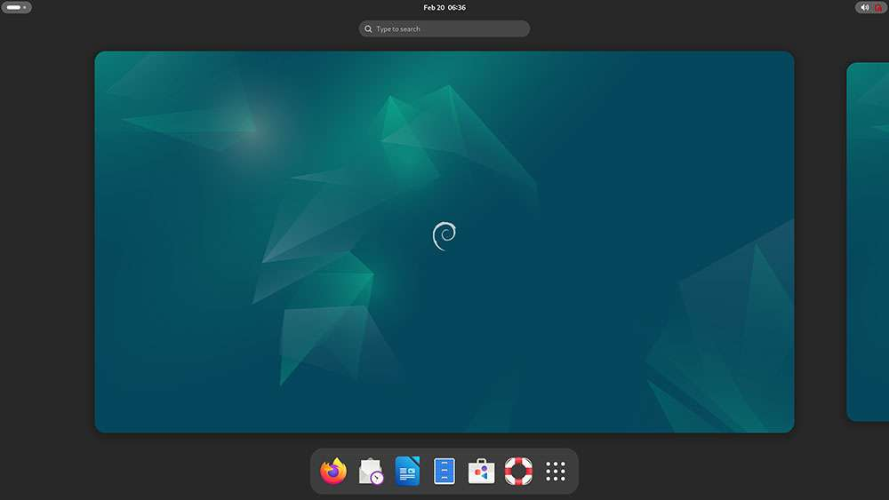

* Android 13 is an enhanced system based on Google AOSP, offering an improved experience for developers working on Android applications.

  

### Download QDL

Qualcomm Device Loader (QDL) is a flashing tool that allows you to flash images to RUBIK Pi 3.

[Click here to download](https://softwarecenter.qualcomm.com/api/download/software/tools/Qualcomm_Device_Loader/All/2.3.4/Qualcomm_Device_Loader.Core.2.3.4.All-AnyCPU-qdl_2.3.4.zip) QDL and decompress the package you download. The package contains the following files. QDL supports multiple platforms and architectures. For instructions on how to use QDL, refer to *QDL_User_Guide.pdf*.


<a id="flashimages"></a>
### Flash images


Before flashing images, enter flash mode (9008 mode) using one of the following methods:

:::warning

* Do not touch the PCB components and metal contacts with your bare hands.

* Before operation, discharge static electricity using grounding equipment (e.g., anti-static workstation/wrist strap).

* Do not place the circuit board directly on conductive surfaces (such as metal tables or ungrounded chassis).
:::

<Tabs>
<TabItem value="method1" label="Method 1">

1. Press and hold the **\[EDL]** button (No. 12 in the figure above).

    

2. Connect the power supply into port 10, as shown in the figure below.&#x20;

    

3. Insert the Type-C cable into port 5 and wait three seconds to enter 9008 mode.

   
</TabItem>
<TabItem value="method2" label="Method 2">
1. Connect the power supply into port 10.

   

2. Insert the Type-C cable into port 5.

   

3) After RUBIK Pi 3 boots up, run the following command to enter 9008 mode.

   ```shell
   adb shell reboot edl
   ```
</TabItem>
</Tabs>
#### Flash images on a Windows system

<a id="flashwin"></a>

1. Install the WinUSB driver. (If you have installed it, skip this step.)
 
   1. Uninstall other drivers for this device. Make sure that Qualcomm USB drivers and similar drivers are not installed. 

     * The device should not appear under the COM ports in Device Manager. If you see the device under the COM ports, follow the instructions to uninstall QUD.  

     

     * Ensure that **Delete the driver software for this device** is checked.

     

   2. Power off the device and re-enter the flashing mode. Follow the instructions below to install Microsoft WinUSB.

     * In Device Manager, right-click the USB port of RUBIK Pi 3 and select **Update driver.**

     

     * In the pop-up window, choose the **Browse my computer for driver software** option.

     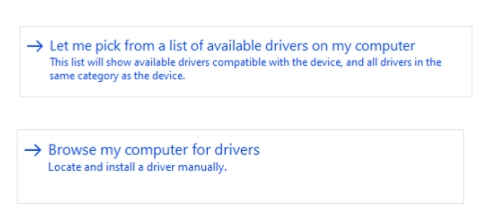

     * Under USB devices, select **WinUsb Device**.

     

     * Click **Yes** to update the driver.

     

2. In the terminal, use the following command to run the QDL executable from either the *QDL_Win_x64* or *QDL_Win_ARM64* directory based on your host architecture to flash the image. Once the flashing process is complete, the device will automatically reboot.

:::note
>
> The program file name does not support wildcards. Each image file must be listed in the command explicitly.

>
> Replace `<pathToQDL>` with the actual location of the *QDL_Win_x64* or *QDL_Win_ARM64* directory.
:::

```shell
<pathToQDL>\QDL.exe prog_firehose_ddr.elf rawprogram0.xml rawprogram1.xml rawprogram2.xml rawprogram3.xml rawprogram4.xml rawprogram5.xml rawprogram6.xml patch0.xml patch1.xml patch2.xml patch3.xml patch4.xml patch5.xml patch6.xml
```


3. If your RUBIK Pi 3 fails to boot up after flashing, enter the *provision* directory in the FlatBuild package and run the following command to try provisioning UFS. 
:::warning
>
> After provisioning, some information stored in the UFS, such as the SN and Ethernet MAC address, may be lost.
>
> Replace `<pathToQDL>` with the actual location of the *QDL_Win_ARM64* or *QDL_Win_x64* directory.
:::

```shell
<pathToQDL>\QDL.exe prog_firehose_ddr.elf provision_ufs_1_3.xml
```

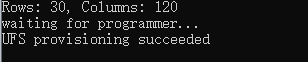

:::warning
>
> After provisioning, remove and plug in the power supply and USB cable to restart your RUBIK Pi 3 and proceed with the image flashing again.
:::

#### Flash images on an Ubuntu system

1. Run the following command to install libusb, libxml2 (If you have installed them, skip this step.)

```shell
sudo apt-get install libxml2-dev libudev-dev libusb-1.0-0-dev
```

2. Go to the *ufs* directory of the FlatBuild package.

3. Copy the *qdl* file from the *QDL_Linux_x64* or *QDL_Linux_ARM* directory to the *ufs* directory, depending on your host architecture.

4. Run the following command to flash the image.

```shell
./qdl --storage ufs prog_firehose_ddr.elf rawprogram*.xml patch*.xml
```


5. If your RUBIK Pi 3 fails to boot up after flashing, enter the *provision* directory in the FlatBuild package and run the following command to try provisioning UFS.
:::warning
>
> After provisioning, some information stored in the UFS, such as the SN and Ethernet MAC address, may be lost.
>
> Before running the following command, copy the *qdl* file from the *QDL_Linux_x64* or *QDL_Linux_ARM* directory to the *provision* directory, depending on your host architecture.
:::

```shell
./qdl prog_firehose_ddr.elf provision_ufs_1_3.xml
```


:::warning
>
> After provisioning, remove and plug in the power supply and USB cable to restart your RUBIK Pi 3 and proceed with the image flashing again.
:::

#### Flash images on a Mac system
1. Run the following command to install Homebrew (if you have installed it, skip this step).

```shell
/bin/bash -c "$(curl -fsSL https://raw.githubusercontent.com/Homebrew/install/HEAD/install.sh)"
```

2. Run the following commands to install libusb and libxml2.

```shell
brew install libusb
brew install libxml2
```

3. Go to the *ufs* directory of the FlatBuild package.

4. Copy the contents from the *QDL_Mac_x64* or *QDL_Mac_ARM* directory to the *ufs* directory, depending on your host architecture.

5. Run the following command to flash the image.
   
```shell
./qdl --storage ufs prog_firehose_ddr.elf rawprogram*.xml patch*.xml
```


6. If your RUBIK Pi 3 fails to boot up after flashing, enter the *provision* directory in the FlatBuild package and run the following command to try provisioning UFS.
   
:::warning
>
> After provisioning, some information stored in the UFS, such as the SN and Ethernet MAC address, may be lost.
>
> Before running the following command, copy the *qdl* file from the *QDL_Linux_x64* or *QDL_Linux_ARM* directory to the *provision* directory, depending on your host architecture.
:::

```shell
./qdl prog_firehose_ddr.elf provision_ufs_1_3.xml
```


:::warning
>
> After provisioning, remove and plug in the power supply and USB cable to restart your RUBIK Pi 3 and proceed with the image flashing again.
:::

## Power-on

For older board versions, connect the power supply and press the **\[PWR]** button to power on your RUBIK Pi 3. Board versions v02 and later support automatic power-on.

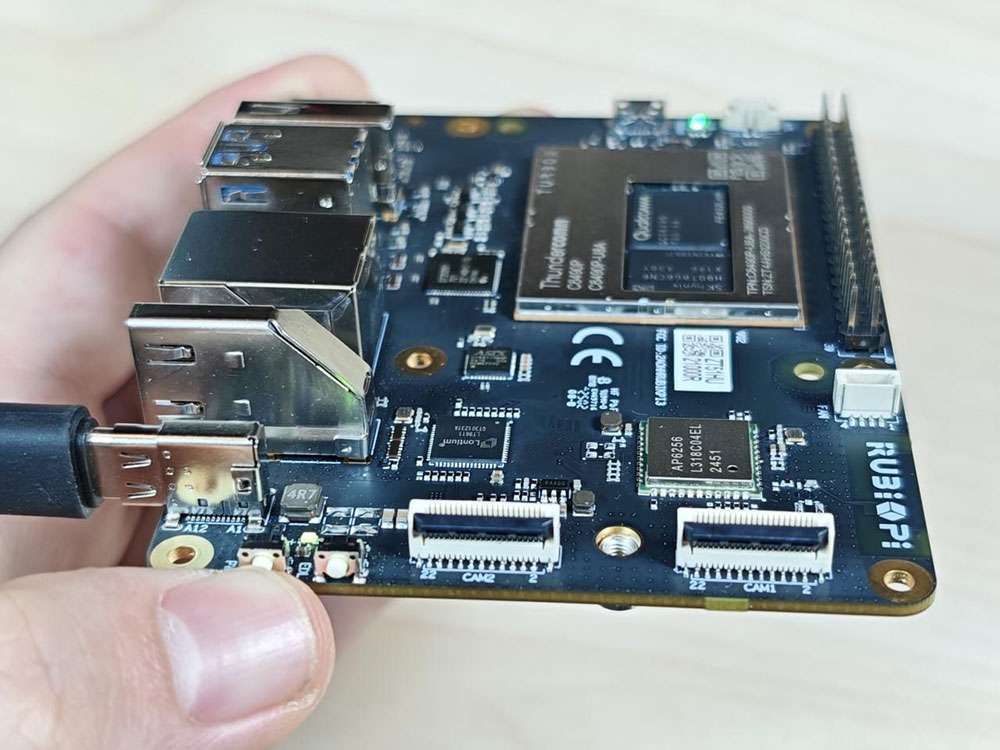

## Power-off

Run the `poweroff` command to power off your RUBIK Pi 3.


## Reboot

* Run the `reboot` command to reboot your RUBIK Pi 3.

    

* Press and hold the **\[PWR]** button for 12 seconds to reboot your RUBIK Pi 3.

  

## UART login

### Windows

1. Connect port 2 in the following figure to a computer via a UART interface.

   

2. Open the computer settings page, check the corresponding COM port in Device Manager, and record the port.

   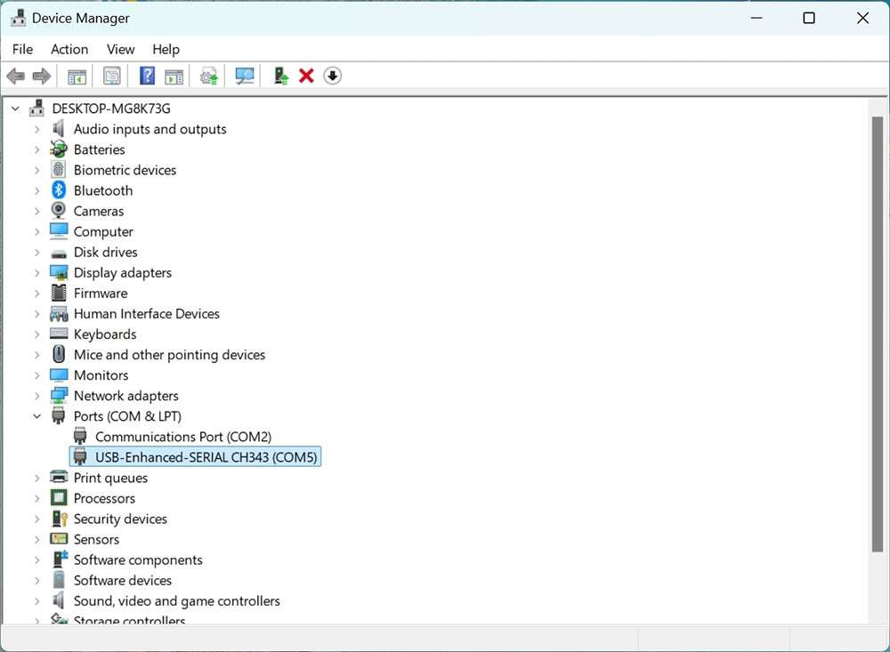

3) Download MobaXterm at https://mobaxterm.mobatek.net/ and decompress it.

   

4) Open MobaXterm, select **Session** > **Serial**, and set the baud rate of the serial port to 115200.

   

   

5. Click **OK**. Press **Enter** and type your login name and the default login password to log in:

   <p>Login account: root</p>
   <p>Login password: rubikpi</p>
   
   :::tip
   You can run the `passwd` command to change the default password. For example: `passwd root`.
   :::

  

### Ubuntu

1. Connect port 2 in the following figure to a computer via a serial cable.

   

2. Run the following commands to install minicom:

   ```shell
   sudo apt update  
   sudo apt install minicom
   ```

3) Run the following command to check the USB port:

   ```shell
   ls /dev/ttyACM*
   ```

    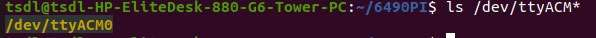

4. Run the following command to open minicom. Press **Enter** and type your login name and the default login password to log in:

   ```shell
   sudo minicom -D /dev/ttyACM0 -b 115200
   ```

   <p>Login account: root</p>
   Login password: rubikpi

   :::note
   You can run the `passwd` command to change the default password. For example: `passwd root`.
   :::

    

## ADB login

### Windows

#### Preparations

1. Download the ADB and Fastboot installation package at https://developer.android.google.cn/tools/releases/platform-tools and decompress the package.

    

2. Right-click **This PC** and choose **Properties**. Click **Advanced** and click **Environment Variables**. Alternatively, right-click **This PC** and choose **Properties**. In the search bar, type **Advanced system settings** and click **Environment Variables**.

    

3. Under **System variables**, select **Path** and click **Edit**.

  

4. Click **New** and type the path of decompressed platform-tools in Step 1. Click **OK** to save the environment variable.

    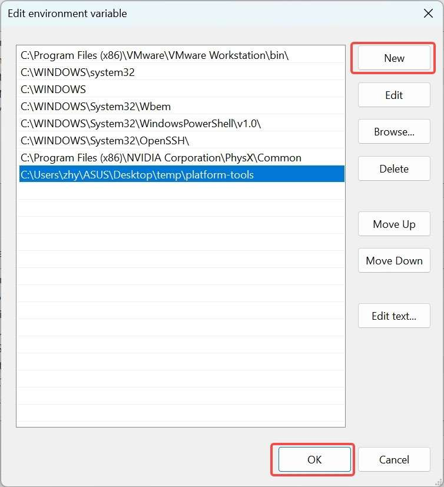

#### ADB login

Press **Win**+**R** and type "cmd" to open the Windows terminal. Run the following commands to log in to your RUBIK Pi 3:

```shell
adb devices # Check if devices are connected  
adb root    # Log in as root user  
adb shell   # Open the adb terminal
```


### Ubuntu

#### Preparations

1. Run the following command to install the ADB and Fastboot tools:

   ```shell
   sudo apt install git android-tools-adb android-tools-fastboot wget
   ```

2. Update the udev rules file.

   1. Run the following command to open and modify the *51-qcom-usb.rules* file.

      ```shell
      sudo vi /etc/udev/rules.d/51-qcom-usb.rules
      ```

   2. Add the following content to the file. If the following content already exists, skip this step.

      ```shell
      SUBSYSTEMS=="usb", ATTRS{idVendor}=="05c6", ATTRS{idProduct}=="9008", MODE="0666", GROUP="plugdev"
      ```

   3. Run the following command to restart `udev`.

      ```shell
      sudo systemctl restart udev
      ```

    :::note
    If your RUBIK Pi 3 is already connected to the PC via USB, unplug and replug the USB cable so that the updated rules can take effect.
    :::

#### ADB login

Run the following commands in the terminal to log in to your RUBIK Pi 3:

```shell
adb devices # Check if devices are connected  
adb root    # Log in as root user  
adb shell   # Open the adb terminal
```

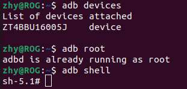

## SSH login

### Windows

1. Ping the RUBIK Pi 3 IP address.

   1. Obtain the IP address.

      * Log in to the backend of the router or use other IP scanning software to obtain the IP address of RUBIK Pi 3.

      * Log in to RUBIK Pi 3 via ADB and run the `ifconfig` command to obtain the IP address.

        :::note
        
        The IP address may change depending on the network environment, and the device name of RUBIK Pi 3 is "rubikpi".
        :::

   2. Press **Win**+**R**, type "cmd" in the pop-up window, and click **OK**.

    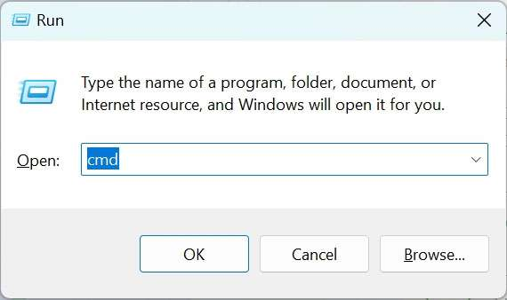
      
   3. Run the `ping <IP>` command in the terminal. For example, the IP address of RUBIK Pi 3 is 10.9.5.59, run the following command and view the execution result.
    ```
    ping 10.9.5.59
    ```
    


2. SSH login.

     1. Open MobaXterm.

    

    2. Click **Session** and select SSH in the pop-up window.

    

    3. Type the IP address of the RUBIK Pi 3 you want to log in to and click **OK**.

    

   4. Type the username, press **Enter**, type the password, and press **Enter** to log in to RUBIK Pi 3.

    

   5. The following information indicates that the login is successful. 
    


### Ubuntu

1. Confirm the network connection.

   1. Obtain the RUBIK Pi 3 IP address.

      * Log in to the backend of the router or use other IP scanning software to obtain the IP address of RUBIK Pi 3.

      * Log in to RUBIK Pi 3 via ADB and run the `ifconfig` command to obtain the IP address.

        :::note
        
         The IP address may change depending on the network environment, and the device name of RUBIK Pi 3 is "rubikpi".
         :::

   2. Run the `ping <IP>` command in the Ubuntu terminal. For example, the IP address of RUBIK Pi 3 is 10.9.5.59, run the following command and view the execution result.

      ```shell
      ping 10.9.5.59
      ```

       

* SSH login.

  1. Type the `ssh <user>@<IP>` command in the Ubuntu terminal and press **Enter**, as shown in the following figure. `root` indicates the role you want to log in as. `10.9.5.59` indicates the IP address of RUBIK Pi 3.

     ```shell
     ssh root@10.9.5.59
     ```

  2. Type the password and press **Enter**. The login succeeds.

     

## File transfer

### ADB

* In the PC terminal, run the following command to upload the *test.txt* file to the */opt* directory:

  ```shell
  adb push test.txt /opt
  ```

* In the PC terminal, run the following command to download the *test.txt* file to your current directory:

  ```shell
  adb pull /opt/test.txt ./
  ```

### SCP

To use Secure Copy Protocol (SCP) transfer, ensure your RUBIK Pi 3 is connected to the network. For example, if the IP address of RUBIK Pi 3 is 10.9.5.59, run the following commands:

:::tip

Run the `ifconfig` command on RUBIK Pi 3 to obtain its IP address.
:::


* In the PC terminal, run the following command to upload the *test.txt* file to the */opt* directory:

  ```shell
  scp test.txt root@10.9.5.59:/opt
  ```

* In the PC terminal, run the following command to download the *test.txt* file to your current directory:

  ```shell
  scp root@10.9.5.59:/opt/test.txt ./
  ```

## Set up the Ubuntu development environment

### Install software

1. In the Ubuntu terminal, use the following command to install the necessary packages and prepare the host environment for development:

   ```shell
   sudo apt update
   sudo apt install repo gawk wget git diffstat unzip texinfo gcc build-essential chrpath socat cpio python3 python3-pip python3-pexpect xz-utils debianutils iputils-ping python3-git python3-jinja2 libegl1-mesa libsdl1.2-dev pylint xterm python3-subunit mesa-common-dev zstd liblz4-tool locales tar python-is-python3 file libxml-opml-simplegen-perl vim whiptail bc
   sudo apt install lib32stdc++6 libncurses5 checkinstall libreadline-dev libncursesw5-dev libssl-dev libsqlite3-dev tk-dev libgdbm-dev libc6-dev libbz2-dev libffi-dev curl git-lfs libncurses5-dev libncursesw5-dev
   ```

2. Run the following commands in the Ubuntu terminal to install Python 3.10.2. In the [Linux kernel packaging](./1.get-started.md#linuxkernelpack) process, the `python3.10` command is used. If you have installed Python 3.10.2 or later, skip this step.

   ```shell
   python --version
   # Download it in a directory of your choice
   wget https://www.python.org/ftp/python/3.10.2/Python-3.10.2.tgz
   tar -xvf Python-3.10.2.tgz
   cd Python-3.10.2
   ./configure --enable-optimizations
   make
   sudo make install
   ```

3) Run the following command in the Ubuntu terminal to install pefile.

   ```shell
   sudo pip3.10 install pefile
   ```

<a id="Installcross-compilationtools"></a>
### Install cross-compilation tools

1. On the Ubuntu host, visit the [RUBIK Pi official website](https://www.thundercomm.com/rubik-pi-3/en/docs/image) to download the cross-compilation toolchain for RUBIK Pi 3, then run the following command to decompress it.

   ```shell
   unzip toolchains_V1.1.0.zip
   ```

   :::note
   
   The cross-compilation tool is an eSDK built using the Yocto Project. The eSDK is a software package generated from the Qualcomm Linux image. It is installed on an Ubuntu host and provides a Yocto-based environment for application development.
   
   For details about eSDK compilation, refer to the [Yocto Project User Guide](./10.yocto-project-user-guide.md#chap10) section.
   :::
2. Run the following commands in the Ubuntu terminal to install the cross-compilation toolchain.

   ```shell
   cd toolchains
   chmod 755 qcom-wayland-x86_64-qcom-multimedia-image-armv8-2a-qcm6490-idp-toolchain-ext-1.3-ver.1.1.sh
   sh qcom-wayland-x86_64-qcom-multimedia-image-armv8-2a-qcm6490-idp-toolchain-ext-1.3-ver.1.1.sh
   ```

3) Follow the prompts to install the cross-compilation environment, type the absolute path to the installation directory, and type "Y".

   

4) After the installation is completed, go to the installation directory and run the following command to set up the cross-compilation environment.

   ```shell
   source environment-setup-armv8-2a-qcom-linux
   ```

   :::note
   
   The cross-compilation environment is only effective on the current terminal.
   :::

   If the following error occurs, type the `unset LD_LIBRARY_PATH` command and run the above command again.

   

5) Run the following command in the Ubuntu terminal to check the version of the gcc toolchain. If the output is as follows, it indicates that the cross-compilation environment is set up successfully.

   ```shell
   aarch64-qcom-linux-gcc -v 
   ```

   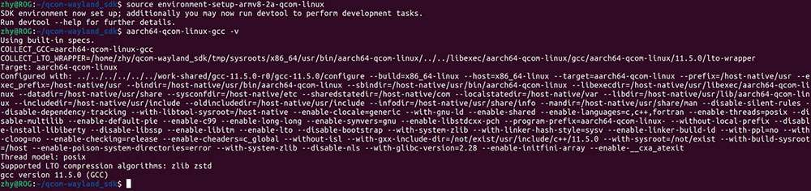

<a id="usecrosstool"></a>
### Use the cross-compilation tools

After setting up the cross-compilation environment by using the `source environment-setup-armv8-2a-qcom-linux` command as described in the previous section, use the following method to cross-compile the executable program of RUBIK Pi 3.

#### Build the project using Makefile

The header file path *sysroot* must be set for cross-compilation. Use the `--sysroot=dir` parameter to specify the path.

```shell
aarch64-qcom-linux-gcc --sysroot=/home/zhy/rubikpi/sdk/sysroots/armv8-2a-qcom-linux
```

:::note

 In the above command, the cross-compilation toolchain is installed at the */home/zhy/rubikpi/sdk* directory of the PC. Change the directory to your actual installation directory.
:::
#### Build the project using CMake

The following is an example of using *aarch64.cmake&#x20;*&#x74;o set the compilation toolchain:

```cmake
set(CMAKE_SYSTEM_NAME Linux)
set(CMAKE_SYSTEM_PROCESSOR arm64) #Set the target processor architecture

#Set sysroot
set(TOOLCHAIN_DIR /home/zhy/rubikpi/sdk/sysroots/armv8-2a-qcom-linux)
set(CMAKE_SYSROOT ${TOOLCHAIN_DIR}/sysroots/armv8-2a-qcom-linux)

#Set the cross-compiler
SET(CMAKE_C_COMPILER ${TOOLCHAIN_DIR}/sysroots/x86_64-qcomsdk-linux/usr/bin/aarch64-qcom-linux/aarch64-qcom-linux-gcc)
SET(CMAKE_CXX_COMPILER ${TOOLCHAIN_DIR}/sysroots/x86_64-qcomsdk-linux/usr/bin/aarch64-qcom-linux/aarch64-qcom-linux-g++)

set(CMAKE_FIND_ROOT_PATH_MODE_PROGRAM NEVER)
set(CMAKE_FIND_ROOT_PATH_MODE_LIBRARY ONLY)
set(CMAKE_FIND_ROOT_PATH_MODE_INCLUDE ONLY)
```

When using CMake to build a project, create a *CMakeLists.txt* according to the actual situation of the project and run the following command to generate the Makefile.

```shell
$ cmake -DCMAKE_TOOLCHAIN_FILE=aarch64.cmake
```

<a id="win11env"></a>
## Set up the Windows 11 development environment

Use WSL to set up an Ubuntu VM on Windows 11.

Windows Subsystem for Linux (WSL) is a Windows feature that allows you to run Linux distributions on Windows, without using virtualization software. Setting up WSL on Windows 11 involves the following tasks:


:::note

 You can only compile the Qualcomm Linux build using WSL. To flash the software on RUBIK Pi 3, see [1.3.3.1 Flashing images on a Windows system](./1.get-started.md#flashwin).
:::

### Requirements on the host machine

Before setting up an Ubuntu VM using WSL, ensure that your Windows 11 host machine meets the following system requirements:
| Specification         | Requirement               |
|----------------------|---------------------------|
| Processor architecture | x86 or Arm®              |
| CPU cores            | 8 or more                 |
| RAM                  | 8 GB or larger            |
| Storage              | 300 GB available space    |
| Operating System     | Windows 11                |

### Prerequisites to set up WSL

To set up WSL, you must turn on specific Windows features and set the default WSL version.

* Windows Subsystem for Linux

* Virtual Machine Platform

To turn on these features, run the following commands in Windows PowerShell with administrative privileges:

* Windows Subsystem for Linux

```sql
Enable-WindowsOptionalFeature -Online -FeatureName Microsoft-Windows-Subsystem-Linux
```

* Virtual Machine Platform

```sql
Enable-WindowsOptionalFeature -Online -FeatureName VirtualMachinePlatform
```

 :::note
 Restart the Windows 11 host machine after running the commands.
 :::


### Set the default WSL version

To set Windows Subsystem for Linux 2 as the default Linux distribution, run the following command in Windows PowerShell with administrative privileges:

```sql
wsl --set-default-version 2
```

The output is as follows:

```sql
For information on key differences with WSL 2 please visit https://aka.ms/wsl2. The operation completed successfully.
```

### Install the Ubuntu-22.04 Linux distribution

Qualcomm Linux uses the Ubuntu-22.04 Linux distribution. Before installing Ubuntu-22.04, verify if it is available as one of the valid distributions for installation on your Windows 11 host machine.

1. To list the distributions available for installation, run the following command in Windows PowerShell:

```sql
wsl --list --online
```

2. Verify that Ubuntu-22.04 is listed as one of the distributions.

    

:::note

 If you do not see Ubuntu-22.04 in the distributions listed, contact Microsoft support.
 :::

3. To update WSL, run the following command:

```sql
wsl --update
```

4. To install Ubuntu 22.04 LTS, run the following command:

```sql
wsl --install -d Ubuntu-22.04
```

5. After the installation is complete, set the username and password for the Ubuntu-22.04 Linux distribution you installed.

### Create the .wslconfig file for WSL

Use the *.wslconfig* file to configure settings, such as memory, processors, and swap storage space for Linux distributions running on WSL. The *.wslconfig* file does not exist by default. Hence, you must create one in the *%UserProfile%* directory.

To create the *.wslconfig* file, perform the following steps:

1. In Windows PowerShell, run the `cd ~` command to go to the *%UserProfile%* directory. For example, the directory path can be *C:\Users\\\<UserName>.*

2. Create a file named *.wslconfig* with the following contents:

```shell
    # Settings apply across all Linux distributions running on WSL 2
    [wsl2]
    # Limits VM memory to use no more than 4 GB, this can be set as whole numbers using GB or MB
    memory=64GB
    # Sets the VM to use two virtual processors
    processors=16
    # Sets amount of swap storage space to 8GB, default is 25% of available RAM
    swap=64GB
    # Sets swapfile path location, default is %USERPROFILE%\AppData\Local\Temp\swap.vhdx
    swapfile=C:\\temp\\wsl-swap.vhdx
    # Enable experimental features
    [experimental]
    # Automatically releases cached memory after detecting idle CPU usage. Set to gradual for slow release, and dropcache for instant release of cached memory.
    autoMemoryReclaim=dropcache
```

:::note

 Set the values for memory, processors, and swap size to match with the specifications of your Windows host machine.
 :::

3. To shut down WSL, run the following command in Windows PowerShell:

```shell
wsl --shutdown
```

3. To restart WSL, run the following command in Windows PowerShell:

```shell
wsl
```

### Set up the WSL environment

To configure DNS settings for WSL, use th&#x65;*&#x20;resolv.conf* file.

To configure local settings for the Ubuntu-22.04 Linux distribution you installed, use the *wsl.conf* file. The settings in the *wsl.conf* file are automatically applied every time you run WSL.

### Configure DNS settings for WSL (resolv.conf file)

In a Linux terminal window, use the `sudo` command to add the following contents in the */etc/resolv.conf* file:

```shell
sudo rm /etc/resolv.conf
sudo bash -c 'echo "nameserver 8.8.8.8" > /etc/resolv.conf'
```
When you close the Linux terminal window, the nameserver reverts to its default nameserver automatically. To save the changes you made to the *resolv.conf* file permanently, run the following command:
```
sudo chattr -f +i /etc/resolv.conf
```
To change the write permissions and modify the *resolv.conf* file, run the following command:
```
sudo chattr -f -i /etc/resolv.conf
```
### Configure local settings for Ubuntu-22.04 (wsl.conf file)

In the Linux terminal window, use the `sudo` command to add the following contents in the */etc/wsl.conf* file:

```shell
[network]
generateResolvConf = false
[automount]
options = "metadata"
[boot]
command = service docker start
```

In Windows PowerShell, run the following command to restart WSL:

```shell
wsl --shutdown
```

### Enable long path support for Git

To enable long path support for Git, run the following command in the Linux terminal window:

```shell
git config --global core.longpaths true
```

### Optional: Change the Ubuntu installation drive

By default, Ubuntu is installed on the C drive. If the C drive on your Windows host machine does not have enough disk space for builds, you can move the Ubuntu installation to another drive.

To move the Ubuntu installation to another drive, perform the following steps:

1. Open **Add or Remove Programs** an&#x64;**&#x20;**&#x66;ind the Ubuntu installation in the list.

2. In the **Control Panel**, choose **Programs** > **Programs and Features**.

3. Right-click the Ubuntu installation for which you want to change the drive, and select **Uninstall** or **Uninstall/Change**.

&#x20;    The following dialog box appears.

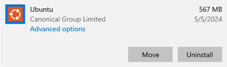

4. Click **Move**.

5. Select the drive that you want to move the Ubuntu installation to, and click **Move**.

 :::note
 To access the WSL workspace, go to the following path using the Windows File Explorer:
 
 `\\wsl$`
:::

<a id="arm64env"></a>
## Set up an Ubuntu Server VM on an Arm64 Mac using UTM

UTM is an open-source VM host for macOS(®), which allows you to run other operating systems on Macs, including Ubuntu. Setting up an Ubuntu Server VM using UTM on an Arm64 Mac involves the following tasks:


### Host machine requirements

Before setting up an Ubuntu Server VM using UTM, ensure that your Arm64 Mac host machine meets the following system requirements:
| Specification         | Requirement                              |
|-----------------------|------------------------------------------|
| Processor architecture | Arm64 <p>To verify that the architecture of your Mac is Arm64, run the `uname -a` command in a terminal window.</p> |
| CPU cores             | 8 or more                                |
| RAM                   | 8 GB or larger                           |
| Storage               | 300 GB free space for the UTM VM         |
| Operating system      | macOS 14                                 |

If your Arm64 Mac host machine meets the system requirements, download the following software:
| Software                     | Description |
|------------------------------|-------------|
| UTM virtualization software  | Download the UTM virtualization software from the [UTM website](https://mac.getutm.app/). |
| Ubuntu server ISO            | All Ubuntu 22.04 64-bit ARM (ARMv8/AArch64) Server LTS versions are supported. We recommend downloading the latest version of Ubuntu Server 22.04 ISO (e.g., `ubuntu-22.04.5-live-server-arm64.iso`) from the [Ubuntu website](https://ubuntu.com/download/server/arm). |

### Install UTM on an Arm64 Mac

1. Double-click the *UTM.dmg* file downloaded earlier and drag the **UTM** icon onto the **Applications** icon.

    

2. While installing UTM, if you see the following dialog box, click **Open**:

    

3. Open **Launchpad**, search for "UTM", and click **UTM**.

The UTM main window appears.

    

### Create a VM in UTM

1. In the UTM main window, click **Create a New Virtual Machine**.

2. On the **Start** screen, click **Virtualize**.

3. On the **Operating System** screen, select the **Linux** OS.

4. On the **Linux** screen, browse and select the Ubuntu ISO image you downloaded, and click **Continue**.

5. On the **Hardware** screen, specify the memory and CPU cores you want to allocate to the Ubuntu VM, and click **Continue**. The recommended values are as follows:

   * Memory: About 70% of the available memory

   * CPU cores: At least 50% of the available cores

   If you leave the **CPU Cores&#x20;**&#x66;ield blank or set it to 0, UTM allocates all the host machine cores to the VM. Allocating all CPU cores to the VM can make the host machine slow or unresponsive.

 :::note

 To know the memory size and the CPU core count of a Mac host machine, see the instructions in the [macOS User Guide](https://support.apple.com/en-in/guide/mac-help/syspr35536/mac).&#x20;
 :::
6. On the **Storage** screen, specify the drive size for the VM, and clic&#x6B;**&#x20;Continue**.&#x20;

 :::note

It is recommended that you allocate at least 300 GB of storage space for the VM.
:::

7. If you want to share a directory between the host machine and the VM, do the following on the **Shared Directory** screen:

    1. Browse and select the directory.

    2. Click **Continue**.

8. On the **Summary** screen, do the following:

    1. Review the configuration summary for the VM that you are creating.

    2. Provide a name to the VM.

    3. Click **Save**. The newly created VM is listed in the UTM main window.

    

### Install Ubuntu Server in UTM

1. Run UTM.

2. In the UTM main window, click the **Play** icon to run the Ubuntu ISO image through virtualization.&#x20;

3. Select **Try or Install Ubuntu Server&#x20;**&#x75;sing the arrow keys and press **Enter**.

    

4. Select a language, and press **Enter**.

5. Optional: You may see a screen to update the installer. Select one of the following options and press **Enter**:

    * Update to the new installer

    * Continue without updating

6. Select a keyboard layout, select **Done**, and press **Enter**.

7. Select the **Ubuntu Server** installation base, select **Done**, and pres&#x73;**&#x20;Enter**.&#x20;

8. Select the appropriate network interface, select **Done**, and press **Enter**.

9. Select the appropriate proxy configuration, select **Done**, and press **Enter**.&#x20;

10. If necessary, configure the mirror address and wait until the mirror location passes all the tests, select **Done**, and press **Enter**.&#x20;

    

11. Select **Use an entire disk&#x20;**>**&#x20;Set up this disk as an LVM group**, select **Done**, and press **Enter**.

    

12. Configure the storage space as follows:

    1. Under the **USED DEVICES** section, select **ubuntu-lv&#x20;**&#x61;nd press **Enter** to view additional options.

     

    2. In the dialog box, select **Edit**, and press **Enter**.

    

    3. In th&#x65;**&#x20;Size** field, type *296.000G*, select **Save**, and press **Enter**. The updated size should now reflect for the ubuntu-lv entry.&#x20;

    4. Select **Done** and press **Enter**.

13. To set up your profile, specify the required details, select **Save**, and press **Enter**.

14. Skip th&#x65;**&#x20;Ubuntu Pro&#x20;**&#x75;pgrade option, select **Continue**, and press **Enter**.

15. Optional: Select **Install OpenSSH Server** to set up SSH, select **Done**, and press **Enter**.&#x20;

:::note

OpenSSH is not required for syncing, compiling, and flashing Qualcomm Linux. Install the OpenSSH server only if you want to allow secure remote access for the Ubuntu VM.
:::

16. Select a **Docker** snap, select **Done**, and press **Enter**.

Wait for the installation process to complete.

:::note

The installation process may suggest multiple Docker channels, such as stable and candidate. Select an appropriate Docker channel to continue with the installation.
:::

17. After the installation is successful, click the **Power** icon to shut down and stop the VM.

    

18. In the **Confirmation** dialog box, click **OK**. After the VM is stopped, close the window.

19. In the UTM main window, in the **CD/DVD** drop-down list, select **Clear**.

    

20. Confirm that the ISO image association is cleared/empty against the CD/DVD option.

    

21. To run the Ubuntu VM, click the **Play** icon.

    

22. After the Ubuntu operating system boots successfully, enter the credentials to log in and access the shell.

    

23. Run the following commands to update the Ubuntu operating system and install the graphical desktop environment, followed by a reboot:&#x20;

    ```shell
    sudo apt update && sudo apt upgrade -y
    sudo apt install ubuntu-desktop -y
    reboot
    ```
24.  Log in to the Ubuntu VM you created.

### Access RUBIK Pi 3 from the UTM VM

1. Connect RUBIK Pi 3 to the host machine.&#x20;

    The UTM software may show you a dialog box to confirm whether the virtualized Ubuntu operating system should have access to RUBIK Pi 3.&#x20;

      1. If you see a dialog box as follows, click **Confirm**:
    
          

      2. After clicking **Confirm**, if you see the following USB disconnection error, click **OK** to ignore it:
       

2. To verify if the Ubuntu VM can access RUBIK Pi 3, run the `lsusb` command in a Linux terminal window.&#x20;

  RUBIK Pi 3 is shown in the output as follows:

  

If RUBIK Pi 3 is not detected in the Ubuntu VM, do the following:
    1. Click **USB Devices** in the toolbar of the UTM VM window. 
    2. Select **QCMXXXX_xxxxxxxx**.

:::note

 If you do not see RUBIK Pi 3 listed as one of the USB devices, in UTM settings, click **Input** in the left panel, and set the value in the **Maximum Shared USB Devices** field to 10.
:::

### Configure sleep and wake settings for Mac, and power settings for Ubuntu

To ensure that the Mac host machine and the Ubuntu VM do not go to sleep due to inactivity, do the following:&#x20;

* To configure the sleep and wake settings for the Mac host machine, see [macOS User Guide](https://support.apple.com/en-in/guide/mac-help/mchle41a6ccd/mac).&#x20;

* To configure the power settings for Ubuntu, do the following:&#x20;

  1. In **System Settings** for Ubuntu, click **Power**.&#x20;

  2. Turn off **Automatic Suspend**.

:::note

To sync, build, and flash Qualcomm Linux, see [Yocto Project User Guide](./10.yocto-project-user-guide.md#chap10) and [Linux kernel](./1.get-started.md#LinuxKernel).
:::

<a id="x86env"></a>
## Set up an Ubuntu VM on an x86_64 Mac using UTM

UTM is an open-source VM host for macOS, which allows you to run other operating systems on Macs, including Ubuntu. Setting up an Ubuntu VM using UTM on an x86_64 Mac involves the following tasks:


### Host machine requirements

Before setting up an Ubuntu VM using UTM, ensure that your x86_64 Mac host machine meets the following system requirements:&#x20;

| Specification         | Requirement                              |
|-----------------------|------------------------------------------|
| Processor architecture | x86_64<p>To verify that the architecture of your Mac is x86_64, run the `uname -a` command in a terminal window.</p>|
| CPU cores             | 8 or more                                |
| RAM                   | 8 GB or larger                           |
| Storage               | 300 GB free space for the UTM VM         |
| Operating system      | macOS 13 or higher                       |

If your x86_64 Mac host machine meets the system requirements, download the following software:

| Software                     | Description |
|------------------------------|-------------|
| UTM virtualization software  | Download from the [UTM website](https://mac.getutm.app/) |
| Ubuntu ISO                   | All Ubuntu 22.04 64-bit PC (AMD64) Desktop LTS versions are supported. We recommend that you download the latest version of Ubuntu 22.04 ISO (for example, ubuntu-22.04.5-desktop-amd64.iso) from the [Ubuntu website](https://www.releases.ubuntu.com/22.04/) |

### Install UTM on an x86_64 Mac

1. Double-click the *UTM.dmg* file downloaded earlier and drag the **UTM** icon onto th&#x65;**&#x20;Applications** icon.&#x20;

    

2. While installing UTM, if you see the following dialog box, clic&#x6B;**&#x20;Open**:&#x20;

    

3. Open **Launchpad**, search for "UTM", and click **UTM**.&#x20;

&#x20;    The UTM main window appears.

    

### Create a VM in UTM

1. In the UTM main window, click **Create a New Virtual Machine**.

2. On the **Start&#x20;**&#x73;creen, click **Virtualize**.&#x20;

3. On the **Operating System** screen, select the **Linux** OS.

4. On the **Linux** screen, browse and select the Ubuntu ISO image you downloaded, and click **Continue**.&#x20;

5. On the **Hardware** screen, specify the memory and CPU cores you want to allocate to the Ubuntu VM, and click **Continue**. The recommended values are:&#x20;

   * Memory: About 70% of the available memory

   * CPU cores: At least 50% of the available cores

If you leave th&#x65;**&#x20;CPU Cores** field blank or set it to 0, UTM allocates all the host machine cores to the VM. Allocating all CPU cores to the VM can make the host machine slow or unresponsive.&#x20;

:::note

To know the memory size and the CPU core count of a Mac host machine, see the instructions in the [macOS User Guide](https://support.apple.com/en-in/guide/mac-help/syspr35536/mac).
:::

6. On th&#x65;**&#x20;Storage** screen, specify the drive size for the VM, and click **Continue**.&#x20;

:::note

 It is recommended that you allocate at least 300 GB for the VM.
:::
7. If you want to share a directory between the host machine and the VM, do the following on the **Shared Directory** screen:

    1. Browse and select the directory.

    2. Click **Continue**.

8. On the **Summary&#x20;**&#x73;creen, do the following:

    1. Review the configuration summary for the VM that you are creating.&#x20;

    2. Provide a name to the VM.

    3. Click **Save**. The newly created VM is listed in the UTM main window.&#x20;

  

### Install Ubuntu in UTM

1. In the UTM main window, click the **Play** icon to run the Ubuntu ISO image through virtualization.

    

2. Select **Try or Install Ubuntu** using the arrow keys and press **Enter**.&#x20;

    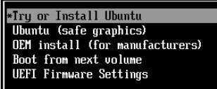

3. On the **Welcome** screen, select a language, and click **Install Ubuntu**.&#x20;

4. On the **Keyboard Layout&#x20;**&#x73;creen, select a keyboard layout, and click **Continue**.&#x20;

5. On the **Updates and other software** screen,**&#x20;Normal installation** is selected by default. Select the **Minimal installation** option button if you do not want to install all the Ubuntu operating system features.&#x20;

6. On the **Installation type** screen, select the **Erase disk and install Ubuntu** option button, and click **Install Now**.&#x20;

:::note

 Th&#x65;**&#x20;Erase disk and install Ubuntu** option erases only the storage area allocated to the VM. It does not erase any other data or system files on the host machine.
:::
7. On the **Write the changes to disk?** dialog box, click **Continue**.&#x20;

8. On the **Where are you?** screen, select the appropriate time zone.&#x20;

9. On the **Who are you?** screen, specify the required details, and click **Continue** to start the installation.&#x20;

10. After the installation is completed, click **Restart Now**.

11. To shut down and stop the VM, click the **Power** icon.&#x20;

    

12. In the **Confirmation** dialog box, click **OK**. After the VM is stopped, close the window.

13. In the UTM main window, in the **CD/DVD** drop-down list, select **Clear**.&#x20;

    

14. Confirm that the ISO image association is cleared/empty against the CD/DVD option.&#x20;

    

15. To run the Ubuntu VM, click the **Play&#x20;**&#x69;con.

    

16. Log in to the Ubuntu VM you created.

### Access RUBIK Pi 3 from the UTM VM

1. Connect RUBIK Pi 3 to the host machine.

   The UTM software may show you a dialog box to confirm whether the virtualized Ubuntu operating system should have access to RUBIK Pi 3. &#x20;

   If you see a dialog box as follows, click **Confirm**:

   

After clicking **Confirm**, if you see the following USB disconnection error, click **OK** to ignore it.


2. To verify if the Ubuntu VM can access RUBIK Pi 3, run the `lsusb` command in a Linux terminal window.&#x20;

RUBIK Pi 3 is shown in the output as follows:


If RUBIK Pi 3 is not detected in the Ubuntu VM, do the following:
     1. Click **USB Devices** in the toolbar of the UTM VM window. 
     2. Select **QCMXXXX_xxxxxxxx**.


:::note

 If you do not see RUBIK Pi 3 listed as one of the USB devices, in UTM settings, click **Input** in the left panel, and set the value in the **Maximum Shared USB Devices** field to 10.&#x20;
:::

### Configure sleep and wake settings for Mac, and power settings for Ubuntu

To ensure that the Mac host machine and the Ubuntu VM do not go to sleep due to inactivity, do the following:

* To configure the sleep and wake settings for the Mac host machine, see [macOS User Guide](https://support.apple.com/en-in/guide/mac-help/mchle41a6ccd/mac).

* To configure the power settings for Ubuntu, do the following:

  1. I&#x6E;**&#x20;System Settings** for Ubuntu, click **Power**.

  2. Turn off **Automatic Suspend**.

  :::note
  
   To sync, build, and flash Qualcomm Linux, see [Yocto Project User Guide](./10.yocto-project-user-guide.md#chap10) and [Linux kernel](./1.get-started.md#LinuxKernel).
   :::

## Linux kernel
<a id="LinuxKernel"></a>

It is advisable to conduct Linux kernel development in an environment running Ubuntu 18 – Ubuntu 22.

### Download code

```shell
git clone https://github.com/rubikpi-ai/linux.git
git submodule init
git submodule update
```

### Directory analysis

After the `git clone` operation, the RUBIK Pi 3 Linux repository is as shown in the following figure:


The major folders and files are described as follows:

| **Name**          | **Description**                                                         |
| ----------------- | ----------------------------------------------------------------------- |
| arch              | Architecture-related directory                                          |
| block             | Block device-related directory                                          |
| certs             | Certification and signature-related directory                           |
| crypto            | Encryption-related directory                                            |
| documentation     | Documentation-related directory                                         |
| drivers           | Driver-related directory                                                |
| firmware          | Firmware-related directory                                              |
| fs                | File system-related directory                                           |
| include           | Header file-related directory                                           |
| init              | Kernel initialization-related directory                                 |
| ipc               | Inter-process communication-related directory                           |
| kernel            | Directory of the kernel core code                                       |
| lib               | Directory of kernel core library code                                   |
| mm                | Directory of memory management-related code                             |
| net               | Directory of network protocol-related code                              |
| samples           | Directory of kernel compilation examples                                |
| scripts           | Directory of kernel compilation and configuration scripts               |
| security          | Security architecture-related directory                                 |
| sound             | Audio system-related directory                                          |
| tools             | Directory of kernel interaction tools                                   |
| usr               | initramfs-related directory, used to generate the initramfs             |
| virt              | Directory that provides Kernel-based Virtual Machine (KVM) technologies |
| rust              | Rust-related directory                                                  |
| rubikpi           | RUBIK Pi 3 related directory for storing compilation tools              |
| techpack          | Qualcomm platform-related driver                                        |
| .config           | Configuration file for final kernel compilation                         |
| Makefile          | Main file used to compile the kernel                                    |
| Kbuild            | Script for configuring kernel settings                                  |
| Kconfig           | Configuration file for the graphical configuration interface            |
| MAINTAINERS       | List of maintainers                                                     |
| CREDITS           | Linux contributors                                                      |
| COPYING           | Copyright statement                                                     |
| rubikpi_build.sh | Compilation and packaging scripts provided by RUBIK Pi 3                |
| rubikpi_flash.sh | Flash scripts provided by RUBIK Pi 3                                    |

#### Device tree

The top-level device tree of RUBIK Pi 3 is *rubikpi3.dts*, which is located in the *arch/arm64/boot/dts/qcom* directory. It is recommended that all modifications to the device tree be made in this file.

In addition, during the development process, the *sc7280.dtsi* in the same level of directory may be frequently checked. *sc7280.dtsi* has nodes commonly used during the development process, including GPIO, SPI, I2C, UART, CPU, and GPU.

On the Qualcomm platform, drivers and device trees related to display, graphics, camera, video, and other components are separated from the main Linux kernel source and maintained in independent repositories. Follow the [Yocto Project User Guide](./10.yocto-project-user-guide.md#chap10) to download the Yocto project source code. You can then navigate to the *layers/meta-qcom-hwe* directory, where the *.bb* files provide information about the specific code repositories.

For example, to view the device tree configuration for the camera, check the *layers/meta-qcom-hwe/recipes-multimedia/cameradlkm/cameradlkm_1.0.bb&#x20;*&#x66;ile. The content is as follows:

```shell
SRCPROJECT = "git://git.codelinaro.org/clo/le/platform/vendor/opensource/camera-kernel.git;protocol=https"
SRCBRANCH  = "camera-kernel.qclinux.1.0.r1-rel"
SRCREV     = "0f2b11fac7f13f76a9e9f8e25ae2de5c97b23169"
```

* The repository address is: https://git.codelinaro.org/clo/le/platform/vendor/opensource/camera-kernel.git

* The branch is `camera-kernel.qclinux.1.0.r1-rel`

* The commit is `0f2b11fac7f13f76a9e9f8e25ae2de5c97b23169`

To ensure that the board works correctly after the compiled device tree is flashed to it, RUBIK Pi 3 stores these device tree repositories independent of the Linux kernel source in the directory *arch/arm64/boot/dts/qcom.*

* Display: *arch/arm64/boot/dts/qcom/display-devicetree*

* Camera: *arch/arm64/boot/dts/qcom/camera-devicetree*

* Graphics: *arch/arm64/boot/dts/qcom/*&#x67;raphics-devicetree

* Video: *arch/arm64/boot/dts/qcom/video-devicetree*

When using the `./rubikpi_build.sh -d` command to compile the device tree, it will first compile the kernel device tree *rubikpi3.dtb* as the base device tree. Then, it will overlay the device trees from the sub-repositories onto the base device tree, and finally, it will overlay the *arch/arm64/boot/dts/thundercomm/rubikpi3/rubikpi3-overlay.dtso* device tree. It is recommended to incorporate any modifications to the sub-repository device trees into the *rubikpi3-overlay.dtso*.

<a id="compilecode"></a>
### Compile code

1. Run the following command to set up the cross-compilation environment. For details, refer to [Install cross-compilation tools](./1.get-started.md#Installcross-compilationtools).

   ```shell
   source <your toolchains directory>/environment-setup-armv8-2a-qcom-linux
   ```

    :::note
    The cross-compilation environment is only effective on the current terminal.
    :::

   If the following error occurs, input the `unset LD_LIBRARY_PATH` command and run the above command again.

   

2. Go to the kernel directory and compile the kernel.

   ```shell
   ./rubikpi_build.sh -a
   ```

    :::note
   
    * The first compilation takes a longer time based on different computer configurations. In most cases, it takes less than 20 minutes. Subsequent compilations are only performed on modified code.
   
    * The kernel directory can be cleaned up using the `./rubikpi_build.sh -c` command, after which all compilation artifacts and some configuration content will be deleted.
    :::
3. Go to the kernel directory. Package the kernel and device tree image.
<a id="linuxkernelpack"></a>

   ```shell
   ./rubikpi_build.sh -dp -ip
   ```

   

   If the following error occurs when you package the image:

   

   Run the following command to modify the *.mtoolsrc* file, add `mtools_skip_check=1`, and try packaging the image again.

   ```shell
   vim ~/.mtoolsrc
   ```

   :::note
   
    During the update in March 2025, if non-official images of RUBIK Pi 3 are flashed, copy *efi.bin&#x20;*&#x69;n the corresponding image package to the *rubikpi/tools/pack&#x20;*&#x64;irectory before packaging.
    :::
    
   :::note
   
    Running the `./rubikpi_build.sh` command completes step 2 and step 3.
    :::
4. Go to the kernel directory and flash the kernel and device tree image.

   ```shell
   ./rubikpi_flash.sh -d -i -r
   ```

    :::note
   
    Before flashing, ensure that RUBIK Pi 3 has entered fastboot mode. Use one of the following methods to enter fastboot mode:
    - In the RUBIK Pi 3 terminal, input `reboot bootloader`. When RUBIK Pi 3 enters fastboot mode, the blue indicator lights up.
    - Press and hold the **[PWR]** button until the blue indicator lights up.
    :::
5. For details about how to use the `./rubikpi_build.sh` and `./rubikpi_flash.sh` scripts, use the `–h` parameter.

Run the `./rubikpi_buils.sh -h` command to view how to use the build script.

Sample output

```shell
Usage:
  bash ./rubikpi_build.sh [options]

Options:
  -h, --help              display this help message
  -dp, --dtb_package      generate a burnable device tree image
  -ip, --image_package    generate a burnable kernel image
  -a, --build_all         Complete compilation of kernel
  -d, --build_dts         Complete compilation of device tree
  -gc, --generate_config  Generate. config file
  -c, --clean             Clean up workspace

```

Run the `./rubikpi_flash.sh -h`  command to view how to use the flashing script.

Sample output

```shell
Usage:
  bash ./rubikpi_flash.sh [options]

Options:
  -h, --help     display this help message
  -r, --reboot   exit fastboot mode
  -d, --dtb      flash device tree image
  -i, --image    flash kernel image
```

### Compile the ko driver module separately

1. Create a Makefile as follows. Change `KDIR` to the actual kernel source code directory.

   ```makefile
   obj-m += hello.o  
   KDIR:=/home/rubikpi/kernel-6.6
   PWD?=$(shell pwd)
   all:
           make -C $(KDIR) M=$(PWD) modules
           echo $(PWD)
   clean:
           rm -f *.ko *.o *.mod *.mod.o *.mod.c *.symvers *.order
   ```

2. Create a *hello.c* file as follows:

   ```c
   #include <linux/module.h>
   #include <linux/init.h>

   static int hello_init(void)
   {
       printk("hello RUBIK Pi!\n");
       return 0;
   }

   static void hello_exit(void)
   {
       printk("bye RUBIK Pi!\n");
   }

   module_init(hello_init);
   module_exit(hello_exit);

   MODULE_LICENSE("GPL");
   MODULE_VERSION("V1.0");
   MODULE_AUTHOR("RUBIK Pi");
   ```

3. Run the following commands to compile the ko module:

   ```bash
   export ARCH=arm64  
   export CROSS_COMPILE=aarch64-qcom-linux-  
   make
   ```

4. Transfer hello.ko to your RUBIK Pi 3 using the ADB or SCP method.

5. Run the following commands on your RUBIK Pi 3 to verify that the compilation artifact is valid.

   ```shell
   insmod hello.ko
   rmmod hello.ko
   dmesg | grep "RUBIK Pi"
   ```

    

### Configure the kernel

Run the following commands to configure the Linux kernel using `menuconfig`:

```bash
cd linux  
make ARCH=arm64 menuconfig
```

After the configuration is completed, run the following commands to save the configuration.

```shell
make ARCH=arm64 savedefconfig  
cp defconfig ./arch/arm64/configs/rubik_pi3_defconfig
```
