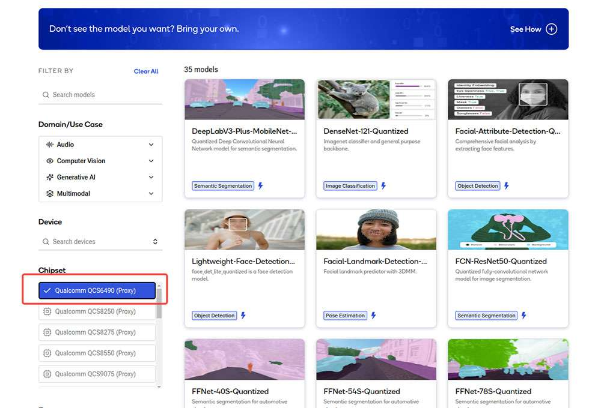

---
# Display h2 to h5 headings
toc_min_heading_level: 2
toc_max_heading_level: 4
custom_edit_url: https://github.com/rubikpi-ai/documentation/blob/main/docs-en/docs/rubik-pi-3-user-manual/1.1.2/3.qualcomm-ai-hub.md
---

# Qualcomm AI Hub

Qualcomm AI Developer Workflow

The AI/ML Developer Workflow serves as a comprehensive step-by-step guide aimed at assisting developers in efficiently preparing an optimized model, assessing its performance with the Qualcomm® AI Hub, and subsequently integrating the model into an application using the Qualcomm® Intelligent Multimedia SDK (IM SDK). The Qualcomm AI Hub offers an extensive collection of validated and optimized AI models to developers, which are designed for deployment on the Qualcomm Dragonwing™ QCS6490 platform.

Developers can also incorporate their own models and improve them using the Qualcomm AI Hub workflow. Models are optimized to leverage hardware acceleration using all compute cores within the Qualcomm® AI Engine (CPU, GPU, and NPU). Additionally, they can be deployed on devices powered by Qualcomm platforms with a few lines of code. The Qualcomm IM SDK provides easy-to-use APIs and plug-ins that facilitate the integration of multimedia components and machine learning models, allowing developers to create a pipeline for deployment in an application.

For more information, visit https://aihub.qualcomm.com.

If you want to download the AI model file, visit [https://aihub.qualcomm.com](https://aihub.qualcomm.com/) and perform the following steps:

