---
# Display h2 to h5 headings
toc_min_heading_level: 2
toc_max_heading_level: 4
---

# AI Developer Workflow 
<a id="section-4"></a>

The AI/ML developer workflow on Qualcomm Linux has two major steps:

Step 1:

Compile and optimize a model

- Compile and optimize the model from the third-party AI framework to efficiently run on RUBIK Pi 3. For example, a Tensorflow model  can be exported to a TFLite model.
- Optionally, quantize, fine-tune performance, and accuracy using hardware-specific customizations.

Step 2:

Build an application to use the optimized model to run on-device inference
- Integrate the AI model into the use case pipeline in chi-cdk node.
- Alternatively, use the Android native SDK to call Qualcomm AI SDKs.


## Overview


Developers can bring models from ONNX, PyTorch, TensorFlow or TFLite and run them efficiently on Qualcomm AI Hardware – HTP (NPU), GPU, CPU using Qualcomm AI SDKs.

### AI hardware

* Qualcomm Kryo™ CPU – Best-in-class CPU with high performance and remarkable power efficiency.

* Qualcomm Adreno GPU – Suitable to execute AI workloads with balanced power and performance. AI workloads are accelerated with OpenCL kernels. The GPU can also be used to accelerate model pre/postprocessing.

* Qualcomm Hexagon Tensor Processor (HTP) – Also known as NPU/DSP/HMX, suitable to execute AI workloads with low-power and high-performance. For optimized performance, pretrained models need be quantized to one of the supported precisions.

### AI software

AI stack contains SDKs to harness the power of AI hardware accelerators. Developers can use one of the SDKs of their choice to deploy AI workloads. Pretrained models (except for TFLite models) need to be converted to an executable format with the selected SDK before running them. TFLite models can be run directly using TFLite Delegate.

* TFLite

TFLite models can be executed natively on RUBIK Pi 3 with acceleration using the following Delegates.

| **Delegate**                             | **Acceleration** |
| ---------------------------------------- | ---------------- |
| AI Engine Direct Delegate (QNN Delegate) | CPU, GPU and HTP |
| XNNPACK Delegate                         | CPU              |
| GPU Delegate                             | GPU              |

* Qualcomm Neural Processing Engine (SNPE) SDK 

Qualcomm Neural Processing Engine (SNPE) is a software accelerated runtime for execution of deep neural networks. SNPE offers tools to convert, quantize neural networks and accelerate them on hardware accelerators including CPU, GPU, and HTP.

* Qualcomm AI Engine Direct (QNN)

Qualcomm AI Engine Direct is a software architecture for AI/ML use cases on Qualcomm chipsets and AI acceleration cores. The architecture is designed to provide a unified API and modular and extensible per-accelerator libraries, which form a reusable basis for full stack AI solutions. It provides support for runtimes such as Qualcomm Neural Processing SDK, TFLite AI Engine Direct Delegate.

## Compile and optimize model

Users can take one of two paths available to compile and optimize their models.

* AI Hub

* AI Software Stack

### AI Hub

For quick prototyping of models on Qualcomm AI hardware, AI Hub provides a way to optimize, validate, and deploy machine learning models on-device for vision, audio, and speech use cases.


Refer to the[ AI Hub](https://app.aihub.qualcomm.com/docs/hub/getting_started.html#installation) documentation on setup and getting started.

#### Setup

1. Setup your Python environment.

Install [miniconda](https://docs.conda.io/projects/miniconda/en/latest/miniconda-install.html) on your machine.

**Windows**: When the installation finishes, open Anaconda prompt from the Start menu.

**macOS/Linux**: When the installation finishes, open a new shell window.

Set up a Python virtual environment for Qualcomm AI Hub:

```cmake
source <path>/miniconda3/bin/activate
conda create python=3.8 -n qai_hub
conda activate qai_hub
```

2. Install the AI Hub Python client.

```cmake
pip3 install qai-hub
pip3 install "qai-hub[torch]"
```

3. Sign in to AI Hub.

Go to [AI Hub](https://aihub.qualcomm.com/) and sign in with your Qualcomm ID to view information about jobs you create. Once signed in, navigate t&#x6F;**&#x20;Account** > **Settings&#x20;**>**&#x20;API Token**. This should provide an API token that you can use to configure your client.

4. Configure the client with your API token using the following command in your terminal.

```cmake
qai-hub configure --api_token <INSERT_API_TOKEN>
```

#### AI Hub workflow

##### Try a preoptimized model

Navigate to[ AI Hub Model Zoo](https://aihub.qualcomm.com/iot/models) to access preoptimized models available for RUBIK Pi 3.


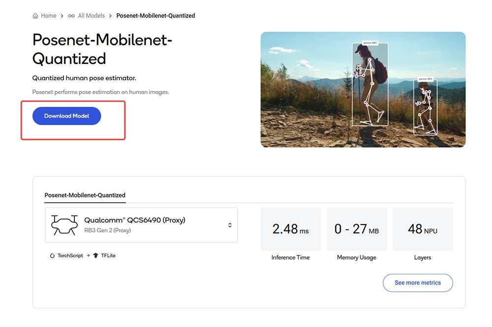

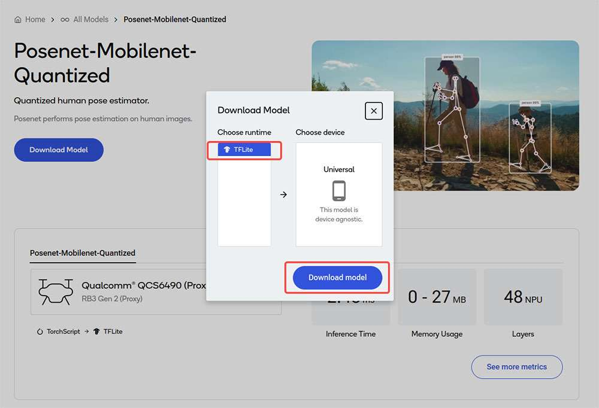

Click Download model to begin model download. The downloaded model is already preoptimized and ready for Develop your own application.

##### Bring your own model

1. Select a pretrained model in PyTorch or Onnx format.

2. Submit a model for compilation or optimization to AI Hub using python APIs.

When submitting a compilation job, you must select a device or chipset and the target runtime to compile the model. For RUBIK Pi 3, the TFLite runtime is supported.

| Chipset | Runtime | CPU             | GPU       | HTP        |
| ------- | ------- | --------------- | --------- | ---------- |
| QCS6490 | TFLite  | INT8,FP16, FP32 | FP16,FP32 | INT8,INT16 |

On submission, AI Hub generates a unique ID for the job. You can use this job ID to view job details.

3. AI Hub optimizes the model based your device and runtime selections.

Optionally, you can submit a job to profile or inference the optimized model (using Python APIs) on a real device provisioned from a device farm.

* Profiling: Benchmarks the model on a provisioned device and provides statistics, including average inference times at the layer level, runtime configuration, etc.

* Inference: Performs inference using an optimized model on data submitted as part of the inference job by running the model on a provisioned device.

4. Each submitted job will be available for review in the AI Hub portal. A submitted compilation job will provide a downloadable link to the optimized model. This optimized model can then be deployed on a local development device like RUBIK Pi 3.

The following is an example of the described workflow taken from the [AI Hub documentation](https://aihub.qualcomm.com/iot/models). In this example, a MobileNet V2 pretrained model from PyTorch is uploaded to AI Hub and compiled to an optimized TFLite model to run on a RUBIK Pi 3 target.

```python
import qai_hub as hub
import torch
from torchvision.models import mobilenet_v2
import numpy as np
# Using pre-trained MobileNet
torch_model = mobilenet_v2(pretrained=True)
torch_model.eval()
# Trace model (for on-device deployment)
input_shape = (1, 3, 224, 224)
example_input = torch.rand(input_shape)
traced_torch_model = torch.jit.trace(torch_model, example_input)
# Compile and optimize the model for a specific device
compile_job = hub.submit_compile_job(
model=traced_torch_model,
device=hub.Device("QCS6490 (Proxy)"),
input_specs=dict(image=input_shape),
#compile_options="--target_runtime tflite",
)
# Profiling Job
profile_job = hub.submit_profile_job(
model=compile_job.get_target_model(),
device=hub.Device("QCS6490 (Proxy)"),
)
sample = np.random.random((1, 3, 224, 224)).astype(np.float32)
# Inference Job
inference_job = hub.submit_inference_job(
model=compile_job.get_target_model(),
device=hub.Device("QCS6490 (Proxy)"),
inputs=dict(image=[sample]),
)
# Download model
compile_job.download_target_model(filename="/tmp/mobilenetv2.tflite")
```

:::note

To deactivate a previously activated qai_hub environment, use the following command.

 `conda deactivate`
:::

Once the model is downloaded, it is ready for developing your own application. For more details about the AI Hub workflow and APIs, refer to the [AI Hub Documentation](https://app.aihub.qualcomm.com/docs/hub/index.html#examples).

### TFLite


TensorFlow Lite (TFLite) is an open-source deep learning framework for on-device inference. TFLite helps developers run their models on mobile, embedded, and edge platforms by optimizing the model for latency, model size, power consumption, etc. Qualcomm supports executing TFLite models natively on Qualcomm Linux hardware through TFLite Delegates as listed below.

| **Delegate**                             | **Acceleration** |
| ---------------------------------------- | ---------------- |
| AI Engine Direct Delegate (QNN Delegate) | CPU, GPU and HTP |
| XNNPack Delegate                         | CPU              |
| GPU Delegate                             | GPU              |

| **Reference Guide**                                                                                 | **API Reference**                                                                                                                                             |
| --------------------------------------------------------------------------------------------------- | ------------------------------------------------------------------------------------------------------------------------------------------------------------- |
| [Reference Guide](https://docs.qualcomm.com/bundle/publicresource/topics/80-70014-54/overview.html) | [C/C++](https://www.tensorflow.org/lite/api_docs/cc?_gl=1*xotull*_ga*OTM5NzE4ODUwLjE2ODk2OTQ3MDI.*_ga_W0YLR4190T*MTcxNTM3NzQyMS4yNy4xLjE3MTUzNzc0MjEuMC4wLjA) |

### Qualcomm Neural Processing Engine (SNPE)

Qualcomm Neural Processing Engine (also known as Snapdragon Neural Processing Engine or SNPE) is an all-in-one SDK to port ML models to run on Qualcomm hardware accelerators. SNPE offers tools to convert and quantize models trained in PyTorch and TensorFlow and offers a runtime to execute these models on CPU, GPU, and HTP. Learn more about SNPE SDK [here](https://docs.qualcomm.com/bundle/publicresource/topics/80-63442-2/introduction.html).


| **Setup**                                                                                                                                                                                                                                                                                 | **Customize**                                                                                                                                                                                                                              | **Run Inference**                                                                                                    | **API Reference**                                                                   |
| ----------------------------------------------------------------------------------------------------------------------------------------------------------------------------------------------------------------------------------------------------------------------------------------- | ------------------------------------------------------------------------------------------------------------------------------------------------------------------------------------------------------------------------------------------ | -------------------------------------------------------------------------------------------------------------------- | ----------------------------------------------------------------------------------- |
| <p>[Install Qualcomm Neural Processing Engine SDK](#installNPESDK)</p><p>[Setup Qualcomm Neural Processing SDK](#SetNPESDK)</p> | <p>[Model Conversion](#modelconversion)</p><p>[Model Quantization](#modelquantization)</p> | [Model deployment](#modeldeployment) | [C/C++](https://docs.qualcomm.com/bundle/publicresource/topics/80-63442-2/api.html) |

<a id="installNPESDK"></a>
#### Install Qualcomm Neural Processing Engine SDK

Qualcomm Neural Processing Engine SDK requires an Ubuntu 22.04 host machine.

:::note

 If the host machine uses Windows or macOS operating system software, install a virtual machine following the steps provided [here](https://qualcomm.com/DCN/80-70014-41/overview.html?product=1601111740013095). Subsequent steps must be run in the virtual machine running Ubuntu 22.04 LTS.
:::

The Qualcomm Neural Processing SDK workflow has been validated with Ubuntu 22.04 running on bare metal or inside a Virtual Machine in the following configurations.

:::note

Ubuntu 22.04 running inside a VM on macOS on Arm architecture is not supported.
:::

| **Download Method**                                                                                                          | **Prerequisites**                                             | **Version available**              |
| ---------------------------------------------------------------------------------------------------------------------------- | ------------------------------------------------------------- | ---------------------------------- |
| [Direct Download](#directdownload)          | No prerequisites for download                                 | v2.22.6 (SDK updated everyquarter) |
| [Qualcomm Package Manager](#Qpackmanager) | A valid Qualcomm ID is needed. Qualcomm Package Manager tool. | SDK updated every month            |

<a id="directdownload"></a>
##### Direct Download

Qualcomm Neural Processing Engine SDK is available for direct download [here](https://softwarecenter.qualcomm.com/api/download/software/qualcomm_neural_processing_sdk/v2.22.6.240515.zip). Once downloaded, extract or unzip the SDK.

:::note
The SDK version hosted at the above link is updated quarterly.
:::

```cmake
unzip 2.22.6.240515.zip
cd qairt/2.22.6.240515/
export SNPE_ROOT=`pwd`
```

<a id="Qpackmanager"></a>
##### Qualcomm Package Manager

Qualcomm Neural Processing Engine SDK is available for download via Qualcomm Package Manager (QPM). This section demonstrates how to download Qualcomm Neural Processing Engine SDK using QPM.

:::note

To download Qualcomm Neural Processing SDK from Qualcomm Package Manager, ensure that you have registered for a Qualcomm ID. If you do not have a Qualcomm ID, you will be prompted to register. Then follow the instructions below to download and install the SDK.
:::

1. Go to [Qualcomm Package Manager](https://qpm.qualcomm.com/#/main/) and log in using your Qualcomm ID.

2. Navigate to the **Tools** tab and search for AI Stack in the left pane. From the filtered results, click the arrow next to Qualcomm® AI Stack to expand the list of available AI Software SDKs and select **Qualcomm Neural Processing SDK** from the list.


3. Click o&#x6E;**&#x20;Qualcomm Neural Processing SDK** to navigate to the next page. Choose **Linux** and Versio&#x6E;**&#x20;2.22.6.240515** from the drop-down lists and then click **Download** to download the Qualcomm Neural Processing SDK installer.

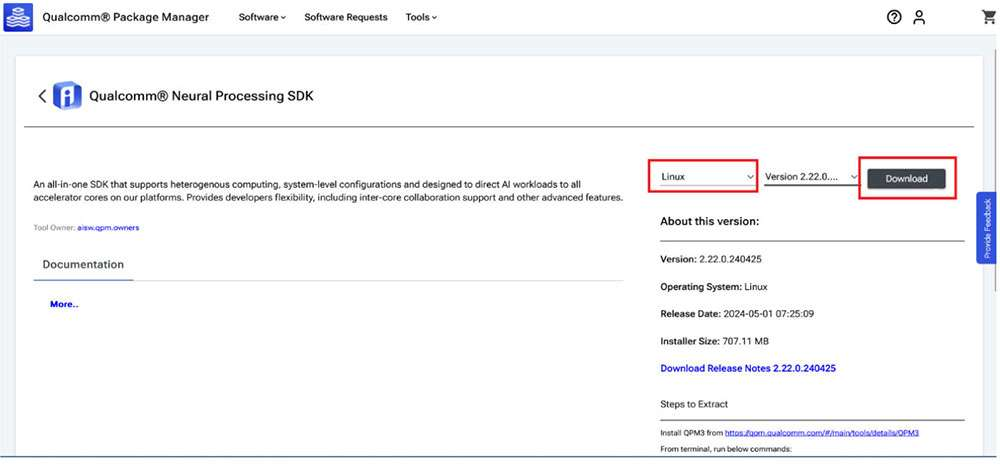

:::note

 * These instructions use version 2.22.6.240515 as an example.

 * If using the Qualcomm Package Manager desktop tool, the **Extract** button will be present instead of download. This automatically installs the SNPE SDK.
:::

4. Install the downloaded installer (.qik) using the QPM CLI tool.

  - &#x20;Log in using QPM CLI.

      `qpm-cli --login <username>`  


  - Activate your SDK license.

&#x20;         `qpm-cli --license-activate qualcomm_neural_processing_sdk`

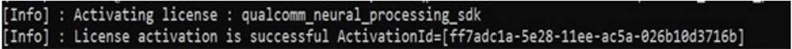

  - Extract and install the SDK.

&#x20;         `qpm-cli --extract <path to downloaded .qik file>`


Qualcomm Neural Processing SDK will be installed at: */opt/qcom/aistack/qairt/2.22.6.240515*

<a id="SetNPESDK"></a>
#### Set up Qualcomm Neural Processing SDK

##### **Prerequisites:**

1. Host OS: Ubuntu22.04 LTS

:::note

 If the host machine uses Windows or Mac OS, install a virtual machine following the steps provided [here](https://qualcomm.com/DCN/80-70014-41/overview.html?product=1601111740013095). Subsequent steps must be run in the virtual machine running Ubuntu 22.04 LTS.
 :::

2. Enable SSH in Permissive mode to securely log in to the host device. For instructions, see [How to SSH](https://docs.qualcomm.com/bundle/publicresource/topics/80-70014-254/how_to.html#how-to-ssh-)?

3. For the rest of the document, environment variable SNPE_ROOT represents the full path to the Qualcomm® Neural Processing SDK root directory.

If installed via the direct download method, $\{SNPE_ROOT\} is the path to the unzipped SDK.

```cmake
unzip v2.22.6.240515.zip
cd ~/qairt/2.22.6.240515
export SNPE_ROOT=`pwd`
```

If installed via QPM, the SDK is installed under /opt/qcom/aistack/qairt/\<version>

```cmake
export SNPE_ROOT=/opt/qcom/aistack/qairt/2.22.6.240515/
```


4. Python: v3.10

If Python is already installed, ensure that the environment path is updated with the Python 3.10 path. If Python3.10 is not installed on your system, you may install it with the following commands:

```cmake
sudo apt-get update
sudo apt-get install python3.10 python3-distutils libpython3.10
```

5. System Dependencies:

:::note

Run the following command as administrator/root to install system libraries.
:::

```python
sudo bash ${SNPE_ROOT}/bin/check-linux-dependency.sh
```

6. Virtual environment (VENV)

:::note

 &#x20;\<venv_path> is the path for new virtual environment.
:::

```cmake
sudo apt-get install python3.10-venv
python3.10 -m venv "<venv_path>"
source <venv_path>/bin/activate
```

Run the following script to check and install missing dependencies:

```cmake
python3 -m pip install --upgrade pip
${SNPE_ROOT}/bin/check-python-dependency
```


##### **Set up ML Frameworks**

To convert ML models trained on different frameworks into intermediate representations consumable by the Qualcomm® Neural Processing SDK, you may need to download and install the corresponding frameworks on your host machine.

This Qualcomm ® Neural Processing SDK release is verified to work with the following versions of the ML training frameworks:

| **Framework** | **Version** |
| ------------- | ----------- |
| TensorFlow    | v2.10.1     |
| TFLite        | v2.3.0      |
| PyTorch       | V1.13.1     |
| ONNX          | V1.12.0     |

```cmake
# Install tensorflow
pip install tensorflow==2.10.1
# Install tflite
pip install tflite==2.3.0
# Install PyTorch
pip install torch==1.13.1+cpu torchvision==0.14.1+cpu torchaudio==0.13.1 --
extra-index-url https://download.pytorch.org/whl/cpu
# Install Onnx
pip install onnx==1.12.0 onnxruntime==1.17.1 onnxsim==0.4.36
```

##### **Set up SNPE SDK Environment**

Source the environment setup script provided by SNPE SDK to ensure all necessary tools and libraries are available in $PATH for the workflow.

```shell
source ${SNPE_ROOT}/bin/envsetup.sh
```

#### Model Porting using SNPE


<a id="modelconversion"></a>
##### Model Conversion

A pretrained floating point, 32-bit precision model from PyTorch, Onnx, TensorFlow, or TFLite is input to SNPE converter tools (snpe-\<framework>-to-dlc) to convert the model to a Qualcomm-specific intermediate representation of the model called a deep learning container (DLC).

In addition to the input model from a source framework, the converters require additional details about the input model, such as the input node name, its corresponding input dimensions, and any output tensor names (for models with multiple outputs).

Refer to [converters](https://docs.qualcomm.com/bundle/publicresource/topics/80-63442-2/tools.html) for all available configurable parameters or see the command line help by running

`snpe-<framework>-to-dlc --help`.

```plain&#x20;text
required arguments:
                    -d INPUT_NAME INPUT_DIM, --input_dim INPUT_NAME INPUT_DIM
                        The names and dimensions of the network input layers specified in the format
                        [input_name comma-separated-dimensions], for example:
                                   'data' 1,224,224,3
                        Note that the quotes should always be included in order to handle special
                       characters, spaces, etc.For multiple inputs specify multiple --input_dim on the command line
                        like:
                                   --input_dim 'data1' 1,224,224,3 --input_dim 'data2' 1,50,100,3
                    --out_node OUT_NAMES, --out_name OUT_NAMES
                        Name of the graph's output Tensor Names. Multiple output names should be provided separately                            like:
                                    --out_name out_1 --out_name out_2
                    --input_network INPUT_NETWORK, -i INPUT_NETWORK
                                    Path to the source framework model.
```

The following example uses an ONNX model (inception_v3_opset16.onnx) downloaded from the [ONNX Model Zoo](https://github.com/onnx/models/blob/main/Computer_Vision/inception_v3_Opset16_timm/inception_v3_Opset16.onnx). Download the model as inception_v3.onnx to your workspace. In this example, we download the model to the *\~/models* directory.

Run the following command to generate the inception_v3.dlc model.

```shell
${SNPE_ROOT}/bin/x86_64-linux-clang/snpe-onnx-to-dlc --input_network ~/models/
inception_v3.onnx --output_path ~/models/inception_v3.dlc --input_dim 'x'
1,3,299,299
```


<a id="modelquantization"></a>
##### Model Quantization

To run a model on Hexagon Tensor Processor (HTP), the converted DLC must be quantized. SNPE offers a tool (snpe-dlc-quant) to quantize a DLC model to INT8/INT16 DLC using its own quantization algorithm. More information about SNPE quantization is available [here](https://docs.qualcomm.com/bundle/publicresource/topics/80-63442-2/quantized_models.html).

The quantization process in SNPE requires two steps:

1. Quantization of weights and biases within the model.

Quantization of weights and biases is a static step, i.e., no additional input data is required from the user.

2. Quantization of activation layers (or layers with no weights).

* Quantizing activation layers requires a set of input images from a training dataset as calibration data.

* These calibration dataset images are input as a list of preprocessed image files in .raw format. The file sizes of these input .raw files must match the input size of the model.

Inputs to `snpe-dlc-quant `are a converted DLC model and a plain text file with the paths to the calibration dataset images. This input list holds paths to preprocessed images saved as NumPy arrays in .raw format. The size of the preprocessed image must match the input resolution of the model.

The output of the `snpe-dlc-quant` tool is a quantized DLC.

```plain&#x20;text
  [ --input_dlc=<val> ]
                        Path to the dlc container
                        containing the model for which fixed-point encoding metadata should be generated.
                        This argument is required.
             [ --input_list=<val> ] Path to a file
                         specifying the trial inputs. This file should be a plain text file, containing one or more absolute file                            paths per line. These files will be taken to constitute the trial set. Each path is expected to point to                           a binary file containing one trial input in the 'raw' format, ready to be consumed by the tool                                        without any further modifications. This is similar to how input is provided to snpe-net-run                                          application.
             [ --output_dlc=<val> ]
                         Path at which the metadata-included quantized model container should be  written. If this                                          argument is omitted, the quantized model will be written at                                                                                                         <unquantized_model_name>_quantized.dlc.
```

:::note

 Use [Netron](https://github.com/lutzroeder/netron/releases/latest) graph visualization tool to identify the model’s input/output layer dimensions.
:::

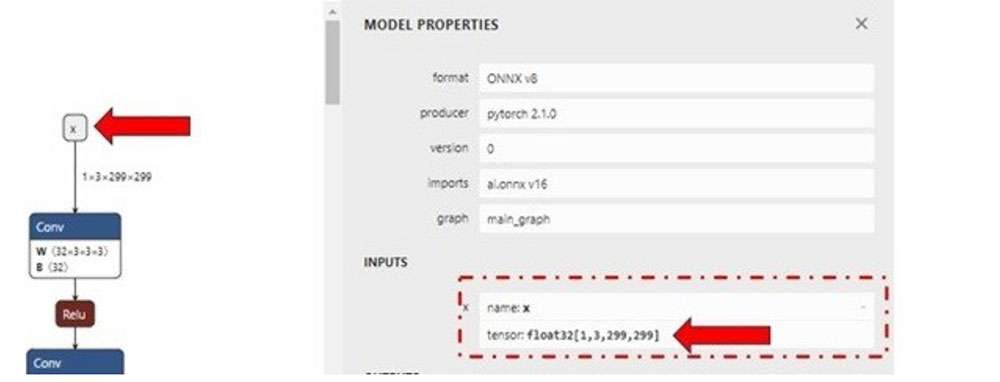

For demo purposes, we can evaluate the quantization process with random input files. The input file can be generated using a simple Python script shown below for the inception_v3.onnx model. Save the script as *generate_random_input.py* in your workspace *\~/models/* and run it using *python \~/models/generate_random_input.py* on your host machine.

The following example Python code creates an input_list that holds paths to calibration dataset images used to quantize the model.

```python
import os
import numpy as np
input_path_list =[]
BASE_PATH = "/tmp/RandomInputsForInceptionV3"
if not os.path.exists(BASE_PATH):
    os.mkdir(BASE_PATH)
# generate 10 random inputs and save as raw
NUM_IMAGES = 10
#binary files
for img in range(NUM_IMAGES):
    filename = "input_{}.raw".format(img)
    randomTensor = np.random.random((1, 299, 299, 3)).astype(np.float32)
    filename = os.path.join(BASE_PATH, filename)
    randomTensor.tofile(filename)
    input_path_list.append(filename)
#for saving as input_list text
with open("input_list.txt", "w") as f:
    for path in input_path_list:
        f.write(path)
        f.write(‘\n’)
```

The above script generates 10 sample input files saved in the */tmp/RandomInputsForInceptionV3* directory and an *input_list.txt* file that contains the path to each sample generated.

Now that all needed inputs to the snpe-dlc-quant tool are available, the model can now be quantized.

```python
${SNPE_ROOT}/bin/x86_64-linux-clang/snpe-dlc-quant --input_dlc ~/models/
inception_v3.dlc --output_dlc ~/models/inception_v3_quantized.dlc --
input_list ~/models/input_list.txt
```

This generates a quantized inception_v3 DLC model (inception_v3_quantized.dlc). By default, the model is quantized for INT8 bit width.

Developers can customize the quantization to use 16-bit instead of default INT8 by specifyin&#x67;**&#x20;**\[--act_bw 16] and/or \[--weight_bw 16] options to the snpe-dlc-quant tool.

Refer to the [snpe-dlc-quant ](https://docs.qualcomm.com/bundle/publicresource/topics/80-63442-2/tools.html)tool documentation, or run `snpe-dlc-quant --help` to view all available customizations including quantization modes, optimizations, etc.


##### Model optimization

Quantized model DLC requires a graph preparation step that optimizes the model for execution on HTP. To prepare the model DLC to execute on HTP, SNPE provides a snpe-dlc-graph-prepare tool that takes a quantized model and hardware-specific details, such as chipset, as input.

:::note

Optimizations for hardware, such as HTP, depend on the specific version of HTP present on the chipset. To ensure the correct set of optimizations are applied to the execution graph for optimal utilization of the HTP,  it is important to provide the correct chipset ID to the snpe-dlc-graph-prepare tool.
:::

Based on the HTP version and chipset ID, the tool creates a cache that contains an execution strategy to execute model DLC on the HTP hardware. Without this step, there will be additional overhead during network initialization as the SNPE runtime will have to create an execution strategy on the fly.

```python
${SNPE_ROOT}/bin/x86_64-linux-clang/snpe-dlc-graph-prepare --input_dlc ~/
models/inception_v3_quantized.dlc --output_dlc ~/models/
inception_v3_quantized_with_htp_cache.dlc --htp_socs qcs6490
```

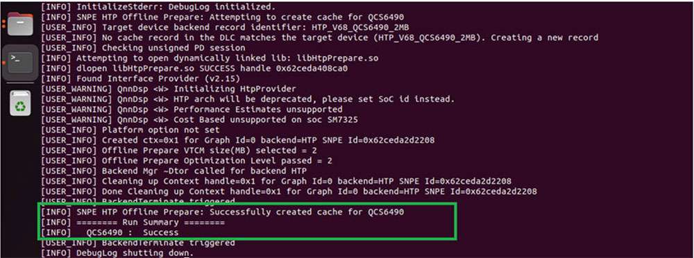

##### HTP Cache Information

Once the snpe-dlc-graph-prepare step is completed, the HTP cache record is added to the DLC. This cache information can be viewed using the snpe-dlc-info tool.

```python
${SNPE_ROOT}/bin/x86_64-linux-clang/snpe-dlc-info -i ~/models/
inception_v3_quantized_with_htp_cache.dlc
```


<a id="modeldeployment"></a>
##### Model deployment

A model DLC (quantized or non-quantized) can be deployed via a SNPE enabled app (an application written using SNPE C/C++ APIs). SNPE offers APIs to load a DLC, select a runtime to execute the model, and perform inference, etc.

SNPE provides a prebuilt [snpe-net-run](https://docs.qualcomm.com/bundle/publicresource/topics/80-63442-2/tools.html#snpe-net-run) tool (application written using C APIs) that can load an arbitrary model DLC and execute it on provided inputs.

* **Model file** – DLC model file generated by the SNPE converter tool or snpe-dlc-graph-prepare tool (if running on HTP).

* **Input list** – Text file, like the *input_list.txt&#x20;*&#x66;ile used during quantization, except input raw files in this list are used for inference. For simplicity in this example, the same input list used for quantization is used for inference.

* **Runtime** – User must select a specific runtime to execute the model on target. Available runtime options are CPU, GPU, and DSP (HTP).

:::note

See `snpe-net-run --help` for more details.
:::

**Run SNPE DLC on x86 host machine**

Converted SNPE DLC could be run using snpe-net-run tool which takes a DLC and input_list as arguments. The following command generates output files to */output_x86/*. Execution of SNPE DLC on x86 is purely for debugging purposes.

:::note

The default runtime in SNPE is CPU. When executing a model using snpe-net-run, there is no need to specify the CPU runtime.
:::

```python
${SNPE_ROOT}/bin/x86_64-linux-clang/snpe-net-run --container ~/models/
inception_v3.dlc --input_list ~/models/input_list.txt --output_dir ~/models/
output_x86
```

The above command loads model DLC and executes it on x86 CPU. Outputs from model execution will be written to the *output_x86* directory.


**Preparing SNPE model to run on target**

To run the model on target, snpe-net-run requires the model DLC, SNPE runtime libraries, and input list to run inferences to generate outputs.

:::note

Before running on target, please ensure that SNPE SDK binaries and libraries are pushed to the target.
:::

For RUBIK Pi 3, use the below artifacts from *$\{SNPE_ROOT\}/lib/aarch64-oe-linux-gcc11.2* and *$\{SNPE_ROOT\}/bin/aarch64-oe-linux-gcc11.2*.

| **File**                                       | **Source location**                         |
| ---------------------------------------------- | ------------------------------------------- |
| snpe-net-run                                   | $\{SNPE_ROOT\}/bin/aarch64-oe-linux-gcc11.2  |
| libSNPE.so                                     | $\{SNPE_ROOT\}/lib/aarch64-oe-linux-gcc11.2/ |
| libSnpeHtpPrepare.so                           | $\{SNPE_ROOT\}/lib/aarch64-oe-linux-gcc11.2  |
| libSnpeHtpV68Stub.so                           | $\{SNPE_ROOT\}/lib/aarch64-oe-linux-gcc11.2  |
| libSnpeHtpV68Skel.so                           | $\{SNPE_ROOT\}/lib/hexagon-v68/unsigned      |
| Inception_v3_quantized_with_htp_cache.dlc | \~/models                                   |
| Inception_v3.dlc                              | \~/models                                   |
| input_list.txt                                | \~/models                                   |
| Inception V3 sample input images               | /tmp/RandomInputsForInceptionV3             |

The following scp commands need to be executed on the host machine to copy SNPE SDK libraries and binaries to the device.

```bash
scp ${SNPE_ROOT}/bin/aarch64-oe-linux-gcc11.2/snpe-net-run root@[ipaddr]:/opt/
scp ${SNPE_ROOT}/lib/aarch64-oe-linux-gcc11.2/libSNPE.so root@[ip-addr]:/opt/
scp ${SNPE_ROOT}/lib/aarch64-oe-linux-gcc11.2/libSnpeHtpV68Stub.so root@[ip-addr]:/opt/
scp ${SNPE_ROOT}/lib/aarch64-oe-linux-gcc11.2/libSnpeHtpPrepare.so root@[ip-addr]:/opt/
scp ${SNPE_ROOT}/lib/hexagon-v68/unsigned/libSnpeHtpV68Skel.so root@[ip-addr]:/opt/

scp ~/models/inception_v3.dlc root@[ip- addr]:/opt/
scp ~/models/inception_v3_quantized_with_htp_cache.dlc root@[ip-addr]:/opt/
scp ~/models/input_list.txt root@[ip- addr]:/opt/
scp /tmp/RandomInputsForInceptionV3 root@[ip- addr]:/tmp/

ssh root@[ip-addr]

cd /opt
```

The above steps prepared the device for model execution. The following sections provide details on running the model on the available runtimes.

##### Run SNPE model on Arm CPU

Set up environment variables before executing the model to ensure SNPE binaries and libraries are accessible to run the model.

:::note

The default runtime in SNPE is CPU. When executing a model using snpe-net-run, there is no need to specify the CPU runtime.
:::

```python
export LD_LIBRARY_PATH=/opt:$LD_LIBRARY_PATH
export PATH=/opt/:$PATH
snpe-net-run --container inception_v3.dlc --input_list input_list.txt --
output_dir output_cpu
```

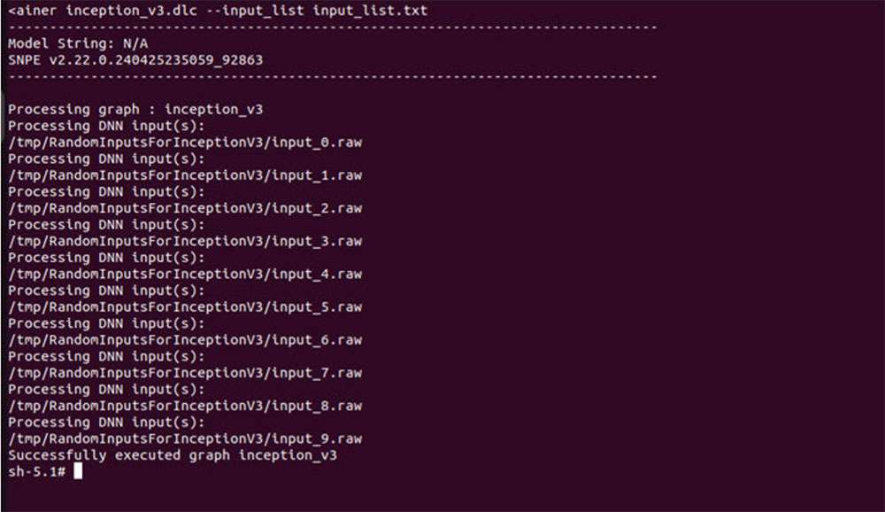

##### Run SNPE model on GPU

To run a model on the GPU runtime, use inception_v3.dlc and save outputs in *output_gpu*.

:::note

To run on GPU, specify the runtime via the `--use_gpu` command line argument.
:::

```python
export LD_LIBRARY_PATH=/opt:$LD_LIBRARY_PATH
export PATH=/opt:$PATH
snpe-net-run --container inception_v3.dlc --input_list input_list.txt --
output_dir output_gpu --use_gpu
```

##### Run SNPE model on HTP

To run a model on the HTP backend, use inception_v3_quantized_with_htp_cache.dlc model DLC and save outputs in *output_htp*.

:::note

To run on HTP, specify the runtime via the `--use_dsp` command line argument.
:::

```bash
export LD_LIBRARY_PATH=/opt:$LD_LIBRARY_PATH
export PATH=/opt:$PATH
export ADSP_LIBRARY_PATH="/opt;/usr/lib/rfsa/adsp;/dsp"
snpe-net-run --container inception_v3_quantized_with_htp_cache.dlc --
input_list input_list.txt --output_dir output_htp --use_dsp
```

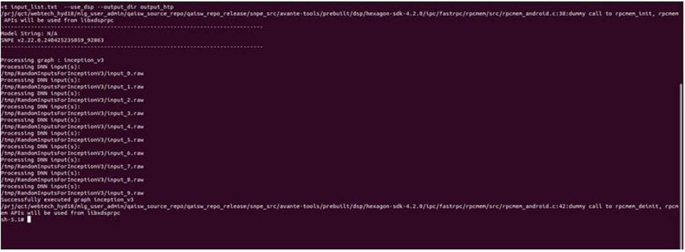

##### Validate output

For each input raw file fed to snpe-net-run (via the input_list file), an output folder is generated that contains output tensor saved as raw file(s) whose size will match the model’s output layer as shown in the image below.

:::note

The [Netron](https://netron.app/) tool was used to visualize the model.
:::

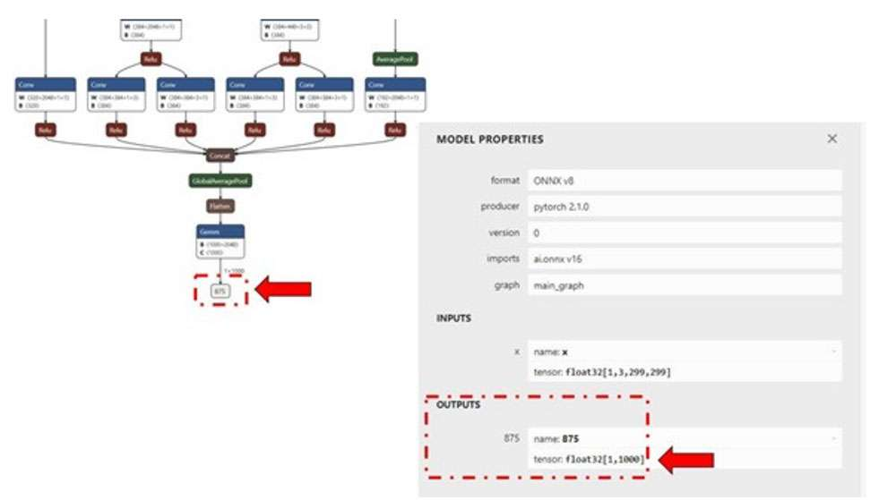

In the example of inception_v3, the output raw file is a binary file that contains probabilities for 1000 classification classes.

We use a Python script to read the file as a NumPy array to perform postprocessing, validation of the output. The example below checks whether the HTP prediction is the same as the CPU prediction. Copy the output files from the target device to the host machine so the outputs can be validated.

```python
ssh root@[ip-addr]
cd /opt/
scp -r /opt/output_cpu user@host-ip:<path>
scp -r /opt/output_htp user@host-ip:<path>
```

:::note

Please use *\<path>* from the above commands in the following (compare.py) Python script.
:::

Once outputs from on-device inference are copied to the host machine, prepare a script to load the output tensors saved within output_htp and output_cpu to compare. In this example, both output_htp and output_cpu were copied to the *\~/models* directory.

The following is an example comparing output from one of the example inputs used. In this example, outputs are saved to th&#x65;*&#x20;/opt* directory on the host machine. Outputs from snpe-net-run can be loaded into NumPy ndarrays using the numpy.fromfile(...) API.

:::note

By default, snpe-net-run saves the output tensors to NumPy files in float32 format.
:::

```python
# python postprocessing script (compare.py)
import numpy as np
htp_output_file_path = "<path>/output_htp/Result_1/875.raw"
cpu_output_file_path = "<path>/output_cpu/Result_1/875.raw"
htp_output = np.fromfile(htp_output_file_path, dtype=np.float32)
htp_output = htp_output.reshape(1,1000)
cpu_output = np.fromfile(cpu_output_file_path, dtype=np.float32)
cpu_output = cpu_output.reshape(1,1000)
# np.argmax gives the cls_id with highest probability from tensor.
cls_id_htp = np.argmax(htp_output)
cls_id_cpu = np.argmax(cpu_output)
# Let's compare CPU output vs HTP output
print("Cpu prediction {} \n Htp Prediction {}".format(cls_id_cpu, cls_id_htp))
```

**Output**


**Model deployment using SNPE APIs**

SNPE SDK provides C/C++ APIs to create/develop applications that run a model on chosen hardware (CPU, GPU, or HTP) with acceleration. A sample application that demonstrates SNPE C/C++ APIs to execute the model is provided [here](https://docs.qualcomm.com/bundle/publicresource/topics/80-63442-2/cplus_plus_tutorial.html).

### Qualcomm AI Engine Direct SDK

Qualcomm AI Engine Direct SDK (also known as QNN SDK) offers low-level APIs to achieve the best performance for AI workloads on Qualcomm platforms. QNN SDK supports models from frameworks, such as PyTorch, TensorFlow, and Onnx. QNN SDK provides offline tools to convert, quantize, optimize, and deploy models on Qualcomm hardware with acceleration.

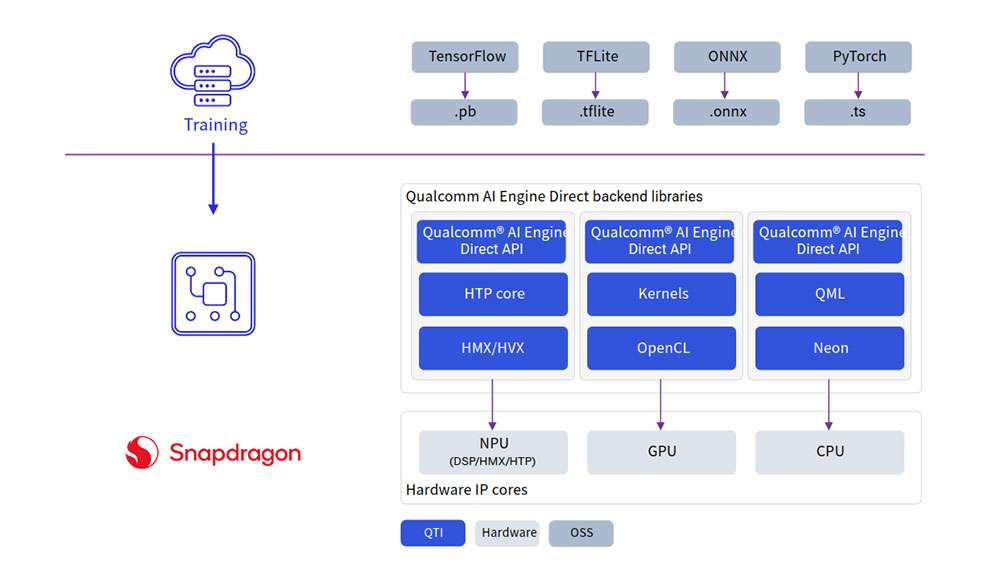

| **Setup**                                                                                                                                                                                                                                                        | **Customize**                                                                                                                                                                                                                                              | **Run Inference**                                                                                                | **API Reference**                                                                    |
| ---------------------------------------------------------------------------------------------------------------------------------------------------------------------------------------------------------------------------------------------------------------- | ---------------------------------------------------------------------------------------------------------------------------------------------------------------------------------------------------------------------------------------------------------- | ---------------------------------------------------------------------------------------------------------------- | ------------------------------------------------------------------------------------ |
|<p> [Install AI Engine Direct](#InstallAIEngineDirect)</p><p>[Set up Qualcomm AI Engine Direct](#SetupQualcommAIEngineDirect) </p>| <p>[Model conversion and quantization](#Modelconversionquantization)</p><p>[Model compilation](#Modelcompilation) </p>|<p>[Deploy model](#deploymodel)</p> | <p>[C/C++](https://docs.qualcomm.com/bundle/publicresource/topics/80-63442-50/api.html)</p> |

<a id="InstallAIEngineDirect"></a>
#### Install AI Engine Direct

Qualcomm AI Engine Direct SDK requires an Ubuntu 22.04 host machine.

:::note

If the host machine uses Windows or macOS operating system software, install a virtual machine following the steps provided in [Set up the Windows 11 development environment](./1.get-started.md#win11env), [Set up an Ubuntu Server VM on an Arm64 Mac using UTM](./1.get-started.md#arm64env), and [Set up an Ubuntu VM on an x86_64 Mac using UTM](./1.get-started.md#x86env). Subsequent steps must be run in the virtual machine running Ubuntu 22.04 LTS.
:::

The Qualcomm AI Engine Direct SDK workflow has been validated with Ubuntu 22.04 running on bare metal or inside a Virtual Machine in the following configurations.

:::note

Ubuntu 22.04 running inside a VM on macOS on Arm architecture is not supported.
:::

| **Download Method**                                                                                                          | **Prerequisites**                                             | **Version available**              |
| ---------------------------------------------------------------------------------------------------------------------------- | ------------------------------------------------------------- | ---------------------------------- |
| [Direct Download](#directdown)          | No prerequisites for download.                                | v2.22.6 (SDK updated everyquarter) |
| [Qualcomm Package Manager](#Qpackmg) | A valid Qualcomm ID is needed. Qualcomm Package Manager tool. | SDK updated every month.           |

<a id="directdown"></a>
##### Direct Download

AI Engine Direct SDK is available for direct download [here](https://softwarecenter.qualcomm.com/api/download/software/qualcomm_neural_processing_sdk/v2.22.6.240515.zip). Once downloaded, unzip the package.

:::note

The SDK version hosted at the above link is updated quarterly.          &#x20;
:::

```shell
unzip 2.22.6.240515.zip
cd qairt/2.22.6.240515/
export SNPE_ROOT=`pwd`
```

<a id="Qpackmg"></a>
##### Qualcomm Package Manager

AI Engine Direct SDK is available for download via Qualcomm Package Manager (QPM). This section demonstrates how to download AI Engine Direct SDK using QPM.

:::note

In order to download Qualcomm AI Engine Direct from Qualcomm Package Manager, ensure that you have registered for a Qualcomm ID. If you do not have a Qualcomm ID, you will be prompted to register. Then follow the instructions below to download and install the SDK.
:::

1. Go to [Qualcomm Package Manager](https://qpm.qualcomm.com/%23/main/) and log in using your Qualcomm ID.

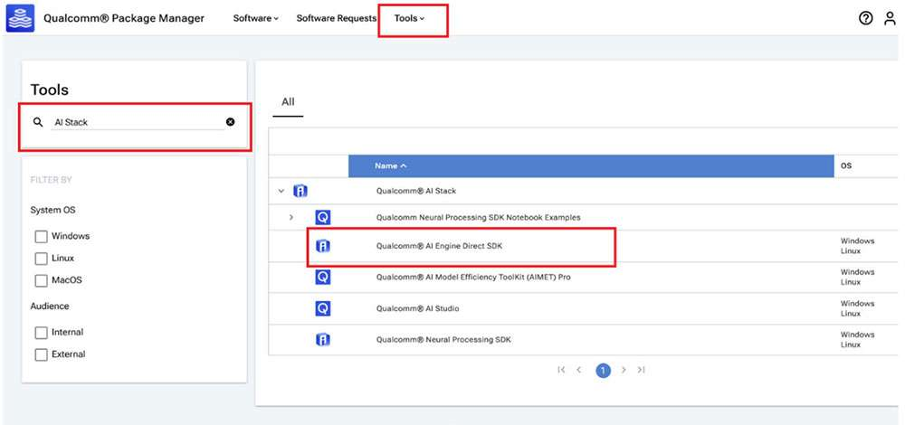

2. Click **AI Engine Direct SDK** to navigate to the next page. Choose **Linux&#x20;**&#x61;nd **Version 2.22.6.240515** from the drop-down lists and then click **Download** to download the AI Engine Direct SDK installer.

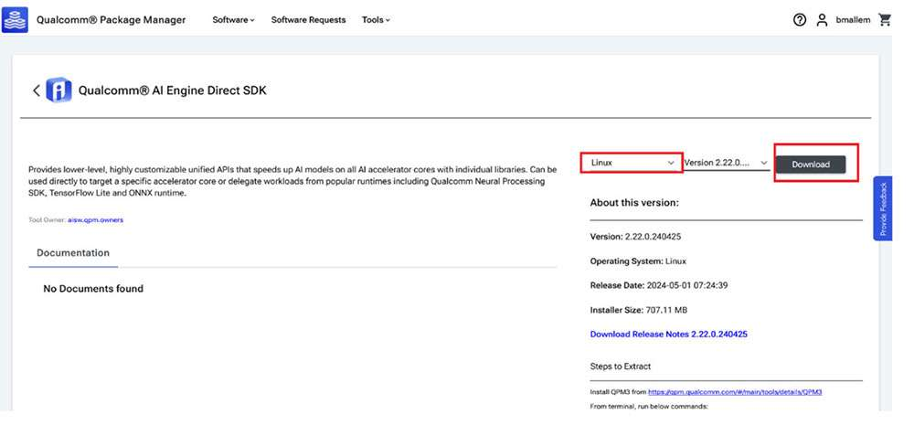

:::note

* These instructions use version 2.22.6.240515 as an example.&#x20;

* If using the Qualcomm Package Manager desktop tool, the **Extract** button will be present instead of download. This automatically installs the QNN SDK. &#x20;
:::

3. Install the downloaded installer (.qik) using the QPM CLI tool.

     1. Log in using QPM CLI.
 
     ```shell
     qpm-cli --login <username>
     ```

     

     2. Activate your SDK license.

     ```python
     qpm-cli --license-activate qualcomm_ai_engine_direct
     ```

     

     3. Extract and install the SDK.

     ```python
     qpm-cli --extract <path to downloaded .qik file>
     ```

     

<a id="SetupQualcommAIEngineDirect"></a>
#### Set up Qualcomm AI Engine Direct

**Set up SDK**

To use the AI Engine Direct SDK, the following Ubuntu OS and Python versions are required:

* Ubuntu 22.04

* Python 3.10

Refer to [AI Engine Direct SDK](https://docs.qualcomm.com/bundle/publicresource/topics/80-63442-50/setup.html) Setup for detailed setup instructions.

:::note

*$\{QNN_SDK_ROOT\}* refers to the installed AI Engine Direct SDK root path.&#x20;

* If downloaded via the direct download method, set *$\{QNN_SDK_ROOT\}* to the downloaded and unzipped SDK root directory.

* If installed via QPM, the root directory path is */opt/qcom/aistack/qairt/\<version>*. This example uses version 2.22.6.240515, so the path is: */opt/qcom/aistack/qairt/2.22.6.240515*.
:::

SDK setup steps are:

* Install [Linux platform dependencies](https://docs.qualcomm.com/bundle/publicresource/topics/80-63442-50/setup.html#linux-platform-dependencies)

* Install Python dependencies with `$\{QNN_SDK_ROOT\}/bin/check-python-dependency`

* Install Ubuntu packages with `sudo bash $\{QNN_SDK_ROOT\}/bin/check-linux-dependency.sh`

* Install ML frameworks that are required by your models (PyTorch, TensorFlow, ONNX). Refer to Frameworks for supported versions.

| **Framework** | **Version** |
| ------------- | ----------- |
| TensorFlow    | v2.10.1     |
| TFLite        | v2.3.0      |
| PyTorch       | v1.13.1     |
| ONNX          | v1.12.0     |

```shell
# Install tensorflow
pip install tensorflow==2.10.1
# Install tflite
pip install tflite==2.3.0
# Install PyTorch
pip install torch==1.13.1+cpu torchvision==0.14.1+cpu torchaudio==0.13.1 --
extra-index-url https://download.pytorch.org/whl/cpu
# Install Onnx
pip install onnx==1.12.0 onnxruntime==1.17.1 onnxsim==0.4.36
```

##### Set up environment

Source the environment setup script provided by QNN SDK to ensure all necessary tools and libraries are available in $PATH for the workflow.

```shell
source $\{QNN_SDK_ROOT\}/bin/envsetup.sh
```

#### QNN model porting

<a id="Modelconversionquantization"></a>
##### Model conversion and quantization

A pretrained FP32 model from PyTorch, Onnx, TensorFlow, or TFLite is input to the QNN converter tool qnn-\<framework>-converter to convert to a QNN graph representation in the form of a high-level readable C++ graph.

If accelerating the model on HTP, the model must be quantized. Model quantization can be done in the same step as conversion. A calibration dataset must be provided to perform this quantization step to perform static quantization.

To enable quantization along with conversion, use the --input_list INPUT_LIST option for static quantization. For more information, refer to the [quantization support ](https://docs.qualcomm.com/bundle/publicresource/topics/80-63442-50/quantization.html)documentation.

The following example uses an ONNX model (*inception_v3_opset16.onnx*) downloaded from the [ONNX Model Zoo](https://github.com/onnx/models/blob/main/Computer_Vision/inception_v3_Opset16_timm/inception_v3_Opset16.onnx). Download the model as inception_v3.onnx to your workspace. In this example, we download the model to th&#x65;*&#x20;\~/models* directory.

#### Model conversion only (for CPU backend)

To convert the model to run on x86/Arm CPU, run the following command to generat&#x65;*&#x20;inception_v3.cpp* and *inception_v3.bin.*

```shell
python $\{QNN_SDK_ROOT\}/bin/x86_64-linux-clang/qnn-onnx-converter --
input_network ~/models/inception_v3.onnx --output_path ~/models/
inception_v3.cpp --input_dim 'x' 1,3,299,299
```


The *inception_v3.cpp* file contains a high-level graph representation of the converted model. The *inception_v3.bin* file contains weights/biases from the model.

#### Model conversion and quantization (for HTP backend)

To run the model on HTP, the quantization step is required. For quantization in AI Engine Direct (QNN) SDK, a representative dataset of 50 to 200 images from a training dataset is provided to the QNN converter as a calibration dataset. The images in the calibration dataset are preprocessed (resized, normalized, etc.) and saved as NumPy arrays in .raw format. The size of these input .raw files must match the input size of the model.

:::note

Use the Netron graph visualization tool to identify the model’s input/output layer dimensions.
:::


For demonstration purposes, we can evaluate the quantization process with random input files. The input files can be generated using the Python script shown below for the inception_v3.onnx model. Save the script as *generate_random_input.py* i&#x6E;**&#x20;***\~/models* and run it using *python \~/models/generate_random_input.py.* The following Python code creates an input_list that contains the calibration dataset used to quantize the model.

```python
import os
import numpy as np
input_path_list =[]
BASE_PATH = "/tmp/RandomInputsForInceptionV3"
if not os.path.exists(BASE_PATH):
    os.mkdir(BASE_PATH)
# generate 10 random inputs and save as raw
NUM_IMAGES = 10
#binary files
for img in range(NUM_IMAGES):
    filename = "input_{}.raw".format(img)
    randomTensor = np.random.random((1, 299, 299, 3)).astype(np.float32)
    filename = os.path.join(BASE_PATH, filename)
    randomTensor.tofile(filename)
    input_path_list.append(filename)
#for saving as input_list text
with open("~/models/input_list.txt", "w") as f:
    for path in input_path_list:
        f.write(path)
        f.write('\n')
```

We can now run the following command to convert and quantize. By default, the model is quantized for INT8 bit width. You can specif&#x79;**&#x20;**\[--act_bw 16] and/o&#x72;**&#x20;**\[--weight_bw 16] for using INT16 quantization.

```bash
$\{QNN_SDK_ROOT\}/bin/x86_64-linux-clang/qnn-onnx-converter --input_network ~/
models/inception_v3.onnx --output_path ~/models/inception_v3_quantized.cpp --
input_list ~/models/input_list.txt --input_dim "x" 1,3,299,299
```

This generate&#x73;*&#x20;inception_v3_quantized.cpp* and *inception_v3_quantized.bin* files in the *\~/models&#x20;*&#x64;irectory. Refer to the[ qnn-\<framework>-converter ](https://docs.qualcomm.com/bundle/publicresource/topics/80-63442-50/tools.html)documentation or run `qnn-<framework>-converter --help` to view all available customizations to quantization, including quantization modes, optimizations, etc.

<a id="Modelcompilation"></a>
#### Model compilation

Once the conversion/quantization step is complete, qnn-model-lib-generator is used to compile the generated C++ graph into a shared object (.so) enabling the model to be dynamically loaded by an application to perform inference.&#x20;

For x86, the Clang compiler toolchain is used to compile the C++ graph into a .so library. For a Linux Embedded device such as RUBIK Pi 3, the appropriate compiler toolchain (aarch64-oe-linux-gcc11.2) must be used.

#### Compiling a model to run on x86

Generate a shared object model to run on an x86-based Linux machine with the following command. This generates inception_v3.so using the Clang-14 compiler toolchain to compile the C++ graph to a QNN model .so compatible with x86 host machines.

```shell
$\{QNN_SDK_ROOT\}/bin/x86_64-linux-clang/qnn-model-lib-generator -c ~/models/
inception_v3.cpp -b ~/models/inception_v3.bin -o ~/models/libs/ -t x86_64-
linux-clang
```


#### Compiling model to run on target

When compiling a model for on-device execution (aarch64 architecture), it is important to use the right cross-compiler toolchain to ensure the compiled shared object (.so) is compatible with the device OS.

The following steps install the cross-compiler toolchain required to compile a model cpp file to a .so library.

Make the following changes to the platform eSDK to ensure QNN tools work with the eSDK. The following instructions use the ESDK_ROOT environment variable set to the platform eSDK installation path.

1. Soft link *$ESDK_ROOT/tmp/sysroots/qcm6490* to *$ESDK_ROOT/tmp/sysroots/armv8a-oe-linux*.

```shell
ln -s $ESDK_ROOT/tmp/sysroots/qcm6490 $ESDK_ROOT/tmp/sysroots/armv8a-oe-linux
```

2. Soft link *$ESDK_ROOT/tmp/sysroots/x86_64&#x20;*&#x74;o *$ESDK_ROOT/tmp/sysroots/x86_64-qtisdk-linux*.

```shell
ln -s $ESDK_ROOT/tmp/sysroots/x86_64 $ESDK_ROOT/tmp/sysroots/x86_64-qtisdk-linux
```

3. Soft lin&#x6B;*&#x20;$ESDK_ROOT/tmp/sysroots/x86_64-qtisdk-linux/usr/bin/aarch64-qcom-linux* to *$ESDK_ROOT/tmp/sysroots/x86_64-qtisdk-linux/usr/bin/aarch64-oe-linux*.

```bash
ln -s $ESDK_ROOT/tmp/sysroots/x86_64-qtisdk-linux/usr/bin/aarch64-qcom-
linux $ESDK_ROOT/tmp/sysroots/x86_64-qtisdk-linux/usr/bin/aarch64-oe-linux
```

4. Soft link the cross-compiler *$ESDK_ROOT/tmp/sysroots/x86_64-qtisdk-linux/usr/bin/aarch64-oe-linux* as follows.

```bash
ln -s $ESDK_ROOT/tmp/sysroots/x86_64-qtisdk-linux/usr/bin/aarch64-oe-linux/
aarch64-qcom-linux-g++ $ESDK_ROOT/tmp/sysroots/x86_64-qtisdk-linux/usr/bin/
aarch64-oe-linux/aarch64-oe-linux-g++
ln -s $ESDK_ROOT/tmp/sysroots/x86_64-qtisdk-linux/usr/bin/aarch64-oe-linux/
aarch64-qcom-linux-objdump $ESDK_ROOT/tmp/sysroots/x86_64-qtisdk-
linux/usr/bin/aarch64-oe-linux/aarch64-oe-linux-objdump
ln -s $ESDK_ROOT/tmp/sysroots/x86_64-qtisdk-linux/usr/bin/aarch64-oe-linux/
aarch64-qcom-linux-objcopy $ESDK_ROOT/tmp/sysroots/x86_64-qtisdk-
linux/usr/bin/aarch64-oe-linux/aarch64-oe-linux-objcopy
```

5. Export the following environmental variable to point QNN to the cross-compiler:

```shell
export QNN_AARCH64_LINUX_OE_GCC_112=$ESDK_ROOT/tmp/
```

#### Compiling a model to run on Arm CPU

Once the cross-compiler is setup, use the following command to generate *libinception_v3.so* in *\~/model/libs/aarch64-oe-linux-gcc11.2*. We can provide this location to the qnn-model-lib-generator tool via a command-line argument.

:::note

The compiler toolchain used here is: aarch64-oe-linux-gcc11.2.
:::

```shell
$\{QNN_SDK_ROOT\}/bin/x86_64-linux-clang/qnn-model-lib-generator -c ~/models/
inception_v3.cpp -b ~/models/inception_v3.bin -o ~/models/libs -t aarch64-oe-
linux-gcc11.2
```

#### Compiling a model to run on HTP

For running the model on HTP, the following command generates *libinception_v3_quantized.so* in *\~/models/libs/aarch64-oe-linux-gcc11.2*.

:::note

The compiler toolchain used here is: aarch64-oe-linux-gcc11.2.
:::

```shell
$\{QNN_SDK_ROOT\}/bin/x86_64-linux-clang/qnn-model-lib-generator -c ~/models/
inception_v3_quantized.cpp -b ~/models/inception_v3_quantized.bin -o ~/models/
libs/ -t aarch64-oe-linux-gcc11.2
```

<a id="deploymodel"></a>
#### Deploy model

A model .so (quantized or non-quantized) can be deployed via a QNN enabled app (an application written using QNN C/C++ APIs). QNN offers APIs to load a model .so dynamically and run the model on hardware with the selected backend.

QNN provides a prebuilt tool ([qnn-net-run](https://docs.qualcomm.com/bundle/publicresource/topics/80-63442-50/tools.html#qnn-net-run)) that can dynamically load this model .so and perform inference on a selected backend using provided inputs.

For CPU, GPU, or HTP execution, qnn-net-run requires three arguments:

* **Model file&#x20;**– .so file generated by qnn-model-lib-generator

* **Backend file** – .so file for the targeted backend

  * *libQnnCpu.so* for the CPU backend.

  * *libQnnGpu.so* for the GPU backend.

  * *libQnnHtp.so* for the HTP backend.

* **Input list** - Text file like the *input_list.txt* file used during quantization, except input raw files in this list are used for inference. For simplicity in this example, we use the same input list used for quantization for inference.

##### Run QNN model on x86 backend

To run a model on x86 CPU, qnn-net-run requires the model .so, backend library .so, and input list to run inferences to generate outputs.

For example, the following command loads the libinception_v3.so model and runs the model on x86 CPU. Upon completion of execution, the qnn-net-run tool writes output files to *\~/models/output_x86*.

```bash
$\{QNN_SDK_ROOT\}/bin/x86_64-linux-clang/qnn-net-run --model ~/models/libs/
x86_64-linux-clang/libinception_v3.so --backend $\{QNN_SDK_ROOT\}/lib/x86_64-
linux-clang/libQnnCpu.so --input_list input_list.txt --output_dir ~/models/
output_qnn_x86
```

##### Prepare QNN model to run on device

Before running on target, ensure that QNN binaries and libraries are pushed to the target along with the models and input files.

For RUBIK Pi 3, use artifacts from *$\{QNN_SDK_ROOT\}/bin/aarch64-oe-linux-gcc11.2* and *$\{QNN_SDK_ROOT\}/lib/aarch64-oe-linux-gcc11.2.*

| **File**                       | **Source location**                                         |
| ------------------------------ | ----------------------------------------------------------- |
| qnn-net-run                    | $\{QNN_SDK_ROOT\}/bin/aarch64-oe-linux-gcc11.2              |
| libQnnHtp.so                   | $\{QNN_SDK_ROOT\}/lib/aarch64-oe-linux-gcc11.2/libQnnHtp.so |
| libQnnCpu.so                   | $\{QNN_SDK_ROOT\}/lib/aarch64-oe-linux-gcc11.2/libQnnCpu.so |
| libQnnGpu.so                   | $\{QNN_SDK_ROOT\}/lib/aarch64-oe-linux-gcc11.2/libQnnGpu.so |
| libQnnHtpPrepare.so            | $\{QNN_SDK_ROOT\}/lib/aarch64-oe-linux-gcc11.2              |
| libQnnHtpV68Stub.so            | $\{QNN_SDK_ROOT\}/lib/aarch64-oe-linux-gcc11.2              |
| libinception_v3_quantized.so | \~/models/libs/aarch64-oe-linux-gcc11.2                     |
| libinception_v3.so            | \~/models/libs/aarch64-oe-linux-gcc11.2                     |
| libQnnHtpV68Skel.so            | $\{QNN_SDK_ROOT\}/lib/hexagon-v68/unsigned                  |
| libqnnhtpv68.cat               | $\{QNN_SDK_ROOT\}/lib/hexagon-v68/unsigned                  |
| libQnnSaver.so                 | $\{QNN_SDK_ROOT\}/lib/hexagon-v68/unsigned                  |
| libQnnSystem.so                | $\{QNN_SDK_ROOT\}/lib/hexagon-v68/unsigned                  |

```bash
scp $\{QNN_SDK_ROOT\}/bin/aarch64-oe-linux-gcc11.2/qnn-* root@[ip-addr]:/opt/
scp $\{QNN_SDK_ROOT\}/lib/aarch64-oe-linux-gcc11.2/libQnn*.so root@[ip-addr]:/opt/
scp $\{QNN_SDK_ROOT\}/lib/hexagon-v68/unsigned/* root@[ip-addr]:/opt/
scp ~/models/libs/aarch64-oe-linux-gcc11.2/* root@[ip-addr]:/opt/
scp ~/models/input_list.txt root@[ip-addr]:/opt/
scp /tmp/RandomInputsForInceptionV3 root@[ip-addr]:/tmp/
ssh root@[ip-addr]
cd /opt/
```

##### Run QNN model on Arm CPU

When executing a model on an Arm-based CPU, qnn-net-run requires the model .so (for RUBIK Pi 3 target, the .so must be cross-compiled with the aarch64-oe-linux-gcc11.2 toolchain), backend .so library, and input list to run inference to generate outputs.

For example, the following command writes output files to */opt/output_cpu*.

```shell
export LD_LIBRARY_PATH=/opt/:$LD_LIBRARY_PATH
export PATH=/opt:$PATH
qnn-net-run --model libinception_v3.so --backend libQnnCpu.so --input_list
input_list.txt --output_dir output_cpu
```

##### Run QNN model on GPU

When executing a model on Adreno GPU, qnn-net-run requires the model .so, backend .so library (libQnnGpu.so), and input list to run inference to generate outputs.

For example, the following command writes output files to */opt/output_gpu*.

```python
export LD_LIBRARY_PATH=/opt/:$LD_LIBRARY_PATH
export PATH=/opt:$PATH
qnn-net-run --model libinception_v3.so --backend libQnnGpu.so --input_list
input_list.txt --output_dir output_gpu
```

##### Run QNN model on HTP backend

To run a model on HTP backend, use the libquantized_inception_v3.so library and libQnnHtp.so backend library and save outputs in the *output_htp&#x20;*&#x64;irectory.

```bash
export LD_LIBRARY_PATH=/opt/:$LD_LIBRARY_PATH
export PATH=/opt:$PATH
export ADSP_LIBRARY_PATH="/opt/;/usr/lib/rfsa/adsp;/dsp"
qnn-net-run --model libinception_v3_quantized.so --backend libQnnHtp.so --
input_list input_list.txt --output_dir output_htp
```

##### Validate output

For each input raw file fed to qnn-net-run(via the input_listfile), an output folder is generated that contains output raw file(s) whose size will match the model’s output layer as shown in the image below. ([Netron](https://netron.app/), tool used for visualizing the model)


For this example, inception_v3, the output raw file is a binary file that contains probability for 1000 classification classes.

We use a Python script to read the file as a NumPy array to perform postprocessing, validation of the output. The example below checks whether the HTP prediction is the same as the CPU prediction.

```python
ssh root@[ip-addr]
cd /opt/
scp -r /opt/output_cpu user@host-ip:<path>
scp -r /opt/output_htp user@host-ip:<path>
```

:::note

Use the *\<path>* from the above commands in the following Python script.
:::

Once the outputs from the qnn-net-run tool are copied from the device to the host machine, we can create a simple Python script to load outputs from CPU and HTP execution and compare them using NumPy.

```python
#python postprocessing script (compare.py)
import numpy as np
htp_output_file_path = "<path>/output_htp/Result_1/875.raw"
cpu_output_file_path = "<path>/output_cpu/Result_1/875.raw"
htp_output = np.fromfile(htp_output_file_path, dtype=np.float32)
htp_output = htp_output.reshape(1,1000)
cpu_output = np.fromfile(cpu_output_file_path, dtype=np.float32)
cpu_output = cpu_output.reshape(1,1000)
cls_id_htp = np.argmax(htp_output)
cls_id_cpu = np.argmax(cpu_output)
# Let's compare CPU output vs HTP output
print("CPU prediction {} \n HTP prediction {}".format(cls_id_cpu, cls_id_htp))
```

Output


##### Model Deployment using QNN APIs

Qualcomm AI Engine Direct SDK provides C/C++ APIs to create/develop applications that can load a compiled .so model and execute it on a chosen backend (CPU, GPU, or HTP) with acceleration. A sample application that demonstrates SNPE C/C++ APIs to execute the model is provided [here](https://docs.qualcomm.com/bundle/publicresource/topics/80-63442-50/sample_app.html).