import Tabs from '@theme/Tabs';
import TabItem from '@theme/TabItem';

# 1. Get Started

## 1.1 Introduction

RUBIK Pi 3 is developed based on the Qualcomm QCS6490 processor which features the Qualcomm® Kryo™ 670 CPU and the Qualcomm® Hexagon™ Processor with fused AI-accelerator architecture. The processor provides exceptional AI performance of 12.5 TOPS and offers the capability for various machine learning and AI application scenarios.

RUBIK Pi 3 is designed with a wide range of interfaces and functions, such as USB, camera, DisplayPort, HDMI, Ethernet, a 3.5mm headphone jack, Wi-Fi, Bluetooth, M.2 connector, fan, RTC, and a 40-pin LS connector. These features cater to diverse development needs while facilitating rapid development and efficient debugging. RUBIK Pi 3 is compatible with various systems, such as Qualcomm Linux, Canonical Ubuntu for Qualcomm Platforms\*, and Android 13, providing developers with the flexibility to meet their specific application needs.


\*Canonical Ubuntu for Qualcomm Platforms is in the planning phase

## 1.2 Specifications

| Category          | RUBIK Pi 3 Feature                                                           |
|-------------------|------------------------------------------------------------------------------|
| SoC               | QCS6490                                                                      |
| Processor         | <p>1 x Cortex-A78 2.7 GHz</p> <p>3 x Cortex-A78 2.4 GHz</p> 4 x Cortex-A55 1.9 GHz|
| GPU               | Adreno 643 GPU @ 812 MHz                                                     |
| VPU               | Adreno 633 VPU                                                               |
| NPU               | 12.5 TOPS                                                                    |
| ISP               | Spectra ISP capable of terminal-side machine learning and machine processing |
| RAM               | 8 GB LPDDR4x                                                                 |
| ROM               | 128 GB UFS 2.2                                                               |
| Wi-Fi & Bluetooth | Wi-Fi 5 and Bluetooth 5.2                                                    |
| Camera            | 2 x 4-lane MIPI CSI D-PHY connector                                          |
| USB               | <p>1 x USB Type-C (USB3.1 Gen1)</p> <p>2 x USB3.0</p> 1 x USB2.0             |
| GPIOs             | 28 GPIO pins                                                                 |
| Ethernet          | 1000M                                                                        |
| M.2 connector     | M.2 Key M 2280 (PCIe3.0 2-lane)                                              |
| Audio             | 3.5mm headphone jack                                                         |

## 1.3 Preparations

- Computer running Windows 10 and later, or Ubuntu 18 and later
- RUBIK Pi 3
- USB Type-A to Type-C cable
- USB Type-A to Micro USB cable
- Power supply (12V 3A Type-C)

### 1.3.1 Install drivers

#### 1.3.1.1 Install drivers in a Windows environment

##### 1.3.1.1.1 Install QUD

1. Click https://github.com/rubikpi-ai/tools/blob/main/qud/qud.win.1.1_installer_10061.1.zip to download the installation package.

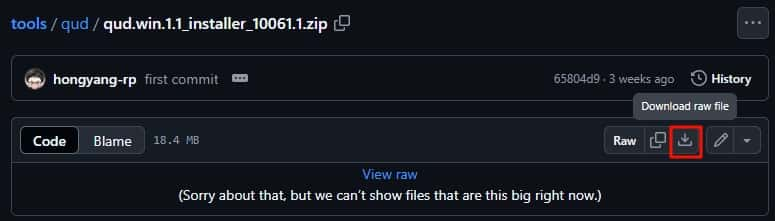

2. Decompress *qud.win.1.1_installer_10061.1.zip*, run *setup.exe* as shown in the following figure, and click **Next**.

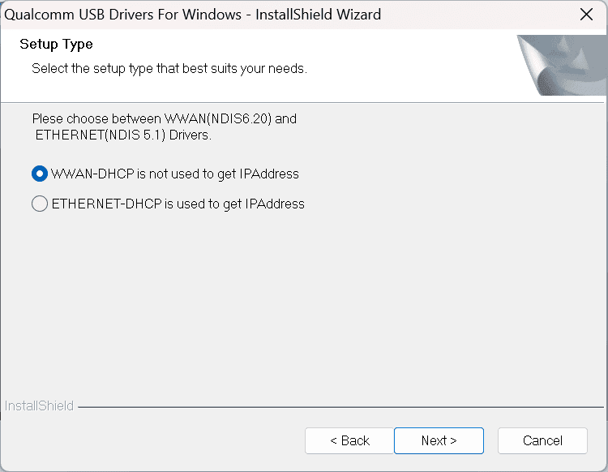

3. Click **Next**.


4. Select the **I accept the terms in the license agreement** option and click **Next**.

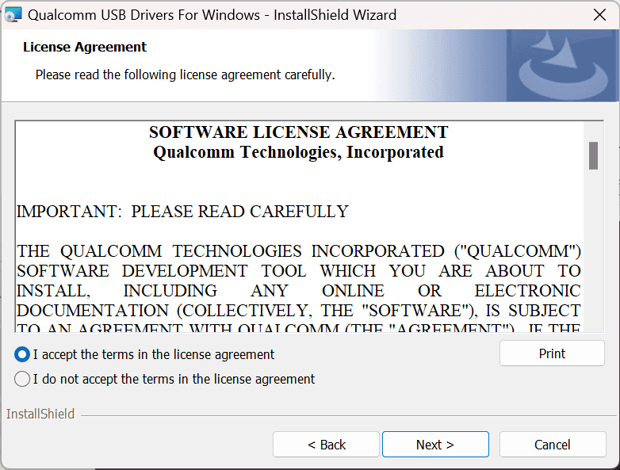

5. Click **Install**.

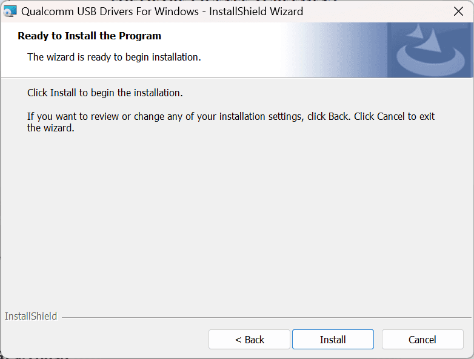

6.  Click **Finish** to complete the driver installation.

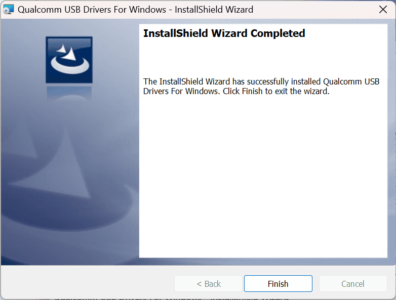

##### 1.3.1.1.2 Install Tflash

1.  Click https://github.com/rubikpi-ai/tools/blob/main/tflash/windows/TflashSetup_v1.2.0.4.exe to download the installation package.


2.  Run *TflashSetup_v1.2.0.4.exe*. Select the desired language and click **OK**.

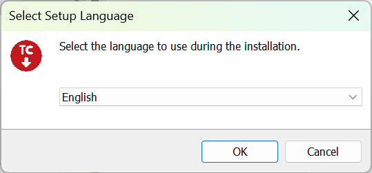

3.  Select the location where you want to install Tflash and click **Next**.


4.  Click **Next**.


5.  Select the **Create a desktop shortcut** option and click **Next**.


6.  Click **Install**.


7.  Select the **Launch Tflash** option and click **Finish**.


8.  If the following error message appears, click **Yes**. Follow the instructions to download the required installation package.


9.  Double-click the package you downloaded and click **Install**.


10.  Click **Close** to complete the installation.


11.  After the installation is completed, the following Tflash icon will appear on your desktop and in the Start menu.

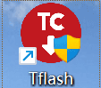

#### 1.3.1.2 Install drivers in an Ubuntu environment

##### 1.3.1.2.1 Install Tflash

1.  Click https://github.com/rubikpi-ai/tools/blob/main/tflash/ubuntu/Thundercomm-tflash-v1.0.0.deb to download the installation package.


2.  Run the following command to install Tflash.

 ```Shell showLineNumbers  
    sudo dpkg -i Thundercomm-tflash-v1.0.0.deb
 ```

3.  After the installation is completed, run the `tflash` command in the terminal. If the following message appears, it indicates that Tflash has been successfully installed:

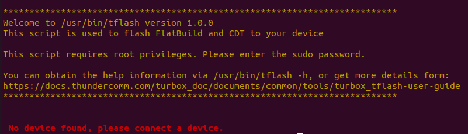

### 1.3.2 Download images

RUBIK Pi 3 comes with a pre-installed Linux image for a quick out-of-the-box experience. If you need the latest version of the Linux image or other operating system images, please visit the official website https://www.thundercomm.com/product/rubik-pi/ to download.

Visit GitHub to download the Linux source code at https://github.com/rubikpi-ai as needed.

- Qualcomm Linux is a simplified desktop system based on Weston. It is suitable for developers who have Linux development experience and seek an in-depth development experience.


- Canonical Ubuntu for Qualcomm Platforms (under development) is a comprehensive system built on Ubuntu 24. The system provides more desktop applications, a better user experience, and a wealth of development resources. It is suitable for developers seeking an efficient development environment.
- Android 13 is an enhanced system based on Google AOSP, offering an improved experience for developers working on Android applications.


### 1.3.3 Flash images


Before flashing images, enter the flash mode (9008 mode) using one of the following methods:

<Tabs>
<TabItem value="methed1" label="Method 1" default>
1. Connect the power supply into port 10.


2. Press and hold the **[EDL]** button (No. 12).


3. Insert the Type-C cable into port 5 and wait for three seconds to enter 9008 mode.


</TabItem>
<TabItem value="methed2" label="Method 2">

1.  Insert the power supply into port 10.


2.  Insert the Type-C cable into port 5.

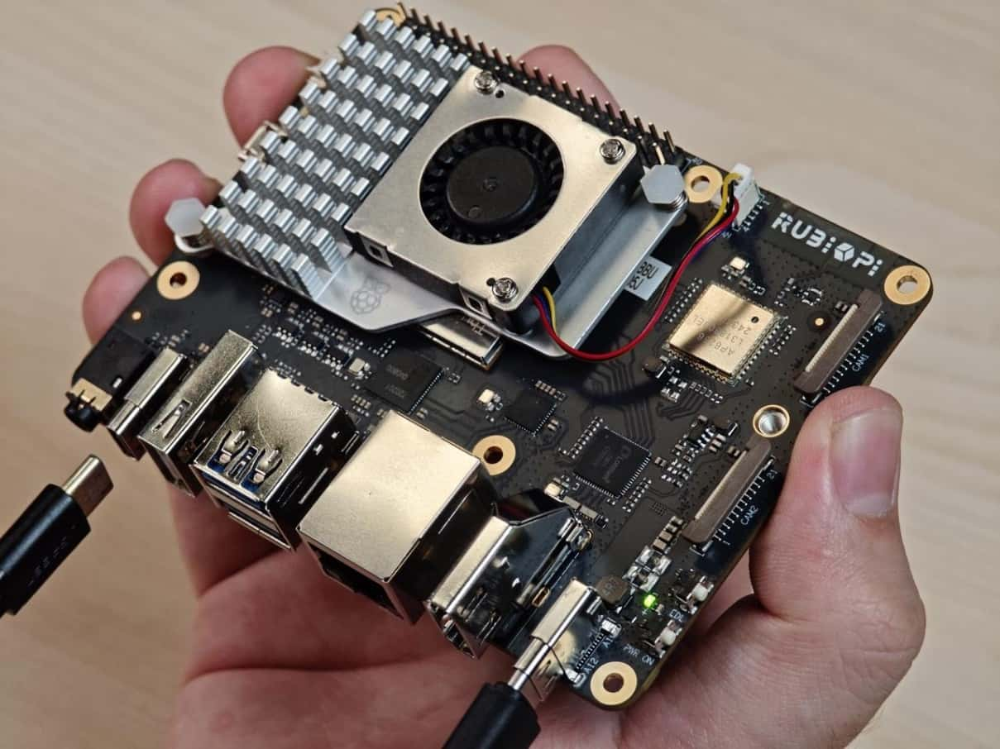

3.  After RUBIK Pi 3 boots up, run the following command to enter 9008 mode.

``` Shell  
    adb shell reboot edl
```
</TabItem>
<TabItem value="methed3" label="Method 3">

1.  Connect the power supply into port 10.


2.  Press and hold the **[EDL]** button (No. 12).


3.  Press and hold the **[PWR ON]** button (No.11) and wait for three seconds.


4.  Insert the Type-C cable into port 5 to enter 9008 mode.

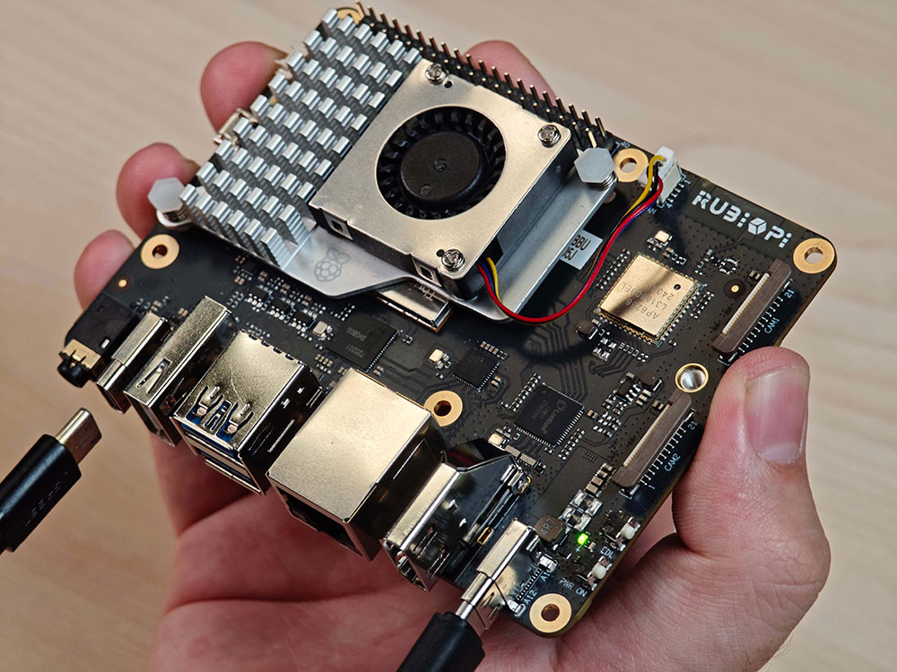
</TabItem>
</Tabs>

#### 1.3.3.1 Flash images on a Windows system

1.  Open the Tflash software. Make sure the device is in 9008 mode, as shown in the following figure:


2.  Select the **Storage Type** of the device to be flashed. For RUBIK Pi 3, select **UFS** for **Storage Type**.

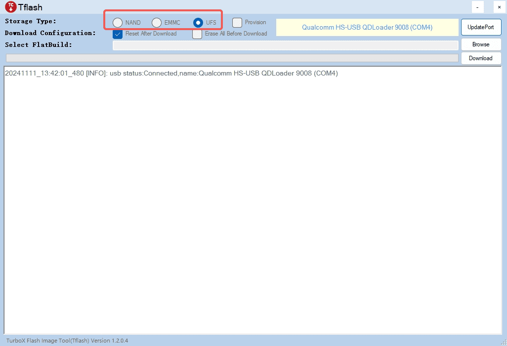

3.  Select **Reset After Download** or **Erase All Before Download** as needed. Exercise caution when selecting **Erase All Before Download**.


-  Reset After Download: When this option is selected, the device will reboot automatically after image flashing is completed.
-  Erase All Before Download: When this option is selected, the data in each RUBIK Pi UFS partition will be erased before flashing.

 :::warning

-   The **Erase All Before Download** option takes effect only when the UFS partitions are the same before and after flashing.
-   Selecting **Reset After Download** or **Erase All Before Download** is not a mandatory action. You are not required to select one of them.
:::
4.  Flash the FlatBuild image.

     a.  Click **Browse**.


     b.  Go to the FlatBuild directory, select *Programmer File*, and select *prog_firehose_ddr.elf*.

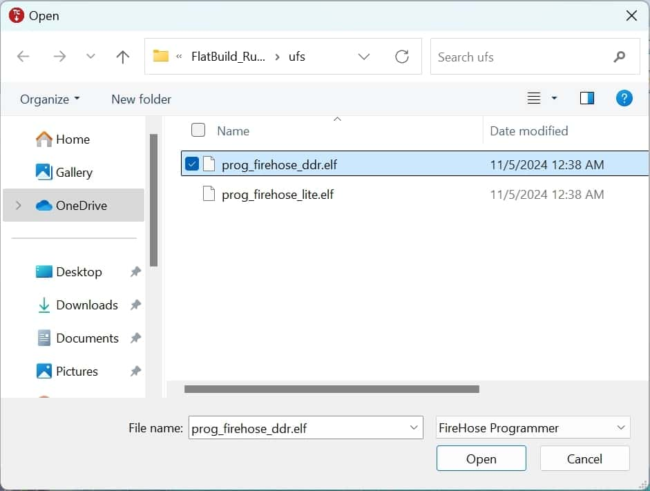

     c.  Select all .xml files whose names start with "rawprogram".


     d.  Select all .xml files whose names start with "patch".


After the above settings, the related information will be displayed in the Tflash interface.


     e.  Click **Download** to start flashing.


:::tip

The flashing time varies from computer to computer. The green progress bar shows the flashing progress.
:::

After images are successfully flashed, the following logs will be displayed:


- If you have selected **Reset After Download**, the board will reboot automatically after flashing.
- If you have not selected **Reset After Download**, disconnect the power cable and USB cable to power off RUBIK Pi 3, then reconnect the power cable and press the **[PWR ON]** button to start RUBIK Pi 3.


#### 1.3.3.2 Flash images on an Ubuntu system

1.  Go to the FlatBuild package directory.
2.  Run `tflash -r`.

    :::tip

    Run the `tflash -h` command to view more parameters. `-r` in the above command indicates restarting your RUBIK Pi 3 after flashing is completed.
    :::

3.  When "Stop the ModemManager on your host PC and press Enter on your keyboard to continue..." appears on the screen, press **Enter** to flash images.


If the following information is displayed after the tflash operation, it indicates that flashing was successful.

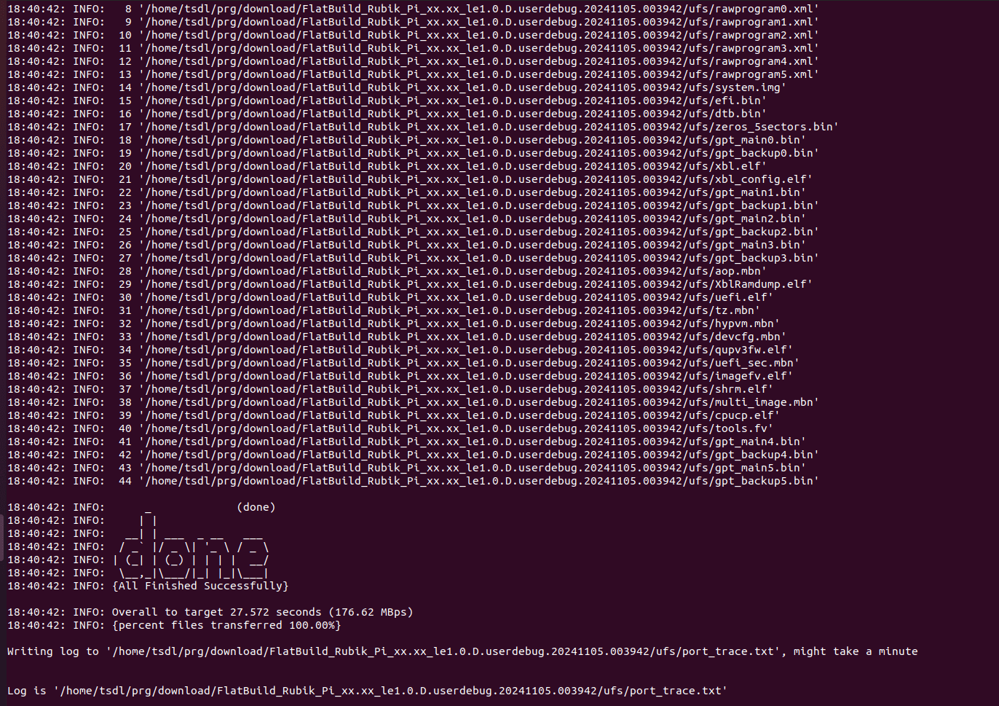

:::tip

When running tflash on your PC, enter the sudo password as prompted. The password is the login password for the PC.
:::

4.  After successful image flashing by using the `-r` parameter, RUBIK Pi 3 automatically reboots.

## 1.4 Power-on

Connect the power supply and press the **[PWR ON]** button to power on RUBIK Pi 3.


## 1.5 Power-off

Run the `poweroff` command to power off RUBIK Pi 3.

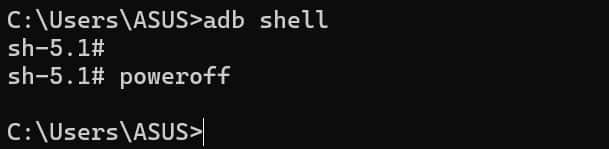

## 1.6 Reboot

-   Run the `reboot` command.


-   Press and hold the **[PWR ON]** button for 12 seconds to reboot RUBIK Pi 3.


## 1.7 Serial port login

### 1.7.1 Windows

1.  Connect port 2 in the following figure to a computer via a serial cable.


2.  Open the computer settings page, check the corresponding COM port in Device Manager, and record the port.


3.  Download MobaXterm at https://mobaxterm.mobatek.net/ and decompress to use it.


4.  Open MobaXterm, select **Session** \> **Serial**, and set the baud rate of the serial port to 115200.


5.  Click **OK**. Press **Enter** and type your login name and the default login password to log in:
-   Qualcomm Linux

    Login account: root  
    Login password: rubikpi

:::tip

    You can run the `passwd` command to change the default password. For example:
    

```Shell showLineNumbers  
    passwd root
```

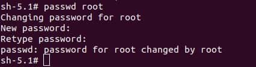
:::

### 1.7.2 Ubuntu

1.  Connect port 2 in the following figure to a computer via a serial cable.


2.  Run the following commands to install minicom:

```Shell showLineNumbers  
    sudo apt update  
    sudo apt install minicom
```

3.  Run the following command to check the USB port:

```Shell showLineNumbers  
    ls /dev/ttyACM*
```


4.  Run the following command to open minicom. Press **Enter** and type your login name and the default login password to log in:

```Shell showLineNumbers  
    sudo minicom -D /dev/ttyACM0 -b 115200
```

-  Qualcomm Linux

    Login account: root  
    Login password: rubikpi

:::tip

    You can run the `passwd` command to change the default password. For example:

```Shell showLineNumbers  
    passwd root
```


:::

## 1.8 ADB login

### 1.8.1 Windows

#### 1.8.1.1 Preparations

1.Download the ADB and Fastboot installation package at https://developer.android.google.cn/tools/releases/platform-tools and decompress the package.


2.Right-click **This PC** and choose **Properties**. Click **Advanced** and click **Environment Variables**. Alternatively, right-click **This PC** and choose **Properties**. In the search bar, type **Advanced system settings** and click **Environment Variables**.


3.Under **System variables**, select **Path** and click **Edit**.


4.Click **New** and type the path of decompressed platform-tools in Step 1. Click **OK** to save the environment variable.

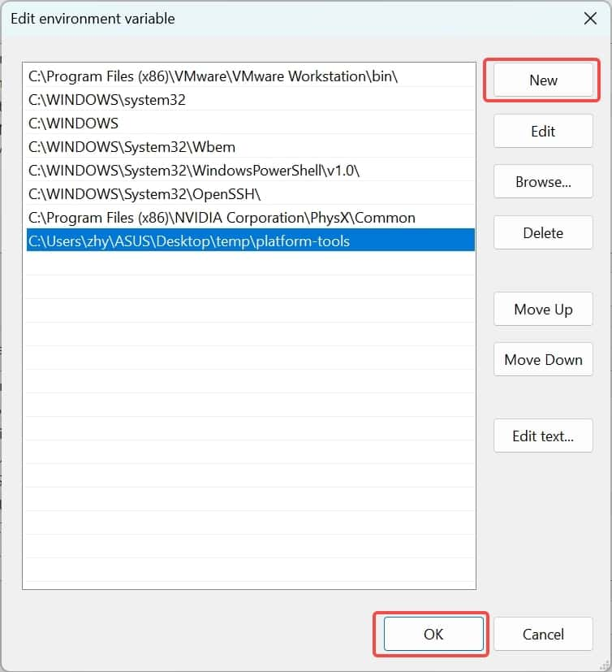

#### 1.8.1.2 ADB login

Press **Win**+**R** and type "CMD" to open the Windows terminal. Run the following commands to log in to your RUBIK Pi 3:

```Shell showLineNumbers  
adb devices # Check if devices are connected  
adb root    # Log in as root user  
adb shell   # Open the adb terminal
```


### 1.8.2 Ubuntu

#### 1.8.2.1 Preparations

1.Run the following command to install the ADB and Fastboot tools:

    ```Shell showLineNumbers  
    sudo apt install git android-tools-adb android-tools-fastboot wget
    ```

2.Update the udev rules file.

     a.Run the following command to open and modify the *51-qcom-usb.rules* file.

```Shell showLineNumbers  
    sudo vi /etc/udev/rules.d/51-qcom-usb.rules
```

     b.Add the following content to the file. If the following content already exists, skip this step.

```Shell showLineNumbers  
    SUBSYSTEMS=="usb", ATTRS{idVendor}=="05c6", ATTRS{idProduct}=="9008", MODE="0666", GROUP="plugdev"
```

     c.Run the following command to restart `udev`.

```Shell showLineNumbers  
    sudo systemctl restart udev
```

:::note

    If RUBIK Pi 3 is already connected to the PC via USB, plug and unplug the USB cable to reconnect RUBIK Pi 3 so that the updated rules take effect.
:::

#### 1.8.2.2 ADB login

Run the following commands in the terminal to log in to your RUBIK Pi 3:

```Shell showLineNumbers  
adb devices # Check if devices are connected  
adb root    # Log in as root user  
adb shell   # Open the adb terminal
```


## 1.9 SSH login

### 1.9.1 Windows

1. Confirm the network connection.

     a.  To use SSH login, ensure the RUBIK Pi 3 is connected to the network and the host can successfully ping it. Run the following command to obtain the IP address of RUBIK Pi 3:

    ```Shell showLineNumbers  
    ifconfig
    ```

    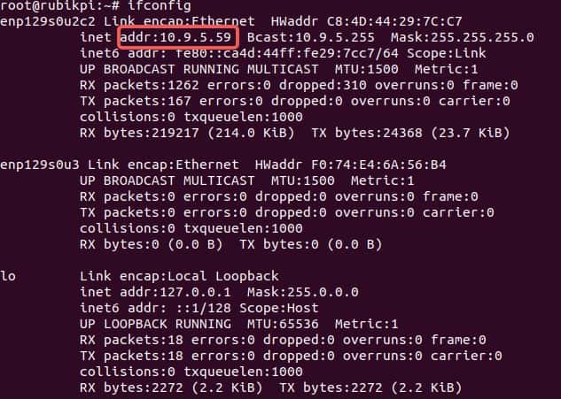

     b. Press **Win**+**R**, type "cmd" in the pop-up window, and click **OK**.

    

     c. Run the following command in the terminal and view the execution result.

    ```Shell showLineNumbers  
    ping 10.9.5.59
    ```


2. SSH login

     a. Open MobaXterm.

    

     b.  Click **Session** and select **SSH** in the pop-up window.

    

     c.  Type the IP address of the RUBIK Pi 3 you want to log in to and click **OK**.

    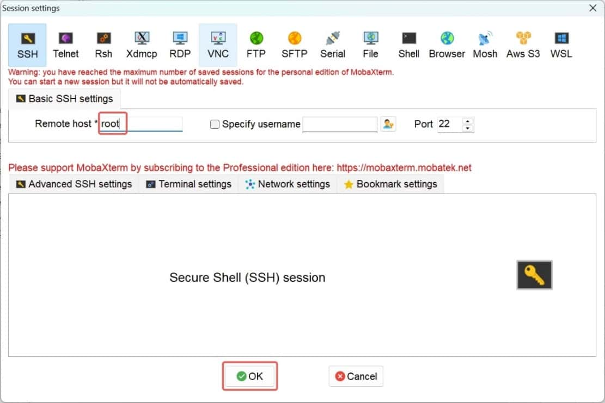

     d.  Type the username, press **Enter**, type the password, and press **Enter** to log in to RUBIK Pi 3.

    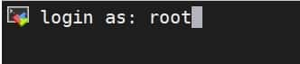

     e.  The following information indicates that the login is successful.

    

### 1.9.2 Ubuntu

1. Confirm the network connection.

     a.  To use SSH login, ensure the RUBIK Pi 3 is connected to the network and the host can successfully ping it. Run the following command to obtain the IP address of RUBIK Pi 3:

    ```Shell showLineNumbers  
    ifconfig
    ```

    

     b.  Run the following command in the Ubuntu terminal and view the execution result.

    ```Shell showLineNumbers  
    ping 10.9.5.59
    ```

    

2. SSH login

     a. Type the following command in the Ubuntu terminal and press **Enter**. root indicates the role you want to log in as. 10.9.5.59 indicates the IP address of RUBIK Pi 3.

    ```Shell showLineNumbers  
    ssh root@10.9.5.59
    ```

     b. Type the password and press **Enter**. The login succeeds.

    

## 1.10 File transfer

### 1.10.1 ADB

-   In the PC terminal, run the following command to upload the *test.txt* file to the */opt* directory:

```Shell showLineNumbers  
    adb push test.txt /opt
```

-   In the PC terminal, run the following command to download the *test.txt* file to your current directory:

```Shell showLineNumbers  
    adb pull /opt/test.txt ./
```

### 1.10.2 SCP

To use Secure Copy Protocol (SCP) transfer, ensure the RUBIK Pi 3 is connected to the network. For example, if the IP address of RUBIK Pi 3 is 10.9.5.59, run the following commands:

:::tip

Run the `ifconfig` command on RUBIK Pi 3 to obtain its IP address.


:::

-   In the PC terminal, run the following command to upload the *test.txt* file to the */opt* directory:

```Shell showLineNumbers  
    scp test.txt root@10.9.5.59:/opt
```

-   In the PC terminal, run the following command to download the *test.txt* file to your current directory:

```Shell showLineNumbers  
    scp root@10.9.5.59:/opt/test.txt ./
```

## 1.11 Set up the Ubuntu development environment

### 1.11.1 Install software

1. Run the following commands in the Ubuntu terminal to install the following software.

 ```Shell showLineNumbers  
    sudo apt update
    sudo apt install repo gawk wget git diffstat unzip texinfo gcc build-essential chrpath socat cpio python3 python3-pip python3-pexpect xz-utils debianutils iputils-ping python3-git python3-jinja2 libegl1-mesa libsdl1.2-dev pylint xterm python3-subunit mesa-common-dev zstd liblz4-tool locales tar python-is-python3 file libxml-opml-simplegen-perl vim whiptail bc
    sudo apt-get install lib32stdc++6 libncurses5 checkinstall libreadline-dev libncursesw5-dev libssl-dev libsqlite3-dev tk-dev libgdbm-dev libc6-dev libbz2-dev libffi-dev curl git-lfs
```

2. Run the following commands in the Ubuntu terminal to install Python 3.10.2. In the Linux kernel packaging process, the `python3.10` command is used. If you have installed Python 3.10.2 or later, skip this step.

```Shell showLineNumbers  
    python --version
    # Download it in a directory of your choice
    wget https://www.python.org/ftp/python/3.10.2/Python-3.10.2.tgz
    tar -xvf Python-3.10.2.tgz
    cd Python-3.10.2
    ./configure --enable-optimizations
    make
    sudo make install
```

3. Run the following command in the Ubuntu terminal to install pefile.

 ```Shell showLineNumbers  
    sudo pip3.10 install pefile
```

### 1.11.2 Install cross-compilation tools

1. Run the following commands in the Ubuntu terminal to download the cross-compilation toolchain for RUBIK Pi 3.

```Shell showLineNumbers  
    git clone https://github.com/rubikpi-ai/toolchains.git
    git lfs pull
```

2. Run the following commands in the Ubuntu terminal to install the cross-compilation toolchain.

```Shell showLineNumbers  
    cd toolchains
    ./qcom-wayland-x86_64-meta-toolchain-armv8-2a-qcm6490-toolchain-1.0.sh
```

3. Follow the prompts to install the cross-compilation environment, type the absolute path to the installation directory, and type "Y".

    

4. After the installation is completed, go to the installation directory and run the following command to set up the cross-compilation environment

 ```Shell showLineNumbers  
    source environment-setup-armv8-2a-qcom-linux
```

5. Run the following command in the Ubuntu terminal to check the version of the gcc toolchain. If the output is as follows, it indicates that the cross-compilation environment is set up successfully.

 ```Shell showLineNumbers  
    aarch64-qcom-linux-gcc -v
```

    

### 1.11.3 Use the cross-compilation tools

After setting up the cross-compilation environment by using the `source environment-setup-armv8-2a-qcom-linux` command as described in the previous section, use the following method to cross-compile the executable program of RUBIK Pi 3.

#### 1.11.3.1 Use the Makefile build

The header file path *sysroot* must be set for cross-compilation. Use the `--sysroot=dir` parameter to specify the path.

```Shell showLineNumbers  
aarch64-qcom-linux-gcc --sysroot=/home/zhy/rubikpi/sdk/sysroots/armv8-2a-qcom-linux
```

:::warning

In the above command, the cross-compilation toolchain is placed at the */home/zhy/rubikpi/sdk* directory of the PC. Change the directory to your actual directory.
:::

#### 1.11.3.2 Build the project using CMake

The following is an example using *aarch64.cmake*:

```CMake showLineNumbers
set(CMAKE_SYSTEM_NAME Linux)
set(CMAKE_SYSTEM_PROCESSOR arm64) #Set the target processor architecture

#Set sysroot
set(TOOLCHAIN_DIR /home/zhy/rubikpi/sdk/sysroots/armv8-2a-qcom-linux)
set(CMAKE_SYSROOT ${TOOLCHAIN_DIR}/sysroots/armv8-2a-qcom-linux)

#Set the cross-compiler
SET(CMAKE_C_COMPILER ${TOOLCHAIN_DIR}/sysroots/x86_64-qcomsdk-linux/usr/bin/aarch64-qcom-linux/aarch64-qcom-linux-gcc)
SET(CMAKE_CXX_COMPILER ${TOOLCHAIN_DIR}/sysroots/x86_64-qcomsdk-linux/usr/bin/aarch64-qcom-linux/aarch64-qcom-linux-g++)
set(CMAKE_FIND_ROOT_PATH_MODE_PROGRAM NEVER)
set(CMAKE_FIND_ROOT_PATH_MODE_LIBRARY ONLY)
set(CMAKE_FIND_ROOT_PATH_MODE_INCLUDE ONLY)
```

When using CMake to build a project, create a *CMakeLists.txt* according to the actual situation of the project and run the following command to generate the Makefile.

```Shell showLineNumbers  
cmake -DCMAKE_TOOLCHAIN_FILE=aarch64.cmake
```

## 1.12 Linux kernel

It is advisable to conduct Linux kernel development in an environment running Ubuntu 18 or a later version.

### 1.12.1 Download code

Run the following command to download code:

```Shell showLineNumbers  
git clone https://github.com/rubikpi-ai/linux.git
```

### 1.12.2 Compile code

1. Set up the cross-compilation environment. For details, refer to "1.11.2. Install cross-compilation tools".

```Shell showLineNumbers  
    source <your toolchains directory>/environment-setup-armv8-2a-qcom-linux
```

    :::warning

    The cross-compilation environment is only effective in the current terminal.

    If the following error occurs, input the `unset LD_LIBRARY_PATH` command as prompted and run the above command again.

    
    :::

2.  Go to the kernel directory and compile the kernel.

 ```Shell showLineNumbers  
    ./rubikpi_build.sh -a
```

    :::note

-   The first compilation takes a longer time based on different computer configurations. In most cases, it takes less than 20 minutes. Subsequent compilations are only performed on modified code.
-   The kernel directory can be cleaned up using the `make clean` command, after which all compilation artifacts and some configuration content will be deleted.
:::

3.  Go to the kernel directory. Package the kernel and device tree image.

```Shell showLineNumbers  
    ./rubikpi_build.sh -dp -ip # Package image
```

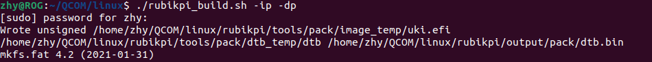

:::warning

If the following error occurs when you package the image:


Run the following command to modify the *.mtoolsrc* file, add `mtools_skip_check=1`, and try packaging the image again.

```Shell showLineNumbers  
vim ~/.mtoolsrc
```
:::

4.  Go to the kernel directory and flash the kernel and device tree image.

```Shell showLineNumbers  
    ./rubikpi_flash.sh -d -i -r # Flash
```

    :::warning

    Before flashing, ensure that RUBIK Pi 3 has entered fastboot mode. Use one of the following methods to enter fastboot mode:

1.  In the RUBIK Pi 3 terminal, input `reboot bootloader`. When RUBIK Pi 3 enters fastboot mode, the blue indicator lights up.
2.  Press and hold the **[PWR ON]** button until the blue indicator lights up.
:::
    For details about how to use the `./rubikpi_build.sh` and `./rubikpi_flash.sh` scripts, use the `–h` parameter.
    

5. Compile the ko driver module separately.

     a. Create a Makefile as follows. Change KDIR to the actual kernel source code directory.

    ```Makefile showLineNumbers  
    obj-m += hello.o  
    KDIR:=/home/rubikpi/kernel-6.6  
    PWD?=$(shell pwd)  
    all:   
     make -C $(KDIR) M=$(PWD) modules  
     echo $(PWD)  
    clean:   
     rm -f *.ko *.o *.mod *.mod.o *.mod.c *.symvers *.order
    ```

     b. Create a *hello.c* file as follows:

    ```C showLineNumbers  
    #include <linux/module.h>  
    #include <linux/init.h>  
      
    static int hello_init(void)  
    {  
     printk("hello RUBIK Pi!\n");  
     return 0;  
    }  
      
    static void hello_exit(void)  
    {  
     printk("bye RUBIK Pi!\n");  
    }  
      
    module_init(hello_init);  
    module_exit(hello_exit);  
      
    MODULE_LICENSE("GPL");  
    MODULE_VERSION("V1.0");  
    MODULE_AUTHOR("RUBIK Pi");
    ```

     c. Run the following commands to compile the ko driver module:

    ```Bash showLineNumbers  
    export ARCH=arm64  
    export CROSS_COMPILE=aarch64-qcom-linux-  
    make
    ```

     d.  Transfer hello.ko to your RUBIK Pi 3 using the ADB or SCP method.

     e.  Run the following commands on your RUBIK Pi 3 to verify that the compilation artifact is valid.

    ```Shell showLineNumbers  
    insmod hello.ko
    rmmod hello.ko
    dmesg | grep "RUBIK Pi"
    ```

    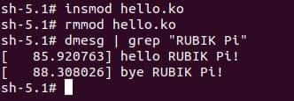

### 1.12.3 Configure the kernel

Run the following commands to configure the Linux kernel using menuconfig:

```Bash showLineNumbers  
cd kernel-6.6/  
make ARCH=arm64 menuconfig
```

After the configuration is completed, run the following commands to save the configuration.

```Shell showLineNumbers  
make ARCH=arm64 savedefconfig  
cp defconfig ./arch/arm64/configs/rubik_pi3_defconfig
```

### 1.12.4 Directory analysis

After the operations in 1.12.1. Download code and running the `git clone` command, the RUBIK Pi 3 Linux repository is as shown in the following figure:

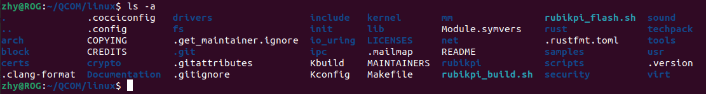

The major folders and files are described as follows:

| Name             | Description                                                             |
|------------------|-------------------------------------------------------------------------|
| arch             | Architecture-related directory                                          |
| block            | Block device-related directory                                          |
| certs            | Certification and signature-related directory                           |
| crypto           | Encryption-related directory                                            |
| documentation    | Documentation-related directory                                         |
| drivers          | Driver-related directory                                                |
| firmeare         | Firmware-related directory                                              |
| fs               | File system-related directory                                           |
| include          | Header file-related directory                                           |
| init             | Kernel initialization-related directory                                 |
| ipc              | Inter-process communication-related directory                           |
| kernel           | Directory of the kernel core code                                       |
| lib              | Directory of kernel core library code                                   |
| mm               | Directory of memory management-related code                             |
| net              | Directory of network protocol-related code                              |
| samples          | Directory of kernel compilation examples                                |
| scripts          | Directory of kernel compilation and configuration scripts               |
| security         | Security architecture-related directory                                 |
| sound            | Audio system-related directory                                          |
| tools            | Directory of kernel interaction tools                                   |
| usr              | initramfs-related directory, used to generate the initramfs             |
| virt             | Directory that provides Kernel-based Virtual Machine (KVM) technologies |
| rust             | Rust-related directory                                                  |
| rubikpi          | RUBIK Pi 3 related directory for storing compilation tools              |
| techpack         | Qualcomm platform-related driver                                        |
| .config          | Configuration file for final kernel compilation                         |
| Makefile         | Main file used to compile the kernel                                    |
| Kbuild           | Script for configuring kernel settings                                  |
| Kconfig          | Configuration file for the graphical configuration interface            |
| MAINTAINERS      | List of maintainers                                                     |
| CREDITS          | Linux contributors                                                      |
| COPYING          | Copyright statement                                                     |
| rubikpi_build.sh | Compilation and packaging scripts provided by RUBIK Pi 3                |
| rubikpi_flash.sh | Flash scripts provided by RUBIK Pi 3                                    |

#### 1.12.4.1 Device tree

The top-level device tree of RUBIK Pi 3 is rubikpi3-c6490.dts which is located at the *arch/arm64/boot/dts/qcom* directory. It is recommended that all modifications to the device tree be made on this file.

In addition, during the development process, the *sc7280.dtsi* in the same level of directory may be frequently viewed. *sc7280.dtsi* has nodes commonly used during the development process, including GPIO, SPI, I2C, UART, CPU, and GPU.