import Tabs from '@theme/Tabs';
import TabItem from '@theme/TabItem';

# 2. Peripherals and Interfaces

## 2.1 Hardware resource diagram


|  No.  | Interface                   | No.    | Interface                  |
|-------|-----------------------------|--------|----------------------------|
| **1** | RTC battery connector       | **10** | Power Delivery over Type-C |
| **2** | Micro USB (UART debug)      | **11** | Power-on button            |
| **3** | QCS6490 module              | **12** | EDL button                 |
| **4** | 3.5mm headphone jack        | **13** | Camera connector 1         |
| **5** | USB Type-C with DP (USB3.1) | **14** | Camera connector 2         |
| **6** | USB Type-A (USB2.0)         | **15** | Wi-Fi/BT module            |
| **7** | 2 x USB Type-A (USB3.0)     | **16** | Fan connector              |
| **8** | 1000M Ethernet              | **17** | 40-pin LS connector        |
| **9** | HDMI OUT                    | **18** | M.2 Key M connector        |

## 2.2 40-pin LS connector

### 2.2.1 GPIO

#### 2.2.1.1 Pinout

GPIO pin numbers are always required when GPIOs are used in user space. The following table lists the GPIO pin numbers and functions of the 40-pin LS connector. For example, the name of pin 13 is GPIO_24, which corresponds to number 559 in the GPIO sub-system.


#### 2.2.1.2 Control GPIOs using shell commands on RUBIK Pi 3

Run the following commands on RUBIK Pi 3 to control GPIOs.

Go to the */sys/class/gpio* directory:

```Shell showLineNumbers  
cd /sys/class/gpio
```

Export the GPIO to be controlled. For example, pin 3 GPIO_24:

```Shell showLineNumbers  
echo 559 > export
```

Go to the *gpio559* directory to set GPIO attributes:

```Shell showLineNumbers  
cd gpio559  
ls
```

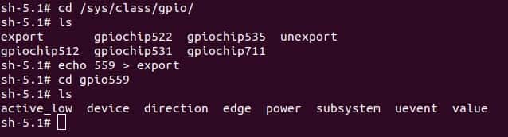

The attributes are described as follows:

-   direction:
      - Input: in
      - Output: out

-   value:
     -  Low level: 0
     -   High level: 1
-   edge (interrupt edge):
     -   Rising edge trigger: rising
     -   Falling edge trigger: falling
     -   Both-edge trigger: both
     -   Disabling interrupts: none

Set pin 13 to output a high level:

```Shell showLineNumbers  
echo out > direction  
echo 1 > value
```

Cancel the export of pin 13 to user space:

```Shell showLineNumbers  
echo 559 > unexport
```

#### 2.2.1.3 Control GPIOs using Python programs on RUBIK Pi 3

-   GPIOs can be controlled by using python-periphery. Run the following command to install python-periphery on RUBIK Pi 3:

```Shell showLineNumbers  
    pip3 install python-periphery
```

-   The following code snippet uses python-periphery to operate GPIOs: set pin 13 as output, pin 15 as input, and loop to check the level status of pin 15.

```python showLineNumbers
from periphery import GPIO
import time

out_gpio = GPIO(559, "out")
in_gpio = GPIO(560, "in")

try:
    while True:
        try:
            out_gpio.write(True)
            pin_level = in_gpio.read()
            print(f"in_gpio level: {pin_level}")

            out_gpio.write(False)
            pin_level = in_gpio.read()
            print(f"in_gpio level: {pin_level}")

            time.sleep(1)

        except KeyboardInterrupt:
            out_gpio.write(False)
            break

except IOError:
    print("Error")

finally:
    out_gpio.close()
    in_gpio.close()
```

-   Transfer *gpio.py* to RUBIK Pi 3. For example, use the ADB method.

```Shell showLineNumbers  
    adb push gpio.py /opt
```

-   Use the Dupont wire to short pin 13 and pin 15 as shown in the following figure to test the GPIO level control and read the level.


The program execution result is as follows:

```Shell showLineNumbers
cd /opt
python3 gpio.py
```


#### 2.2.1.4 Control GPIOs using C programs

-   The following code snippet sets pin 13 as output, pin 15 as input, and loops to check the level status of pin 15.

```C showLineNumbers
#include <stdio.h>
#include <stdlib.h>
#include <unistd.h>

int out_gpio = 559;
int in_gpio = 560;

int main() {
    char export_path[50] = {};
    char export_command[100] = {};
    snprintf(export_path, sizeof(export_path), "/sys/class/gpio/export");
    snprintf(export_command, sizeof(export_command), "echo %d > %s ", out_gpio, export_path);
    system(export_command);
    snprintf(export_command, sizeof(export_command), "echo %d > %s ", in_gpio, export_path);
    system(export_command);

    char direction_path[50] = {};
    snprintf(direction_path, sizeof(direction_path), "/sys/class/gpio/gpio%d/direction", out_gpio);
    FILE *direction_file = fopen(direction_path, "w");
    if (direction_file == NULL) {
        perror("Failed to open GPIO direction file");
        return -1;
    }
    fprintf(direction_file, "out");
    fclose(direction_file);

    snprintf(direction_path, sizeof(direction_path), "/sys/class/gpio/gpio%d/direction", in_gpio);
    direction_file = fopen(direction_path, "w");
    if (direction_file == NULL) {
        perror("Failed to open GPIO direction file");
        return -1;
    }
    fprintf(direction_file, "in");
    fclose(direction_file);

    char value_in_path[50] = {};
    char value_out_path[50] = {};
    char cat_command[100] = {};
    snprintf(value_out_path, sizeof(value_out_path), "/sys/class/gpio/gpio%d/value", out_gpio);
    snprintf(value_in_path, sizeof(value_in_path), "/sys/class/gpio/gpio%d/value", in_gpio);
    snprintf(cat_command, sizeof(cat_command), "cat %s", value_in_path);

    FILE *value_out_file = fopen(value_out_path, "w");
    if (value_out_file == NULL) {
        perror("Failed to open GPIO value file");
        return -1;
    }

    for (int i = 0; i < 5; i++) {
        fprintf(value_out_file, "1");
        fflush(value_out_file);

        system(cat_command);
        sleep(1);

        fprintf(value_out_file, "0");
        fflush(value_out_file);

        system(cat_command);
        sleep(1);
    }

    fclose(value_out_file);

    char unexport_path[50] = {};
    char unexport_command[100] = {};
    snprintf(unexport_path, sizeof(unexport_path), "/sys/class/gpio/unexport");
    snprintf(unexport_command, sizeof(unexport_command), "echo %d > %s ", out_gpio, unexport_path);
    system(unexport_command);
    snprintf(unexport_command, sizeof(unexport_command), "echo %d > %s ", in_gpio, unexport_path);
    system(unexport_command);

    return 0;
}

```

-   Cross-compile the program. For details, refer to "1.11.3. Use the cross-compilation tools".

```Shell showLineNumbers  
    aarch64-qcom-linux-gcc gpio.c -o gpio --sysroot=/home/zhy/qcom_sdk_meta/sysroots/armv8-2a-qcom-linux/
```

-   Transfer *gpio* to RUBIK Pi 3. For example, use the ADB method.

```Shell showLineNumbers  
    adb push gpio /opt
```

-   Use the Dupont wire to short pin 13 and pin 15 as shown in the following figure to test the GPIO level control and read the level.


The program execution result is as follows:

```Shell showLineNumbers
cd /opt
./gpio
```

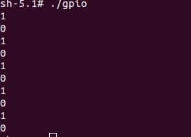

### 2.2.2 I2C

#### 2.2.2.1 Pinout


:::tip

Pins 3 and pin 5 are configured as I2C1 by default.
:::

#### 2.2.2.2 I2C communication using shell commands on RUBIK Pi 3

Run the following commands on RUBIK Pi 3 to control the I2C bus.

-   View devices connected to the I2C1 interface:

```Shell showLineNumbers  
    i2cdetect -a -y -r 1
```

-   Read all registers of the device whose address is 0x38:

```Shell showLineNumbers  
    i2cdump -f -y 3 0x38
```

-   Write 0xaa to register 0x01 of the device whose address is 0x38:

```Shell showLineNumbers  
    i2cset -f -y 1 0x38 0x01 0xaa
```

-   Read the value at register 0x01 of the device whose address is 0x38:

```Shell showLineNumbers  
    i2cget -f -y 1 0x38 0x01
```

#### 2.2.2.3 I2C communication using Python programs

-   I2C can be controlled by using the Python smbus library. Run the following command on RUBIK Pi 3 to install the library.

```Shell showLineNumbers  
    pip3 install smbus
```

-   The following code snippet uses the I2C1 bus to communicate with a device whose address is 0x38: writing 0xaa to address 0x01 of the device.

```python showLineNumbers
import smbus

def main():
    data = [0x01, 0xaa]

    try:
        i2c_bus = smbus.SMBus(1)  

        print("i2cdetect addr : ", end="")
        for address in range(0x7F):
            try:
                i2c_bus.write_i2c_block_data(address, 0, data)
                print("0x{:02X},".format(address), end="")
            except OSError:
                pass  

        print()

    except Exception as e:
        print(f"An error occurred: {e}")

    finally:
        if i2c_bus:
            i2c_bus.close()

if __name__ == "__main__":
    main()

```

-   Transfer *i2c.py* to RUBUK Pi 3. For example, use the ADB method.

```Shell showLineNumbers

    adb push i2c.py /opt
```

-   Connect pin 3 and pin 5 to the I2C sensor and test the I2C communication as shown in the following figure.


```Shell showLineNumbers  
cd /opt
python3 i2c.py
```

The program execution result is as follows:

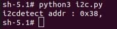

#### 2.2.2.4 I2C communication using C programs

-   The following code snippet uses the I2C1 bus to communicate with a device whose address is 0x38: writing 0xaa to address 0x01 of the device.

```C showLineNumbers
#include <stdio.h>
#include <stdlib.h>
#include <stdint.h>
#include <fcntl.h>
#include <unistd.h>
#include <linux/i2c-dev.h>
#include <sys/ioctl.h>

#define I2C_DEVICE_PATH "/dev/i2c-1"

int main() {
    uint8_t data[2] = {0x01,0xaa};
  
    const char *i2c_device = I2C_DEVICE_PATH;  
    int i2c_file;

    if ((i2c_file = open(i2c_device, O_RDWR)) < 0) {
        perror("Failed to open I2C device");
        return -1;
    }
  
    ioctl(i2c_file, I2C_TENBIT, 0);
    ioctl(i2c_file, I2C_RETRIES, 5);

    printf("i2cdetect addr : ");
    for (int x = 0; x < 0x7f; x++)
    {
        if (ioctl(i2c_file, I2C_SLAVE, x) < 0) {
            perror("Failed to set I2C slave address");
            close(i2c_file);
            return -1;
        }
    
        if (write(i2c_file, data, 2) == 2)
        {
            printf("0x%x,", x);
        }
    }
  
    close(i2c_file);
    printf("\r\n");

    return 0;
}
```

-   Cross-compile the program. For details, refer to "1.11.3. Use the cross-compilation tools".

```Shell showLineNumbers  
    aarch64-qcom-linux-gcc i2c.c -o i2c --sysroot=/home/zhy/qcom_sdk_meta/sysroots/armv8-2a-qcom-linux/
```

-   Transfer *i2c* to RUBIK Pi 3. For example, use the ADB method.

```Shell showLineNumbers  
    adb push i2c /opt
```

-   Connect pin 3 and pin 5 to the I2C sensor to test the I2C bus communication as shown in the following figure.


```Shell showLineNumbers  
cd /opt
./i2c
```

The program execution result is as follows:


### 2.2.3 SPI

#### 2.2.3.1 Pinout


:::tip

Pins 19, 21, 23, and 24 are set as SPI by default.
:::

#### 2.2.3.2 SPI communication using Python programs

-   SPI communication can be implemented by using the spidev library for Python. Run the following command to install spidev on RUBIK Pi 3.

```Shell showLineNumbers  
    pip3 install spidev
```

-   The following code snippet uses the SPI bus to send and receive data.

```python showLineNumbers
import spidev

def main():
    tx_buffer = [ord(char) for char in "hello world!"]
    rx_buffer = [0] * len(tx_buffer)

    try:
        spi = spidev.SpiDev()
        spi.open(12, 0)
        spi.max_speed_hz = 1000000  

        rx_buffer = spi.xfer2(tx_buffer[:])
        print("tx_buffer:\n\r", ''.join(map(chr, tx_buffer)))
        print("rx_buffer:\n\r", ''.join(map(chr, rx_buffer)))

    except Exception as e:
        print(f"An error occurred: {e}")

    finally:
        if spi:
            spi.close()

if __name__ == "__main__":
    main()
```

-   Transfer *spi.py* to RUBIK Pi 3. For example, use the ADB method.

 ```Shell showLineNumbers  
    adb push spi.py /opt
```

-   Short pin 19 and pin 21 with a Dupont wire to test the SPI bus communication as shown in the following figure.


The program execution result is as follows:

```Shell showLineNumbers
python3 spi.py
```


#### 2.2.3.3 SPI communication using C programs

-   The following code snippet uses the SPI bus to send and receive data.

```C showLineNumbers
#include <stdio.h>
#include <stdlib.h>
#include <stdint.h>
#include <fcntl.h>
#include <unistd.h>
#include <linux/spi/spidev.h>
#include <sys/ioctl.h>

#define SPI_DEVICE_PATH "/dev/spidev12.0"

int main() {
    int spi_file;
    uint8_t tx_buffer[50] = "hello world!";
    uint8_t rx_buffer[50];

    // Open the SPI device
    if ((spi_file = open(SPI_DEVICE_PATH, O_RDWR)) < 0) {
        perror("Failed to open SPI device");
        return -1;
    }

    // Configure SPI mode and bits per word
    uint8_t mode = SPI_MODE_0;
    uint8_t bits = 8;
    if (ioctl(spi_file, SPI_IOC_WR_MODE, &mode) < 0) {
        perror("Failed to set SPI mode");
        close(spi_file);
        return -1;
    }
    if (ioctl(spi_file, SPI_IOC_WR_BITS_PER_WORD, &bits) < 0) {
        perror("Failed to set SPI bits per word");
        close(spi_file);
        return -1;
    }

    // Perform SPI transfer
    struct spi_ioc_transfer transfer = {
        .tx_buf = (unsigned long)tx_buffer,
        .rx_buf = (unsigned long)rx_buffer,
        .len = sizeof(tx_buffer),
        .delay_usecs = 0,
        .speed_hz = 1000000,  // SPI speed in Hz
        .bits_per_word = 8,
    };

    if (ioctl(spi_file, SPI_IOC_MESSAGE(1), &transfer) < 0) {
        perror("Failed to perform SPI transfer");
        close(spi_file);
        return -1;
    }

     /* Print tx_buffer and rx_buffer*/
    printf("\rtx_buffer: \n %s\n ", tx_buffer);
    printf("\rrx_buffer: \n %s\n ", rx_buffer);

    // Close the SPI device
    close(spi_file);

    return 0;
}
```

-   Cross-compile the program. For details, refer to "1.11.3. Use the cross-compilation tools".

```Shell showLineNumbers  
    aarch64-qcom-linux-gcc spi.c -o spi --sysroot=/home/zhy/qcom_sdk_meta/sysroots/armv8-2a-qcom-linux/
```

-   Transfer *spi* to RUBIK Pi 3. For example, use the ADB method.

 ```Shell showLineNumbers  
    adb push spi /opt
```

-   Short pin 19 and pin 21 with a Dupont wire to test the SPI bus communication as shown in the following figure.


The program execution result is as follows:

```Shell showLineNumbers  
cd /opt
./spi
```


### 2.2.4 UART

#### 2.2.4.1 Pinout


:::tip

Pins 8 and 10 have been configured as UART by default. The device node is */dev/ttyHS3*.
:::

#### 2.2.4.2 UART communication using shell commands on RUBIK Pi 3

Run the following commands on RUBIK Pi 3 to control UART communication.

-   Use the stty tool to configure UART. Run the following commands to set both the input rate and output rate of UART to 115200 and disable the echo.

```Shell showLineNumbers  
    stty -F /dev/ttyHS3 ispeed 115200 ospeed 115200  
    stty -F /dev/ttyHS3 -echo
```

-   Enable the two terminals on RUBIK Pi 3, short pin 8 and pin 10 with a Dupont wire, and run the following commands. The content sent by the transmitter will be displayed on the receiver.

```Shell showLineNumbers  
    echo "hello world!" > /dev/ttyHS3 #Transmitter  
    cat /dev/ttyHS3 #Receiver
```

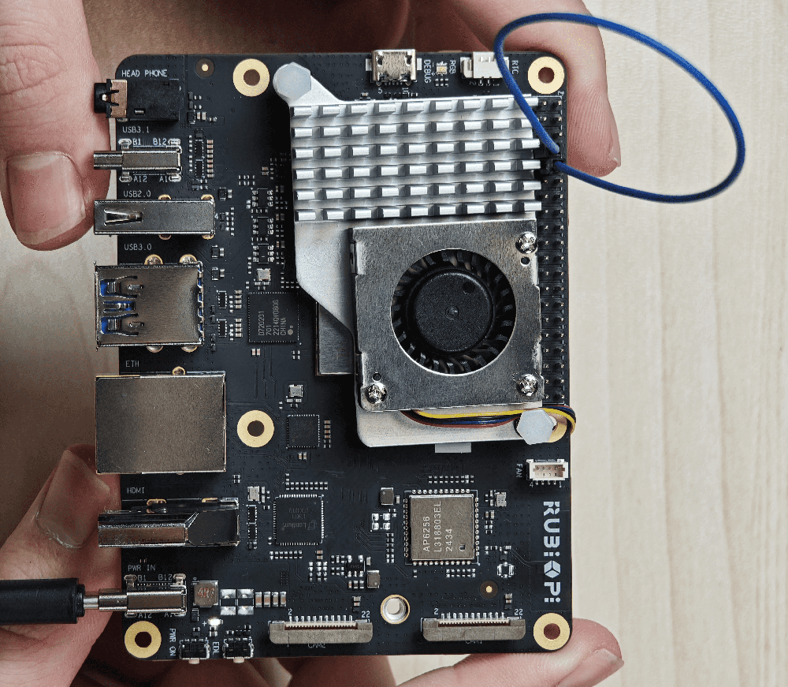

#### 2.2.4.3 UART communication using Python programs

-   UART communication can be implemented by using the serial library for Python. Run the following command to install the serial library on RUBIK Pi 3.

```Shell showLineNumbers  
    pip3 install pyserial
```

-   Create the *uart.py* file and use UART to send and receive data.

```python showLineNumbers
import serial
import time

with serial.Serial(
    "/dev/ttyHS3",
    baudrate=115200,
    bytesize=serial.EIGHTBITS,
    stopbits=serial.STOPBITS_ONE,
    parity=serial.PARITY_NONE,
    timeout=1,
) as uart3:
    uart3.write(b"Hello World!\n")
    buf = uart3.read(128)
    print("Raw data:\n", buf)
    data_strings = buf.decode("utf-8")
    print("Read {:d} bytes, printed as string:\n {:s}".format(len(buf), data_strings))
```

-   Transfer *uart.py* to RUBIK Pi 3. For example, use the ADB method. The command is as follows:

```Shell showLineNumbers  
    adb push uart.py /opt
```

-   Short pin 8 and pin 10 with a Dupont wire to test the UART communication as shown in the following figure.


The program execution result is as follows:

```Shell showLineNumbers  
python3 uart.py
```

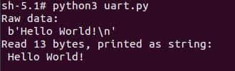

#### 2.2.4.4 UART communication using C programs

-   Create the *uart.c* file and use UART to send and receive data.

```C showLineNumbers
#include <stdio.h>
#include <stdlib.h>
#include <string.h>
#include <fcntl.h>
#include <termios.h>
#include <unistd.h>

int main() {
    int serial_port_num = 3;
    char serial_port[15];

    sprintf(serial_port,"/dev/ttyHS%d",serial_port_num);
    int serial_fd;

    serial_fd = open(serial_port, O_RDWR | O_NOCTTY);
    if (serial_fd == -1) {
        perror("Failed to open serial port");
        return 1;
    }

    struct termios tty;
    memset(&tty, 0, sizeof(tty));

    if (tcgetattr(serial_fd, &tty) != 0) {
        perror("Error from tcgetattr");
        return 1;
    }

    cfsetospeed(&tty, B9600);
    cfsetispeed(&tty, B9600);

    tty.c_cflag &= ~PARENB;
    tty.c_cflag &= ~CSTOPB;
    tty.c_cflag &= ~CSIZE;
    tty.c_cflag |= CS8;

    if (tcsetattr(serial_fd, TCSANOW, &tty) != 0) {
        perror("Error from tcsetattr");
        return 1;
    }

    char tx_buffer[] = "hello world!\n";
    ssize_t bytes_written = write(serial_fd, tx_buffer, sizeof(tx_buffer));
    if (bytes_written < 0) {
        perror("Error writing to serial port");
        close(serial_fd);
        return 1;
    }
    printf("\rtx_buffer: \n %s ", tx_buffer);

    char rx_buffer[256];
    int bytes_read = read(serial_fd, rx_buffer, sizeof(rx_buffer));
    if (bytes_read > 0) {
        rx_buffer[bytes_read] = '\0';
        printf("\rrx_buffer: \n %s ", rx_buffer);
    } else {
        printf("No data received.\n");
    }

    close(serial_fd);

    return 0;
}
```

-   Cross-compile the program. For details, refer to "1.11.3. Use the cross-compilation tools".

```Shell showLineNumbers  
    aarch64-qcom-linux-gcc uart.c -o uart --sysroot=/home/zhy/qcom_sdk_meta/sysroots/armv8-2a-qcom-linux/
```

-   Transfer *uart* to RUBIK Pi 3. For example, use the ADB method.

```Shell showLineNumbers  
    adb push uart /opt
```

-   Short pin 8 and pin 10 with a Dupont wire and test the UART communication as shown in the following figure.


The program execution result is as follows:

```Shell showLineNumbers
cd /opt
./uart
```


## 2.3 USB

RUBIK Pi 3 provides four USB ports:

-   2 x USB 3.0, host mode only (No.7 in the following figure)
-   1 x USB 2.0, host or device mode (No. 6 in the following figure)
-   1 x USB 3.1 Gen 1, host or device mode, Type-C with DisplayPort v1.4 (No. 5 in the following figure)


### 2.3.1 USB2.0

To switch the USB 2.0 port to device mode, run commands manually. The following example shows a test method. Running the following commands on RUBIK Pi 3 simulates RUBIK Pi 3 as a USB flash drive.

```Shell showLineNumbers
cd /sys/kernel/config/usb_gadget/ #Log in from the serial port and run the following command
mkdir g1
cd g1
mkdir functions/mass_storage.0

dd if=/dev/zero of=/tmp/test.iso bs=1M count=2048 #Create a 2 GB USB drive space
mkfs.ext4 /tmp/test.iso
echo "/tmp/test.iso" > functions/mass_storage.0/lun.0/file
mkdir configs/c.1
ln -s functions/mass_storage.0/ configs/c.1/f3
mount -t debugfs none /sys/kernel/debug/

echo device > /sys/kernel/debug/usb/8c00000.usb/qcom_usb2_0_mode #Switch USB to device mode
echo 8c00000.usb > UDC #Connect the USB cable. The USB drive is identified and can be written to and read from

echo host > /sys/kernel/debug/usb/8c00000.usb/qcom_usb2_0_mode #Remove the USB cable and switch to host mode
```

### 2.3.2 Type-C port

The Type-C port can automatically switch between host and device modes.

-   Automatically switches to device mode when connected to PC
-   Automatically switches to host mode when an OTG cable is connected
-   Automatically outputs DP video signals when connected to a DP monitor

## 2.4 CSI

Currently, RUBIK Pi 3 is compatible with three Raspberry Pi cameras:

-   Raspberry Pi High Quality Camera (IMX477/M12 Mount)

    https://www.raspberrypi.com/products/raspberry-pi-high-quality-camera/

    :::note

    In the demonstration in Chapter 4. Qualcomm IM SDK, the IMX477 camera uses the WS1053516 lens.
    :::


-   Raspberry Pi Camera Module 2 (IMX219)

    https://www.raspberrypi.com/products/camera-module-v2/

    :::note

    Currently, the RUBIK Pi 3 only supports the standard Camera Module 2 and does not support the wide-angle or NoIR versions.
    :::

-   Raspberry Pi Camera Module 3 (IMX708)

    https://www.raspberrypi.com/products/camera-module-3/

    :::note

    Currently, the RUBIK Pi 3 only supports the standard Camera Module 3 and does not support the wide-angle or NoIR versions. The current software version does not support the autofocus (AF) function of the Module 3 camera.
    :::

### 2.4.1 Connect the camera cable

https://www.raspberrypi.com/products/camera-cable/

RUBIK Pi 3 supports the 22-pin FPC with a 0.5mm pitch and a 0.3±0.05mm thickness. It is compatible with the Raspberry Pi 5 FPC of the same specification.


1.  Pull up the lock of the connector.


2.  Insert the FPC. Ensure that the contact side is toward RUBIK Pi.


3.  Press the lock and ensure that the FPC is properly connected.


### 2.4.2 Use cameras

The camera can be operated by using the GStreamer command on RUBIK Pi 3. Before operation, run the following commands to set the camera.

```Shell showLineNumbers  
mount -o remount,rw /
echo multiCameraLogicalXMLFile=kodiak_dc.xml > /var/cache/camera/camxoverridesettings.txt
echo enableNCSService=FALSE >> /var/cache/camera/camxoverridesettings.txt
```

Connect cameras to connectors 13 and 14, and connect the HDMI cable, as marked in the following figure.


The following picture shows the physical connection:

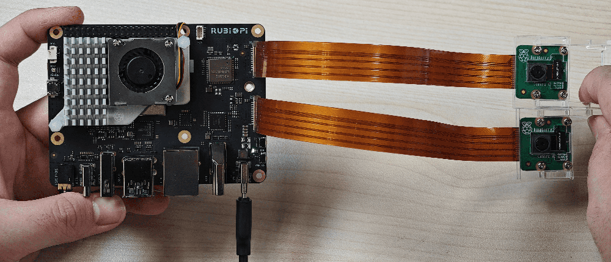

-   Run the following commands on RUBIK Pi 3 for the full-screen preview of a single camera:

```Shell showLineNumbers  
    export XDG_RUNTIME_DIR=/dev/socket/weston  
    export WAYLAND_DISPLAY=wayland-1  
    setprop persist.overlay.use_c2d_blit 2  
    gst-launch-1.0 -e qtiqmmfsrc camera=0 name=camsrc ! video/x-raw\(memory:GBM\),format=NV12,width=1920,height=1080,framerate=30/1,compression=ubwc ! queue ! waylandsink fullscreen=true async=true
```

    The following figure shows the preview result:

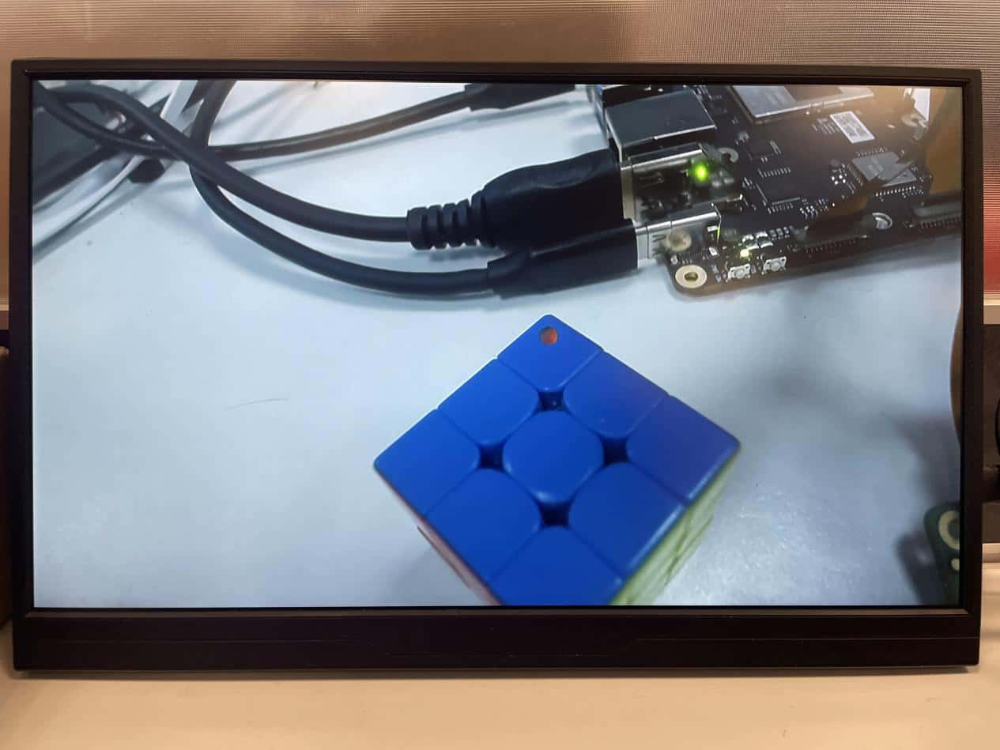

-   Run the following commands on RUBIK Pi 3 for concurrent preview of two cameras:

```Shell showLineNumbers  
    #Terminal 1  
    export XDG_RUNTIME_DIR=/dev/socket/weston  
    export WAYLAND_DISPLAY=wayland-1  
    setprop persist.overlay.use_c2d_blit 2  
    gst-launch-1.0 -e qtiqmmfsrc camera=0 name=camsrc ! video/x-raw\(memory:GBM\),format=NV12,width=1920,height=1080,framerate=30/1,compression=ubwc ! queue ! waylandsink sync=false x=0 y=0 width=960 height=540 enable-last-sample=false  
      
    #Terminal 2  
    export XDG_RUNTIME_DIR=/dev/socket/weston  
    export WAYLAND_DISPLAY=wayland-1  
    setprop persist.overlay.use_c2d_blit 2  
    gst-launch-1.0 -e qtiqmmfsrc camera=1 name=camsrc ! video/x-raw\(memory:GBM\),format=NV12,width=1920,height=1080,framerate=30/1,compression=ubwc ! queue ! waylandsink sync=false x=960 y=540 width=960 height=540 enable-last-sample=false
```

    The following figure shows the preview result:

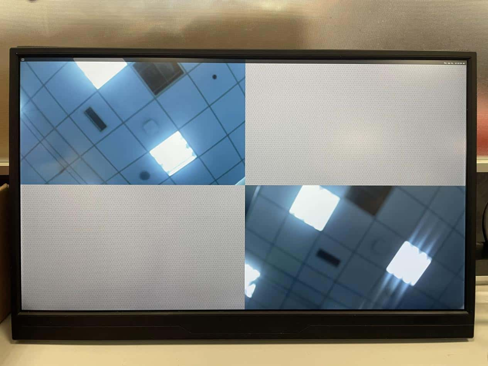

-   Run the following commands on RUBIK Pi 3 for concurrent video recording from both cameras.

```Shell showLineNumbers  
    #Terminal 1:   
    echo multiCameraLogicalXMLFile=kodiak_dc.xml > /var/cache/camera/camxoverridesettings.txt  
    export XDG_RUNTIME_DIR=/dev/socket/weston  
    export WAYLAND_DISPLAY=wayland-1  
    setprop persist.overlay.use_c2d_blit 2  
    gst-launch-1.0 -e qtiqmmfsrc camera=0 name=camsrc video_0::type=preview ! video/x-raw\(memory:GBM\),format=NV12,width=1920,height=1080,framerate=30/1,compression=ubwc,interlace-mode=progressive,colorimetry=bt601 ! queue ! v4l2h264enc capture-io-mode=5 output-io-mode=5 ! queue ! h264parse ! mp4mux ! queue ! filesink location="/opt/mux0.mp4"  
    
    #Terminal 2:   
    export XDG_RUNTIME_DIR=/dev/socket/weston  
    export WAYLAND_DISPLAY=wayland-1  
    setprop persist.overlay.use_c2d_blit 2  
    gst-launch-1.0 -e qtiqmmfsrc camera=1 name=camsrc video_0::type=preview ! video/x-raw\(memory:GBM\),format=NV12,width=1920,height=1080,framerate=30/1,compression=ubwc,interlace-mode=progressive,colorimetry=bt601 ! queue ! v4l2h264enc capture-io-mode=5 output-io-mode=5 ! queue ! h264parse ! mp4mux ! queue ! filesink location="/opt/mux1.mp4"
```

    The recorded video files are saved in the */opt* directory.

    

-   Run the following commands on RUBIK Pi 3 for concurrent preview and video recording from two cameras.

```Shell showLineNumbers  
    #Terminal 1  
    export XDG_RUNTIME_DIR=/dev/socket/weston  
    export WAYLAND_DISPLAY=wayland-1  
    setprop persist.overlay.use_c2d_blit 2  
    gst-launch-1.0 -e qtiqmmfsrc camera=0 name=camsrc video_0::type=preview ! video/x-raw\(memory:GBM\),format=NV12,width=1920,height=1080,framerate=30/1,compression=ubwc,interlace-mode=progressive,colorimetry=bt601 ! queue ! v4l2h264enc capture-io-mode=5 output-io-mode=5 ! queue ! h264parse ! mp4mux ! queue ! filesink location="/opt/mux0.mp4" camsrc. ! video/x-raw\(memory:GBM\),format=NV12,width=1920,height=1080,framerate=30/1,compression=ubwc ! waylandsink sync=false x=0 y=0 width=960 height=540 enable-last-sample=false  
      
    #Terminal 2  
    export XDG_RUNTIME_DIR=/dev/socket/weston  
    export WAYLAND_DISPLAY=wayland-1  
    setprop persist.overlay.use_c2d_blit 2  
    gst-launch-1.0 -e qtiqmmfsrc camera=1 name=camsrc video_0::type=preview ! video/x-raw\(memory:GBM\),format=NV12,width=1920,height=1080,framerate=30/1,compression=ubwc,interlace-mode=progressive,colorimetry=bt601 ! queue ! v4l2h264enc capture-io-mode=5 output-io-mode=5 ! queue ! h264parse ! mp4mux ! queue ! filesink location="/opt/mux1.mp4" camsrc. ! video/x-raw\(memory:GBM\),format=NV12,width=1920,height=1080,framerate=30/1,compression=ubwc ! waylandsink sync=false x=960 y=540 width=960 height=540 enable-last-sample=false
```

    The recorded video files are saved in the */opt* directory.

    

    The following figure shows the preview result:


## 2.5 HDMI OUT

The HDMI connector is component No.9 in the following figure. RUBIK Pi 3 supports HDMI 1.4 and a maximum output of 4K 30 Hz. It also supports the CEC functionality, resolution adaptation (output at the highest resolution supported by the screen), and hot-swapping.


### 2.5.1 CEC

HDMI Consumer Electronics Control (CEC) is a feature of HDMI designed to interconnect and control multiple connected devices via a single HDMI cable. CEC facilitates communication between connected devices through a dedicated CEC pin. For example, multiple devices can be controlled with a single remote control.

RUBIK Pi 3 integrates the cec-client tool. After connecting the HDMI cable to a TV, run the following command to check whether the TV supports CEC.

```Shell showLineNumbers  
echo 'scan' | cec-client -s -d 1
```

If the TV supports CEC, the following output will be returned:

```text
opening a connection to the CEC adapter...
requesting CEC bus information ...
CEC bus information
===================
device #0: TV
address:       0.0.0.0
active source: no
vendor:        Sony
osd string:    TV
CEC version:   1.4
power status:  standby
language:      eng
 
  
device #1: Recorder 1
address:       1.0.0.0
active source: no
vendor:        Pulse Eight
osd string:    CECTester
CEC version:   1.4
power status:  on
language:      eng
 
  
device #4: Playback 1
address:       3.0.0.0
active source: no
vendor:        Sony
osd string:    PlayStation 4
CEC version:   1.3a
power status:  standby
language:      ???
```

If the TV supports the CEC function, run the following commands on RUBIK Pi 3 to increase or decrease the TV volume.

```Shell showLineNumbers  
echo 'volup' | cec-client -t p -s  
echo 'voldown' | cec-client -t p -s
```

For more information about how to use cec-client, use the `-h` parameter.

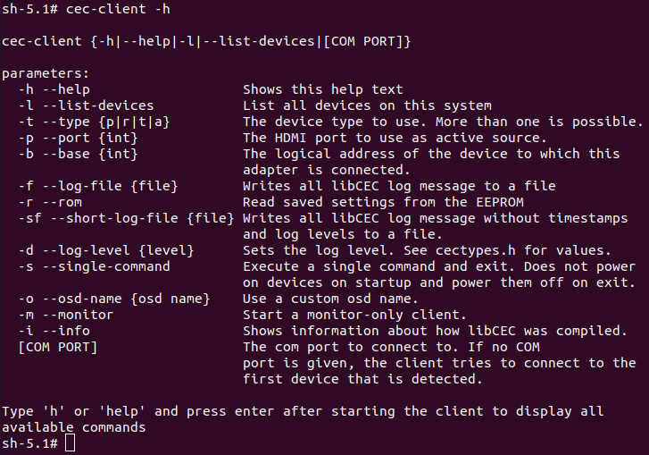

### 2.5.2 HDMI OUT touchscreen

RUBIK Pi 3 supports HDMI OUT touchscreen with 1024 x 600P resolution by default and supports the touch function as shown in the following figure:


:::info

The screen used in the picture above is a 7" IPS HD touch screen.

https://a.co/d/cTl7rkN
:::

## 2.6 Wi-Fi and Bluetooth

RUBIK Pi 3 is equipped with the AP6256 Wi-Fi module and supports Wi-Fi 5 and Bluetooth 5.2.

### 2.6.1 Wi-Fi

#### 2.6.1.1 STA mode

In Station (STA) mode, the device can be connected to an existing Wi-Fi network to access network resources or the Internet. Run the following commands on RUBIK Pi 3:

1.  Scan for nearby Wi-Fi.

 ```Shell showLineNumbers  
    iw wlan0 scan | grep SSID
```

2.  Connect to Wi-Fi.

 ```Shell showLineNumbers  
    wpa_passphrase <ssid> <passphrase> > /etc/wpa_supplicant.conf #Enter the Wi-Fi account and password

    systemctl restart wifi #Connect to Wi-Fi
```

    The device will automatically connect to Wi-Fi the next time it is started.

3.  If you want to switch to another Wi-Fi network, modify the */etc/wpa_supplicant.conf* file. The following example shows a modification method:

 ```Shell showLineNumbers  
    ctrl_interface=/var/run/wpa_supplicant  
    update_config=1  
    pmf=1  
    network={  
     ssid="RUBIKPi"  
     psk="123456789"  
    }
```

-   ssid is the Wi-Fi network name.
-   psk is the Wi-Fi network password.

Modify the .conf file based on your actual situation.

4.  After modifying the configuration, run the following commands to connect to the Wi-Fi network.

```Shell showLineNumbers  
    killall -9 wpa_supplicant  
    wpa_supplicant -Dnl80211 -iwlan0 -c/etc/wpa_supplicant.conf -B
```

#### 2.6.1.2 AP mode

In Access Point (AP) mode, the device becomes a gateway for other devices to connect to a network. The steps to create an AP are as follows:

 -   Enable the AP.
     
     1.Create or modify the */opt/hostapd.conf* file:

 ```Text
    ctrl_interface=/var/run/hostapd  
    driver=nl80211  
    ieee80211n=1  
    interface=wlan1  
    hw_mode=a  
    channel=36  
    beacon_int=100  
    dtim_period=1  
    ssid=RUBIKPi  
    auth_algs=1  
    ap_isolate=0  
    ignore_broadcast_ssid=0  
    wpa=2  
    wpa_key_mgmt=WPA-PSK  
    rsn_pairwise=CCMP  
    wpa_passphrase=123456789
```
     2. Run the following commands to enable the AP:

```Shell showLineNumbers  
    killall wpa_supplicant   
    killall dhcpcd  
    ifconfig wlan1 down  
    ifconfig wlan1 192.168.43.1 netmask 255.255.255.0 up  
    pkill -9 dnsmasq  
    dnsmasq -i wlan1 --dhcp-range=192.168.43.10,192.168.43.100  
    hostapd /opt/hostapd.conf &
```

- Disable the AP:

```Shell showLineNumbers  
    hostapd_cli disable  
    killall -9 hostapd  
    ifconfig wlan1 down
```

### 2.6.2 BT

Run the following commands on RUBIK Pi 3 to test the Bluetooth function.

-   Run the app_manager program to pair devices:

```Shell showLineNumbers  
    cd /usr/src/rubikpi-bt-demo/  
    ./app_manager
```

    

1.  In the terminal, type "2", press **Enter**, and wait for the Bluetooth scan result.
2.  In the terminal, type "4", press **Enter**, type the dev number of the Bluetooth device to be paired, and press **Enter** again.
3.  In the terminal, type "13" as prompted to accept the pairing. The Bluetooth device to be paired also needs to accept the pairing request.

    app_manager must be running at all times. Run the `adb shell` command to create a terminal and perform the following steps.

-   Transmission via Bluetooth.

    Take sending a file as an example:

```Shell showLineNumbers  
    cd /usr/src/rubikpi-bt-demo/  
    touch ./test_file.txt  
    echo RUBIKPi > test_file.txt
    ./app_opc  
    #Type 4 and press Enter  
    #Type 0 and press Enter  
    #Type the dev number and press Enter  
    #Phone receives file  
    #Type 9 and press Enter to quit
```

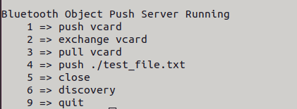

-   Reception via Bluetooth

```Shell showLineNumbers  
    cd /usr/src/rubikpi-bt-demo/  
    mkdir push
    ./app_ops  
    #Type 1 and press Enter  
    #Phone sends file via Bluetooth  
    #After transmission, type 9 and press Enter to quit. The transmitted file is located in the ./push folder
```

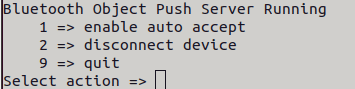

-   Other demos

    All the BT related source code is stored in the following directory of RUBIK Pi 3:*  
    /usr/src/rubikpi-bt-demo/3rdparty/3rdparty/embedded/bsa_examples/linux*. Compile and view the code as needed. The following example shows the compilation method:

```Shell showLineNumbers  
    cd /usr/src/rubikpi-bt-demo/3rdparty/3rdparty/embedded/bsa_examples/linux/<test demo>/build/  
    export ARMGCC=gcc  
    make CPU=arm64  
    cp arm64/<demo executable file> /usr/src/rubikpi-bt-demo/  
    cd /usr/src/rubikpi-bt-demo/  
    #Run the demo
```

## 2.7 Audio

RUBIK Pi 3 supports the following audio interfaces:

-   3.5mm headphone (No. 4 in the following figure)
-   HDMI OUT (No. 9 in the following figure)
-   Bluetooth


### 2.7.1 View the sound card information

-   Run the following command on RUBIK Pi 3 to view the mounted sound cards:

```Shell showLineNumbers  
    cat /proc/asound/cards
```

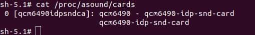

-   Run the following command on RUBIK Pi 3 to view the list of allocated Pulse-Code Modulation (PCM) streams:

```Shell showLineNumbers  
    cat /proc/asound/pcm
```


### 2.7.2 Set the audio output device

Run the following commands on RUBIK Pi 3 to change the audio output source for commands such as gstreamer and paplay:

-   Set the 3.5mm headphone jack as the output interface:

```Shell showLineNumbers  
    pactl set-sink-port 0 headset
```

-   Set the HDMI as the output interface:

```Shell showLineNumbers  
    pactl set-sink-port 0 hdmi
```

### 2.7.3 Playback

-   Run the following command on RUBIK Pi 3 to test headphone playback, put the test audio in the */opt* directory and run the following command to play the test audio:

```Shell showLineNumbers  
    gst-launch-1.0 filesrc location=/opt/test.mp3 ! mpegaudioparse ! mpg123audiodec ! pulsesink
```

-   Run the following command on RUBIK Pi 3 to test HDMI OUT playback, put the test audio in the */opt* directory and run the following commands to play the test audio:

 ```Shell showLineNumbers  
    systemctl stop pulseaudio  
    agmplay /opt/test.wav -D 100 -d 100 -r 48000 -b 16 -c 2 -i MI2S-LPAIF_RXTX-RX-PRIMARY  
    systemctl start pulseaudio
```

-   Run the following command on RUBIK Pi 3 to test Bluetooth playback, enable two terminals.
     
     1. Enable terminal 1:

    ```Shell showLineNumbers  
    cd /usr/src/rubikpi-bt-demo/  
    ./app_manager
    ```

     2. Enable terminal 2:

```Shell showLineNumbers  
    cd /usr/src/rubikpi-bt-demo/  
    ./app_av
```

     a.  Type "2" and press **Enter.** Wait for the Bluetooth headphone to be found.

     b.  Type "6" and press **Enter** to start establishing a connection.

     c.  Type "1" and press **Enter** to connect a recently scanned device.

     d.  Type the dev number of the Bluetooth device you want to connect.

    

-  Return to Terminal 1 and type "13" to accept the pairing.
-  Return to Terminal 2, type "11", and press **Enter**. Select the number of the piece of music you want to play and press **Enter**.

### 2.7.4 Recording

Run the following commands on RUBIK Pi 3 to test the recording function.

-   Headphone recording

```Shell showLineNumbers  
    gst-launch-1.0 -v pulsesrc volume=10 ! audioconvert ! wavenc ! filesink location=/opt/test.wav
```

-   Bluetooth headphone recording. Enable two terminals for testing.
1.  Enable terminal 1:

```Shell showLineNumbers  
    cd /usr/src/rubikpi-bt-demo/  
    ./app_manager
```

2.  Enable terminal 2:

```Shell showLineNumbers  
    cd /usr/src/rubikpi-bt-demo/  
    ./app_ag
```

     a. Type "1" and press **Enter**. Wait for the Bluetooth headphone to be found.

     b. Type "6" and press **Enter** to connect the Bluetooth headphone.

     c. Type "1" and press **Enter** to connect a recently scanned device.

     d. Type the dev number of the Bluetooth device you want to connect.

    

     e. Return to Terminal 1 and type "13" to accept the pairing.

     f. Return to Terminal 2 and type "8" to open the SCO link.

     g. Type "10" and press **Enter** to start recording audio from the Bluetooth headphone's microphone.

     h. Type "11" to stop recording.
     The recorded audio is located at */usr/src/rubikpi-bt-demo/test_files/ag/sco_ag_in.wav*.

### 2.7.5 Volume up/down

-   Adjust the headphone volume

    Run the following commands to obtain and set the volume:

```Shell showLineNumbers  
    tinymix get "DAC Playback Volume"  
    tinymix set "DAC Playback Volume" 192 192
```


-   Adjust the Bluetooth volume

    When playing Bluetooth audios, type "20" in Terminal 2 to select the number of a connection, press **Enter**, and then adjust the volume. The adjustment range is 0 – 100.


## 2.8 Fan

RUBIK Pi 3 is compatible with the [Raspberry Pi Active Cooler.](https://www.raspberrypi.com/products/active-cooler/)


:::warning

When using RUBIK Pi 3 in high-load or high-performance scenarios, use cooling measures to ensure that the performance of the device is stable. Otherwise, performance may fluctuate due to high CPU temperature.
:::

### 2.8.1 Install the fan

1.  Remove the thermal pads on the back of the cooler and cut the following two pads in the shape of SoC and uMCP of RUBIK Pi 3.


The dimensions of the two pieces are about 14 x 12mm and 13 x 11.5mm respectively.

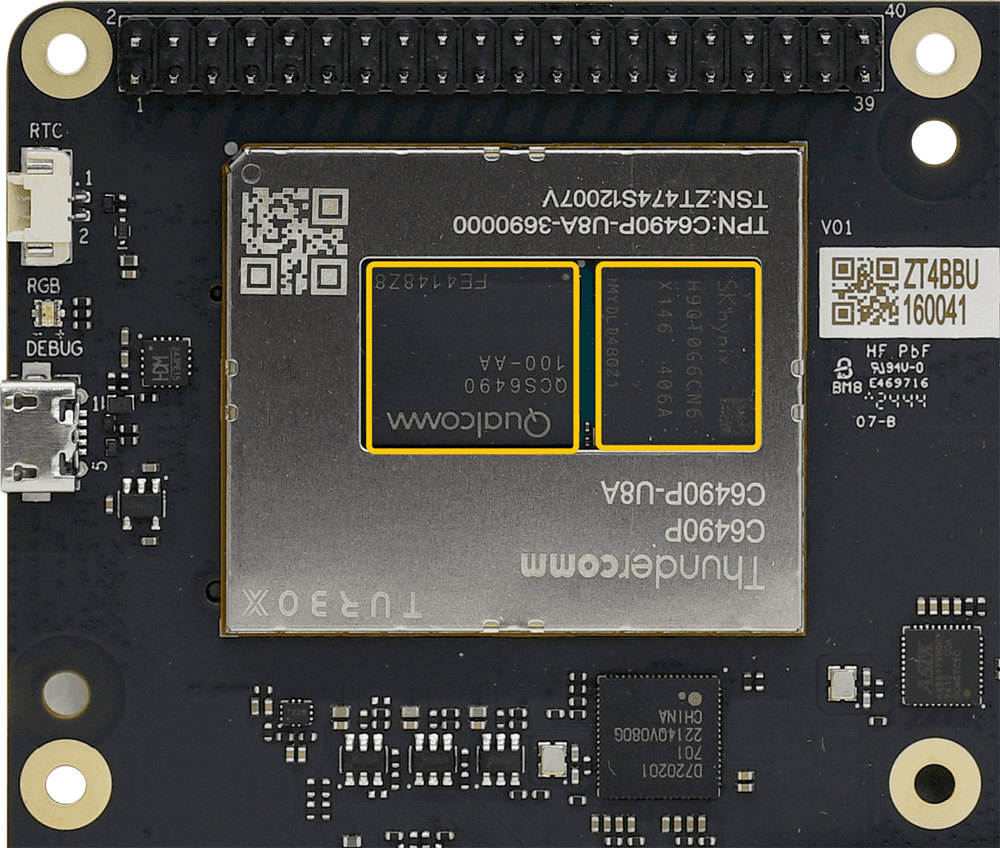

2.  Paste the two thermal pads to the corresponding positions on RUBIK Pi 3.


3.  Install the cooler.


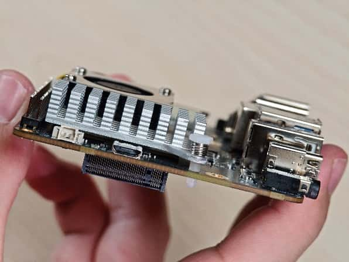

4.  Connect the fan cable.

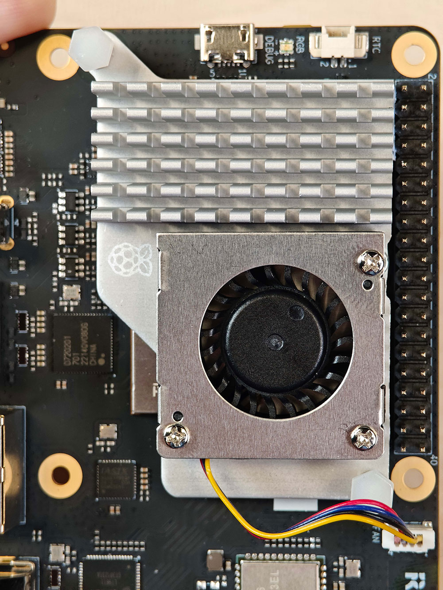

:::danger

We recommend that you do not remove the fan after installing it on the RUBIK Pi 3. Removal will cause the fan's push pins and thermal pads to degrade and may result in product damage. If the push pins are damaged or deformed, or if they do not clip securely, stop using the fan.
:::

### 2.8.2 Control the fan

The fan of RUBIK Pi 3 controls the speed according to the CPU temperature. You can also run the following commands on RUBIK Pi 3 to control the fan speed. 0 and 255 indicate the maximum and minimum speed of the fan respectively.

```Shell showLineNumbers  
echo 100 > /sys/class/hwmon/hwmon29/pwm1
echo 255 > /sys/class/hwmon/hwmon29/pwm1
echo 0 > /sys/class/hwmon/hwmon29/pwm1
```

## 2.9 Ethernet

The Ethernet interface is port 8 in the following figure. RUBIK Pi 3 supports Gigabit Ethernet.


Connect the network cable, as shown in the following figure:


Run the following command to check the network connection on RUBIK Pi 3. As shown in the following figure, the IP has been successfully assigned, indicating that the network connection is successful:


## 2.10 RTC battery connector

The real-time clock (RTC) battery connector is port 1 in the following figure.


Connect the RTC battery as shown in the following figure and write the time into the system hardware clock of RUBIK Pi 3. This way, the system time of RUBIK Pi 3 can be saved even if it is completely powered off.


Write the system time to the system hardware clock on RUBIK Pi 3 as follows:

```Shell showLineNumbers  
date -s "08:00:00 20241201" # Set system time to 08:00, December 1, 2024
hwclock -w # Write system time to system hardware clock
```

## 2.11 M.2 Key M connector

The M.2 Key M connector is connector 18 in the following figure:

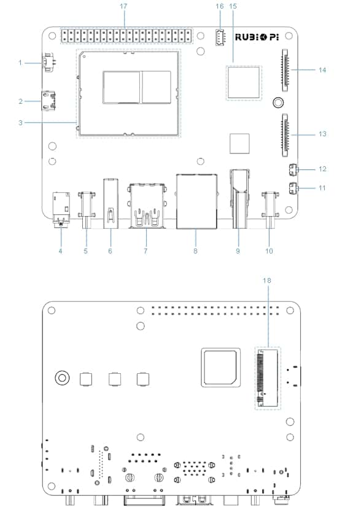

The M.2 Key M connector is compatible with the 2280-sized SSD, as shown in the following figures:

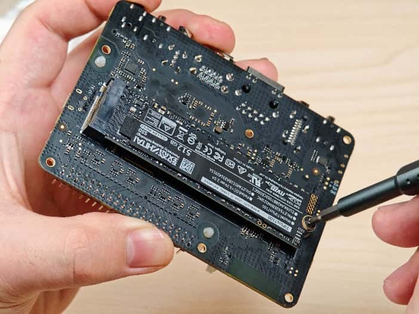

At present, RUBIK Pi 3 does not support automatic mounting of SSDs. Run the following commands on RUBIK Pi 3 to manually mount SSDs.

```Shell showLineNumbers  
mkdir /opt/ssd
mount /dev/nvme0n1 /opt/ssd
```

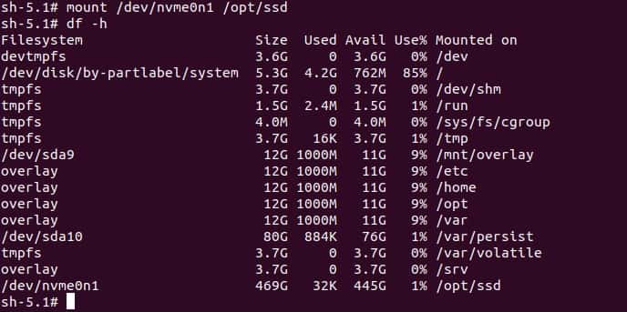

