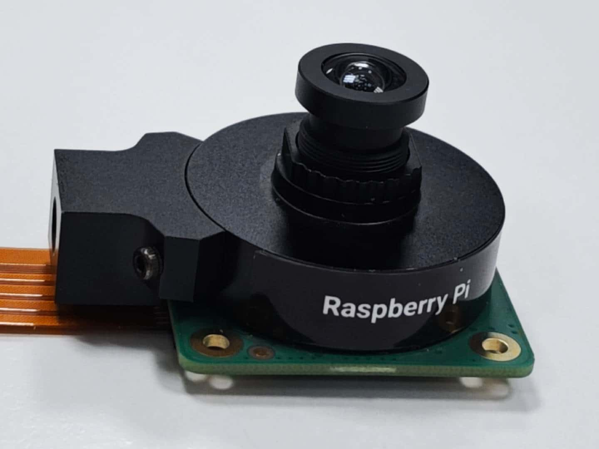

import Tabs from '@theme/Tabs';
import TabItem from '@theme/TabItem';


# 4. Qualcomm IM SDK

Qualcomm IM SDK (Qualcomm's Intelligent Multimedia SDK) is a unified SDK across IOT segments enabling seamless Multimedia and AI/ML application deployment. This SDK utilizes the open-source multimedia framework GStreamer and exposes easy APIs and plug-ins in both multimedia and machine learning domains. These plug-ins allow application developers to create a wide range of multimedia and AI/ML applications in different sectors.

The following example uses Raspberry Pi High Quality Camera (IMX477):

:::info

The IMX477 camera uses the WS1053516 lens.
:::



1.  Visit https://github.com/rubikpi-ai/demo and download *RUBIKPi_QIM_models.zip*.
2.  Decompress the *RUBIKPi_QIM_models.zip* file and run the following commands on your PC to transfer all contents of the folder to RUBIK Pi 3.

```Shell showLineNumbers  
    adb root  
    adb shell mount -o rw,remount /  
    cd RUBIKPi_QIM_models  
    adb push ./* /opt
```

3.  Run the following commands on RUBIK Pi 3 to set the camera parameters.

```Shell showLineNumbers  
    echo multiCameraLogicalXMLFile=kodiak_dc.xml > /var/cache/camera/camxoverridesettings.txt  
    echo enableNCSService=FALSE >> /var/cache/camera/camxoverridesettings.txt  
    export XDG_RUNTIME_DIR=/dev/socket/weston  
    export WAYLAND_DISPLAY=wayland-1  
    setprop persist.overlay.use_c2d_blit 2
```

4.  Run the following command on RUBIK Pi 3 to run the demo.

```Shell showLineNumbers  
    gst-ai-parallel-inference
```

    Or

```Shell showLineNumbers
gst-launch-1.0 -e --gst-debug=1 qtiqmmfsrc name=camsrc camera=0 ! video/x-raw\(memory:GBM\),format=NV12,width=1280,height=720,framerate=30/1 ! queue ! qtivsplit name=split split. ! queue ! qtivcomposer name=mixer1 sink_0::position="<0, 0>" sink_0::dimensions="<960, 540>" sink_1::position="<0, 0>" sink_1::dimensions="<960,540>" ! queue ! waylandsink sync=false x=0 y=0 width=960 height=540 \
split. ! queue ! qtimlvconverter ! queue ! qtimltflite delegate=external external-delegate-path=libQnnTFLiteDelegate.so \
external-delegate-options="QNNExternalDelegate,backend_type=htp;" model=/opt/inceptionv3.tflite ! queue ! qtimlvclassification threshold=40.0 results=2 module=mobilenet labels=/opt/classification.labels ! video/x-raw,format=BGRA,width=960,height=540 ! queue ! mixer1. split. ! queue ! qtivcomposer name=mixer2 sink_0::dimensions="<960,540>"sink_0::position="<0,0>" sink_1::dimensions="<960,540>" sink_1::position="<0,0>" ! \
queue ! waylandsink sync=false x=960 y=0 width=960 height=540 split. ! queue ! qtimlvconverter ! queue ! qtimlsnpe delegate=dsp model=/opt/yolonas.dlc layers="</heads/Mul, /heads/Sigmoid>" ! queue ! qtimlvdetection threshold=40.0 results=10 module=yolo-nas labels=/opt/yolonas.labels ! video/x-raw,format=BGRA,width=960,height=540 ! queue ! mixer2.  \
split. ! queue ! qtivcomposer name=mixer3 sink_0::position="<0, 0>" sink_0::dimensions="<960, 540>" sink_1::position="<0, 0>" sink_1::dimensions="<960,540>" ! queue ! waylandsink sync=false x=0 y=540 width=960 height=540 \
split. ! queue ! qtimlvconverter ! queue ! qtimltflite delegate=external external-delegate-path=libQnnTFLiteDelegate.so \
external-delegate-options="QNNExternalDelegate,backend_type=htp;" model=/opt/posenet_mobilenet_v1.tflite ! queue ! qtimlvpose threshold=51.0 results=2 module=posenet labels=/opt/posenet_mobilenet_v1.labels constants="Posenet,q-offsets=<128.0,128.0,117.0>,q-scales=<0.0784313753247261,0.0784313753247261,1.3875764608383179>;" ! queue ! mixer3. split. ! queue ! qtivcomposer name=mixer4 sink_0::dimensions="<960,540>"sink_0::position="<0,0>" sink_1::dimensions="<960,540>" sink_1::position="<0,0>" sink_1::alpha=0.5 ! \
queue ! waylandsink sync=false x=960 y=540 width=960 height=540 split. ! queue ! qtimlvconverter ! queue ! qtimlsnpe delegate=dsp model=/opt/deeplabv3_resnet50.dlc ! queue ! qtimlvsegmentation module=deeplab-argmax labels=/opt/deeplabv3_resnet50.labels ! queue ! mixer4.
```

    Demo running result:

