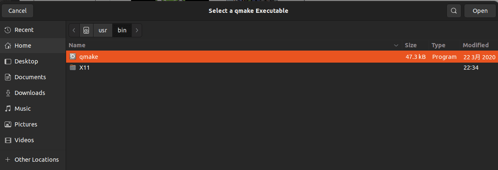
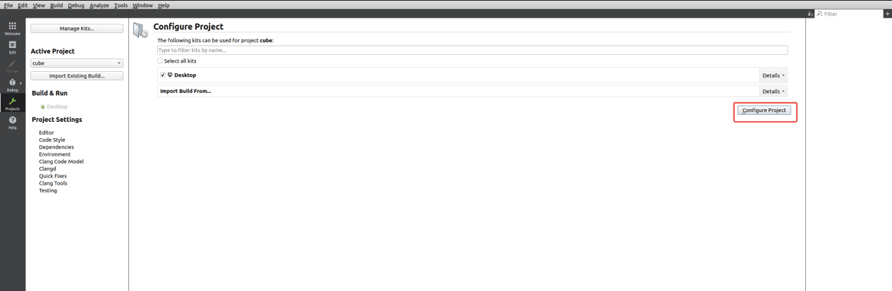
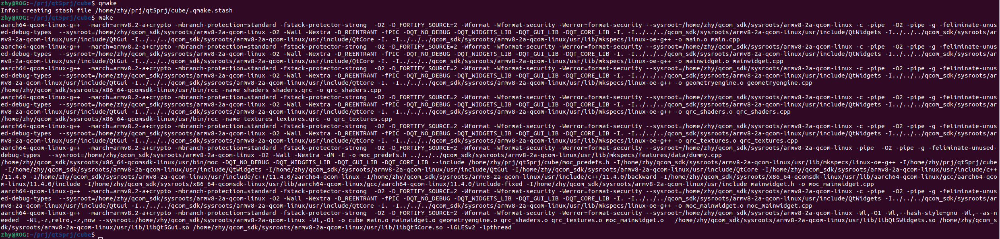

import Tabs from '@theme/Tabs';
import TabItem from '@theme/TabItem';


# 6. QT5 User Guide

## 6.1 Install Qt Creator

The following example illustrates how to install Qt Creator on Ubuntu.

1.  Install the Build Essential package.

```Shell showLineNumbers  
    sudo apt-get install build-essential
```

2.  Install Qt Creator.

```Shell showLineNumbers  
    sudo apt-get install qtcreator
```

3.  Install QT5 related environment.

```Shell showLineNumbers  
    sudo apt-get install qtbase5-dev qtchooser qt5-qmake qtbase5-dev-tools qtbase5-examples qt5-doc qtbase5-doc-html
```

The following applications are displayed after the installation is completed.


## 6.2 Compile Qt programs

1.  Click the Qt Creator icon to enter the application.


2.  Choose **Tools** \> **Options**. In the pop-up window, click **Qt Versions** and click **Add**.


3.  Select **qmake** under */usr/bin*.




4.  Click **Kits**, scroll down, set the **Qt version** to **Qt5.15**, and click **OK**.


5.  Click **Examples**, type "Cube" in the input field, and click **Cube OpenGL ES 2.0 example**.


6.  In the pop-up window, click **Keep Project and Open** or **Copy Project and Open** as needed.


7.  Click **Configure Project** to enter the project.



8.  Click the play icon to run the project.


The project is successfully run. The next step is cross-compilation.


1.  Set up the cross-compilation environment. For details, refer to "1.11.2. Install cross-compilation tools".

```Shell showLineNumbers  
    source <your toolchains directory>/environment-setup-armv8-2a-qcom-linux
```

2.  Go to the project's source directory and execute qmke to generate the Makefile.

```Shell showLineNumbers  
    qmake
```


3.  Run the `qmake` and `make` commands for compilation.



4.  Transfer the compilation artifact to RUBIK Pi 3:


## 6.3 Configure the runtime environment

Qt chooses a default Qt Platform Abstraction (QPA) plug-in based on the platform. Alternatively, set the *QT_QPA_PLATFORM* environment variable or *-platform* command line parameter to select another platform plug-in. Commonly used platform plug-ins include LinuxFB, Wayland, and EGLFS.

-   LinuxFB

    LinuxFB is displayed through Linux Framebuffer Device (FBDEV) which does not support hardware rendering, possibly resulting in poor display performance.

-   Wayland

    Wayland is a display service protocol that does not rely on a client-server architecture and is intended to replace the X Window System with Linux and other Unix-like operating systems. Weston is the implementation reference of the Wayland open-source display protocol.

-   EGLFS

    EGLFS is a GUI system implemented by Qt which does not support multiple windows. EGLFS uses opengles/egl for GPU rendering and then sends signals directly to DRM for display.

    EGLFS is the recommended plug-in for modern Embedded Linux devices that include a GPU.

Use Wayland on RUBIK Pi 3:

```Shell showLineNumbers  
export XDG_RUNTIME_DIR=/dev/socket/weston  
export WAYLAND_DISPLAY=wayland-1  
export QT_QPA_PLATFORM='wayland'  
cd /opt  
./cube
```


## 6.4 PyQt5

RUBIK Pi 3 supports PyQt5. The following example shows an example of PyQt5 demo.

```python showLineNumbers
import sys
from PyQt5.QtWidgets import QApplication, QWidget

app = QApplication(sys.argv)

w = QWidget()
w.resize(550, 500)
w.move(600, 300)
w.setWindowTitle('RUBIK Pi 3 PyQt5 demo title')
w.show()
sys.exit(app.exec_())
```

Transfer *pyqt5.py* to RUBIK Pi 3. For example, use the ADB method.

```python showLineNumbers  
adb push pyqt5.py /opt
```

Run the following commands on RUBIK Pi 3 to run the demo.

```Shell showLineNumbers  
export XDG_RUNTIME_DIR=/dev/socket/weston
export WAYLAND_DISPLAY=wayland-1
export QT_QPA_PLATFORM='wayland'
cd /opt
python3 pyqt5.py
```

The execution result is as follows:


