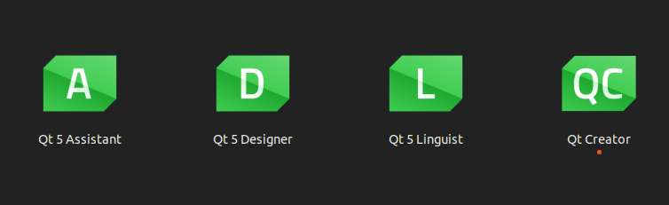
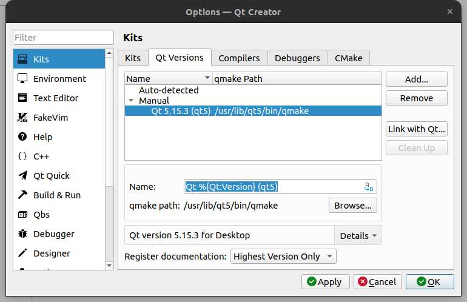
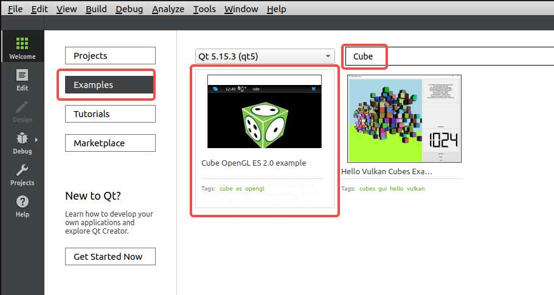
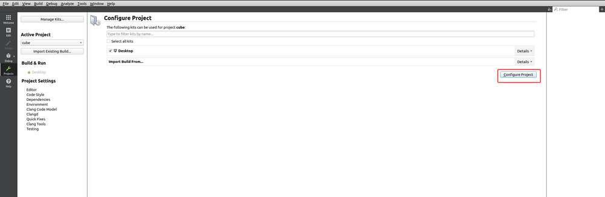
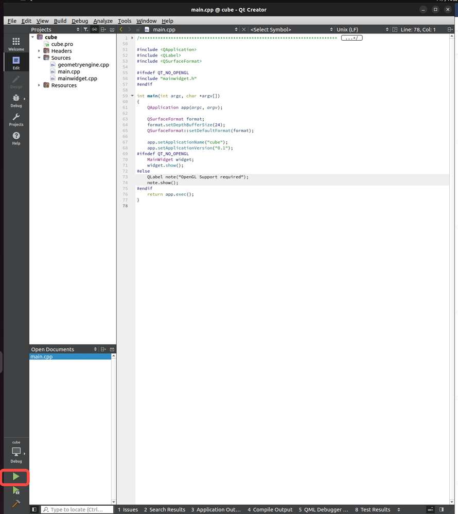
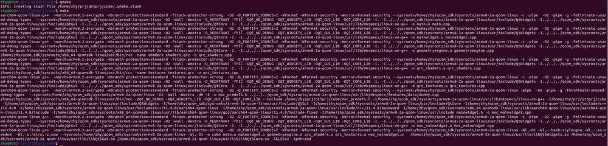
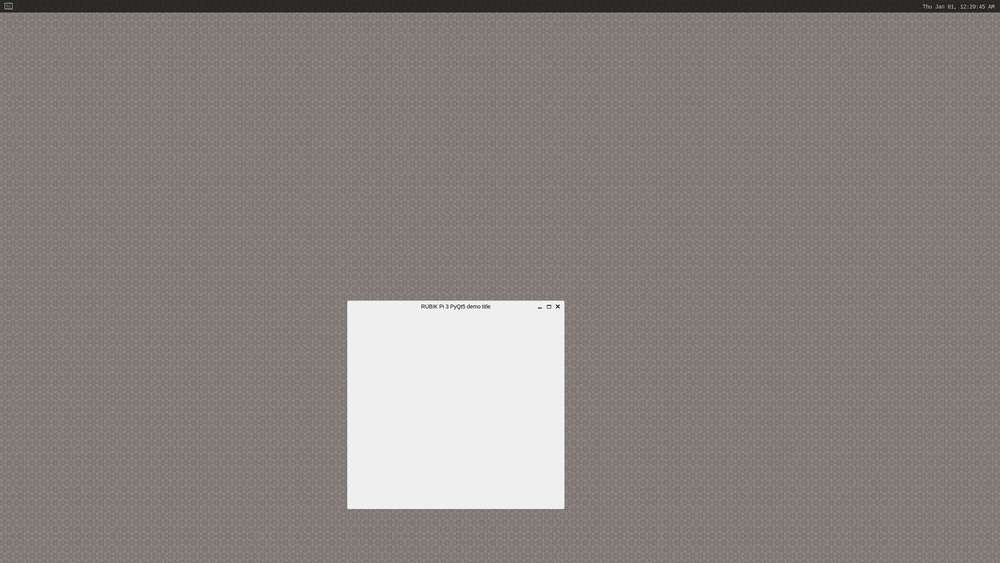

# QT5 使用指南

## 安装 Qt Creator

以 Ubuntu 为例，说明安装方法:

* 安装 Build Essential 软件包

  ```shell
  sudo apt-get install build-essential
  ```

* 安装 Qt Creator

  ```shell
  sudo apt-get install qtcreator
  ```

* 安装 QT5 相关环境

  ```shell
  sudo apt-get install qtbase5-dev qtchooser qt5-qmake qtbase5-dev-tools qtbase5-examples qt5-doc qtbase5-doc-html
  ```

安装完成后显示如下应用图表



## 编译 Qt 程序

1. 点击 Qt Creator 图标，进入应用。


2. 点击**Tools** >**&#x20;Options**，在弹出的窗口中点击 **Qt Versions**，点&#x51FB;**&#x20;Add。**


3. 选择 */usr/bin* 下的 *qmake*。

  



4. 点击 **Kits**，滑动窗口，将 **Qt version** 设置为 Qt5.15.3，点击 **OK。**


5. 点击 **Examples**，在输入栏中输入 Cube， 点&#x51FB;**&#x20;Cube OpenGL ES 2.0 example**。

  

6. 在弹出的窗口中，根据情况，选择 **Keep Project and Open&#x20;**&#x6216; **Copy Project and Open**。


7. 点击 **Configure Project** 进入工程。

  

8. 点击如下图标尝试运行程序。

  

  运行成功， 下面进行交叉编译。


1. 设置交叉编译环境，具体可参考 [安装交叉编译工具](./1.get-started.md#installcrosstool)小节：

   ```shell
   source <your toolchains directory>/environment-setup-armv8-2a-qcom-linux
   ```

2. 进入到项目的源码目录，执行`qmke`生成 *Makefile&#x20;*&#x6587;件：

   ```shell
   qmake
   ```


* 执行`make`命令行编译：

  

* 将编译生成物传输到 RUBIK Pi 3 中：

  

## 运行环境配置

一般 Qt 将根据平台选择一个默认的 QPA (Qt Platform Abstraction）插件，也可以设置 `QT_QPA_PLATFORM` 环境变量或者 `-platform` 命令行参数选择不同的平台插件, 一般使用的平台插件后端有 LinuxFB、Wayland、EGLFS。

* **LinuxFB**
  &#x20;插件通过 Linux 的 FBDEV (Framebuffer Device) 驱动显示，不支持硬件渲染，显示性能可能会不好。

* **Wayland**
  一种显示服务协议，不依赖客户端-服务器体系结构，旨在提供一个现代、 安全的 Linux 和其他类 Unix，取代 X Window system，而 Weston 是 Wayland 开源显示协议的参考实现。

* **EGLFS**
  是 Qt 自己实现的一个 GUI 系统，不支持多窗口，EGLFS 使用 OpenGL ES 或 EGL 进行 GPU 渲染后，直接送给 DRM 去显示。带有 GPU 的嵌入式 Linux 设备推荐使用 EGLFS 插件。

在 RUBIK Pi 3 中推荐使用 Wayland

```shell
export XDG_RUNTIME_DIR=/dev/socket/weston
export WAYLAND_DISPLAY=wayland-1
export QT_QPA_PLATFORM='wayland'
cd /opt
./cube 
```


## PyQt5

RUBIK Pi 3支持 PyQt5，如下是一个 PyQt5 的 Demo。

```python
import sys
from PyQt5.QtWidgets import QApplication, QWidget

app = QApplication(sys.argv)

w = QWidget()
w.resize(550, 500)
w.move(600, 300)
w.setWindowTitle('RUBIK Pi 3 PyQt5 demo title')
w.show()
sys.exit(app.exec_())
```

将 *pyqt5.py&#x20;*&#x4F20;输到板子中，如果使用 ADB 进行传输，命令如下：

```python
adb push pyqt5.py /opt
```

在 RUBIK Pi 3 中使用如下命令运行 demo 程序，执行结果如下所示：

```shell
export XDG_RUNTIME_DIR=/dev/socket/weston
export WAYLAND_DISPLAY=wayland-1
export QT_QPA_PLATFORM='wayland'
cd /opt
python3 pyqt5.py
```

